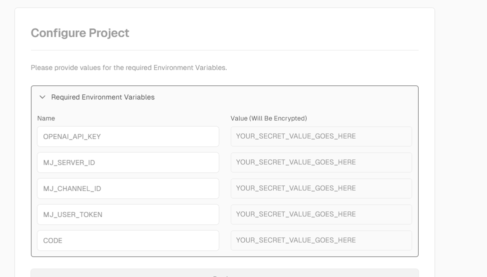
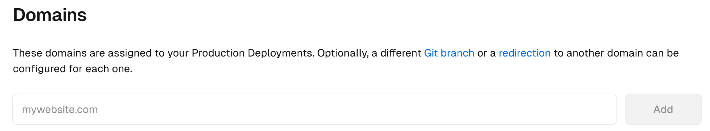

# 自建自己的 GPT 入口

{: .no_toc}

## 目录

{: .no_toc .text-delta }

1. TOC
{:toc}

详见：[https://github.com/Licoy/ChatGPT-Midjourney](https://github.com/Licoy/ChatGPT-Midjourney)

资源需求：

- 自己的 GPT 账号（如果要玩 midjourney，相应需要自己的账号）
- 自己的 github 账号
- 自己的 vercel 账号
- 自己的域名，建议使用自定义域名，访问更快捷

部署流程：

点击下列入口从 vercel 部署，基本是向导式的，会自动克隆仓库到自己的 github，然后再去部署

部署时如果只有 openai 的账号，则只需要填写 OPENAI_API_KEY 和 CODE（用于访问认证的密码），如果要使用 midjourney，可以参考下列文章获取 token、server id 和 channel id：

[https://zhuanlan.zhihu.com/p/639770793](https://zhuanlan.zhihu.com/p/639770793) 

部署完成后可以在 Vercel Domain 位置添加自定义域名，按照提示做好 DNS cname 记录即可（和 git pages 类似）

最终成品：

