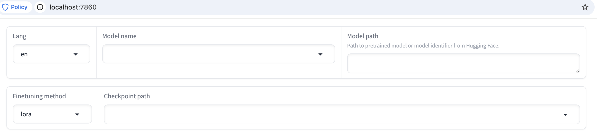
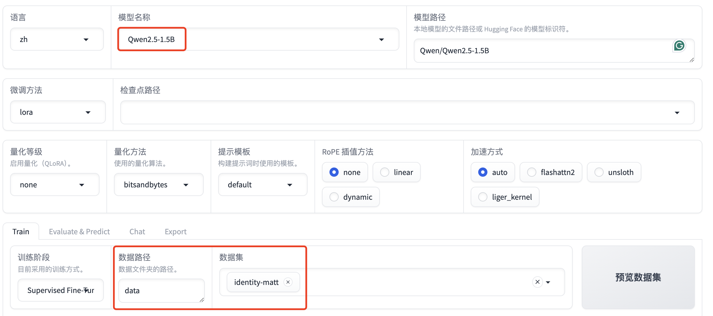

# LLaMA-Factory

{: .no_toc}

## 目录

{: .no_toc .text-delta }


1. TOC
{:toc}


## 环境安装（macOS）

下载：

```shell
git clone --depth 1 https://github.com/hiyouga/LLaMA-Factory.git
cd LLaMA-Factory
```

编辑 setup.py，加入下列行（否则在 mac 下运行会报错）

```shell
# 报错参考
The following error occurred while trying to add or remove files in the
    installation directory:

        [Errno 13] Permission denied: '/Library/Developer/CommandLineTools/Library/Frameworks/Python3.framework/Versions/3.9/lib/python3.9/site-packages/test-easy-install-31335.write-test'

    The installation directory you specified (via --install-dir, --prefix, or
    the distutils default setting) was:

        /Library/Developer/CommandLineTools/Library/Frameworks/Python3.framework/Versions/3.9/lib/python3.9/site-packages/
```


```shell
# 可以补充在 import re 后面
import site
site.ENABLE_USER_SITE=True
```

之后运行下列命令进行安装：

```shell
pip install -e ".[torch,metrics]"
```

官方提到还有下列相关包： torch, torch-npu, metrics, deepspeed, liger-kernel, bitsandbytes, hqq,  eetq, gptq, awq, aqlm, vllm, galore, badam, adam-mini, qwen, modelscope, openmind, quality 。可以用类似方法安装。

### 测试 pytorch

通过 Python 命令行测试是否支持苹果 mps（类似于 NVIDIA CUDA）

```shell
[User@LLaMA-Factory]$ python3
Python 3.9.6 (default, Aug  9 2024, 14:24:13)
[Clang 16.0.0 (clang-1600.0.26.3)] on darwin
Type "help", "copyright", "credits" or "license" for more information.
>>> import torch
>>> torch.backends.mps.is_available()
True
```


## UI 启动

在 LLaMA-Factory 目录下运行 UI 界面。

```shell
~/Library/Python/3.9/bin/llamafactory-cli webui


Running on local URL:  http://0.0.0.0:7860

To create a public link, set `share=True` in `launch()`.
IMPORTANT: You are using gradio version 4.26.0, however version 4.44.1 is available, please upgrade.
```

运行完毕后，系统会自动打开浏览器，出现下列页面（http://localhost:7860/）：



## 微调小试

本文使用 qwen 模型，然后使用 data 目录下的 identity-matt.json 训练数据（将默认的 identity.json 复制后替换了里面的 name 以及 author。dataset_info.json 也需要做相应的修改，将 identity-matt.json 列入清单中）



其他参数保持默认，点击预览命令（mac下直接开始运行会有问题，建议预览命令后，手动执行命令）


最终运行的命令如下（最后一行 --no_cuda true 是针对 Macos 加的）：

```shell
 ~/Library/Python/3.9/bin/llamafactory-cli train \
    --stage sft \
    --do_train True \
    --model_name_or_path Qwen/Qwen2.5-1.5B \
    --preprocessing_num_workers 16 \
    --finetuning_type lora \
    --template default \
    --flash_attn auto \
    --dataset_dir data \
    --dataset identity-matt \
    --cutoff_len 2048 \
    --learning_rate 5e-05 \
    --num_train_epochs 3.0 \
    --max_samples 100000 \
    --per_device_train_batch_size 2 \
    --gradient_accumulation_steps 8 \
    --lr_scheduler_type cosine \
    --max_grad_norm 1.0 \
    --logging_steps 5 \
    --save_steps 100 \
    --warmup_steps 0 \
    --packing False \
    --report_to none \
    --output_dir saves/Qwen2.5-1.5B/lora/train_2024-12-10-20-01-12 \
    --bf16 True \
    --plot_loss True \
    --ddp_timeout 180000000 \
    --include_num_input_tokens_seen True \
    --optim adamw_torch \
    --lora_rank 8 \
    --lora_alpha 16 \
    --lora_dropout 0 \
    --lora_target all \
    --no_cuda true
```


之后就是漫长的等待：

```shell
# device = torch.device("mps")
# device = mps

[INFO|2024-12-10 20:11:40] llamafactory.hparams.parser:355 >> Process rank: 0, device: cpu, n_gpu: 0, distributed training: False, compute dtype: torch.bfloat16
[INFO|configuration_utils.py:733] 2024-12-10 20:11:50,711 >> loading configuration file config.json from cache at /Users/mazhang/.cache/huggingface/hub/models--Qwen--Qwen2.5-1.5B/snapshots/8faed761d45a263340a0528343f099c05c9a4323/config.json
[INFO|configuration_utils.py:800] 2024-12-10 20:11:50,716 >> Model config Qwen2Config {
  "_name_or_path": "Qwen/Qwen2.5-1.5B",
  "architectures": [
    "Qwen2ForCausalLM"
  ],
  "attention_dropout": 0.0,
  "bos_token_id": 151643,
  "eos_token_id": 151643,
  "hidden_act": "silu",
  "hidden_size": 1536,
  "initializer_range": 0.02,
  "intermediate_size": 8960,
  "max_position_embeddings": 131072,
  "max_window_layers": 28,
  "model_type": "qwen2",
  "num_attention_heads": 12,
  "num_hidden_layers": 28,
  "num_key_value_heads": 2,
  "rms_norm_eps": 1e-06,
  "rope_theta": 1000000.0,
  "sliding_window": 131072,
  "tie_word_embeddings": true,
  "torch_dtype": "bfloat16",
  "transformers_version": "4.42.4",
  "use_cache": true,
  "use_mrope": false,
  "use_sliding_window": false,
  "vocab_size": 151936
}

[INFO|tokenization_utils_base.py:2161] 2024-12-10 20:11:51,711 >> loading file vocab.json from cache at /Users/mazhang/.cache/huggingface/hub/models--Qwen--Qwen2.5-1.5B/snapshots/8faed761d45a263340a0528343f099c05c9a4323/vocab.json
[INFO|tokenization_utils_base.py:2161] 2024-12-10 20:11:51,711 >> loading file merges.txt from cache at /Users/mazhang/.cache/huggingface/hub/models--Qwen--Qwen2.5-1.5B/snapshots/8faed761d45a263340a0528343f099c05c9a4323/merges.txt
[INFO|tokenization_utils_base.py:2161] 2024-12-10 20:11:51,711 >> loading file tokenizer.json from cache at /Users/mazhang/.cache/huggingface/hub/models--Qwen--Qwen2.5-1.5B/snapshots/8faed761d45a263340a0528343f099c05c9a4323/tokenizer.json
[INFO|tokenization_utils_base.py:2161] 2024-12-10 20:11:51,711 >> loading file added_tokens.json from cache at None
[INFO|tokenization_utils_base.py:2161] 2024-12-10 20:11:51,711 >> loading file special_tokens_map.json from cache at None
[INFO|tokenization_utils_base.py:2161] 2024-12-10 20:11:51,712 >> loading file tokenizer_config.json from cache at /Users/mazhang/.cache/huggingface/hub/models--Qwen--Qwen2.5-1.5B/snapshots/8faed761d45a263340a0528343f099c05c9a4323/tokenizer_config.json
[WARNING|logging.py:313] 2024-12-10 20:11:51,819 >> Special tokens have been added in the vocabulary, make sure the associated word embeddings are fine-tuned or trained.
[INFO|configuration_utils.py:733] 2024-12-10 20:11:52,916 >> loading configuration file config.json from cache at /Users/mazhang/.cache/huggingface/hub/models--Qwen--Qwen2.5-1.5B/snapshots/8faed761d45a263340a0528343f099c05c9a4323/config.json
[INFO|configuration_utils.py:800] 2024-12-10 20:11:52,918 >> Model config Qwen2Config {
  "_name_or_path": "Qwen/Qwen2.5-1.5B",
  "architectures": [
    "Qwen2ForCausalLM"
  ],
  "attention_dropout": 0.0,
  "bos_token_id": 151643,
  "eos_token_id": 151643,
  "hidden_act": "silu",
  "hidden_size": 1536,
  "initializer_range": 0.02,
  "intermediate_size": 8960,
  "max_position_embeddings": 131072,
  "max_window_layers": 28,
  "model_type": "qwen2",
  "num_attention_heads": 12,
  "num_hidden_layers": 28,
  "num_key_value_heads": 2,
  "rms_norm_eps": 1e-06,
  "rope_theta": 1000000.0,
  "sliding_window": 131072,
  "tie_word_embeddings": true,
  "torch_dtype": "bfloat16",
  "transformers_version": "4.42.4",
  "use_cache": true,
  "use_mrope": false,
  "use_sliding_window": false,
  "vocab_size": 151936
}

[INFO|tokenization_utils_base.py:2161] 2024-12-10 20:11:53,189 >> loading file vocab.json from cache at /Users/mazhang/.cache/huggingface/hub/models--Qwen--Qwen2.5-1.5B/snapshots/8faed761d45a263340a0528343f099c05c9a4323/vocab.json
[INFO|tokenization_utils_base.py:2161] 2024-12-10 20:11:53,190 >> loading file merges.txt from cache at /Users/mazhang/.cache/huggingface/hub/models--Qwen--Qwen2.5-1.5B/snapshots/8faed761d45a263340a0528343f099c05c9a4323/merges.txt
[INFO|tokenization_utils_base.py:2161] 2024-12-10 20:11:53,190 >> loading file tokenizer.json from cache at /Users/mazhang/.cache/huggingface/hub/models--Qwen--Qwen2.5-1.5B/snapshots/8faed761d45a263340a0528343f099c05c9a4323/tokenizer.json
[INFO|tokenization_utils_base.py:2161] 2024-12-10 20:11:53,190 >> loading file added_tokens.json from cache at None
[INFO|tokenization_utils_base.py:2161] 2024-12-10 20:11:53,190 >> loading file special_tokens_map.json from cache at None
[INFO|tokenization_utils_base.py:2161] 2024-12-10 20:11:53,190 >> loading file tokenizer_config.json from cache at /Users/mazhang/.cache/huggingface/hub/models--Qwen--Qwen2.5-1.5B/snapshots/8faed761d45a263340a0528343f099c05c9a4323/tokenizer_config.json
[WARNING|logging.py:313] 2024-12-10 20:11:53,287 >> Special tokens have been added in the vocabulary, make sure the associated word embeddings are fine-tuned or trained.
[INFO|2024-12-10 20:11:53] llamafactory.data.loader:157 >> Loading dataset identity-matt.json...
training example:
input_ids:
[33975, 25, 15588, 198, 71703, 25, 9707, 0, 358, 1079, 6567, 247, 118, 99884, 15469, 11, 458, 15235, 17847, 7881, 553, 13374, 13, 2585, 646, 358, 7789, 498, 3351, 30, 151643]
inputs:
Human: hi
Assistant:Hello! I am 智障AI, an AI assistant developed by Matt. How can I assist you today?<|endoftext|>
label_ids:
[-100, -100, -100, -100, -100, -100, 9707, 0, 358, 1079, 6567, 247, 118, 99884, 15469, 11, 458, 15235, 17847, 7881, 553, 13374, 13, 2585, 646, 358, 7789, 498, 3351, 30, 151643]
labels:
Hello! I am 智障AI, an AI assistant developed by Matt. How can I assist you today?<|endoftext|>
[INFO|configuration_utils.py:733] 2024-12-10 20:11:54,886 >> loading configuration file config.json from cache at /Users/mazhang/.cache/huggingface/hub/models--Qwen--Qwen2.5-1.5B/snapshots/8faed761d45a263340a0528343f099c05c9a4323/config.json
[INFO|configuration_utils.py:800] 2024-12-10 20:11:54,890 >> Model config Qwen2Config {
  "_name_or_path": "Qwen/Qwen2.5-1.5B",
  "architectures": [
    "Qwen2ForCausalLM"
  ],
  "attention_dropout": 0.0,
  "bos_token_id": 151643,
  "eos_token_id": 151643,
  "hidden_act": "silu",
  "hidden_size": 1536,
  "initializer_range": 0.02,
  "intermediate_size": 8960,
  "max_position_embeddings": 131072,
  "max_window_layers": 28,
  "model_type": "qwen2",
  "num_attention_heads": 12,
  "num_hidden_layers": 28,
  "num_key_value_heads": 2,
  "rms_norm_eps": 1e-06,
  "rope_theta": 1000000.0,
  "sliding_window": 131072,
  "tie_word_embeddings": true,
  "torch_dtype": "bfloat16",
  "transformers_version": "4.42.4",
  "use_cache": true,
  "use_mrope": false,
  "use_sliding_window": false,
  "vocab_size": 151936
}

model.safetensors:   2%|██▋                                                                                                                                                              | 52.4M/3.09G [00:00<?, ?B/s]


Error while downloading from https://cdn-lfs-us-1.hf.co/repos/f7/25/f7250b5742008200b56d6d058bff9694c6e0aeb302029ab17127bc042b8f0bb2/a961db72e75d52b18e6b0c9d379e51a26973b233385e0e127fdda7d648aec796?response-content-disposition=inline%3B+filename*%3DUTF-8%27%27model.safetensors%3B+filename%3D%22model.safetensors%22%3B&Expires=1734091915&Policy=eyJTdGF0ZW1lbnQiOlt7IkNvbmRpdGlvbiI6eyJEYXRlTGVzc1RoYW4iOnsiQVdTOkVwb2NoVGltZSI6MTczNDA5MTkxNX19LCJSZXNvdXJjZSI6Imh0dHBzOi8vY2RuLWxmcy11cy0xLmhmLmNvL3JlcG9zL2Y3LzI1L2Y3MjUwYjU3NDIwMDgyMDBiNTZkNmQwNThiZmY5Njk0YzZlMGFlYjMwMjAyOWFiMTcxMjdiYzA0MmI4ZjBiYjIvYTk2MWRiNzJlNzVkNTJiMThlNmIwYzlkMzc5ZTUxYTI2OTczYjIzMzM4NWUwZTEyN2ZkZGE3ZDY0OGFlYzc5Nj9yZXNwb25zZS1jb250ZW50LWRpc3Bvc2l0aW9uPSoifV19&Signature=bgs3kb0hiTMYHRCkHpjxNYPWk4qWWI6a%7EPpjQeWBZyRwwLUH-8tKGWzws1NTEZYKSh5eIckZ-i11uCjEUmQcm23bUpo%7EFHOnXWo6GFGz%7EmqkECyFhK%7EClrCzPodIfwJQAOowmaVRUI%7E8%7Eioi1cEwlRSPC35AgpsWhyweiHuaytW3PoAX4HhdJQSyJBpNiPlbi8tR7YShU0YnBgB4wsaJ8ssnPhnTw2FKYq-7CfqIzwemn77ulUMpv4JuqYJ1Ulr0XKt7lOqNVUSsxyqxEd-uCd1mAgNn%7EpQvmwsH0dPDQgP6LFoShXfD%7EtivgPel5R0AVMOuk8R6LxdKuoYKLD4-xA__&Key-Pair-Id=K24J24Z295AEI9: HTTPSConnectionPool(host='cdn-lfs-us-1.hf.co', port=443): Read timed out.
Trying to resume download...
                                                                                                                                                                                                                     Error while downloading from https://cdn-lfs-us-1.hf.co/repos/f7/25/f7250b5742008200b56d6d058bff9694c6e0aeb302029ab17127bc042b8f0bb2/a961db72e75d52b18e6b0c9d379e51a26973b233385e0e127fdda7d648aec796?response-content-disposition=inline%3B+filename*%3DUTF-8%27%27model.safetensors%3B+filename%3D%22model.safetensors%22%3B&Expires=1734091915&Policy=eyJTdGF0ZW1lbnQiOlt7IkNvbmRpdGlvbiI6eyJEYXRlTGVzc1RoYW4iOnsiQVdTOkVwb2NoVGltZSI6MTczNDA5MTkxNX19LCJSZXNvdXJjZSI6Imh0dHBzOi8vY2RuLWxmcy11cy0xLmhmLmNvL3JlcG9zL2Y3LzI1L2Y3MjUwYjU3NDIwMDgyMDBiNTZkNmQwNThiZmY5Njk0YzZlMGFlYjMwMjAyOWFiMTcxMjdiYzA0MmI4ZjBiYjIvYTk2MWRiNzJlNzVkNTJiMThlNmIwYzlkMzc5ZTUxYTI2OTczYjIzMzM4NWUwZTEyN2ZkZGE3ZDY0OGFlYzc5Nj9yZXNwb25zZS1jb250ZW50LWRpc3Bvc2l0aW9uPSoifV19&Signature=bgs3kb0hiTMYHRCkHpjxNYPWk4qWWI6a%7EPpjQeWBZyRwwLUH-8tKGWzws1NTEZYKSh5eIckZ-i11uCjEUmQcm23bUpo%7EFHOnXWo6GFGz%7EmqkECyFhK%7EClrCzPodIfwJQAOowmaVRUI%7E8%7Eioi1cEwlRSPC35AgpsWhyweiHuaytW3PoAX4HhdJQSyJBpNiPlbi8tR7YShU0YnBgB4wsaJ8ssnPhnTw2FKYq-7CfqIzwemn77ulUMpv4JuqYJ1Ulr0XKt7lOqNVUSsxyqxEd-uCd1mAgNn%7EpQvmwsH0dPDQgP6LFoShXfD%7EtivgPel5R0AVMOuk8R6LxdKuoYKLD4-xA__&Key-Pair-Id=K24J24Z295AEI9: HTTPSConnectionPool(host='cdn-lfs-us-1.hf.co', port=443): Read timed out.
Trying to resume download...


model.safetensors:   7%|██████████▍
```

macos 支持：

```
#!/Library/Developer/CommandLineTools/usr/bin/python3
# EASY-INSTALL-ENTRY-SCRIPT: 'llamafactory','console_scripts','llamafactory-cli'
import re
import sys
import torch
assert torch.backends.mps.is_available() is True
```


## 参考文章

[https://ascend.github.io/docs/sources/llamafactory/example.html](https://ascend.github.io/docs/sources/llamafactory/example.html)

[https://github.com/hiyouga/LLaMA-Factory](https://github.com/hiyouga/LLaMA-Factory)

https://github.com/hiyouga/LLaMA-Factory/wiki/Environment

