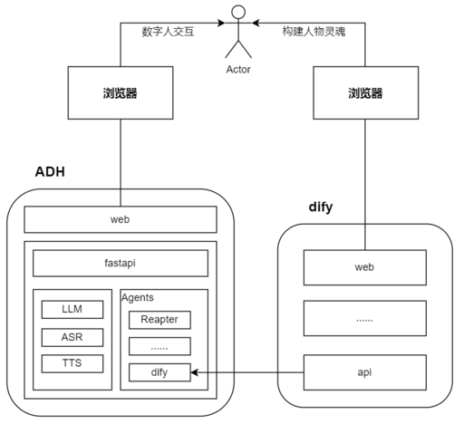
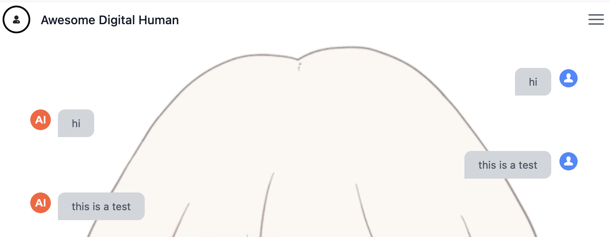
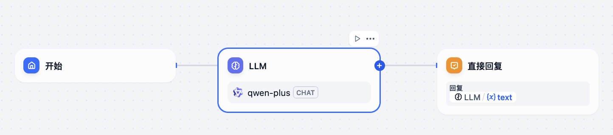
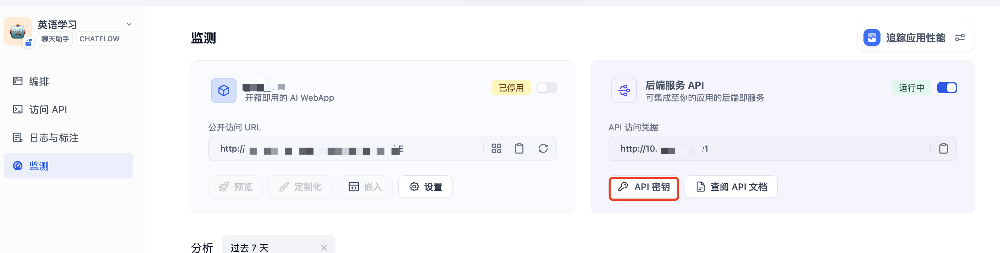
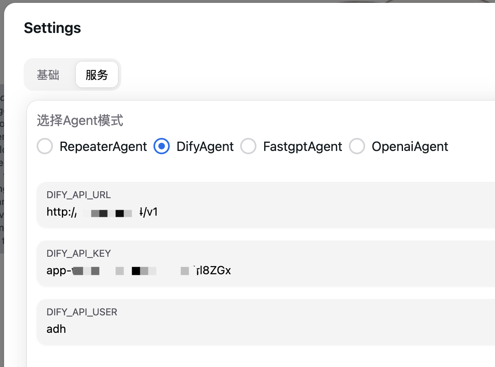
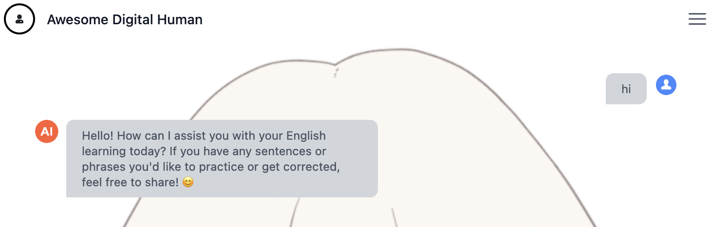
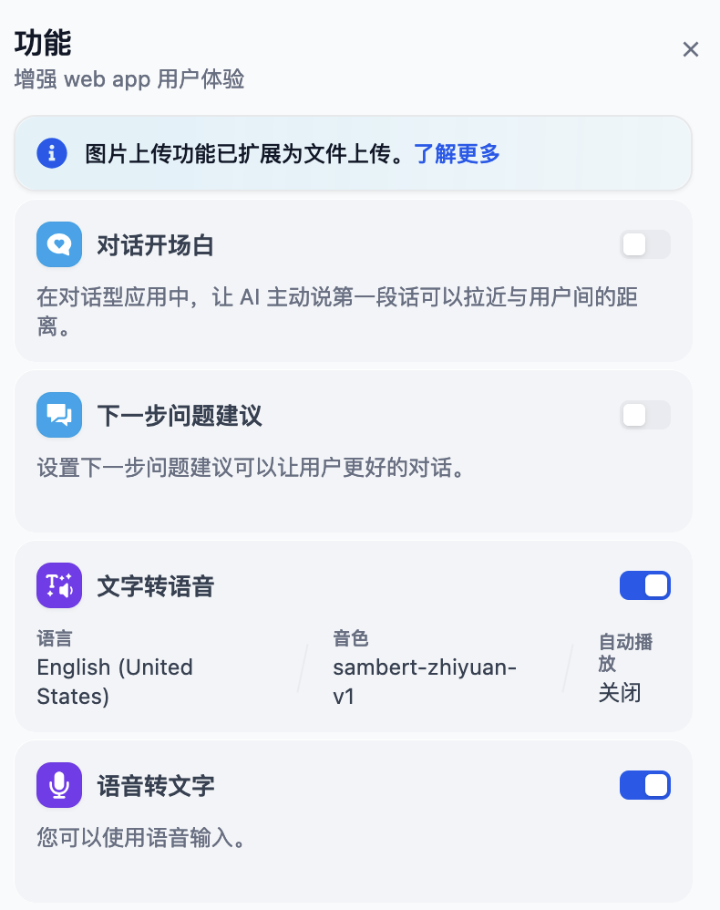
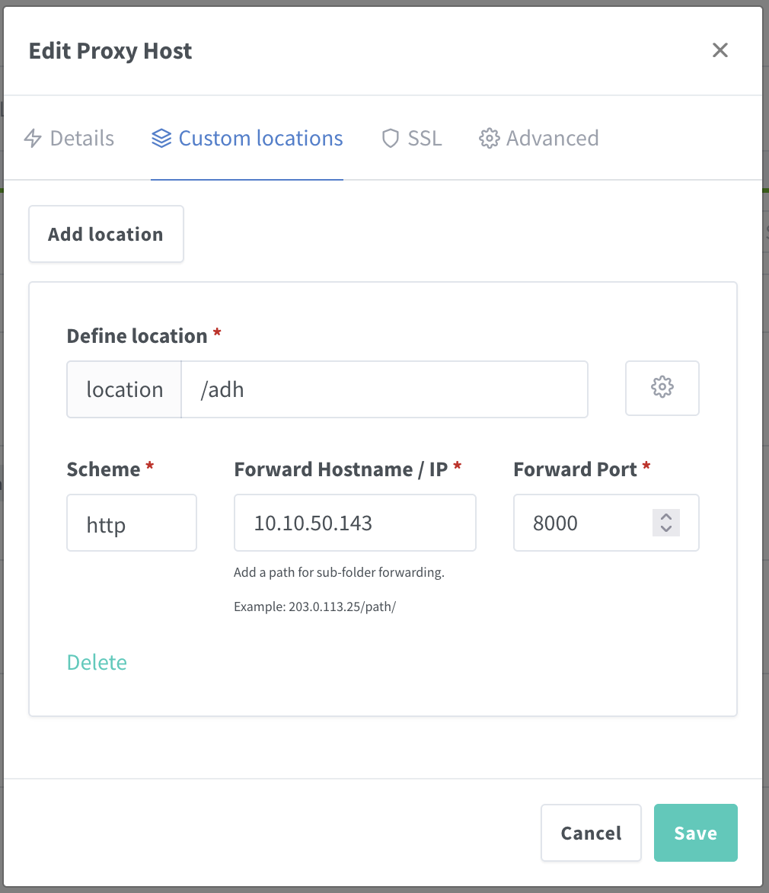

# Dify 数字人对接

{: .no_toc}

## 目录

{: .no_toc .text-delta }


1. TOC
{:toc}

## 概述

群里看到有人推荐了个数字人的项目尝试了下，记录下使用和配置过程。

项目地址：

[https://github.com/wan-h/awesome-digital-human-live2d/tree/main](https://github.com/wan-h/awesome-digital-human-live2d/tree/main)

## 架构介绍

官方有这样的一个架构图，大致结构如下：

- ADH 部署：会有两个容器，web 以及 API
  - Web 默认使用 3000 端口 HTTP 协议暴露（基于 Next.js）
  - API 使用 8000 暴露，需要暴露 WSS（用于心跳）以及 HTTP
- Dify：通常是 ADH 直接和 Dify API 服务通信，不会有用户到 Dify 的访问。如果 Dify 和 ADH 在同一个内网，ADH 可以直接调用 Dify 内网的 IP。




## 安装

参考文档：[https://github.com/wan-h/awesome-digital-human-live2d/blob/main/docs/deploy_instrction.md](https://github.com/wan-h/awesome-digital-human-live2d/blob/main/docs/deploy_instrction.md)


### 默认模式安装及配置

Docker 方式安装：

```shell
# 下载源码
git clone https://github.com/wan-h/awesome-digital-human-live2d.git

# 项目根目录下执行
docker compose -f docker-compose-quickStart.yaml up -d
```


默认安装后，ADH 使用 repeater 模式（默认的测试模式），当用户输入内容的时候，系统会自动将用户输入的内容转换成语音再回过来。使用效果如下：



ADH 后台默认用的是微软的 [edge-tts 服务（](https://github.com/rany2/edge-tts/)免费的），默认使用中文 zh-CN-XiaoxiaoNeural 语音包，可以按需修改（参见“自定义声音”）。

#### 添加 Dify 后端

如果需要和数字人进行对话，则需要配置后端，在 UI 中可以通过下列位置配置。

此处和 Dify 的 Chatflow 进行对接。

Dify 侧 Chatflow 示意：



在此处获取 dify 对接 API key：



返回 ADH，在设置>服务中填写 DifyAgent 相关信息：



测试：



#### 自定义声音

可以通过调整此配置 `configs/engines/tts/edgeAPI.yaml`，修改 PER 参数（下面使用的是 en-US-JennyNeural）。

更多支持的声音清单见：[https://learn.microsoft.com/zh-cn/azure/ai-services/speech-service/language-support?tabs=tts](https://learn.microsoft.com/zh-cn/azure/ai-services/speech-service/language-support?tabs=tts)，经过测试单语言可以正常工作，但是Multilingua 的会有问题。

具体的配置示例：

```shell
NAME: "EdgeAPI"
VERSION: "v0.0.1"
PER: "en-US-JennyNeural"
#PER: "zh-CN-XiaoxiaoNeural"
RATE: "+0%"
VOL: "+0%"
PIT: "+0Hz"
```

修改完成后，需要 `docker compose down`停止容器，然后再`docker compose -f docker-compose-quickStart.yaml up -d`启动容器。


### All in Dify 相关配置

All in Dify 模式是指 TTS（文字转语音）以及 Speechtotext（语音转文字）均由 Dify 来实现。

Dify 侧的 Chatflow 等需要先开启语音相关的设置，比如（📢注意不要开启自动播放功能）：



接着进行部署：

```shell
# 进到 ADH 源码目录
cd awesome-digital-human-live2d
# 使用 all in dify 配置文件，默认使用 config_template.yaml 配置文件
cd configs
cp config_all_in_dify.yaml config.yaml
cd ..
docker compose -f docker-compose-quickStart.yaml up -d
```


#### difyTTS.py 微调

默认 difyTTS.py 有个 bug，需要进入容器修改脚本，删除第 47 行：

`docker ps` 获取 adh-api 容器的 id，进入容器：

```
docker exec -it ceb570f80abc bash
```

编辑 difyTTS.py， 删除第 47 行，调整第 48 行的缩进。

`vi digitalHuman/engine/tts/difyTTS.py`

```shell
#            async with self.asyncLock:
            resp = await httpxAsyncClient.post(API_URL + "/text-to-audio", json=payload, headers=headers)
```

重启 adh API 服务：`docker compose restart adh_server`

### 将 dify 作为默认服务

使用默认配置部署完 adh 后，每个会话都需要填写 dify 的 key，如果是内部使用，可以通过修改配置文件将 dify 配置固化，并设置为默认，具体有两处需要修改：

1. 修改 difyAgent.yaml，填写默认的 URL 和 key：`vi configs/agents/difyAgent.yaml` 

```yaml
NAME: "DifyAgent"
VERSION: "v0.0.1"
# 暴露给前端的参数选项以及默认值
PARAMETERS: [
  {
    NAME: "DIFY_API_URL",
    DEFAULT: "http://10.x.x.x/v1"
  },
  {
    NAME: "DIFY_API_KEY",
    DEFAULT: "app-xxxxxxxxxx"
  },
  {
    NAME: "DIFY_API_USER",
    DEFAULT: "adh"
  }
]
```

2. 修改 config.yaml，在 Agents 中将默认的  repeaterAgent.yaml 改为 difyAgent.yaml ：` vi configs/config.yaml`

```yaml
COMMON:
  NAME: "Awesome-Digital-Human"
  VERSION: "v0.0.1"
  LOG_LEVEL: "DEBUG"
SERVER:
  IP: "0.0.0.0"
  PORT: 8000
  ENGINES:
    ASR:
      SUPPORT_LIST: [ "baiduAPI.yaml", "googleAPI.yaml", "difyAPI.yaml" ]
      DEFAULT: "googleAPI.yaml"
    LLM:
      SUPPORT_LIST: [ "openaiAPI.yaml", "baiduAPI.yaml" ]
      DEFAULT: "openaiAPI.yaml"
    TTS:
      SUPPORT_LIST: [ "edgeAPI.yaml", "baiduAPI.yaml", "difyAPI.yaml" ]
      DEFAULT: "edgeAPI.yaml"
  AGENTS:
    SUPPORT_LIST: [ "repeaterAgent.yaml", "difyAgent.yaml", "fastgptAgent.yaml", "openaiAgent.yaml" ]
    DEFAULT: "difyAgent.yaml"
~
```


### 为 ADH 配置反向代理

参考文档：[https://github.com/wan-h/awesome-digital-human-live2d/blob/main/docs/Q%26A.md](https://github.com/wan-h/awesome-digital-human-live2d/blob/main/docs/Q%26A.md)


默认前端使用 3000 端口，调用后端使用 8000 端口，配置反向代理时需要基于 path 分别将请求发送到两个服务，具体的配置如下：

- 默认路径的请求发送给 web 的 3000 端口
- /adh 路径发送给 api 的 8000 端口
- 开启 websocket 功能（心跳）


具体配置如下：

```shell
# 获取 web 容器的 id：
docker ps
94976c84a1b9 registry.cn-hangzhou.aliyuncs.com/awesome-digital-human/adh-web:main-latest
```

```shell
# 进入容器，修改 .env 文件
docker exec -it 94976c84a1b9 sh

/workspace # vi .env

# 将协议从 http 修改为 https，端口从 8000 修改为 443

# 运行下列命令重新 build
/workspace # pnpm build

> web@0.1.0 build /workspace
> next build
...
# 等待完成后退出容器
```

重启容器：

`docker compose restart adh_web`

对应的 Nginx 配置（此处使用 Nginx Proxy Manager）：




如果需要此配置持久化，建议使用[此部署模式](https://github.com/wan-h/awesome-digital-human-live2d/blob/main/docs/deploy_instrction.md#%E5%AE%B9%E5%99%A8%E9%83%A8%E7%BD%B2%E5%AE%B9%E5%99%A8%E5%BC%80%E5%8F%91%E9%A6%96%E9%80%89)。
