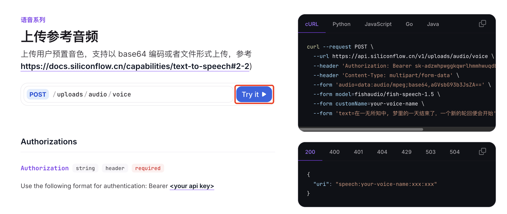
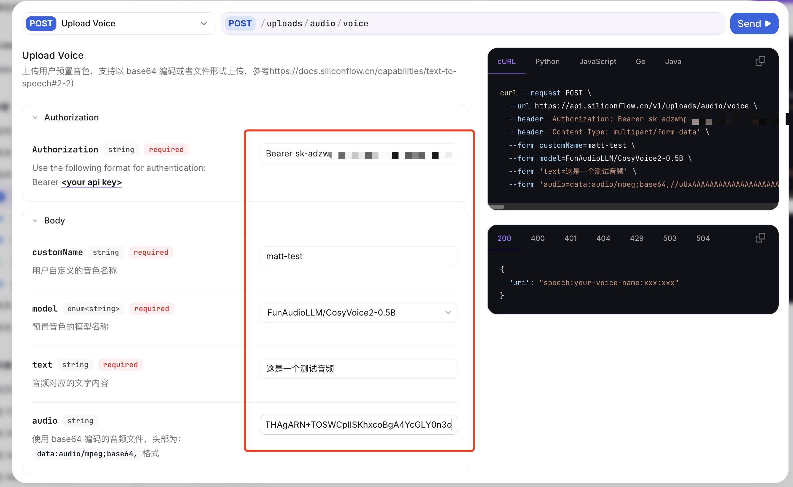
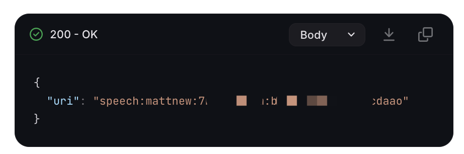
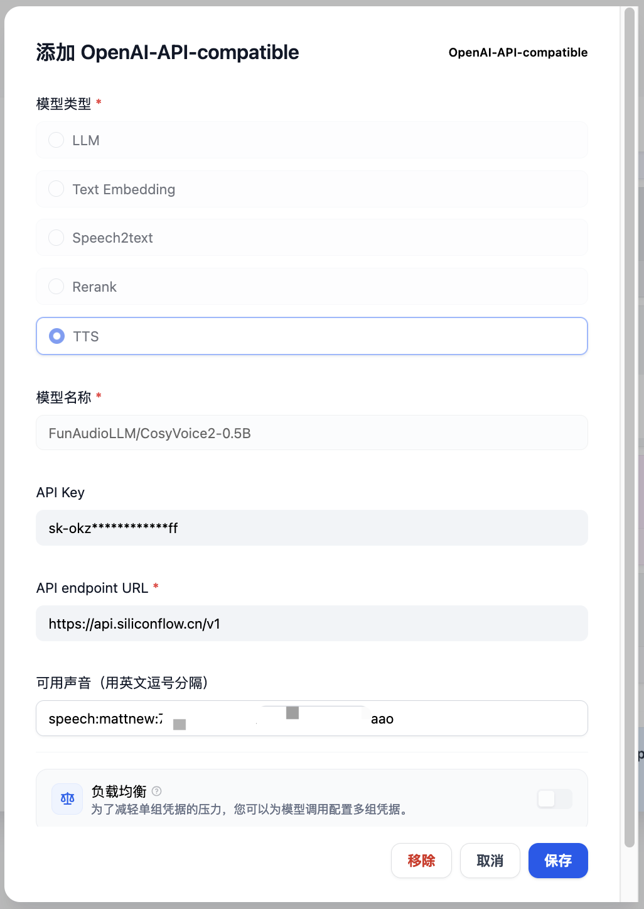
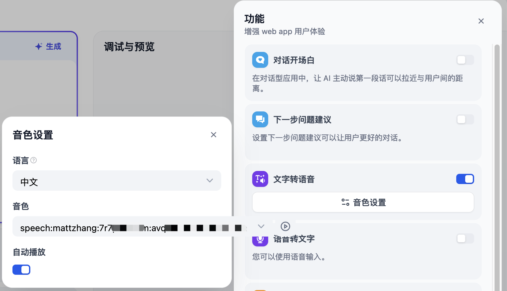

# 自定义声音（TTS）

{: .no_toc}

## 目录

{: .no_toc .text-delta }


1. TOC
{:toc}

## 概述

群里看到有人推荐了阿里出品的 Cosyvoice，支持进行声音克隆，试了下效果还可以，此处记录下过程。


## 前提条件

开通通义大模型，获得 Access key。一般是 sk 开头


## 克隆声音，获取 voice id

参考文档：

[https://help.aliyun.com/zh/model-studio/developer-reference/quick-start-cosyvoice?spm=a2c4g.11186623.help-menu-2400256.d_3_3_6_0.38c853cfeGi75V](https://help.aliyun.com/zh/model-studio/developer-reference/quick-start-cosyvoice?spm=a2c4g.11186623.help-menu-2400256.d_3_3_6_0.38c853cfeGi75V)

代码参考：

```python
import os
import dashscope
from dashscope.audio.tts_v2 import VoiceEnrollmentService, SpeechSynthesizer

# 如果您没有配置环境变量，请在此处用您的API-KEY进行替换
dashscope.api_key = "sk-afxxxx51e94"

# 需要将音频文件上传到一个公网可访问的位置，此处使用 gitee 存放文件
url = "https://gitee.com/test/test/raw/master/Untitled.mp3"  
model = "cosyvoice-v1"
prefix = 'prefix'
target_model = "cosyvoice-v1"

# 创建语音注册服务实例
service = VoiceEnrollmentService()

# 调用create_voice方法复刻声音，并生成voice_id
voice_id = service.create_voice(target_model=target_model, prefix=prefix, url=url)
print("requestId: ", service.get_last_request_id())
print(f"your voice id is {voice_id}")

# 使用复刻的声音进行语音合成
synthesizer = SpeechSynthesizer(model=target_model, voice=voice_id)
audio = synthesizer.call("今天天气怎么样？")
print("requestId: ", synthesizer.get_last_request_id())

# 将合成的音频文件保存到本地文件
with open("output.mp3", "wb") as f:
    f.write(audio)
# 运行完成后，脚本会返回 your voice id is cosyvoice-prefix-007axxxx4e7，记录此值
```

## 使用自定义声音生成音频

参考代码：

```python
# coding=utf-8

import dashscope
from dashscope.audio.tts_v2 import *

dashscope.api_key = "sk-afe7622fb8xxx15184f51e94"
model = "cosyvoice-v1"
# voice = "longxiaochun"
# 使用上面获得的 voice id
voice = "cosyvoice-prefix-007axxxx4e7"

synthesizer = SpeechSynthesizer(model=model, voice=voice)

audio = synthesizer.call("这个环境采用业内效果最好的文本转语音 api 只需要上传 30s 左右的音频跟对应的文本，然后就可以实现文本转语音的转换，超逼真，快来试试吧")
print('requestId: ', synthesizer.get_last_request_id())
with open('output.mp3', 'wb') as f:
    f.write(audio)
```

产生的音频文件会放在当前目录下` output.mp3`

## Siliconflow

siliconflow 也提供了 Cosyvoice 的 API，且兼容 OpenAI API 标准。相比阿里的兼容性更好一些。

参考文档：

[https://docs.siliconflow.cn/api-reference/audio/upload-voice](https://docs.siliconflow.cn/api-reference/audio/upload-voice)

### 前提准备

准备一个 10~20s 的参考音频，需要有对应的文字。格式建议 mp3。

### 上传自定义声音

官方有 API 示例，但是建议直接使用 UI 的 Try it 来上传。



按实际情况填写下列参数，然后点击 Send。



在成功后，右上角的框中会输出 voice id，比如`speech:mattzhang:7r7pwxxxm:avxxxhoa`，记录此值，未来会用到。



### 在 Dify 中添加 OpenAI-API-compatible TTS API

在设置>模型提供商中添加 OpenAI-API-compatible，类型选择 TTS，然后填写模型名称、API key、URL 等信息：



模型名称可以在此链接获得：

[https://docs.siliconflow.cn/api-reference/audio/upload-voice#body-model](https://docs.siliconflow.cn/api-reference/audio/upload-voice#body-model)


API endpoint URL 为 [https://api.siliconflow.cn/v1](https://api.siliconflow.cn/v1)

### 在 Dify 的功能中开启


