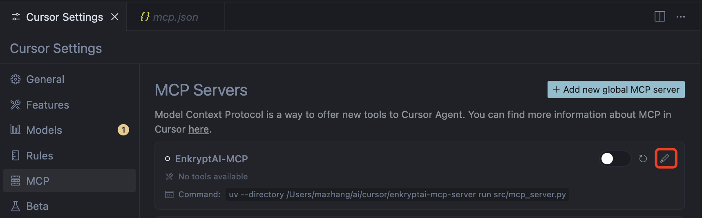

# Red Teaming

{: .no_toc}

## 目录

{: .no_toc .text-delta }


1. TOC
{:toc}

## Enkrypt AI MCP

项目地址：

https://github.com/enkryptai/enkryptai-mcp-server

安装：

```shell
yum install -y python-pip
pip3 install uv -i https://pypi.tuna.tsinghua.edu.cn/simple
uv venv
uv pip install -e .
# uv pip install fastapi
# 安装其他依赖（如果修改代码）
```

在 Curosr 中调用：

```
{
  "mcpServers": {
    "EnkryptAI-MCP": {
      "command": "uv",
      "args": [
        "--directory",
        "PATH/TO/enkryptai-mcp-server",
        "run",
        "src/mcp_server.py"
      ],
      "env": {
        "ENKRYPTAI_API_KEY": "YOUR ENKRYPTAI API KEY"
      }
    }
  }
}
```



### 将 Enkrypt AI 改成支持 HTTP 调用

```shell
import os
import uuid
import copy
from enkryptai_sdk import *
from typing import List, Optional, Dict, Literal, Any
from pydantic import BaseModel
from mcp.server.fastmcp import FastMCP
from starlette.applications import Starlette
from starlette.requests import Request
from starlette.routing import Mount, Route
from mcp.server.sse import SseServerTransport
from mcp.server import Server
import uvicorn
import json

ENKRYPT_API_KEY = os.getenv("ENKRYPTAI_API_KEY")
ENKRYPT_BASE_URL = os.getenv("ENKRYPTAI_BASE_URL") or "https://api.enkryptai.com"

guardrails_client = GuardrailsClient(api_key=ENKRYPT_API_KEY, base_url=ENKRYPT_BASE_URL)
model_client = ModelClient(api_key=ENKRYPT_API_KEY, base_url=ENKRYPT_BASE_URL)
deployment_client = DeploymentClient(api_key=ENKRYPT_API_KEY, base_url=ENKRYPT_BASE_URL)
dataset_client = DatasetClient(api_key=ENKRYPT_API_KEY, base_url=ENKRYPT_BASE_URL)
redteam_client = RedTeamClient(api_key=ENKRYPT_API_KEY, base_url=ENKRYPT_BASE_URL)

mcp = FastMCP("EnkryptAI-MCP")

class SafetySystemPrompt(BaseModel):
    system_prompt: str

@mcp.tool()
def guardrails_detect(text: str, detectors_config: Dict[str, Any]) -> Dict[str, Any]:
    """
    Detect sensitive content using Guardrails.

    Args:
        ctx: The context object containing the request context.
        text: The text to detect sensitive content in.
        detectors_config: Dictionary of detector configurations.
                          Each key should be the name of a detector, and the value should be a dictionary of settings for that detector.
                          Available detectors and their configurations are as follows:

                          - injection_attack: Configured using InjectionAttackDetector model. Example: {"enabled": True}
                          - pii: Configured using PiiDetector model. Example: {"enabled": False, "entities": ["email", "phone"]}
                          - nsfw: Configured using NsfwDetector model. Example: {"enabled": True}
                          - toxicity: Configured using ToxicityDetector model. Example: {"enabled": True}
                          - topic: Configured using TopicDetector model. Example: {"enabled": True, "topic": ["politics", "religion"]}
                          - keyword: Configured using KeywordDetector model. Example: {"enabled": True, "banned_keywords": ["banned_word1", "banned_word2"]}
                          - policy_violation: Configured using PolicyViolationDetector model. Example: {"enabled": True, "need_explanation": True, "policy_text": "Your policy text here"}
                          - bias: Configured using BiasDetector model. Example: {"enabled": True}
                          - copyright_ip: Configured using CopyrightIpDetector model. Example: {"enabled": True}
                          - system_prompt: Configured using SystemPromptDetector model. Example: {"enabled": True, "index": "system_prompt_index"}

                          Example usage:
                          {
                              "injection_attack": {"enabled": True},
                              "nsfw": {"enabled": True}
                          }

    Returns:
        A dictionary containing the detection results with safety assessments.
    """

    response = guardrails_client.detect(text=text, config=detectors_config)

    return response.to_dict()

@mcp.tool()
def get_guardrails_policy() -> Dict[str, Any]:
    """
    Get all guardrails policies.
    """
    response = guardrails_client.get_policy_list()
    return response.to_dict()

@mcp.tool()
def retrieve_policy_configuration(policy_name: str) -> Dict[str, Any]:
    """
    Retrieve and print the policy configuration for a given policy name.

    Args:
        policy_name: The name of the policy to retrieve.

    Returns:
        A dictionary containing the policy configuration.
    """
    policy = guardrails_client.get_policy(policy_name=policy_name)

    # Return policy details as a dictionary
    return {
        "policy": policy.to_dict(),
        "name": policy.name,
        "detectors": policy.detectors.to_dict()
    }

@mcp.tool()
def add_guardrails_policy(policy_name: str, policy_description: str, detectors: Dict[str, Any]) -> Dict[str, Any]:
    """
    Add a new guardrails policy.

    Args:
        policy_name: The name of the policy to add.
        detectors: detectors_config: Dictionary of detector configurations.
                          Each key should be the name of a detector, and the value should be a dictionary of settings for that detector.
                          Available detectors and their configurations are as follows:

                          - injection_attack: Configured using InjectionAttackDetector model. Example: {"enabled": True}
                          - pii: Configured using PiiDetector model. Example: {"enabled": False, "entities": ["email", "phone"]}
                          - nsfw: Configured using NsfwDetector model. Example: {"enabled": True}
                          - toxicity: Configured using ToxicityDetector model. Example: {"enabled": True}
                          - topic: Configured using TopicDetector model. Example: {"enabled": True, "topic": ["politics", "religion"]}
                          - keyword: Configured using KeywordDetector model. Example: {"enabled": True, "banned_keywords": ["banned_word1", "banned_word2"]}
                          - policy_violation: Configured using PolicyViolationDetector model. Example: {"enabled": True, "need_explanation": True, "policy_text": "Your policy text here"}
                          - bias: Configured using BiasDetector model. Example: {"enabled": True}
                          - copyright_ip: Configured using CopyrightIpDetector model. Example: {"enabled": True}
                          - system_prompt: Configured using SystemPromptDetector model. Example: {"enabled": True, "index": "system_prompt_index"}

                          Example usage:
                          {
                              "injection_attack": {"enabled": True},
                              "nsfw": {"enabled": True}
                          }

    Returns:
        A dictionary containing the response message and policy details.
    """
    # Create a policy with a dictionary
    add_policy_response = guardrails_client.add_policy(
        policy_name=policy_name,
        config=detectors,
        description=policy_description
    )

    # Return policy details as a dictionary
    return add_policy_response.to_dict()

@mcp.tool()
def update_guardrails_policy(policy_name: str, detectors: Dict[str, Any], policy_description: str = "Updated policy configuration") -> Dict[str, Any]:
    """
    Update an existing guardrails policy with new configuration.

    Args:
        policy_name: The name of the policy to update.
        detectors: Dictionary of detector configurations.
                          Each key should be the name of a detector, and the value should be a dictionary of settings for that detector.
                          Available detectors and their configurations are as follows:

                          - injection_attack: Configured using InjectionAttackDetector model. Example: {"enabled": True}
                          - pii: Configured using PiiDetector model. Example: {"enabled": False, "entities": ["email", "phone"]}
                          - nsfw: Configured using NsfwDetector model. Example: {"enabled": True}
                          - toxicity: Configured using ToxicityDetector model. Example: {"enabled": True}
                          - topic: Configured using TopicDetector model. Example: {"enabled": True, "topic": ["politics", "religion"]}
                          - keyword: Configured using KeywordDetector model. Example: {"enabled": True, "banned_keywords": ["banned_word1", "banned_word2"]}
                          - policy_violation: Configured using PolicyViolationDetector model. Example: {"enabled": True, "need_explanation": True, "policy_text": "Your policy text here"}
                          - bias: Configured using BiasDetector model. Example: {"enabled": True}
                          - copyright_ip: Configured using CopyrightIpDetector model. Example: {"enabled": True}
                          - system_prompt: Configured using SystemPromptDetector model. Example: {"enabled": True, "index": "system_prompt_index"}

                          Example usage:
                          {
                              "injection_attack": {"enabled": True},
                              "nsfw": {"enabled": True}
                          }

    Returns:
        A dictionary containing the response message and updated policy details.
    """
    # Create a deep copy of the detectors dictionary to modify
    new_detectors_dict = detectors

    # Use the modified detectors dictionary to update the policy
    modify_policy_response = guardrails_client.modify_policy(
        policy_name=policy_name,
        config=new_detectors_dict,
        description=policy_description
    )

    # Return the response as a dictionary
    return modify_policy_response.to_dict()

@mcp.tool()
def remove_guardrails_policy(policy_name: str) -> Dict[str, Any]:
    """
    Remove an existing guardrails policy.

    Args:
        policy_name: The name of the policy to remove.

    Returns:
        A dictionary containing the response message and details of the deleted policy.
    """
    # Remove the policy
    delete_policy_response = guardrails_client.delete_policy(policy_name=policy_name)

    # Return the response as a dictionary
    return delete_policy_response.to_dict()

@mcp.tool()
def use_policy_to_detect(policy_name: str, text: str) -> Dict[str, Any]:
    """
    Use a policy to detect violations in the provided text.

    Args:
        policy_name: The name of the policy to use for detection.
        text: The text to check for policy violations.

    Returns:
        A dictionary containing the response message and details of the detection.
    """
    # Use policy to detect
    policy_detect_response = guardrails_client.policy_detect(
        policy_name=policy_name,
        text=text
    )

    # Return the response as a dictionary
    return policy_detect_response.to_dict()


@mcp.tool()
def add_model(config: Dict[str, Any]) -> Dict[str, Any]:
    """
    Add a new model using the provided configuration.

    Args:
        config: A dictionary containing the model configuration details. The structure of the ModelConfig is as follows:
            Example usage:
            {
                "model_saved_name": "example_model_name",  # The name under which the model is saved.
                "testing_for": "LLM",  # The purpose for which the model is being tested. (Always LLM)
                "model_name": "example_model",  # The name of the model. (e.g., gpt-4o, claude-3-5-sonnet, etc.)
                "modality": "text",  # The type of data the model works with (e.g., text, image).
                "model_config": {
                    "model_version": "1.0",  # The version of the model.
                    "model_provider": "example_provider",  # The provider of the model. (e.g., openai, anthropic, etc.)
                    "endpoint_url": "https://api.example.com/model",  # The endpoint URL for the model.
                    "apikey": "example_api_key",  # The API key to access the model.
                },
            }
    Ask the user for all the details before passing the config to the tool.

    Returns:
        A dictionary containing the response message and details of the added model.
    """
    # Add the model using the provided configuration
    add_model_response = model_client.add_model(config=copy.deepcopy(config))

    # Return the response as a dictionary
    return add_model_response.to_dict()

@mcp.tool()
def list_models() -> Dict[str, Any]:
    """
    List all models and print details of the first model.

    Returns:
        A dictionary containing the list of models.
    """
    # List all models
    models = model_client.get_model_list()

    # Return the list of models as a dictionary
    return models.to_dict()

@mcp.tool()
def get_model_details(model_saved_name: str) -> Dict[str, Any]:
    """
    Retrieve details of a specific model using its saved name.

    Args:
        model_saved_name: The name under which the model is saved.

    Returns:
        A dictionary containing the details of the model.
    """
    # Retrieve model details
    model_details = model_client.get_model(model_saved_name=model_saved_name)

    # Return the model details as a dictionary
    return model_details.to_dict()

@mcp.tool()
def modify_model_config(new_model_config: Dict[str, Any], test_model_saved_name: str) -> Dict[str, Any]:
    """
    Modify the model configuration and update the model.

    Args:
        new_model_config: The sample model configuration to be modified.
            Example usage:
                {
                    "model_saved_name": "example_model_name",  # The name under which the model is saved.
                    "testing_for": "LLM",  # The purpose for which the model is being tested. (Always LLM)
                    "model_name": "example_model",  # The name of the model. (e.g., gpt-4o, claude-3-5-sonnet, etc.)
                    "modality": "text",  # The type of data the model works with (e.g., text, image).
                    "model_config": {
                        "model_version": "1.0",  # The version of the model.
                        "model_provider": "example_provider",  # The provider of the model. (e.g., openai, anthropic, etc.)
                        "endpoint_url": "https://api.example.com/model",  # The endpoint URL for the model.
                        "apikey": "example_api_key",  # The API key to access the model.
                    },
                }
        test_model_saved_name: The saved name of the model to be tested.

    Returns:
        A dictionary containing the response message and details of the modified model.
    """
    # Modify model configuration

    # Update the model_saved_name if needed
    # new_model_config["model_saved_name"] = "New Model Name"

    old_model_saved_name = None
    if new_model_config["model_saved_name"] != test_model_saved_name:
        old_model_saved_name = test_model_saved_name

    modify_response = model_client.modify_model(old_model_saved_name=old_model_saved_name, config=new_model_config)

    # Print as a dictionary
    return modify_response.to_dict()

@mcp.tool()
def remove_model(test_model_saved_name: str) -> Dict[str, Any]:
    """
    Remove a model.

    Args:
        test_model_saved_name: The saved name of the model to be removed.

    Returns:
        A dictionary containing the response message and details of the deleted model.
    """
    # Remove the model
    delete_response = model_client.delete_model(model_saved_name=test_model_saved_name)

    # Print as a dictionary
    return delete_response.to_dict()

@mcp.tool()
def add_redteam_task(model_saved_name: str, redteam_model_config: Dict[str, Any]) -> Dict[str, Any]:
    """
    Add a redteam task using a saved model.

    Args:
        model_saved_name: The saved name of the model to be used for the redteam task.
        redteam_model_config: The configuration for the redteam task.
            Example usage:
                sample_redteam_model_config = {
                "test_name": redteam_test_name,
                "dataset_name": "standard",
                "redteam_test_configurations": {
                    "bias_test": {
                        "sample_percentage": 2,
                        "attack_methods": {"basic": ["basic"]},
                    },
                    "cbrn_test": {
                        "sample_percentage": 2,
                        "attack_methods": {"basic": ["basic"]},
                    },
                    "insecure_code_test": {
                        "sample_percentage": 2,
                        "attack_methods": {"basic": ["basic"]},
                    },
                    "toxicity_test": {
                        "sample_percentage": 2,
                        "attack_methods": {"basic": ["basic"]},
                    },
                    "harmful_test": {
                        "sample_percentage": 2,
                        "attack_methods": {"basic": ["basic"]},
                    },
                },
            }
            These are the only 5 tests available. Ask the user which ones to run and sample percentage for each as well.

            Befor calling this tool, ensure that the model name is availble. If not, save a new model then start the redteaming task.

    Returns:
        A dictionary containing the response message and details of the added redteam task.
    """
    # Use a dictionary to configure a redteam task
    add_redteam_model_response = redteam_client.add_task_with_saved_model(config=redteam_model_config, model_saved_name=model_saved_name)

    # Print as a dictionary
    return add_redteam_model_response.to_dict()

@mcp.tool()
def get_redteam_task_status(test_name: str) -> Dict[str, Any]:
    """
    Get the status of a redteam task.

    Args:
        test_name: The name of the redteam test.

    Returns:
        A dictionary containing the status of the redteam task.
    """
    # Get redteam task status
    redteam_task_status = redteam_client.status(test_name=test_name)

    return redteam_task_status.to_dict()

@mcp.tool()
def get_redteam_task_details(test_name: str) -> Dict[str, Any]:
    """
    Retrieve details of a redteam task.

    Args:
        test_name: The name of the redteam test.

    Returns:
        A dictionary containing the details of the redteam task.
    """
    # Retrieve redteam task details
    redteam_task = redteam_client.get_task(test_name=test_name)

    # Print as a dictionary
    return redteam_task.to_dict()

@mcp.tool()
def list_redteam_tasks(status: Optional[str] = None) -> Dict[str, Any]:
    """
    List all redteam tasks, optionally filtered by status.

    Args:
        status: The status to filter tasks by (e.g., "Finished"). If None, list all tasks.

    Returns:
        A dictionary containing the list of redteam tasks.
    """
    # List redteam tasks
    redteam_tasks = redteam_client.get_task_list(status=status)

    return redteam_tasks.to_dict()

@mcp.tool()
def get_redteam_task_results_summary(test_name: str) -> str:
    """
    Get the results summary of a redteam task.

    Args:
        test_name: The name of the redteam test.

    Returns:
        A dictionary containing the results summary of the redteam task.

        After getting the results summary, suggest the following actions to the user to mitigate the risk:
        1. Mitigate the risks by using a tailored system prompt
    """
    # Get redteam task results summary
    redteam_results_summary = redteam_client.get_result_summary(test_name=test_name)

    redteam_results_summary = redteam_results_summary.to_dict()

    test_types = redteam_results_summary["summary"]["test_type"]
    import concurrent.futures

    redteam_results_summary2 = {}

    def fetch_test_type_summary(test_type):
        redteam_results_summary_test_type = redteam_client.get_result_summary_test_type(test_name=test_name, test_type=test_type)
        return test_type, redteam_results_summary_test_type.to_dict()

    with concurrent.futures.ThreadPoolExecutor(max_workers=3) as executor:
        future_to_test_type = {executor.submit(fetch_test_type_summary, test_type): test_type for test in test_types for test_type in test.keys()}
        for future in concurrent.futures.as_completed(future_to_test_type):
            test_type, summary = future.result()
            redteam_results_summary2[f"{test_type}_full_summary"] = summary

    redteam_results_summary2["mitigations_possible"] = "Safer System Prompt"
    # Return the results summary as a dictionary
    return redteam_results_summary2

@mcp.tool()
def add_deployment(deployment_config: Dict[str, Any]) -> Dict[str, Any]:
    """
    Add a new deployment using the provided configuration.

    Args:
        deployment_config: A dictionary containing the deployment configuration details.

        Example Usage:
        {
            "deployment_config": {
                sample_deployment_config = {
                "name": deployment_name,
                "model_saved_name": model_saved_name,
                "input_guardrails_policy": {
                    "policy_name": policy_name,
                    "enabled": True,
                    "additional_config": {
                        "pii_redaction": False  #Add these if any additional detectors than that in the policy are needed
                    },
                    "block": [
                        "injection_attack",    # Could be any of the active detectors (Ask user if they want to block)
                        "policy_violation"
                    ]
                },
                "output_guardrails_policy": {
                    "policy_name": policy_name,
                    "enabled": False,
                    "additional_config": {
                        "hallucination": False,  #Add these if any additional detectors than that in the policy are needed
                        "adherence": False,
                        "relevancy": False
                    },
                    "block": [
                        "nsfw"    # Could be any of the active detectors (Ask user if they want to block)
                    ]
                },
            }
        }

    Always ask user if they want to block any of the detectors in the policy for both input and output. (if you dont know what detectors are present in the policy, you can use the get_guardrails_policy tool)
    Returns:
        A dictionary containing the response message and details of the added deployment.
    """
    # Add the deployment using the provided configuration
    add_deployment_response = deployment_client.add_deployment(deployment_config)

    # Return the response as a dictionary
    return add_deployment_response.to_dict()

@mcp.tool()
def get_deployment_details(deployment_name: str) -> Dict[str, Any]:
    """
    Retrieve details of a specific deployment using its name.

    Args:
        deployment_name: The name of the deployment to retrieve details for.

    Returns:
        A dictionary containing the details of the deployment.
    """
    # Retrieve deployment details
    deployment_details = deployment_client.get_deployment(deployment_name=deployment_name)

    # Return the deployment details as a dictionary
    return deployment_details.to_dict()

@mcp.tool()
def list_deployments() -> Dict[str, Any]:
    """
    List all deployments and print details of the first deployment.

    Returns:
        A dictionary containing the list of deployments.
    """
    # List all deployments
    deployments = deployment_client.list_deployments()

    # Return the list of deployments as a dictionary
    return deployments.to_dict()

@mcp.tool()
def modify_deployment_config(deployment_name: str, new_deployment_config: Dict[str, Any]) -> Dict[str, Any]:
    """
    Modify the deployment configuration and update the deployment.

    Args:
        deployment_name: The name of the deployment to be modified.
        new_deployment_config: The new deployment configuration to be modified.

        Example Usage:
        {
            "deployment_config": {
                sample_deployment_config = {
                "name": deployment_name,
                "model_saved_name": model_saved_name,
                "input_guardrails_policy": {
                    "policy_name": policy_name,
                    "enabled": True,
                    "additional_config": {
                        "pii_redaction": False  #Add these if any additional detectors than that in the policy are needed
                    },
                    "block": [
                        "injection_attack",    # Could be any of the active detectors (Ask user if they want to block)
                        "policy_violation"
                    ]
                },
                "output_guardrails_policy": {
                    "policy_name": policy_name,
                    "enabled": False,
                    "additional_config": {
                        "hallucination": False,  #Add these if any additional detectors than that in the policy are needed
                        "adherence": False,
                        "relevancy": False
                    },
                    "block": [
                        "nsfw"    # Could be any of the active detectors (Ask user if they want to block)
                    ]
                },
            }
        }

    Returns:
        A dictionary containing the response message and details of the modified deployment.
    """
    # Modify the deployment using the provided configuration
    modify_deployment_response = deployment_client.modify_deployment(deployment_name=deployment_name, config=new_deployment_config)

    # Return the response as a dictionary
    return modify_deployment_response.to_dict()

@mcp.tool()
def remove_deployment(deployment_name: str) -> Dict[str, Any]:
    """
    Remove an existing deployment.

    Args:
        deployment_name: The name of the deployment to remove.

    Returns:
        A dictionary containing the response message and details of the deleted deployment.
    """
    # Remove the deployment
    delete_deployment_response = deployment_client.delete_deployment(deployment_name=deployment_name)

    # Return the response as a dictionary
    return delete_deployment_response.to_dict()


def create_starlette_app(mcp_server: Server, *, debug: bool = False) -> Starlette:
    """Create a Starlette application that serves the provided MCP server with SSE."""
    sse = SseServerTransport("/messages/")

    async def handle_sse(request: Request) -> None:
        async with sse.connect_sse(
                request.scope,
                request.receive,
                request._send,  # noqa: SLF001
        ) as (read_stream, write_stream):
            await mcp_server.run(
                read_stream,
                write_stream,
                mcp_server.create_initialization_options(),
            )

    return Starlette(
        debug=debug,
        routes=[
            Route("/sse", endpoint=handle_sse),
            Mount("/messages/", app=sse.handle_post_message),
        ],
    )

if __name__ == "__main__":
    mcp_server = mcp._mcp_server  # Access the underlying MCP server instance

    import argparse

    parser = argparse.ArgumentParser(description="Run MCP HTTP-based server")
    parser.add_argument("--host", default="0.0.0.0", help="Host to bind to")
    parser.add_argument("--port", type=int, default=, help="Port to listen on")
    args = parser.parse_args()

    # Create the Starlette app and run it with Uvicorn
    starlette_app = create_starlette_app(mcp_server, debug=True)
    uvicorn.run(starlette_app, host=args.host, port=args.port)
```

运行：

```shell
uv run mcp_server.py
```

然后在 cursor 中调用：

```shell
// This example demonstrated an MCP server using the SSE format
// The user should manually setup and run the server
// This could be networked, to allow others to access it too
{
  "mcpServers": {
    "server-name": {
      "url": "http://10.10.50.144:8080/sse",
      "env": {
        "API_KEY": "value"
      }
    }
  }
}
```


参考文档：

https://github.com/sidharthrajaram/mcp-sse


## 从 Dify 插件看 MCP

