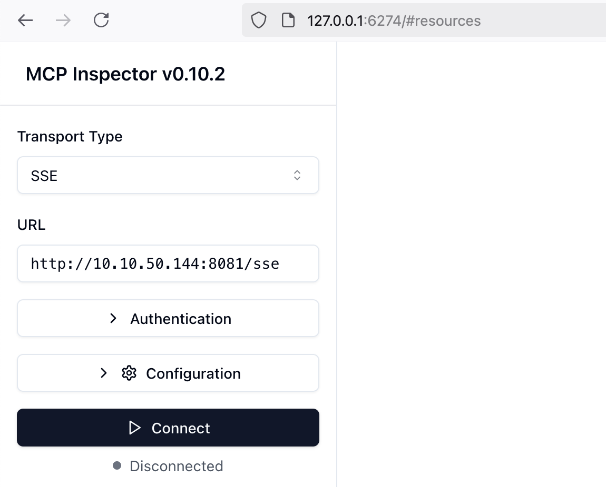

# MCPM

{: .no_toc}

## 目录

{: .no_toc .text-delta }


1. TOC
{:toc}

## 关于 MCPM 

MCPM 是一个集 MCP Registry、MCP Router、多 MCP Server 管理的一体化工具。大致来说具备下列功能：

- 提供类似于镜像源的功能，托管很多 MCP Server
- 通过 mcpm 客户端安装 Server 到本地，并将相应的配置自动推送给 mcp client，比如 vs code  的 cline 插件，Cursor 等。
- 通过 MCP router 提供统一的 MCP Server 功能（有点类似于 Proxy） 


安装文档：

[https://github.com/pathintegral-institute/mcpm.sh#-community-contributions](https://github.com/pathintegral-institute/mcpm.sh#-community-contributions)

### 设置 mcp client

```shell
mcpm client ls        
# 查看支持的 Client，如果 Installation 为 Installed，则表示检测到当前电脑安装了该 Client，可以将其 Activate
mcpm client set cline
# 设置将 cline 设置为 mcp client
```

设置完成后通过下列命令查看 Status 为 ACTIVE：

```
(base) [User@~]$ mcpm client ls
                        Supported MCP Clients
┏━━━━━━━━━━━━━━━━━━━━━━━━━━━━━━━━━┳━━━━━━━━━━━━━━━┳━━━━━━━━┳━━━━━━━━━┓
┃ Client Name                     ┃ Installation  ┃ Status ┃ Profile ┃
┡━━━━━━━━━━━━━━━━━━━━━━━━━━━━━━━━━╇━━━━━━━━━━━━━━━╇━━━━━━━━╇━━━━━━━━━┩
│ 5ire (5ire)                     │ Not installed │        │         │
│ Claude Desktop (claude-desktop) │ Not installed │        │         │
│ Cline (cline)                   │ Installed     │ ACTIVE │         │
│ Continue (continue)             │ Not installed │        │         │
│ Cursor (cursor)                 │ Installed     │        │         │
│ Goose CLI (goose-cli)           │ Not installed │        │         │
│ Roo Code (roo-code)             │ Not installed │        │         │
│ Trae (trae)                     │ Not installed │        │         │
│ Windsurf (windsurf)             │ Not installed │        │         │
└─────────────────────────────────┴───────────────┴────────┴─────────┘

```


### 通过 mcpm 安装 MCP Server

搜索在线的 mcp server：

```shell
mcpm search bing

# 结果示例：
bing-web-search-api
Found 1 server(s) matching search criteria
```

安装 mcp server：

```shell
mcpm add bing-web-search-api
```

安装完成后，Cline 的 mcpServer 配置中会自动配置相应的 server：


### 通过 mcpm-router 安装 MCP Server

```shell
# 创建 mcpm profile
mcpm profile add mcpm-test

# 在 profile 中添加 mcp server
mcpm add --target %mcpm-test jupyter-mcp

# 激活 Profile
mcpm activate mcpm-test

# 查看已激活的 Profile
mcpm profile ls
```

相关日志：

```shell
(base) [User@~]$ mcpm profile add mcpm-test

Profile 'mcpm-test' added successfully.

You can now add servers to this profile with 'mcpm add --target %mcpm-test <server_name>'

Or apply existing config to this profile with 'mcpm profile apply mcpm-test --server <server_name>'

------ 

(base) [User@~]$ mcpm add --target %mcpm-test jupyter-mcp
Adding server to profile: mcpm-test

Jupyter MCP Server (jupyter-mcp)
Jupyter MCP Server is a [Model Context Protocol](https://modelcontextprotocol.io) (MCP) server implementation that provides interaction with 📓 Jupyter notebooks running in any JupyterLab (works also with your 💻
local JupyterLab).
Author: datalayer
Add this server to mcpm-test? [y/n]: y

Using docker installation method
⠋ Saving server metadata...
⠋ Configuring jupyter-mcp...

Configure server arguments:
The URL of the server
SERVER_URL (required) > http://localhost:8888
The token for authentication
TOKEN (required) > ************************************************
The path to the notebook
NOTEBOOK_PATH (required) > AIRS-test.ipynb
Successfully added Jupyter MCP Server to mcpm-test!
```

设置 mcpm router 监听 IP 及端口：

```shell
mcpm router set --host 0.0.0.0
mcpm router set --port 8800
```

启动服务：

```
mcpm router on
MCPRouter started at http://0.0.0.0:8800 (PID: 65155)
Log file: ~/Library/Logs/mcpm/logs/router_access.log
Use 'mcpm router off' to stop the router.

(base) [User@~]$ mcpm router status
MCPRouter is running at http://0.0.0.0:8800 (PID: 65155)

```

将服务 share 到 Internet（使用 frpc 穿透工具）

```shell
(base) [User@~]$ mcpm router share
No active profile found. You need to specify a profile to share.
Sharing with active profile None...
Using share address from config...
```

## 配置文件位置

mcpm 有两个配置文件，目录如下：

```shell
# 存放 Profile、router 等配置 
~/.config/mcpm

# 存放安装的 mcp server 配置
~/.mcpm
```

## 启动 inspector 进行调试

```shell
mcpm inspector
```


