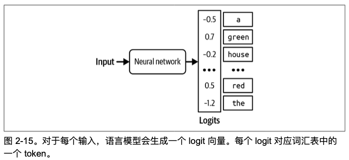
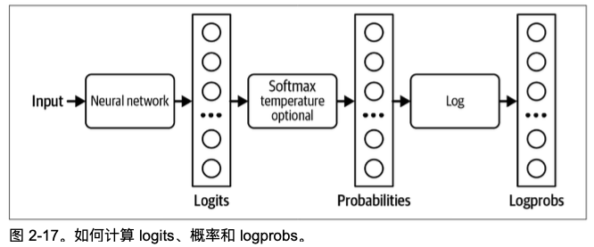
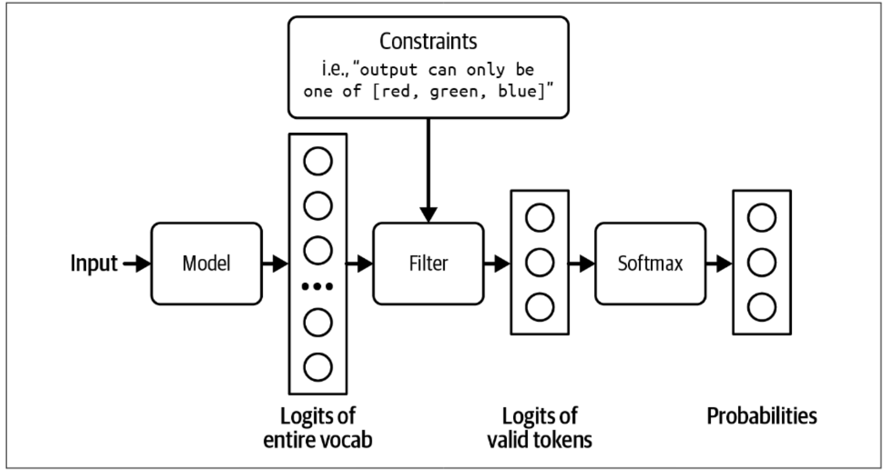
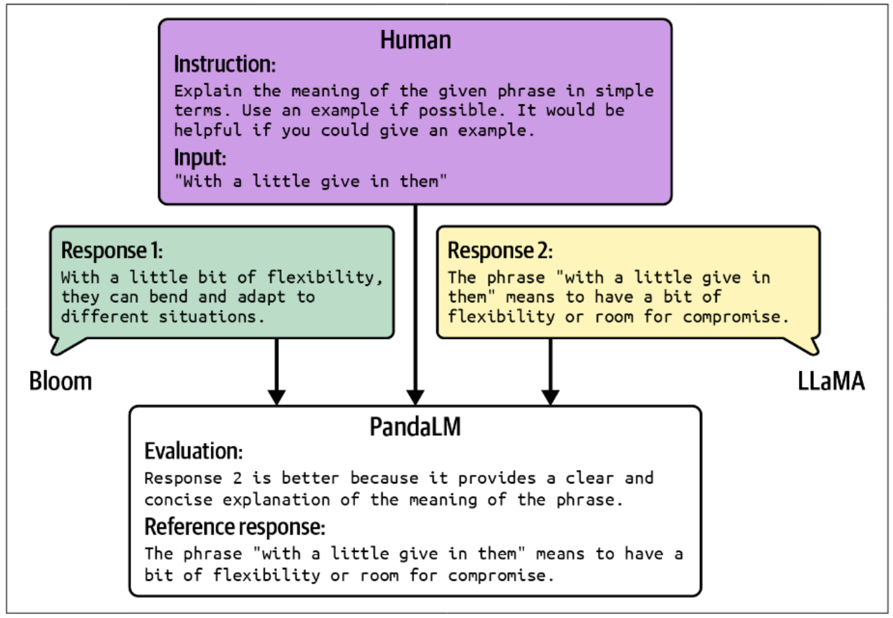

# AI 书籍学习笔记

{: .no_toc}

## 目录

{: .no_toc .text-delta }

1. TOC
{:toc}

记录一些看 AI 相关书籍的笔记。

# 《AI Engineering》

## 第一章概要

Pre-training：仅超大公司才能做这个，需要大量计算资源。

Post-training：指模型公司对于预训练后的模型进行微调，比如OpenAI 可能在发布模型之前对其进行 post-training，以提高其遵循指令的能力。

Fine-tuning：指普通企业基于基座模型调整模型的权重，比如训练垂类模型。

一个好的 demo 并不保证最终产品会很好。构建一个演示可能只需要一个周末，但构建一个产品可能需要数月，甚至数年。

CLIP 嵌入式模型：OpenAI 使用了一种名为自然语言监督的自监督学习变体来训练他们的语言-图像模型 CLIP (OpenAI, 2021)，被用来生成文本和图像的联合嵌入。

提示词工程：通过提供详细指令和期 望产品描述的示例来构建提示词，这种方法称为提示工程

### 应用场景分类

亚⻢逊网络服务(AWS)将企业生成式 AI 用例分为三类：客户体验、员工 生产力和流程优化。

2024 年奥雷利调查将用例分为八个类别：编程、数据分析、客户 支持、营销文案、其他文案、研究、网⻚设计和艺术。

一些组织，如德勤，已根据价值捕获对用例进行分类，例如成本降低、流程效率、增 ⻓和加速创新。

### 如何评估要不要使用 AI 技术？

不使用 AI 的风险：

- 如果你不这样做，拥有 AI 的竞争对手会使你过时
- 如果你不这样做，你将错失提高利润和生产力的机会
- 你还不确定 AI 将如何融入你的业务，但你不想被落伍

### 微软 Crawl-Walk- Run AI 自动化框架

1. Crawl 意味着人类参与是强制性的。
2. Walk 意味着 AI 可以直接与内部员工互动。
3. 运行意味着自动化程度的提高，可能包括 AI 与外部用户直接互动。

随着 AI 系统质量的提升，人类的作用可能会随时间变化。例如，在初期，当你还在评 估 AI 能力时，可能会用它来为人类代理生成建议。如果人类代理的接受率高，例如， 95%的 AI 建议回复简单请求被人类代理原封不动地使用，你可以让客户直接与 AI 互动来处理这些简单请求。

### AI 护城河

三种竞争力：技术、数据和分销

其中数据通常被大公司所有，但如果初创公司能早期进入市场并收集足够的用户数据以持续改进其产品，数据将成为它们的护城河（比如 Manus）

即使在用户数据不用于训练模型，使用信息也能提供宝贵的洞察，了解用户行为和产品缺陷，这些可以用来指导数据收集和训练过程。

基础模型的能力已经很强，对于大部分人/企业来说只需要借助基础模型来构建上层应用。但需要注意，如果想实现的功能未来基础模型也会做，那产品的生存周期可能会很短。

### 设定预期

衡量一个 AI 应用成功的指标（以聊天机器人为例）：

- 您希望聊天机器人自动处理多少比例的客户消息? 

- 聊天机器人返回来的消息中，多少需要你处理?
- 使用聊天机器人，你能多快做出回应?
- 聊天机器人能为你节省多少人力?

### 追踪客户满意度

可用下列性能指标衡量客户满意度：

- 响应质量
- 延迟指标包括TTFT(首个token的时间)、TPOT(每个输出token的时间)和总延迟。可接受的延迟取决于你的使用场景。如果目前所有客户请求都由人工处理， 中位响应时间为一小时，那么比这更快的时间可能就足够了。
- 成本指标：每次推理请求的成本。
- 其他指标，如可解释性和公平性。

## 第二章概要

Transformer 架构是在 seq2seq(序列到序列)架构成功之后流行起来的。seq2seq可用于翻译和摘要。2016 年，seq2seq 被加入 Google Translate。seq2seq 包含一个处理输入的编码器和一个生成输出的解码器。输入和 输出都是 token 序列，因此得名。Seq2seq 使用 RNN(循环神经网络)作为其编码器和解码器。在其最基本的形式中，编码器按顺序处理输入 token，输出代表输入的最终隐藏状态。然后解码器按顺序生成输出 token，其生成过程依赖于**输入的最终隐藏状态**以及**先前生成的 token**。

一些潜在的 Transformer 替代架构:

- SSMs(状态空间模型)

- RWKV

参数数量帮助我们估计训练和运行此模型所需的计算资源。例如，如果一个模型有 70 亿个参数，并且每个参数使用 2 字节(16 位)存储，那么我们可以计算出使用此模型 进行推理所需的 GPU 内存至少为 140 亿字节(14 GB)。

Mixtral 8x7B 是一个由八个专家组成的混合体，每个专家有七十亿个参数。如果 没有任何两个专家共享任何参数，它应该有 8 × 70 亿 = 560 亿个参数。然而，由于某些参数被共享，它只有 46.7 亿个参数。

预训练大型模型需要计算资源，衡量模型计算需求的标准化单位是 FLOP，即浮点运算，例如，一个 NVIDIA H100 NVL GPU 可以达到的最大性能是 60 TeraFLOP/s：即每秒 6 × 10FLOPs。假设你有 256 个 H100。如果你能以最大容量使用它们并且不犯训练错误，那么训练 GPT-3-175B 将需要你(3.14 × 10)/(256 × 5.2 × 10)= ~236 天，或大约 7.8 个月。

预训练模型通常存在两个问题，微调的目标是解决这两个问题：

- 自监督优化模型是为了 文本补全，而不是对话。
- 如果模型是在从互联网上随意抓取的数据上进行预训练的，其输出可能包含种族歧视、性别歧视、粗鲁或仅仅是错误的内容。

post-training 包含两个步骤：

1. 监督微调(SFT)：在高质量指令数据上微调预训练模型，以优化模型用于对话而非生成完整内容。
2. 偏好微调(Preference Finetuning)：进一步微调模型以输出与人类偏好一致的响应。偏好微调通常使用强化学习(RL)进行。偏好微调的技术包括人类反馈强化学习(RLHF，*reinforce‐ment learning from human feedback*)(GPT-3.5 和 Llama 2 使用)、直接偏好优化(DPO)(Llama 3 使用)以及 AI 反馈强化学习 (RLAIF)(Claude 可能使用)。

或者说：预训练优化的是 token 级别的质量，即模型被训练以准确预测下一个 token。然而，用户并不关心 token 级别的质量——他们关心的是整个响应的质量。通常情况下，后训练优化的是模 型以生成用户偏好的响应。有些人将预训练比作通过阅读来获取知识，而后训练则像是学习如何运用这些知识。

与预训练相比，训练后仅消耗少量资源(InstructGPT 的训练后计算资源仅占 2%，而训 练时占 98%)，

用于post-training的数据标注通常会使用高学历标注员来生成演示数据。在为 InstructGPT 标注演示数据 的人员中，约 90%至少拥有大学学历，其中超过三分之一拥有硕士学位。生成一对(提示，响应)可能需要⻓达 30 分钟，尤其是对于涉及⻓上下文的任务，如摘要。如果一对(提示，响应)的成本为 10 美元，那么 OpenAI 为 InstructGPT 使用的 13,000 对数据将花费 130,000 美元。这还不包括设计数 据(要包含哪些任务和提示)、招募标注员以及数据质量控制的成本。

### SFT 监督微调

简单来说，基于预训练教模型如何进行对话（从补全到chat）

我们知道模型会模仿其训练数据。为了鼓励模型生成适当的响应，你可以展示适当响应的示例。这些示例遵循(提示，响应)的格式，被称为示范数据。有些人将这个过程称为行为克隆：你展示模型应该如何行为，模型则克隆这种行为。

### RLHF 基于人类反馈的强化学习

SFT 只会教会模型如何和用户对话，但缺少对于内容的控制。不能避免模型回复用户一些恶意的问题。

- 训练一个奖励模型来评分基础模型输出的结果。

- 优化基础模型，使其生成的回复能够获得奖励模型的最大分数。

### Sampling 采样

采样使得模型的输出具有概率性。

对于分类模型，可能结果就是可用的类别。比如，你决定任何垃圾邮件概率高于 50% 的邮件都应该被标记为垃圾邮件，那么一个 90% 垃圾邮件概率的邮件将被标记为垃圾邮件。

处理不同概率的结果时，最常见的策略是使用概率最高的结果，这称为贪婪采样。这种方式适合垃圾邮件等应用，但用在语言模型上，会导致输出过于固化。

给定一个输入，神经网络会输出一个 logit 向量。每个 logit 对 应一个可能的值。对于语言模型，每个 logit 对应模型词汇表中的一个 token。

常见的采样策略：

- 温度：较高的问题会降低常见标记的概率，让回答更具创造性。一个常数，通常将其设置为 0
- Top-k：Top-k 是一种在不牺牲太多模型响应多样性的情况下减少计算工作量的采样策略。仅对 Top K 的 logits 进行 softmax 操作，K 值的区间为 50~500
- Top-p：动态采样，进采纳概率累加高于一定值的结果，通常设置在 0.9~0.95 之间。

下列示例下，设置为 0.9 时仅有 yes 和 maybe 被采纳，设置为 0.99 时 no 也会被采用。

### 停止条件

- 模型在固定数量的 token 后停止生成：缺点是输出可能会在句 子中间被截断。

- 使用停止 token 或停止词。例如，你可以要求模型在遇 到序列结束 token 时停止生成。停止条件有助于降低延迟和成本。

### 结构化输出

支持结构化输出的框架： guidance, outlines, instructor, llama.cpp。

你可以引导模型在 AI 堆栈的不同层级生成结构化输出：

- 提示词 Prompting：通过提示词来让模型结构化输出，但是模型可能不完全遵守。此时可以通过第二个模型进行验证。
- 后处理 post-processing：对于一些潜在的格式问题，可以用代码来检查修复，比如 JSON 缺少 `;` 等
- 约束取样 Constrained sampling：模型输出时通过限制来过滤 token 进行采样，这种方式不太好实现，因为规范很难定义，比如 JSON 的格式要求

- 微调：**最有效和最常用的方法**。

### 关于幻觉的两种假设

- 滚雪球式幻觉：模型无法区分所接受的数据和自己生成的数据。比如一开始一个东西就识别错了（洗发水认成牛奶瓶），然后基于这个错误的事实延伸出其他回答

DeepMind 的论文表明，可以通过两种技术来缓解幻觉问题。第一种技术来自强化学习，通过这种方式，模型被训练以区分用户提供的提示(在强化学习中称为关于世界 的观察)和模型生成的标记(在强化学习中称为模型的动作)。第二种技术依赖于监督学习，其中事实性和反事实性信号被包含在训练数据中。

- 幻觉是由模型内部知识与标注者内部知识之间的不匹配引起的

两种解决方案：一种是验证:对于每个回答， 要求模型检索它基于这个回答的来源。另一种是使用强化学习。一个更好的奖励函数，对模 型编造事情进行更严厉的惩罚，可以帮助减轻幻觉。

有些人尝试通过提示词来减少幻觉，例如添加“**尽可能如实地回答**，如果你不确定答案，就说‘抱歉，我不知道’。

”要求模型给出简洁的回 答似乎也有助于减少幻觉——**模型需要生成的 token 越少，编造内容的可能性就越小**。

## 第三章概要

模型评估：

对于传统的分类模型，其值是固定的（比如 0 和 1），将预测结果和预期值比较就可测评模型。

对于 LLM，给定的输入下输出是开放式的，很难整理一份清单来列举所有输出。

公开可用的评估基准已被证明不足以评估基础模型，因为很多模型已经可以拿到很高的分数，相当于难以评估模型的上限。

### 精确评估 Exact Evaluation

#### 功能正确性评估

比如写一个玩俄罗斯方块的代码，测试代码得到的分数。

间接通过代码运行的分数来衡量输出内容的质量。

#### 与参考数据的相似度测量

比如翻译场景下，可以将 AI 翻译结果与参考翻译结果比对。

有四种方法可以测量两个文本之间的相似性:

1. 让评估者判断两个文本是否相同
2. 完全匹配：生成的响应是否与参考响应完全匹配
3. 词汇相似性：生成的响应看起来与参考响应有多相似
4. 语义相似度：生成的响应在意义上与参考响应的接近程度(语义)

**完全匹配**：比如对于算术题、历史第一个，等有准确答案的，可以完全匹配答案

**词汇相似性**：近似字符串匹配，俗称模糊匹配。它通过计算将一个文本转换为另一个文本所需的编辑次数来衡量两个文本的相似度，这个数字称为编辑距离

**语义相似度**：语义相似度的目标是要计算语义上的相似度。这首先需要将文本转换为一个数值表示，这被称为嵌入 Embedding。

语义相似性的可靠性取决于底层嵌入算法的质量。

#### 关于 Embedding

由于模型通常需要先将输入转换为向量表示，因此许多机器学习模型，包括 GPT 和 Llama，也包含一个生成嵌入的步骤。“第 58 ⻚的“Transformer 架构”可视化了 Transformer 模型中的嵌入层。如果你可以访问这些模型的中间层，你可以使用它们来 提取嵌入。然而，这些嵌入的质量可能不如专⻔生成的嵌入模型。

### 通过 AI 评估

1. 通过原始问题本身评估响应的质量：给模型判断标准（1~10），让模型自行判断评分
2. 提供参考内容，让模型基于参考内容来验证生成的内容，然后评分
3. 比较两个生成的内容，确定哪个更好

提示词：

裁判的提示词应清楚解释以下几点: 

- 模型需要执行的任务，例如评估生成的答案与问题之间的相关性。

- 模型应遵循的标准来评估，例如“你的主要重点是判断生成的答案是否包含足够的信 息来根据真实答案回答给定的问题”。指令越详细越好。

- 评分系统可以是以下这些之一:
  - 分类，例如好/坏或相关/不相关/中立。
  - 离散数值，例如 1 到 5。离散数值可以被视为分类的一种特殊情况，其中每个类 别具有数值解释而不是语义解释。
  - 连续的数值，例如在 0 和 1 之间，比如当你想要评估相似度程度时。

#### AI 评估的局限性

不一致：使用相同的指令提示，如果运行两次，也可能输出不同的分数

标准不统一：MLflow、llamainfex 、ragas 等工具的分数没有统一标准

成本和延迟：如果基于 LLM 来做内容的审查，可能增加成本和延迟。此时也可以通过采样检查来减少成本

偏见：模型可能更倾向于自己的回答，看到的第一个答案，以及较长的答案

一些可用来评估的模型：

- 奖励模型：奖励模型接收一个(提示，响应)对，并根据提示对响应的好坏进行评分。Google 的 Cappy	
- 基于参考的判别：通过一个或多个参考答案来评估生成的响应，输出相似度分数或质量分数。BLEURT、Prometheus
- 偏好模型：给多个输出，让模型判断哪个输出更好。 PandaLM、JudgeLM

