# LibreChat 对接 gpt-image-2

{: .no_toc}

## 目录

{: .no_toc .text-delta }


1. TOC
{:toc}

## 关于

最近发现通过 Azure 订阅可以使用 gpt 5.5 以及 gpt-image-2 的模型，这样四舍五入可以搭建一个 ChatGPT 出来了，查了下可以用开源的 LibreChat 做前端，同时挂接 gpt 语言模型和 image-2 图片模型。下面简单记录下过程。


## 开通 Microsoft Foundry

**记得使用 eastus2 这个区域**，能使用的模型相对多一些，具体的区域及可用模型清单见下面链接：

[https://learn.microsoft.com/en-us/azure/foundry-classic/foundry-models/concepts/models-sold-directly-by-azure-region-availability?tabs=az-americas&pivots=standard](https://learn.microsoft.com/en-us/azure/foundry-classic/foundry-models/concepts/models-sold-directly-by-azure-region-availability?tabs=az-americas&pivots=standard)


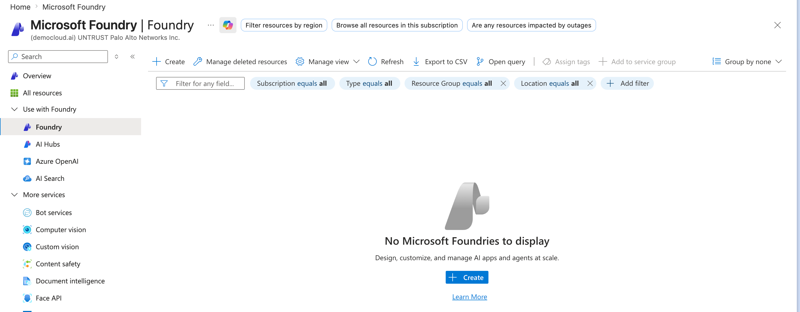

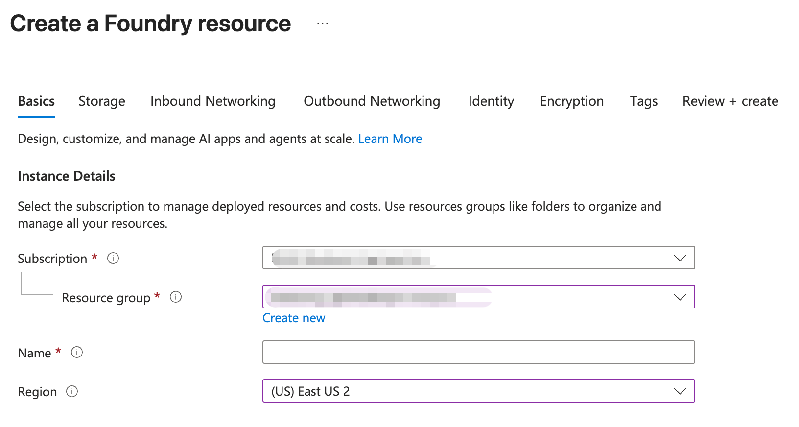


创建完成后点击下列菜单进入 Foundry：

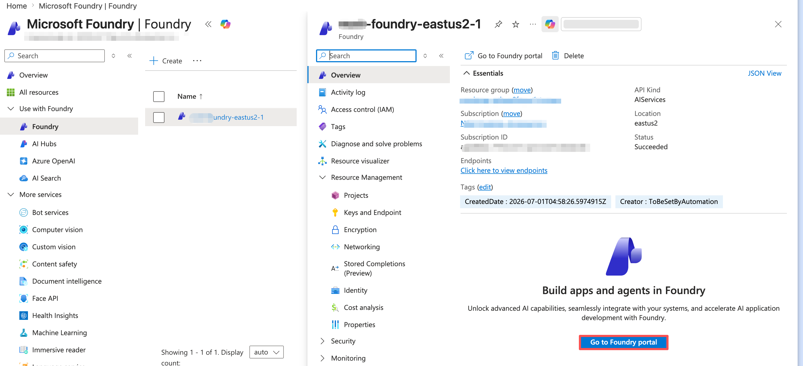


记录 API key 以及 Azure OpenAI Endpoint URL：

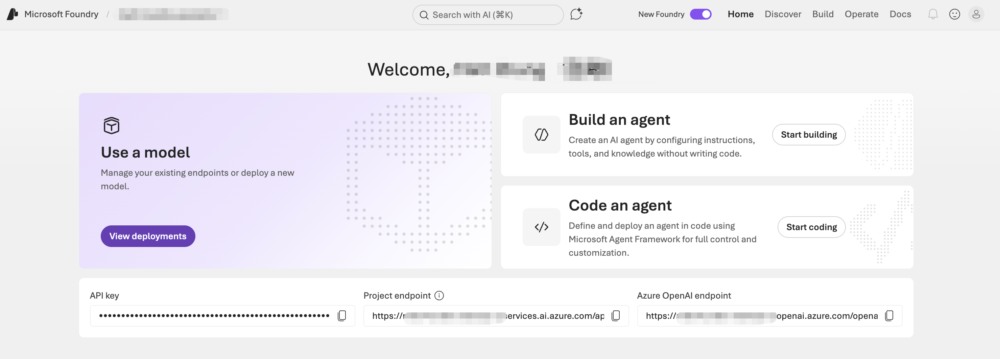

在下列位置部署需要的模型：

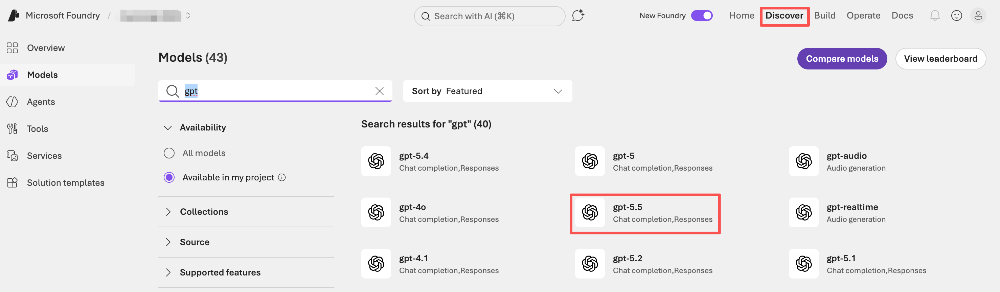

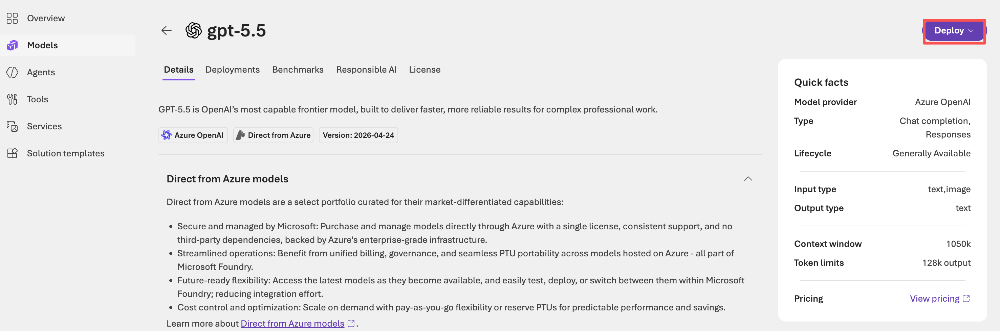

## 部署 LibreChat

参考[此文档](https://www.librechat.ai/docs/quick_start/local_setup)快速部署 LibreChat。


### 设置 Azure 模型

参考文档：[https://www.librechat.ai/docs/quick_start/custom_endpoints#step-2-configure-librechatyaml](https://www.librechat.ai/docs/quick_start/custom_endpoints#step-2-configure-librechatyaml)

新建 librechat.yaml 配置文件添加自定义模型，此处以 Azure 上的 5.5 为例。

```yaml
#cat librechat.yaml
version: 1.3.5
endpoints:
  custom:
    - name: "Azure-GPT"
      apiKey: "XXX"
      baseURL: "https://xxx.openai.azure.com/openai/v1"
      models:
        default: ["gpt-5.5"]
        fetch: false
      titleConvo: true
      titleModel: "gpt-5.5"
      dropParams: ["stop"]
      modelDisplayLabel: "OpenAI"
```

#### 测试

创建新会话，测试语言模型：

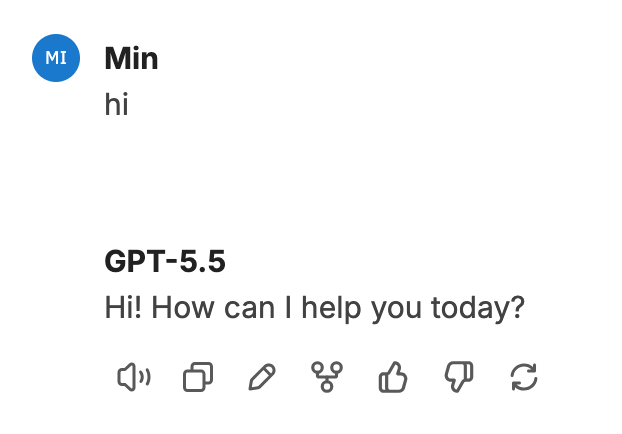


### 设置 gpt-image-2 模型

修改 .env 配置文件（需要从项目 .env.example 复制），重点修改 **IMAGE_GEN_OAI** 相关的配置（URL、model 名以及 API key）：

```
# OpenAI Image Tools Customization
#----------------
# IMAGE_GEN_OAI_API_KEY= # Create or reuse OpenAI API key for image generation tool
# IMAGE_GEN_OAI_BASEURL= # Custom OpenAI base URL for image generation tool
IMAGE_GEN_OAI_BASEURL=https://xxx.openai.azure.com/openai/v1
IMAGE_GEN_OAI_MODEL=gpt-image-2
IMAGE_GEN_OAI_API_KEY=xxx
# IMAGE_GEN_OAI_AZURE_API_VERSION= # Custom Azure OpenAI deployments
# IMAGE_GEN_OAI_MODEL=gpt-image-1 # OpenAI image model (e.g., gpt-image-1, gpt-image-1.5)
IMAGE_GEN_OAI_DESCRIPTION=GPT-image-2
```


#### 添加 Image Agent

在下列位置添加新 Agent，设置语言模型。

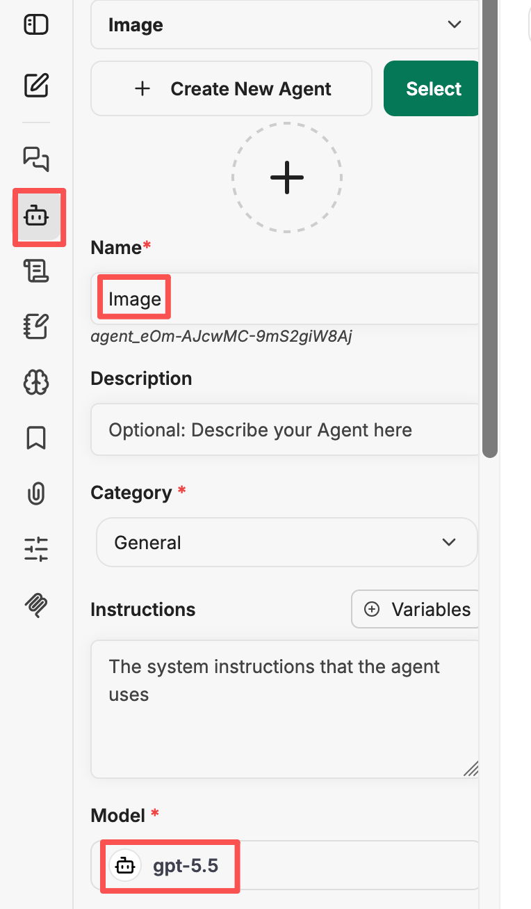

往下翻，找到 Tools and Actions，添加内置的 OpenAI Image Tools 。

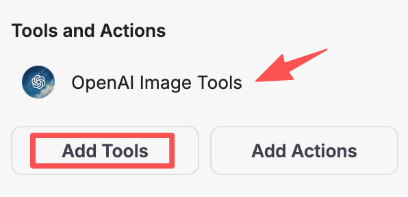

之后保存。

新建会话，在左上角选择刚才创建的 Agent：

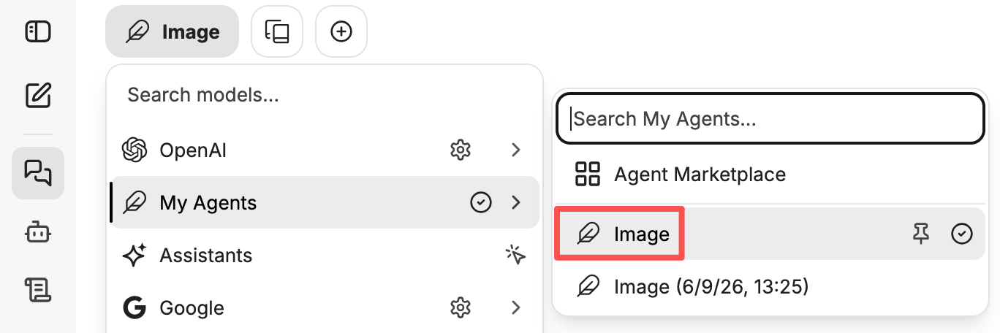

测试：

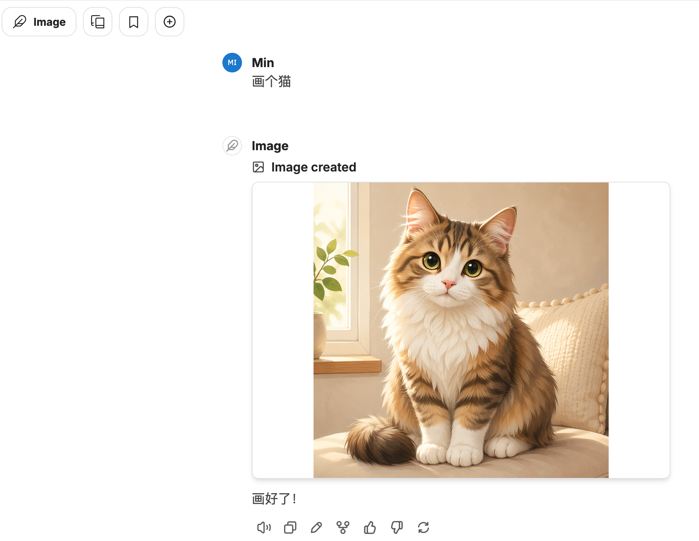
