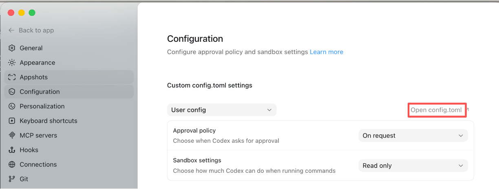
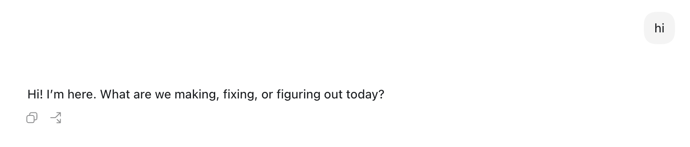

# Codex 对接 Azure openai 模型

{: .no_toc}

## 目录

{: .no_toc .text-delta }


1. TOC
{:toc}

## 关于

接[上篇文章](https://blog.halfcoffee.com/docs/ai/librechat)，讲解如何在 Codex 中对接 Azure Foundry 的模型

打开 Codex，使用 Sign in another way：


填写从 Azure 获取的 API key。


之后打开 Codex 设置，在 Configuration 中找到 Open config.toml 并打开（mac 上默认路径是 `~/.codex/config.toml`）



添加下列内容（[参考文档](https://developers.openai.com/codex/config-advanced#azure-provider-and-per-provider-tuning)）：

```
model_provider =  "azure"

[model_providers.azure]
name = "Azure"
base_url = "https://xxxx.openai.azure.com/openai/v1"
wire_api = "responses"
request_max_retries = 3
stream_max_retries = 5
stream_idle_timeout_ms = 300000
```

之后就可以直接用啦（记得挂🪜）：



