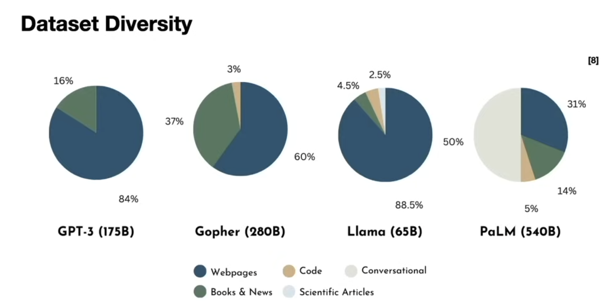

# 关于 AI 的小白 FAQ

{: .no_toc}

## 目录

{: .no_toc .text-delta }

1. TOC
{:toc}

以下答案来自 GPT

## AI 训练为什么需要大显存

训练大型深度学习模型需要大量的显存（GPU内存）主要有以下几个原因：

1. **模型参数**：大型模型通常具有大量的参数。每个参数都需要内存来存储其值。例如，一个包含10亿参数的模型，如果每个参数都是32位浮点数，那么就需要大约4GB的内存来存储这些参数。

2. **激活值**：在前向传播和反向传播过程中，网络的每一层都会生成一些中间结果，这些结果被称为"激活值"。这些激活值需要在内存中保留，以便在反向传播时使用。大型网络通常有更多的层，因此需要更多的内存来存储这些激活值。

3. **迷你批次大小**：在训练过程中，我们通常一次处理一批数据，而不是一次处理一个数据点。这被称为"迷你批次"训练。每个迷你批次的数据都需要在内存中存储。因此，如果你想使用更大的迷你批次，你需要更多的内存。

4. **优化器状态**：一些优化器，如Adam和RMSProp，需要保持与模型参数相同大小的内存来存储历史梯度信息或其他状态信息。

5. **并行和分布式训练**：在多GPU或多节点环境中进行训练时，可能需要更多的内存来存储额外的通信缓冲区或模型副本。

因此，训练大型模型时需要大量的显存。如果显存不足，可能需要使用一些策略来减少内存使用，如梯度累积、模型并行、激活值检查点等。

## 训练模型和使用模型对于硬件需求是否一样？

AI模型的训练和使用（也称为推理）对硬件的需求是不同的。以下是一些关键的区别：

1. **计算能力**：训练通常需要大量的计算能力，因为它涉及到大量的参数更新和大量的数据处理。相比之下，推理通常需要较少的计算能力，因为它只涉及到单个数据点（或小批量数据）的前向传递。

2. **内存需求**：训练通常需要大量的内存（包括RAM和GPU内存），以存储模型参数、中间激活值、优化器状态等。而在推理过程中，内存需求通常较小，因为只需要存储模型参数和一小部分中间激活值。

3. **硬件类型**：训练通常在GPU上进行，因为GPU提供了并行处理能力，这对于处理大量数据和参数更新非常有用。然而，推理可以在各种类型的硬件上进行，包括CPU、GPU、FPGA或专用AI芯片（如Google的TPU或NVIDIA的Jetson系列）。

4. **持续时间**：训练一个模型可能需要几小时到几周的时间，这取决于模型的大小、训练数据的量、硬件的能力等。因此，训练通常需要稳定且持久的硬件。相比之下，推理通常在几毫秒到几秒内完成，所以它可以在更小、更便携的设备上进行。

模型训练完成后，使用模型进行推理（或预测）时，对显存的要求通常会显著降低。这是因为在推理阶段，一些在训练阶段需要的资源不再需要了。具体来说：

1. **激活值**：在推理时，你仍然需要存储激活值，但是不需要像在训练时那样存储整个计算图，因为你不需要进行反向传播来计算梯度。

2. **优化器状态**：在推理时，你不需要保留优化器的状态，因为你不再更新模型的参数。

3. **迷你批次大小**：在推理时，你可以逐个处理数据点，或者使用比训练时小得多的迷你批次。这进一步减少了内存需求。

4. **模型参数**：在推理时，你仍然需要存储模型参数，但是你可以使用一些技术来减少存储需求，如参数量化和模型剪枝。

因此，虽然在推理时仍然需要一些显存来存储模型参数和激活值，但这通常比训练时需要的显存要少得多。这使得训练好的模型可以在资源有限的设备上运行，如移动设备和嵌入式设备。

## 模型训练时可能存在哪些安全隐患？

模型训练时可能存在的一些安全隐患包括：

1. **数据泄露**：训练模型通常涉及到使用敏感的数据，如用户个人信息、商业秘密等。如果这些数据在存储、处理或传输过程中被泄露，可能会对用户和企业造成严重的损害。

2. **模型窃取**：攻击者可能会试图窃取训练好的模型，以获取其商业价值，或者找出模型的弱点进行攻击。

3. **模型逆向工程**：即使攻击者无法直接窃取模型，他们也可能通过观察模型的输出来逆向工程模型的结构和参数，或者推断出训练数据的信息。

4. **对抗性攻击**：攻击者可以设计特殊的输入，使模型产生错误的输出，这被称为对抗性攻击。这种攻击在一些安全敏感的应用中可能会造成严重的后果。

5. **数据污染和模型欺骗**：攻击者可能会试图通过提供错误的数据来污染训练数据，或者在模型训练过程中进行干扰，使模型学习到错误的行为。

6. **训练基础设施的安全**：训练模型通常需要大量的计算资源，这些资源可能通过云服务提供。如果这些基础设施的安全性不足，可能会被攻击者利用，进行数据窃取、服务拒绝等攻击。

为了防范这些安全隐患，我们需要在模型训练的各个阶段都采取安全措施，如数据加密、访问控制、模型保护、对抗性训练、数据和模型审计等。

## LLM 的应用

LLM 是 Large Language Models 的缩写，它们是一类大型的自然语言处理模型，如 GPT-3、BERT、T5 等。这些模型由于其强大的理解和生成文本的能力，已经在许多业务场景中找到了应用。以下是一些例子：

1. **客户服务自动化**：LLM 可以用于构建智能的聊天机器人，自动回答用户的问题，减轻人工客服的负担。例如，许多银行和电信公司已经开始使用这种技术来提高他们的客户服务效率。

2. **内容生成和编辑**：LLM 可以用于自动生成或编辑文本内容，如新闻文章、博客帖子、社交媒体帖子等。例如，一些新闻机构已经开始使用 LLM 来自动产生新闻报道。

3. **个性化推荐**：LLM 可以理解用户的文本输入（如搜索查询、产品评价等），并基于这些理解来提供个性化的推荐。例如，一些电子商务网站已经开始使用 LLM 来提高他们的产品推荐质量。

4. **情感分析**：LLM 可以用于理解文本的情感倾向，这对于社交媒体监控、品牌管理、市场研究等场景非常有用。

5. **知识图谱构建**：LLM 可以用于自动提取文本中的实体和关系，帮助构建知识图谱，这对于搜索引擎、问答系统等产品非常重要。

6. **语言翻译**：LLM 如 GPT-3 和 T5 已经展示出了强大的翻译能力，可以用于自动翻译文本，甚至是实时翻译。

7. **教育技术**：LLM 可以用于自动生成教育内容，如题目、解答等，也可以作为学生的学习助手，帮助他们解答问题。

以上只是一部分例子，实际上，LLM 的应用场景非常广泛，几乎涵盖了所有需要处理文本的场景。

## 企业一般会自己训练 LLM 还是用现成的 LLM 去做应用？

企业是否选择自己训练大型语言模型（LLM）或者使用现成的 LLM 主要取决于他们的需求、资源和能力。

1. **使用现成的 LLM**：对于大多数企业来说，使用预训练的 LLM （如 GPT-3、BERT、T5 等）然后进行微调（fine-tuning）以适应特定的任务或数据集，是最常见的做法。这种方法的优点是成本相对较低，不需要大量的计算资源和时间，而且这些预训练模型已经在大量的文本数据上进行了训练，通常能够提供很好的性能。

2. **自己训练 LLM**：对于拥有大量计算资源和数据的大型科技公司（如 Google、Facebook、OpenAI 等），他们可能会选择自己从零开始训练 LLM。这样可以让他们完全控制模型的训练过程，包括选择训练数据、调整模型架构和参数等。自己训练模型的另一个优点是可以根据企业自己的需求和数据来定制模型，例如，训练一个特定领域的语言模型。

然而，自己训练 LLM 的成本非常高，需要大量的计算资源（例如，高性能的 GPU 集群）和时间（可能需要几周甚至几个月），以及深度学习和自然语言处理的专业知识。因此，这种方法通常只适合大型科技公司或研究机构。

总的来说，对于大多数企业来说，使用预训练的 LLM 然后进行微调是最实际的选择。

## 微调是什么？

微调（Fine-tuning）是一种迁移学习技术，它的基本思想是将在大量数据上预训练的模型作为起点，然后在特定的任务上进行进一步的训练。这种方法的优点是可以利用预训练模型学习到的通用知识，减少训练时间和数据需求，并提高模型的性能。

微调的过程通常是这样的：

1. **加载预训练模型**：首先，我们加载预训练的模型，包括模型的架构和权重。

2. **适应新任务**：然后，我们可能需要对模型进行一些修改，以适应新的任务。例如，对于文本分类任务，我们可能会添加一个新的全连接层作为输出层，用于分类。

3. **训练**：接着，我们在新的任务的数据集上进行训练。这里的关键是，我们不是从零开始训练模型，而是从预训练模型的权重开始，**然后通过反向传播和梯度下降来更新权重**。这个过程也被称为微调，因为我们通常只需要少量的迭代就可以达到很好的性能。

除了权重，我们还可能需要调整模型的架构。例如，对于文本分类任务，我们可能需要在模型的顶部添加一个新的全连接层，用于输出分类结果。这个新的层也需要在训练过程中进行调整。

总的来说，微调的过程就是调整模型的权重和可能的架构，使模型更好地适应特定的任务。

## 模型的参数越多越好吗？

过拟合（Overfitting）是机器学习和深度学习中一个常见的问题，它发生在**模型过于复杂**，以至于开始学习训练数据中的噪声和细节，而非概括的模式时。

具体来说，过拟合发生在模型在训练数据上的表现优秀，但在未见过的测试数据或新数据上的表现较差时。这是因为模型过度适应（或“记住”）了训练数据，包括其可能的噪声和异常值，而没有学习到数据背后的真实模式，因此无法很好地泛化到新的、未见过的数据。

## 模型的参数少了会有什么问题？

模型参数较少可能有以下几个缺点：

1. **欠拟合**：如果模型的参数过少，可能会导致模型过于简单，无法捕捉到数据中的所有复杂性和变化，这称为欠拟合。在这种情况下，模型可能无法在训练数据上获得良好的性能，更别提在未见过的测试数据上了。

2. **表达能力受限**：模型的参数数量是决定模型复杂性和表达能力的关键因素之一。参数过少可能会限制模型的表达能力，使得模型无法学习到数据中的复杂模式。

3. **泛化能力差**：虽然简单的模型有助于防止过拟合，但是如果模型过于简单，可能无法很好地泛化到新的、未见过的数据。

然而，值得注意的是，更多的参数并不总是更好的。过多的参数可能会导致模型过于复杂，容易发生过拟合，即模型在训练数据上表现良好，但在测试数据上表现差。因此，选择模型的复杂性需要在偏差（欠拟合）和方差（过拟合）之间找到一个平衡。

一个参数参考：

## 大模型如何保存

大型语言模型（LLM）最终的保存形式通常是一个模型文件，这个文件包含了模型的参数（weights）和架构（architecture）。具体来说，保存形式包括以下几个方面：

1. **模型权重文件（Weights file）**：
   - 这是保存模型参数的文件。参数是模型训练过程中学到的权重和偏置值。
   - 文件格式通常是二进制格式，例如HDF5（.h5）或PyTorch的.pt/.pth格式。
   - 例如：`model_weights.h5`, `model.pth`
2. **模型架构文件（Model architecture file）**：
   - 这是描述模型结构的文件，包括层的类型、数量、顺序以及它们之间的连接方式。
   - 在某些框架中（如TensorFlow和Keras），架构信息可能包含在同一个文件中，也可能单独存储为JSON或YAML格式。
   - 例如：`model_config.json`, `model_architecture.yaml`
3. **完整模型文件（Entire model file）**：
   - 某些框架允许将权重和架构一起保存为一个文件。
   - 例如，TensorFlow的SavedModel格式和Keras的HDF5格式可以同时保存模型架构、权重以及训练配置等。
   - 例如：`saved_model.pb`, `model.h5`
4. **优化器状态（Optimizer state）**：
   - 这是在训练过程中优化器的内部状态，如动量和学习率调度器的状态。这对于继续训练或恢复中断的训练很有用。
   - 通常会与模型权重一起保存，或作为单独的文件保存。
   - 例如：`optimizer_state.pth`
5. **其他辅助文件**：
   - 这可能包括词汇表（vocabulary）、词嵌入（embeddings）以及训练过程中的配置文件（configurations），如超参数设置、数据预处理方式等。
   - 例如：`vocab.txt`, `config.json`

## 训练好的 LLM 中包含数据吗？

训练好的大型语言模型（LLM）通常不会直接包含原始的训练数据，但它们确实从训练数据中学到了大量的模式、知识和语言结构。这可以引发关于隐私和数据泄露的担忧，特别是当模型是用敏感或私密数据训练时。以下是一些关键点和考虑：

### 1. **模型参数和权重**

训练好的LLM的核心是其参数和权重，这些参数通过学习训练数据中的模式和结构而调整。参数和权重并不直接存储原始数据，但它们反映了训练数据的统计特性。

### 2. **隐私和数据泄露**

尽管模型参数本身不包含原始数据，但在某些情况下，模型可能生成与训练数据相似的内容，尤其是当训练数据包含重复模式或罕见信息时。例如：

- 模型可能在生成文本时无意中“记住”并输出训练数据中的特定句子或短语。
- 这对隐私敏感数据（如个人信息、机密文件）尤为重要，需要特别注意数据去识别化和模型训练策略。

### 3. **数据去识别化和安全性**

为了降低隐私风险，可以采取以下措施：

- **数据去识别化**：在训练前对数据进行去识别化处理，移除或掩盖个人信息和敏感内容。
- **差分隐私**：应用差分隐私技术，在训练过程中加入噪音，减少模型对单个训练样本的依赖。
- **使用合成数据**：使用合成数据或生成的数据集来增强训练数据，降低对真实数据的依赖。

### 4. **合规性和数据使用政策**

在使用和部署LLM时，遵循相关的隐私法律和数据使用政策至关重要。例如：

- 确保数据使用符合《通用数据保护条例》（GDPR）等隐私法规。
- 对模型进行安全评估，确保它不会泄露敏感信息。

## GPT 基于 Transformer 架构做了哪些优化？

### 1. **预训练和微调**

GPT 先在大规模的文本数据上进行预训练，学习语言模型，然后通过微调在特定任务上优化其表现。

1. **预训练**：在大量的文本数据上进行无监督学习，模型通过预测下一个词来学习语言的结构和语义。
2. **微调**：在具体任务上使用标注数据进行监督学习，以增强模型在特定领域或任务上的表现。

### 2. **Transformer 架构改进**

Transformer 架构自身具备高度的并行计算能力和强大的上下文理解能力，这是实现更好语言理解和生成的基础。

1. **注意力机制（Attention Mechanism）**：通过多头注意力机制，模型可以关注输入序列中的不同部分，捕捉长距离的依赖关系。
2. **位置编码（Positional Encoding）**：为了让模型理解序列信息，Transformer在输入中加入了位置编码，这有助于模型理解词语的相对位置关系。

### 3. **自回归生成（Autoregressive Generation）**

GPT 采用自回归方式生成文本，即一个词一个词地生成，保证上下文的一致性和连贯性。每生成一个词，都会基于之前生成的词和输入的上下文进行推理。

### 4. **大规模训练数据**

使用多样化和大规模的数据进行训练，使模型能够接触到各种各样的语言现象和知识，提高其对不同问题和场景的理解能力。

### 5. **上下文感知**

GPT 在生成每一个词时，会基于整个上下文信息来进行决策。这意味着模型会考虑到输入的所有信息，而不仅仅是简单的关键词匹配。

### 6. **模型规模**

模型参数规模的增加使得GPT可以捕捉更复杂的模式和关系。更大的模型通常表现出更好的语言理解和生成能力。

### 7. **训练目标的改进**

通过优化训练目标，例如使用更高效的损失函数和更合理的优化算法，使得模型在训练过程中更好地捕捉到语言中的细微差别和深层次关系。

### 8. **后处理和验证**

在实际应用中，结合后处理步骤和人工验证，进一步确保输出的准确性和相关性。

### 具体优化实例

1. **上下文理解增强**：GPT-3及后续版本在上下文理解上进行了很多优化。例如，模型能够理解长段文本的上下文，从而生成连贯且与上下文一致的回答。
2. **知识嵌入**：模型在预训练过程中学习了大量的知识，这使得它在生成回答时可以引用相关的知识点，从而提高回答的准确性。
3. **领域微调**：通过在特定领域的数据上进行微调，使模型能够更好地理解和生成该领域的专业内容。

### 例子说明

假设用户询问：“什么是量子纠缠？”

**未优化模型的可能回答**： “量子纠缠是一种量子力学现象。”

**优化后的GPT模型回答**： “量子纠缠是量子力学中的一种现象，它描述了两个或多个粒子之间的状态是相互依赖的，无论它们相隔多远。一旦这些粒子通过量子纠缠相互关联，它们的状态就会形成一个整体，这意味着对其中一个粒子的测量会即时影响到另一个粒子的状态。这种现象违反了经典物理学的局部性原理，并且已经通过多次实验得到了验证。”

这种优化后的回答展示了GPT对量子纠缠概念的深入理解，并提供了详细且准确的解释。

通过这些优化措施，GPT能够在理解用户输入、考虑上下文和生成精确回答方面表现出色。这些改进不仅提高了模型的语言理解和生成能力，还增强了它在实际应用中的实用性和可靠性。

## 训练模型的步骤

1. 数据管理 Data Curation（大量准确的数据）
2. 模型架构 Model Architecture
3. 大规模训练
4. 评估优化

### 数据

#### 数据来源

互联网：网页、Wiki、论坛、书籍、文章、代码库等

公开的 Dataset：

- 爬虫数据：Colossal Clean Crawled Corpus（C4）、Falcon RefinedWeb
- The Pile

- Hugging face Dataset

私有的 Dataset：

- FinPile（BloombergGPT）

使用 LLM 生成数据：

- Apalca

#### 数据多元化

#### 数据处理

- **移除低质量的数据**：基于经验进行移除，或者使用一个精简的文本分类模型去移除
- **去重**：如果训练和评估时使用类似的数据集，则可能影响模型的准确度（就是说模型只能针对训练过的数据来作答，而不是“理解”了）
- **脱敏**：移除敏感的信息
- **令牌化（Tokenization）**：需要将机器无法识别的文字转换成数字，比如使用 Bytepair Encoding Algorithm。有一些现成的库可以干这个事：[SentencePiece](https://github.com/google/sentencepiece/tree/master)、[Tokenizers](https://huggingface.co/docs/tokenizers/quicktour)

参考资料：[https://www.youtube.com/watch?v=ZLbVdvOoTKM&ab_channel=ShawTalebi](https://www.youtube.com/watch?v=ZLbVdvOoTKM&ab_channel=ShawTalebi)

### Model Architecture

#### Transformer

Transformer 是一种在自然语言处理（NLP）中广泛使用的深度学习模型架构。它最初在 Vaswani 等人的 2017 年论文 "Attention is All You Need" 中提出，该论文由 Google 的研究员撰写。

Transformer 的核心思想是使用 "自注意力机制"（Self-Attention Mechanism）来捕捉输入序列中的全局依赖关系，而不像传统的 RNN（循环神经网络）或 CNN（卷积神经网络）那样依赖于局部、顺序的信息处理。这使得 Transformer 在处理长距离依赖和并行计算方面更具优势。

Transformer 架构主要由两部分组成：编码器（Encoder）和解码器（Decoder）。

1. **编码器**：编码器由多个相同的层堆叠而成，每一层都包含两个子层：自注意力层和前馈神经网络层。自注意力层可以理解为它允许模型在编码单个元素（如单词）时，考虑输入序列中的其他元素。前馈神经网络则是一个普通的全连接神经网络。

2. **解码器**：解码器也是由多个相同的层堆叠而成，但每一层包含三个子层：两个自注意力层和一个前馈神经网络层。第一个自注意力层用于处理解码器的输入（即前一步的输出），第二个自注意力层则用于处理编码器的输出。

在 Transformer 中，每一层的输出都会加上对应的输入（这被称为残差连接），然后进行层归一化（Layer Normalization）。此外，为了让模型能够区分输入序列中的不同位置，Transformer 引入了位置编码（Positional Encoding）。

Transformer 架构由于其强大的性能和灵活性，已经成为了许多现代 NLP 模型的基础，如 BERT、GPT、T5 等。

一个使用 Transformer 进行训练的示例：

假设我们有一个句子 "The cat, which already had its dinner, sat on the mat."（那只已经吃过晚饭的猫坐在垫子上。）我们想要理解 "it" 这个词在这个句子中的含义。

在一些传统的模型中，由于它们只能处理局部上下文或者依赖于固定窗口大小，因此可能很难理解 "it" 指的是 "cat"，尤其是当 "cat" 和 "it" 之间有很多其他的词时。

然而，由于 Transformer 的自注意力机制，它可以同时考虑到句子中的所有单词，并根据需要分配不同的注意力权重。在我们的例子中，当模型处理 "it" 这个词时，由于 "cat" 和 "it" 之间的上下文关联性很强，模型可能会给 "cat" 分配一个高的注意力权重。这样，模型就能理解 "it" 在这个句子中指的是 "cat"。

这种全局上下文理解的能力使得 Transformer 在许多 NLP 任务中，如机器翻译、文本摘要、问答系统等，都能取得优异的性能。

### 大规模下训练的优化

下面是些用于提高大型模型训练效率的技术和架构：

1. **Mixed Precision Training**：这是一种使用不同精度（例如，32位浮点数和16位浮点数）进行计算的训练方法。通过使用较低精度的数据类型，可以减少存储和计算需求，从而提高训练速度和效率，同时还可以减少内存使用。然而，这需要一些技术来确保数值稳定性和模型性能。

2. **ZeRO (Zero Redundancy Optimizer)**：这是一种优化深度学习模型训练的技术，可以显著减少训练过程中的内存使用。ZeRO通过分布式训练和优化内存管理来实现这一点，例如，通过在不同的设备或节点之间分配模型参数，梯度，和优化器状态，从而减少每个设备或节点需要存储的信息量。

3. **3D Parallelism**：这是一种结合了数据并行性，模型并行性，和流水线并行性的并行计算策略，用于训练大型深度学习模型。数据并行性是指在多个设备上同时处理不同的数据批次；模型并行性是指将模型的不同部分分布在多个设备上；流水线并行性则是指在多个设备上按顺序执行模型的不同阶段。通过结合这三种并行性，3D并行性可以有效地扩大模型大小和训练速度，同时减少内存使用。

这些技术和架构都是为了解决大型模型训练中的挑战，例如计算需求大，内存使用高，训练时间长等问题。

大型语言模型（Large Language Models，LLMs）的训练涉及到许多超参数，这些超参数可以影响模型的性能和训练效率。以下是一些常见的超参数：

1. **学习率（Learning Rate）**：这是优化算法中的一个关键参数，决定了参数更新的步长。过大的学习率可能导致训练不稳定，过小的学习率可能导致训练过慢或者陷入局部最优。

2. **批次大小（Batch Size）**：这是每次模型更新参数时使用的样本数量。批次大小可以影响模型的训练速度和效果，以及内存的使用。

3. **优化器（Optimizer）**：这是用于训练模型的优化算法，如SGD、RMSprop、Adam等。不同的优化器有不同的优点和缺点，可能会影响模型的训练速度和效果。

4. **学习率衰减（Learning Rate Decay）**：这是一种策略，用于在训练过程中逐渐减小学习率，以帮助模型更稳定地收敛。

5. **正则化参数（Regularization Parameters）**：这些参数控制用于防止过拟合的正则化项的强度。例如，L1和L2正则化的强度，或者dropout的比率。

6. **梯度裁剪（Gradient Clipping）**：这是一种防止梯度爆炸的技术，通过设置一个阈值来限制梯度的大小。

7. **纪元数（Epochs）**：一个纪元是指模型在训练集上进行一次完整的前向和反向传播。纪元数决定了模型在训练集上训练的次数。

8. **序列长度（Sequence Length）**：对于处理序列数据的模型（如RNN和Transformer），序列长度是一个重要的参数，决定了模型可以看到的输入数据的时间步长。

9. **模型大小（Model Size）**：这包括模型的层数、隐藏层的大小、注意力头的数量等，决定了模型的复杂性和计算需求。

这些超参数需要通过实验和调优来确定最优值，因为它们对模型的训练和性能有显著影响。

### 模型评估

模型评估是在机器学习和深度学习中，对训练好的模型的性能进行评估的过程。它能够帮助我们理解模型在未见过的数据上的表现如何，以及模型是否过拟合或欠拟合。以下是一些常见的模型评估技术：

1. **训练集和测试集**：数据通常被划分为训练集和测试集。训练集用来训练模型，而测试集用来评估模型。通过比较模型在这两个集合上的性能，我们可以了解模型是否过拟合（在训练集上表现良好，但在测试集上表现差）。

2. **交叉验证**：交叉验证是一种模型评估技术，它将数据划分为k个子集。然后，模型在k-1个子集上进行训练，并在剩下的子集上进行测试。这个过程重复k次，每次使用不同的子集作为测试集。交叉验证的结果通常更稳健，因为它考虑了数据的不同划分。

3. **混淆矩阵**：对于分类问题，混淆矩阵是一种常见的评估技术，它显示了模型的真正例、假正例、真负例和假负例。

4. **性能指标**：有许多不同的性能指标可以用来评估模型，包括准确率、精确率、召回率、F1分数（用于分类问题）；均方误差、均方根误差、平均绝对误差（用于回归问题）；以及AUC-ROC、PR曲线等。

5. **模型选择**：模型选择是指在多个模型（可能使用不同的算法或超参数）中选择最佳模型的过程。这通常涉及到比较不同模型的评估指标，并选择表现最好的模型。

模型评估是机器学习和深度学习中的一个关键步骤，因为它帮助我们理解模型的性能，并为改进模型提供了方向。

#### LLM Leaderboard

https://huggingface.co/open-llm-leaderboard

## 如何通过 AWS Bedrock 及其他服务做一个智能问答系统

AWS Bedrock 是一项帮助开发者构建和部署生成式 AI 应用的服务，特别适合那些刚开始利用 AI 的用户。它简化了对基础模型的访问，减少了管理基础设施的复杂性。假设你想将内部文档转换成问答（QA）系统供用户使用，以下是如何利用 AWS 服务来实现这一目标的详细规划。

### 步骤和相关 AWS 服务

1. **准备和存储文档数据**：
   - Amazon S3（Simple Storage Service）：
     - 将所有内部文档上传到 S3 存储桶中。S3 提供高可用性和持久性，确保文档数据安全存储并且易于访问。
2. **数据处理和预处理**：
   - AWS Glue：
     - 使用 AWS Glue 对文档数据进行提取、转换和加载（ETL）处理。例如，将不同格式的文档转换为统一的文本格式，提取出文档中的有用信息。
   - Amazon Comprehend：
     - 利用 Amazon Comprehend 提取文档中的关键实体、主题、关键词等，帮助理解和组织内容。
3. **构建问答模型**：
   - Amazon Bedrock：
     - 使用 Amazon Bedrock 访问各种基础模型，这些模型可以处理自然语言理解和生成任务。选择一个合适的模型并进行微调，使其能够理解和回答与内部文档相关的问题。
   - Amazon SageMaker：
     - 使用 Amazon SageMaker 进行模型训练和调优。如果需要自定义模型，可以在 SageMaker 上训练和部署。SageMaker 还提供了 Jupyter 笔记本环境，用于数据分析和模型开发。
4. **部署问答系统**：
   - Amazon Bedrock：
     - 将微调后的模型部署为一个可调用的 API 服务。通过 API 接口，应用可以发送用户问题并接收模型生成的答案。
   - AWS Lambda：
     - 创建 Lambda 函数来处理用户的问答请求。Lambda 函数调用 Bedrock 提供的 API 获取答案，并将答案返回给用户。
   - Amazon API Gateway：
     - 使用 API Gateway 创建一个 RESTful API，为外部应用提供访问接口。API Gateway 可以与 Lambda 函数集成，管理 API 请求和响应。
5. **前端应用**：
   - Amazon S3 和 CloudFront：
     - 如果需要一个用户界面，可以在 S3 上托管静态网站文件，并使用 CloudFront 进行内容分发，确保全球用户的快速访问。
   - AWS Amplify：
     - 使用 AWS Amplify 加速前端应用的开发。Amplify 提供了简单的工具和服务，用于构建、部署和托管全栈应用。
6. **监控和优化**：
   - Amazon CloudWatch：
     - 使用 CloudWatch 监控问答系统的性能，收集日志和指标，以便进行故障排除和性能优化。
   - AWS X-Ray：
     - 使用 X-Ray 分析和调试分布式应用，了解各个组件的性能瓶颈和问题。

### 完整流程示例

1. **数据上传和预处理**：
   - 将内部文档上传到 S3。
   - 使用 AWS Glue 和 Amazon Comprehend 对文档进行预处理，提取有用信息。
2. **模型训练和部署**：
   - 通过 Amazon Bedrock 访问并微调问答模型。
   - 将模型部署为可调用的 API 服务。
3. **构建 API 接口**：
   - 创建 Lambda 函数处理用户请求，调用模型 API。
   - 使用 API Gateway 创建 RESTful API 接口。
4. **前端展示**：
   - 开发前端应用，并在 S3 和 CloudFront 上托管。
   - 使用 AWS Amplify 简化前端开发和部署。
5. **监控和优化**：
   - 使用 CloudWatch 和 X-Ray 监控和优化系统性能。

通过这些步骤，利用 AWS 提供的服务，你可以轻松构建一个智能问答系统，将内部文档高效地转换成能够回答用户问题的应用，提升用户体验和信息获取效率。

## 向量数据库是什么，举个应用场景

向量数据库是一种专门用于存储和检索高维向量数据的数据库。向量数据是机器学习和深度学习模型生成的数值表示，通常用于表示文本、图像、音频和其他复杂数据。向量数据库通过高效的索引和检索机制，使得在大量向量数据中找到最相似或相关的向量成为可能。

### 关键特性：

1. **高维向量存储**：能够存储大量的高维向量数据。
2. **高效检索**：提供高效的相似性检索方法，如最近邻搜索（Nearest Neighbor Search）。
3. **可扩展性**：能够处理大规模数据，支持分布式存储和计算。
4. **集成性**：通常与机器学习和深度学习框架集成，支持向量化处理和推理。

### 应用场景：基于内容的图像搜索

#### 场景描述：

一家在线图片库平台希望为用户提供基于内容的图像搜索功能，即用户上传一张图片后，系统能返回与之内容相似的图片。这种功能可以帮助用户快速找到相似风格、主题或内容的图片，提升用户体验。

#### 实现步骤：

1. **图像向量化**：
   - 使用预训练的深度学习模型（如 ResNet、VGG 等）对图片进行特征提取，将每张图片转换为固定长度的高维向量。每个向量代表了图片的内容特征。
2. **向量存储**：
   - 将生成的图像向量存储到向量数据库中。向量数据库能够高效地存储和管理这些高维向量数据。
   - 例如，可以使用 Milvus、Pinecone 或 Amazon OpenSearch Service 等向量数据库解决方案。
3. **用户查询**：
   - 用户上传一张待查询的图片。
   - 使用同样的深度学习模型对该图片进行特征提取，生成查询向量。
4. **相似性检索**：
   - 向量数据库根据用户上传图片生成的查询向量进行相似性检索，找到数据库中最相似的若干向量。
   - 向量数据库通常采用最近邻搜索算法（如 k-NN、ANN）来快速找到相似向量。
5. **结果返回**：
   - 根据相似向量找到对应的图片，并将这些图片返回给用户作为搜索结果。

## GPT 什么时候会调用外部函数？

GPT 调用外部函数的情况通常取决于具体的应用场景和系统设计。以下是一些可能会触发 GPT 调用外部函数的情境：

### 1. **扩展功能和信息检索**：

当 GPT 需要获取其训练数据中不存在或较新的信息时，可以调用外部 API 或函数来获取最新的数据或执行某些计算。例如：

- **实时信息**：获取当前的天气、股票价格、新闻等。
- **数据库查询**：从外部数据库中检索具体信息。
- **执行计算**：调用外部计算函数进行复杂的数学运算、数据处理等。

### 2. **特定任务处理**：

在需要执行特定任务或操作时，GPT 可以调用外部函数。这些任务可能包括：

- **发送电子邮件**：调用电子邮件 API 发送邮件。
- **数据转换**：调用数据处理函数进行格式转换或数据清洗。
- **调用机器学习模型**：访问特定的机器学习模型进行预测或分析。

### 3. **集成和自动化工作流**：

在自动化系统和集成环境中，GPT 可能需要调用外部服务或函数来完成工作流的一部分，例如：

- **自动化操作**：通过调用外部系统 API 执行自动化操作（如触发事件、启动流程等）。
- **业务逻辑执行**：根据业务需求调用特定的业务逻辑函数。

### 4. **扩展对话能力**：

在对话系统中，为了提供更加智能和人性化的对话，GPT 可能调用外部函数来获取更多上下文信息或实现更复杂的对话逻辑，例如：

- **用户数据获取**：调用用户管理系统获取用户历史记录或偏好。
- **对话管理**：调用对话管理系统来维护对话状态和逻辑。

## GPT 如何防止提示词注入攻击

以上提到的防御 prompt 注入攻击的措施,主要是通过 LLM 周边的组件和系统实现的,而不是直接由 LLM 本身来完成。具体来说:

1. 输入过滤和验证:
   - 这通常由 LLM 的前端组件或中间件来完成,对用户输入的 prompt 进行检查和清洗。
2. 输出监控和审核:
   - 这需要额外的监控和分析组件,对 LLM 的输出进行实时检测和审核。
3. 安全沙箱和隔离:
   - 这需要容器化或虚拟化技术,以及相应的基础设施和资源管理组件来实现。
4. 动态调整和更新:
   - 这需要有专门的监控和更新机制,对 LLM 的行为和安全状况进行持续跟踪和优化。
5. 用户教育和指引:
   - 这需要通过文档、培训等方式,由系统管理员或安全团队来提供给用户。

总的来说,LLM 本身是一个专注于语言理解和生成的核心模型,它并不直接负责安全防御的实现。这些防御措施需要由 LLM 周围的系统组件和基础设施来支撑和实现,包括前端、中间件、监控分析、容器管理等。

LLM 的安全性和可靠性需要依赖于整个系统的设计和实现,需要多方位的防御措施来应对各种安全威胁。因此,在使用 LLM 时,需要将其置于一个完整的安全架构中,充分利用周边组件的能力来保护 LLM 免受攻击。
