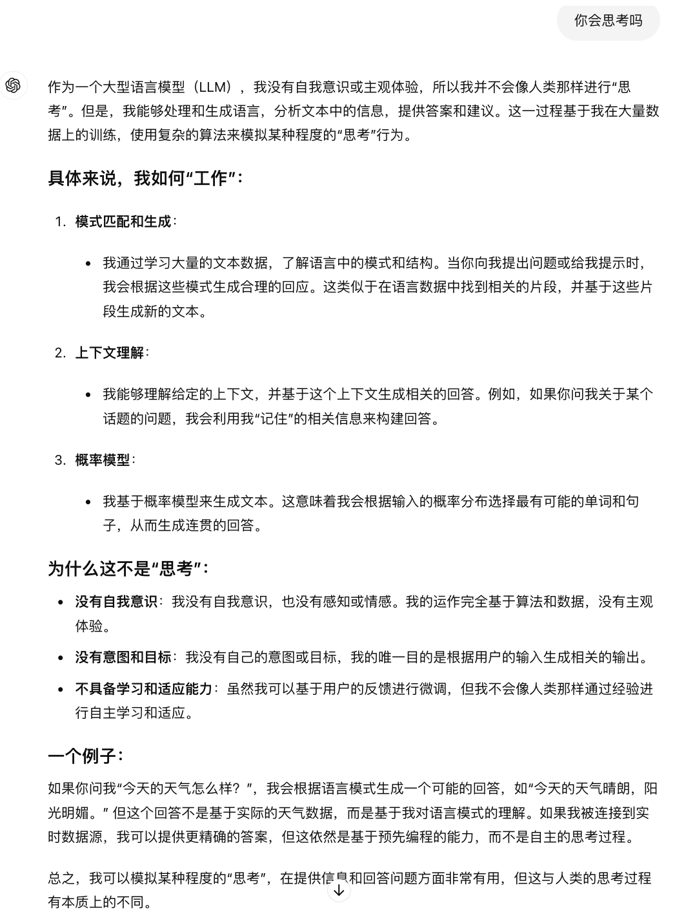

# AI 笔记-从 AI 应用看 AI 底层架构

{: .no_toc}

## 目录

{: .no_toc .text-delta }

1. TOC
{:toc}

免责声明：本人非 AI 专业，文中所述均为个人理解，仅作普及用途，不保证学术严谨性。部分文字来自于GPT-4o。

## AI 可以拿来干什么？

*先画个框框，现在我们提及的 AI 主要是指生成式 AI，后端由 LLM（大语言模型）驱动，最为人知的应用为 **ChatGPT 聊天机器人**。*

目前可预见的前几大 AI 应用场景：

### No.1 聊天机器人

比如 ChatGPT，用户输入问题，系统给出解答，和传统搜索引擎不一样的是，GPT 之类的解答会更加直接，更加易读，很多解答可以直接以本地语言展示。

ChatGPT 之类的 AI 有很多超能力：

- 编程神器：对于码农来说，GPT 可以帮着写代码、指导代码里的错误，甚至可以指导新手使用不熟悉的语言写代码
- 码字神器：以前写一篇软文可能要绞尽脑汁，现在只要提示得当，很快就能得到一篇不错的文章；又或者，把自己写好的文章丢给 GPT 去优化、查错别字等
- 学习神器：对于不懂的知识，尤其是一些 xx 是干什么的，应用场景是什么的这类问题，GPT 的答案还是很精确，学习新知识效率加倍
- 翻译神器：在不同语言之间进行高质量的翻译

### No.2 以文生图

MidJourney、DALL·E 等 AI 绘画工具，用户输入图片关键词，AI 根据“想象”创作出相应的图，出品的图有些可以作为概念图进一步加工，有些可以直接拿来用，比如作为文章配图等。

在这方面，传统的图像处理软件 Adobe Photoshop 都加上了 AI 的模块，可以根据内容/文字自动修改/扩展图片内容，我第一次看 Demo 时表示非常强大。

### No.3 知识总结

## 为什么 AI 如此强大？

看了很多 LLM 大模型工作原理的介绍，个人觉得直接拿大脑来对比最简单（虽然不学术正确）。

我们都知道大脑有非常多的神经元，神经元通过突触彼此连接，形成一个庞大而复杂的网络，这个网络是可塑的，每次我们学习新的知识都会涉及神经元之间连接的变化，学的次数多了，便可以加强神经元之间的连接，让我们记住知识。

到了 LLM，其基本工作原理类似，让人工神经网络（ANN）读人类的知识，读的多了，机器就能“记住”各种知识间的关系，如果反过来去问机器某些关键词（类似于查询），它便可以根据记忆“**吐出来**”相应的内容。

因为 AI 学习了大量的材料，又具有和大脑类似的神经网络，所以感觉 GPT 之类的无所不知，但是，AI 很强，但不够强大。

## AI 很强，但不够强大

上面特地加粗了“吐出来”三个字，为什么用这个？因为这是当前生成式 AI 的最大局限，它只能背诵，而**不能思考**。

这时候你会可能反驳，GPT 已经如此聪明，不应该已经具备思考能力了？我只能说，那是因为设计者真的很聪明。

LLM 通常使用 Transformer 架构，Transformer 来自于 Google 几位研究员在 2017 年发布的论文《Attention is All You Need》。

在 Transformer 中，有两个关键词：“全局上下文”，以及“注意力权重”，这两个关键词可以让 AI 融会贯通，知道知识是如何关联起来的。再结合大量优质的学习材料，AI 就可以输出非常优质，又准确的内容。

所以，一个 AI 输出结果好不好，实际取决于：**数据好不好，以及神经网络构建的咋样**。

大家可能听说过 Llama3、Claud3 等开源 LLM 大模型，这些大模型的差别就在于，使用的训练数据，以及神经网络的构建和参数不一样。

这里有个关键词：**参数**，参数可以理解为有多少神经元连接，连接过少或者连接过多，都可能走向两个极端：

1. 连接过少：智力低下，不能有效吸收学习到的内容，也就无法输出优质的答案
2. 连接过多：只会背，类似于一个人能熟记所有东西，但是不具备联想力，输出的内容几乎等于学习的内容，没法创作

 那如何确定一个 LLM 应该有多少参数？实际和人类类似，智力越高，就让他多学点，智力不高，少学一些，即**数据量和模型需要匹配**。

### GPT 如何回答”自己会不会思考“这个问题？

### 为什么 GPT 会算数？

前面提到 AI 没有思考能力，这就导致 AI 理论上没有逻辑计算能力，也就是不会算算数，但是 ChatGPT 告诉我们，他做算数还挺优秀，这背后就用到了”外部函数调用“，即涉及到 GPT 能力盲区时，它可以去外面找帮手来计算，把计算后的结果返回给用户。

也就是说，我们现在看到的 GPT 等实际上不仅仅只有 LLM ，还会用到多种传统技术。

## 一个小总结

前面写了这么多，总结下个人的看法：

- AI 是很强，但还没强到类似于电影中的自我意识
- 从原理上来说，AI 可以复述、可以联想，但不能独立创作，这就限制了其应用场景，它只能是个助手

## 对于企业，如何用 AI？

### 拿来主义 - 直接用

### 用 AI - 模型适配

基于已有的训练好的模型构建应用，比如知识总结，企业可以使用 RAG 架构来将企业内部文档进行索引，对接 AI 后成为内部的文档检索系统。

### 改 AI - 模型微调

基于已有的开源大模型，投喂新的数据来进行微调（Fine-Tuning），这类似于大学生刚毕业后，企业举办几个月的新人培训来让员工适应新的工作。

### 做 AI - 模型训练

如果出于学术目的，想要学习 LLM 从 0 到 1。又或者企业需要做些特色的东西

