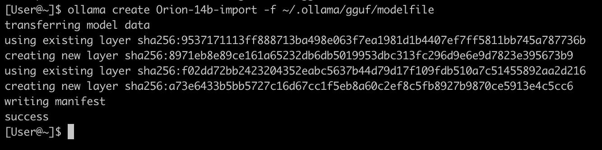

# 本地部署大模型

{: .no_toc}

## 目录

{: .no_toc .text-delta }


1. TOC
{:toc}

# 环境信息

本文中使用的硬件环境如下：

- MacBook Pro M3 Pro，18G 统一内存
- E5-2697v2 洋垃圾，128G 内存，3060Ti 8G 显卡

# Ollama

## 安装 Ollama 大模型管理工具

Ollama  是一个为本地环境中运行和定制大型语言模型而设计的工具。

它提供了一个简单而高效的接口，用于创建、运行和管理这些模型，同时还提供了一个丰富的预构建模型库，可以轻松集成到各种应用程序中。Ollama 的目标是使大型语言模型的部署和交互变得简单，无论是对于开发者还是对于终端用户。它支持多种操作系统，包括  macOS、Windows、Linux，以及通过 Docker 容器的部署方式。


下载链接：

[https://ollama.com/download](https://ollama.com/download)


此处下载 mac 版本，解压后直接运行即可：


## 运行大模型

通过下列命令运行 qwen 大模型：

```shell
 ollama pull qwen2:7b
 ollama run qwen2:7b
```


运行一些翻译任务，在 Activity Monitor 中可以看到 GPU 在运行：


### 资源消耗

运行 qwen2:7b 大概消耗 2.5G 内存（显存）。

运行 qwen:14b 大概消耗 3.2G 内存（显存）。

运行 qwen:32b 仅加载模型就消耗了 17.88G 内存，电脑只有 18G 统一显存，所以运行起来极其卡，一个简单的问题都要跑很久。

运行 llama3:8b 大概消耗 1.1G 内存（显存）。在进行大量翻译任务时直接飙升到 10G。


测试时发现，空载时使用的内存和运行翻译时的差距很大，18G 的 MacBook pro 可以用来进行大模型推理的内存差不多是 12.4G，超过的部分会调用内存：

```shell
[User@~]$ ollama ps
NAME         	ID          	SIZE  	PROCESSOR	UNTIL
llama3:latest	365c0bd3c000	6.7 GB	100% GPU 	4 minutes from now
[User@~]$
[User@~]$ ollama ps
NAME         	ID          	SIZE 	PROCESSOR     	UNTIL
llama3:latest	365c0bd3c000	13 GB	5%/95% CPU/GPU	4 minutes from now
```


### 调整上下文大小

在提示符中输入 `/set parameter num_ctx 40960` 来调整，默认应该是 2048：

```shell
>>> /set parameter num_ctx 40960
Set parameter 'num_ctx' to '40960'
>>>
```

### Ollama 命令行

```shell
[User@~]$ ollama --help
Large language model runner

Usage:
  ollama [flags]
  ollama [command]

Available Commands:
  serve       Start ollama
  create      Create a model from a Modelfile
  show        Show information for a model
  run         Run a model
  pull        Pull a model from a registry
  push        Push a model to a registry
  list        List models
  ps          List running models
  cp          Copy a model
  rm          Remove a model
  help        Help about any command
```

查看下载好的 LLM：

```shell
[User@~]$ ollama list
NAME    	ID          	SIZE  	MODIFIED
qwen:32b	26e7e8447f5d	18 GB 	2 minutes ago
qwen:14b	80362ced6553	8.2 GB	42 minutes ago
qwen2:7b	e0d4e1163c58	4.4 GB	43 minutes ago
```

查看模型详情

```shell
[User@~]$  ollama run qwen:14b
>>> /show info
  Model
  	arch            	qwen2
  	parameters      	14B
  	quantization    	Q4_0
  	context length  	32768
  	embedding length	5120

  Parameters
  	stop	"<|im_start|>"
  	stop	"<|im_end|>"

  License
  	Tongyi Qianwen LICENSE AGREEMENT
  	Tongyi Qianwen Release Date: August 3, 2023
```

查看已经加载的模型：

```
[User@~]$ ollama ps
NAME    	ID          	SIZE  	PROCESSOR	UNTIL
qwen2:7b	e0d4e1163c58	5.8 GB	100% GPU 	4 minutes from now
```


### Ollama API 请求

可以直接用 curl 来进行请求：

```shell
curl -XPOST http://localhost:11434/api/generate -d '{
  "model": "qwen2:7b",
  "prompt": "一加一等于几",
  "stream": false,
  "options": {
    "num_ctx": 4096
  }
}'
```

### 其他的一些模型

```shell
# 猎户星座 https://github.com/OrionStarAI/Orion ：
ollama pull orionstar/orion14b-q4
```


```shell
[User@~]$  ollama run orionstar/orion14b-q4
>>> /show info
  Model
  	arch            	orion
  	parameters      	14B
  	quantization    	Q4_K_M
  	context length  	4096
  	embedding length	5120
```


### 外部访问 Ollama API

如果要让外部能够访问到 Ollama API，需要添加环境变量，让主机监听 0.0.0.0（默认只监听 127.0.0.1）

```shell
# Macos 下
launchctl setenv OLLAMA_HOST "0.0.0.0:11434"
export OLLAMA_HOST="0.0.0.0:11434"

在 Activity Monitor 中退出 Ollama 服务，然后重新启用（UI 或者 CLI 均可）
ollama serve
```

Windows 下在下列位置添加环境变量：


**添加完成后别忘记关闭系统防火墙，或者放行相应的端口。**

## 使用 chatbox

默认 Ollama 只能使用 CLI 或者 API 来调用。我们可以安装 Chatbox 客户端，或者使用其他 App：


设置完成后直接开始聊天：


参考文档：

[https://mp.weixin.qq.com/s/7S8OMVcs8bVcSa-KKeYmgA](https://mp.weixin.qq.com/s/7S8OMVcs8bVcSa-KKeYmgA)

## 使用 open-webui

此处使用 [https://github.com/open-webui/open-webui](https://github.com/open-webui/open-webui) 来搭建 web-ui。

架构如下：

- Windows：安装 3060Ti 显卡，运行 qwen2:7b 模型，提供 Ollama API 服务；
- Linux：安装 Docker，运行 open-webui，连接 Ollama API。


Windows 上环境配置略。

Linux 上的启动命令如下：

```shell
docker run -d -p 3000:8080 -e OLLAMA_BASE_URL=http://10.10.52.244:11434 -v open-webui:/app/backend/data --name open-webui --restart always ghcr.io/open-webui/open-webui:main
```

安装完首次登录需要账户注册，注册完成后即可直接使用：


## 将 Hugging face 上的模型导入 Ollama 使用

参考文档：https://medium.com/@sudarshan-koirala/ollama-huggingface-8e8bc55ce572


GGUF（GPT-Generated Unified Format）是一种专为大型语言模型设计的二进制文件格式，用于存储推理模型，它由 Georgi Gerganov 提出，旨在提高模型存储效率、加载速度、兼容性和可扩展性。


1. 下载 Hugging face 上的模型：

此处下载了 [Orion 的 RAG 模型](https://huggingface.co/OrionStarAI/Orion-14B-Chat-RAG)，将其放在了 `~/.ollama/gguf/`目录中

2. 在`~/.ollama/gguf/`创建 modelfile 文件，引用上面的模型：

```
# Modelfile
FROM "./Orion-14B-Chat.gguf"

PARAMETER stop "<|im_start|>"
PARAMETER stop "<|im_end|>"

TEMPLATE """
<|im_start|>system
{{ .System }}<|im_end|>
<|im_start|>user
{{ .Prompt }}<|im_end|>
<|im_start|>assistant
"""
```

3. 使用 Ollama 命令行创建自定义模型，并运行该模型

```shell
ollama create Orion-14b-import -f ~/.ollama/gguf/modelfile
# 这个模型很耗显存，run 起来就耗费 29G 显存
ollama run Orion-14b-import
```




测试时还发现，系统会自动根据模型大小，使用 CPU 来进行处理（默认应该是 GPU 100%）：

```
[User@~]$ ollama ps
NAME                   	ID          	SIZE 	PROCESSOR      	UNTIL
Orion-14b-import:latest	9cf3034abf11	31 GB	60%/40% CPU/GPU	3 minutes from now
```


# LM Studio

在使用上面的 Ollama 时，会发现官方提供的模型并不多，如果想使用 hugging face 上的模型，还得做 [GGUF 到 Ollama 的转换](https://medium.com/@sudarshan-koirala/ollama-huggingface-8e8bc55ce572)。

查到有个工具叫 LM Studio，可以直接运行 Hugging face 上的模型，且支持 Mac。但是测试时发现，对于老款 CPU 支持不行，因此没能在 Windows 上成功运行。

## 安装 LM Studio


安装完成后可以直接在首页联网下载大模型：


下载完成后查看：


LM Studio 还有个好处是在下载模型时，会估算本地计算机是否能够流程运行：


## 运行大模型

在下列位置加载刚才下载的模型：


拷贝 Samples 中的命令，将 stream 修改为 false，然后运行：

```shell
curl http://localhost:1234/v1/chat/completions \
  -H "Content-Type: application/json" \
  -d '{ 
    "model": "LM Studio Community/Meta-Llama-3-8B-Instruct-GGUF",
    "messages": [ 
      { "role": "system", "content": "Always answer in rhymes." },
      { "role": "user", "content": "Introduce yourself." }
    ], 
    "temperature": 0.7, 
    "max_tokens": -1,
    "stream": false
}'
```

结果如下：


### 使用内置的 AI Chat 

在左侧点击 AI Chat 图标，新建 Chat，然后进行问答：


## 通过 python 调用

安装 openai 库：

```
pip3 install openai
```

然后运行下列 python 脚本：

```shell
# Example: reuse your existing OpenAI setup
from openai import OpenAI

# Point to the local server
client = OpenAI(base_url="http://localhost:1234/v1", api_key="lm-studio")

completion = client.chat.completions.create(
  model="LM Studio Community/Meta-Llama-3-8B-Instruct-GGUF",
  messages=[
    {"role": "system", "content": "Always answer in rhymes."},
    {"role": "user", "content": "Introduce yourself."}
  ],
  temperature=0.7,
)

print(completion.choices[0].message)
```

结果：

```shell
[User@~]$ python3 a.py
ChatCompletionMessage(content="I'm an AI so fine and so bright,\nI'll chat with you day and night!\nMy name is LLaMA, a language delight,\nHere to assist and make everything right!", role='assistant', function_call=None, tool_calls=None)
```

## 使用命令行

```
[User@ai]$ ~/.cache/lm-studio/bin/lms bootstrap
```


```shell
[User@~]$ lms
   __   __  ___  ______          ___        _______   ____
  / /  /  |/  / / __/ /___ _____/ (_)__    / ___/ /  /  _/
 / /__/ /|_/ / _\ \/ __/ // / _  / / _ \  / /__/ /___/ /
/____/_/  /_/ /___/\__/\_,_/\_,_/_/\___/  \___/____/___/

lms - LM Studio CLI - v0.2.23
GitHub: https://github.com/lmstudio-ai/lmstudio-cli

Usage
lms <subcommand>

where <subcommand> can be one of:

- status - Prints the status of LM Studio
- server - Commands for managing the local server
- ls - List all downloaded models
- ps - List all loaded models
- load - Load a model
- unload - Unload a model
- create - Create a new project with scaffolding
- log - Log operations. Currently only supports streaming logs from LM Studio via `lms log stream`
- import - Import a model file into LM Studio
- version - Prints the version of the CLI
- bootstrap - Bootstrap the CLI

For more help, try running `lms <subcommand> --help`
```

查看已经加载的模型：

```shell
[User@~]$ lms ps

   LOADED MODELS

Identifier: Qwen/Qwen2-7B-Instruct-GGUF/qwen2-7b-instruct-q8_0.gguf
  • Type:  LLM
  • Path: Qwen/Qwen2-7B-Instruct-GGUF/qwen2-7b-instruct-q8_0.gguf
  • Size: 8.10 GB
  • Architecture: Qwen2
```

查看已经下载的模型：

```shell
[User@~]$ lms ls

You have 2 models, taking up 13.02 GB of disk space.

LLMs (Large Language Models)                              SIZE      ARCHITECTURE
LM Studio Community/Meta-Llama-3-8B-Instruct-GGUF      4.92 GB         Llama
Qwen/Qwen2-7B-Instruct-GGUF                            8.10 GB         Qwen2          ✓ LOADED
```

# 通过 Python 调用大模型(26行代码体验大模型)

如果你用的是 MacBook，可以直接用 Python 代码来跑大模型（Python 库会自动下载并加载模型），不使用 Ollama 或者 LM Studio。

环境依赖安装（假设已安装 Python3 以及 pip3）：

```shell
# 安装依赖库
pip3 install torch transformers accelerate sentencepiece protobuf
```

编写下列 Python 代码：

```python
#  huggingface.py
import torch
from transformers import pipeline

# 此处使用了 huggingface 上的 h2oai/h2o-danube3-500m-chat 模型，需要国际互联网加速下载
pipe = pipeline(
    "text-generation",
    model="h2oai/h2o-danube3-500m-chat",
    torch_dtype=torch.bfloat16,
    device_map="auto",
)

# We use the HF Tokenizer chat template to format each message
# https://huggingface.co/docs/transformers/main/en/chat_templating
messages = [
    {"role": "user", "content": "Why is drinking water so healthy?"},
]
prompt = pipe.tokenizer.apply_chat_template(
    messages,
    tokenize=False,
    add_generation_prompt=True,
)
res = pipe(
    prompt,
    return_full_text=False,
    max_new_tokens=256,
)
print(res[0]["generated_text"])
```

运行：

```shell
export PYTORCH_ENABLE_MPS_FALLBACK=1
python3 huggingface.py
```


初次运行时报下面错误，mac 上不支持 mps，加上提示的环境变量 `PYTORCH_ENABLE_MPS_FALLBACK=1` 后便可正常运行：

```shell
NotImplementedError: The operator 'aten::isin.Tensor_Tensor_out' is not currently implemented for the MPS device. If you want this op to be added in priority during the prototype phase of this feature, please comment on https://github.com/pytorch/pytorch/issues/77764. As a temporary fix, you can set the environment variable `PYTORCH_ENABLE_MPS_FALLBACK=1` to use the CPU as a fallback for this op. WARNING: this will be slower than running natively on MPS. 
```


运行结果：


执行 Python 脚本时，系统会自动从 huggingface 下载模型，默认 Mac 保存在下列位置：

```shell
~/.cache/huggingface/hub
```


参考文档：

[https://huggingface.co/h2oai/h2o-danube3-500m-chat](https://huggingface.co/h2oai/h2o-danube3-500m-chat)

# 一个好玩的换脸应用（支持 mac）

项目地址：

[https://github.com/kijai/ComfyUI-LivePortraitKJ?tab=readme-ov-file](https://github.com/kijai/ComfyUI-LivePortraitKJ?tab=readme-ov-file)

安装及使用：

```
pip3 install insightface
git clone https://github.com/kijai/ComfyUI-LivePortraitKJ.git
cd ComfyUI-LivePortraitKJ
pip3 install -r requirements.txt
```


# 开发

## langchain

参考文章：

https://medium.com/@abonia/ollama-and-langchain-run-llms-locally-900931914a46


# 一些项目

- 基于 Ollama 的自动纠正 RAG 项目 [https://github.com/Nagi-ovo/CRAG-Ollama-Chat/tree/main](https://github.com/Nagi-ovo/CRAG-Ollama-Chat/tree/main)


- rag-chatbot 是个简单的支持本地运行的 RAG 应用，可以调用 `Huggingface` 和 `Ollama`上的模型。

支持处理多个 PDF 文件。


项目地址：[https://github.com/datvodinh/rag-chatbot](https://github.com/datvodinh/rag-chatbot)

安装报错，没再研究，可能和 OS 兼容性有关系。
