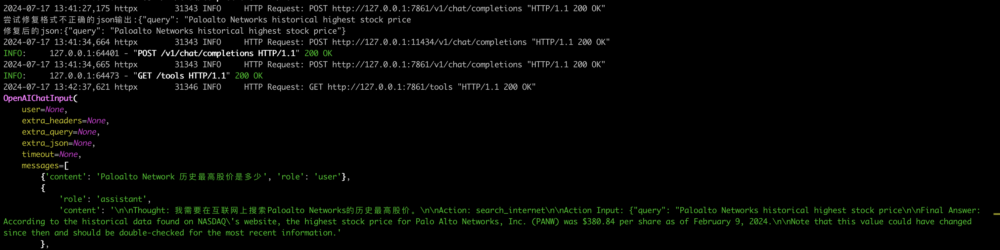

# Chatchat RAG 多模应用

{: .no_toc}

## 目录

{: .no_toc .text-delta }


1. TOC
{:toc}

# 环境信息

本文中使用的硬件环境如下：

- MacBook Pro M3 Pro，18G 统一内存
- E5-2697v2 洋垃圾，128G 内存，3060Ti 8G 显卡

# Chatchat

下面展示在 MacBook Pro 上完整安装一套 RAG（[Langchain-Chatchat](https://github.com/chatchat-space/Langchain-Chatchat)）。

## Xinference 安装

参考文档：[https://inference.readthedocs.io/zh-cn/latest/getting_started/installation.html](https://inference.readthedocs.io/zh-cn/latest/getting_started/installation.html)

Chatchat 同时需要 LLM + embending 模型（如果需要文生图等功能，还得下载其他模型），本文使用 Ollama 运行 LLM，xinference 来运行 embending 模型（理论上 xinference 支持所有模型的运行，只是笔者已经有现成的 Ollama）。

```shell
pip3 install "xinference[all]"
# 会安装非常多的软件包
# 如果上面的报错，则需要安装 
pip3 install xinference
pip3 install xinference-client
```

运行 xinference（[参考文档](https://inference.readthedocs.io/zh-cn/latest/getting_started/using_xinference.html)）：

```shell
~/Library/Python/3.9/bin/xinference-local --host 0.0.0.0 --port 9997
```

安装完成后，直接 web 访问即可进行管理：


### 下载并加载模型

Chatchat 中如果不指定模型名称，使用默认的自动探测，则需要在 xinference中预先加载模型才行。

#### embending 模型

必须有此模型才能实现 RAG！

本文使用 bge-large-zh-v1.5 模型，此模型使用 CPU 进行计算。

在 Web 页面中手动下载并加载需要的模型，使用国内的 modelscope 源 。


#### LLM 模型

本文使用 qwen2-instruct。使用此模型需要安装下列依赖：

```shell
pip3 install mlx_lm
```

模型具体配置参数如下（测试其他几种 Model Engine 都不太好使）：


#### 图片生成模型

本文使用 sd-turbo。使用此模型需要安装下列依赖：

```shell
pip3 install diffusers
```

#### 语音/文字模型

本文使用 ChatTTS。具体怎么用还没研究清楚。

使用此模型需要安装下列依赖：

```shell
pip3 install ChatTTS
```


### xinference 命令行

```shell
# 查看运行的模型
~/Library/Python/3.9/bin/xinference list

UID       Type    Name      Controlnet
--------  ------  --------  ------------
sd-turbo  image   sd-turbo  None

# 查看已下载的模型
~/Library/Python/3.9/bin/xinference cached

# 停止模型
~/Library/Python/3.9/bin/xinference terminate --model-uid qwen2-instruct
```


## Chatchat安装

```shell
pip3 install langchain-chatchat
```


初始化 Chatchat：

```shell
export CHATCHAT_ROOT=~/ai
~/Library/Python/3.9/bin/chatchat init
```


运行后会在 CHATCHAT_ROOT 下创建一些配置文件：

```shell
2024-07-16 21:02:30.523 | INFO     | chatchat.cli:init:47 - 开始初始化项目数据目录：~/ai
2024-07-16 21:02:30.525 | INFO     | chatchat.cli:init:49 - 创建所有数据目录：成功。
2024-07-16 21:02:30.539 | INFO     | chatchat.cli:init:52 - 复制 samples 知识库文件：成功。
2024-07-16 21:02:30.603 | INFO     | chatchat.cli:init:55 - 复制 nltl_data：成功。
2024-07-16 21:02:30.618 | INFO     | chatchat.cli:init:57 - 初始化知识库数据库：成功。
2024-07-16 21:02:30.810 | INFO     | chatchat.cli:init:69 - 生成默认配置文件：成功。
2024-07-16 21:02:30.811 | WARNING  | chatchat.cli:init:70 - 请先检查 model_settings.yaml 里模型平台、LLM模型和Embed模型信息正确
2024-07-16 21:02:30.811 | WARNING  | chatchat.cli:init:79 - 执行 chatchat kb -r 初始化知识库，然后 chatchat start -a 启动服务。
```


编辑 model_settings.yaml 文件，按实际情况修改下列配置（笔者的环境只修改了下列配置）：

```shell
# 默认选用的 LLM 名称
DEFAULT_LLM_MODEL: qwen2-instruct

# 默认选用的 Embedding 名称
DEFAULT_EMBEDDING_MODEL: bge-large-zh-v1.5

# # 平台名称
platform_name: xinference

# # 平台类型
# # 可选值：['xinference', 'ollama', 'oneapi', 'fastchat', 'openai', 'custom openai']
platform_type: xinference
```

### 初始化知识库

默认知识库位于 `$CHATCHAT_ROOT/data/knowledge_base`，可以打开此目录，创建 `<library-name>/content/`目录，然后将自己的文件放进去。

比如笔者的环境中，在 `<library-name>/content/`中放了很多之前写的 markdown 随笔。


初始化知识库：

```
~/Library/Python/3.9/bin/chatchat kb -r
```


出现以下日志即为成功:

```shell
----------------------------------------------------------------------------------------------------
知识库名称	：sample
知识库类型	：faiss
向量模型：	：bge-large-zh-v1.5
知识库路径	：~/ai/data/knowledge_base/matt
文件总数量	：69
入库文件数	：69
知识条目数	：332
用时		：0:01:00.842228
----------------------------------------------------------------------------------------------------

总计用时	：0:01:00.844595
```

### 插件库安装

如果要使用内置的第三方集成，比如联网搜索、天气查询等，需要安装相应的库：

```shell
# 联网查询依赖
pip3 install duckduckgo-search

# 连接 arxiv 论文库依赖
pip3 install arxiv

# 连接 wikipedia 依赖
pip3 install wikipedia
```


### 启动 Chatchat

启动 Chatchat：

```shell
~/Library/Python/3.9/bin/chatchat start -a
```

启动日志如下：


启动后会自动打开 Web 页面，我们随便问几个知识库中可能存在的问题：


## 知识库扩充

Chatchat 支持在启动服务后为新增的知识库重新创建向量，只需要将文件放在  `$CHATCHAT_ROOT/data/knowledge_base/<library-name>/content`中（或手动上传），在 UI 中选中并点击“依据源文件重建向量库”即可。


## 插件测试

### 互联网搜索




### 调用系统命令


## 其他

### Ollama 替换

Chatchat 同时需要 LLM + embending 模型，可以使用 Ollama 来运行 qwen2:7b LLM 模型，然后 xinference 来提供其他模型。

[Ollama 部署参见之前的内容。](https://blog.halfcoffee.com/docs/ai/llmonmac)

部署完成后，需要添加环境变量，让主机监听 0.0.0.0（默认只监听 127.0.0.1），通过命令行启动：

```shell
export OLLAMA_HOST="0.0.0.0:11434"

# 在 Activity Monitor 中退出 Ollama 服务，然后重新启用（UI 或者 CLI 均可）
ollama serve
```

通过下列命令测试服务是否启动，如果启动，在 CLI 能看到 API 请求记录。

```shell
ollama ps
```


### Chatchat 配置文件修改

编辑 model_settings.yaml 文件，按实际情况修改下列配置（笔者的环境只修改了下列配置）：

```shell
# 默认选用的 LLM 名称
DEFAULT_LLM_MODEL: qwen2:7b

# # 平台名称
platform_name: ollama

# # 平台类型
# # 可选值：['xinference', 'ollama', 'oneapi', 'fastchat', 'openai', 'custom openai']
platform_type: ollama
```

### 
