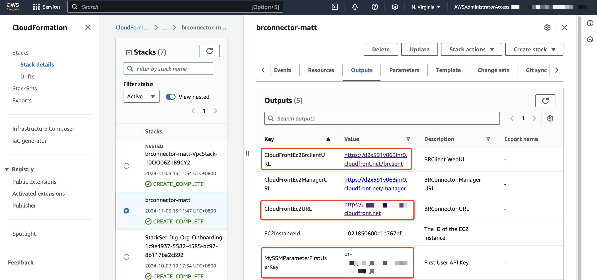
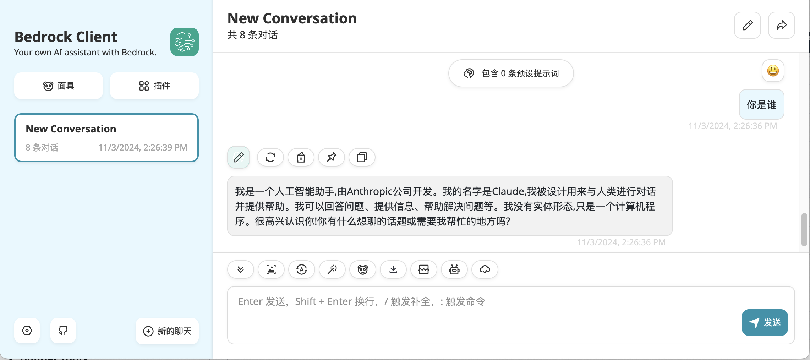

# 使用 AWS Bedrock

{: .no_toc}

## 目录

{: .no_toc .text-delta }

1. TOC
{:toc}

## 背景

最近玩 Infiniflow 出品的 RAG 软件 Ragflow，东西挺好，就是用了很多模型，有些本地运算实在太麻烦，于是想着用 AWS Bedrock 接入一些云端模型，搞一个分布式 RAG 应用部署。

## 关于 Bedrock

也是一开始接触这个方案，感觉 Bedrock 能做的事情在首页都已经列完了，本文先打算用 BRConnect 发布一个 Claude 的 LLM 出来，方便远程调用。

## 订阅模型及 BRConnect 部署

首先，只有部分区域才有 Bedrock 服务，建议使用美区。有些区域虽然有 Bedrock，但是提供的模型比较少（比如新加坡只有 5 个模型）。

具体的支持列表见：

[https://docs.aws.amazon.com/bedrock/latest/userguide/models-regions.html](https://docs.aws.amazon.com/bedrock/latest/userguide/models-regions.html)

默认 Bedrock 有 30 多个模型，涵盖文本/图片 LLM、多模态 LLM、embedding 模型等，可以在下列位置 Request Access。

请求完毕后，状态变为 Access granted 即表示可用。

### 安装 BRConnect

这是一个简易的 Bedrock API 转发工具，支持 OpenAI 的标准 API 接口。部署完成后，会提供 API 访问地址以及 API Key。

项目地址：[https://github.com/aws-samples/sample-connector-for-bedrock?tab=readme-ov-file](https://github.com/aws-samples/sample-connector-for-bedrock?tab=readme-ov-file)

我直接使用 Stack 的方式进行了部署，按照默认参数部署即可：

https://aws-samples.github.io/sample-connector-for-bedrock/home/deployment/

部署完成后，在 Output 中可以看到下面三个输出：

- 第一个是 Web 访问的入口
- 第二个是 API 访问的 URL
- 第三个是 API Key

### 测试

本文直接使用 WebUI 访问进行测试，需要在配置中填写下列项目：

- 勾选 BRConnector
- 设置 URL（上面第二个 Output）
- 设置 API Key（上面第三个 Output）
- 模型名称（可以先填写上面那几个，保存后在下面模型的位置点刷新，就能看到），此处填写的是之前订阅的 Claude 3.5 Sonnet

保存后，就可以使用了：

### Bedrock 桌面客户端

如果想有个桌面 App 方便访问，Github 上也有相应的仓库，详见：

[https://github.com/aws-samples/sample-client-for-amazon-bedrock](https://github.com/aws-samples/sample-client-for-amazon-bedrock)
