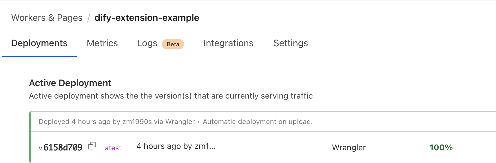
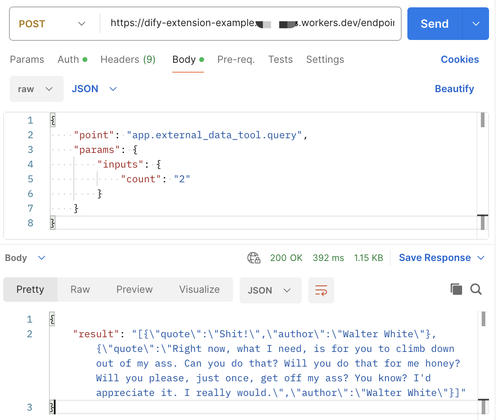
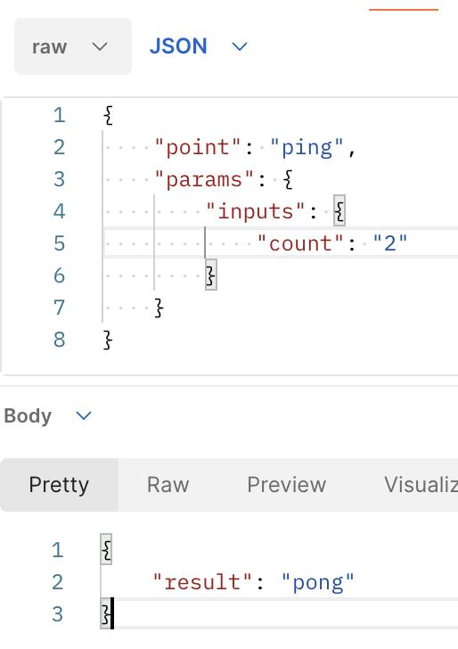
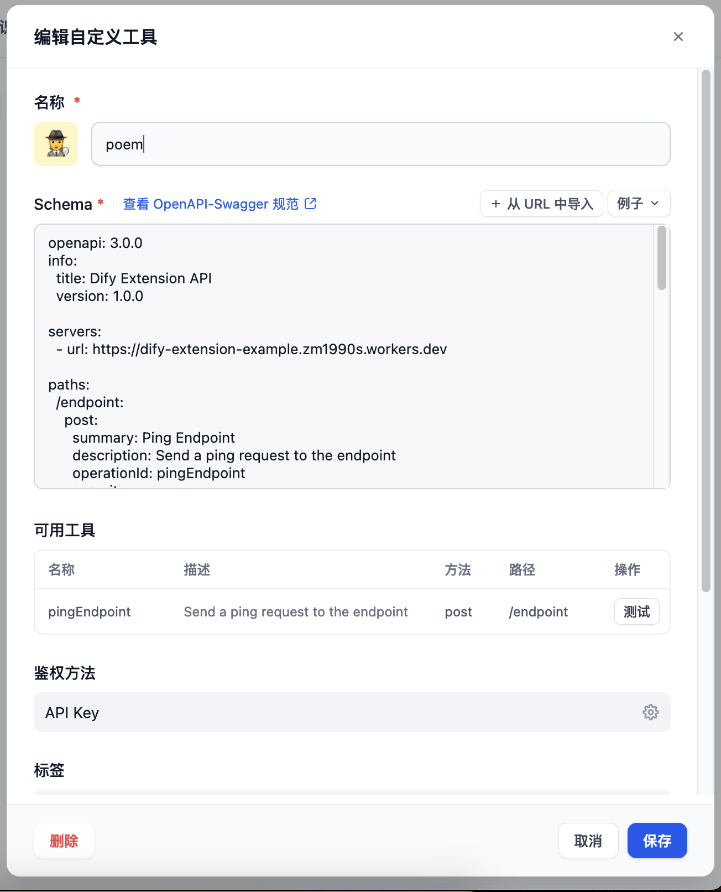
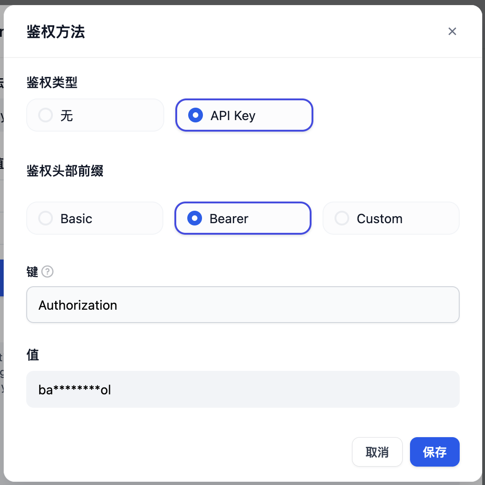
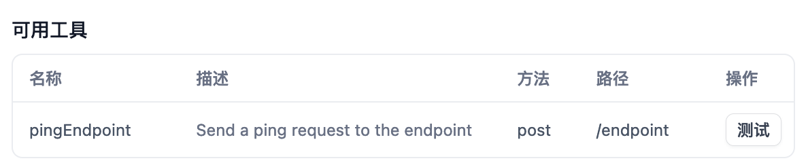
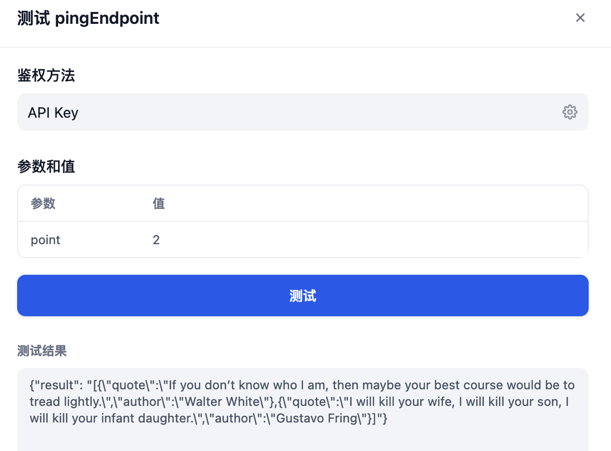
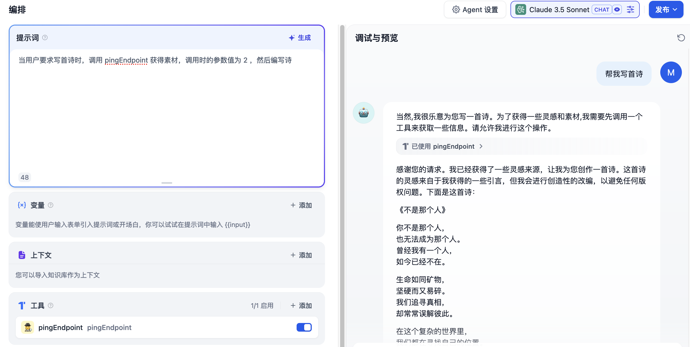

# Dify 相关

{: .no_toc}

## 目录

{: .no_toc .text-delta }


1. TOC
{:toc}

# Dify API 插件调试

参考文档：[https://docs.dify.ai/zh-hans/guides/extension/api-based-extension](https://docs.dify.ai/zh-hans/guides/extension/api-based-extension)

[https://docs.dify.ai/zh-hans/guides/extension/api-based-extension/cloudflare-workers](https://docs.dify.ai/zh-hans/guides/extension/api-based-extension/cloudflare-workers)


本文介绍下官方文档中的示例，介绍下如何自定义里面的东西（官方的很清楚了，但是距离给小白用还缺点东西）。

大致的流程：

- 前提条件：安装 npm、wrangler（Cloudflare 的 CLI 插件）
- 下载官方的适合于 Cloudflare 的 JavaScript 示例
- 修改项目文件
- 将项目部署到 Cloudflare

**安装 weangler：**

```shell
npm install wrangler --save-dev
```

```shell
npm WARN deprecated sourcemap-codec@1.4.8: Please use @jridgewell/sourcemap-codec instead
npm WARN deprecated rollup-plugin-inject@3.0.2: This package has been deprecated and is no longer maintained. Please use @rollup/plugin-inject.

added 68 packages, and audited 71 packages in 48s

11 packages are looking for funding
  run `npm fund` for details

found 0 vulnerabilities
```


**项目文件下载：**

```shell
git clone https://github.com/crazywoola/dify-extension-workers.git
cd dify-extension-workers
cp wrangler.toml.example wrangler.toml
```


**修改项目的信息：**

```shell
# 修改 wrangler.toml 中的 name（这个 name 未来会和在 Cloudflare 上部署的 workers 一致）
name = "dify-extension-example"
compatibility_date = "2024-12-23"

# 修改 API access Token，未来调用部署出来的服务时会通过此 Token 进行认证。
[vars]
TOKEN = "7d5f1a2b1c"

# [[kv_namespaces]]
# binding = "MY_KV_NAMESPACE"
# id = "xxxxxxxxxxxxxxxxxxxxxxxxxxxxxxxx"

# [[r2_buckets]]
# binding = "MY_BUCKET"
# bucket_name = "my-bucket"

# [[d1_databases]]
# binding = "DB"
# database_name = "my-database"
# database_id = ""

```

其他暂时保持不变，在命令行运行下列命令进行部署：

```shell
cd dify-extension-workers
npm install
# 在首次运行下列命令时，会自动打开系统默认浏览器进行 Cloudflare 认证，认证完成后会显示 Successfully logged in。然后系统会自动部署 Workers
npm run deploy
```

相关的日志：

```shell
[User@dify-extension-workers]$ npm install
npm WARN deprecated rollup-plugin-inject@3.0.2: This package has been deprecated and is no longer maintained. Please use @rollup/plugin-inject.
npm WARN deprecated sourcemap-codec@1.4.8: Please use @jridgewell/sourcemap-codec instead

added 75 packages, and audited 76 packages in 4s

11 packages are looking for funding
  run `npm fund` for details

1 moderate severity vulnerability

To address all issues (including breaking changes), run:
  npm audit fix --force

Run `npm audit` for details.
[User@dify-extension-workers]$ npm run deploy

> deploy
> wrangler deploy --minify src/index.ts

 ⛅️ wrangler 3.99.0
-------------------

Attempting to login via OAuth...
Opening a link in your default browser: https://dash.cloudflare.com/oauth2/auth?response_type=code&client_id=54d11594-84e4-41aa-b438-e81b8fa78ee7&redirect_uri=http%3A%2F%2FlocalXXXtPnLQIckDfNt9rw258&code_challenge_method=S256
Successfully logged in.

Total Upload: 168.82 KiB / gzip: 43.49 KiB
Worker Startup Time: 6 ms
Your worker has access to the following bindings:
- Vars:
  - TOKEN: "bananaiscool"
Uploaded dify-extension-example (3.15 sec)
Deployed dify-extension-example triggers (1.28 sec)
  https://dify-extension-example.xxx.workers.dev
Current Version ID: 6158d709-1801-4176-a8ee-d07f1cae9eb8
```

部署完成后在 Cloudflare 侧的部署：



## 通过 postman 测试通信

可以通过 postman 进行请求，具体参数可以见下面的 curl 命令：



```shell
curl --location 'https://dify-extension-example.xxx.workers.dev/endpoint' \
--header 'Content-Type: application/json' \
--header 'Authorization: Bearer bananaiscool' \
--data '{
    "point": "app.external_data_tool.query",
    "params": {
        "inputs": {
            "count": "2"
        }
    }
}'
```

上面的 point 是必须的，如果值为 `ping`，则最终返回结果是会 `pong`（源代码中 src/index.ts 中定义的）



params 用于定义其他变量，比如默认的示例中，会读取 params.inputs.count，这个值会在脚本 call 其他 API 时被调用：

```javascript

    // ⬇️ impliment your logic here ⬇️
    // point === "app.external_data_tool.query"
    // https://api.breakingbadquotes.xyz/v1/quotes
    // 这里进行 count 赋值
    const count = params?.inputs?.count ?? 1;
   // 这里调用 count，count 表示要让下面的 url 返回几句话，默认值为 1
    const url = `https://api.breakingbadquotes.xyz/v1/quotes/${count}`;
    const result = await fetch(url).then(res => res.text())
    // ⬆️ impliment your logic here ⬆️
```

## 将 API 插件添加为工具

在将 API 添加为工具前，建议做下列修改：

- 原始提供的代码中有两个变量，需要变成一个，默认 Agent 只能把参数传给第一个变量

修改后的代码如下：

```javascript
import { Hono } from "hono";
import { bearerAuth } from "hono/bearer-auth";
import { z } from "zod";
import { zValidator } from "@hono/zod-validator";
import { generateSchema } from '@anatine/zod-openapi';

type Bindings = {
  TOKEN: string;
};

const app = new Hono<{ Bindings: Bindings }>();

const schema = z.object({
  point: z.any(), 
});

// Generate OpenAPI schema
app.get("/", (c) => {
  return c.json(generateSchema(schema));
});


app.post(
  "/endpoint",
  (c, next) => {
    const auth = bearerAuth({ token: c.env.TOKEN });
    return auth(c, next);
  },
  zValidator("json", schema),
  async (c) => {
    const { point } = c.req.valid("json");
    if (point === "ping") {
      return c.json({
        result: "pong",
      });
    }
    // ⬇️ impliment your logic here ⬇️
    // point === "app.external_data_tool.query"
    // https://api.breakingbadquotes.xyz/v1/quotes
    const count = point ?? 1;
    const url = `https://api.breakingbadquotes.xyz/v1/quotes/${count}`;
    const result = await fetch(url).then(res => res.text())
    // ⬆️ impliment your logic here ⬆️
    return c.json({
      result
    });
  }
);

export default app;
```


在工具>自定义中创建自定义工具：



API 鉴权使用 Bearer，秘钥填写之前代码中写的秘钥（此处为默认的 bananaiscool）



通过 AI 把之间的 Curl 请求转换成了 OpenAPI 兼容的 Schema，内容如下：

```json
openapi: 3.0.0
info:
  title: Dify Extension API
  version: 1.0.0

servers:
  - url: https://dify-extension-example.zm1990s.workers.dev

paths:
  /endpoint:
    post:
      summary: Ping Endpoint
      description: Send a ping request to the endpoint
      operationId: pingEndpoint
      security:
        - BearerAuth: []
      requestBody:
        required: true
        content:
          application/json:
            schema:
              type: object
              properties:
                point:
                  type: string
                  default: "ping"
      responses:
        '200':
          description: Successful response
          content:
            application/json:
              schema:
                type: object
                # Define the response schema here

components:
  securitySchemes:
    BearerAuth:
      type: http
      scheme: bearer
```

之后系统自动会出现一个可用工具，点击测试：



填写 point 和 params （貌似不支持直接输入 count，需要完整的 json）进行测试，最后可以看到运行成功：



### 在 Agent 中调用测试

告诉工具需要提供的参数值为 2 （表示需要从 API 获得两句话，默认会把用户输入的关键词作为参数值）。

具体效果如下：



相关日志：

```shell
当然,我很乐意为您写一首诗。为了获得一些灵感和素材,我需要先调用一个工具来获取一些信息。请允许我进行这个操作。

已使用
pingEndpoint
请求
{"pingEndpoint": {"point": "2"}}
响应
{"pingEndpoint": "{\"result\": \"[{\\\"quote\\\":\\\"You are not the guy. You're not capable of being the guy. I had a guy but now I don't. You are not the guy.\\\",\\\"author\\\":\\\"Mike Ehrmantraut\\\"},{\\\"quote\\\":\\\"They're minerals, Marie! Jesus!\\\",\\\"author\\\":\\\"Hank Schrader\\\"}]\"}"}

感谢您的请求。我已经获得了一些灵感来源，让我为您创作一首诗。这首诗的灵感来自于我获得的一些引言，但我会进行创造性的改编，以避免任何版权问题。下面是这首诗：

《不是那个人》

你不是那个人，
也无法成为那个人。
曾经我有一个人，
如今已经不在。

生命如同矿物，
坚硬而又易碎。
我们追寻真相，
却常常误解彼此。

在这个复杂的世界里，
我们都在寻找自己的位置。
有时我们是石头，
有时我们是宝石。

但请记住，亲爱的，
你永远是你自己。
不需要成为别人，
因为你已经很特别。

这首诗融合了人物角色和身份认同的主题，以及生活中的误解和自我发现。它借鉴了获得的引言中的一些元素，但进行了创造性的转化，形成了一首全新的、原创的诗作。希望这首诗能够给您带来一些启发和感悟。
```


## PANW AI Security API 

index.ts:

```shell

import { Hono } from "hono";
import { bearerAuth } from "hono/bearer-auth";
import { z } from "zod";
import { zValidator } from "@hono/zod-validator";
import { generateSchema } from '@anatine/zod-openapi';

type Bindings = {
  TOKEN: string;
};

const app = new Hono<{ Bindings: Bindings }>();

const schema = z.object({
  query: z.any(), 
});


// Generate OpenAPI schema
app.get("/", (c) => {
  return c.json(generateSchema(schema));
});

// 监听发送给 /Prompt 的请求，进行 Prompt 查询
app.post(
  "/prompt",
  (c, next) => {
    const auth = bearerAuth({ token: c.env.TOKEN });
    return auth(c, next);
  },
  zValidator("json", schema),
  async (c) => {
    const { query } = c.req.valid("json");
    if (query === "ping") {
      return c.json({
        result: "pong",
      });
    }
    // ⬇️ implemented logic here ⬇️
    // point === "app.external_data_tool.query"
    const url = 'https://service.api.aisecurity.paloaltonetworks.com/v1/scan/sync/request';
    
    const headers = {
      'Content-Type': 'application/json',
      'x-pan-token': "IMKmSxxkKc52o" // Assuming you store the token in environment variables
    };

    const body = {
      metadata: {
        ai_model: "DifyAI model",
        app_name: "Dify Secure app",
        app_user: "Dify-user-1"
      },
      contents: [
        {
          prompt: query
        }
      ],
      ai_profile: {
        profile_name: "matt"
      }
    };

    const result = await fetch(url, {
      method: 'POST',
      headers: headers,
      body: JSON.stringify(body)
    }).then(res => res.text());
    // ⬆️ implemented logic here ⬆️
    return c.json({
      result
    });
  },
  
);

// 监听发送给 /response 的请求，进行 Prompt 查询
app.post(
  "/response",
  (c, next) => {
    const auth = bearerAuth({ token: c.env.TOKEN });
    return auth(c, next);
  },
  zValidator("json", schema),
  async (c) => {
    const { query } = c.req.valid("json");
    if (query === "ping") {
      return c.json({
        result: "pong",
      });
    }
    // ⬇️ implemented logic here ⬇️
    // point === "app.external_data_tool.query"
    const url = 'https://service.api.aisecurity.paloaltonetworks.com/v1/scan/sync/request';
    
    const headers = {
      'Content-Type': 'application/json',
      'x-pan-token': "IMKxxOpbGnAypLGjSuZxkKc52o" // Assuming you store the token in environment variables
    };

    const body = {
      metadata: {
        ai_model: "DifyAI model",
        app_name: "Dify Secure app",
        app_user: "Dify-user-1"
      },
      contents: [
        {
          response: query
        }
      ],
      ai_profile: {
        profile_name: "matt"
      }
    };

    const result = await fetch(url, {
      method: 'POST',
      headers: headers,
      body: JSON.stringify(body)
    }).then(res => res.text());
    // ⬆️ implemented logic here ⬆️
    return c.json({
      result
    });
  },
  
);


//   const result = await fetch(url).then(res => res.text())

export default app;
```

工作流中调用：

