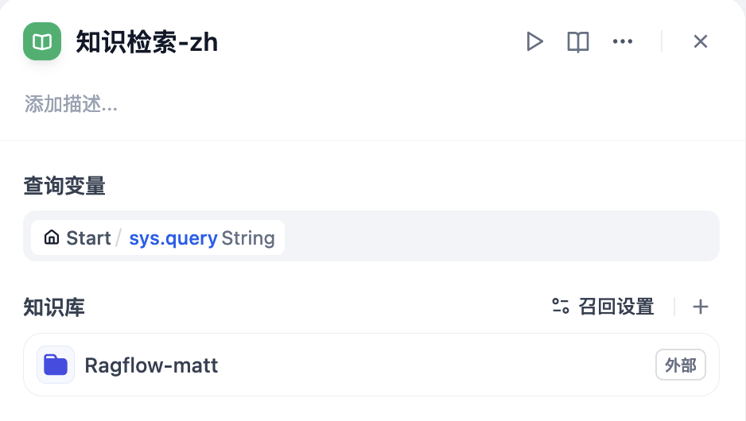

# Dify 与 Ragflow 对接的三种方式

{: .no_toc}

## 目录

{: .no_toc .text-delta }


1. TOC
{:toc}

## 概述

经过测试，Dify 有三种和 Ragflow 对接的方法：

- 原生对接：在 Ragflow 0.13 之后，Ragflow 可以以外部知识库的形式添加到 Dify，Dify 在流程中即可知己查询知识库，**推荐使用此方式**
- 调用 chats API
- 调用 retrieval API

## Ragflow 外部知识库对接

Ragflow 从0.13.0版本开始提供 Dify 对接 API，通过此 API 可以实现 Dify 使用 Ragflow 作为外部知识库。

具体配置如下：

在知识库页面右上角，点击“外部知识库 API”：


设置名称、API Endpoint 以及 API Key：

API Endpoint 格式是：[http|https]://[ragflow-ip|ragflow-domain]/api/v1/dify


添加完成后，再点击支持库的“连接外部知识库”。


填写知识库的 ID（ID 可以通过 GET http://ragflow-ip/api/v1/datasets?name=wiki 获得，此处 Ragflow 上的知识库名称为 wiki）


设置完成后，在工作流就可以调用 Ragflow 的知识库进行测试了：



测试时发现，在工作流中调用知识库检索时，最好一次只选择一个知识库，否则可能查询结果为空。

## HTTP 调用 chats API

**参考文档：**[https://ragflow.io/docs/dev/http_api_reference#converse-with-chat-assistant](https://ragflow.io/docs/dev/http_api_reference#converse-with-chat-assistant)

**原理：**通过 HTTP 组件调用 Ragflow chats API，将用户请求发送给 Ragflow 进行处理，Ragflow 将最终结果返回 Dify 进行展示。

**优点：** 知识库查询效果基本等同于原生 Ragflow

**缺点：**运行比较慢，不支持数据来源展示


请求 URL：

http://ragflow.test.com/api/v1/chats/bad63418b62611ef851c0242ac120006/completions

请求方法：POST

请求 Body：

```json
{ 
"question": "{{#sys.query#}}",
"session_id": "1956084d4c894d1a92d83ee6063ceb26",
"stream": false
}
```

参数说明：

- 请求 URL 中的 ID：Chat ID，可以在 Ragflow UI 中直接获取
- question：发给 Ragflow Chat 的查询内容
- session_id：会话 ID，如果不填，则每次 HTTP 调用都会在 Ragflow 中创建一个新的会话，建议使用固定的 session_id。此 ID 需要通过 API 获取（GET `/api/v1/chats/{chat_id}/sessions?name={session_name}`）
- stream false：禁用流式传输功能

Dify 侧示例：


此处测试时发现不能将 Ragflow 返回的内容直接输出，编码会变成三位数的字符 Code，所以此处配置了大模型二次输出。


## HTTP 调用 retrieval API

**参考文档：**[https://ragflow.io/docs/dev/http_api_reference#retrieve-chunks](https://ragflow.io/docs/dev/http_api_reference#retrieve-chunks)

**原理：**通过 HTTP 组件调用 Ragflow retrieval API，让 Ragflow 召回 chunk，Dify 侧将 chunk 丢给大模型汇总后回答问题。

**优点：** 速度相对前者比较快

**缺点：**Chunk 比较大时流程容易失败，需要人工进行限制


请求 URL：

http://ragflow.test.com/api/v1/retrieval

请求方法：POST

请求 Body：

```json
{ 
"question": "{{#sys.query#}}",
"dataset_ids": ["e92c886ab55411efacbb0242ac120006"],
"limit": "10",
"similarity_threshold": "0.5"
}
```

参数说明：

- question：发给 Ragflow Chat 的查询内容
- dataset_ids：文档库的 ID，可以通过 API 获取（GET `/api/v1/datasets?name={dataset_name}`）
- Limit：限制召回的 chunk 数量
- similarity_threshold：设置匹配相似度

Dify 侧示例：


