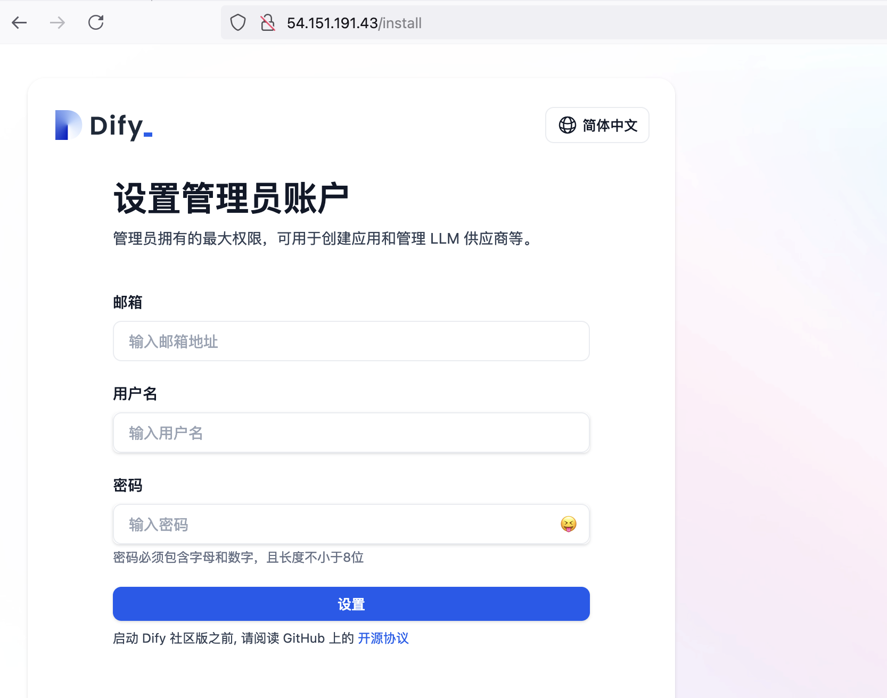

# Dify

{: .no_toc}

## 目录

{: .no_toc .text-delta }


1. TOC
{:toc}

# 底层环境部署

此处使用 AWS 上的 Rocky 9 安装 docker：

```shell
# 添加源
dnf config-manager --add-repo=https://download.docker.com/linux/centos/docker-ce.repo
yum makecache

# 安装
yum install -y docker-ce git

# 启动服务
systemctl enable docker
systemctl start docker

# 将系统默认的 Rocky 用户添加到 Docker 组，允许其使用 Docker 服务
groupadd docker
usermod -aG docker rocky
newgrp docker
```


# 安装 Dify

```shell
git clone https://github.com/langgenius/dify.git
cd dify/docker
cp .env.example .env
docker compose up -d
```


安装完毕后确保所有容器正常启动：

```shell
[root@Dify docker]# docker ps
CONTAINER ID   IMAGE                              COMMAND                  CREATED         STATUS                            PORTS                                                                      NAMES
4b0e8a1e460e   nginx:latest                       "sh -c 'cp /docker-e…"   6 seconds ago   Up 3 seconds                      0.0.0.0:80->80/tcp, :::80->80/tcp, 0.0.0.0:443->443/tcp, :::443->443/tcp   docker-nginx-1
7903253e5406   langgenius/dify-api:0.12.1         "/bin/bash /entrypoi…"   6 seconds ago   Up 4 seconds                      5001/tcp                                                                   docker-api-1
11f6e3a68ab6   langgenius/dify-api:0.12.1         "/bin/bash /entrypoi…"   6 seconds ago   Up 4 seconds                      5001/tcp                                                                   docker-worker-1
26e845fb7036   ubuntu/squid:latest                "sh -c 'cp /docker-e…"   7 seconds ago   Up 5 seconds                      3128/tcp                                                                   docker-ssrf_proxy-1
7934bcc5ecd1   semitechnologies/weaviate:1.19.0   "/bin/weaviate --hos…"   7 seconds ago   Up 5 seconds                                                                                                 docker-weaviate-1
3b970a1a0eaa   postgres:15-alpine                 "docker-entrypoint.s…"   7 seconds ago   Up 5 seconds (health: starting)   5432/tcp                                                                   docker-db-1
5fa211636be3   langgenius/dify-web:0.12.1         "/bin/sh ./entrypoin…"   7 seconds ago   Up 5 seconds                      3000/tcp                                                                   docker-web-1
8f56da1978dd   redis:6-alpine                     "docker-entrypoint.s…"   7 seconds ago   Up 5 seconds (health: starting)   6379/tcp                                                                   docker-redis-1
e41a5778f7a2   langgenius/dify-sandbox:0.2.10     "/main"                  7 seconds ago   Up 5 seconds (health: starting)                                                                              docker-sandbox-1
[root@Dify docker]#
```


稍等片刻即可看到 Dify 的初始化界面，只需要设置管理员登录凭据即可。




# Dify 基本配置

登录完成后，在右上角点击设置。


点击模型提供商，按实际情况对接大模型。


## OpenAI 对接示例


### Openai API key 获取

需要在下列位置获取 Openai 的 Organization ID 以及 API key：

[https://platform.openai.com/settings/](https://platform.openai.com/settings/)


## AWS Bedrock 对接示例


### 为 Bedrock 创建 Access Key

参考文档：

[https://community.qlik.com/t5/Official-Support-Articles/How-to-get-started-with-the-Amazon-Bedrock-connector-in-Qlik/ta-p/2138685](https://community.qlik.com/t5/Official-Support-Articles/How-to-get-started-with-the-Amazon-Bedrock-connector-in-Qlik/ta-p/2138685)


打开 IAM 管理，新增 Users：


## 对接后的测试

在完成大模型对接后，可以新建一个应用然后进行对话测试，确保大模型可用：


## 聊天助手

创建一个工作流编排助手：


# 其他

## AWS 上服务的访问限制

默认 Dify 使用 HTTP 端口暴露，此处借助 Cloudflare 的免费服务执行 TLS 卸载，在 Dify 端（AWS）则进行访问 IP 限制，只允许 Cloudflare 的 IP 访问。

具体 Cloudflare 的节点 IP 地址段见：[https://www.cloudflare.com/ips/](https://www.cloudflare.com/ips/)


### Cloudflare 侧配置

SSL/TLS encryption使用 Flexible 模式，允许 Cloudflare 通过 HTTP 访问后端服务器：


启用强制 HTTPS：


配置 DNS A 记录：


### 添加 Prefix-list


创建完成：


### 添加 SecurityGroup


添加三条 Inbound rule，允许 Cloudflare IP 到 HTTP/HTTPS 的访问，同时允许管理员通过 SSH 访问。


### 为 EC2 关联 SecurityGroup


## Cloudflare 证书认证

Dify 发布的应用默认对外可以直接访问，可以通过 Cloudflare 的 mTLS Client 证书来做 Client 访问控制。

具体流程：

### 创建或上传 Client 证书


### 终端安装证书


### 创建 WAF 规则

添加 WAF 规则，当未检测到证书时 Block 请求。


