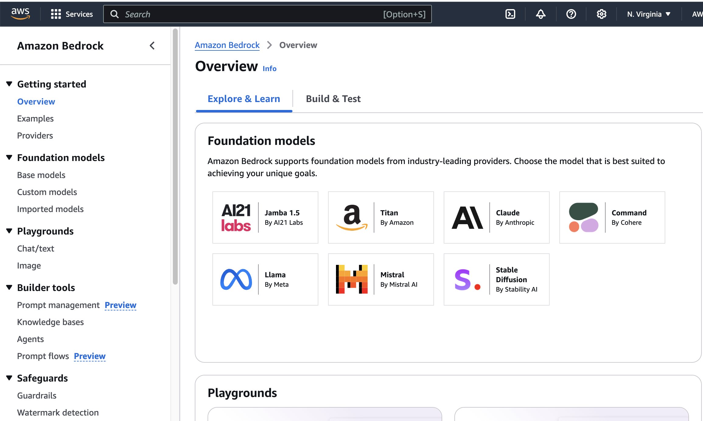
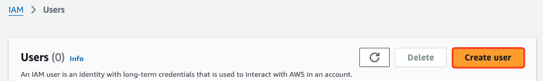
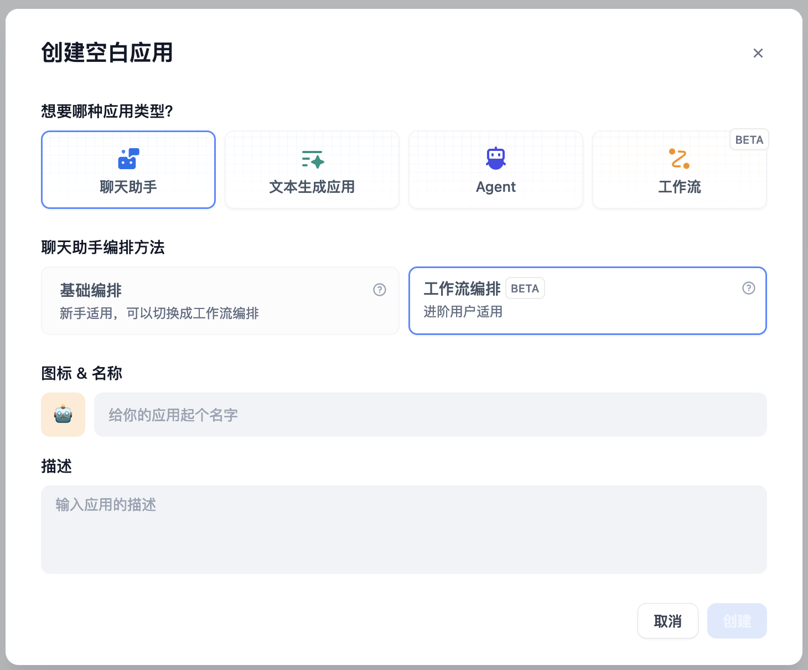
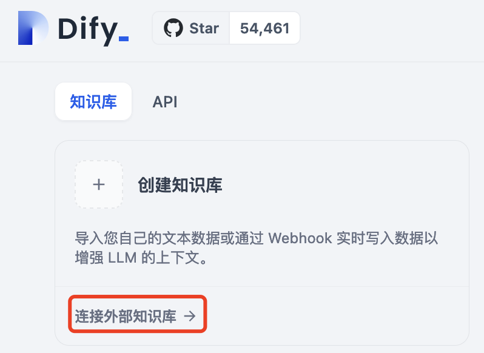
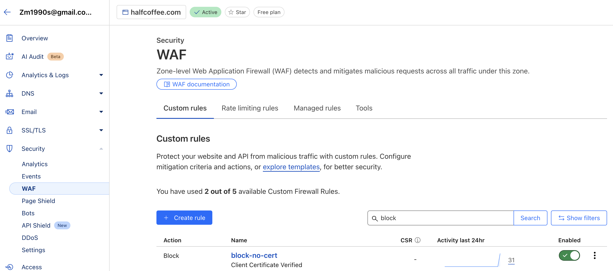

# Dify

{: .no_toc}

## 目录

{: .no_toc .text-delta }


1. TOC
{:toc}

# 底层环境部署

此处使用 AWS 上的 Rocky 9 安装 docker：

```shell
# 添加源
dnf config-manager --add-repo=https://download.docker.com/linux/centos/docker-ce.repo
yum makecache

# 安装
yum install -y docker-ce git

# 启动服务
systemctl enable docker
systemctl start docker

# 将系统默认的 Rocky 用户添加到 Docker 组，允许其使用 Docker 服务
groupadd docker
usermod -aG docker rocky
newgrp docker
```


# 安装 Dify

```shell
git clone https://github.com/langgenius/dify.git
cd dify/docker
cp .env.example .env
docker compose up -d
```


安装完毕后确保所有容器正常启动：

```shell
[root@Dify docker]# docker ps
CONTAINER ID   IMAGE                              COMMAND                  CREATED         STATUS                            PORTS                                                                      NAMES
4b0e8a1e460e   nginx:latest                       "sh -c 'cp /docker-e…"   6 seconds ago   Up 3 seconds                      0.0.0.0:80->80/tcp, :::80->80/tcp, 0.0.0.0:443->443/tcp, :::443->443/tcp   docker-nginx-1
7903253e5406   langgenius/dify-api:0.12.1         "/bin/bash /entrypoi…"   6 seconds ago   Up 4 seconds                      5001/tcp                                                                   docker-api-1
11f6e3a68ab6   langgenius/dify-api:0.12.1         "/bin/bash /entrypoi…"   6 seconds ago   Up 4 seconds                      5001/tcp                                                                   docker-worker-1
26e845fb7036   ubuntu/squid:latest                "sh -c 'cp /docker-e…"   7 seconds ago   Up 5 seconds                      3128/tcp                                                                   docker-ssrf_proxy-1
7934bcc5ecd1   semitechnologies/weaviate:1.19.0   "/bin/weaviate --hos…"   7 seconds ago   Up 5 seconds                                                                                                 docker-weaviate-1
3b970a1a0eaa   postgres:15-alpine                 "docker-entrypoint.s…"   7 seconds ago   Up 5 seconds (health: starting)   5432/tcp                                                                   docker-db-1
5fa211636be3   langgenius/dify-web:0.12.1         "/bin/sh ./entrypoin…"   7 seconds ago   Up 5 seconds                      3000/tcp                                                                   docker-web-1
8f56da1978dd   redis:6-alpine                     "docker-entrypoint.s…"   7 seconds ago   Up 5 seconds (health: starting)   6379/tcp                                                                   docker-redis-1
e41a5778f7a2   langgenius/dify-sandbox:0.2.10     "/main"                  7 seconds ago   Up 5 seconds (health: starting)                                                                              docker-sandbox-1
[root@Dify docker]#
```


稍等片刻即可看到 Dify 的初始化界面，只需要设置管理员登录凭据即可。


# Dify 基本配置

登录完成后，在右上角点击设置。


点击模型提供商，按实际情况对接大模型。


## OpenAI 对接示例


### Openai API key 获取

需要在下列位置获取 Openai 的 Organization ID 以及 API key：

[https://platform.openai.com/settings/](https://platform.openai.com/settings/)


## AWS Bedrock 对接示例

配置详情看下面的内容：


对接完成后，建议在下列位置勾选已在 Bedrock 开启的模型：


### 关于 Bedrock

Bedrock 是 AWS 提供的 AI 基础服务，包含多个厂家的大模型、Embedding 模型、文生图模型等，同时也提供工作流、知识库等相关组件。

本文主要借助 Bedrock 来访问各种大模型。默认 AWS 账号会开启 Bedrock 功能，但是里面的模型需要手动 Request Access（有些模型会检测访问地区，只有使用指定地区的 IP 访问时才能开通）。



### 开通大模型

此处建议使用美区。有些区域虽然有 Bedrock，但是提供的模型比较少（比如新加坡只有 5 个模型）。

具体的支持列表见：

[https://docs.aws.amazon.com/bedrock/latest/userguide/models-regions.html](https://docs.aws.amazon.com/bedrock/latest/userguide/models-regions.html)

另外不同地区 Bedrock 的价格不一样，详见：

[https://aws.amazon.com/cn/bedrock/pricing/](https://aws.amazon.com/cn/bedrock/pricing/)


默认 Bedrock 有 30 多个模型，涵盖文本/图片 LLM、多模态 LLM、embedding 模型等，可以在下列位置 Request Access。

请求完毕后，状态变为 Access granted 即表示可用。


### 为 Bedrock 创建 Access Key

参考文档：

[https://community.qlik.com/t5/Official-Support-Articles/How-to-get-started-with-the-Amazon-Bedrock-connector-in-Qlik/ta-p/2138685](https://community.qlik.com/t5/Official-Support-Articles/How-to-get-started-with-the-Amazon-Bedrock-connector-in-Qlik/ta-p/2138685)


打开 IAM 管理，新增 Users：




## 对接后的测试

在完成大模型对接后，可以新建一个应用然后进行对话测试，确保大模型可用：


## 聊天助手

创建一个工作流聊天助手：



具体的工作流如下：

- 标准化输入：将输入转换成英语，方便后续检查；于此同时，使用大模型来讲用户的输入变成查询关键词在知识库中进行查询。
- PANW AI Security 检查：通过代码编写 HTTP 请求 body，调用 PANW AI Runtime Security API 进行查询
  - 如果用户输入存在问题，则直接 Block；
  - 如果输入无问题，则继续
- 大模型输出内容：大模型基于知识库查询结果以及用户问题，编写相应的答案
- PANW AI Security 检查：通过代码编写 HTTP 请求 body，调用 PANW AI Runtime Security API 进行查询
  - 如果大模型输出存在问题，则直接 Block；
  - 如果大模型输出无问题，则继续
- 最终回复


### 具体配置示例

http_body（编写 PANW AI Security API 的 Body）：

```python
def main(arg1: str) -> dict:
    return {
        "result": {
            "contents": [
                {
             "prompt": arg1
                }
            ],
            "ai_profile": {
                "profile_name": "matt"
            },
            "metadata": {
                "ai_model": "Claude 3 Kaiku",
                "app_name": "Dify Secure app", 
                "app_user": "Matt"
              }
        },
    }
```


对应的 HTTP Request 配置：


静态 Block 配置：


大模型提示词配置：

```
You are a helpful assistant.
Use the following content as the knowledge you have learned, placed within the <context></context> XML tags.
<context>
{{#context#}}
</context>
When answering users:
If you don't know, just say you don't know. If you're unsure, you don't know, seek clarification.
Avoid mentioning that you obtained the information from the context.
And respond in the language of the user's question.
```

大模型配置：


# 其他

## Ragflow对接

Ragflow 从0.13.0版本开始提供 Dify 对接 API，通过此 API 可以实现 Dify 使用 Ragflow 作为外部知识库。

具体配置如下：

在知识库页面右上角，点击“外部知识库 API”：


设置名称、API Endpoint 以及 API Key：

API Endpoint 格式是：[http|https]://[ragflow-ip|ragflow-domain]/api/v1/dify


添加完成后，再点击支持库的“连接外部知识库”。



填写知识库的 ID（ID 可以通过 GET http://ragflow-ip/api/v1/datasets?name=wiki 获得，此处 Ragflow 上的知识库名称为 wiki）


设置完成后，在工作流就可以调用 Ragflow 的知识库进行测试了：


测试时发现，在工作流中调用知识库检索时，最好一次只选择一个知识库，否则可能查询结果为空。

## AWS 上服务的访问限制

默认 Dify 使用 HTTP 端口暴露，此处借助 Cloudflare 的免费服务执行 TLS 卸载，在 Dify 端（AWS）则进行访问 IP 限制，只允许 Cloudflare 的 IP 访问。

具体 Cloudflare 的节点 IP 地址段见：[https://www.cloudflare.com/ips/](https://www.cloudflare.com/ips/)


### Cloudflare 侧配置

SSL/TLS encryption使用 Flexible 模式，允许 Cloudflare 通过 HTTP 访问后端服务器：


启用强制 HTTPS：


配置 DNS A 记录：


### 添加 Prefix-list


创建完成：


### 添加 SecurityGroup


添加三条 Inbound rule，允许 Cloudflare IP 到 HTTP/HTTPS 的访问，同时允许管理员通过 SSH 访问。


### 为 EC2 关联 SecurityGroup


## Cloudflare 证书认证

Dify 发布的应用默认对外可以直接访问，可以通过 Cloudflare 的 mTLS Client 证书来做 Client 访问控制。

具体流程：

### 创建或上传 Client 证书


### 终端安装证书


### 创建 WAF 规则

添加 WAF 规则，当未检测到证书时 Block 请求。




## Dify 如何输出图片

方法 1：使用 HTTP 节点获取图片 URL，然后在回答中引用 HTTP 节点的 files 输出。

方法 2：使用模板转换，将 Image URL 封装在 markdown 的语句中，然后输出。

```jinja2

```


