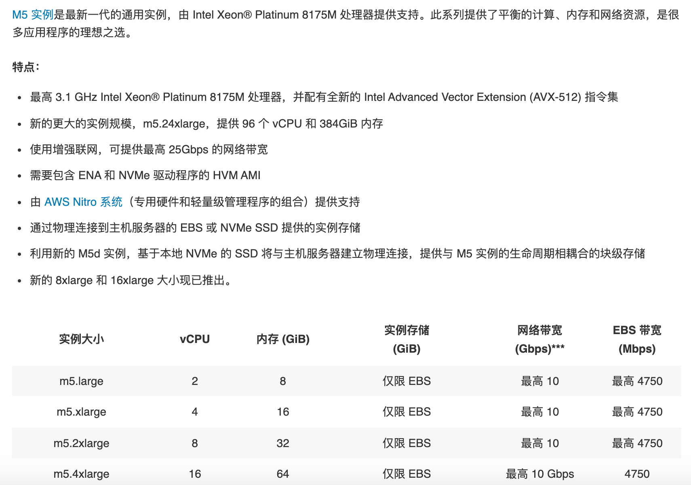

# AWS 服务概述

{: .no_toc}

## 目录

{: .no_toc .text-delta }

1. TOC
{:toc}

## 参考文档

[http://d0.awsstatic.com/whitepapers/aws-overview.pdf](http://d0.awsstatic.com/whitepapers/aws-overview.pdf)

## 为何要使用云计算，云计算的优势

云计算是一种按需使用，按用量付费的 IT 基础架构供给模型，企业可以通过云计算获得计算、存储、数据库、应用、安全服务等资源。在使用云计算后用户可以无需关注提供服务的基础硬件及周边资源，专注于业务本身。对于企业来说，一次性购置成本会变得很低，资源可以随时根据用量来扩缩。

AWS 定义的云计算 6 大优势：

- 将固定资产变为可变的费用：通过云计算减少数据中心建设等重固定资产，完全按照使用情况随时获取服务。
- 受益于规模经济：AWS 的服务可以同时为千万家企业提供服务，这样的大规模也可以使得 AWS 减少自身的运维成本，进而提供更低价的服务。
- 不再关心容量：无需再关心数据中心的建设容量，传统的数据中心建设方式通常有两种结果：一种是买了太多硬件闲置、一种是硬件不够资源吃紧。使用云计算则完美的解决了这些问题。
- 敏捷性：只需要点击鼠标即可获得 IT 资源。
- 减少数据中心维护费用：不再关心如何维护数据中心，将重点放在业务上。
- 快速跨国部署：快速将应用部署到跨国的不同区域中。为客户提供低时延的服务。

## 云计算的类型

- IaaS： Infrastructure as a Service：用于提供传统的信息化依赖的资源，例如网络、计算和存储。IaaS 相比其他类型最为灵活，管理度自由度最高，和当今很多传统数据中心的运维及使用方式相同。
- PaaS：Platform as a Service：移除了底层设施的维护需求（底层硬件及操作系统），专注于业务的部署、运维和功能维护。
- SaaS：Software as a Service：为您提供纯依赖于软件实现的服务，让您不再关心软件本身如何实现，如何运维管理。SaaS 通常也叫做面向最终用户的应用。使用 SaaS 让您只关心使用这项服务可以达成什么目标，例如传统的电子邮件服务便属于 SaaS。

## 全球基础设施

AWS 服务目前在全球 190 个国家有超过 100 万的用户，我们可以帮助客户在全球基础设施上提供低时延，高吞吐的服务，同时也可以保证用户的业务仅在指定的区域中运行。

AWS Cloud infrastructure 基于 AWS Region 和 AWS Availability Zone 构建，AWS region 是一些分布于全球的物理站点，每个 Region 内会有多个 Availability Zone，每个 Availability Zone 包含一个或者多个分散的数据中心，每个数据中心会有冗余的电源和网络，建设在不同的建筑中。目前全球有超过 20 个 Region 及超过 60 个 Availability Zone。

AWS Region 之间是完全隔离的，通过这种方式可以提供最大程度的故障冗余。每个 AZ 是独立的，但是同一个 Region 下的 AZ 间有高速的低时延链路。

## 计算服务 -EC2

全称 Elastic Compute Cloud 

M5.large

m 为系列名称、5 是世代号、Large表示实例大小。

[https://aws.amazon.com/cn/ec2/instance-types/](https://aws.amazon.com/cn/ec2/instance-types/)

### 实例选择

通用型：适合于有业务突增的服务，像网站。

使用 CPU 信用来应对突发的流量。

比如一个网站默认 CPU 性能基准为 10%（不同实例基准不一样），表示此网站通常的 CPU 使用率为 10%，如果在这个范围内使用，每小时可以积累一些 CPU 信用（一个 CPU 信用表示在 100% 情况下运行一分钟），比如使用 1 小时，积累 6 分钟的信用。当一个小时后 CPU 使用率突然增长到 100%，此时允许以此状态运行 6 分钟。 

### 按需实例

即时计算需求，按使用量付费。

### 预留实例

为容量预先付费，折扣深。

### Spot 实例

可达 90% off 的实例，不保证可用性，提前 2 分钟通知资源回收。

### 放置选项

- Cluster Placement Groups：实例会放在一个 AZ 中，多个实例之间网络连接性能最佳。如果使用按需实例，可能碰到 VM 关机后，无法再次开机，因为 AZ 内资源不够
- 分布置放群组：实例尽量放在不同的底层硬件上，可能分布在不同 AZ
- 分区置放群组：放在不同 AZ，底层不共享硬件

Amazon EC2 container service（ECS）：运行Docker

Amazon EC2 container registry（ECR）：Docker 镜像仓库，可以配合 ECR 一起使用

Amazon Elastic Container Service for Kubernetes

## AMI

Amazon Machine Image，用于启动 EC2 实例。支持启动权限（不同 image 可能有不同的文件，相应部门的人才能使用），支持块存储设备映射。

支持四种创建方式：

- AWS 与构建
- AWS marketplace：和其他厂商合作推出的 AMI，例如和安全厂商合作的 AMI
- 自行创建
- 社区 AMI

EC2 image builder，用于创建 Linux windows 镜像的创建、维护、验证、共享和部署。

从 AMI 启动 EC2 时，可以加入用户数据（例如自定义脚本）来进行开机操作，比如更新操作系统、设置 hostname 等。
