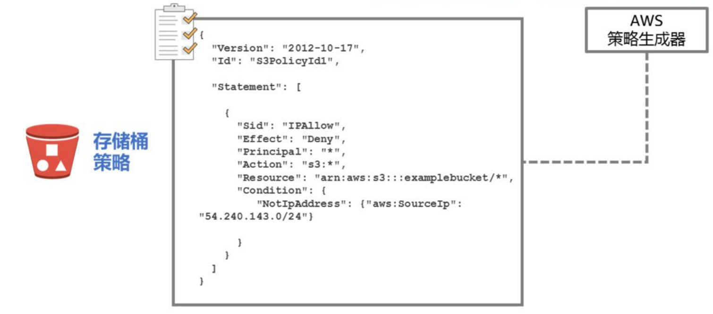
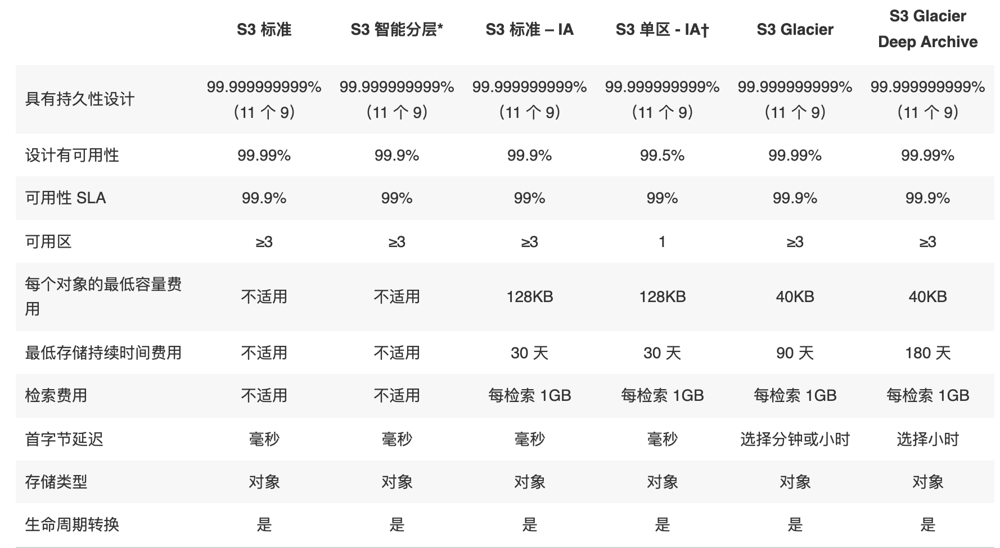

# AWS 服务概述

{: .no_toc}

## 目录

{: .no_toc .text-delta }

1. TOC
{:toc}

## 为何要使用云计算，云计算的优势

云计算是一种按需使用，按用量付费的 IT 基础架构供给模型，企业可以通过云计算获得计算、存储、数据库、应用、安全服务等资源。在使用云计算后用户可以无需关注提供服务的基础硬件及周边资源，专注于业务本身。对于企业来说，一次性购置成本会变得很低，资源可以随时根据用量来扩缩。

AWS 定义的云计算 6 大优势：

- 将固定资产变为可变的费用：通过云计算减少数据中心建设等重固定资产，完全按照使用情况随时获取服务。
- 受益于规模经济：AWS 的服务可以同时为千万家企业提供服务，这样的大规模也可以使得 AWS 减少自身的运维成本，进而提供更低价的服务。
- 不再关心容量：无需再关心数据中心的建设容量，传统的数据中心建设方式通常有两种结果：一种是买了太多硬件闲置、一种是硬件不够资源吃紧。使用云计算则完美的解决了这些问题。
- 敏捷性：只需要点击鼠标即可获得 IT 资源。
- 减少数据中心维护费用：不再关心如何维护数据中心，将重点放在业务上。
- 快速跨国部署：快速将应用部署到跨国的不同区域中。为客户提供低时延的服务。

## 云计算的类型

- IaaS： Infrastructure as a Service：用于提供传统的信息化依赖的资源，例如网络、计算和存储。IaaS 相比其他类型最为灵活，管理度自由度最高，和当今很多传统数据中心的运维及使用方式相同。
- PaaS：Platform as a Service：移除了底层设施的维护需求（底层硬件及操作系统），专注于业务的部署、运维和功能维护。
- SaaS：Software as a Service：为您提供纯依赖于软件实现的服务，让您不再关心软件本身如何实现，如何运维管理。SaaS 通常也叫做面向最终用户的应用。使用 SaaS 让您只关心使用这项服务可以达成什么目标，例如传统的电子邮件服务便属于 SaaS。

## 全球基础设施

AWS 服务目前在全球 190 个国家有超过 100 万的用户，我们可以帮助客户在全球基础设施上提供低时延，高吞吐的服务，同时也可以保证用户的业务仅在指定的区域中运行。

AWS Cloud infrastructure 基于 AWS Region 和 AWS Availability Zone 构建，AWS region 是一些分布于全球的物理站点，每个 Region 内会有多个 Availability Zone，每个 Availability Zone 包含一个或者多个分散的数据中心，每个数据中心会有冗余的电源和网络，建设在不同的建筑中。目前全球有超过 20 个 Region 及超过 60 个 Availability Zone。

AWS Region 之间是完全隔离的，通过这种方式可以提供最大程度的故障冗余。每个 AZ 是独立的，但是同一个 Region 下的 AZ 间有高速的低时延链路。

## 计算服务

### Amazon EC2：Elastic Compute Cloud

Amazon EC2 container service（ECS）：运行Docker

Amazon EC2 container registry（ECR）：Docker 镜像仓库，可以配合 ECR 一起使用

Amazon Elastic Container Service for Kubernetes

## AMI

Amazon Machine Image，用于启动 EC2 实例。支持启动权限（不同 image 可能有不同的文件，相应部门的人才能使用），支持块存储设备映射。

支持四种创建方式：

- AWS 与构建
- AWS marketplace：和其他厂商合作推出的 AMI，例如和安全厂商合作的 AMI
- 自行创建
- 社区 AMI

EC2 image builder，用于创建 Linux windows 镜像的创建、维护、验证、共享和部署。

从 AMI 启动 EC2 时，可以加入用户数据（例如自定义脚本）来进行开机操作，比如更新操作系统、设置 hostname 等。

## 存储服务

### S3

Amazon Simple Storage Service（S3）：一个简单的对象存储服务，提供 99.999999999% 的可靠性。

每个对象都被保存在存储桶，storage bucket 中，有着全球唯一的标识符，FQDN 格式。

支持分段上传，提高上传可靠性、上传吞吐量

#### 权限控制

1、可以通过 AWS 存储桶策略来控制 S3 对象的访问控制，使用 JSON 格式定义。

默认是 deny any（隐式拒绝），可以配置显示拒绝策略和显示允许策略，优先级分别为拒绝策略>显示允许>隐式拒绝。

Principal 表示访问者，可以是用户，也可以是其他应用，比如 web server。

2、AWS S3 也可以通过访问点来进行访问控制，有些类似于 RBAC。

3、S3 也可以通过 CORS （跨资源共享）来进行访问控制，通过 XML 文件定义。支持 PUT、COPY、POST、LIST、GET请求

#### 版本控制

支持版本控制，类似于 github，但又有一些差异，比如删除文件只是给文件添加删除标签，管理员可以通过删除此标签来进行回滚。

#### 使用场景

- 一次写入，多次访问的场景（对于频繁变化的文件，每次都得重复上传，不支持增量）
- 峰谷不均匀的数据访问
- 大量用户和不同数量的内容
- 不断增长的数据集。

常见场景：

- 静态web服务托管

- 数据库备份
- 大规模分析的数据存储，比如交易数据、媒体转码等

### S3 Galicier 长期数据存储

适合长期存储数据、存档和备份、非常低的成本。

支持文件库锁定，锁定后数据无法被修改。

标准检索时间是数小时，可以使用额外付费使用加速检索，1~5分钟即可检索到，

### S3 存储类

S3 支持存储分级，适合于不同的使用场景。

\* S3 Intelligent-Tiering 收取小额监控和自动化费用，对自动分层有 128KB 的最小合格对象大小限制。更小的对象也可以存储，但将始终按频繁访问层费率收费，不收取监控和自动化费用。有关更多信息，请参阅 [Amazon S3 定价](https://aws.amazon.com/cn/s3/pricing/)。只能分层看 30 天内有没有存储使用

** 存档访问层和深度存档访问层中的标准检索是免费的。如果您需要从存档访问层中更快地访问您的对象，您可以使用 S3 控制台为加快的检索付费。

*** S3 智能分层频繁和不频繁访问层的首字节延迟为毫秒访问时间，存档访问和深度存档访问层的首字节延迟为分钟或小时。

### 生命周期策略

可以通过生命周期策略来管理存储对应应该被删除还是被分级移动。

- 当您知道对象不常访问时，您可能会将其转换为 S3 Standard-IA 存储类。
- 您可能想要将不需要实时访问的对象存档到 S3 Glacier 存储类。

[https://docs.amazonaws.cn/AmazonS3/latest/userguide/lifecycle-transition-general-considerations.html](https://docs.amazonaws.cn/AmazonS3/latest/userguide/lifecycle-transition-general-considerations.html)

### 区域选择

1、遵照相关地区的数据隐私法，不能违反 GDPR 等法规。

2、用户与数据之间的距离，选择里用户最近的区域

3、服务和功能可用性，不同区域提供的服务也不一致

4、成本，不同位置的服务价格不一致

### EBS

block storage，搭配 EC2 使用。

Amazon Glacier ：长期保存的历史数据

Storage Gateway：在 on-premises 使用 AWS 存储，提供和本地存储一样的性能，但是可以无限扩展，适合于 ROBO、迁移、突发需求、存储分层等场景。

## 数据库服务

Amazon Aurora：兼容 PostgreSQL 和 MYSQL 的关系型数据库，性能比 MYSQL 高 5 倍。

RDS：提供 6 种后端引擎：Amazon Aurora, PostgreSQL, MySQL, MariaDB, Oracle, and Microsoft SQL Server.

Amazon ElastiCache：

## 迁移

AWS Application Discovery Service：批量分析企业内上千个应用的类型，需要的性能、之间的依赖关系。

AWS Database Migration Service：迁移数据库时源数据库不受影响，支持同类型数据库的迁移和异构的迁移，例如  Oracle to Amazon Aurora or Microsoft SQL Server to MySQL

AWS Database Migration Service

## 网络

VPC：部署一个独立的私有网络，按需发布到internet。

Amazon CloudFront：CDN 服务

Route53：DNS 服务

AWS Direct Connect：专用的链路连接到本地数据中心

Elastic Load Balancing：负载均衡

