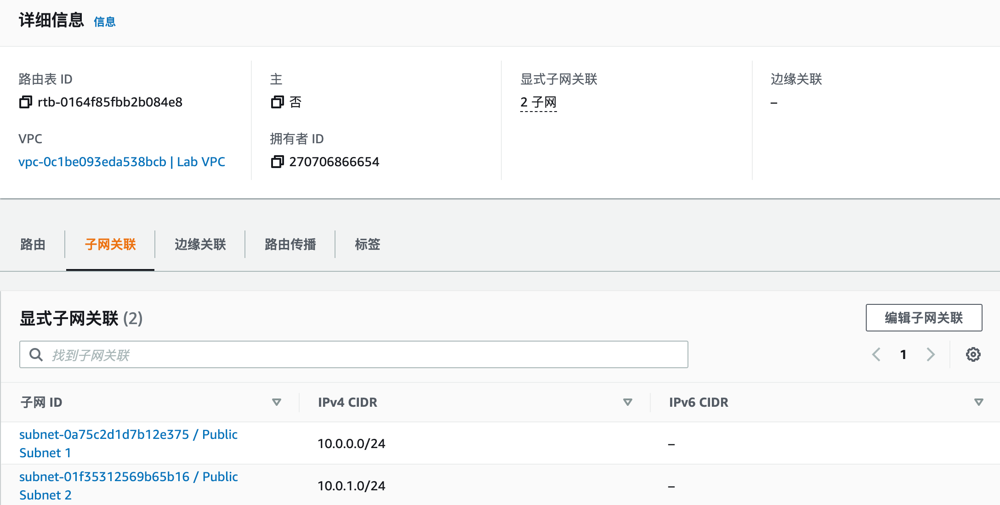
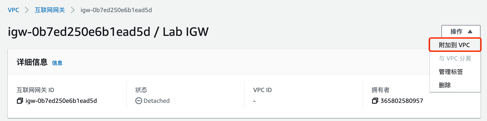
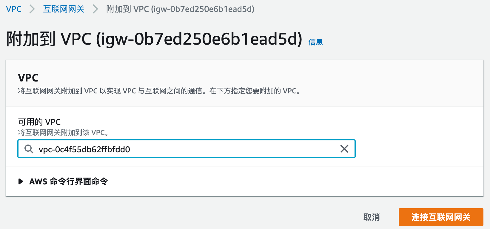
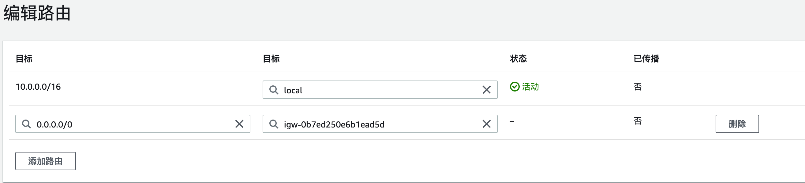
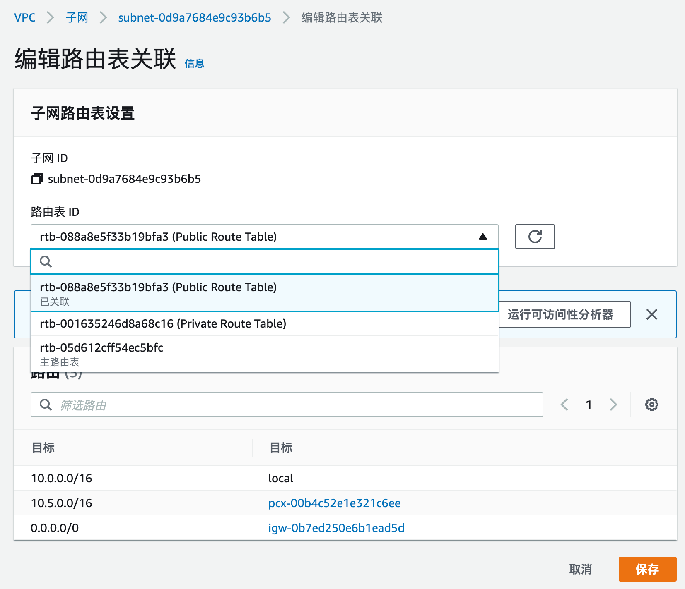
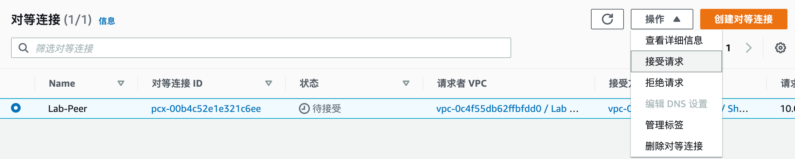
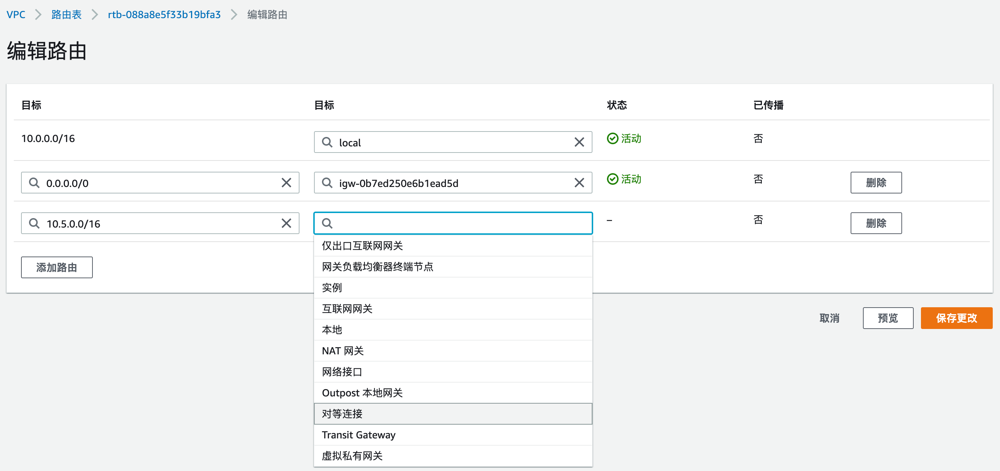
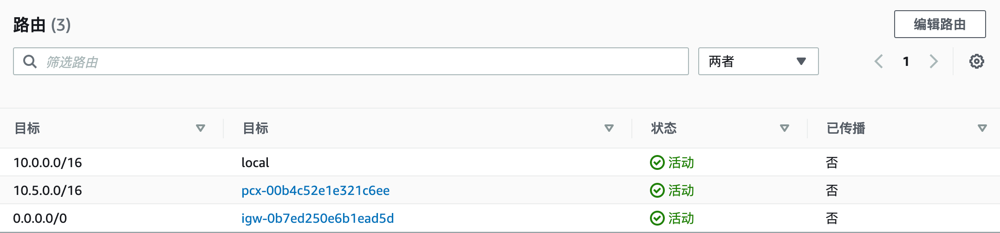
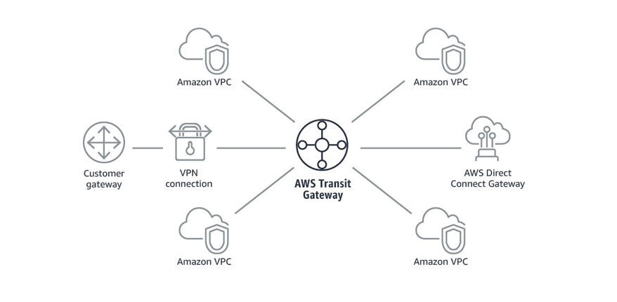
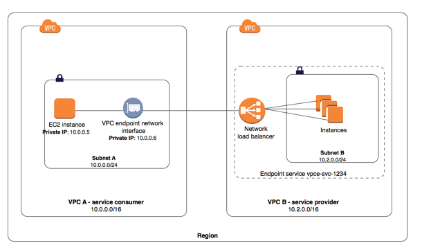

# AWS 服务概述

{: .no_toc}

## 目录

{: .no_toc .text-delta }


1. TOC
{:toc}

## 参考文档

[http://d0.awsstatic.com/whitepapers/aws-overview.pdf](http://d0.awsstatic.com/whitepapers/aws-overview.pdf)

## 为何要使用云计算，云计算的优势

云计算是一种按需使用，按用量付费的 IT 基础架构供给模型，企业可以通过云计算获得计算、存储、数据库、应用、安全服务等资源。在使用云计算后用户可以无需关注提供服务的基础硬件及周边资源，专注于业务本身。对于企业来说，一次性购置成本会变得很低，资源可以随时根据用量来扩缩。


AWS 定义的云计算 6 大优势：

- 将固定资产变为可变的费用：通过云计算减少数据中心建设等重固定资产，完全按照使用情况随时获取服务。
- 受益于规模经济：AWS 的服务可以同时为千万家企业提供服务，这样的大规模也可以使得 AWS 减少自身的运维成本，进而提供更低价的服务。
- 不再关心容量：无需再关心数据中心的建设容量，传统的数据中心建设方式通常有两种结果：一种是买了太多硬件闲置、一种是硬件不够资源吃紧。使用云计算则完美的解决了这些问题。
- 敏捷性：只需要点击鼠标即可获得 IT 资源。
- 减少数据中心维护费用：不再关心如何维护数据中心，将重点放在业务上。
- 快速跨国部署：快速将应用部署到跨国的不同区域中。为客户提供低时延的服务。


## 云计算的类型

- IaaS： Infrastructure as a Service：用于提供传统的信息化依赖的资源，例如网络、计算和存储。IaaS 相比其他类型最为灵活，管理度自由度最高，和当今很多传统数据中心的运维及使用方式相同。
- PaaS：Platform as a Service：移除了底层设施的维护需求（底层硬件及操作系统），专注于业务的部署、运维和功能维护。
- SaaS：Software as a Service：为您提供纯依赖于软件实现的服务，让您不再关心软件本身如何实现，如何运维管理。SaaS 通常也叫做面向最终用户的应用。使用 SaaS 让您只关心使用这项服务可以达成什么目标，例如传统的电子邮件服务便属于 SaaS。


## 全球基础设施

AWS 服务目前在全球 190 个国家有超过 100 万的用户，我们可以帮助客户在全球基础设施上提供低时延，高吞吐的服务，同时也可以保证用户的业务仅在指定的区域中运行。

AWS Cloud infrastructure 基于 AWS Region 和 AWS Availability Zone 构建，AWS region 是一些分布于全球的物理站点，每个 Region 内会有多个 Availability Zone，每个 Availability Zone 包含一个或者多个分散的数据中心，每个数据中心会有冗余的电源和网络，建设在不同的建筑中。目前全球有超过 20 个 Region 及超过 60 个 Availability Zone。

AWS Region 之间是完全隔离的，通过这种方式可以提供最大程度的故障冗余。每个 AZ 是独立的，但是同一个 Region 下的 AZ 间有高速的低时延链路。


## 计算服务 -EC2

全称 Elastic Compute Cloud 


M5.large

m 为系列名称、5 是世代号、Large表示实例大小。


[https://aws.amazon.com/cn/ec2/instance-types/](https://aws.amazon.com/cn/ec2/instance-types/)

### 实例选择

通用型：适合于有业务突增的服务，像网站。

使用 CPU 信用来应对突发的流量。

比如一个网站默认 CPU 性能基准为 10%（不同实例基准不一样），表示此网站通常的 CPU 使用率为 10%，如果在这个范围内使用，每小时可以积累一些 CPU 信用（一个 CPU 信用表示在 100% 情况下运行一分钟），比如使用 1 小时，积累 6 分钟的信用。当一个小时后 CPU 使用率突然增长到 100%，此时允许以此状态运行 6 分钟。 

### 按需实例

即时计算需求，按使用量付费。

### 预留实例

为容量预先付费，折扣深。

### Spot 实例

可达 90% off 的实例，不保证可用性，提前 2 分钟通知资源回收。

### 放置选项

- Cluster Placement Groups：实例会放在一个 AZ 中，多个实例之间网络连接性能最佳。如果使用按需实例，可能碰到 VM 关机后，无法再次开机，因为 AZ 内资源不够
- 分布置放群组：实例尽量放在不同的底层硬件上，可能分布在不同 AZ
- 分区置放群组：放在不同 AZ，底层不共享硬件

Amazon EC2 container service（ECS）：运行Docker

Amazon EC2 container registry（ECR）：Docker 镜像仓库，可以配合 ECR 一起使用

Amazon Elastic Container Service for Kubernetes

## AMI

Amazon Machine Image，用于启动 EC2 实例。支持启动权限（不同 image 可能有不同的文件，相应部门的人才能使用），支持块存储设备映射。

支持四种创建方式：

- AWS 与构建
- AWS marketplace：和其他厂商合作推出的 AMI，例如和安全厂商合作的 AMI
- 自行创建
- 社区 AMI


EC2 image builder，用于创建 Linux windows 镜像的创建、维护、验证、共享和部署。


从 AMI 启动 EC2 时，可以加入用户数据（例如自定义脚本）来进行开机操作，比如更新操作系统、设置 hostname 等。


## 存储服务

### S3

Amazon Simple Storage Service（S3）：一个简单的对象存储服务，提供 99.999999999% 的可靠性。

每个对象都被保存在存储桶，storage bucket 中，有着全球唯一的标识符，FQDN 格式。

支持分段上传，提高上传可靠性、上传吞吐量

#### 权限控制

1、可以通过 AWS 存储桶策略来控制 S3 对象的访问控制，使用 JSON 格式定义。

默认是 deny any（隐式拒绝），可以配置显示拒绝策略和显示允许策略，优先级分别为拒绝策略>显示允许>隐式拒绝。


Principal 表示访问者，可以是用户，也可以是其他应用，比如 web server。

2、AWS S3 也可以通过访问点来进行访问控制，有些类似于 RBAC。

3、S3 也可以通过 CORS （跨资源共享）来进行访问控制，通过 XML 文件定义。支持 PUT、COPY、POST、LIST、GET请求

#### 版本控制

支持版本控制，类似于 github，但又有一些差异，比如删除文件只是给文件添加删除标签，管理员可以通过删除此标签来进行回滚。

#### 使用场景

- 一次写入，多次访问的场景（对于频繁变化的文件，每次都得重复上传，不支持增量）
- 峰谷不均匀的数据访问
- 大量用户和不同数量的内容
- 不断增长的数据集。


常见场景：

- 静态web服务托管

- 数据库备份
- 大规模分析的数据存储，比如交易数据、媒体转码等

### S3 Galicier 长期数据存储

适合长期存储数据、存档和备份、非常低的成本。

支持文件库锁定，锁定后数据无法被修改。

标准检索时间是数小时，可以使用额外付费使用加速检索，1~5分钟即可检索到，

### S3 存储类

S3 支持存储分级，适合于不同的使用场景。


\* S3 Intelligent-Tiering 收取小额监控和自动化费用，对自动分层有 128KB 的最小合格对象大小限制。更小的对象也可以存储，但将始终按频繁访问层费率收费，不收取监控和自动化费用。有关更多信息，请参阅 [Amazon S3 定价](https://aws.amazon.com/cn/s3/pricing/)。只能分层看 30 天内有没有存储使用

** 存档访问层和深度存档访问层中的标准检索是免费的。如果您需要从存档访问层中更快地访问您的对象，您可以使用 S3 控制台为加快的检索付费。

*** S3 智能分层频繁和不频繁访问层的首字节延迟为毫秒访问时间，存档访问和深度存档访问层的首字节延迟为分钟或小时。

### 生命周期策略

可以通过生命周期策略来管理存储对应应该被删除还是被分级移动。


- 当您知道对象不常访问时，您可能会将其转换为 S3 Standard-IA 存储类。
- 您可能想要将不需要实时访问的对象存档到 S3 Glacier 存储类。

[https://docs.amazonaws.cn/AmazonS3/latest/userguide/lifecycle-transition-general-considerations.html](https://docs.amazonaws.cn/AmazonS3/latest/userguide/lifecycle-transition-general-considerations.html)


### 区域选择

1、遵照相关地区的数据隐私法，不能违反 GDPR 等法规。

2、用户与数据之间的距离，选择里用户最近的区域

3、服务和功能可用性，不同区域提供的服务也不一致

4、成本，不同位置的服务价格不一致

### EBS

Elastic Block Store，block storage，搭配 EC2 使用。仅支持附加到一个实例。

支持 SSD 和 HDD 两种类型

- 通用 SSD：大部分工作负载
- 预配置的 IOPS SSD：需要持续 IOPS 性能的关键业务应用程序、大型数据库工作负载

- 吞吐优化 HDD：日志处理、数据仓库、大数据、流处理工作负载、不能作为启动盘

- cold HDD：不频繁访问的大量数据、存储成本最低、不能作为启动卷

### EFS

Elastic File System，Linux 下使用 NFSv4，支持在可用区、区域、VPC、账户间进行共享。

### FSx

Windows 下使用 NTFS 格式，通过 SMB 协议传输，支持 AD 集成。

### Storage Gateway

在 on-premises 使用 AWS 存储，提供和本地存储一样的性能，但是可以无限扩展，适合于 ROBO、迁移、突发需求、存储分层等场景。


## 数据库服务

### 数据库设计考量

- 可扩展性
- 存储要求
- 对象大小和类型
- 持久性


### 关系型数据库 RDS

一般可以平滑纵向扩展，支持一写多读的集群方式，支持跨 AZ 部署。

支持在区域内配置 S3 备份，同时此 S3 备份可以跨区做备份，以此实现数据库的双备份。

提供 6 种后端引擎：Amazon Aurora, PostgreSQL, MySQL, MariaDB, Oracle, and Microsoft SQL Server.

Amazon Aurora：兼容 PostgreSQL 和 MYSQL 的关系型数据库，性能比 MYSQL 高 5 倍。分层架构。

Amazon ElastiCache

### 非关系型数据库 DynamoDB

速度非常快，可以横向扩展，适合简单，但量大的数据。

DynamoDB 全局表：一个账户下的多个副本表，多个表之间是异步进行复制的，可以跨区域部署。

一致性选项：最终一致读取（写入时其他副本可能不会立即同步，一段时间后才同步完成）和强一致性读取（一个读取会始终用最新的数据）

场景：游戏排行榜、购物车缓存


## 迁移

AWS Application Discovery Service：批量分析企业内上千个应用的类型，需要的性能、之间的依赖关系。


AWS Database Migration Service：迁移数据库时源数据库不受影响，支持同类型数据库的迁移和异构的迁移，例如  Oracle to Amazon Aurora or Microsoft SQL Server to MySQL

AWS Database Migration Service


## 网络

### VPC

部署一个独立的私有网络，按需发布到internet，可以实现租户间的隔离。

VPC 不能跨区域存在，但是可以托管在区域内的任何可用区。每个区域内最大可以有 5 个 VPC。每个 VPC 最大可以有 1 个 /16 网段。

VPC 内的子网不能跨越 AZ。

大部分情况下会使用多 VPC，只有个人/小规模情况下一个 VPC。


一个 VPC 下有一个 IP DICR，然后分成很多子网。

默认一个 VPC 有一个全局路由表，一般建议每个子网有一个路由表。


针对于自定义的路由表，会有 local 和到外部的路由（路由指向外部网关后，就属于公有子网了）：




### 公有子网


### 私有子网

不为其分配共有 IPv4 地址，因此无法被 Internet 访问到，但可以被其他子网访问到。

### Internet 网关

VPC 和外部的 internet 进行通信，永不宕机。

子网关联路由表；internet 网关关联到 VPC。





设置到 Internet 网关的路由：




为子网关联路由表：




### NAT 网关

使得私有子网可以发起到 Internet 或者其他服务的出站流量。

防止 Internet 访问私有子网的流量。

### 子网规划

建议使用比较大的网段，这样可以有足够的地址，并且安全配置相对简单。

如果不清楚需求，可以现在每个 AZ 内设置一个公有子网和一个私有子网。

### 弹性网络接口

一种虚拟网络接口，可以在 EC2 间迁移，迁移后弹性 IP、私有 IP、MAC 保持不变。

弹性网络接口可以以第二张网卡形式分配给 EC2。EC2 的主网卡不能是弹性网络接口。

弹性接口可以用于 LAN-WAN 双网卡环境，或者管理、业务分离的场景。

也可以用于灾备，比如一开始关联到主 EC2，故障后切换到备 EC2。

### 弹性 IP

每个区域最多可以有 5 个弹性 IP。可以灵活关联到实例。支持在不同 VPC 间进行分配。

### 安全

主要基于有状态防火墙和安全组的概念实现。

默认入向 Deny，出向 Permit。

通过安全组可以实现 IP 和规则的解耦合，安全组有唯一 ID，用于区分不同安全组。

### ACL

位于子网边界的无状态防火墙，入站和出站都需要配置。

默认入向和出向均是 Permit（默认有个编号 100 的 ACL，作用为 Permit，其优先级高于默认的 Deny）。

一般不使用此功能。

### 示例

如果要对外发布一个服务：

1、VPC 关联到一个 Internet 网关

2、路由表中有默认路由，指向 Internet 网关

3、实例具有公网 IP 或者关联了弹性 IP

4、ACL 和安全组允许相关流量

### VPN

通过 VPN 和 on-prem 环境进行连接。有三种实现方式：

[https://docs.aws.amazon.com/whitepapers/latest/building-scalable-secure-multi-vpc-network-infrastructure/vpn.html](https://docs.aws.amazon.com/whitepapers/latest/building-scalable-secure-multi-vpc-network-infrastructure/vpn.html)


### Direct Connect

类似于专线，提供很高的带宽和较低的延迟，1G、10G等选项


### VPC 对等连接

VPC 对等连接用于打通不同 VPC 之间的网络访问。多个 VPC 不能有重叠的地址。

一般使用场景：

- 有个 VPC 是服务 VPC，其他公司内部程序、本地数据中心需要和这个 VPC 连接。


比如下图中打通 Lab VPC 和 Shared VPC 之间的连接。




添加路由表：





### Transit VPC

相比 VPC Peer 稍微复杂，支持多个 VPC 互联


### Transit Gateway

通过 Transit Gateway Fullmesh 连接多个 VPC、on-prem 网络，可以理解为 Transit VPC 的增强，支持在 Gateway 进行安全配置。



### VPC 终端节点

在**同一区域**内，不经过 NAT、VPN、Internet 网关来让 EC2 访问到其他 VPC 中的服务。

#### Interface Endpoint

一个具有私网 IP 的接口，可以连接到其他 AWS 服务或者第三方服务，详细支持清单：

[https://docs.aws.amazon.com/vpc/latest/privatelink/integrated-services-vpce-list.html](https://docs.aws.amazon.com/vpc/latest/privatelink/integrated-services-vpce-list.html)

使用场景：

VPC B 提供一些公有服务，此时 VPC A 可以通过 VPC endpoint 让 EC2 连接到 VPC B 的服务。



#### Gateway Endpoint

一个特殊的 Gateway，可以将流量引入 S3 或者 DynamoDB。


注：S3同时也支持 Interface Endpoint，详见：

[https://docs.aws.amazon.com/AmazonS3/latest/userguide/privatelink-interface-endpoints.html#types-of-vpc-endpoints-for-s3](https://docs.aws.amazon.com/AmazonS3/latest/userguide/privatelink-interface-endpoints.html#types-of-vpc-endpoints-for-s3)

#### Gateway Loadbalancer Endpoint

用于让流量转发到 Gateway LB，Gateway LB 一般是服务于 SP 的服务，可以将用户流量定向到安全 appliance 中进行过滤，然后再发回到源 VPC。


## ELB

分 Application LB 和 Network LB 两种。

对于 Application LB，支持 EC2、容器、IP 作为后端。

每个 ELB 有自己的 DNS 名称。

ELB 位于一个 VPC 内，且后端的资源也需要在同一个 VPC 内，后端资源可以是分布在不同 AZ 的同一 VPC 内。

支持功能：

- HTTP、TCP、SSL


## Route53

全局 DNS 服务，支持多种负载均衡方式和功能：

- 轮询
- 加权轮询：基于权重的轮询
- 基于延迟的路由
- 运行状况检查和 DNS 故障转移
- 地理位置路由：基于地理位置做本地化相关的请求转发
- 地理位置临近路由，基于物理距离
- 多值应答


## CDN 服务：Amazon CloudFront


## IAM

参考文档：

[https://docs.aws.amazon.com/IAM/latest/UserGuide/intro-structure.html](https://docs.aws.amazon.com/IAM/latest/UserGuide/intro-structure.html)

工作流程：


### Principals

可以简单理解为访问者，可以是用户、角色或者应用。

### Policy 策略

定义 Pricipal 可以执行的操作，比如 GET、PUT、LIST 等。

策略可以附加给用户、用户组或者资源对象（比如 AWS S3 Bucket 或者对象）

### 配置原则

守门员规则：对于明确需要放行的，需要设置 Allow 的规则来允许。同时建议对于其他访问，设置显示的拒绝，避免多个策略影响。

### Root 用户

当创建一个 AWS 用户时，此用户便是 root 用户，可以管理此用户下所有的 AWS 资源。此用户一般作初始化使用，后续的管理和访问建议使用 IAM 用户。

一般建议用 Root 用户创建一个管理员账户，再使用管理员账户创建和管理其他 IAM 用户。

Root 用户也支持 MFA 认证，大型企业可以将 Root 用户的不同认证交给不同人管理，比如密码给一个人，Token 给另一个人。

### IAM 用户

由 Root 创建的受限用户，用户不一定和人员一一对应，用户也可以被应用来使用。


---

## 无服务实验 Lambda


当 S3 上有文件更新时，从 S3 加载库存到 DynamoDB，通过额外的页面进行展示。

```python
# Load-Inventory Lambda function
#
# This function is triggered by an object being created in an Amazon S3 bucket.
# The file is downloaded and each line is inserted into a DynamoDB table.

import json, urllib, boto3, csv

# Connect to S3 and DynamoDB
s3 = boto3.resource('s3')
dynamodb = boto3.resource('dynamodb')

# Connect to the DynamoDB tables
inventoryTable = dynamodb.Table('Inventory');

# This handler is run every time the Lambda function is triggered
def lambda_handler(event, context):

  # Show the incoming event in the debug log
  print("Event received by Lambda function: " + json.dumps(event, indent=2))

  # Get the bucket and object key from the event
  bucket = event['Records'][0]['s3']['bucket']['name']
  key = urllib.parse.unquote_plus(event['Records'][0]['s3']['object']['key'])
  localFilename = '/tmp/inventory.txt'

  # Download the file from S3 to the local filesystem
  try:
    s3.meta.client.download_file(bucket, key, localFilename)
  except Exception as e:
    print(e)
    print('Error getting object {} from bucket {}. Make sure they exist and your bucket is in the same region as this function.'.format(key, bucket))
    raise e

  # Read the Inventory CSV file
  with open(localFilename) as csvfile:
    reader = csv.DictReader(csvfile, delimiter=',')

    # Read each row in the file
    rowCount = 0
    for row in reader:
      rowCount += 1

      # Show the row in the debug log
      print(row['store'], row['item'], row['count'])

      try:
        # Insert Store, Item, and Count into the Inventory table
        inventoryTable.put_item(
          Item={
            'Store':  row['store'],
            'Item':   row['item'],
            'Count':  int(row['count'])})

      except Exception as e:
         print(e)
         print("Unable to insert data into DynamoDB table".format(e))

    # Finished!
    return "%d counts inserted" % rowCount
```


库存不足时通知函数，当 DynamoDB 有表项变动时触发此函数，检查库存是否为 0 ，然后发送邮件通知（topic：NoStock）。

```python
# Stock Check Lambda function
#
# This function is triggered when values are inserted into the Inventory DynamoDB table.
# Inventory counts are checked, and if an item is out of stock, a notification is sent to an SNS topic.

import json, boto3

# This handler is run every time the Lambda function is triggered
def lambda_handler(event, context):

  # Show the incoming event in the debug log
  print("Event received by Lambda function: " + json.dumps(event, indent=2))

  # For each inventory item added, check if the count is zero
  for record in event['Records']:
    newImage = record['dynamodb'].get('NewImage', None)
    if newImage:

      count = int(record['dynamodb']['NewImage']['Count']['N'])

      if count == 0:
        store = record['dynamodb']['NewImage']['Store']['S']
        item  = record['dynamodb']['NewImage']['Item']['S']

        # Construct message to be sent
        message = store + ' is out of stock of ' + item
        print(message)

        # Connect to SNS
        sns = boto3.client('sns')
        alertTopic = 'NoStock'
        snsTopicArn = [t['TopicArn'] for t in sns.list_topics()['Topics']
                        if t['TopicArn'].lower().endswith(':' + alertTopic.lower())][0]

        # Send message to SNS
        sns.publish(
          TopicArn=snsTopicArn,
          Message=message,
          Subject='Inventory Alert!',
          MessageStructure='raw'
        )

  # Finished!
  return 'Successfully processed {} records.'.format(len(event['Records']))
```


