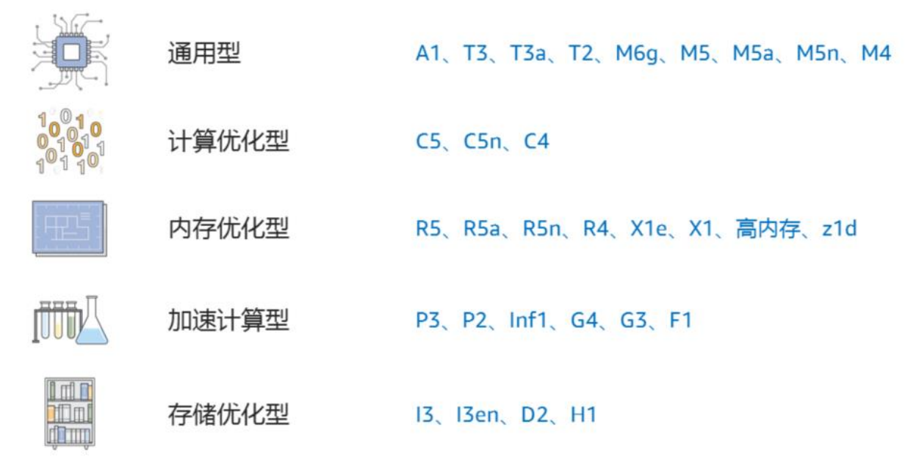
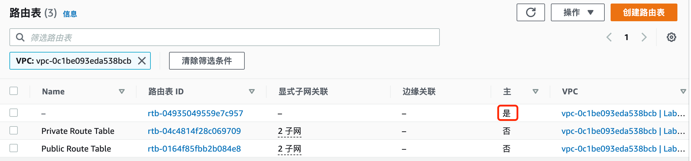

# AWS 服务概述

{: .no_toc}

## 目录

{: .no_toc .text-delta }

1. TOC
{:toc}

## 参考文档

[http://d0.awsstatic.com/whitepapers/aws-overview.pdf](http://d0.awsstatic.com/whitepapers/aws-overview.pdf)

## 为何要使用云计算，云计算的优势

云计算是一种按需使用，按用量付费的 IT 基础架构供给模型，企业可以通过云计算获得计算、存储、数据库、应用、安全服务等资源。在使用云计算后用户可以无需关注提供服务的基础硬件及周边资源，专注于业务本身。对于企业来说，一次性购置成本会变得很低，资源可以随时根据用量来扩缩。

AWS 定义的云计算 6 大优势：

- 将固定资产变为可变的费用：通过云计算减少数据中心建设等重固定资产，完全按照使用情况随时获取服务。
- 受益于规模经济：AWS 的服务可以同时为千万家企业提供服务，这样的大规模也可以使得 AWS 减少自身的运维成本，进而提供更低价的服务。
- 不再关心容量：无需再关心数据中心的建设容量，传统的数据中心建设方式通常有两种结果：一种是买了太多硬件闲置、一种是硬件不够资源吃紧。使用云计算则完美的解决了这些问题。
- 敏捷性：只需要点击鼠标即可获得 IT 资源。
- 减少数据中心维护费用：不再关心如何维护数据中心，将重点放在业务上。
- 快速跨国部署：快速将应用部署到跨国的不同区域中。为客户提供低时延的服务。

## 云计算的类型

- IaaS： Infrastructure as a Service：用于提供传统的信息化依赖的资源，例如网络、计算和存储。IaaS 相比其他类型最为灵活，管理度自由度最高，和当今很多传统数据中心的运维及使用方式相同。
- PaaS：Platform as a Service：移除了底层设施的维护需求（底层硬件及操作系统），专注于业务的部署、运维和功能维护。
- SaaS：Software as a Service：为您提供纯依赖于软件实现的服务，让您不再关心软件本身如何实现，如何运维管理。SaaS 通常也叫做面向最终用户的应用。使用 SaaS 让您只关心使用这项服务可以达成什么目标，例如传统的电子邮件服务便属于 SaaS。

## 全球基础设施

AWS 服务目前在全球 190 个国家有超过 100 万的用户，我们可以帮助客户在全球基础设施上提供低时延，高吞吐的服务，同时也可以保证用户的业务仅在指定的区域中运行。

AWS Cloud infrastructure 基于 AWS Region 和 AWS Availability Zone 构建，AWS region 是一些分布于全球的物理站点，每个 Region 内会有多个 Availability Zone，每个 Availability Zone 包含一个或者多个分散的数据中心，每个数据中心会有冗余的电源和网络，建设在不同的建筑中。目前全球有超过 20 个 Region 及超过 60 个 Availability Zone。

AWS Region 之间是完全隔离的，通过这种方式可以提供最大程度的故障冗余。每个 AZ 是独立的，但是同一个 Region 下的 AZ 间有高速的低时延链路。

## 计算服务 -EC2

全称 Elastic Compute Cloud 

M5.large

m 为系列名称、5 是世代号、Large表示实例大小。

[https://aws.amazon.com/cn/ec2/instance-types/](https://aws.amazon.com/cn/ec2/instance-types/)

### 实例选择

通用型：适合于有业务突增的服务，像网站。

使用 CPU 信用来应对突发的流量。

比如一个网站默认 CPU 性能基准为 10%（不同实例基准不一样），表示此网站通常的 CPU 使用率为 10%，如果在这个范围内使用，每小时可以积累一些 CPU 信用（一个 CPU 信用表示在 100% 情况下运行一分钟），比如使用 1 小时，积累 6 分钟的信用。当一个小时后 CPU 使用率突然增长到 100%，此时允许以此状态运行 6 分钟。 

### 按需实例

即时计算需求，按使用量付费。

### 预留实例

为容量预先付费，折扣深。

### Spot 实例

可达 90% off 的实例，不保证可用性，提前 2 分钟通知资源回收。

### 放置选项

- Cluster Placement Groups：实例会放在一个 AZ 中，多个实例之间网络连接性能最佳。如果使用按需实例，可能碰到 VM 关机后，无法再次开机，因为 AZ 内资源不够
- 分布置放群组：实例尽量放在不同的底层硬件上，可能分布在不同 AZ
- 分区置放群组：放在不同 AZ，底层不共享硬件

Amazon EC2 container service（ECS）：运行Docker

Amazon EC2 container registry（ECR）：Docker 镜像仓库，可以配合 ECR 一起使用

Amazon Elastic Container Service for Kubernetes

## AMI

Amazon Machine Image，用于启动 EC2 实例。支持启动权限（不同 image 可能有不同的文件，相应部门的人才能使用），支持块存储设备映射。

支持四种创建方式：

- AWS 与构建
- AWS marketplace：和其他厂商合作推出的 AMI，例如和安全厂商合作的 AMI
- 自行创建
- 社区 AMI

EC2 image builder，用于创建 Linux windows 镜像的创建、维护、验证、共享和部署。

从 AMI 启动 EC2 时，可以加入用户数据（例如自定义脚本）来进行开机操作，比如更新操作系统、设置 hostname 等。

## 存储服务

### S3

Amazon Simple Storage Service（S3）：一个简单的对象存储服务，提供 99.999999999% 的可靠性。

每个对象都被保存在存储桶，storage bucket 中，有着全球唯一的标识符，FQDN 格式。

支持分段上传，提高上传可靠性、上传吞吐量

#### 权限控制

1、可以通过 AWS 存储桶策略来控制 S3 对象的访问控制，使用 JSON 格式定义。

默认是 deny any（隐式拒绝），可以配置显示拒绝策略和显示允许策略，优先级分别为拒绝策略>显示允许>隐式拒绝。

Principal 表示访问者，可以是用户，也可以是其他应用，比如 web server。

2、AWS S3 也可以通过访问点来进行访问控制，有些类似于 RBAC。

3、S3 也可以通过 CORS （跨资源共享）来进行访问控制，通过 XML 文件定义。支持 PUT、COPY、POST、LIST、GET请求

#### 版本控制

支持版本控制，类似于 github，但又有一些差异，比如删除文件只是给文件添加删除标签，管理员可以通过删除此标签来进行回滚。

#### 使用场景

- 一次写入，多次访问的场景（对于频繁变化的文件，每次都得重复上传，不支持增量）
- 峰谷不均匀的数据访问
- 大量用户和不同数量的内容
- 不断增长的数据集。

常见场景：

- 静态web服务托管

- 数据库备份
- 大规模分析的数据存储，比如交易数据、媒体转码等

### S3 Galicier 长期数据存储

适合长期存储数据、存档和备份、非常低的成本。

支持文件库锁定，锁定后数据无法被修改。

标准检索时间是数小时，可以使用额外付费使用加速检索，1~5分钟即可检索到，

### S3 存储类

S3 支持存储分级，适合于不同的使用场景。

\* S3 Intelligent-Tiering 收取小额监控和自动化费用，对自动分层有 128KB 的最小合格对象大小限制。更小的对象也可以存储，但将始终按频繁访问层费率收费，不收取监控和自动化费用。有关更多信息，请参阅 [Amazon S3 定价](https://aws.amazon.com/cn/s3/pricing/)。只能分层看 30 天内有没有存储使用

** 存档访问层和深度存档访问层中的标准检索是免费的。如果您需要从存档访问层中更快地访问您的对象，您可以使用 S3 控制台为加快的检索付费。

*** S3 智能分层频繁和不频繁访问层的首字节延迟为毫秒访问时间，存档访问和深度存档访问层的首字节延迟为分钟或小时。

### 生命周期策略

可以通过生命周期策略来管理存储对应应该被删除还是被分级移动。

- 当您知道对象不常访问时，您可能会将其转换为 S3 Standard-IA 存储类。
- 您可能想要将不需要实时访问的对象存档到 S3 Glacier 存储类。

[https://docs.amazonaws.cn/AmazonS3/latest/userguide/lifecycle-transition-general-considerations.html](https://docs.amazonaws.cn/AmazonS3/latest/userguide/lifecycle-transition-general-considerations.html)

### 区域选择

1、遵照相关地区的数据隐私法，不能违反 GDPR 等法规。

2、用户与数据之间的距离，选择里用户最近的区域

3、服务和功能可用性，不同区域提供的服务也不一致

4、成本，不同位置的服务价格不一致

### EBS

Elastic Block Store，block storage，搭配 EC2 使用。仅支持附加到一个实例。

支持 SSD 和 HDD 两种类型

- 通用 SSD：大部分工作负载
- 预配置的 IOPS SSD：需要持续 IOPS 性能的关键业务应用程序、大型数据库工作负载

- 吞吐优化 HDD：日志处理、数据仓库、大数据、流处理工作负载、不能作为启动盘

- cold HDD：不频繁访问的大量数据、存储成本最低、不能作为启动卷

### EFS

Elastic File System，Linux 下使用 NFSv4，支持在可用区、区域、VPC、账户间进行共享。

### FSx

Windows 下使用 NTFS 格式，通过 SMB 协议传输，支持 AD 集成。

### Storage Gateway

在 on-premises 使用 AWS 存储，提供和本地存储一样的性能，但是可以无限扩展，适合于 ROBO、迁移、突发需求、存储分层等场景。

## 数据库服务

### 数据库设计考量

- 可扩展性
- 存储要求
- 对象大小和类型
- 持久性

### 关系型数据库 RDS

一般可以平滑纵向扩展，支持一写多读的集群方式，支持跨 AZ 部署。

支持在区域内配置 S3 备份，同时此 S3 备份可以跨区做备份，以此实现数据库的双备份。

提供 6 种后端引擎：Amazon Aurora, PostgreSQL, MySQL, MariaDB, Oracle, and Microsoft SQL Server.

Amazon Aurora：兼容 PostgreSQL 和 MYSQL 的关系型数据库，性能比 MYSQL 高 5 倍。分层架构。

Amazon ElastiCache

### 非关系型数据库 DynamoDB

速度非常快，可以横向扩展，适合简单，但量大的数据。

DynamoDB 全局表：一个账户下的多个副本表，多个表之间是异步进行复制的，可以跨区域部署。

一致性选项：最终一致读取（写入时其他副本可能不会立即同步，一段时间后才同步完成）和强一致性读取（一个读取会始终用最新的数据）

场景：游戏排行榜、购物车缓存

## 迁移

AWS Application Discovery Service：批量分析企业内上千个应用的类型，需要的性能、之间的依赖关系。

AWS Database Migration Service：迁移数据库时源数据库不受影响，支持同类型数据库的迁移和异构的迁移，例如  Oracle to Amazon Aurora or Microsoft SQL Server to MySQL

AWS Database Migration Service

## 网络

### VPC

部署一个独立的私有网络，按需发布到internet，可以实现租户间的隔离。

VPC 不能跨区域存在，但是可以托管在区域内的任何可用区。每个区域内最大可以有 5 个 VPC。每个 VPC 最大可以有 1 个 /16 网段。

VPC 内的子网不能跨越 AZ。

大部分情况下会使用多 VPC，只有个人/小规模情况下一个 VPC。

一个 VPC 下有一个 IP DICR，然后分成很多子网。

默认一个 VPC 有一个全局路由表，一般建议每个子网有一个路由表。

针对于自定义的路由表，会有 local 和到外部的路由（路由指向外部网关后，就属于公有子网了）：

### Internet 网关

VPC 和外部的 internet 进行通信，永不宕机。

子网关联路由表；internet 网关关联到 VPC。

## CDN 服务：Amazon CloudFront

Route53：DNS 服务

AWS Direct Connect：专用的链路连接到本地数据中心

Elastic Load Balancing：负载均衡

