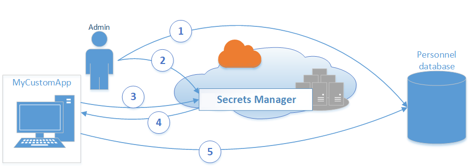

# AWS 管理相关服务

{: .no_toc}

## 目录

{: .no_toc .text-delta }

1. TOC
{:toc}

## 参考文档

[http://d0.awsstatic.com/whitepapers/aws-overview.pdf](http://d0.awsstatic.com/whitepapers/aws-overview.pdf)

## Cloudwatch

监控服务，可以使用 CloudWatch 来检测环境中的异常行为、设置告警、并排显示日志和指标、执行自动化操作、排查问题，以及发现可确保应用程序正常运行的洞察。

## AWS Config 

AWS Config 服务可供您评估、审计和评价您的 AWS 资源配置。Config 持续监控和记录您的 AWS 资源配置，并支持您自动依据配置需求评估记录的配置。借助 Config，您可以查看配置更改以及 AWS 资源之间的关系、深入探究详细的资源配置历史记录并判断您的配置在整体上是否符合内部指南中所指定的配置要求。如此一来，您将能够简化合规性审计、安全性分析、变更管理和操作故障排除。

## CloudHMS

云上托管的硬件安全模块。

## Cost Explorer

查看和管理 AWS 开销，可以导出 cost report

## 日志 CloudTrail 

CloudTrail ：跟踪用户活动和 API 使用情况。监控和记录所有账户的 activity。

## SCP 服务控制策略

Service Control Policy

您可以使用 SCP 允许或拒绝拥有 AWS Organizations [成员账户](https://docs.aws.amazon.com/organizations/latest/userguide/orgs_getting-started_concepts.html#account)的单一 AWS 账户或[组织单位 (OU)](https://docs.aws.amazon.com/organizations/latest/userguide/orgs_manage_ous.html) 内的账户组对 AWS 服务进行访问。来自附加 SCP 的指定操作会影响所有 IAM 身份，包括成员账户的[根用户](https://docs.aws.amazon.com/organizations/latest/userguide/orgs_manage_policies_example-scps.html)。

AWS Organizations SCP 不会替换 AWS 账户中的关联 IAM 策略。IAM 策略可允许或拒绝访问[与 IAM 结合使用](https://docs.aws.amazon.com/IAM/latest/UserGuide/reference_aws-services-that-work-with-iam.html)的 AWS 服务或 API 操作。IAM 策略只能应用于 [IAM 身份（用户、组或角色）](https://docs.aws.amazon.com/IAM/latest/UserGuide/id.html)。IAM 策略不能限制 [AWS 账户根用户](https://docs.aws.amazon.com/IAM/latest/UserGuide/id_root-user.html)。

## Secret Manager

安全地**保存**数据库和应用使用的密钥。使用此服务后，无需把密码写在代码中，支持 rotate 密码。

[https://docs.aws.amazon.com/secretsmanager/latest/userguide/intro.html](https://docs.aws.amazon.com/secretsmanager/latest/userguide/intro.html)

工作流：

1. 数据库管理员在 Personnel 数据库上创建一组凭据，供名为 MyCustomApp 的应用程序使用。管理员还使用应用程序访问人员数据库所需的权限配置这些凭据。
2. 数据库管理员将凭证作为 secret 存储在 Secrets Manager 中，使用名称  `MyCustomAppCreds`  标识 。然后，Secrets Manager 加密并保存 secret。
3. 当 MyCustomApp 访问数据库时，应用程序会向 Secrets Manager 查询名为 `MyCustomAppCreds` 的 secret。
4. Secrets Manager 检索 secret，解密受保护的机密文本，然后通过安全（HTTPS 和 TLS）通道将机密返回给客户端应用程序。
5. 客户端应用程序从响应中解析凭据、连接字符串和任何其他所需信息，然后使用这些信息访问数据库服务器。

Secret Manager 会使用 KMS 服务来对 secret 进行加密。使用 KMS 加密时，同时支持 AWS 托管的 KMS key 和用户手动生成的 KMS key。

## KMS

Key Management Service，是一个全托管的加密密钥管理服务，这些密钥通常用于加密数据，比如加密 DB 实例。

KMS 可以和很多 AWS 服务集成来进行数据加密，详见：

[https://aws.amazon.com/kms/features/#AWS_Service_Integration](https://aws.amazon.com/kms/features/#AWS_Service_Integration)

KMS 可以集成 CloudTrail 来记录 KMS key 的使用情况。

用户可以在控制台中创建、更新、管理 KMS 密钥。 

KMS 支持多区域 key（multi-region keys），这类 key 在多个区域有相同的 key ID 和 key material。可以用于跨区域加解密。

KMS 可用于：

- 使用对称或者非对称算法对数据进行加密
- 使用非对称密钥为消息进行签名和验证
- 生成可导出的对称密钥或者非对称密钥对
- 生成随机数字来满足加密要求

## Cognito - 用户注册和身份验证

借助 Amazon Cognito，您可以轻松将用户注册和身份验证功能添加到自己的移动和 Web 应用程序。Amazon Cognito 还支持您通过外部身份提供商对用户进行身份验证，并提供临时安全凭证，以供访问您的应用程序在 AWS 中的后端资源或 Amazon API Gateway 后的服务。Amazon Cognito 可与支持 SAML 或 OpenID Connect 的外部身份提供商和 Facebook、Twitter、Amazon 等社交身份提供商配合使用，同时您也可以将其与您自己的身份提供商相整合。

此外，Amazon Cognito 还支持您在用户的多台设备之间同步数据，以便用户在切换设备或升级至新设备时能够获得一致的应用程序体验。您的应用程序可以将数据本地保存在用户的设备上，这样一来，即使设备处于离线状态，您的应用程序仍然可以运行，并且会在设备重新上线后自动同步相关数据。

借助 Amazon Cognito，您可以集中精力打造出色的应用程序体验，在处理用户管理、身份验证以及跨平台和设备的同步操作时，无需担心解决方案的构建、保护和扩展。

**谁应该使用 Amazon Cognito？**

Amazon Cognito 是专为想要将用户管理和同步功能添加到其移动和 Web 应用程序的开发人员设计的。开发人员可以使用 Cognito Identity 将注册和登录功能添加到他们的应用程序，以便用户能够安全访问其应用程序的资源。Cognito 还使得开发人员能够跨设备、平台和应用程序同步数据。

## Macie - 敏感数据发现

Amazon Macie 是一项完全托管的数据安全和数据隐私服务，它利用机器学习和模式匹配来发现和保护 AWS 中的敏感数据。

Macie 会自动检测大量不断增多的敏感数据类型，包括姓名、地址和信用卡号等个人身份信息 (PII)。它让您可以持续了解存储在 Amazon S3 中数据的数据安全性和数据隐私性。

## Inspector

模拟攻击，检查安全配置是否合规

## Guardduty

分析日志和事件，发现未授权的行为，可用于发现挖矿软件

## Trusted Advisor

提供优化基础架构、安全和成本的建议
