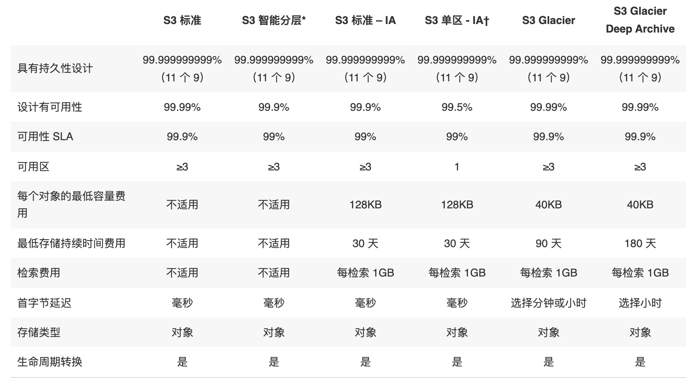

# AWS 存储服务

{: .no_toc}

## 目录

{: .no_toc .text-delta }

1. TOC
{:toc}

## 参考文档

[http://d0.awsstatic.com/whitepapers/aws-overview.pdf](http://d0.awsstatic.com/whitepapers/aws-overview.pdf)

### S3

Amazon Simple Storage Service（S3）：一个简单的对象存储服务，提供 99.999999999% 的可靠性。

每个对象都被保存在存储桶，storage bucket 中，有着全球唯一的标识符，FQDN 格式。

支持分段上传，提高上传可靠性、上传吞吐量

#### 权限控制

1、可以通过 AWS 存储桶策略来控制 S3 对象的访问控制，使用 JSON 格式定义。

默认是 deny any（隐式拒绝），可以配置显示拒绝策略和显示允许策略，优先级分别为拒绝策略>显示允许>隐式拒绝。

Principal 表示访问者，可以是用户，也可以是其他应用，比如 web server。

2、AWS S3 也可以通过访问点来进行访问控制，有些类似于 RBAC。

3、S3 也可以通过 CORS （跨资源共享）来进行访问控制，通过 XML 文件定义。支持 PUT、COPY、POST、LIST、GET请求

#### 版本控制

支持版本控制，类似于 github，但又有一些差异，比如删除文件只是给文件添加删除标签，管理员可以通过删除此标签来进行回滚。

#### 使用场景

- 一次写入，多次访问的场景（对于频繁变化的文件，每次都得重复上传，不支持增量）
- 峰谷不均匀的数据访问
- 大量用户和不同数量的内容
- 不断增长的数据集。

常见场景：

- 静态web服务托管

- 数据库备份
- 大规模分析的数据存储，比如交易数据、媒体转码等

### S3 Glacier 长期数据存储

适合长期存储数据、存档和备份、非常低的成本。

支持文件库锁定，锁定后数据无法被修改。

标准检索时间是数小时，可以使用额外付费使用加速检索，1~5分钟即可检索到。

### S3 存储类

S3 支持存储分级，适合于不同的使用场景。

\* S3 Intelligent-Tiering 收取小额监控和自动化费用，对自动分层有 128KB 的最小合格对象大小限制。更小的对象也可以存储，但将始终按频繁访问层费率收费，不收取监控和自动化费用。有关更多信息，请参阅 [Amazon S3 定价](https://aws.amazon.com/cn/s3/pricing/)。智能分层看 30 天内有没有存储使用

** 存档访问层和深度存档访问层中的标准检索是免费的。如果您需要从存档访问层中更快地访问您的对象，您可以使用 S3 控制台为加快的检索付费。

*** S3 智能分层频繁和不频繁访问层的首字节延迟为毫秒访问时间，存档访问和深度存档访问层的首字节延迟为分钟或小时。

### S3 Analytics 

Storage Class 分析，可以分析数据的访问情况，决定哪些数据应该放在哪个存储类。

### S3 生命周期策略

可以通过生命周期策略来管理存储对应应该被删除还是被分级移动。

- 当您知道对象不常访问时，您可能会将其转换为 S3 Standard-IA 存储类。
- 您可能想要将不需要实时访问的对象存档到 S3 Glacier 存储类。

[https://docs.amazonaws.cn/AmazonS3/latest/userguide/lifecycle-transition-general-considerations.html](https://docs.amazonaws.cn/AmazonS3/latest/userguide/lifecycle-transition-general-considerations.html)

### S3 传输加速

通过 Transfer Acceleration 对 S3 传输进行加速。

### 区域选择

1、遵照相关地区的数据隐私法，不能违反 GDPR 等法规。

2、用户与数据之间的距离，选择里用户最近的区域

3、服务和功能可用性，不同区域提供的服务也不一致

4、成本，不同位置的服务价格不一致

### EBS

Elastic Block Store，block storage，搭配 EC2 使用。仅支持附加到一个实例。

支持 SSD 和 HDD 两种类型

- 通用 SSD：大部分工作负载
- 预配置的 IOPS SSD：需要持续 IOPS 性能的关键业务应用程序、大型数据库工作负载

- 吞吐优化 HDD：日志处理、数据仓库、大数据、流处理工作负载、不能作为启动盘

- cold HDD：不频繁访问的大量数据、存储成本最低、不能作为启动卷

### EFS

Elastic File System，Linux 下使用 NFSv4，支持在可用区、区域、VPC、账户间进行共享。

### FSx

Windows 下使用 NTFS 格式，通过 SMB 协议传输，支持 AD 集成。

### S3/EBS/EFS 对比

| 特性             | **Amazon S3**                                                | **EBS**                                      | **EFS**                          |
| ---------------- | ------------------------------------------------------------ | -------------------------------------------- | -------------------------------- |
| 存储类型         | 对象存储                                                     | 块存储                                       | 文件存储                         |
| 存储大小         | 没有限制                                                     | 最大为16TB                                   | 没有限制                         |
| 单个文件大小限制 | 0字节~5TB                                                    | 没有限制                                     | 最大52TB                         |
| IO吞吐量         | 支持multipart上传如果使用single object upload，单个文件大小限制为5GB | 可以选择HDD或者SSD的磁盘类型，以提供不同的IO | 默认3GB                          |
| 访问             | 能通过因特网访问                                             | 只能被单个EC2实例访问                        | 可以被上千个EC2实例同时访问      |
| 可用性           | 99.99%                                                       | 99.99%                                       | 高度可用（官方没有公布相关数据） |
| 速度比较         | 最慢                                                         | 最快                                         | 中等                             |
| 价格             | 最便宜                                                       | 中等                                         | 最贵                             |

### Storage Gateway

在 on-premises 使用 AWS 云端存储，提供和本地存储一样的性能，但是可以无限扩展，适合于 ROBO、迁移、突发需求、存储分层等场景。

文件网关：通过 NFS 和 SMB 访问 AWS S3 中的文件；

卷网关：通过 iSCSI 访问 S3 中的数据。或者通过 iSCSI 访问 EBS 的快照创建的 EBS 卷。

磁带网关：iSCSI 虚拟磁带库。后端支持 S3 和 S3 Glacier。

### Transfer Family

通过托管的 Transfer Family 可以使得不同用户/服务通过安全的协议直接往 S3 读写数据，支持 SFTP、FTPS、FTP 等协议。

