# AWS 网络

{: .no_toc}

## 目录

{: .no_toc .text-delta }

1. TOC
{:toc}

## 参考文档

[http://d0.awsstatic.com/whitepapers/aws-overview.pdf](http://d0.awsstatic.com/whitepapers/aws-overview.pdf)

## VPC

部署一个独立的私有网络，按需发布到 internet，可以实现租户间的隔离。

VPC 不能跨区域存在，但是可以托管在区域内的任何可用区。每个区域内最大可以有 5 个 VPC。每个 VPC 最大可以有 1 个 /16 网段。

VPC 内的子网不能跨越 AZ。

大部分情况下会使用多 VPC，只有个人/小规模情况下一个 VPC。

一个 VPC 下有一个 IP DICR，然后分成很多子网。

默认一个 VPC 有一个全局路由表，一般建议每个子网有一个路由表。

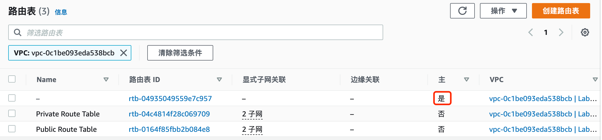

针对于自定义的路由表，会有 local 和到外部的路由（路由指向外部网关后，就属于公有子网了）：

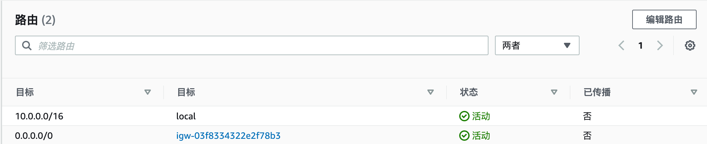

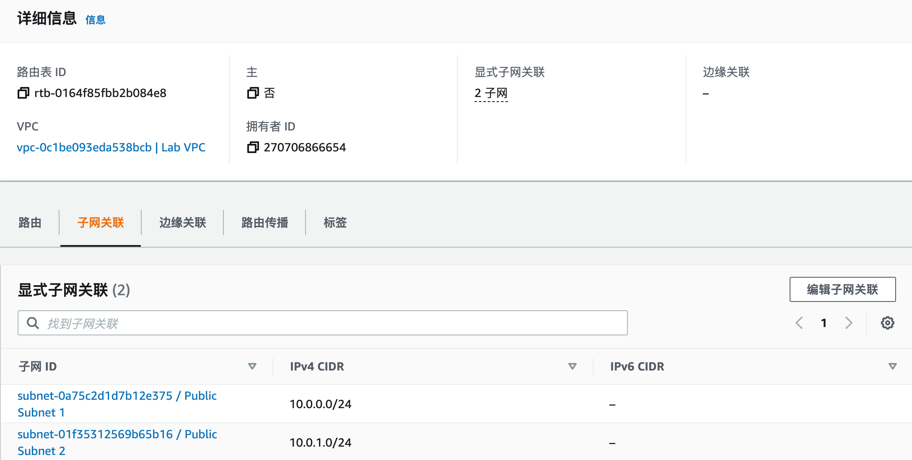

### 公有子网

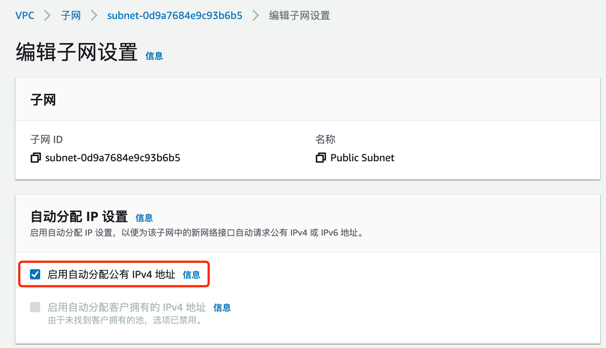

### 私有子网

不为其分配公有 IPv4 地址，因此无法被 Internet 访问到，但可以被其他子网访问到。

### 子网规划

建议使用比较大的网段，这样可以有足够的地址，并且安全配置相对简单。

如果不清楚需求，可以现在每个 AZ 内设置一个公有子网和一个私有子网。

## Internet 网关

VPC 和外部的 internet 进行通信（可以被互联网用户访问到），永不宕机。

子网关联路由表；internet 网关关联到 VPC。

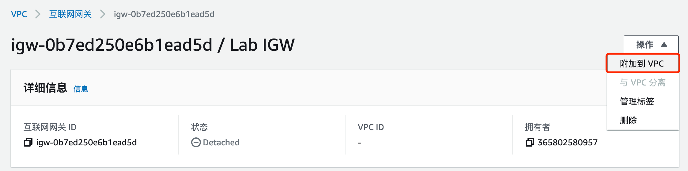

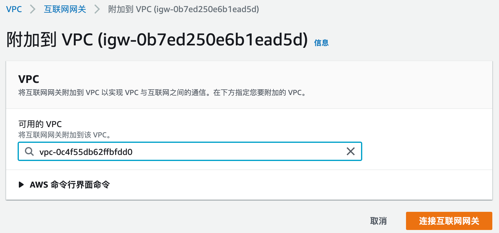

设置到 Internet 网关的路由：

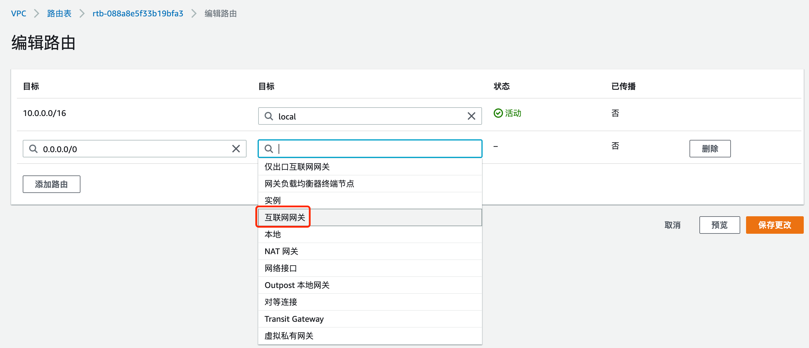

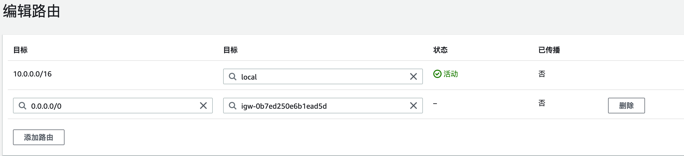

为子网关联路由表：

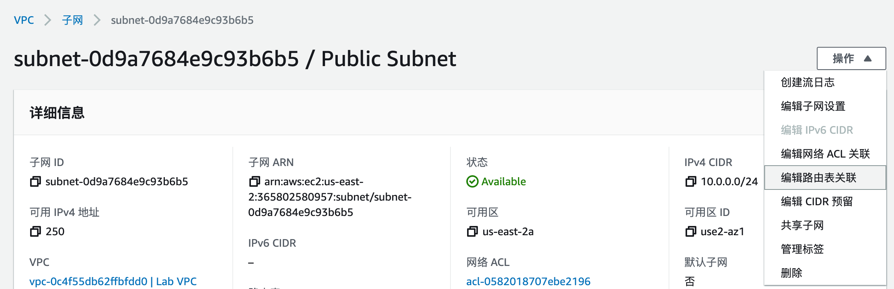

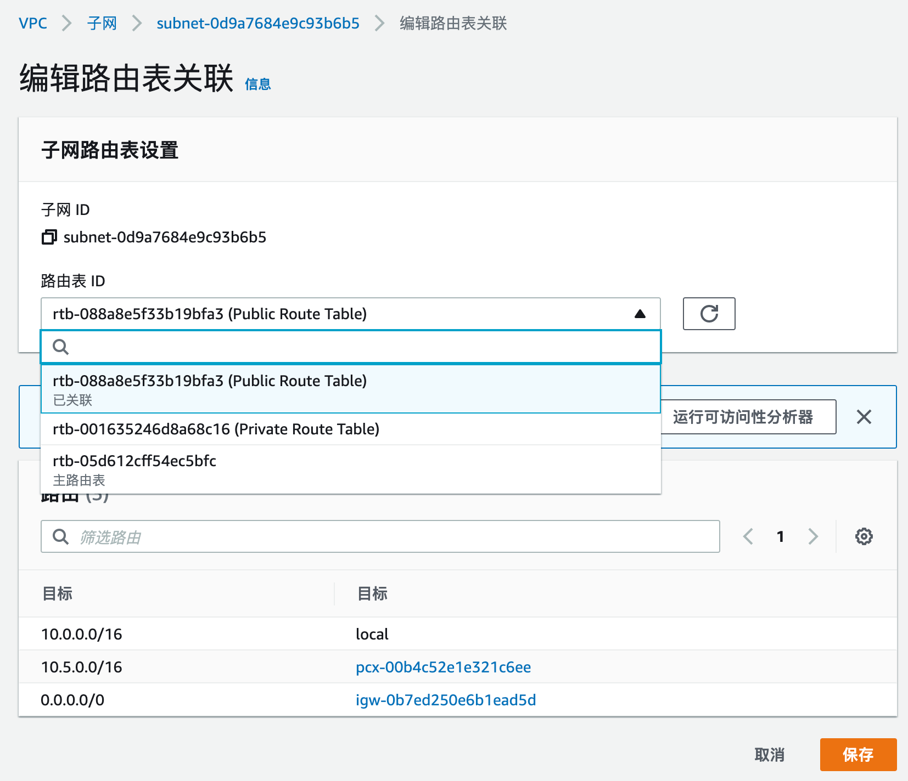

## NAT 网关

使得私有子网可以发起到 Internet 或者其他服务的出站流量。

防止 Internet 访问私有子网的流量。

## 弹性网络接口

一种虚拟网络接口，可以在 EC2 间迁移，迁移后弹性 IP、私有 IP、MAC 保持不变。

弹性网络接口可以以第二张网卡形式分配给 EC2。EC2 的主网卡不能是弹性网络接口。

弹性接口可以用于 LAN-WAN 双网卡环境，或者管理、业务分离的场景。

也可以用于灾备，比如一开始关联到主 EC2，故障后切换到备 EC2。

## 弹性 IP

每个区域最多可以有 5 个弹性 IP。可以灵活关联到实例。支持在不同 VPC 间进行分配。

## 安全组

主要基于有状态防火墙和安全组的概念实现。

默认入向 Deny，出向 Permit。

通过安全组可以实现 IP 和规则的解耦合，安全组有唯一 ID，用于区分不同安全组。

安全组为白名单机制，只能写 Allow 的规则，不能写 Deny 规则。

## 子网 ACL

位于子网边界的**无状态防火墙**，入站和出站都需要配置。

默认入向和出向均是 Permit（默认有个编号 100 的 ACL，作用为 Permit，其优先级高于默认的 Deny）。

一般不使用此功能。

ACL 可以用于临时禁止某些异常访问。

## 面向 Internet 提供服务是配置示例

如果要对外发布一个服务：

1、VPC 关联到一个 Internet 网关

2、路由表中有默认路由，指向 Internet 网关

3、实例具有公网 IP 或者关联了弹性 IP

4、ACL 和安全组允许相关流量

## VPN - 低成本站点到站点互联

通过 VPN 和 on-prem 环境进行连接。有三种实现方式：

[https://docs.aws.amazon.com/whitepapers/latest/building-scalable-secure-multi-vpc-network-infrastructure/vpn.html](https://docs.aws.amazon.com/whitepapers/latest/building-scalable-secure-multi-vpc-network-infrastructure/vpn.html)

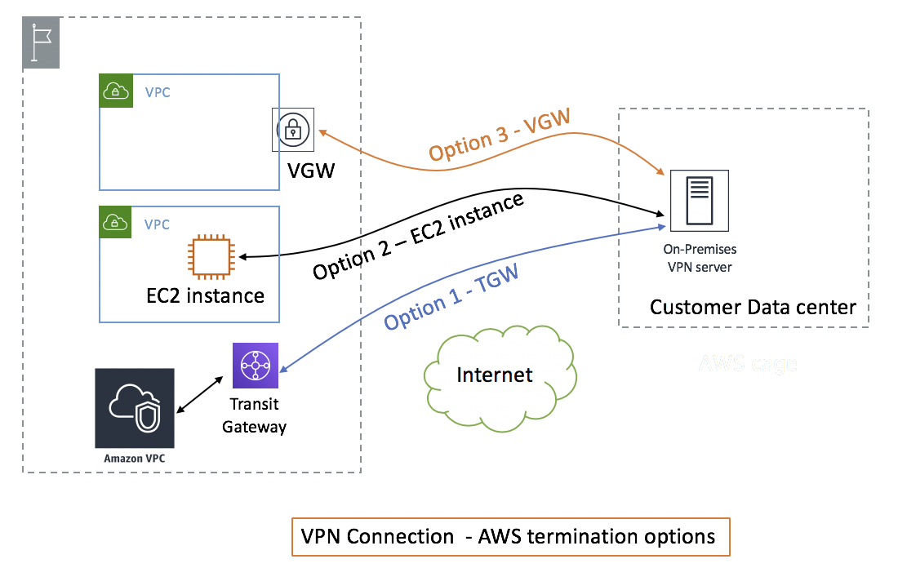

## Direct Connect  - 稳定的站点到站点互联

类似于专线，提供很高的带宽和较低的延迟，1G、10G等选项

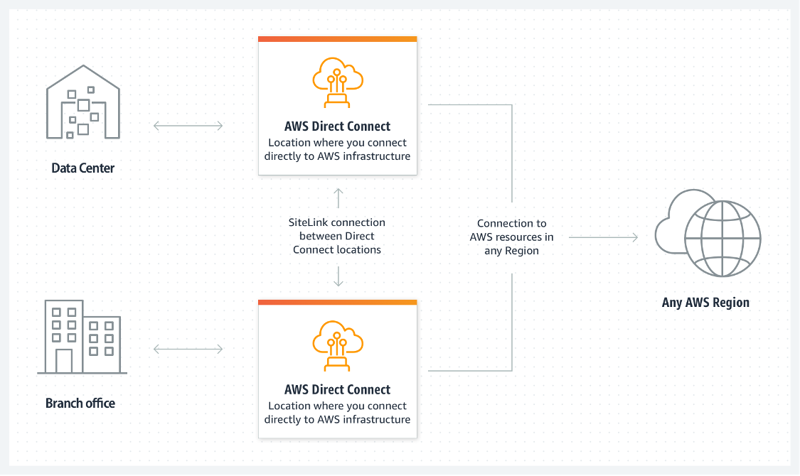

## VPC 对等连接 - 低成本打通 VPC 间网络

VPC 对等连接用于打通不同 VPC 之间的网络访问。多个 VPC 不能有重叠的地址。

一般使用场景：

- 有个 VPC 是服务 VPC，其他公司内部程序、本地数据中心需要和这个 VPC 连接。

比如下图中打通 Lab VPC 和 Shared VPC 之间的连接。

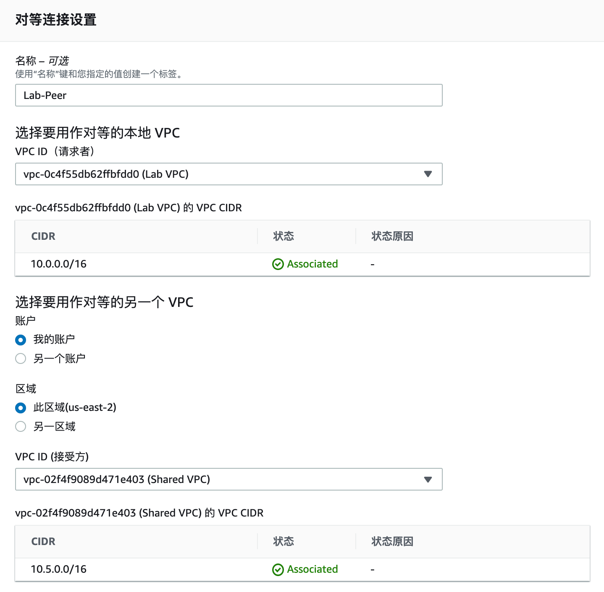

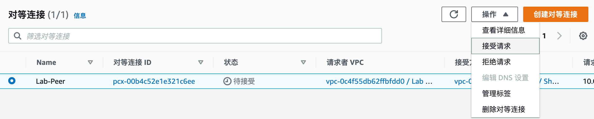

添加路由表：

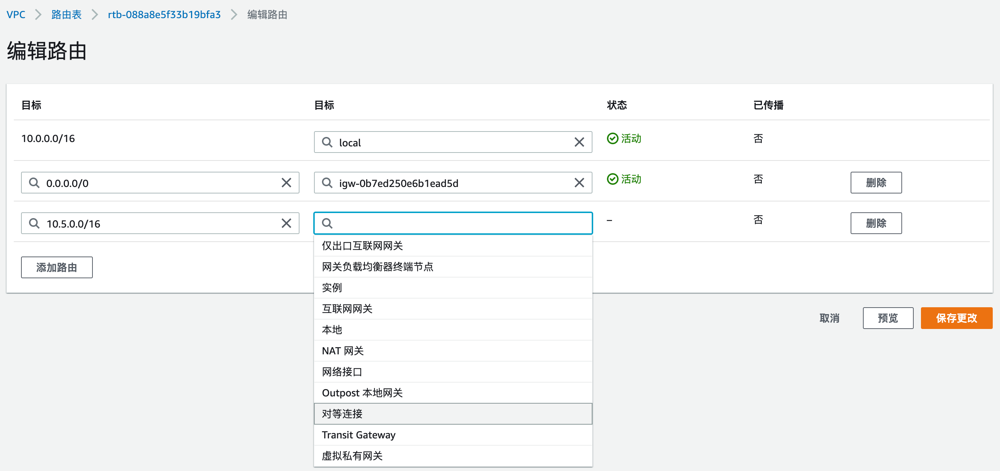

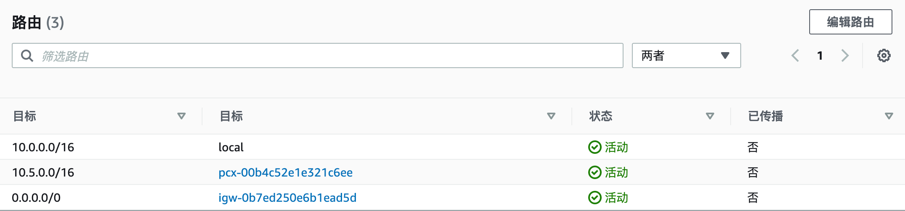

## Transit VPC - 低成本打通多 VPC 间网络

相比 VPC Peer 稍微复杂，支持多个 VPC 互联

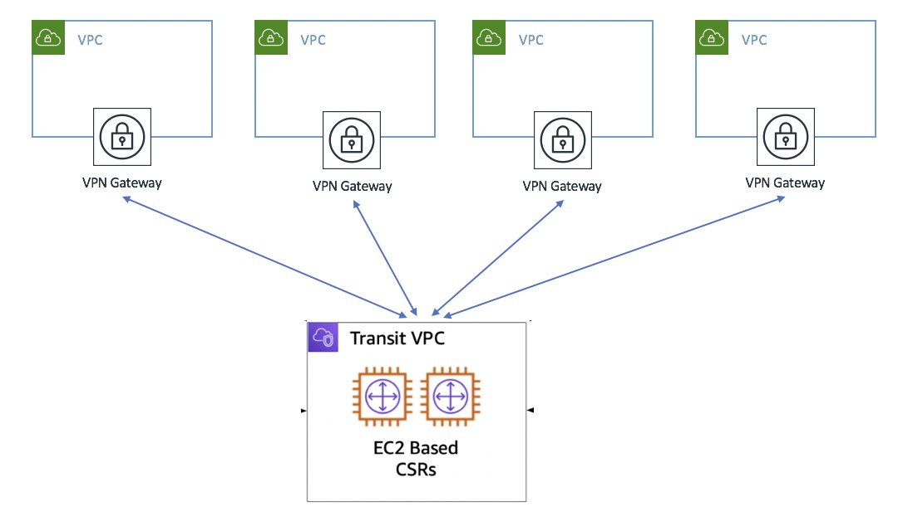

## Transit Gateway - 复杂的多中心互联

通过 Transit Gateway Fullmesh 连接多个 VPC、on-prem 网络，可以理解为 Transit VPC 的增强，支持在 Gateway 进行安全配置。

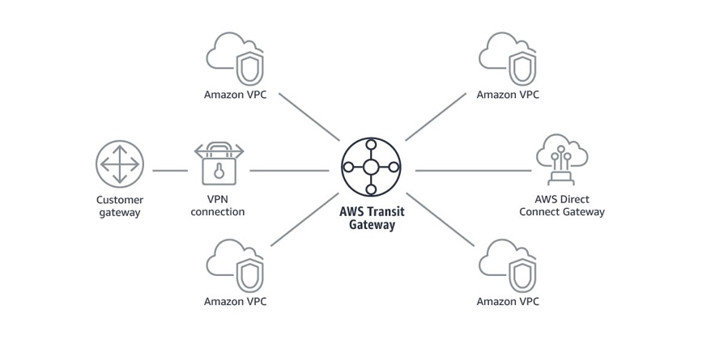

## VPC 终端节点 - EC2 通过内部网络访问其他 AWS 服务

在**同一区域**内，不经过 NAT、VPN、Internet 网关来让 EC2 访问到其他 VPC 中的服务。

### Interface Endpoint

一个具有私网 IP 的接口，可以连接到其他 AWS 服务或者第三方服务，详细支持清单：

[https://docs.aws.amazon.com/vpc/latest/privatelink/integrated-services-vpce-list.html](https://docs.aws.amazon.com/vpc/latest/privatelink/integrated-services-vpce-list.html)

使用场景：

VPC B 提供一些公有服务，此时 VPC A 可以通过 VPC endpoint 让 EC2 连接到 VPC B 的服务。

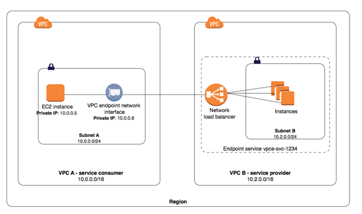

### Gateway Endpoint - S3/DynamoDB

一个特殊的 Gateway，可以将流量引入 S3 或者 DynamoDB。

注：S3同时也支持 Interface Endpoint，详见：

[https://docs.aws.amazon.com/AmazonS3/latest/userguide/privatelink-interface-endpoints.html#types-of-vpc-endpoints-for-s3](https://docs.aws.amazon.com/AmazonS3/latest/userguide/privatelink-interface-endpoints.html#types-of-vpc-endpoints-for-s3)

### Gateway Loadbalancer Endpoint

用于让流量转发到 Gateway LB，Gateway LB 一般是服务于 SP 的服务，可以将用户流量定向到安全 appliance 中进行过滤，然后再发回到源 VPC。

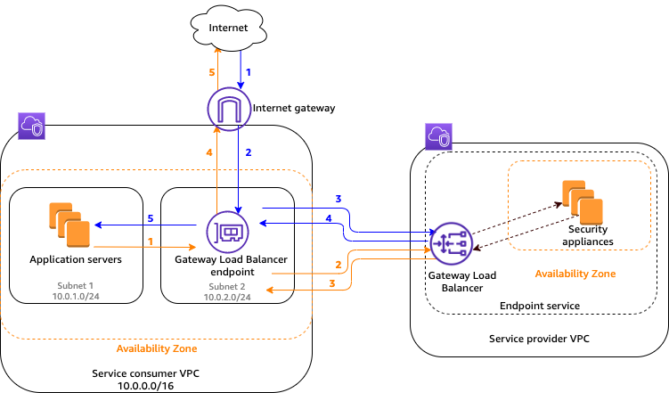

## Global Accelerator - 基于 IP 的加速

网络层的加速，根据用户的位置来将请求发送给就近的 Edge 节点，就近 Edge 节点再通过 AWS 内部线路将请求发送给服务器。

不仅支持 HTTP，也支持 TCP/UDP 应用。

底层使用 anycast IP 技术。

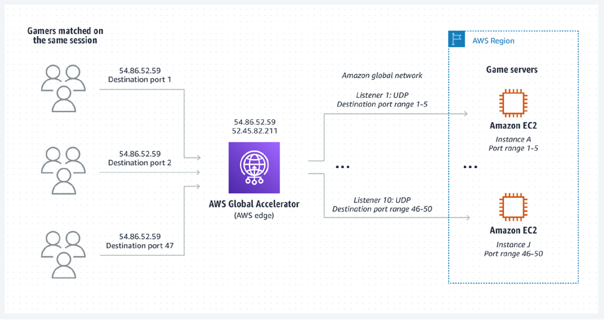

## ELB

分 Application LB 和 Network LB 两种。

ELB 位于一个 VPC 内，且后端的资源也需要在同一个 VPC 内，后端资源可以是分布在不同 AZ 的同一 VPC 内。

### ALB

对于 Application LB，支持 EC2、容器、IP 作为后端。

每个 ALB 有自己的 DNS 名称，没有固定的 IP。

支持功能：

- HTTP、TCP、SSL

### NLB

支持 TCP、UDP 的 L4 负载均衡器，仅能使用 IP 作为后端

## Route53

全局 DNS 服务，支持多种负载均衡方式和功能：

- 轮询
- 加权轮询：基于权重的轮询
- 基于延迟的路由
- 运行状况检查和 DNS 故障转移
- 地理位置路由：基于地理位置做本地化相关的请求转发
- 地理位置临近路由，基于物理距离
- 多值应答

## CDN 服务：Amazon CloudFront

缓存和加速服务，支持：

- 静态图片
- 视频
- 动态：自定义和不可缓存的内容
- 用户输入：HTTP post/put 等操作

可以配置 S3 或者自定义 HTTP 站点终端来进行缓存。

### 内容过期

- 存活时间 TTL：设置固定的过期时间
- 更改对象名称
- 手动使得过期

