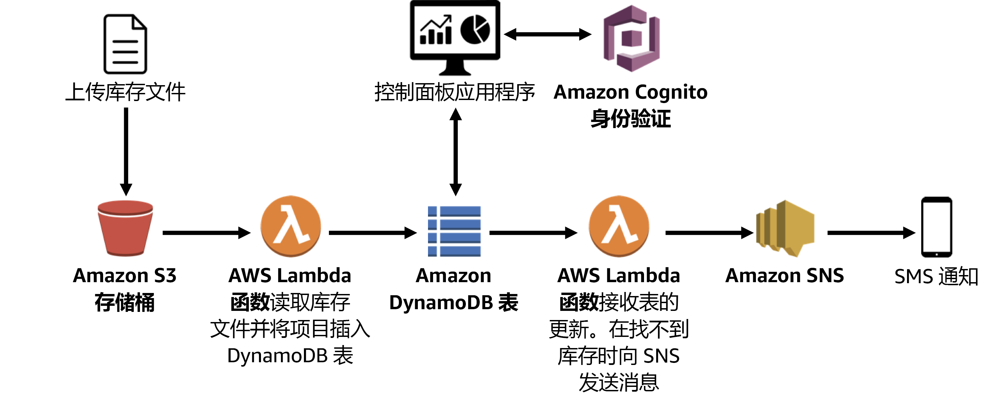

# AWS 全托管服务

{: .no_toc}

## 目录

{: .no_toc .text-delta }


1. TOC
{:toc}

## 参考文档

[http://d0.awsstatic.com/whitepapers/aws-overview.pdf](http://d0.awsstatic.com/whitepapers/aws-overview.pdf)


## AWS Fargate

完全托管的容器服务。支持 ECS 和 EKS。

使用 Fargate 后，无需管理运行容器的节点和集群。


## Lambda

完全托管的计算服务，运行无状态代码。

支持 Node.JS、Java、Python、C#、Go、Ruby 等语言。

可以按计划或者针对事件运行代码。

## API gateway

每秒支持 10w 的 API 并发请求。

可以处理下列工作负载：

- EC2
- Lambda
- 任何 Web 应用

## 无服务实验 Lambda



当 S3 上有文件更新时，从 S3 加载库存到 DynamoDB，通过额外的页面进行展示。

```python
# Load-Inventory Lambda function
#
# This function is triggered by an object being created in an Amazon S3 bucket.
# The file is downloaded and each line is inserted into a DynamoDB table.

import json, urllib, boto3, csv

# Connect to S3 and DynamoDB
s3 = boto3.resource('s3')
dynamodb = boto3.resource('dynamodb')

# Connect to the DynamoDB tables
inventoryTable = dynamodb.Table('Inventory');

# This handler is run every time the Lambda function is triggered
def lambda_handler(event, context):

  # Show the incoming event in the debug log
  print("Event received by Lambda function: " + json.dumps(event, indent=2))

  # Get the bucket and object key from the event
  bucket = event['Records'][0]['s3']['bucket']['name']
  key = urllib.parse.unquote_plus(event['Records'][0]['s3']['object']['key'])
  localFilename = '/tmp/inventory.txt'

  # Download the file from S3 to the local filesystem
  try:
    s3.meta.client.download_file(bucket, key, localFilename)
  except Exception as e:
    print(e)
    print('Error getting object {} from bucket {}. Make sure they exist and your bucket is in the same region as this function.'.format(key, bucket))
    raise e

  # Read the Inventory CSV file
  with open(localFilename) as csvfile:
    reader = csv.DictReader(csvfile, delimiter=',')

    # Read each row in the file
    rowCount = 0
    for row in reader:
      rowCount += 1

      # Show the row in the debug log
      print(row['store'], row['item'], row['count'])

      try:
        # Insert Store, Item, and Count into the Inventory table
        inventoryTable.put_item(
          Item={
            'Store':  row['store'],
            'Item':   row['item'],
            'Count':  int(row['count'])})

      except Exception as e:
         print(e)
         print("Unable to insert data into DynamoDB table".format(e))

    # Finished!
    return "%d counts inserted" % rowCount
```


库存不足时通知函数，当 DynamoDB 有表项变动时触发此函数，检查库存是否为 0 ，然后发送邮件通知（topic：NoStock）。

```python
# Stock Check Lambda function
#
# This function is triggered when values are inserted into the Inventory DynamoDB table.
# Inventory counts are checked, and if an item is out of stock, a notification is sent to an SNS topic.

import json, boto3

# This handler is run every time the Lambda function is triggered
def lambda_handler(event, context):

  # Show the incoming event in the debug log
  print("Event received by Lambda function: " + json.dumps(event, indent=2))

  # For each inventory item added, check if the count is zero
  for record in event['Records']:
    newImage = record['dynamodb'].get('NewImage', None)
    if newImage:

      count = int(record['dynamodb']['NewImage']['Count']['N'])

      if count == 0:
        store = record['dynamodb']['NewImage']['Store']['S']
        item  = record['dynamodb']['NewImage']['Item']['S']

        # Construct message to be sent
        message = store + ' is out of stock of ' + item
        print(message)

        # Connect to SNS
        sns = boto3.client('sns')
        alertTopic = 'NoStock'
        snsTopicArn = [t['TopicArn'] for t in sns.list_topics()['Topics']
                        if t['TopicArn'].lower().endswith(':' + alertTopic.lower())][0]

        # Send message to SNS
        sns.publish(
          TopicArn=snsTopicArn,
          Message=message,
          Subject='Inventory Alert!',
          MessageStructure='raw'
        )

  # Finished!
  return 'Successfully processed {} records.'.format(len(event['Records']))
```


