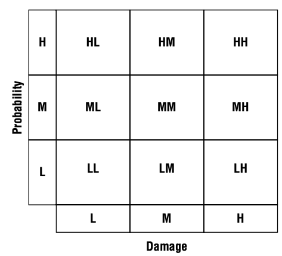
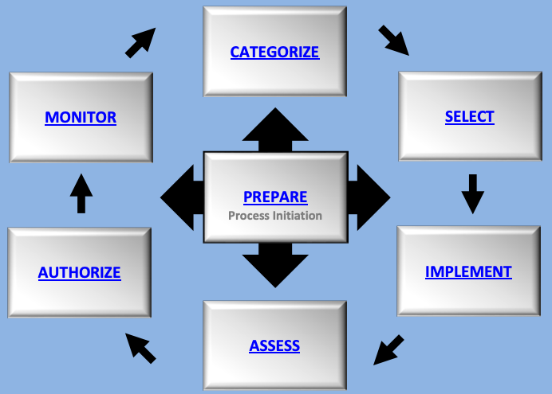

# 安全与风险管理

{: .no_toc}

## 目录

{: .no_toc .text-delta }

1. TOC
{:toc}

## CIA 

CIA 三性：

- 机密性：和数据泄露有关。

- 完整性：和篡改有关，一般和访问控制/隔离有关。常见的原因可能和用户误操作有关。

- 可用性：和中断有关。

**避免过度安全，安全方案的代价不能高于所保护资产的价值。**过渡保护机密性、完整性会导致可用性受限，过渡保护可用性会使机密性和完整性受限。

CIA 的反面：DAD（Disclosure泄露、Alteration篡改、Destruction损坏） 

### C 机密性保护机制

- 静态数据加密（硬盘加密、数据库加密）
- 传输加密（TLS、SSH、IPSec）
- 访问控制（物理及逻辑的）
- 数据隐藏（防止数据泄露和访问）
- 隔绝：把东西放在不可访问的位置，有严格的访问控制

### I - 完整性保护机制

- 哈希校验（保证数据完整）
- 配置管理（保证系统完整）
- 变更控制（过程完整，比如回归测试）
- 访问管理（防止未经授权的更改）
- 数字签名（代码签名，保证代码完整性和不可否认性）
- 传输 CRC 校验

### A 可用性保护机制

- RAID 冗余磁盘阵列
- 集群
- 负载均衡
- 冗余的数据和电源线路
- 备份
- 磁盘映像
- 灾备站点

### CIA 保护机制

- 纵深防御：分层防御，一个控制的实效不会导致系统或数据暴露
- 抽象：提升效率，相似的元素被放入组、类或角色中，作为集合进行访问控制、限制
- 数据隐藏：防止数据泄露和访问、限制低级别的主体访问高级别的数据、阻止应用直接访问存储硬件、数据隐匿
- 加密：对非预期的接受者隐藏通信的真实含义

## 评估和安全治理原则

安全治理指出于安全需求，**在整个组织中进行管理和治理，而不是仅 IT 部门。**

### 第三方治理

第三方治理：由法律、法规、行业标准、合同义务或许可要求的，由外部执行的监督系统。

**通常是强制性的，涉及审计或监督。**

第三方治理侧重于：验证是否符合声明的安全目标、需求、法规和合同义务。

常见的审计标准有 COBIT（信息和相关技术控制目标）。

### 文件审查

通过文件交换进行第三方的全面审查，文件审查通常发生在现场检查之前，如果文件不合规，则通常现场也不合规。

如果文件不合规则可能吊销 ATO（操作授权，见第三部分）。

## 安全管理计划

目的：安全绩效可测量

安全管理计划要自上而下制定：

- 高层定义阻止安全方针
- 中层讲安全策略完成标准、基线、指南和程序，并监控执行
- 业务经理和安全专家实时配置
- 最终用户遵守组织的安全策略

**类型：**

- 战略计划：大约 5 年的长期计划，愿景计划，计划中包含风险评估
- 战术计划：中期计划（1年），提供更多的细节，包括项目计划、收购计划、招聘计划、预算计划、维护计划、支持计划、系统开发计划等
- 操作计划：短期、高度详细的计划（可实施的文档）。每月或每季度更新

## 组织的角色和职责

在第二部分访问控制中也有数据角色的介绍，可以参照起来看。

### 高级管理者（CXO）

信息安全最终责任人。

### 信息安全专家/安全专业人员

负责落实高级管理者下发的任务。

### 资产所有者

保护信息分类，对资产保护负责，通常是高级管理者。不去执行最终的数据管理，交给托管员执行。

### 托管员

执行最终策略配置的人员。

### 用户

访问数据的人。

### 审计人员

负责检查安全策略是否被正确执行，相关的安全解决方案是否完备。

审计人员在发现问题后会先进行确认，再写入审计报告。

### 安全指导委员会

- 由 CEO、CIO、CFO、部门经理、内审官等组成的委员会
- 每季度召开会议
- 定义组织可接受的风险级别，确定安全目标和战略，制定安全活动优先级，审查风险评估报告，批准安全策略和变更等

### 审计委员会

由董事会指派专人，进行公司内部的审查，审查结果直接汇报董事会。

## 安全控制框架

应用最广泛的安全控制框架是 **COBIT**，COBIT 基于六个原则进行企业 IT 治理和管理：

- 为利益相关方**创造价值**
- 采用**整体分析法**
- **动态**地治理系统
- 把治理**从管理中分离**出来
- 根据企业需求**量身定制**
- 采用端到端的治理系统

IT 安全的其他标准和指南：

- ISO 27000 系列，国际标准，企业**信息安全及相关管理实践**标准
  - ISO 27001：信息安全管理体系的标准
  - ISO 27002：信息安全控制措施的更多细节
  - ISO 27004：信息安全绩效
  - ISO 27005：信息安全风险管理
- NIST风险管理框架 RMF：联邦机构的强制要求，包含 6 个阶段：分类、选择、实施、评估、授权和监控

### Due Care

应尽关心：在正确的时间采取正确的**行动**。应尽关注原则描述了一个人应该在一种情况下用正常人**所期望**的相同级别的关注来**响应**。

**如果一个公司没有做到充分的安全策略、适当的安全意识培训，则没有达到 DC。**

### Due Diligence

应尽审查：职责是什么，应该做什么，制定计划。在日常管理中尽到**责任**。应尽职责原则是应尽关注的一个更具体的组成部分，它描述被指派责任的个人应该以应尽关注的方式准确和及时的完成责任。

在做信息安全时，应该尽可能**收集信息**以进行最佳决策，查看并**了解风险**。

#### 谨慎人规则

谨慎人规则要求**高级管理人员为信息安全事务承担个人责任**，为了确保普通，谨慎的个人在相同情况下会表现出应尽关注。该规则最初适用于财务事项，但联邦量刑指南于1991年将其应用于美国的信息安全事项。

### DC 和 DD 区分

- DD 是对 DC 的执行

## 安全策略、标准、程序、指南

### 策略

- 方法、规定
- 定义要保护的对象和目标
- 安全框架
- 分配职责、定义角色、明确审计需求、概述实施过程等

#### AUP 可接受的使用策略

属于安全文档的一部分，定义了可接受的绩效级别和期望的行为、行动。不执行 AUP 可能会被警告甚至开除。

### 标准

- **强制性**要求
- **一致性**，比如实施标准，采购标准

### 基线

- 每个系统需要满足的**最低安全级别**
- 一般参考行业标准

### 指南

- 如何实现上面的标准和基线的**建议**，非强制的

### 安全流程（安全程序） SOP

Standard Operating Procedure，**详细的分步实施文档**。

可以是整个系统的部署操作，也可以是单个产品的。

## 威胁建模 - 关注威胁

威胁建模是识别、分类和分析潜在威胁的过程。贯穿系统的整个生命周期。

- 主动式：在产品研发阶段进行威胁建模

- 被动式：在部署后执行
- 主动式和被动式都需要，因为并不是所有的威胁都能在开发阶段识别。

### 1. 识别威胁

关注资产、关注攻击者关注软件。

威胁建模的最终目的：**对危害组织有价值资产的潜在威胁进行优先级排序。**

#### STRIDE 威胁分类

微软开发的。

- 欺骗 Spoofing
- 篡改 Tampering
- 否认 Repudiation
- 信息泄露 Information Disclosure
- 拒绝服务 DoS
- 提权 Elevation of Privilege

#### PASTA 威胁建模

以风险为核心。

#### Trike 威胁识别模型

#### VAST 敏捷开发威胁建模

### 2. 确定潜在的攻击

绘制**数据流图**。确定每个环节涉及的技术，可能受到的攻击类型，比如逻辑、物理、社会工程学攻击等。

### 3. 简化分析

**分解数据流图中的应用和环境。**更好地了解产品逻辑、内部单元、交互等等。

分解过程需要关注 5 个要素：

- 信任边界：信任级别、安全级别**发生变化**的地方
- 数据流路径：两个位置间的流动
- 输入点：接收外部输入的地方
- 特权操作
- 安全生命和 Method （方法）

### 4. 优先级排序和响应

对威胁进行评级和排序，使用 DREAD 评级方案。

DREAD 总分 100 分，包含**发生可能性*潜在损失** 。其中每个值都是 1~10，10 表示最高。

DREAD 关注下列 5 个问题：

- 潜在破坏（损失）
- 受影响用户（损失）
- 复现率（概率）
- 漏洞可利用性（概率）
- 漏洞发现难易度，可发现性（概率）

#### 风险矩阵/风险热图

## 供应链风险管理

SCRM Supply Chain Risk Management

目标：确保所有供应商和环节都是可靠的。

重点：对供应商进行评估、持续监控和管理

SLR 与 SLA：

- SLR：服务级别需求
- SLA：服务等级协议，规定最低的安全要求
- SLR 产生 SLA

## 人员管理

### 1. 岗位描述和职责

- 确定岗位描述清单，比如角色和要执行的任务
- 日常的具体工作内容，访问其他资源的权限

### 2.人员筛选和调查

- 背景调查：减少风险、减少招聘成本、降低员工流通率
- 资质考核

### 3. 人员录用

- 签署雇佣协议
- 入职培训（认同企业文化可以减少离职率）
- 保密协议签署：保护公司敏感信息，入职时签署，离职重申
- 遵守 AUP（定义公司的安全标准，即哪些活动可接受，哪些不行）

### 4. 员工监督

- 岗位轮换（防串通，防滥用）
- 交叉培训（A/B 角色）
- 员工评估：针对关键角色进行全面评估，针对其他员工抽查

- 审查员工，早期发现可能对安全造成风险的行为
  - 不满的员工
  - 强制休假（强制审查，一般）

### 5. 离职

- 禁用、删除用户账号
- 撤销证书
- 取消访问代码权限
- 解雇过程需要安全部门和 HR 参与，尊重员工的同时降低风险，离职面谈需要重申之前签署的安全协议

### 第三方人员管理

- 签署 SLA，SLA 需要包含安全保密相关的内容
- 使用 VMS 供应商管理系统

### 合规策略

在人员层面，合规=员工是否遵循公司的策略。

合规是一种**行政或管理**形式的安全控制。

### 隐私策略

隐私内容包含：

- 未授权访问个人可识别信息（PII），例如电话号、地址、IP 等
- 未经授权的个人机密信息访问
- 未经同意的监视

要遵照法律要求保护和存储隐私数据：

- HIPAA 健康保险流通与责任法案
- SOX 萨班斯-奥克斯利法案
- FERPA 家庭教育权利和隐私法案
- GDRP 通用数据保护条例

## 风险管理 - 关注资产

风险管理的目标：**将风险降至可接受的水平。**

绝对安全的环境是不存在的，需要平衡收益/成本，安全性/可用性。

风险来自很多方面，可能是非 IT 的灾难，比如自然灾害等。

风险管理包含两大部分：

- 风险评估/风险分析：基于价值/性质分析每个系统的风险
- 风险响应：使用成本/收益的方式评估风险控制措施

### 风险相关的术语解释

- 资产：可以是业务流程或者使用到的任何事物，可以是有形的也可以是无形的
- 资产估值 AV：资产对应的货币价值，综合重要性、使用情况、成本、支出等元素得出
- 威胁：可能导致资产破坏、变更、泄露等的行为
- 威胁主体：主体利用威胁来危害目标
- 威胁事件：对脆弱性的意外和有意利用
- **威胁向量（Threat Vector）**：攻击者为了伤害目标而使用的路径和手段，比如 Wifi、物理访问、社会工程学等
- 脆弱性：资产中的弱点，使威胁能够造成损害的缺陷、漏洞、疏忽，可以是技术上的，也可以是管理逻辑上的
- 暴露：资产丢失暴露的**可能性**
- 风险：
  - 风险=威胁*脆弱性
  - 风险=损害的可能性*损害的严重程度
- 攻击：威胁主体进行的脆弱性利用**尝试**
- 破坏：成功的攻击

### 1. 风险分析

风险分析的目标是：**确保只部署具有成本效益的措施**。

#### 定性风险分析 - 基于定性的更容易分析

基于**分级**来进行。基于场景，而非计算，依赖经验和判断。

- 场景：针对单个威胁的描述
  - 通常比较概要，限制在一页纸，方便参与的人分配等级
  - 威胁如何产生
  - 对组织带来的影响
  - 可能的防护措施
- Delphi 技术：**匿名**的反馈和响应
  - 对于每个反馈，参与者通过数字消息匿名写下反馈，最后汇总给风险分析小组，重复这个过程直至达成共识

#### 定量风险分析

几个关键词：

- AV 资产价值
- EF 暴露因子：潜在的损失，**EF 仅表示单个风险发生时对整体资产价值造成的损失**（比如硬件故障带来的损失），以百分比计算
- SLE 单一损失期望（Single Loss Expectancy）：SLE = AV * EF
- ARO 年发生率
- ALE 年度损失期望

ALE = ARO * SLE = **ARO * AV * EF** 

#### 定性分析和定量分析的对比

| 特征                 | 定性分析 | 定量分析 |
| -------------------- | -------- | -------- |
| 使用数学计算         | 否       | 是       |
| 使用成本/收益分析    | 可能     | 是       |
| 需要估算             | 是       | 有时     |
| 支持自动化           | 否       | 是       |
| 涉及大量信息         | 否       | 是       |
| 客观的               | 较少     | 较多     |
| 依赖于专家意见       | 是       | 否       |
| 耗费的时间           | 一般     | 多       |
| 提供有用的意义和结果 | 是       | 是       |

### 2. 风险响应

风险响应的形式：

- **风险缓解：最常用**，通过实施防护措施、安全控制来减少脆弱性，阻止威胁。比如加密和防火墙
- 风险转让：购买服务、保险等。**可以转让风险，但无法转移责任**
- 风险威慑：比如实施审计、监控、警告 banner、安保人员等
- 风险规避（risk avoidance）：灾难避免，比如关闭重要系统以降低安全风险
- 风险接受：可以接受安全风险，通常意味着保护成本>资产价值
- 风险拒绝：不接受但是可能发生，不应该有

残余风险处理（除已经防护的，剩下的风险）：

- **定期**进行评估

### 风险控制的成本和效益

几个关键词：

- ACS （ annual cost of the safeguard）年度防护成本
- ALE 年度损失期望
- 实施措施前的 ALE
- 实施措施后的 ALE

防护措施对公司的价值=**实施措施前的 ALE-实施措施后的 ALE-ACS**

### 安全控制分类

按照方式：

- 管理行政类：数据分类、背景调查、工作说明书、审查、监督、培训
- 技术/逻辑类：IPS、防火墙、IAM、加密
- 物理类：门禁、锁、保安、看门狗、围栏、物理环境入侵检测等

按照作用：

- **预防性**：身份认证、门禁、报警系统、岗位轮换、IPS、培训等
- 威慑：锁、保安等，属于预防类
- **检测**：保安、IPS 、审查
- 补偿：另一种控制手段的补充或增强，比如主要手段是防止删除，补偿手段是存在备份可恢复
- **纠正**：例如杀毒、阻止入侵行为、备份恢复等，将环境从非预期的活动中进行恢复
  - 恢复性控制：纠正的扩展

### 安全控制评估 SCA

Security Control Assessment

根据基线或可靠性期望**对安全机制的正式评估**。可作为渗透测试报告的补充。

目的：**确保安全机制的有效性**。评估组织风险管理过程中的质量和彻底性，生成已部署安全措施的**优缺点报告**。

对应的标准为 **NIST SP 800-53 Rev5**，信息系统和组织的安全和隐私控制。

### 风险管理成熟度模型 RMM

Risk Maturity Model

RMM 5 个级别：

- 初始级 （ad hoc）：混乱的状态
- 预备级（Preliminary）：初步尝试遵守风险管理流程，但是每个部门执行的风险评估不同
- 定义级（Defined）：在整个组织内使用标准的风险框架
- 集成级（Integrated）：风险管理集成到了业务流程中，风险是业务战略决策中的要素
- 优化级（Optimized）：侧重于实现目标，而不是被动响应

### 风险管理框架 RMF 

Risk Management Framework，被 NIST SP 800-37 Rev2 定义

风险框架用于评估、解决和监控风险的指南或方法。

**1+6个循环的**阶段：先进行准备，准备上下文和优先级（优先处理哪些系统）

- 分类：根据对损失影响的分析，对信息及系统进行分类
- 选择：选择合适的控制手段，可以将风险降到可接受水平
- 实施：实施上面描述的控制
- 评估：确保控制实施到位（也就是检查）
- 授权：在确定风险可接受的基础上，授权上线（类似于认可）
- 监控：持续监控系统，保证控制的有效性

## 安全培训

### 意识

- 教学、视频、海报、媒体等

### 培训

- **定期**的培训，加强人员安全意识
- 最好是强制的培训

### 教育

- 教育可能是获取资格认证的培训，或者和晋升相关的教育

### 改进

- 培训完成后需要做的
  - 制定改进计划、下一步计划

### 有效性评估

- 考试
- 审查事件日志，了解违规发生率

## 业务连续性计划 BCP

**BCP 和业务中断有关。**关注上层，以业务流程和运营为主。

**DRP 容灾恢复计划 - 和数据恢复有关。**更具细节，描述站点恢复、备份和容错等技术。

BCP 四个阶段：

- 项目范围和计划
- 业务影响分析 BIA
- 连续性计划
- 计划批准和实施

### 1. 项目范围和计划

- **首要职责，组织分析**：了解部门职责
- 选择 BCP 团队：包括业务、法务、IT、安全、公关、财务、高层代表等
- 资源需求：有人员需求和财务需求（购买软硬件）
- 法律和法规要求

### 2. 业务影响分析 BIA

目的：识别关键业务功能及这些功能相关的 IT 资源，分析中断的影响。

支持定量分析和定性分析，**BCP 通常喜欢使用定量分析，从而忽略定性分析，BCP 团队应该对影响 BCP 过程的因素进行定性分析。**

#### 1, 确定优先级

定量分析：

- 确定资产价值 AV
- 确定 MTD 最大容忍中断时间
- RTO 应该始终小于 MTD（MTD = RTO + 业务确认的时间 WRT）

#### 2, 风险识别

识别自然风险和人为风险：

- 暴雨、累计、地震、火山、流行病等
- 恐怖袭击、火灾、互联网终端等

#### 3, 可能性评估

确定每种可能性发生的概率，确定 ARO 年发生率。

#### 4, 影响分析

年损失期望 ALE

ALE = SLE *ARO = AV * EF * ARO 

#### 5, 资源优先级排序

### 3. 连续性计划

- 策略开发：
  - 目标、范围、需求
  - 基本的原则和指导方针
  - 职责
- 预备和处理：
  - 制定具体的流程和机制来减轻风险
  - 人员优先
  - 建筑设施的保护，比如加固，或者备用站点
  - Infra 保护，包括冗余设施，物理性的加固（UPS 及防火等）

### 4. 计划批准和实施

- 计划批准：计划得到上层的认可，展示业务领导对于业务连续性的承诺，在其他人员眼中更具重要性和可信度
- 计划实施：
- 培训和教育：培训的目的是让相关的人熟悉其职责，以及操作步骤

### 5. BCP 文档

- 文档化可以防止执行时偏离
- 文档包含**重要性声明**
- **优先级声明**
- 组织股职责明确
- 紧急程度和时间限制要求（时间表）
- 风险评估的内容
- 风险接受、风险缓解的内容，比如哪些风险可接受，哪些风险不可接受需要采取缓解措施
- 重要记录：标识
- 应急响应指南
- **定期维护**
- 测试和演练

## 法律法规

### 知识产权 IP - 保护创作者

保护创作者，软件属于知识产权。

作品在创作的那一刻即拥有版权。

仅有源代码属于知识产权，代码使用的逻辑不属于知识产权。

### 商标

商标不需要注册即拥有版权。

目的：

- 辨识公司及公司的服务和产品
- 避免市场混乱

### 专利 - 保护作品

保护发明者的知识产权。自首次申请发明起，有 20 年有效期，发明者有该发明的独家使用权利。过期后即可允许任何人使用，比如 PGP 使用的 IDEA 算法。

三个重点要求：

- 发明具有新颖性
- 发明具有实用性
- 发明具有创造性

### 商业秘密

对于公司很重要的知识产权，不能外泄。

通常公司自己持有，不做专利保护，严格限制访问，加密存储。

### 隐私法案

个人数据的使用原则：

- 收集个人数据需要征得主体的同意，并告知用途
- 只收集和用途有关的数据
- 只在用途所需期限内使用和保存

#### 第四修正案

保护公民隐私，防止未授权的搜查、窃听。

#### 1974 隐私法案 - 仅适合联邦政府

限制联邦政府机构在没有事先得到当事人书面同意的情况下向其他人或机构透露隐私信息的能力。

#### GDPR 通用数据保护条例

GDPR 用于替换之前颁布的 DPD。

GDPR 的一些主要规则：

- 合法、公平、透明：必须对数据处理活动保持公开和诚实的态度
- 目的限制：必须清楚记录和披露使用数据的目的，而且按照披露来使用数据
- 数据最小化：确保处理的数据可以满足既定目的，并且仅限于你使用这些数据
- 准确性
- 存储限制：仅在合法、公开目的所需的时间内保留数据，遵守“遗忘权”，允许人们在不需要时删除这些信息
- 安全性
- 问责性

GDPR 数据保护：

- 去标识：
  - 假名化，指在不使用额外信息时不能追溯到个人，过程可逆，比如有对应的 key 时
  - 哈希、加密
- 匿名化：数据无法再和个人关联，匿名化的数据不再是个人数据
- 及时通知：
  - 如果发生个人数据泄露，72 小时内要通知监管机构
  - 如果造成了高风险，还需要通知数据主体

#### 美国 HIPAA 健康保险流通和责任法案 

指定了一系列如何处理健康信息的规定：

- 在确保私密性的情况下保存病人信息档案 6 年

#### HITECH

HITECH 是 HIPAA 的修订，新增了泄露通知，如果发生泄露，则必须讲信息告知受影响的个人，当信息泄露超过 500 人时，必须通知卫生与社会服务部门和媒体。

#### 1999 GLBA 金融现代化法

金融现代化法（GLBA)对金融机构制定了严格的隐私法规，**包括向客户提供隐私书面通知**。

#### 加拿大隐私法 PIPEDA

Personal Information Protection and Electronic Documents Act

PIPEDA 不适合于非营利组织、市政府、学校和医院。

包含下列个人数据：

- 种族、民族、宗教
- 年龄、婚姻情况
- 医疗、教育、工作经历、财务信息
- DNA
- 身份证
- 员工绩效记录
