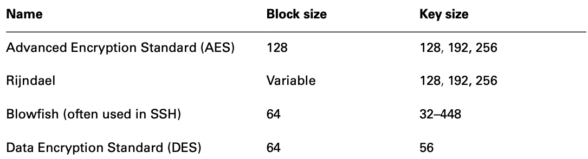
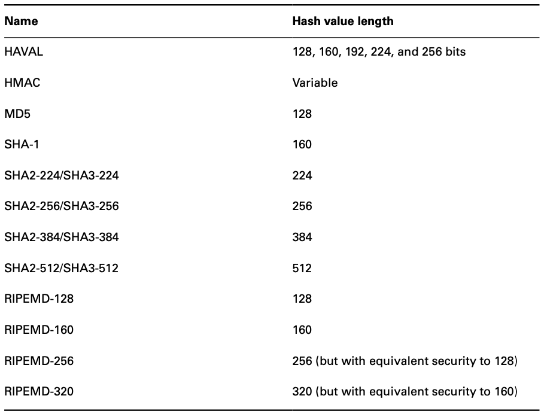

# 安全工程

{: .no_toc}

## 目录

{: .no_toc .text-delta }

1. TOC
{:toc}

## 密码学

### 密码学目标

- 保密性：加密，对称加密和非对称加密
- 完整性：数字签名（digital signature），使用校验确保加密的数据没有被修改
- 身份认证：如果双方具备同一个密钥，则这时候通过密钥加密同一个数据就可以进行身份验证
- 不可否认：可防止欺骗，**只有公钥和非对称加密才可以实现**

### 密码学一些基础概念

- 密码术：创建和执行密码代码和密码技术

- 密码分析：研究如何打败代码和密码
- 密码学：密码术+密码分析
- 密码系统：密码代码具体的实现，可以是硬件或软件

- 单向函数：从输入变成输出后，无法利用输出恢复成输入的内容。公钥基于单向函数
- nonce（随机数）：通过加入随机数的方式加强加密强度。最常见的 nonce 是 IV（初始向量），当同一文件使用同一密码加密时，IV 可以使得每次的密文都不一样
- 分割知识：保证权限分散在多个人手里
  - 密钥托管：密码交给第三方保存，当满足一些条件时，第三方可以用密钥来恢复数据
  - N 之 M 控制：密钥分散在多个人手里，只有 M 个人到齐时才能解密
- 代价函数（Work function）：破解一个密码系统需要付出的努力

### 密码类型

- 移位密码（transposition cipher）：通过重新排列将明文变为密文
- 替换密码（substitution cipher）：使用某些字母替换另外的字母实现，又称凯撒密码
- 单次密本（one-time pad，也叫 vernam 密码）
  - 实施得当时**最安全**
  - 加密密钥等于被加密数据的长度，每个密钥元素只给消息的一个字符编码
  - 加密密钥随机生成
  - 每个单词密本只使用一次
  - 单次密本需要在物理保护下严防泄露
- 运动密钥密码（running key cipher）：前面三种的密钥都是手动定义的，运动的则是参照共有的东西，比如书，随机从某段选取使用
- 块密码：在消息块上执行运算，在同一时间对整个消息执行加密算法。**大多数现代加密算法都使用块密码**
- 流密码：凯撒密码和单次密本都属于此类

### 密码学两种基本运算

- 混淆：明文和密钥之间的关系尽可能复杂，很难通过改动明文来确定对应的密钥
- 扩散：明文和密文的关系尽量复杂，明文改动一位会影响多位密文（比如哈希）

## 对称密钥算法

对称加密优点：

- 用户只需记忆一个密钥就可以加解密
- 效率高速度快，可以给海量数据加密

对称加密缺点：

- 密钥交换可能存在安全风险
- **不提供不可否认性**
- 缺乏大规模支持，如果多人交互数据，则密钥数会非常多
- 必须经常更换：如果人员有变化，则密钥也需要进行变化

多人时的密钥，总的密钥数可以用（N*(N-1)）/2 来计算，比如 6 个人，总共需要 15 个密钥。

### 密码运行模式

密码运行模式指密码算法为实现抵御攻击，采用的转换数据的不同方式：

无法保证数据真实性：

- ECB 电子密码本：不安全
- CBC 密码块链接模式：每个数据块的加密都要借助上个加密块的 XOR 运算。**会出现错误传播问题**，如果一个块出现问题，后续的块都无法恢复。
- CFB 密码反馈：CBC 模式的流密码版本
- OFC 输出反馈模式
- CTR 计数器模式

具备加密和数据真实性（完整性）保证：

- **GCM（Galois 计数器模式）**：采用了 CTR 加密模式，并添加了数据真实性控制，可确保接收方收到数据的**完整性**
- CCM（带密码块链接消息验证码的计数器模式）
  - **C**ounter with **C**ipher Block Chaining Message Authentication Code **M**ode
  - 结合了 CTR（用于真实性检查）+CBC-MAC（用于数据验证）
  - 仅有在 128-bit block 长度时使用，需要使用 nonce ，而且每次 nonce 需要变化 

### DES - 废弃

- 使用 56 位长的密钥
- 针对 64 位的块进行加密

### 3DES - 不安全

- 3DES 有很多变体
- DES-EEE3 被 NIST 认为是唯一安全的，理论上有 168 位有效密钥长度

### blowfish

- 密钥长度 32~448 位
- 使用不需要许可证，比 DES 安全，速度快

### skipjack

- 80 位密钥

### IDEA

- 以前有专利限制，现在可以随便使用
- 被 PGP 使用
- 128 位 密钥长度

### RC4 - 不安全

- 被集成在 WEP、WAP 和 SSL 中，使用广泛

### RC5

- 块大小可变，32、64、128
- 密钥长度：0~2040

### RC6 - 不常使用

- 128 位块大小
- 128、192、256 位密钥

### AES 标准 - 目前最安全

AES **Advanced Encryption Standard**，高级加密标准，美国从众多算法中选出 Rijndael 作为 DES 的替代，强制规定美国政府使用此算法加密。

AES**默认 128 bit 的块大小**

**块大小可变，等于使用密钥的长度。**

有三种密钥长度：

- 128：10 轮加密
- 192：12 轮加密
- 256：14 轮加密

## 对称密钥管理/交换

### 密钥交换

对称密钥机制下的密钥管理非常重要，有下列三种方式：

- 线下分发：技术简单，但物理上不方便，而且存在物理上被偷盗的可能性
- 公钥加密：通过公钥加密密码发给对方
- Diffe-Hellman：前两者不能满足需求时，**DH 可以简单安全地传递密钥**。

### 密钥托管

价值：让密钥属于机构，而非个人，在个人离职后，企业可以正常解密数据。

- 公平密码系统：密钥均分成几份，交给多个第三方托管
- 通过 N 之 M 控制防止串通

## 非对称加密算法

优点：

- 添加新用户时只需要生成一个公钥-私钥对，密钥数量少
- 移除系统比较简单，只需要移除相关用户的密钥
- 公钥可以随意公开，私钥保持保密
- 不能从公钥推算出私钥
- 具备不可否认性（数字签名）

### RSA

- 三个创始人名称命名，1977 年创立
- 目前比较流行
- 密钥长度相对比较长，有 1024（等同于 EC2 160bit）、2048（等同于 EC2 210bit）、3072

### ECC

- **效率高**
- 160bit 长度 = RSA 1024
- 210bit 长度= RSA 2048
- 256bit 长度 = RSA 3072

### Diffe-Hellman 密钥交换

- 两个人可以生成一个相互知晓，但是不需要经过网络传递的共享密钥
- DH 常用来给传输层 TLS 协商共享密钥
- ECDHE 是 DH 的表中，使用椭圆曲线问题来执行类似的密钥协商

### 量子计算及 QKD

- 量子计算机还未商用，如果商用，可能对当前的 RSA 和 DH 造成威胁，使得这两个算法不再安全
- 量子密钥分发 QKD，基于量子计算机的密钥分发算法，类似 DH，还未到实用的阶段

## 哈希算法（散列函数）

又称消息摘要（Message digests），由哈希算法生成的内容归档（文件校验）。

多数情况下，消息摘要长度是 128 位或更长。

RSA 定义的哈希函数有 5 个基本要求：

- 输入任意长度
- 输出固定长度
- 计算哈希比较容易
- 单向函数，难以根据输出反推出输入
- 避免碰撞，几乎找不到可以产生一样哈希结果的消息（MD5 存在碰撞问题）

### SHA

- SHA-1 已经终止服务
- NIST 定义的 SHA-2 标准有四个变体：
  - SHA-256，利用 512bit 块大小生成 256 位的消息摘要
  - SHA-224：SHA-256 缩减版，生成 256 位消息摘要
  - SHA-512：利用 1024bit 块大小生成 512 位的消息摘要
  - SHA-384：SHA-512 缩减版，生成 384 位的消息摘要
- SHA-3 尚未商用，速度比 SHA-2 慢，**使用 Keccak 算法**

### MD5

- 使用 512bit 块大小生成 128 位的消息摘要
- 存在碰撞问题

### HAVAL

- MD5 的修订版
- 使用 1024 块，产生 128、160、192、224、256 位哈希

### RIPEMD

RIPE 消息摘要，用于替换 SHA，目前应用在加密货币中。

- 生成 128 位摘要，存在一些结构化缺陷，**被认为不安全**
- RIPEMD-128 ，升级版，也被认为不安全
- RIPEMD-160，最新版，**安全**
- 有两个变种，256 和 320，**安全性等同于 128 和 160**

### 数字签名

- 数字签名可以保证消息的完整性和不可否认性，可以避免信息被篡改
- 数字签名原理：计算数据的哈希，然后**将哈希通过自己的私钥加密**，即形成数字签名（数字签名=加密的哈希）

#### HMAC - 一种中间安全性的签名方法

HMAC：基于哈希的消息身份认证码 hashed message authentication code

- HMAC 通过共享密钥来执行签名，即生成哈希后，通过秘钥保护哈希，对方使用共享密钥解密，再校验收到的数据，查看数据是否完整

- HMAC **可以提供完整性保障，但是不能提供不可否认性**，所以使用上有些局限。他介于**不加密**和**使用公钥加密**之间

#### 数字签名标准

NIST FIPS 186-4（DSS）数字签名标准规定，所有数字签名算法需要使用 SHA-3 哈希函数。

DSS 也规定了可用于支持数字签名的几种加密算法（非对称加密）：

- DSA（Digital Signature Algorithm）
- RSA
- ECDSA：椭圆曲线 DSA

### 各种算法的比较

## PKI - 公钥基础设施

Public Key Infrastructure

### 数字证书

证书用来向通信的双方保证对方的身份，证书实际上等于公钥的签名（即 CA 通过自己的私钥给对方的公钥签名）。

证书中包含的数据（X.509 标准）：

- 序号
- 签名算法标识符
- 签发者名称（例如 Let's Encrypt）
- 有效期
- 主体名称（Subject‘s Name：Common Name、Distinguished Name）
- 主体公钥
- 证书目的
  - Computers/machines
  - Individual users
  - Email addresses
  - Developers

### 证书签发机构 CA

Certificate Authority

一些公认的权威机构。比如：

- Symantec（出售给了 DigiCert）
- IdenTrust
- Amazon Web Services GlobalSign
- GoDaddy
- DigiCert
- Trustwave

#### RA - 注册机构

Registration Authority ，分担 CA 签发数字证书前**验证用户身份**的工作。

#### 证书链

通常根 CA 不会直接去签发证书，而是使用中间 CA 签发。

根 CA 会将自己的私钥**离线保存**，私钥用于签发中间 CA。

### 证书生命周期管理

#### 注册

- 获得证书前，需要先证实自己的身份，这个过程称为注册（enrollment）
- 生成证书申请 CSR（certificate signing request），向 CA 提供公钥
- CA 使用自己的私钥为 Client 的公钥签名，CA 根据自己的身份认证级别签发不同类型的证书：
  - DV 域名验证 Domain Validation
  - EV 扩展验证 Extended Validation

#### 验证

- Client 访问 Server 时验证 Server 的证书，此时会用 CA 的公钥（通常内置在浏览器中）来验证服务器提供的证书的数字签名。
- 验证有效期
- 对照证书注销列表（CRL，Certificate Revocation List）、在线证书状态协议（**OCSP**，Online Certificate Status Protocol）

**证书固定法（Certificate Pinning）**：让浏览器为一个网站**绑定某个证书**（在有效期内长期绑定）。这样当网站证书发生变化时，用户可以注意到。

#### 注销

反证机关有些时候需要吊销证书：

- 证书失信，比如证书私钥被泄露
- 证书误发，比如 CA 未经过适当的验证签发了证书
- 证书细节更改，比如 CN 发生了变化
- 安全关联变更，比如申请证书的对象已经不存在（比如以前用的某人的邮箱）

##### 证书注销列表 CRL

一个证书注销列表，需要 Client 定期获取最新的，**可能存在滞后期**。

##### 在线证书状态协议 OCSP

提供**实时的**证书验证渠道。客户端收到证书后，向 OCSP 服务器发送 OCSP 请求，服务器把证书的有效状态告诉 Client。

##### 证书装订（Certificate Stapling）

Web 服务器负责和 OCSP 连接，在给 Client 发送证书时同时将 OSCP 的回应发给客户。Client 无需可 OCSP 连接。

### 证书的格式

- 二进制格式 DER（Distinguished Encoding Rules），通常使用 .der ，.crt 或 .cer 后缀 
- 文本格式 PEM（Privacy  Enhanced Mail），通常使用 .pem 或 .crt 后缀
- Windows 的二进制格式 PFX （Personal Information Exchange），通常使用 .pfx 或 .p12 后缀
- Windows 的 P7B 证书，ASCII 格式，使用 .p7b 后缀

## 加密的应用

### 便携设备硬盘加密

- Windows BitLocker、EFS（Encrypting File System）
- Mac FileVault
- 跨平台 VeraCrypt

#### 可信平台模块 TPM

Trusted Platform Module，计算机上一个专用的芯片，可以保存和管理用于全盘加密的密钥。TPM 只有在验证用户身份后才向操作系统提供密钥访问权。

可以防止有人把硬盘拿到其他设备上访问数据。

### 电子邮件安全

重要邮件需要加密、同时签名。

#### PGP

- 商业版本 Symantec 提供
  - 使用 RSA 进行密钥交换，用 IDEA 进行加解密，用 MD5 生成哈希
- 开源版本 OpenPGP
  - 使用 DH 进行密钥交换，使用 CAST 128bit 进行加解密，使用 SHA-1 生成哈希

#### S/MIME

- **加密电子邮件的标准**
- 使用 RSA 算法，通过 X.509 证书交换密钥
- 支持 AES、3DES 加密算法
- 缺点：主流的 Web 邮件系统不支持此协议，需要浏览器插件

### Web 应用安全

#### Transport Layer Security (TLS)

- TLS 1.2 + 1.3 是目前认为安全的

- TLS 由一系列密码套件组成：

  - RSA、DH 和 ECDH 用于密钥交换
  - RSA、DSA、ECDSA 用于身份验证
  - AES、3DES 用于对称加密
  - SHA 的不同长度用于哈希

密码套件示例：TLS_DH_RSA_WITH_AES_256_CBC_SHA384

- DH 密钥交换
- RSA 身份认证
- AES CBC 执行批量加密
- SHA-384 用于哈希

### 隐写术

iSteg，将消息隐藏在图片或音频中。

### 传输加密

- SSH：使用 DH 进行密钥加密
- IPsec VPN

### 轻量级加密

针对移动设备、或者智能卡等低功耗设备，使用硬件加速完成加解密。

### 同态加密

Homomorphic encryption

有时候为了保密需要加密个人信息，但有时候又需要使用个人信息来进行运算。

此时可以使用**同态加密**加密数据，然后使用加密后的数据进行运算，运算出来的结果解密后和明文计算的结果会一致。

相当于可以直接对加密数据进行计算。

## 密码相关的攻击

- **暴力攻击：口令猜解，使用计算能力强的计算机进行破解**
  - 密钥长度每增加一位，破解难度会增加一倍
- 重放：常用于身份伪造，有多种防御方式：
  - 对临时秘钥进行加密
  - 采用挑战-应答机制
  - 为每个会话添加时间戳和超时时间
- 分析攻击：分析算法本身的漏洞
- 实现攻击：找出密码系统在实现过程中的漏洞，也就是加密软件的漏洞
- 故障注入攻击：使用高压电等破坏设备
- **边信道攻击（旁路攻击）：收集处理器的利用率、功耗、电磁辐射等变化发现与加密相关的信息**
  - 计时攻击：边信道攻击的一种形式，利用加密时间来推算加密相关的信息
- **频率分析**和唯密文攻击（ciphertext-only attack）：攻击者只有加密后的密文，英文中常用的字母是 ETAOIN，使用使用频率才猜测加密方式，比如是移位密码还是换位密码
- 已知明文：知道明文和其加密后的结果，猜测加密方式。对于凯撒密码，这种方式很容易攻破
- 部分明文：知道密文对应的部分明文，使用这个明文分析加密方式
- 部分密文（chosen ciphertext）：知道部分密文解密后的明文，使用这个发现加密密钥
- 中间相遇（Meet in the middle）：攻击两轮加密的密码，例如 2DES
- 中间人攻击：介于 Client 和 Server 之间，截获双方的消息
- 碰撞攻击（生日攻击）

