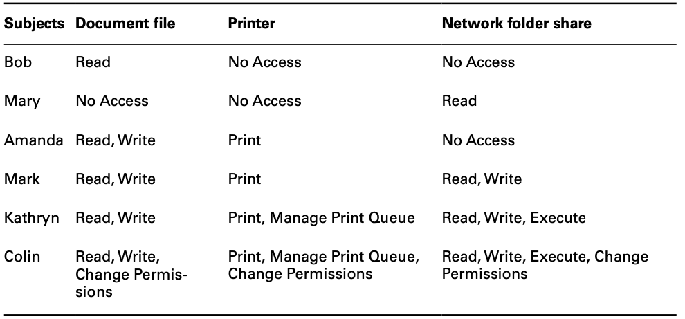
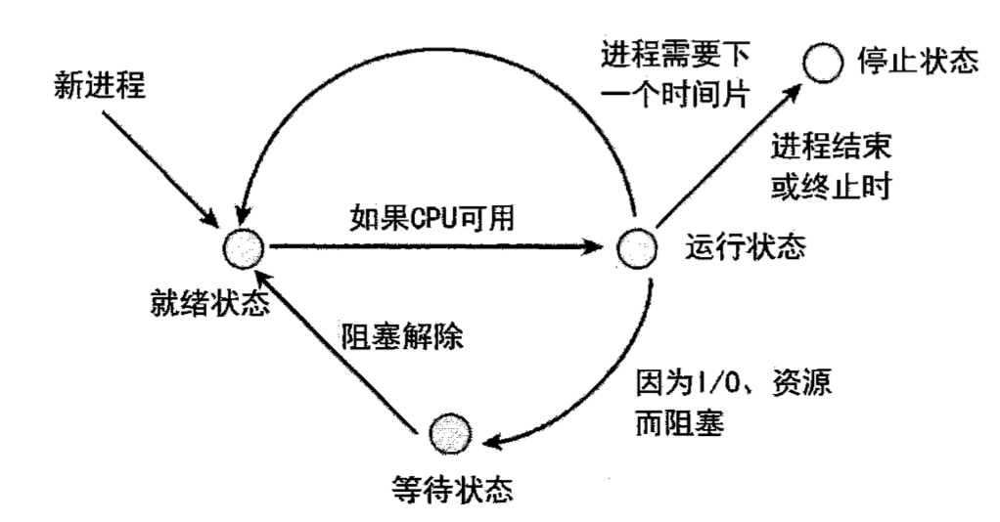
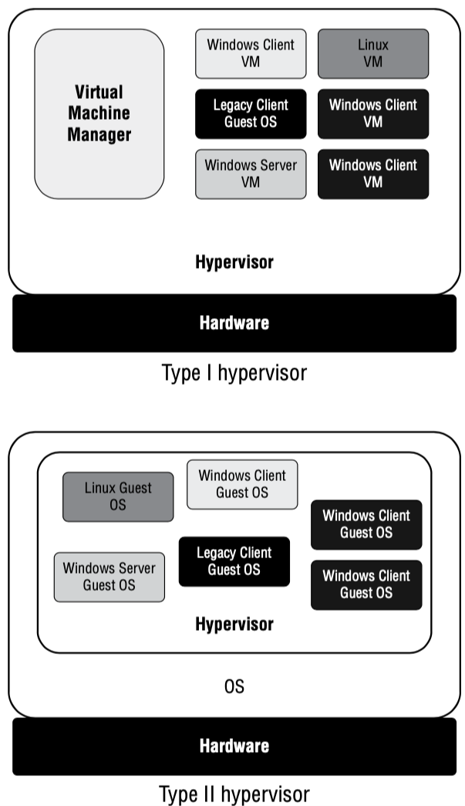

# D3 安全工程

{: .no_toc}

## 目录

{: .no_toc .text-delta }

1. TOC
{:toc}

## 密码学

### 密码学目标

- 保密性：加密，对称加密和非对称加密
- 完整性：数字签名（digital signature），使用校验确保加密的数据没有被修改
- 身份认证：如果双方具备同一个密钥，则这时候通过密钥加密同一个数据就可以进行身份验证
- 不可否认：可防止欺骗，**只有公钥和非对称加密才可以实现**

### 密码学一些基础概念

- 密码术：创建和执行密码代码和密码技术

- 密码分析：研究如何打败代码和密码
- 密码学：密码术+密码分析
- 密码系统：密码代码具体的实现，可以是硬件或软件

- 单向函数：从输入变成输出后，无法利用输出恢复成输入的内容。公钥基于单向函数
- nonce（随机数）：通过加入随机数的方式加强加密强度。最常见的 nonce 是 IV（初始向量），当同一文件使用同一密码加密时，IV 可以使得每次的密文都不一样
- **零知识证明**：要向第三方证明一件事，但是不能给第三方提供密码信息，此时可以通过数学运算，如离散对数和图论，来证明自己掌握某项东西
- 分割知识：保证权限分散在多个人手里
  - 密钥托管：密码交给第三方保存，当满足一些条件时，第三方可以用密钥来恢复数据
  - N 之 M 控制：密钥分散在多个人手里，只有 M 个人到齐时才能解密
- 代价函数（Work function）：破解一个密码系统需要付出的努力

### 逻辑运算

- 与：两个值都为 1 时，结果为 1，其余结果为 0
- 或：任意一个值为 1 时，结果为 1，其余结果为 0
- 非：一个值的颠倒值
- 异或：两个值一样时（比如 00 和 11），结果为 0，两个值不一样时，结果为 1

### 密码类型

- 移位密码（transposition cipher）：通过重新排列将明文变为密文
- 替换密码（substitution cipher）：使用某些字母替换另外的字母实现，又称**凯撒密码**
- 单次密本（one-time pad，也叫 vernam 密码）
  - 实施得当时**最安全**
  - 加密密钥等于被加密数据的长度，每个密钥元素只给消息的一个字符编码
  - 加密密钥随机生成
  - 每个单词密本只使用一次
  - 单次密本需要在物理保护下严防泄露
- 运动密钥密码（running key cipher）：前面三种的密钥都是手动定义的，运动的则是参照共有的东西，比如书，随机从某段选取使用
- 块密码：在消息块上执行运算，在同一时间对整个消息执行加密算法。**大多数现代加密算法都使用块密码**
- 流密码：凯撒密码和单次密本都属于此类

### 密码学两种基本运算

- 混淆：明文和密钥之间的关系尽可能复杂，很难通过改动明文来确定对应的密钥
- 扩散：明文和密文的关系尽量复杂，明文改动一位会影响多位密文（比如哈希）

### Kerckhoff 原则

科克霍夫原则：只要密钥不被别人掌握，即使关于密码系统的一切都是公开的，密码系统也应该安全。

## 对称密钥算法

对称加密优点：

- 用户只需记忆一个密钥就可以加解密
- 效率高速度快，可以给海量数据加密

对称加密缺点：

- 密钥交换可能存在安全风险
- **不提供不可否认性**
- 缺乏大规模支持，如果多人交互数据，则密钥数会非常多
- 必须经常更换：如果人员有变化，则密钥也需要进行变化

多人时的密钥，总的密钥数可以用（N*(N-1)）/2 来计算，比如 6 个人，总共需要 15 个密钥。

### 密码运行模式

密码运行模式指密码算法为实现抵御攻击，采用的转换数据的不同方式：

无法保证数据真实性：

- ECB 电子密码本：不安全
- CBC 密码块链接模式：每个数据块的加密都要借助上个加密块的 XOR 运算。**会出现错误传播问题**，如果一个块出现问题，后续的块都无法恢复。
- CFB 密码反馈：CBC 模式的流密码版本
- OFC 输出反馈模式
- CTR 计数器模式

具备加密和数据真实性（完整性）保证：

- **GCM（Galois 计数器模式）**：采用了 CTR 加密模式，并添加了数据真实性控制，可确保接收方收到数据的**完整性**
- CCM（带密码块链接消息验证码的计数器模式）
  - **C**ounter with **C**ipher Block Chaining Message Authentication Code **M**ode
  - 结合了 CTR（用于真实性检查）+CBC-MAC（用于数据验证）
  - 仅有在 128-bit block 长度时使用，需要使用 nonce ，而且每次 nonce 需要变化 

### DES 数据加密标准 - 废弃

- **使用 56 位长的密钥**
- 针对 64 位的块进行加密

### 2DES - 会受到中间相遇攻击

### 3DES - 不能满足现代要求

- 3DES 有很多变体
- DES-EEE3 被 NIST 认为是唯一安全的，理论上有 **168 位有效密钥长度**

### blowfish

- 密钥长度 32~448 位
- 使用不需要许可证，比 DES 安全，速度快

### skipjack

- 80 位密钥

### IDEA 国际数据加密算法 

- 以前有专利限制，现在可以随便使用
- 被 PGP 使用
- 128 位 密钥长度

### RC4 - 不安全

- 被集成在 WEP、WAP 和 SSL 中，使用广泛

### RC5

- 块大小可变，32、64、128
- 密钥长度：0~2040

### RC6 - 不常使用

- 128 位块大小
- 128、192、256 位密钥

### AES 标准 - 目前最安全

AES **Advanced Encryption Standard**，高级加密标准，美国从众多算法中选出 Rijndael 作为 DES 的替代，强制规定美国政府使用此算法加密。

AES**默认 128 bit 的块大小，块大小可变，等于使用密钥的长度。**

有三种密钥长度：

- 128：10 轮加密
- 192：12 轮加密
- 256：14 轮加密

## 对称密钥管理/交换

### 密钥交换

对称密钥机制下的密钥管理非常重要，有下列三种方式：

- 线下分发：技术简单，但物理上不方便，而且存在物理上被偷盗的可能性
- 公钥加密：通过公钥加密密码发给对方
- Diffe-Hellman：前两者不能满足需求时，**DH 可以简单安全地传递密钥**。

### 密钥托管

价值：让密钥属于机构，而非个人，在个人离职后，企业可以正常解密数据。

- 公平密码系统：密钥均分成几份，交给多个第三方托管（至少两个机构）
- 通过 N 之 M 控制防止串通

## 非对称加密算法

优点：

- 添加新用户时只需要生成一个公钥-私钥对，密钥数量少
- 移除系统比较简单，只需要移除相关用户的密钥
- 公钥可以随意公开，私钥保持保密
- 不能从公钥推算出私钥
- 具备不可否认性（数字签名）

### RSA

- 三个创始人名称命名，1977 年创立
- 目前比较流行
- 密钥长度相对比较长，有 1024（等同于 EC2 160bit）、2048（等同于 EC2 210bit）、3072

### ECC

- **效率高**
- 160bit 长度 = RSA 1024
- 210bit 长度= RSA 2048
- 256bit 长度 = RSA 3072

### Diffe-Hellman 密钥交换

- 两个人可以生成一个相互知晓，但是不需要经过网络传递的共享密钥
- DH 常用来给传输层 TLS 协商共享密钥
- ECDHE 是 DH 的表中，使用椭圆曲线问题来执行类似的密钥协商

### 量子计算及 QKD

- 量子计算机还未商用，如果商用，可能对当前的 RSA 和 DH 造成威胁，使得这两个算法不再安全
- 量子密钥分发 QKD，基于量子计算机的密钥分发算法，类似 DH，还未到实用的阶段

## 哈希算法（散列函数）

又称消息摘要（Message digests），由哈希算法生成的内容归档（文件校验）。

多数情况下，消息摘要长度是 128 位或更长。

RSA 定义的哈希函数有 5 个基本要求：

- 输入任意长度
- 输出固定长度
- 计算哈希比较容易
- 单向函数，难以根据输出反推出输入
- 避免碰撞，几乎找不到可以产生一样哈希结果的消息（MD5 存在碰撞问题）

### SHA

- SHA-1 已经终止服务
- NIST 定义的 SHA-2 标准有四个变体：
  - SHA-256，利用 512bit 块大小生成 256 位的消息摘要
  - SHA-224：SHA-256 缩减版，生成 224 位消息摘要
  - SHA-512：利用 1024bit 块大小生成 512 位的消息摘要
  - SHA-384：SHA-512 缩减版，生成 384 位的消息摘要
- SHA-3 尚未商用，速度比 SHA-2 慢，**使用 Keccak 算法**

### MD5

- 使用 512bit 块大小生成 128 位的消息摘要
- 存在碰撞问题

### HAVAL

- MD5 的修订版
- 使用 1024 块，产生 128、160、192、224、256 位哈希

### RIPEMD

RIPE 消息摘要，用于替换 SHA，目前应用在加密货币中。

- 生成 128 位摘要，存在一些结构化缺陷，**被认为不安全**
- RIPEMD-128 ，升级版，也被认为不安全
- RIPEMD-160，最新版，**安全**
- 有两个变种，256 和 320，**安全性等同于 128 和 160**

### 数字签名

- 数字签名可以保证消息的完整性和不可否认性，可以避免信息被篡改
- 数字签名原理：计算数据的哈希，然后**将哈希通过自己的私钥加密**，即形成数字签名（数字签名=加密的哈希）

#### HMAC - 一种中间安全性的签名方法

HMAC：基于哈希的消息身份认证码 hashed message authentication code

- HMAC 通过共享密钥来执行签名，即生成哈希后，通过秘钥保护哈希，对方使用共享密钥解密，再校验收到的数据，查看数据是否完整

- HMAC **可以提供完整性保障，但是不能提供不可否认性**，所以使用上有些局限。他介于**不加密**和**使用公钥加密**之间

#### 数字签名标准

NIST FIPS 186-4（DSS）数字签名标准规定，所有数字签名算法需要使用 SHA-3 哈希函数。

DSS 也规定了可用于支持数字签名的几种加密算法（非对称加密）：

- DSA（Digital Signature Algorithm）
- RSA
- ECDSA：椭圆曲线 DSA

### 各种算法的比较

## PKI - 公钥基础设施

Public Key Infrastructure

### 数字证书

证书用来向通信的双方保证对方的身份，证书实际上等于公钥的签名（即 CA 通过自己的私钥给对方的公钥签名）。

证书中包含的数据（X.509 标准）：

- 序号
- 签名算法标识符
- 签发者名称（例如 Let's Encrypt）
- 有效期
- 主体名称（Subject‘s Name：Common Name、Distinguished Name）
- 主体公钥
- 证书目的
  - Computers/machines
  - Individual users
  - Email addresses
  - Developers

### 证书签发机构 CA

Certificate Authority

一些公认的权威机构。比如：

- Symantec（出售给了 DigiCert）
- IdenTrust
- Amazon Web Services GlobalSign
- GoDaddy
- DigiCert
- Trustwave

#### RA - 注册机构

Registration Authority ，分担 CA 签发数字证书前**验证用户身份**的工作。

#### 证书链

通常根 CA 不会直接去签发证书，而是使用中间 CA 签发。

根 CA 会将自己的私钥**离线保存**，私钥用于签发中间 CA。

### 证书生命周期管理

#### 注册

- 获得证书前，需要先证实自己的身份，这个过程称为注册（enrollment）
- 生成证书申请 CSR（certificate signing request），向 CA 提供公钥
- CA 使用自己的私钥为 Client 的公钥签名，CA 根据自己的身份认证级别签发不同类型的证书：
  - DV 域名验证 Domain Validation
  - EV 扩展验证 Extended Validation

#### 验证

- Client 访问 Server 时验证 Server 的证书，此时会用 CA 的公钥（通常内置在浏览器中）来验证服务器提供的证书的数字签名。
- 验证有效期
- 对照证书注销列表（CRL，Certificate Revocation List）、在线证书状态协议（**OCSP**，Online Certificate Status Protocol）

**证书固定法（Certificate Pinning）**：让浏览器为一个网站**绑定某个证书**（在有效期内长期绑定）。这样当网站证书发生变化时，用户可以注意到。

#### 注销

反证机关有些时候需要吊销证书：

- 证书失信，比如证书私钥被泄露
- 证书误发，比如 CA 未经过适当的验证签发了证书
- 证书细节更改，比如 CN 发生了变化
- 安全关联变更，比如申请证书的对象已经不存在（比如以前用的某人的邮箱）

##### 证书注销列表 CRL

一个证书注销列表，包含证书的**序列号**、注销的生效日期和时间。需要 Client 定期获取最新的，**可能存在滞后期**。

##### 在线证书状态协议 OCSP

提供**实时的**证书验证渠道。客户端收到证书后，向 OCSP 服务器发送 OCSP 请求，服务器把证书的有效状态告诉 Client。

##### 证书装订（Certificate Stapling）

Web 服务器负责和 OCSP 连接，在给 Client 发送证书时同时将 OSCP 的回应发给客户。Client 无需可 OCSP 连接。

### 证书的格式

- 二进制格式 DER（Distinguished Encoding Rules），通常使用 .der ，.crt 或 .cer 后缀 
- 文本格式 PEM（Privacy  Enhanced Mail），通常使用 .pem 或 .crt 后缀
- Windows 的二进制格式 PFX （Personal Information Exchange），通常使用 .pfx 或 .p12 后缀
- Windows 的 P7B 证书，ASCII 格式，使用 .p7b 后缀

## 加密的应用

### 便携设备硬盘加密

- Windows BitLocker、EFS（Encrypting File System）
- Mac FileVault
- 跨平台 VeraCrypt

#### 可信平台模块 TPM

Trusted Platform Module，计算机上一个专用的芯片，可以保存和管理用于全盘加密的密钥。TPM 只有在验证用户身份后才向操作系统提供密钥访问权。

可以防止有人把硬盘拿到其他设备上访问数据。

- HSM 硬件安全模块属于 TPM 的一种实现。HSM 是一种密码处理器，可用于存储密码、提升加密速度，支持数字签名和身份认证，具备防篡改功能，可以避免物理攻击

### 电子邮件安全

重要邮件需要加密、同时签名。

#### PGP

- 商业版本 Symantec 提供
  - 使用 RSA 进行密钥交换，用 IDEA 进行加解密，用 MD5 生成哈希
- 开源版本 OpenPGP
  - 使用 DH 进行密钥交换，使用 CAST 128bit 进行加解密，使用 SHA-1 生成哈希

#### S/MIME

- **加密电子邮件的标准**
- 使用 RSA 算法，通过 X.509 证书交换密钥
- 支持 AES、3DES 加密算法
- 缺点：主流的 Web 邮件系统不支持此协议，需要浏览器插件

### Web 应用安全

#### Transport Layer Security (TLS)

- TLS 1.2 + 1.3 是目前认为安全的

- TLS 由一系列密码套件组成：

  - RSA、DH 和 ECDH 用于密钥交换
  - RSA、DSA、ECDSA 用于身份验证
  - AES、3DES 用于对称加密
  - SHA 的不同长度用于哈希

密码套件示例：TLS_DH_RSA_WITH_AES_256_CBC_SHA384

- DH 密钥交换
- RSA 身份认证
- AES CBC 执行批量加密
- SHA-384 用于哈希

### 隐写术

iSteg，将消息隐藏在图片或音频中。

### 传输加密

- SSH：使用 DH 进行密钥加密
- IPsec VPN

### 轻量级加密

针对移动设备、或者智能卡等低功耗设备，使用硬件加速完成加解密。

### 同态加密

Homomorphic encryption

有时候为了保密需要加密个人信息，但有时候又需要使用个人信息来进行运算。

此时可以使用**同态加密**加密数据，然后使用加密后的数据进行运算，运算出来的结果解密后和明文计算的结果会一致。

相当于可以直接对加密数据进行计算。

## 密码相关的攻击

- **暴力攻击：口令猜解，使用计算能力强的计算机进行破解**
  - 密钥长度每增加一位，破解难度会增加一倍
  - 一般是连续的密码猜解，比如 aaa,aab,aac 这样的（而字典攻击使用常见的秘密，比如 12345, abcde, 0000 等，密码间无关联性）
- 重放：常用于身份伪造，有多种防御方式：
  - 对临时秘钥进行加密
  - 采用挑战-应答机制
  - 为每个会话添加时间戳和超时时间
- 分析攻击：分析算法本身的漏洞
- 实现攻击：找出密码系统在实现过程中的漏洞，也就是加密软件的漏洞
- 故障注入攻击：使用高压电等破坏设备
- **边信道攻击（旁路攻击）：收集处理器的利用率、功耗、电磁辐射等变化发现与加密相关的信息**
  - 计时攻击：边信道攻击的一种形式，利用加密时间来推算加密相关的信息
- **频率分析**和唯密文攻击（ciphertext-only attack）：攻击者只有加密后的密文，英文中常用的字母是 ETAOIN，使用使用频率来猜测加密方式，比如猜测是移位密码还是换位密码
- 已知明文：知道明文和其加密后的结果，猜测加密方式。对于凯撒密码，这种方式很容易攻破
- 部分明文：知道密文对应的部分明文，使用这个明文分析加密方式
- 部分密文（chosen ciphertext）：知道部分密文解密后的明文，使用这个发现加密密钥
- 中间相遇（Meet in the middle）：攻击两轮加密的密码，例如 2DES
- 中间人攻击：介于 Client 和 Server 之间，截获双方的消息
- 碰撞攻击（生日攻击）

## 安全设计的一些概念

### 主体和客体

- 主体：访问对象
- 客体：被访问对象

### 开放系统与封闭系统

- 封闭系统：只与小范围的其他系统一起工作
- 开放系统：使用标准的协议，可以互通，比如 Linux、Win 可以通过 LAN 互联起来
  - 开放系统的安全性取决于**安全和防御规范**
  - 也需要**深度防御**

### 系统的默认配置并不安全

系统的默认配置是为了**减少安装出现的问题**，并不会考虑安全。

不应该信任系统的默认配置。

### Fail-secure

应用应该具备 Fail-safe 或 Fail-secure，比如 Windows 蓝屏。

在开发层面，可以使用 "try...catch" 替换 "if...then...else"。

在不同语境下，Fail-safe 和 Fail-open 表示的含义不一样：

- Fail-open 失效打开：保护人（而非资产）、保持系统的可用性（比如防火墙全通）
- Fail-safe 失效保障：保护人（而非资产）、保持系统机密性和完整性但是失去可用性
- Fail-closed 失效关闭：保护资产（而非人）、保持系统机密性和完整性但是失去可用性
- Fail-secure 失效安全：保护资产（而非人）、保持系统机密性和完整性但是失去可用性

### 零信任

永不信任，始终验证。使用”假设违规“的原则，即认为任何访问都可能是恶意的，在放行访问之前需要做完整的身份认证和授权。

零信任的实现：

- 内部分段防火墙 ISFW
- 多因子身份认证 MFA
- 身份和管理系统 IAM
- 下一代端点安全

**NIST SP 800-207 零信任架构**

零信任三个原则：

- 不应该区分网络位置
- 所有的访问控制都应该是最小权限并严格限制
- 所有的访问都应当被记录和跟踪

### 通过设计保护隐私 PbD

Privacy by Design，在产品设计早期就把隐私保护机制集成到产品之中，而不是在之后添加。

PbD 七项原则：

- 主动而非被动，预防而非修补
- 以默认方式保护隐私
- 隐私嵌入设计中
- 全功能-正和（Positive-sum=双赢），而非零和（zero-sum=要么这个/要么那个)
- 端到端安全-全生命周期保护
- 可视化和透明性
- 尊重用户隐私

## 可确保 CIA 的技术

### 限定 - 限制可以干的事

confinement

- 限制软件的动作。比如让某些软件只能读取磁盘

- **沙箱**：对软件执行最小特权原则
- 防止数据泄露给未经授权的程序、用户或系统

### 界限 - 限制可访问的范围

bounds

- 比如操作系统可以定义软件只能访问某些内存，进程之间隔离

### 隔离

- 不同进程之间隔离，进程只能影响与之相关的内存和资源

### 访问控制

### 信任与保证 - 可信系统

- 可信系统（Trusted System）：系统设计之初考虑到安全性，有安全控制机制，问题不会在事后出现
- 信任：安全机制、功能的体现
- 保证：系统部署的时候是安全的，也要**保证运行的时候是安全的**。**保证必须持续更新、反复验证**

## 安全模型的基本概念

### TCB 可信计算基

Trusted Computing Base

设计原则：硬件、软件和控制的集合体，协同工作， 构成执行安全策略的可信根基。

#### 安全边界

- 安全边界是一个假象的边界，将 TCB 与系统其余部分分开
- TCP 与其余部分通信时需要使用可信路径（Trusted path，或 Secure channel）
- 可信核（Trusted Shell），使主体在不给 TCB 带来风险的情况下执行命令
- 参考监视器：**reference monitor，TCB 的访问控制模块**，负责在授权访问之前验证对每个资源的访问的部分。
- 用于**执行参考监视器**的组件的集合叫**安全内核**
  - 安全内核协调对资源的所有访问请求

*可信路径和可信信道：可信路径可以防止登录欺骗，可信信道使用加密可以防止中间人攻击*

### 橘皮书 TCSEC

- 由 NSA 发布，有 A B C D 四个等级
- D 最低保护，或者**欠缺保护**
- C 自定式保护，系统可以自己决定某些文件的权限，Linux、Windows 属于 C
  - C1，自主安全保护
  - C2，受控存取保护，**比上面的颗粒度更细**
- B 强制式保护
  - B1，标记安全保护
  - B2，结构化保护
  - B3，安全域级
- A 可验证保护

### Bell-LaPadula 模型（BLP）

美国国防部于 176x 提出的模型。高级别的主体可以访问低级别客体的资源，但是也要遵循**因需而知**。

建立在**基于格子的 MAC**、以及**状态机概念**和**信息流模型**上。

**关注机密性**。

**不上读，不下写**：主体不能读高敏感度的信息，主体不可以把信息写在低敏感度级别的客体。

此状态机有三种基本属性：

- **简单安全属性（不上读）**：主体不可读取更高敏感级别的信息
- **\* 安全属性（不下写）**：主体不可把信息写入低敏感级别的客体
- **自主安全属性：系统通过**一个访问控制矩阵执行自主访问控制

### Biba 模型

在 Bell-LaPadula 模型之后被设计。**关注完整性**。

Biba 建立在**状态机概念上**，**基于信息流**，而且是一个多级模型。

**不下读，不上写**：主体不能读低完整性的客体，主体不能修改高完整性的对象。

示例：**Biba 不允许将未经验证的数据写入经过验证的文档。**

Biba模型的属性：

- **简单完整性属性（不下读）**：主体不能读低完整性的客体
- **\* 完整性属性（不上写）**：主体不能修改高完整性的对象

Biba 在设计上解决了三个完整性问题：

- 防止**未经授权**的主体修改客体
- 防止授权的主体**未授权**的修改操作
- 保护内部和外部客体的一致性

### Clark-Wilson 模型

**关注完整性。**可以实现职责分离，只让主体只访问授权的一部分客体内容。

**API 接口属于这种类型。**

使用三元组（访问控制三元组 Access Control Triplet）来进行控制，**主体必须经过程序才能访问客体，无法直接访问客体**。

- 主体
- 软件
- 客体

Clark-Wilson 的数据项和流程：

- 受约束数据项 CDI（constrained data item）：完整性受保护的任何数据
- 不受约束数据项 UDI（unconstrained data item）：不受完整性保护的数据。**任何输入的未经过验证的数据都属于 UDI。**
- 完整性验证流程 IVP（integrity verification procedure）：扫描数据并验证其完整性的过程
- **转换流程 TP（transformation procedure）：允许修改 CDI 的唯一流程**

### Brew and Nash 中国墙模型

- Chinese Wall 模型应用在存在**利益冲突**的组织中。比如 A 公司同时为 B 和 C 服务，而 B 和 C 是竞争公司。此时 A 只能访问其中一家的数据
- Chinese Wall 模型基于 **信息流模型** ，其安全策略的基础是客户访问的信息不会与目前他们先前支配的信息产生冲突。 
- Chinese Wall 安全模型的两个主要属性： 

- - 用户必须**选择一个**他可以访问的区域 
  - 用户必须**自动拒绝**来自其它与用户所选区域的利益冲突区域的访问

### 访问控制矩阵

由主体（第一列）和客体（第一行）和权限组成的矩阵，表示主体对每种客体的访问权限。

- 图中的每一行都表示**能力表**，标识主体可以对哪些客体做什么操作（权限）
- 图中每一列都是一个 ACL 访问控制列表，可以看有哪些主体能访问该客体，以及有什么权限

### 其他模型

#### 状态机模型

无论什么时候都始终安全的系统。

#### 信息流模型

专注于**控制信息的流动，基于状态机模型**。
  - 可以在不同安全级别之间防止未经授权的访问，比如 MAC 常用这个模型
  - 信息流模型可以通过排除所有非定义的信息流动路径来解决隐蔽信道

#### 无干扰模型

大致基于信息流模型，关注的是较高安全级别的系统对较低安全级别系统的影响。

- 一种防止木马、后门、rootkit 等的保护手段

#### 获取-授予模型

有点类似于操作系统的 DAC。

- 获取：被动继承过来的权限
- 授予：主动给别人权限

获取-授予模型基本上有 4 条规则：

- 获取规则:允许主体获取客体的权限
- 授予规则:允许主体向客体授予权限
- 创建规则:允许主体创建新权限
- 移除规则:允许主体移除自己拥有的权限

## 信息系统安全评估模型（对采购的系统进行认证）

### CC 通用准则

Common Criteria，定义了测试和确认系统安全能力的各种级别。

**对应的国际标准为 ISO/IEC 15408**

通用准则的目标：

- 提升购买者对已购 IT 产品的安全性的信心
- 减少系统重认证
- 提升安全评估的效率和效果
- 保证 IT 产品的评估符合一致的高标准
- 推广评估斌提高已评估 IT 产品的可用性
- 受评估对象（TOE Target of evaluation）的功能（functionality）和可信程度（assurance）

CC 的两个要素：

- PP（Protection Profile 保护轮廓）：**客户期望的 TOE 具备的安全要求**，比如要满足 XX 行业标准等
- ST（Security targets 安全目标）：**厂商声称的 TOE 将具备的安全特性**，除了 ST 外，可能产品还会有其他额外的安全特性

**客户购买的一般是 PP 和 ST 最接近的产品。**

定义了 7 个评估保证级别(EAL)，每一级均需评估相关安全功能类。

- EAL1 功能检测
- EAL2 结构测试
- EAL3 系统性测试和检查
- EAL4 系统性设计、测试、审查
- EAL5 半正式设计、测试
- EAL6 半正式验证、设计、测试
- EAL7 正式验证、设计和测试

CC 的问题：

- 不能保证用户对数据的操作也是安全的
- 不涉及管理问题（管理也属于安全的范畴）
- 不包含现场安全评估，不会涉及人员、与组织相关的特定的元素
- 不涉及电磁辐射等的控制
- 没有对加密算法强度的要求

## 操作授权 ATO

Authorization to Operate，取代以前说的**认可**这个词。

授权官员的关键词：**DAA（被指定的批准机构），AA（批准机构），SCA（安全控制评估员）**

- 操作授权=**正式授权可以把具有安全保证的产品投入使用，执行业务任务并接受已识别风险**

- 操作授权一般 5 年期，出现下列情况后需要重新申请：
  - 期限到期
  - 系统发生严重的安全事件
  - 系统发生重大安全变化
- 发生事故后的四种授权决定：
  - 操作授权：风险可控
  - 通用控制授权：继承下来的权限，父已经是 AOT
  - 使用授权：第三方 IT 系统认为自己风险可控，领导接受风险
  - 拒绝授权：风险不可接受

### 认证与认可（以前的说法）

在后面第八章 SDLC 中也会涉及：

- 认证：评定安全机制正常运作，确保满足安全需求以及安全合规性

- 认可：管理层接受认证过程中的调查结果，接受风险，系统可以上线

## 计算机系统中的安全保护

### CPU 保护

保护环：

- 把操作系统中的代码放在如箭靶一样的环中，离中心（0 环）越近，则该代码的优先级越高
- 现代 CPU 有 0~3 四个环
- 0 环：运行 Kernel
- 1 环：除 Kernel 之外的其他操作系统部分
- 2 环：I/O 驱动、协议等存在的地方
- 3 环：其他应用使用的。
- **0~2 工作在内核模式（或特权模式），3 工作在用户模式（User mode）**

进程状态：

- 就绪 Ready：程序准备好，但是 **CPU 不可用**
- 运行 Running：正在运行
- 等待 Wait：进程因为 I/O 等待而**阻塞**
- 停止 Stopped：运行结束

CPU 执行类型：

- 多任务处理（multitasking）：由操作系统调度，在单个 CPU 上同时运行多个程序/进程（在任意给定时间把控多个任务或进程）
- 多核：多核心可以独立或协同工作
- 多重处理（multiprocessing）：多个处理器的系统同时工作，和并行计算有关系
- 多程序（multiprogramming）：类似于多任务处理，由操作系统进行协调，假性地在单个处理器上同时执行两个任务，以提高操作效率。实际上给定时间内程序是一个个执行的，有点类似于见缝插针
- 多线程：在一个进程内执行多个并发任务，相比多进程的多任务处理，性能更好

### 主存储/主内存

类型：

- SRAM：用作 CPU 高速缓存，比如 L1，L2，速度快但是成本高
- DRAM：电容存储器。常说的内存，速度相对慢但成本低，需要定期刷新 RAM 中的内容

内存寻址

- 寄存器寻址：寄存器是集成在 CPU 中的小内存地址，CPU 直接通过寄存器地址读取寄存器中的数据
- 立即寻址：不是内存的寻址方案，而是一种关联数据的方式
- 直接寻址：CPU 访问一个实际的地址，**这个地址必须和执行的指令在同一个内存页面**
- 间接寻址：提供给 CPU 的地址不包含要访问的数据，而**存的是另一个内存地址**，CPU 先获取实际内存地址，再获取数据
- 基地+偏移量寻址（Base+Offset addressing）：使用保存在 CPU 的某个寄存器或指针中的数值，以此作为开始计算的基础地址，然后加上偏移量，计算出内存位置，再获取数据

2017 年针对 CPU 的 Spectre 和 Meltdown 漏洞：

- Meltdown：可以读取系统内核**内存**中的隐私数据
- Spectre：可以读取其他程序的**内存**数据

### 虚拟内存

用于扩展真实内存的可寻址空间。

Linux 的 swap 和 Windows 的 pagefile 均属于虚拟内存。

### 辅助存储设备/二级内存

HDD、SSD、CDROM 等。

需要关心的安全问题：

- 擦除后的数据残留。需要通过净化或者销毁的方式来清除数据
- 丢失问题。全盘加密，前面提到的 TPM 就可以安全加密磁盘

### 发射安全

电信号存在辐射，而这些可以被截获。

解法：

- TEMPEST 是一系列标准，旨在屏蔽建筑物或设备，保护它们不被监听和被动放射收集企图侵扰
- 法拉第笼：在建筑外层包上金属壳，可以吸收电磁信号。法拉第笼允许某些信号放行，比如允许对讲机，但禁止 Wifi
- 白噪声：通过广播假消息来掩盖和隐藏真实信号
- 控制区（control zone），同时使用白噪音和法拉第笼，对特定区域形成保护

### 固件

Firmware，或微码，一般指存在 ROM 中的软件。

存在 Phlashing 或者 Flashing 攻击，即攻击者覆写附件，嵌入恶意代码。

UEFI 的 secure boot ：**启动时检查驱动程序和操作系统是否存在被批准的数字签名**，可防御底层 rootkit 和后门程序。（TrickBot/TrickBoot 就是一种攻击 BIOS/UEFI 的恶意软件）

## 客户端的代码执行

### 历史遗留的技术

- applet：Server 发给 Client 去执行的一些代码，可以释放 Server 资源
- ActiveX：IE 浏览器使用的技术
- Flash

### JavaScript 相关

安全防范措施：

- 更新浏览器到最新
- 执行 JavaScript 的子集，如 ADSafe，SecureECMAScript （服务器端去执行）
- 执行内容安全策略（content security policy）
- 一些浏览器插件  NoScript （Firefox） 、UBlock Origin（Chrome）

## 服务器端的系统

### 并行计算

并行数据系统（Parallel data system）或并行计算（Parallel computing）：同时执行大量计算的计算系统。系统能力超出基本多处理的范畴。

把大型任务划分成较小的元素，每个子元素由不同的处理子系统并行计算。

并行处理，多处理的几个分支：

- SMP（Symmetric multiprocessing）：对称多处理器，比如单台服务器的多个 CPU，共享系统、数据总线和内存资源
- AMP（Asymmetric multiprocessing）：非对称多处理器，每个处理器有自己的操作系统，单独工作，此时可以单独针对每个处理器设置规则，让其只执行某些任务（类似于 K8s 的 label selector）
- MPP（Massive parallel processing）：大规模并行处理，很多 AMP 系统被连接在一起，可能包含数百到上千个处理器

### 网格计算

一种并行分布式处理形式，大量的松散节点，**成员可以随意进入和离开网络**。

缺点：

- 安全性没有保障，每个节点可能查看运行的数据
- 稳定性一般，节点可能不会返回数据，可能需要重复计算
- 可能欺骗网格中的成员

解法：

- 通信加密、强认证、软件检测

### P2P 对等网络

VoIP 或者 BitTorrent 等网络

## 工控系统

工业控制系统 Industrial control system ICS，控制工业流程和机器的计算机管理设备。

包含：

- DCS：分布式控制系统，侧重于流程，状态驱动，适合于有限规模的操作
- PLC：可编程逻辑控制器
- SCADA：检测控制和数据采集，侧重于数据采集，事件驱动，适合于管理地址位置广阔的环境

工控系统的要求

- 高可用，不能随便停机
- 不接受高延迟和抖动
- 响应时间紧迫
- 关系到人身安全

NIST 800-82 工业控制系统安全指南

## 分布式系统 DCE

distributed system，distributed computing environment (DCE)

例如区块链系统，分布式系统一般由冗余性设计。DCE 本身会使用很多其他技术，例如面向服务架构（SOA），虚拟化、SDN、微服务、无服务等。

DCE 通常包含接口定义语言（IDL Interface Definition Language），用于定义客户端与服务器进程之间的接口。

### 数据主权

信息一旦被存储，就要受存储设备所在国家/地区的法律约束。

## 高性能计算 HPC

以极高的速度执行复杂的计算平台，MPP 超算是 HPC 的一种例子。

有三个核心组件都需要以高性能形式提供：

- 计算
- 存储
- 网络

HPC 通常使用 **RTOS 实时操作系统**，这类系统功能很精简，不太会有安全功能，因此需要使用隔离、通信监控等措施，**RTOS 通常运行在 ROM 中**。

## 物联网

安全问题：

- 访问控制
- 加密

解决办法：

- 给系统打补丁
- 限制物理和逻辑访问
- 监控活动
- 通过防火墙过滤

### 边缘计算/雾计算

属于物联网的一个例子。

- 边缘计算：让计算靠近数据。

- 雾计算：在工业物联网中使用，讲传感器、物联网设备、边缘计算设备收集到的数据发到一个中心节点处理，所有这些在一个局域网中。

## 嵌入式设备和静态系统的问题

静态系统：无状态环境或非持久性环境，例如 VDI、无盘系统、本地虚拟机

缺点：

- 大部分设备只关注成本和减少无关的功能，安全功能缺失
- 低功耗，不能使用高端加密
- 缺少密钥管理，有些密钥是硬编码
- 很难打补丁升级
- 没有身份认证

防护手段：

- 深度防御
  - 网络分段
  - 防火墙
  - 划分不同安全等级，低等级不能访问高安全等级
  - 人工执行访问控制、变更管理

## 微服务

属于 SOA 面向服务架构的衍生品，专注于 web 服务。微服务之间通过受限的 API 通信。

## 基础架构即代码 IaC

以前硬件的管理是手动的、直接的，使用 IaC 后可以和软件管理一样，变成自动的、批量、有标准的。

IaC 使用机器可读的定义文件和规则来对硬件实施管理，IaC 包含硬件、虚拟化、存储、SDN 等所有基础架构组件。

IaC 会用到 Puppet 等硬件管理软件。

### 不可变的基础设计

不可变架构，指服务器一旦部署就不可变更。比如运行 K8s 的虚拟机部署后，如果需要变更，则需要部署新的虚拟机，然后替换掉原来的。

优点：

- 可靠
- 一致
- 可预测

## 虚拟化

虚拟化的管理程序一般叫做**管理程序（Hypervisior）、虚拟机监视器/管理器（VM monitor/manager VMM）**。

运行 VMM 的操作系统叫**主机操作系统**，运行的 VM 叫**客户操作系统、虚拟化系统。**

有两种类型的虚拟化：

- I 型：服务器虚拟化的主要类型（VMware ESXi）
- II 型：桌面版虚拟化的主要类型（VMware Workstation）

### 虚拟化安全

- 虚拟化本身不管 OS 的安全，因此 OS 安全需要同样关注
- 要保证主机本身的安全和稳定性
- 做好备份
- 虚拟化系统需要做好安全测试
- 防止虚拟机逃逸
  - 把高敏感度的系统和数据保存在单独的物理服务器（分区保存）
  - 打补丁
  - 监控攻击、漏洞发布

## 无服务 FaaS

FaaS，在需要的时候执行代码，不执行的时候没有任何开销。而 PaaS 一旦部署，就会有相应的支撑环境在运行，即使代码未运行也会消耗资源。

## 移动设备安全特性

### 设备全加密 - 第一优先级

Full device encryption，设备屏幕锁定后，设备不允许物理数据端口传输数据。

### 远程擦除

设备丢失后进行远程擦除，有时候可以不通过网络触发。这不能保证数据不丢失，因为有可能设备 SIM 卡、无线模块被移除，导致无法给设备发送指令，同时删除完后可以用数据恢复软件恢复。最好的办法是加密。

### 远程锁定 lockout

多次密码尝试后锁定，可以防止暴力破解密码

### 通信保护

使用 VoIP 时，进行语音加密，可以防止窃听。

### 存储分段/存储分隔

Storage segmentation。将企业的数据、系统的数据、用户的数据、应用程序分开存放。

同时要**减少在个人设备上存储 PII 等敏感信息**。

手机上如何隔离企业和个人数据：

- 多用户隔离
- 内核级隔离
- 应用级隔离

### MDM 移动设备管理

在公司或个人手机上安装 MDM 软件，提升设备安全线、提供监控和管理移动设备。

UEM （Unified Endpoint management）统一终端管理包含更广的管理范围，包含移动设备、PC、IOT、可穿戴设备、工控系统等。

### 应用程序控制

管理设备可使用的 App，通常由 MDM 来执行，有一个应用白名单，默认拒绝名单外的其他 App 安装。

白名单机制比黑名单安全，也能更好保护设备收到未知威胁。

### 设备身份认证

通常使用口令进行认证、指纹或面纹，一种基础的防护手段。

### 屏幕锁 screen lock

大部分屏幕锁=手势图案解锁，可以换成密码或者指纹等。

### 定位服务

例如 GPS、蓝牙定位、Wifi 定位、移动网络定位等。

地理标记可能被恶意使用，用于追踪个人的活动轨迹。

#### 地理围栏（电子围栏）

指定一个特定的地理区域，移动设备进入该区域后自动执行某些功能，比如禁用摄像头或 Wifi。

### 内容管理 MCM

Mobile Content Management，控制设备对公司资源的访问。内容过滤包括：根据 IP、域名、协议、关键词对访问进行阻止。

### 可移动设备

手机可能支持 microSD 卡、OTG 外接硬盘等，企业需要决定是否通过 MDM 来禁用这些功能。

#### 旁加载

利用网络或者 U 盘把程序拷贝到设备中，应该禁用此功能。

### 禁用无用的功能

### 设备解锁/越狱

越狱 jailbreaking，或 rooting，应该被拒绝，因为这会使得设备更容易被攻击。

但是运营商解锁通常只是让设备支持多个运营商，可以视为安全。

### 设备更新

有些时候设备更新会影响 MDM，需要关注。

### 口令管理

一些设备会用软件实现口令库，口令库会有一个主访问密码。主口令会通过 PBKDF2 或者 bcrypt 转换成加密密钥存储。

## 企业移动设备管理方式

- BYOD：个人设备，可以连接到公司网络，处理公司数据，可能会将个人信息暴露给公司，同时设备本身安全性无法保证。**不安全**
- COPE 公司拥有，个人使用：同上，不安全
- CYOD 自选设备：同上，不安全
- **COMS** 公司拥有移动设备战略（Corporate owned mobile strategy）：**仅公用的设备，最佳选项**

### 一些移动设备管理相关问题

- 数据所有权
- 设备所有权
- 更新补丁
- 是否部署安全软件
- 取证
- 隐私：最好的办法是把企业和个人数据分开
- 设备退役
- 企业内基础架构支撑：比如网络性能、隔离、入侵检测等
- **可接受的使用策略 AUP**：**Acceptable Use Policy**，移动设备部署需要参照公司的 AUP
- 摄像头、录音等：根据企业需求使用 MDM 进行禁用
- WIfi Direct：仅在设备支持 WPA2 WPA3 时使用，否则不安全
- **网络热点/共享：企业应该禁止用户使用**

## 基本的保护机制

### 进程隔离

为每个进程的指令提供独立的内存空间。

- 可防止未经授权的数据访问
- 可保护进程的完整性

一些系统在进程隔离基础上会实现虚拟机，可以为用户和进程提供一个完全隔离的处理环境。例如容器。

### 硬件隔离

使用与有明确分级的环境，比如敏感信息和非敏感信息分开存放，可以减少安全的复杂性。

## 基本的架构缺陷和安全问题

### 隐蔽通道

covert channel，指在非主流的路劲上传递消息的一种方式。**一般不用于通信，目的是绕过系统的访问控制**。

反义词是公开通道 overt channel，公开通道通常会被监视、安全受信。

隐蔽通道有两种类型：

- 计时信道 covert timing channel：
  - 改变风扇转速，快为 1，慢为 0
  - 让灯以某频率闪烁，亮为 1，不亮为 0 
- 存储信道：
  - 将数据写入未被分配的存储区域
  - 把数据写入 HDD 或 SSD 的一个坏块中
  - 把数据写入集群末尾未使用的空间

防护机制：对进程和用户的活动进行审计，分析日志文件。

### 增量攻击

- 数据欺骗（datadiddling）：每次对数据进行很微小、随机或增量的修改，而不是明显破坏整个文件。
  - 加密可以防止此攻击
  - 同时哈希校验可以检查出此攻击
  - 主要由内部人员执行

- 萨拉米香肠攻击（salami attack）：系统定期、常规的从余额中扣除不起眼的金额。
  - 通过职责分离，代码控制可以消除此类攻击

## 物理安全

**首要任务是保护人的生命和安全。要确保设施满足法律法规。**

### 安全设施计划 Security facility plan

通过风险评估和关键路径制定计划。

关键路径分析（critical path analysis）：找出任务关键型应用、流程、运营需要的支撑元素。

### 站点选择

选址优先级：

- 第一安全
  - 治安良好
  - 避免灾难（存在极端天气）
- 其次成本、配置规模

### CPTED 通过环境设计预防犯罪

有目的地对物理环境的设计进行管理、操控和编排，以便减少人们的犯罪活动。

比如：

- 花盆高度不高于 2.5 英尺，防止藏人
- **将数据中心放在建筑的中心位置**
- 安装摄像头，起到威慑作用
- 保持入口畅通和可见性
- 减少入口数量

CPTED 有三种策略：

- 自然环境**访问控制**
- 自然环境**监视**
  - 增加罪犯被观察到的机会
- 自然环境领域**加固**

### 设施安全控制

#### 管理类物理控制

- 设施建造
- 站点管理
- 建筑设计
- 人员控制
- 安全意识培训
- 应急响应

#### 技术类物理控制

- 门禁
- 入侵检测
- 警报
- CCTV
- HVAC（Utilities and Heating, Ventilation, and Air Conditioning）：供暖/冷通风系统
- 电力供应
- 消防

#### 物理类物理控制（现场类）

- 围栏
- 照明
- 门锁
- 出入控制通道（mantrap）
- 看门狗
- 保安

#### 物理类控制的顺序

- 威慑 Deter：监控、门禁
- 拒绝：上锁
- 检测：运动传感器
- 延迟 Delay：入侵成功后，要延迟入侵者闯入，以便人员有足够时间响应
- 判定/评估 Determine：判定事件的原因，根据评估决定需要采取什么措施
- 决定/响应：执行最后的措施，比如灭火

### 设备故障

- MTTF（mean time to failure）：平均故障时间
- MTTR（mean time to repair）：平均修复时间
- MTBF（mean time between failure）：平均故障间隔时间，第一次与后续故障之间的间隔时间

### 数据中心

#### 胸卡

可以表明身份。

#### 智能卡

智能卡可以进行身份标识。但是智能卡需要搭配其他方式，比如输入 PIN。

智能卡相关的短语：

- 处理器 IC 卡
- 集成电路 IC 身份令牌
- ISO 7816 接口的 IC 卡

#### 磁条卡

带可读磁条的 ID 卡，类似于信用卡、借记卡或 ATM 卡。可以存储少量的数据，相比智能卡不安全，容易被复制。

#### 物理入侵检测（盗贼警报）

探测非法活动并警告保安。

- 干式**接触开关**电路，检测门窗是否被打开
- 动作探测器
  - 基于图像的数字动作探测器
  - **被动红外/热量动作探测**
  - **波动动作探测：发送低频超声波或者高频微波信号，监视发射信号中的变化和扰动**
  - **电容动作探测（临近检测）：检查电场或磁场变化**
  - 光电动作探测：可见光的变化，用于没有光线的房间中
  - 被动音频探测器：监听是否有异响
- 入侵警报：
  - 阻止警报：关门，提升入侵难度
  - 驱除警告：拉响警报、打开照明灯
  - 通知警告：入侵者无察觉，但系统会记录并通知安保
- 通过二次检测减少误报：使用**多种**检测方式，比如在动作检测器的时候+摄像头记录，让人辅助确定是否有入侵

#### 电力

电力供应并不是持续和稳定的，可能存在诸多问题：

- 故障：瞬时断电
- 停电
- 电压瞬时降低（sag）
- 长时间电压降低（brownout）
- 电压瞬时升高（spike）
- 涌浪（surge）：长时间高电压
- 合闸电流（inrush）
- 接地：电路中接地导线将电流导入大地

UPS 可以提供数分钟或小时的电力，在使用 UPS 时应该关闭非关键系统。

UPS 两种类型：

- 双变换（double conversion）：交流->电池->交流
- 在线交互（line interactive）：具备涌浪保护器、电池充电/逆变器、电压调节器等。电池平时离线，市电故障后提供服务，**可能存在瞬时中断，影响敏感设备**

最高级别的电力保护是**发电机**，适合于长时间断电。

#### 温度、湿度、静电 HVAC

防止计算机的房间**温度应该在 59~89.6 ℉（15~32℃）。湿度保持在 20~80%**

**常见的 HVAC 空调是正压送风系统。**

#### 火灾

火灾三要素：

- 燃料
- 热量
- 氧气

火灾的四个阶段：

- 空气电离，没有烟雾
- 有烟雾，可以看见烟雾从着火点冒出
- 火灾阶段，肉眼可以看见火灾
- 炙热阶段，温度急速升高，火场中聚集了大量热量，任何可燃物都可能燃烧

火灾及灭火器分类：

| 火灾类别 | 类型                       | 灭火剂                       |
| -------- | -------------------------- | ---------------------------- |
| A        | 普通可燃物，如木材         | 水、碳酸钠（干粉或化学药水） |
| B        | 液体可燃物，如油           | 二氧化碳、哈龙、碳酸钠       |
| C        | 电气火灾，如电子设备引起的 | 二氧化碳、哈龙               |
| D        | 可燃金属导致的             | 干粉                         |

#### 火灾检测手段

- 热激发：检测温度上升。存在**误报问题**
- 火焰激发：检测对火焰的红外热能，**快速可靠，但昂贵**
- 光探测（烟雾探测）：烟雾对于光的阻碍
- 离子化型：**最快速**，使用盖革计数器检测粒子的通过速率

#### 喷水消防系统

- 湿管：存在冻裂的可能
- 干管：管道中充满惰性气体，可防止冻裂，但有一定延迟
- **预响应系统（最适合人机共存的环境）**：检测到烟雾、热量时清空气体；温度达到一定程度时，喷嘴上的触发器打开，才开始洒水
- 密集洒水系统：使用更粗的管道，可以输送更大的水量。**不适合存放电子仪器与计算机的环境**

#### 气体消防系统

气体不适合于有人的环境。使用高压气体清空环境中的氧气实现灭火，适合于电子设备。

常见类型：

- 二氧化碳：**对人有危害，浓度高于 7.5% 会导致窒息**
- 哈龙 Halon：**已被禁止使用，对环境不友好**
- FM-200（七氟丙烷），哈龙替代品

### 物理边界安全

#### 围栏、门、旋转门、访问控制门厅

围栏：

- 3~4 英尺可以阻止无意的穿越者

- 6~7 英尺难以攀爬，但不能避免翻入
- 8 英尺以上的围栏，外加带刺的铁丝网可以阻止翻入

PIDAS 系统：

- 边界入侵检测和评估系统，通常出现在军事地点和监狱周围
- 8~20 英尺的主围栏，带电或者有触摸检测
- 外围有 4~6 英尺的围栏

门：

- 门是围栏中的可控出入口

- 要和围栏有一样的安全等级，要做好防损害措施
- **数量尽可能少**
- 需要配合保安、摄像头或者看门狗

旋转门：

- 通常是单向门
- 可以使用锁定机制，要求单个人进去前提供密码或凭证
- 可以用于人流控制

**访问控制门厅（捕人陷阱，双重门）**：

- 配置警卫的内、外双层门
- 人员进入后，对目标进行身份识别和认证
  - 如果识别成功则打开内门允许人员进入
  - 如果识别失败，则锁住人，等到警卫到来
- **防尾随，防逼近**

#### 警卫

费用高、可靠性和保护强度低，需要配合其他措施一起使用。

人员需要有背景调查。

### 设施内部安全

- 钥匙
- 电子访问控制锁，输入密码时或者刷卡时打开
