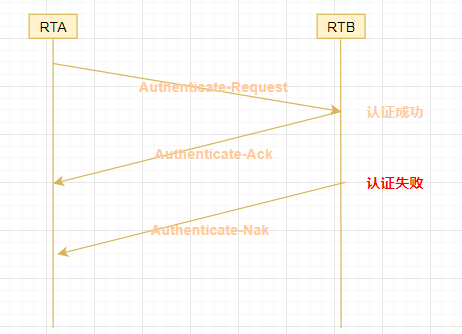
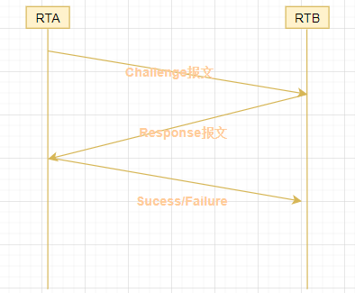

# 通信与网络安全

{: .no_toc}

## 目录

{: .no_toc .text-delta }

1. TOC
{:toc}

## 网络基本概念

### OSI 参考模型

- 应用层：HTTP、FTP、POP3、SMTP、IMAP
- 表示层：关心数据的格式和语法、处理数据压缩和加密，执行**格式转换、编码转换**，比如 ASCII、JPEG、MPEG 等
- 会话层：负责应用之间的连接，RPC、NFS、SQL 等。关键词**Socket、会话**
- 传输层：TCP、UDP、SSL、**TLS**。关键词**TCP 分段、UDP 数据报**
- 网络层：主要负责 IP 转发。IP、ICMP、IGMP、**IPSec**、OSPF、RIP。关键词**数据包**
- 数据链路层：执行 MAC 寻址，ARP/RARP、PPP、SDLC、帧中继。关键词**帧**。（PPTP、L2TP应该也工作在此层）
- 物理层：RJ45。关键词**bit**

### TCP/IP 模型

- 应用层：关注 Session
- 传输层：关注 TCP Connection
- 互联网层：关注 IP
- 链路层：关注 MAC

### IPv4 与 IPv6

- IPv4 长度 32 位，IPv6 长度 128 位
- IPv6 内置 IPsec 安全
- IPv6 内置 QoS

IPv4 私有地址段（可被企业用来承载内网的段）：

- 10.0.0.0 ~ 10.255.255.255

- 172.16.0.0 ~ 172.31.255.255

- 192.168.0.0 ~ 192.168.255.255

### 常见协议、端口

- SSH TCP 22
- Telnet TCP 23

- FTP TCP 20/21

- **SNMP UDP 161**

- TFTP UDP 69

- **POP3 TCP 110**

- **IMAP TCP 143**，比 POP3 安全

- SMTP TCP 25

- DNS UDP/TCP 53

### 哪些设备工作在哪层？

- Hub：物理层

- 交换机：二层数据链路层

- 路由器：三层网络层
- 防火墙：3~7 层
- WAF：七层应用层，但是可以进行网络层的访问控制
- Gateway：七层应用层，用于执行协议和格式翻译（如 API 网关）

### 多层协议

多层封装的协议，例如 TCP/IP、DNP3。

优点：

- 可在更高层使用各种协议
- 可以加密某层
- 灵活、弹性

缺点：

- 允许隐秘通道
- 可以绕过检测机制
- 逻辑上基于边界的网络安全可能实效

DNP3 工控协议：用于电力、水利等系统，用于数据采集和系统控制，常见于 SCADA 设备。

### 融合协议

- MPLS：基于标签转发的二层协议，性能好、有封装（安全）
- iSCSI：在以太网上传输存储 SCSI 协议，运行在三层
- FCoE：以太网上运行光纤通道协议，工作在三层网络层。最早可达 128G 速率

## 网络访问控制 NAC

提供接入认证和授权功能，可以防止未授权设备进入网络。NAC 属于一种**预防**手段。常见的 NAC 有基于 802.1x 的准入系统。

NAC 有接入前控制和接入后控制两种类型：

- 接入前控制：仅有当系统满足安全需求时，才允许接入
- 接入后控制：先接入，有基本的网络连接，如果要访问内网则进行认证。比如访客网络可能使用这种方式。

## 物理层相关

### 异步和同步

- 异步：启动和停止使用分隔符来管理。最常用
- 同步：基于独立时钟或时间戳保证同步，可以支持非常高的传输速率

### 基带与宽带

- 基带：数字信号方式传输，一次传一个信号。基带相比宽带更安全

- 宽带：模拟信号传输，可同时传输多个信号

### STP 与 UTP

- shielded twisted-pair 屏蔽双绞线：外层有箔片用于防电磁干扰
- unshielded twisted-pair 非屏蔽双绞线

铜缆与光缆

- 铜线：传输距离短，长距离时需要使用中继续放大信号
- 光缆：**抗干扰性强，安全性高**，传输距离远（单模 1 万米，多模最大 400m）

### 冲突避免 - LAN 介质访问技术

LAN Media Access 介质访问技术可以用于冲突避免。

#### CSMA

无线 802.11 使用 CSMA/CA，LAN 使用 CSMA/CD。

- CSMA/CA：载波侦听多路访问，仅支持**冲突避免**。代价较高，**每次 CSMA 发现有冲突后停止发送数据**，然后再次进行检测
- CSMA/CD：冲突检测和避免

#### 令牌环 FDDI - 效果最优

Fiber Distributed Data Interface (FDDI)

在一个环形网络中，只有拥有令牌的设备才可以发送报文，这样可以避免冲突。

#### 轮询

在一个 LAN 中一个系统为主，其他为从，主系统轮询查找每个二级系统是否需要传递数据，如果某系统需要传输，则授予传输权限，传输完毕后主再轮询下一个设备。

## 防火墙

部署在网络**区域之间**，可以是不同网段，或者不同安全级别的网络区域。

防火墙通常是**默认拒绝或隐式拒绝**。防火墙**无法防御用户故意的数据泄露**。

类型：

- 静态包过滤防火墙：工作在 3~4 层，是一种无状态防火墙，每个数据包都是单独评估的。不关心 TCP 会话。
- 应用级防火墙（代理防火墙、网关防火墙）：工作在 7 层，可以查看内容，性能一般
- 电路级防火墙（电路代理）：在 5 层工作，SOCKS 是其常见实现方式
- 状态检查防火墙：工作在 3~4 层，也称动态包过滤防火墙
- 下一代防火墙：又称多功能设备（MFD），集成了应用程序过滤、TLS 卸载、深度包检测 DPI、IDS、Web 内容过滤等功能

## 无线网络

- AC（或 WLC）：无线控制器
- AP（或 WAP）：无线接入点

两种 Wifi 部署模式：

- Ad hoc 模式：两台设备直接互联，使用**不安全的 WEP**。建议使用升级版本 Wifi Direct 替代，支持 WPA2 和 WPA3
- Infrastructure 模式：
  - 独立：单独一个 WIFI，没有连接到其他网络
  - 有线扩展模式：将 AP 接入有线网络中
  - 企业扩展模式：部署多个 AP 组成一个较大的网络，每个 AP 使用同样的 ESSID（扩展服务集标识符）
  - 桥接模式：用 AP 来桥接两个隔离的有线网络

两种 SSID：

- BSSID：基站的 MAC 地址，用于区分设备
- ESSID：用户看到的用于连接的 SSID

#### 无线网络认证

- OSA（Open System Authentication）：不进行认证
- WEP：使用 RC4 进行认证和加密，使用静态密钥。很容易被破解
- WPA：使用 RC4，不再使用静态密钥，会配合 LEAP 或者 TKIP（Temporal Key Integrity Protocol 临时密钥完整性协议）使用
- WPA2（WIFI Protected Access 2）：使用 AES-CCMP 替代 RC4，**支持 PSK 和 802.1x 两种认证方式**
  - PSK：使用预定义的共享密钥进行身份认证（家庭 Wifi 常用这种）
  - 802.1x/EAP：集成 Radius 或者 Tacacs+ 进行身份认证（企业 Wifi 常用这种）

IEEE 802.1x 规定使用 EAP 来支持 LAN 连接的认证，802.1x 又称作“基于端口额度网络访问控制”。802.1x 同时支持物理接口的准入（NAC）以及无线的准入。EAP 是个框架，允许新的身份认证技术和已有的无线对接，所以实际上 802.1x 也可以使用下列协议：

- LEAP：思科私有，用于替换 WPA TKIP 方案，已弃用
- PEAP：通过 TLS 封装 EAP，**更为安全**，支持交叉验证。目前企业无线用这方方式最多

#### WPS - Wifi Protected Setup

一键连接 Wifi，简化 Wifi 配置。**WPS 可能面临暴力破解，应该禁用**。

### 无线网络攻击

- 战争驾驶（War walking/driving）：某些人搜寻 Wifi 网络的攻击，然后进行攻击，针对 WPA2 比较常见的攻击是密钥重装攻击（KRACK）
- 恶意接入点（非授权接入的 AP）：
  - 通过物理连接在网络中添加 AP，可能是员工为了方便的私人行为，这些 AP 可能安全性不足
  - 复制已有 Wifi 的 SSID 和 MAC 地址，用户可能无意接入此 Wifi（《硅谷》中用的是这种方式）
- 邪恶双胞胎（Evil twin）：创建虚假的 AP，此 AP 克隆真实 AP 的身份。设备可能会自动连接上这个假的 AP
- 阻塞：使用信号干扰
- 初始化向量滥用：针对 WEP 初始向量过短的问题进行攻击，常见工具是 aircrack-ng
- **重放**：重传捕获的信号，期望能和 AP 建立会话，**获得权限**

WIDS 可以用于防范流氓 AP、解除关联、重放攻击。

## 其他无线网络

### 通用无线网络概念

无线电波的工作频率在 3Hz 到 300GHz 之间。

有四种频谱技术：

- 扩频（Spread Spectrum）：通信在多个频率上发生，**并行通信**
- FHSS 调频扩频（Frequency Hopping Spread Spectrum）：在一个频率范围内使用并行传输，一次只使用一个频率
- DSSS 直接序列扩频
- OFDM 正交频分复用：使用数字多载波调制技术，可以使用更小的频率集提供更大的数据吞吐

### 蓝牙

IEEE 802.15，使用 2.4G，速率较低，距离 10m 左右。

**蓝牙弱认证（使用 PIN），不加密，因此不安全**。

#### 蓝牙攻击

- 嗅探攻击：捕获数据包
- 蓝牙攻击（Bluesmacking）：针对蓝牙设备的 DOS 攻击，传输垃圾流量或者干扰信号
- 蓝牙劫持（Bluejacking）：向用户直接发送垃圾消息
- 蓝牙侵吞（Bluesnarfing）：通过蓝牙对数据进行未授权的访问

### RFID

RFID又称无线射频识别，通过无线电讯号识别并读写特定目标数据，不需要机械接触或者特定复杂环境就可完成识别与读写数据。如今，大家所讲的RFID技术应用其实就是RFID标签，它已经存在于我们生活中的方方面面。

类型：

- 无源 RFID：例如公交卡等，工作频率低（低频125KHZ、高频13.56MHZ、超高频433MHZ和 915MHZ），传输距离短
- 有源 RFID：物联网等场景使用，**距离远**

场景：

- **资产库存的跟踪**
- 门禁、考勤系统
- 图书管理系统
- 车辆调度系统

#### 潜在问题

- 物理获取读写器，这样便可以获得 RFID 芯片里的消息
- 被认为**侵犯隐私**，因为 RFID 内有 UUID，这个 UUID 可以被任何读写器读取

### NFC

近场通信（Near-field Communication）：	在非常接近的设备间传输无线信号，是一种 RFID 的衍生品。常见于手机等智能设备。13.56 MHz 工作，通信距离 10cm 内。

NFC 可以像无源 RFID 一样工作，也支持与 PKI 集成。

WPA2 也会用到 NFC 来方便建立 Wifi 连接。

#### NFC 攻击

- 路径攻击
- 窃听
- 数据操作
- 重放

## 蜂窝网络

2G、3G、4G、5G 等。蜂窝网络的无线部分是加密的，但是**数据传输到电线后是明文的**。

5G 可达 10G 的速率，但是传输距离短。

## DNS 及其安全

### DNS 中毒（欺骗攻击）

目标：给 Client 返回不正确的 IP 地址，使得 Client 访问恶意网站。

方式：

- 部署流氓服务器，优先于正常的 DNS 服务器响应客户端的请求
- DNS 污染（缓存中毒），感染 DNS 缓存服务器，使得下游服务器给客户端返回错误的 IP
- DNS 域欺骗（DNS Pharming）：修改 hosts
- 攻击 DHCP 服务器，给用户 PC 发放不正确的 DNS 配置

### 防范机制

- 限制 DNS 区域传送，阻止外部 DNS 到内部 DNS 的 TCP/UDP 53
- 限制外部 DNS 服务，仅使用企业内部 DNS
- 部署 N-IDS 来加强 DNS 异常流量的识别
-  使用 DNSSEC，加强 DNS 的身份验证，使用**数字签名**来保证完整性

### 域名劫持/域名抢注

- 在某域名过期后注册该域名

- 注册和公司域名近似的域名，在用户大意输错 URL 后引流到恶意网站（比如bing.cn）
- 使用同形词，比如在某些语言中 a 和 a 类似，用这个来注册域名

### 利用 DNS 的 DoS 攻击

如果多个 DNS 域名指向同一个 IP，可能造成多个用户同时访问某个 IP，造成该 IP 相关的服务异常。

## 内容分发网络

分散在互联网中的多个节点，可以提供同样的服务。比如视频平台会采用 CDN 来加快本地视频访问。

具有**低延迟、高性能和高可用**等特点。

常见的方案有：Cloudflare、AWS Cloudfront、Akamai、CacheFly、BitTorrent P2P CDN

## 电子邮件安全

垃圾邮件：

- 防止邮件欺骗：数字签名
- 防止垃圾邮件：**贝叶斯过滤**

## 语音及安全

### PBX 安全

专用交换机（Private Branch Exchange），部署在企业内部的电话交换系统，可以使得内部电话共享少数的 PSTN 线路。

#### 存在的攻击

- 飞客攻击：绕过电话系统的认证，免费拨打长途等（乔布斯曾经干的事）。改变电话服务用哪个，窃取服务，造成服务中断
- 钓鱼攻击：加强意识培训

### VoIP

将语音数据封装在 IP 包中传输。

#### 存在的安全风险

- 修改 VoIP 显示的电话号，进行钓鱼欺骗攻击

- 中间人攻击
- 呼叫管理系统和 VoIP 遭受 DoS 攻击
- 流量被窃听
- 伪造呼叫管理器，进行中间人攻击

解法：

- **SRTP**：加密、身份认证，
- 将语音流量和数据流量分开

## 安全通信

### 安全通信协议

- IPSec：主要用于 VPN
  - 使用公钥加密系统来提供加密、访问控制、不可否问性（签名）、消息验证
  - 隧道模式（Tunnel Mode）：加密完整报文，更安全
  - 传输模式（Transport Mode）：只加密数据，不加密源和目标的 IP 头，相比隧道模式安全性差

- SSH：常用语远程连接 Linux 主机

- SSL/TLS：目前使用的是 TLS，SSL 已经废弃。工作在四层传输层

- Kerberos：下个章节会详细讲

### PPP 点到点协议及身份认证

PPP：Point-to-Point Protocol，一种广域网**串口链路封装协议**。

- 同时支持同步传输和异步传输
- 有很好的扩展性，比如可以在以太网上承载 PPPoE
- 提供 LCP（Link Control Protocol），用于各种数据链路层参数的协商
- 提供了认证协议：PAP、CHAP、EAP 等

#### PAP

使用明文传输用户和密码，**不安全**。两次握手

#### CHAP

挑战-应答身份协议，使用三次握手，传递哈希值来进行验证，可以避免**重放攻击**。

Challenge =服务器发出的随机数，另一端使用此随机数+密码进行哈希，发送响应。

**CHAP 使用 MD5，当前已经被视为不安全**，微软的 MS-CHAPv2 使用增强的算法，比 CHAP 更为安全。

#### EAP

可扩展身份认证协议。一种认证框架，而不是简单的一个协议。

各种 EAP 方案：

- EAP-MD5：基于 MD5 哈希进行弱身份验证，**已被弃用**
- PEAP：通过 TLS 封装 EAP，**更为安全**，支持交叉验证
- EAP-TLS：一个开放的 IETF 标准，用于保护身份认证流量。当 Client 和 Server 均配置数字证书时，可以双向认证，安全性比较高
- EAP-TTLS（EAP Tunneled TLS）：是 EAP-TLS 的扩展，在身份认证之前在端点之间**建立隧道**，确保用户名不是明文传输
- EAP-SIM：通过 GSM 网络认证移动设备的一种方式
- LEAP：Cisco 私有方案，用于替换 WPA TKIP 无线认证方案
- EAP-FAST：Cisco 私有，用于取代 LEAP，目前已被 WPA2 取代
- EAP-POTP（EAP Protected One-Time Password）：支持在多因素认证中使用 OTP 令牌，用于单向和交叉身份认证

### VPN

