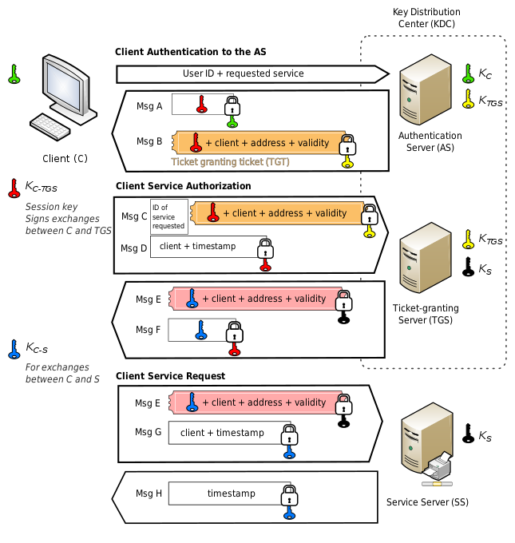

# D5 访问控制

{: .no_toc}

## 目录

{: .no_toc .text-delta }

1. TOC
{:toc}

## 为什么要访问控制

- 防止未授权用户对资源的使用
- 防止授权用户对资源的滥用（非法使用）

访问控制的对象：

- 主体：访问对象
- 客体：被访问对象

**什么是资产？**

包含有形的或者无形的东西，有形的比如物理设备，无形的如信息

- 信息：保存在任意位置的信息，比如硬盘中、数据库中
- 系统：一个或多个 IT 系统，比如文件服务器、数据库服务器等
- 设备：任何计算机系统、外部设备等
- 设施：物理场所中的硬件设施
- 应用程序：提供数据访问的服务

## 对资产进行访问控制的大类

### 管理控制/行政控制

- 管理策略
- 管理措施/步骤
- 人员控制
- 安全意识培训
- 监管机构

### 物理控制

- 网络分段
- 门禁、围栏、旋转门
- 区域隔离
- 布线

### 技术控制/逻辑控制

- 身份认证、授权
- 网络准入控制
- 审计

## 身份标识及身份认证

### 1. 标识身份

宣称用户的身份，具有唯一性，可追溯。任何访问控制的第一步都是标识。

身份注册：

- 初始招聘时，通过身份证、驾驶证、护照、出生证明等确定新员工身份
- 入职第一时间为新员工创建账户，可能牵扯到指纹等的录入

### 2.认证 Authentication

核实用户的身份。有三种身份识别方式：

#### 你知道什么？

可以记住的东西：

- 密码：静态密码
- **密码短语 Passphrase**：更容易记住的，根据对个人有意义的短语改编的，比如 !H@ve@C@T
- 认知密码：出生地点、母校、等私人的信息

一般 PCI DSS 建议 90 天更改一次密码，NIST 建议只在密码泄露后更改（也就是认为定期改密码没用）

#### 你有什么？

- 钥匙
- 智能卡：
  - **智能卡一般不能做身份认证**
  - 一般需要输入 PIN 来完成认证
- 口令牌 Token：可以很好**避免重放攻击**
  - 同步口令：每 60s 更新一次，需要时间同步。有硬件设备和软件两种
  - 异步口令：按照逻辑计算，比如每次使用累加计数器。有些一步口令会要求用户输入完用户名和密码后通过**挑战-回应**的方式完成 PIN 生成。
- 短信验证码：被认为**不安全**，建议使用口令牌。

##### 通过 Authenticator App 实现 OTP

OTP：One Time Password

Google Authenticator 等手机 App，可以很容易实现双因子认证，提供 6 位数字 PIN 码。

- HOTP：基于哈希的消息身份认证码（HMAC），类似于**异步动态口令**
- TOTP：基于时间的一次性口令，使用时间戳，如 30s，类似于**同步动态口令**

#### 你是什么？

- 指纹：通常不变，但可以**被仿造**
  - 基于螺纹、脊和分叉来识别（特征点）
  - 时间快
- 面部识别：被认为不安全，精准度低，速度快，失误率，拒认率较高
- 虹膜：眼睛肿位于瞳孔周围的彩色部分
  - **最为准确**
  - 可从远处识别，最大 6~12 米外的地方
- 视网膜：识别视网膜后面的血管，但存在泄露隐私的问题
- 掌纹：利用红外来扫描静脉图案
- 行为特征：
  - 签名分析：签名的速度、方式等
  - 击键动作

##### 生物识别的错误率(准确率)评级

FRR（False Rejection Rate）：**错误拒绝率，也被称为 I 类错误**

FAR（False Acceptance Rate）：**错误接受率，也被称为 II 类错误**

CER（crossover error rate）：FRR 和 FAR 的交叉，交叉错误率。CER 是生物识别的标准评估值，**CER 越低表示识别更准确**。

如果生物识的 FAR 比较高，**最节省成本的方式是添加第二个认证方式**。

##### 生物特征注册过程

- 收集
- 转换，转换成参考模板（Reference Template，又称参考配置文件）存储下来
- 对比

生物特征的删除挑战性比较大。

生物识别的问题（前两项为用户接受生物识别的关键）：

- **注册时间**大于 2 分钟被视为不可接受
- **吞吐率**（扫描主体并通过认证的时间），通常需要在 6s 内，否则难以接受
- 随着时间变化，可能需要定期重新注册

#### 多因素认证

采取三种身份识别中的两种或三种类型。比如密码+指纹。

### 3.身份授权

作用：确定主体对客体可执行的操作。

原则：

- 知其所需
- 最小特权原则

### 4.审计/可问责

审计的主要作用是可追溯性，保证用户可以对自己的行为负责。可问责的前提是要**识别和认证**用户。

审计的内容：

- 时间：时间同步很重要
- 身份主体
- 任务
- 发生了什么

审计最重要的是完整性，需要统一将日志保存在日志服务器中。

## 身份管理

### 两种身份管理体系

集中式：

- 存在单点的问题，如果失效影响范围大
- 存在隐私问题，如果被攻击，影响范围大
- 可以灵活的扩展来支持更多用户，例如 Windows AD

分布式：

- 可靠性高（注意，不是冗余性高）
- 贴近资源进行访问控制
- 管理开销高，需要同步机制
- 可以减少聚合攻击

*特权蠕变（特权蔓延）：随着工作变化，以前的特权没有被清除，**会出现权限过多的问题***

### SSO 单点登录

目的：

- 实现集中的身份管理
- 一次登录，多次访问资源
- 防止用户因密码管理复杂而将密码记录下来

缺点：如果凭证丢失，则可能访问很多资源

#### 常见的 SSO 机制

- LDAP/集中访问控制：例如企业中的 Windows Active Directory Domain Service（AD DS），是一种基于 LDAP 的 SSO 方式。
  - 多个根域之间可以建立互信（域森林），允许一个域中的用户访问另一个域中的资源。互信可以是单向，也可以是双向
  - 快捷信任：域树或者部分树之间的传递信任，可以缩短信任路径
  - 每个域也可以独立工作，之间建立**外部信任**，属于非信任传递
  - 和 Kerberos 之类的对接，**领域信任**，Windows AD 去信任 Kerberos
- LDAP+PKI：PKI 可以借助 LDAP 来方便 Client 查询 CA 信息
- Kerberos：本地实现 SSO 的一种方式
- 联合身份管理+SSO：将一个系统中的用户身份与多个身份系统**关联**起来。
- 脚本访问：登陆脚本自动传输登录凭据，建立通信链接。这种时候每个客体并没有集中的身份认证，只是脚本实现了类似 SSO 的效果。（类似于堡垒机登录每台 Linux）

### LDAP 与 LDAPS

*除了 LDAPS 外，还有 SASL（ Simple Authentication and Security Layer，RFC 2222）可以实现 LDAP 安全*

| **LDAP**                                      | **LDAPS**                            |
| --------------------------------------------- | ------------------------------------ |
| LDAP = Lightweight Directory Access Protocol. | LDAPS = LDAP over SSL 或 Secure LDAP |
| LDAP 使用 TCP                                 | LDAPS 使用 TLS/SSL                   |
| LDAP 使用 389 端口                            | LDAPS 使用 646 端口                  |
| LDAP 默认不会加密客户端到服务器的消息         | LDAPS 使用 TLS 加密所有信息          |

### 联合身份标识与 SSO

联合身份：将一个系统中的用户身份与多个身份系统**关联**起来。

联合身份认证的类型：

- 和云的联合：通常使用第三方服务来共享联合身份。用户使用企业内的 ID 登陆，企业内的 ID 会与联合身份关联起来，之后用户就可以访问第三方的 SaaS 服务
- 本地联合：两家公司合并，希望实现 SSO，于是创建本地联合身份管理系统
- 混合联合：两家公司合并，同时一家公司已经和云服务做了云的联合，可以构建一个混合的联合
- 准时制（JIT Just-in-Time）：公司和第三方签署保险协议，第三方需要为每个用户创建账号，手动创建管理复杂，所以设置 JIT，员工第一次访问福利平台时，第三方系统自动创建用户账号。一般 JIT 使用 SMAL

### 凭证管理系统

可解决的问题：

- 密码管理
- 多因素认证
- 日志记录，审核
- 密码轮换

W3C 于 2019 年发布了凭证管理系统的 API 规范。很多浏览器已经实现这一系统：

- 用户登录后询问是否保存
- 允许登陆时选择账户，自动填充
- 允许后续自动登陆

#### IDaaS 身份即服务

一种由第三方托管的身份和访问管理系统。例如微软的 Office365，或者 Google 的一个账号访问很多平台资源。

#### 本地凭证管理 App

本地用于保存密码的程序，比如免费的 KeePass，通过主口令解锁，解锁后复制口令到登陆平台。

### 在互联网上实现 SSO

**以下方式也可以实现联合身份认证。**

#### SAML - 互联网上最流行的 SSO 标准

安全断言标记语言，基于 XML 标准，用于在不同域间交换身份**认证**和**授权**信息（AA）。提供支持浏览器访问的 SSO 功能。

SAML 组件：

- 委托人或用户代理：最终用户，比如用户 A
- 服务提供商 SP：启用了 SSO 功能的网站，用户 A 访问 a.com，此时 a.com 为 SP
- IDP：Identity Provider，持有用户身份认证及授权信息的地方。如果此组件出问题则所有用户会受到影响

用户 A 访问 a.com，a.com 要求用户输入凭证，然后将其发给 IDP 进行认证。IDP 可能返回下面几种消息：

- **认证**声明：表示用户已经通过认证，标识 User Agent 登录的时长是多少

- **授权**声明：表明用户是否有权访问所请求的服务。如果无权访问会说明原因
- **属性**声明：关于 User Agent 的任何信息

#### 基于 XML 的其他语言

- SPML：服务提供标记语言，用于 Provisioning 开通
- XACML：描述访问控制（Extensible Access Control Markup Language）
- SOAP：简单对象访问协议，用于任何 XML 消息的传递，本身不是标记语言

#### OAuth

一个开放的标准，Oauth 2.0 是 RFC 6749 中描述的框架，由 IETF 维护。

OAuth 是一个**授权框架**，不是身份认证协议。**使用访问令牌**。

示例：Client 安装 Acme App，此 App 可以和 Twitter 交互并发送消息，点击 App 上的推特按钮后，会打开推特的认证页面，用户完成认证，然后推特通过 API 给 App 返回一个令牌，后续 App 使用令牌往推特发送消息。

第三方联动 **QQ、微信**等应该都使用此标准（此时第三方网站需要调用 QQ 等接口来发送数据，比如同步发朋友圈等）。

#### OpenID

一个开放标准，由 OpenID 基金会维护，提供去中心化的身份认证，允许用户使用一组凭证登录多个不相关的网站，凭证由第三方的 OpenID 托管式提供。使用 RestfulAPI

如果用户访问支持 OpenID 的网站，系统会提示用户输入 OpenID 作为 URI（这种方式并不安全），然后将其重定向到 OpenID 提供商进行认证，认证完成后再返回原来的页面。

#### OpenID Connect（OIDC）

使用 OAuth 2.0 授权框架，同时支持**认证**和**授权**，由 OpenID 基金会维护。

建立在 OpenID 基础上，使用 JavaScript 的 JSON Web令牌（JWT），OIDC 使用 Web 服务来检索 JWT。

Google 的第三方联动使用 OIDC（此时 Google 为认证源，允许其他网站通过 Google 身份来进行访问），使用过程和基于 OAuth 的无太大差别。

**OIDC 使用 OpenID 技术进行身份认证，使用 OAuth 2.0 进行授权。**

### Kerberos - 在内部实现 SSO

Kerberos 为用户提供单点登录解决方案，并为登录凭据提供保护。**认证过程中用户密码不会被在网络中传输**。

基于对称加密技术，Kerberos5 使用 AES 加密算法。

Windows 使用 Kerberos 进行身份验证。

Kerberos 相关的元素：

- 密钥分发中心 KDC（Key Distribution Center，等同于 Kerberos Authentication Server）：提供身份认证的服务器。所有的 Client 和 Server 都需要和 KDC 注册，KDC 维护全网的密钥
  - 身份认证服务 AS（Authentication Service）：执行初始的用户认证，为用户发放 TGT
  - 票据授予服务 TGS（Ticket Granting Service）：接收 TGT，为用户发放 Service Ticket
  - 数据库：存储用户的用户名、密码等信息

- 票据授予票据 TGT（Ticket-Granting Ticket）：如果用户认证通过，则会收到 TGT，TGT 会用于请求 Service Ticket。TGT 是经过加密的，包含对称秘钥、到期时间和用户 IP 地址
- 票证 Ticket（又称 Service Ticket）：主体用于访问资源的票据，如果用户认证通过并有权限访问资源，则 Kerberos 会为主体颁发 Ticket

Kerberos 工作流程（直接看 Wikipedia，不要看书浪费时间）：

- Client 输入用户名+密码，进行初始登录请求，请求中**只会将用户名**发送给 AS
- AS 验证用户名，然后生成 TGT（Client ID+Client IP+时间戳+Session Key C-TGS） + Session Key C-TGS（用于后续加密传输用），使用**用户密码的哈希**对 Session Key C-TGS进行加密，**使用 TGS 的密钥对 TGT 进行加密**，最后一并发给 Client
- Client 收到 TGT+ Session Key C-TGS，使用自己输入的密码解密 Session Key C-TGS， Client 无法解密 TGT（这样就保证了 TGT 很难被伪造）
- Client 再请求访问某服务器的资源，将 （TGT+Service ID） +（通过 Session Key C-TGS 加密的包含 Client+时间戳的报文）发送给 TGS，TGS 认证通过后（通过访问矩阵查看用户权限），为用户发放 Service Ticket+另一个 Session key C-S
- 用户通过 Session key C-S 加密将 Service Ticket 发给最终要访问的服务器
- 服务器访问 KDC，进行 Service Ticket 的验证
- Client 正常访问服务器资源

#### Kerberos 缺陷利用

Kerberos 潜在风险：

- 用户密码会临时存在于 Client 中
- Session key 会驻留在 Client 中

- 超哈希攻击（overpass the hash）：Windows 系统会自动创建 NTLM 哈希（含用户名+密码哈希，刚好是 Kerberos 需要的两个元素）并将其保存在内存中，攻击者可以伪造用户来申请 TGT，再通过 TGT 来申请访问资源。(NTLM hash = Windows 系统中用户密钥的加密格式)
- 票证传递（Pass the key）：通过 lsass.exe 进程来获取 tickets，利用 tickets 模拟用户访问资源
- 白银票据（Silver Ticket）：使用 Windows 服务账号的 NTLM hash 来获取 TGS Ticket，TGS Ticket 允许攻击者获得服务账号的权限
- 黄金票据（Golden Ticket）：如果攻击者恰好获得了 Kerberos Service Account 的权限，便可以在 AD 域内创建任意的 ticket，获得任意权限。Kerberos Service Account 的 hash 不会变，所以只需要获得一次，即会有很大影响。
  - 攻击者一般会先获得域控的权限，然后运行 Mimikatz 来提取哈希
- 暴力破解：在 Linux 上运行 Python 脚本 kerbrute.py ，Windows 运行 Rubeus ，猜测用户名和口令
- ASREPRoast：在禁用 Kerberos 预认证的环境中，获取 TGT 然后离线猜解用户密码
- Kerberoasting：收集加密的 TGS Ticket

## AAA

### RADIUS

- UDP 协议(1812、1813 计费)，默认**仅加密 Client 和 Radius 服务器之间传送的密码**。

- **支持 TLS 全加密，使用 TCP 2083 端口。** RFC 6614 定义，一般写作 RADIUS/TLS 或 RadSec

- 使用 C/S 架构，常用于网络设备等接入

### TACACS+

TCP 协议，端口号 TCP 49，支持动态密码，**加密所有客户端和服务器的流量**。

### Diameter

- 一个基础协议，能够扩展多种服务，例如 VoIP

- Diameter 协议被 IETF 的 AAA 工作组作为下一代的 AAA 协议标准。Diameter（译为直径，表示 **Diameter 协议是 RADIUS 协议的升级版本**）协议包括基本协议，NAS（网络接入服务）协议，EAP（可扩展鉴别）协议，MIP（移动IP）协议，CMS（密码消息语法）协议等。

## 针对智能卡的攻击

### 旁路攻击

软件攻击：在智能卡中提取用户信息

故障生成（Fault generation）：通过环境变动引起错误，比如温度波动、改变输入电压

电磁分析：查看发射频率

差分功率分析：用于推断使用公钥算法（如RSA）加密的片片上私钥

### 直接攻击

微区探查（Microprobing）：物理拆卸智能卡，使用超声波去掉外围的保护材料，探针直接连接到电路中获取 ROM 里的数据

## 针对用户凭据的攻击

- 字典攻击：通过预定义数据库中的密码来猜解密码
- 暴力攻击：尝试所有可能的字母、数字和符号组合来尝试找到用户密码。可能会先试用字典，再构造密码来破解
- 喷射攻击：一般一段时间内密码输入多次错误后会被锁定，喷射攻击是每次只尝试一个秘密，但是会尝试登录多个系统，这样轮询下来每登录一个系统都不会被锁定。喷射攻击目的是**绕过账户锁定策略**
- 凭证填充攻击：如果一个网站的密码被泄露，攻击者利用此网站的信息去尝试登录其他网站
- 生日攻击：目的是寻找碰撞，把每年每天的日期都进行哈希，做成表来进行猜解
- 彩虹表：由被哈希后的密码表，用来破解获取到的密码哈希的明文（哈希的密码没办法直接破解，利用彩虹表可以反向搜寻明文密码）
- Mimikatz：一个 Windows 下的渗透工具，可用于提取 NTLM 的密码哈希、提取 Kerberos Ticket、从内存中获取口令/口令哈希
- 哈希传递攻击：通常的工作流是用户输入密码，Client 将密码哈希后发给服务器。哈希传递攻击则是直接获取哈希后的密码，然后绕过 Client 将其发给 Server，实现伪造用户的请求。通常会用到上面的 Mimikatz 工具来获取密码哈希

## 访问控制

### 权限-权利-特权

- 权限（Permission，**可能翻译为许可**）：授予对客体的访问权限，并明确允许对客体执行的操作（例如：读、写、执行）
- 权利（Right，**可能翻译为权限**）：指对某个客体采取行动的能力（例如：用户有权修改系统时间、有权进行备份）
- 特权（Privilege）：权限和权利的组合

### 授权机制

- 隐式拒绝：未允许的都拒绝
- 访问控制矩阵：包含主体、客体和访问权限的表格，主体访问客体时，系统检查访问控制矩阵，确定主体有哪些适当的权限。
  - 访问控制矩阵包含 ACL（列），ACL 指针对每个客体，其授权主体和权限是什么
  - 访问控制矩阵也包含能力表（行），可以看每个主体有哪些权限
- 能力表：另一种确定主体所分配权限的方式，**能力表主要关心主体（用户、角色）**，比如会计组会有一个明确的可访问资源的列表，以及针对这些客体为会计角色授予的具体权限。**ACL 主要关注客体。**

### DAC 自主访问控制（Discretionary Access Control）

**资源所有者**可以配置访问控制，比如 Windows 系统的管理员可以决定有哪些 Guest User。

缺点：管理复杂，不安全，**清除授权会比较麻烦。**

- DAC 基于 ACL 来进行访问控制，因此有访问控制阵列
- 为用户或者用户组授予到客体的权限

### 非自主访问控制（Nondiscretionary Access Control）

非自主访问控制通常是**集中式的控制，管理简单**，但不灵活

#### MAC 强制访问控制（Mandatory Access Control）

依赖于**分类标签（Classification）**来进行，管理员为客体分配分类标签，只允许高于此标签级别的主体访问（主体的权限叫**许可级别 Clearance**）。比如文件为秘密级别，只允许具备秘密及以上权限的人访问（但是也可以设置为不让高级别的人访问，详见后面的使用环境）。

一个客体可以有多个标签，比如机密+HR，只允许具备 HR 和机密的用户才能访问某资源。

**MAC 使用隐式拒绝**，只有标签完全匹配才允许访问。

**只有管理员可以更改客体的级别**，客体的 owner 无法更改。

MAC 使用**基于格子**（lattice-based model）的模型，例如下图中只有具备 Confidential 权限的用户才能访问 Lentil：

通常被军方/政府来使用。

常见的标签有（军方）：

- 绝密（Top Secret）
- 秘密（Secret）
- 机密（Confidential）

私营企业：

- 机密（Confidential，或专有 Proprietary）
- 私有（Private）
- 敏感（Sensitive）
- 公开（Public）

MAC 可以可以用于下列三种环境：

- 分层环境：按照低、中、高来进行分层，高级别可以访问更低级别的数据，类似于 Zone Based Firewall，内网可以访问外网
- 分区环境：多个安全域之间无关联性，如果需要访问其他安全域，则需要明确的许可（Clearance）
- 混合环境：结合了分层以及分区的概念。每个分层内有很多子分层，相互之间隔离，如果需要访问则需要明确的许可

#### RBAC 基于角色的访问控制

根据主体的角色来分配访问客体的权限。一般和 AD 的组织架构可以关联起来。

RBAC 可以加强最小特权原则的实施。

如果用户的职位发生变化，通过 RBAC 只需要更改用户所属的组即可，不需要像 DAC 一样手动撤销之前的访问控制配置。

**RBAC 和 DAC 区别：**

- DAC 的资源所有者可以决定谁能来访问，RBAC 不行
- **RBAC 不能直接给用户授予权限**，而是将用户添加到指定组来授予权限，DAC 则是直接授予权限

#### RuBAC 基于规则的访问控制

常见于防火墙，使用一组规则来决定允许/拒绝的操作，是适用于所有主体的**全局规则**。

#### ABAC 基于属性的访问控制

RuBAC 的增强。属性可以是用户、网络、设备、**时间、位置**的任何特征。

常用于 SDN、SD-WAN、MDM 等环境，访问控制可以不再依靠 IP、端口等进行。

#### Risk-based 基于风险的访问控制

一种比较新的访问控制，通过下列几个元素来确定风险：

- 环境：用户使用公司 MDM 管理的设备
- 情景：访问钓鱼网站
- 安全策略：发现风险较高，阻止此访问

可以和其他管控手段协同工作，比如：

- 强制要求双因子认证，否则不让访问网络资源
- 强制要求安装最新补丁，否则不让访问网络资源

