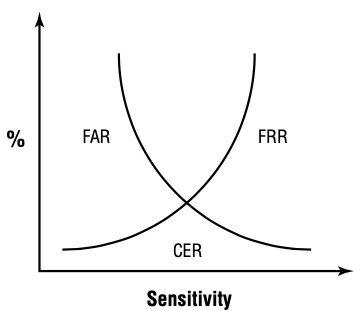

# 访问控制

{: .no_toc}

## 目录

{: .no_toc .text-delta }

1. TOC
{:toc}

## 为什么要访问控制

- 防止未授权用户对资源的使用
- 防止授权用户对资源的滥用（非法使用）

访问控制的对象：

- 主体：访问对象
- 客体：被访问对象

**什么是资产？**

包含有形的或者无形的东西，有形的比如物理设备，无形的如信息

- 信息：保存在任意位置的信息，比如硬盘中、数据库中
- 系统：一个或多个 IT 系统，比如文件服务器、数据库服务器等
- 设备：任何计算机系统、外部设备等
- 设施：物理场所中的硬件设施
- 应用程序：提供数据访问的服务

## 对资产进行访问控制的大类

### 管理控制/行政控制

- 管理策略
- 管理措施/步骤
- 人员控制
- 安全意识培训
- 监管机构

### 物理控制

- 网络分段
- 门禁、围栏、旋转门
- 区域隔离
- 布线

### 技术控制/逻辑控制

- 身份认证、授权
- 网络准入控制
- 审计

## 身份标识及身份认证

### 1. 标识身份

宣称用户的身份，具有唯一性，可追溯。任何访问控制的第一步都是标识。

身份注册：

- 初始招聘时，通过身份证、驾驶证、护照、出生证明等确定新员工身份
- 入职第一时间为新员工创建账户，可能牵扯到指纹等的录入

### 2.认证 Authentication

核实用户的身份。有三种身份识别方式：

#### 你知道什么？

可以记住的东西：

- 密码：静态密码
- **密码短语 Passphrase**：更容易记住的，根据对个人有意义的短语改编的，比如 !H@ve@C@T
- 认知密码：出生地点、母校、等私人的信息

一般 PCI DSS 建议 90 天更改一次密码，NIST 建议只在密码泄露后更改（也就是认为定期改密码没用）

#### 你有什么？

- 钥匙
- 智能卡：
  - **智能卡一般不能做身份认证**
  - 一般需要输入 PIN 来完成认证
- 口令牌 Token：可以很好**避免重放攻击**
  - 同步口令：每 60s 更新一次，需要时间同步。有硬件设备和软件两种
  - 异步口令：按照逻辑计算，比如每次使用累加计数器
- 短信验证码：被认为**不安全**，建议使用口令牌。

##### 通过 Authenticator App 实现 OTP

OTP：One Time Password

Google Authenticator 等手机 App，可以很容易实现双因子认证，提供 6 位数字 PIN 码。

- HOTP：基于哈希的消息身份认证码（HMAC），类似于**异步动态口令**
- TOTP：基于时间的一次性口令，使用时间戳，如 30s，类似于**同步动态口令**

#### 你是什么？

- 指纹：通常不变，但可以**被仿造**
  - 基于螺纹、脊和分叉来识别（特征点）
  - 时间快
- 面部识别：被认为不安全，精准度低，速度快，失误率，拒认率较高
- 虹膜：眼睛肿位于瞳孔周围的彩色部分
  - **最为准确**
  - 可从远处识别，最大 6~12 米外的地方
- 视网膜：识别视网膜后面的血管，但存在泄露隐私的问题
- 掌纹：利用红外来扫描静脉图案
- 行为特征：
  - 签名分析：签名的速度、方式等
  - 击键动作

##### 生物识别的错误率(准确率)评级

FRR（False Rejection Rate）：错误拒绝率

FAR（False Acceptance Rate）：错误接受率

CER（crossover error rate）：FRR 和 FAR 的交叉，交叉错误率。CER 是生物识别的标准评估值，**CER 越低表示识别更准确**。

##### 生物特征注册过程

- 收集
- 转换
- 对比

生物特征的删除挑战性比较大。

#### 多因素认证

采取三种身份识别中的两种或三种类型。比如密码+指纹。

### 3.身份授权

作用：确定主体对客体可执行的操作。

原则：

- 知其所需
- 最小特权原则

### 4.审计/可问责

审计的主要作用是可追溯性，保证用户可以对自己的行为负责。

审计的内容：

- 时间：时间同步很重要
- 身份主体
- 任务
- 发生了什么

审计最重要的是完整性，需要统一讲日志保存在日志服务器中。

## 身份管理

### 两种身份管理体系

集中式：

- 存在单点的问题，如果实效影响范围大
- 存在隐私问题，如果被攻击，影响范围大
- 可以灵活的扩展来支持更多用户，例如 Windows AD

分布式：

- 可靠性高
- 管理开销高，需要同步机制
- 可以减少聚合攻击

### SSO 单点登录

目的：

- 实现集中的身份管理
- 一次登录，多次访问资源

缺点：如果凭证丢失，则可能访问很多资源

常见的 SSO 机制：

- LDAP+集中访问控制
- LDAP+PKI
- Kerberos
- 联合身份管理+SSO
- 脚本访问

### 联合身份标识

联合身份：将一个系统中的用户身份与多个身份系统**关联**起来。

联合身份认证的类型：

- 和云的联合：通常使用第三方服务来共享联合身份。用户使用企业内的 ID 登陆，企业内的 ID 会与联合身份关联起来，之后用户就可以访问第三方的 SaaS 服务
- 本地联合：两家公司合并，希望实现 SSO，于是创建本地联合身份管理系统
- 混合联合：两家公司合并，同时一家公司已经和云服务做了云的联合，可以构建一个混合的联合
- 准时制（JIT Just-in-Time）：公司和第三方签署保险协议，第三方需要为每个用户创建账号，手动创建管理复杂，所以设置 JIT，员工第一次访问福利平台时，第三方系统自动创建用户账号。一般 JIT 使用 SMAL

### 在互联网上实现 SSO

**以下方式也可以实现联合身份认证。**

#### SAML - 互联网上最受欢迎

安全断言标记语言，基于 XML 标准，用于在不同域间交换身份认证和授权信息（AA）。提供支持浏览器访问的 SSO 功能。

用户 A 访问 a.com，此时 a.com 为 SP

- 服务提供商 SP：启用了 SSO 功能的网站
- IDP：Identity Provider，持有用户身份认证及授权信息的地方。如果此组件出问题则所有用户会受到影响

用户 A 访问 a.com，a.com 要求用户输入凭证，然后将其发给 IDP 进行认证。IDP 可能返回下面几种消息：

- 认证声明：表示用户已经通过认证，表示 User Agent 登录的时长是多少

- 授权声明：表明用户是否有权访问所请求的服务。如果无权访问会说明原因
- 属性声明：关于 User Agent 的任何信息

#### OAuth

一个开放的标准，Oauth 2.0 使用访问令牌

#### OpenID Connect（OIDC）

由第三方进行用户身份验证的开放标准

### Kerberos - 在内部实现 SSO

Kerberos 为用户提供单点登录解决方案，并为登录凭据提供保护。**认证过程中用户密码不会被在网络中传输**。

基于对称加密技术，Kerberos5 使用 AES 加密算法

Kerberos 相关的元素：

- 密钥分发中心 KDC（Key Distribution Center，等同于 Kerberos Authentication Server）：提供身份认证的服务器。所有的 Client 和 Server 都需要和 KDC 注册，KDC 维护全网的密钥
  - 身份认证服务 AS（Authentication Service）：执行初始的用户认证，为用户发放 TGT
  - 票据授予服务 TGS（Ticket Granting Service）：接收 TGT，为用户发放 Service Ticket
  - 数据库：存储用户的用户名、密码等信息

- 票据授予票据 TGT（Ticket-Granting Ticket）：如果用户认证通过，则会收到 TGT，TGT 会用于请求 Service Ticket。TGT 是经过加密的，包含对称秘钥、到期时间和用户 IP 地址
- 票证 Ticket（又称 Service Ticket）：主体用于访问资源的票据，如果用户认证通过并有权限访问资源，则 Kerberos 会为主体颁发 Ticket

Kerberos 工作流程（直接看 Wikipedia，不要看书浪费时间）：

- Client 输入用户名+密码，进行初始登录请求，请求中**只会将用户名**发送给 AS
- AS 验证用户名，然后生成 TGT（Client ID+Client IP+时间戳+Session Key C-TGS） + Session Key C-TGS（用于后续加密传输用），使用**用户密码的哈希**对 Session Key C-TGS进行加密，**使用 TGS 的密钥对 TGT 进行加密**，最后一并发给 Client
- Client 收到 TGT+ Session Key C-TGS，使用自己输入的密码解密 Session Key C-TGS， Client 无法解密 TGT（这样就保证了 TGT 很难被伪造）
- Client 再请求访问某服务器的资源，将 （TGT+Service ID） +（通过 Session Key C-TGS 加密的包含 Client+时间戳的报文）发送给 TGS，TGS 认证通过后（通过访问矩阵查看用户权限），为用户发放 Service Ticket+另一个 Session key C-S
- 用户通过 Session key C-S 加密将 Service Ticket 发给最终要访问的服务器
- 服务器访问 KDC，进行 Service Ticket 的验证
- Client 正常访问服务器资源

### Kerberos 缺陷利用

Kerberos 潜在风险：

- 用户密码会临时存在于 Client 中
- Session key 会驻留在 Client 中

- 超哈希攻击（overpass the hash）：Windows 系统会自动创建 NTLM 哈希（含用户名+密码哈希，刚好是 Kerberos 需要的两个元素）并将其保存在内存中，攻击者可以伪造用户来申请 TGT，再通过 TGT 来申请访问资源。(NTLM hash = Windows 系统中用户密钥的加密格式)
- 票证传递（Pass the key）：通过 lsass.exe 进程来获取 tickets，利用 tickets 模拟用户访问资源
- 白银票据（Silver Ticket）：使用 Windows 服务账号的 NTLM hash 来获取 TGS Ticket，TGS Ticket 允许攻击者获得服务账号的权限
- 黄金票据（Golden Ticket）：如果攻击者恰好获得了 Kerberos Service Account 的权限，便可以在 AD 域内创建任意的 ticket，获得任意权限。Kerberos Service Account 的 hash 不会变，所以只需要获得一次，即会有很大影响。
  - 攻击者一般会先获得域控的权限，然后运行 Mimikatz 来提取哈希
- 暴力破解：在 Linux 上运行 Python 脚本 kerbrute.py ，Windows 运行 Rubeus ，猜测用户名和口令
- ASREPRoast：在禁用 Kerberos 预认证的环境中，获取 TGT 然后离线猜解用户密码
- Kerberoasting：收集加密的 TGS Ticket

## AAA

### RADIUS

UDP 协议(1812、1813 计费)，默认仅加密 Client 和 Radius 服务器之间传送的密码。

支持 TLS 全加密，使用 UDP 2083 端口。

### TACACS+

TCP 协议，支持动态密码，加密所有客户端和服务器的流量。

### Diameter

一个基础协议，能够扩展多种服务，例如 VoIP。

