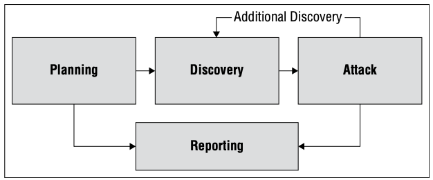

# 安全评估和测试

{: .no_toc}

## 目录

{: .no_toc .text-delta }

1. TOC
{:toc}

安全评估用于定期验证企业中是否具有足够的安全控制措施，以及这些措施是否能够正常运行并保证信息资产。

安全评估：识别、管理和降低风险

## 安全评估的三个部分

- 安全测试：验证某项安全控制措施是否正常运行
- 安全评估：对系统、应用和环境的安全性进行审查。通常需要使用安全测试工具，自动发现漏洞、风险等。安全评估的成果是生成评估报告并提交管理层
- 安全审计：必须由**独立的审核员**进行，目的是**向第三方证明**当前控制措施是有效的。

## 审计

### 审计三个分类

- 内部审计：审计人直接向总裁、CEO 或其他类似高层汇报，也可能直接向董事会汇报
- 外部审计：由外部审计公司执行，审核员与公司无利益冲突，公信力高。（四大审计公司：安永、德勤、普华永道、毕马威）
- 第三方审计：由一个组织代替另一个组织的名义进行审计，比如监管机构对公司的审计

### 审计原因

法律法规要求：

- 例如联邦机构每年对组织进行一次自我审查和第三方审查

业务驱动：

- 为了减少开支、快速上线一些服务，进行服务外包，需要对外部组织进行审查

### 第三方审计 - SOC 组织控制审计

**目的：如果一个组织给多个客户提供服务，而每个客户可能都要求该组织进行审计，那么这时候就需要一个标准来减少审计次数，而且结果大家公认。比如微软全球都有业务，因此可以使用某标准来进行审计让全球都认可。**

SOC （Service Organization Controls）

常见的执行标准：

- SSAE 18 （Statement on Standards for Attestation Engagement document 18），美国注册会计师协会发布
- ISAE 3402：国际标准，可以在美国之外使用

*AICPA（American Institute of Certified Public Accountants）：美国注册会计师协会*

**SSAE 18 和 ISAE 统称为 SOC 审计。**

SOC 有三种形式的声明：

- SOC 1 声明：使用 SSAE 18 执行标准，评估可能**影响财务报告准确性**的控制措施
- SOC 2 声明：**关注非财务相关的信息，**评估可能影响 **CIA 三性及隐私**的措施，结果通常保密，根据 NDA 对外共享
- SOC 3 声明：**关注非财务相关的信息，**评估可能影响 **CIA 三性及隐私**的措施，通常**对外公开**

SOC 两种类型：

- SOC I 类：由管理层指定审查范围，仅涵盖指定时间点。可视为**纸面上专项的审查**，报告管理层相关的措施是否合理，不会去现场真实去进行审查
- SOC II 类：传统的审查，审查更长的时间段，至少 6 个月，**会到现场验证控制功能是否正常**

 SOC 1 类型 2 审核是根据国际标准保证参与号 3402 (ISAE 3402) 进行。

### 审计标准

COBIT：Control Objectives for Information and Related Technologies 信息和相关技术控制目标。由 ISACA 维护。

ISO 27001 ：描述建立信息安全管理系统的标准办法

ISO 27002：介绍信息安全控制措施的更多细节

## 漏洞评估 SCAP

原因：不恰当的编程可能存在安全漏洞

NIST 维护的漏洞描述标准 SCAP（Security Content Automation Protocol）：

- CVE（Common Vulnerabilities and Exposures）：漏洞描述（命名系统）
- CVSS（Common Vulnerability Scoring System）：漏洞严重性的标准化评分，0~10 分，7 以上为严重
- CCE（Common Configuration Enumeration）：系统配置问题的描述（命名系统）
- CPE（Common Platform Enumeration）：提供一种操作系统、应用程序及设备的命名系统
- XCCDF（Extensible Configuration Checklist Description Format）：提供一种描述安全检查表 checklist 的语言
- OVAL（Open Vulnerability and Assessment Language）：描述安全测试步骤

### 漏洞扫描方式

- 网络发现扫描：nmap 等工具
  - TCP SYN 扫描（半开扫描），如果收到 ACK 则表示端口开放
  - TCP Connect 扫描 全连接扫描。适用于某些时候软件无法构建 SYN 包，需要借助 OS 产生完整 TCP 会话
  - TCP ACK 扫描：发送 ACK，表明其属于某个开放连接。这种方式可用于检查是否存在防火墙，防火墙的规则及工作原理
  - UDP 扫描：检查存活的 UDP 服务
  - Xmas 扫描：设置 FIN、PSH 及 URG 标志位，
- 网络漏洞扫描：发现已知漏洞，nessus 扫描，MBSA（Microsoft baseline security analyzer）、OpenVAS（开源）
  - 默认未经过身份认证：模拟攻击者
  - 经过身份认证（只读权限）：全面评估系统中的漏洞，同时减少漏报和误报
- Web 应用程序漏洞扫描：专门检测 Web 应用中的漏洞，**Nikto 扫描**、nessus 扫描、Burp Suite、Wapiti（开源）
- 数据库漏洞扫描：检测数据库安全漏洞，开源数据库漏洞扫描 sqlmap

nmap 扫描的几种状态：

- open：端口开放
- closed：端口关闭
- filtered：被防火墙过滤，nmap 无法判断开放开始关闭

PCI DSS 规定组织要每年进行一次 Web 漏洞扫描。

## 渗透测试

相比漏洞扫描，会多一个漏洞利用（攻击尝试）

渗透测试的几个阶段：

- 规划阶段：确定测试范围，确定测试是**经过授权的**（一般要签署**测试范围的授权书**）
- 信息收集和发现：结合人工和自动化工具收集环境信息，比如发现开放的端口等，发现漏洞
- 攻击：利用收集到的漏洞尝试破坏系统。攻击完成后会返回到 Discovery 重新发现
- 报告：总结漏洞测试结果，提供改进意见

常用工具：Metasploit，对目标系统实施自动化的漏洞利用，使用脚本语言来实现常见攻击的自动化任务。

### 渗透测试标准

- NIST 800-115
- OSSTMM

## 代码审查和测试

代码审查：也称同行评审，让其他开发者查看代码是否存在缺陷。

### 范根检查法

最正式的代码审查称为范根检查法（Fagan Inspection），遵循严格的审查和测试过程，有 6 个步骤：

- 规划
- 总览
- 准备
- 审查
- 返工
- 追踪

### 静态测试 SAST

不运行软件的情况下，通过分析软件源代码和编译后的应用程序来评估软件的安全性。通常使用自动化检测工具，可以发现缓存溢出等问题。

### 动态测试 DAST

Dynamic Application Security Testing 动态应用安全测试。

使用黑盒的方式，在软件运行环境下检测软件的安全性。动态检查常用来进行 Web 应用的安全性测试。

**动态测试**可以使用模拟事务的方式来测试系统的**性能**。

DAST 一般依靠专家创建测试软件，通用性较弱，DAST 更关注请求和响应。

### 模糊测试（Fuzz test）

一种特殊的动态测试技术，向软件输入多种不同类型的输入来测试其边界，以发现之前未检测到的缺陷。**适合逻辑简单的检测**。

比如输入无效输入、产生随机字符等。

分两大类：

- **突变**（Mutation，或 Dubm）模糊测试：基于软件正常工作的输入值，对其进行修改（例如追加），然后来进行测试
- **预生成**（智能）模糊测试：设计数据模型，基于对软件都用数据类型的理解创建新的模糊输入

模拟测试工具：

- zuuf：可用于突变模糊测试

### 接口测试

- API 接口：应用编程接口，一般以 Web 服务的形式对外发布。通常使用 **API 密钥**来限制其他用户和程序的 API 调用。

- UI 接口：用户接口，**包含 CLI 和 GUI**

- **物理接口**：机械装置、逻辑控制器或者其他物理设备的一些程序

### 误用案例测试 misuse case testing

一些系统可能会有错误使用/滥用的可能，比如取款时输入比余额大，或者尝试输入字符串来访问其他用户。

此时可以通过误用案例，或滥用测试来发现系统是否存在这些漏洞。

### 网站监测

- 被动监测（Passive monitoring） 
- ）：捕获**真实**发送到网站的流量。**URM 真实用户监控**是被动监测的一种变体，监测工具可以重组单个用户的活动，追踪其与网站的交互
- 主动监测（**合成检测** synthetic monitoring）：向网站发送伪造的事务活动，从而评估网站的性能

### 测试覆盖能力

测试覆盖率=已测试的用例数量/全部用例的数量。

在解读测试结果时，需要理解生成输入值的内容。

常见的 5 个标准：

- 分支覆盖率：在所有 if else 条件下，是否每个 if 都执行了
- 条件覆盖：在所有注入集合下，**是否测试了每个逻辑**
- 函数覆盖：是否调用了每个函数进行测试
- 循环覆盖：是否执行了每个循环
- 语句覆盖：是否覆盖了所有的代码
