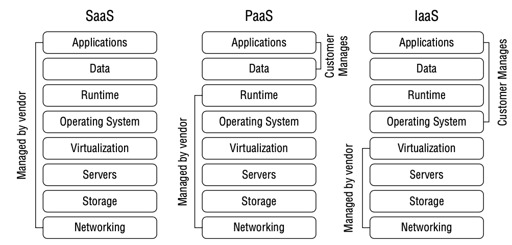

# 安全运营

{: .no_toc}

## 目录

{: .no_toc .text-delta }

1. TOC
{:toc}

## 一些安全运营的概念

- 知所必需：基于工作或业务需求被授予最小知悉范围和访问权限

- 最小特权：要求用户没有不必要的特权来执行工作
- 职责分离：将一个关键任务分成不同的部分由不同的人来执行，可以减少有意或无意的破坏。电影院售票员和检票员分开就是一种职责分离。合谋会破坏职责分离，岗位轮换可以解决此问题
- 双人控制：确保担任不具有足够的权限来破坏系统，针对**敏感**的数据
- 岗位轮换：减少个人之间共谋活动的风险，起到威慑和检测作用。一般至少一周，保证有足够的时间让另一个人接管
- 强制休假：突然性的休假，使得别怀疑员工没有时间来遮掩欺诈痕迹

## 几个常见角色说明

- 系统管理员

某些系统的最高权限管理员

- 操作员

进行主机的日常操作，比系统管理员的权限低。存在逃避安全策略的问题，需要对其操作日志进行审计。

- 安全管理员

定义安全设置，协同管理员进行配置。

维护安全设备和软件、执行安全评估、账号管理、设置用户初始口令、敏感标签分配、系统安全配置、检查审计日志。

- IT helpdesk

提供**一线支持**，在必要时重置密码，进行系统监控

- 普通用户

需要访问 IT 资源的人

## 特权账户的管理

系统内置的 root 账户需要：

- 修改默认密码
- 使用长复杂密码
- 禁止远程登录（或者使用加密传输、双因子认证）
- 日志记录 root 的登录行为

服务账户：

- 密码复杂，定期修改

管理员账户：

- 分配给指定的人来维护系统
- 所有活动需要被审计

## 云托管服务

- IaaS：用户管理 OS 及以上的东西，比如打 OS 补丁等
- PaaS：用户管理程序及数据，如客户自己开发代码，托管运行在第三方平台
- SaaS：全托管，如邮件系统

## SLA

SLA 是一个描述客户从 IT 部门获得服务水平的说明文档，展示服务如何被计量，出现问题后补救措施以及要付出的赔偿。

SLA 是 IT 承诺给业务部门或者其他客户的。

包含三个关键部分：

- 服务元素：具体服务、可用性状态、时间窗、各方职责、费用等
- 管理元素：测量标准好方法、争议过程如何解决
- SLA更新：在需求和服务能力变化时进行更新

SLA 的检测指标（即如何验证 SLA 满足）：

- 服务可用性
- 不良率
- 技术质量
- 安全

## 人员安全是第一优先级

- 胁迫系统：如果保安无法阻止入侵行为，可以按下一键胁迫系统
- 出差时：
  - 尽量不携带机密信息，如果必须携带，需要强加密
  - 尽量携带临时设备，而非常用的设备，避免被监听
  - 不使用免费 WIFI，尽量使用自己的热点
  - 通过 VPN 访问企业内的资源
- 要有应急管理机制，比如大楼遭遇火灾时如何应急
- 进行安全意识培训

## 资产清单

资产清单可方便安全人员快速找到和漏洞相关的硬件或软件，及时修补漏洞。可以通过扫描发现网络中存在的未授权设备。

资产清单需要定期维护，确保没有非授权的变更。

硬件清单：设备的品牌、型号、MAC、序列号、OS、IP 等，基本是 MDM 能看到的所有东西

软件清单：软件名称、供应商、许可证、到期时间、已安装软件的人。软件需要有良好的许可控制，避免盗版软件的使用，要监控 License 的使用情况

资产保护流程：

- 风险评估和识别
- 选择合适的控制措施（设计）
- 使用合适的控制措施（实施）
- 管理配置
- 评估操作

## 变更管理流程

- 请求变更
- 影响评估（审核）
- 批准/不批准
- 测试
- 安排并实施变更
- 记录变更

## 补丁管理

目的：保护环境中的 OS 和应用免受漏洞影响。

补丁管理的步骤：

- 评估补丁：管理员查看最新补丁，决定是否要升级（检查自己是否会受补丁中的漏洞影响）
- 测试补丁：在隔离的环境下进行补丁测试
- 审批补丁：管理层批准进行补丁升级
- 部署补丁：有计划的进行补丁安装，一般可能在非工作时间进行安装，部署前通常要备份系统
- 验证补丁是否完成部署：验证补丁被正确安装，且系统运行正常

逆向工程补丁：某些厂商会定期发布补丁，在发布补丁后，黑客通过对补丁的逆向分析来确定如何利用漏洞（有些漏洞如何被利用并不会公开），如果刚好有些 OS 还未打上最新的补丁，则可能会被攻击。

集中补丁管理：

- 补丁管理的最佳实践
- 使用虚拟化技术可以更好地验证补丁
- 防火墙、IPS 等可以减轻软件漏洞的影响

## 漏洞管理系统

**定期扫描**、**评估漏洞**，并采取措施减少漏洞相关的风险。

漏洞类型：

- 系统缺陷：软件设计上存在漏洞
- 配置错误
- 策略缺失：未安全安全规范进行测量实施

## 安全事件管理

事件（incident）：可被观察、验证和记录的消极事件，事件可能对公司造成负面影响。事件处理和响应是安全部门的首要职责。

安全事件管理目的：快速的恢复系统

三个部分：人、技术和流程

流程：

- 检测：事件的检测、识别、分类（分析影响）
- 响应：调查事件，进行数据取证，CIRT（计算机响应团队），CSIRT（计算机安全事件响应团队）
- 抑制：遏制事件发展，降低事件的影响。此阶段可能不会立即中断攻击者的访问，进而监控攻击者的行动目标和攻击范围
- 报告：在组织内通报时间并将情况上报给相关部门和个人
- 修复：恢复系统使其到正常状态，可能是重启、或者重建系统（从备份恢复）
  - 最安全的方式是重建系统，这样可以避免存在未被发现的恶意代码，而且可以确保访问策略、账户、补丁都在基线内
- 补救：查明事件发生的原因，采取措施防止事件再次发生（根本原因分析），比如打补丁
- 总结教训：集结所有事件相关人员，收集有意义的数据并分析事件检测及响应过程中可改善的地方，编写报告给管理层，让管理层决策要采取哪些建议

事件响应相关的人：

- 法律部门（内外部的法律顾问都可以）
- 人力资源
- 高管
- 物理安全
- 内部审计
- 安全部门以及 IT  部门
- 业务部门、系统管理员和任何能够辅助进行事件的调查和恢复的人员

## 攻击及防护

### 一些攻击类型

- 僵尸网络：botnet，使用 command & control 来控制多个主机，可能会在感染主机上部署恶意软件，搜索敏感信息文件、口令等，也可能通过 botnet 攻击外部系统。最好的防护方式是纵深防御。
- DOS：拒绝服务攻击，导致对方服务不可用，可以是资源消耗类（比如带宽或者内存），也可以是使得程序崩溃
- SYN 泛洪：属于一种 DOS，消耗主机 TCP 最大会话数
- smurf 攻击：属于 DOS 攻击，利用 ICMP 进行泛洪攻击，伪造受害者发送 ICMP 广播，使得其他计算机向受害者大量发送报文
- Ping flood：DDoS 类型的 ping
- 死亡之 ping：ping 超大数据包，造成缓存溢出或者程序崩溃
- teardrop 泪滴：把数据包打碎，使得目标系统难以进行网络包的重组，进而出现系统崩溃
- Fraggle 攻击：属于 DOS 攻击，利用 UDP 7 和 19 端口，伪造受害者 IP 广播 UDP 报文，使得其他计算机向受害者大量发送报文
- land 攻击：攻击者利用受害者 IP 伪造报文，发送 SYN 包（IP 源和目标均为受害者），也属于一种 DOS 攻击
- 零日攻击：利用发现的未知漏洞进行攻击，经典的有永恒之蓝
- 中间人攻击 MITM：欺骗源和目标，认为源和目标在直接通信，但是实际上报文经过中间人传递
- 欺骗攻击：通常意味着中断，源和目标被切断

### IDS 及 IPS

IDS/IPS 几种工作原理：

- 基于特征
- 基于行为（behavior-based detection）：也叫**统计入侵检测、异常检测或启发式检测**
  - 基于活动来进行检测，比如异常流量（突发大流量）、异常协议（Linux 出现 3389 的端口访问 ）等。

- 基于规则：基于专家系统的 if-then 规则

IPS 相比 IDS 除了检测能力，还具备防护能力，一般 IPS 串联在网络中，IDS 则可以并联在网络中（通过流量镜像的方式）。

通常 IDPS 都无法查看加密流量。

#### HIDS 及 NIDS

HIDS：部署在最终受保护的终端上，会使用终端的资源，对于攻击者可见，有可能在被发现后禁用。

NIDS：部署在网络中，对于攻击者来说不可见。

### 出口监测 - DLP

对出向流量的监测可以发现未经授权的向外传输，或者数据外泄。

数据防泄漏系统（数据丢失防御Data Loss Prevention）、水印、隐写术都可以防止数据外泄。

DLP 基于网络。

### 其他防护措施

- 蜜罐/蜜罐网络（Enticement）：作为诱饵服务器收集攻击者的信息
  - 另一个词**陷阱（entrapment）是非法的，不能作为证据**

- 暗网络：选择一个环境中未使用的网络（比如环境中用 10.x.x.x 的地址，192.168.16.x 未使用），监控和此网络相关的活动，通常可以发现一些扫描行为
- 伪缺陷（Pseudo Flaws）/圈套（Trap）：故意在系统中遗留的假漏洞，用于引诱攻击者
- 填充单元：一个模拟环境，使用假数据来引诱攻击者
- 沙盒：让软件在隔离环境中运行，检测其行为，可用于检测 0 day 攻击。沙盒是个最小特权原则的实现
- 下水道路由：针对 DDOS，将流量牵引到某个点再做分析

## 日志记录和监测

日志记录和监测可以帮助企业防止事件发生，并在事件发生时做出有效的响应。

常见日志类别：

- 安全日志：如用户的访问、修改和删除文件
- 系统日志：系统启动、关闭、服务配置变化等日志
- 应用日志：有关应用的详细日志，比如用户对数据库的访问
- 防火墙日志：流量相关的信息和拦截/放行记录
- 代理日志：用户访问互联网时的日志
- 变更日志：变更请求、批准和实际变更的日志

日志监测的目的：

- 审计追踪：追踪事件的过程，可用于证明罪责
- 问责：确保主体对自己的行为和活动负责
- 监测和调查：使得调查人员在事件发生很久后重建事件
- 问题识别：日志也会记录宕机时间、操作系统漏洞和软件错误，可用于方便识别问题

监控技术：

- SIEM 安全信息和事件管理：一种中央的饮用来自动监测网络上的系统，提供几种的日志记录功能，通常需要在远程系统上安装代理，SIEM 一般具备关联和聚合功能
- syslog：一种标准的日志协议，常被 Linux 用来收集日志，UDP/TCP 514 端口
- 抽样（samping），数据抽取（data extraction）：从庞大数据体中提取特定元素以构建有意义的数据。属于统计抽样，相比非统计抽样在数学上更具说服力，更可靠
- 剪切级别（Clipping Level）、门限：非统计抽样，只选择超过剪切级外的数据，比如记录 30 min 内登录次数超过 5 次失败的事件
- 在调查安全事件时，Netflow 日志特别有用，可以提供系统连接和传输量的记录

关于 Windows 日志：

- Windows 原生不支持 Syslog 协议，需要通过第三方客户端实现
- Windows 可以使用组策略来强制执行日志标准配置
- **Windows 正常重启日志属于信息级别，ID 1074**

## 自动事件响应 SOAR

安全编排、自动化和响应（Security Orchestration， Automation and response）。

SOAR 基于剧本来完成，剧本=管理员定义的用于验证和响应事件的书面指南。

比如在发现 SYN 攻击后，自动调整服务器的 ACK 等待时间（也就是加快半开连接的释放），在攻击停止后讲响应的参数改回去。

现代化的自动事件响应包含：安全编排、自动化和响应、人工智能 AI、威胁情报收集技术等。

### 威胁情报

威胁情报：收集有关潜在威胁的数据，包括从各种来源获取威胁信息

威胁馈送（feed）：订阅潜在威胁的信息流，此 feed 可能包含：可疑域，已知恶意软件哈希，互联网站点，恶意 IP等

威胁搜寻：在网络中主动查找网络威胁的过程，可能基于 feed 的数据来主动搜寻

## 灾难避免

### 什么是灾难

停止、阻止或中断企业执行工作的任何时间都视为灾难。

灾难的分类：

- 自然灾难：地震、洪水、暴雨、火灾、流行病
- 人为灾难：恐怖主义、火灾、爆炸、电力中断、网络或公共设施故障、硬件故障、罢工、偷窃

### 提升系统的高可用和容错能力

#### 冗余和容错

设备可用性：冗余的设备

电源可用性：UPS、柴油发电机等

存储可用性：各种存储的冗余性，RAID 等

RAID 级别：

- RAID 0：无冗余，条带化存储所有数据到多个磁盘
- RAID 1：镜像将所有磁盘写入复制到另一个磁盘
- RAID 3：有单独一个盘进行校验
- RAID 5：奇偶校验放在多个盘
- RAID 10：先做 RAID1 镜像，多个镜像组再做条带 RAID0，至少 4 个盘

#### 备份和恢复系统

完整备份：每次都完整备份

差异备份：初次完整备份，后续和原始完整备份进行比对进行备份

增量备份：初次完整备份，后续只对和上一次的差异进行备份。相比差异备份备份速度快，但恢复时间长

#### 磁带备份轮换

磁带备份的轮换方式：

- 祖父-父亲-儿子（grandfather-father-son GFS）
- 汉诺塔策略（Tower of Hanoi strategy）
- 六带轮换策略（Six Cartridge Weekly Backup）

#### 数据库备份方式

- 电子链接/电子保险库/电子跳跃 （Electronic Vaulting）：通过**批量传输**的方式将数据库备份到远程站点，批量传输，非实时。恢复时间会比较长。通常**以天**为单位复制。
- 远程日志：相比电子链接可以更频繁的传输，也是非实时，恢复时间短，通常以**小时**为单位复制。
- 远程镜像：使用远程镜像技术，**实时**复制数据到备份站点

#### 可信恢复

可信恢复：确保故障后和之前的状态一样，同样安全。

有四种可信恢复类型：

- 手动恢复
- 自动恢复，例如 RAID
- 无不当损失的恢复：类似于自动恢复，对于某些系统故障系统能自动恢复
- 功能恢复：自动恢复某些功能，否则回退到变更前的故障防护状态

#### QoS

服务质量 QoS 能够保证在一定负载下的网络性能。比如通常需要针对视频会议进行 QoS 控制，保证质量。

相关的指标如下：

- 带宽
- 延迟
- 抖动 Jitter：不同数据包之间的延迟变化
- 数据包丢失：一些数据包从源到目标传递中的丢失率
- 干扰：电磁干扰、故障等可能损坏数据包的内容

### 灾难恢复策略制定

业务连续性计划（BCP）及灾难恢复计划（DRP）的对比：

- BCP 保证业务连续性，在实效后执行 DRP
- DRP 是 BCP 的补充，DRP 表示在中断发生后尽快阻止中断并促进服务恢复

### 业务单元优先级确定

执行业务影响分析（BIA），输出业务清单和恢复目标。

关键词：

- 平均恢复时间 MTTR：Mean time to repair

- 最大允许中断时间 MTD：Maximum tolerable downtime

- 恢复时间目标 RTO：Recovery time objective

- 恢复点目标 RPO： Recovery point objective

### 备用站点类别

- 双活站点（镜像站点）：数据几乎实时同步，可自动进行故障切换，数分钟内即可恢复。
- 冷站点：站点没有 IT 基础设施，可能只是个仓库，没有网络连接，有基本的电力和环境支持系统。周级的恢复周期。
- 热站点：备用设备在工作，有完备的服务器、网络、制冷等，主站的数据会定期或持续复制到热站点，保证热站点的数据是最新的，数小时恢复
- 温站点：存在设备，并准备好运行的应用程序，但是一般不包含客户数据，在灾难发生后需要把数据运送到温站点，才能恢复系统，数天恢复
- 移动站点：移动的具备完整 IT 设施的集装箱站点。

### 灾备测试和维护

BCP/DRP 应该至少每年运行一次，灾备测试时不要影响业务的运行。

- **通读测试（read-through test）、检查清单测试（Checklist test）**：向灾难恢复团队发放灾难恢复计划书，要求他们进行审查。这样不但可以让关键人员熟悉他们的职责，也可以更新计划中过时的信息。
- 结构化演练（Structured walk through）：又称桌面演练（Table-top exercise），所有灾难恢复团队人员到齐，主持人描述**某个特定的**灾难发生，恢复团队人员按照恢复手册给出相应的响应方法
- 模拟测试：和上面的类似，但是真实按照 BCP 进行业务恢复测试，可能会中断非重要的业务
- 并行测试：验证备份站点的运行结果和主站点是否一致
- 全面测试（完全中断测试）：真实切换到备用站点运行，风险最高

其他测试方法：**功能性测试**，测试如果人员使用 BCP 中的步骤，关键系统能否正常恢复并运行

## 证据

可采纳的证据：

- 与事实相关
- 对于本案来说必要（相关）
- 有作证能力，合法取得（胜证能力）

证据的 4 个类别：

- 实物证据（真实证据）：客观证据，例如 DNA、硬盘、带有指纹的键盘等

- 书面证据：计算机日志（以及相关证明人，比如系统管理员）

  - **最佳证据规则：提供的证据需要时原始文档，除非特例**
  - **口头证据规则：以书面签署的协议优先**

- 言辞证据：证词，可以是法庭上口头说的，也可以是书面记录的

- 演示证据：用来支持言辞的证据，比如解释数据包内容或者 DDoS  的图表。演示证据有助于陪审员理解案情

  

### 电子取证

电子取证参考模型（EDRM）Electronic Discovery Reference Model：

- 信息治理：确保信息系统针对将来的取证妥善管理信息（也就是日志等要妥善存放）
- 识别：发生诉讼时，确定可提供取证要求的信息
- **保存：确保潜在的取证信息不会被篡改或删除**
- 收集：将相关信息集中收集起来
- 处理：对收集到的信息进行“粗剪”，减少需要详细检查的信息
- 审核/检查：检查剩余的信息，确认哪些信息是相关的，移除受律师-客户保护的信息
- 分析：对剩余信息的内容进行更深入的检查
- 产生：用标准格式生成需要与他人共享的信息，提交给律师
- 呈现：向证人、法院和其他方展示信息

## 计算机犯罪的 6 个类别

- 军事和情报攻击：从执法机关/军事机构获取秘密和受限信息

- 商业攻击：非法危害企业运营信息和系统的保密性、完整性和可用性

- 财务攻击：非法获取**钱财**和**服务**

- 恐怖攻击：制造恐怖气氛，主要针对电厂、电信系统等

- 恶意攻击：心怀不满的员工是最常见的恶意攻击，可能造成信息丢失、企业名誉受损等

- 兴奋攻击：脚本小子，刷成就感。最常见的是攻击网站改网页

- 黑客行动主义攻击：Anonymous 等组织，目的不定，可以是政治相关的不满，也可以是实事的不满等

## 道德规范

### RFC 1087 互联网道德规范

以下行为视为不道德和不可接受

- 试图未经授权访问互联网资源
- 破坏互联网
- 消耗资源（DOS）
- 破坏计算机系统的完整性
- 侵犯用户隐私

### ISC2 道德规范

- 保护社会、公共利益和基础设施，赢得必要的公众信心与信任 Protect society, the common good, necessary public trust and confidence, and the infrastructure
- 行为得体、诚实、公正、负责、守法  Act honorably, honestly, justly, responsibly, and legally
- 勤奋尽职、专业胜任 Provide diligent and competent service to principals
- 推动行业发展、维护职业声誉 Advance and protect the profession

