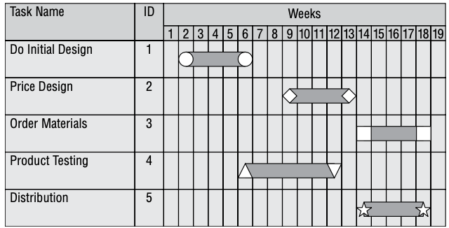
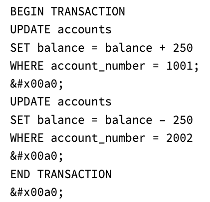

# 软件开发安全

{: .no_toc}

## 目录

{: .no_toc .text-delta }

1. TOC
{:toc}

## 软件开发

### 编译型语言

代码需要经过编译器转换成二进制可执行文件。一般软件交付给用户后，用户不能直接查看二进制中的指令，但是可以通过反编译/反汇编来将二进制转换成源代码。

**模糊处理技术**可以增加反编译难度。

C、C++、Java、Fortran 等。

### 解释型语言

源代码中包含用高级语言编写的指令。需要在目标使用命令解释器才能运行。

Python、R、JavaScript 、VBScript 等。

### 面向对象的编程

C++、Java、.Net 等均支持面向对象的编程（OOP object-oriented programming ）。

对象编程的术语解释：

- 消息 Message：给一个对象的输入（发送的消息）
- 方法 Method：一个对象收到消息后如何进行相应（一些内部的代码）
- 行为 Behavior：一个对象的输出，也就是对象对输入进行 Method 处理后的结果
- 类 Class：一系列的 Method 组成的合集
- 对象：对象是类的一个实例，对象=属性+方法
- 继承 Inheritance：某个父类的方法被另一个子类继承时
- 委派 Delegation：某个对象将请求转发给另一个对象。如果某个对象没有处理消息的 method，则需要委派
- 多态性 Polymorphism：对象的特征，当外部条件变化时，多态性允许对象以不同的行为响应相同的消息
- 内聚：Cohesion：相同类中不同方法的目的之间的关联性，当所有方法的目的相似时，则**高内聚，这表示软件设计优良**
- 耦合 Coupling：对象之间的交互级别，低耦合意味着交互少，**低耦合的软件更好**。

软件体系中的内聚和耦合：

- 内聚：反应一个模块内执行多少不同类型的任务，即一个模块包含的功能

- 耦合：一个模块执行时需要与其他模块进行多少交互

高内聚、低耦合的应用模块更利于维护和重用

### 应用开发时需要考虑到的安全

- 输入验证
- 身份验证和会话管理
- 内置 **fail-safe、fail-secure、fail-open** 机制
  - 常见的 fail-safe 为 Windows 蓝屏
  - fail-open 是**低成本**的快速**恢复系统连续性**的方式

## 应用开发控制

### SDLC 系统开发生命周期

1. 项目启动（概念定义）：了解软件的用途和大致的设计，**尽早的进行安全风险分析**
2. 需求分析：确定具体的功能需求，**确定安全需求**（输出功能需求文档，未来的开发以及验收需要参照此文档）
3. 系统设计（功能规范的制定）：定义系统如何设计，比如软件的输入、行为及输出，加入安全的设计（分析潜在的风险和威胁，考虑代码层面去避免这些风险）
4. 设计审查：和甲方确定系统设计是否符合预期，此阶段安全人员也应当参与
5. 软件开发：代码开发，测试，验证
   1. 单元测试、集成测试（软件模块是否可协同工作）、**系统测试**（功能性测试）、**回归测试**（确保系统变更后会重新测试，保证其功能性和安全性和之前一致，输出和之前一致）、性能测试、静态测试（使用自动化工具扫描代码中潜在的问题，比如缓冲区溢出）、**动态测试**（使用安全工具在代码运行时进行检测，发现 XSS 跨站脚本攻击、SQL 注入等问题）**模糊测试**（发送随机的数据验证软件稳健性）、脆弱性测试（通过自动化工具检测常见的漏洞）、接口测试（确保模块按照规范开发，模块间可协同工作）
   2. 验证产品是否满足功能需求文档
   3. 确认项目的目标达成
   4. 认证（certfication）：进行外部安全审查，确保满足安全需求以及安全合规性
   5. **认可**（accreditation）：权威机构声明软件满足安全的需求，**管理层认可**，如果软件存在可接受的风险，管理层也认可接受
6. 上线运行及维护：部署到生产环境中，正确配置安全环境，持续进行安全监控和审计。如果系统发生重大变更，则需要重新进行安全风险评估（第三方评估、甲方认可）
7. 处置：如果系统下线，正确销毁数据（物理破坏、覆写、消磁）

### 项目管理工具 - 甘特图

显示项目进度，进度中有很多条形任务和关联关系。行一般表示任务，列一般表示时间安排。

### PERT 计划评审技术

计划评审技术 Program Evaluation Review Technique

展示不同项目任务间的依赖关系，分析每个模块的大小和需要的人力。进而更好调度开发。	

## 开发模型

### 瀑布模型

如瀑布一样，每个阶段（参见上个章节）逐渐往下执行。瀑布模型下允许出现问题后回到上一个步骤修正，但是如果在末期发现问题，很难回退到开始的阶段进行修正。

### 螺旋模型

如螺旋一样，每个新系统原型的开发都是一个完整的开发流程，然后依次螺旋线进行一个个系统的周而复始开发。

此模型可以在需求发生变化时改进系统，也就是说，将需求变化视为新的需求，再走一次螺旋线。

### 敏捷模型

敏捷宣言：

- 个体与交互 > 过程和工具
- 可正常工作的软件 > 全面的文档
- 客户合作 > 合同谈判
- 响应变更 > 遵循规则

敏捷开发和互联网的小步快跑类似，可以尽早交付对客户有价值的软件，而不被僵化的开发模式束缚。

## 软件能力成熟度模型 SW-CMM Capacity Maturity Model

### CMM

1. 初始级（Initial/Ad hoc）：无组织的方式工作，几乎没有定义软件开发过程。零
2. 可重复级（Repeatable）：有基本的生命周期管理，可以有组织的复用代码。即，重复利用已有资源
3. 定义级（Defined）：开发人员按照一系列正式的、文档化的软件开发过程进行操作。即，参照标准定义的文档
4. 管理级（Managed）：使用定量的方法来了解开发过程。即，有项目管理，定量的管理开发过程，保证软件质量
5. 优化级（Optimizing）：有持续改进的过程。即，能够预防缺陷，存在变更管理

### CMMI

CMM 当前基本被 CMMI 取代，I 表示 integrated，相比 CMM，CMMI 关注于各个过程的集成。

CMMI 五个级别：

1. 初始级（Initial/Ad hoc）
2. 可重复级（Repeatable）
3. 定义级（Defined）
4. 定量管理（Quantitatively Managed）
5. 优化级（Optimizing）

### SAMM 软件保证成熟度模型

SAMM 由 OWASP 维护的开源项目，更关注安全，在 5 个阶段中都会加入安全：

1. 治理（Governance）：目标指定、策略和合规考量，也就是项目启动的调研阶段
2. 设计：威胁评估、安全需求分析、安全架构设计
3. 实施：开发和开发完成后部署中的安全，安全地开发、安全地部署、漏洞管理
4. 验证：安全测试
5. 运营：安全事件检测和响应、环境加固、补丁升级、数据保护

### IDEAL

软件工程协会（SEI）制定的 IDEAL 模型：

1. 启动 Initiating：**概述**业务原因，准备好基础设施
2. 诊断 Diagnosing：分析组织当前的状态，给出一般性的**变更意见**
3. 建立 Establishing：采用上个阶段的建议，制定实现这些变更的**行动计划**
4. 行动 Acting：开始**执行**，制定解决方案、测试、改进和实施
5. 学习 Learning：**分析**最终的结果，确定是否已实现期望的目标

## 变更管理

3 个基本组件，全部和**控制**有关系：

- 请求控制：发起变更的申请，管理者进行成本效益分析，决策要不要进行变更
- 变更控制：进行适度的变更，最小化减少代码变动对安全的影响。比如修改代码
- 发布控制：通过发布控制进行软件发布

## 软件配置管理（SCM）

全部和配置有关系，简单来说，记录配置、控制配置的变化、记录配置变化过程、定期验证配置未被修改：

- 配置标识：记录所有软件的配置，知道原始配置

- 配置控制：确保变更符合预期，即代码及配置符合预期

- 配置状态统计：跟踪所有发生的授权的变更，比如操作录屏

- 配置审计：定期的配置审计，确保生产环境与最早的统计一致，没有发生未授权的变更

## DevOps

Devops 涉及的三波人：

- 软件开发：Software Development
- 质量保证（测试）：Quality Assurance
- IT 运营（IT 运维）：Operations

## 服务水平协议 SLA

确保服务商的服务保持一定水平的方法，通常涉及下列问题：

- 系统正常运行时间（总运行的百分比，比如 99.99%）
- 最大连续停机时间（以秒、分钟为单位）
- 高峰负载
- 平均负载
- 责任诊断
- 容灾切换时间
- 财务和其他补偿措施（比如停机时间过长，减免一部分费用）

## 第三方采购的软件

企业购买的商业产品叫：COTS - Commercial off-the-shelf  商业现货。

SaaS 产品：服务完全由第三方提供，用户通过 Web 直接使用。

## DBMS 数据库管理系统

数据库最关心**完整性**，其次是可用性、保密性

元数据：描述数据的数据：目标定义、转换规则

特点：

- 数据一致性：保证每个数据完整性
- 数据共享：有并发控制，多个用户同一时刻访问数据库
- 数据恢复：通过检查点保证系统在崩溃后可以恢复数据
- 安全控制：限制用户访问

数据库语言：

- 数据定义（DDL）：CREATE、DROP、ALTER
- 数据操作（DML）：SELECT、INSERT、UPDATE、DELETE
- 数据控制（DCL）：GRANT、REVOKE
- 事务控制语句（TCL）：COMMIT、ROLLBACK

## 数据库模型

### 层次数据库

逻辑树结构，包含很多分支，每个分支有许多leaf和数据字段。

需要明确的访问路径，不适合经常更改、适用于经常性查询。

LDAP、注册表均属于此类型。

### 关系型数据库

由行和列组成的二维表，行与列行成一对一的映射关系。行的数量称为**基数 cardinality**，列称为**度 degree**（横行竖列）。

关系型数据库的主要构件是**表**。

键是表中字段的子集，可用于唯一标识记录。当需要交叉引用信息时，可用于连接多张表。比如有销售名单和客户名单两个表，每个销售有自己的 ID（这个就相当于该表的主键），然后在客户名单的表中附加上销售 ID 的字段（为销售分配客户），这样就可以把两张表关联起来。

- 候选键：可用于唯一标识表中记录的属性子集，比如销售 ID 或者邮箱，一个表可以有多个候选键

- 主键：每个表只能有一个主键，比如销售表中销售 ID 是主键，客户表中客户 ID 是主键。主键是人为定位的
- 备用键：主键之外的候选键
- 外键：用于关联两个表的主键（也就是在源表的位置叫做主键，调用的位置叫外键）

### 关系型数据库的完整性

- 实体完整性：每个记录可以由主键来唯一确定
- 语义完整性：符合结构化规则或者数据库的语义规则存放数据，比如 ID 仅能包含数据，不能包含字母特殊符号等
- 引用完整性：如果一条记录的主键被删除，使用该主键的其他表应该删除对应的项目（删除外键）

### 数据库编程接口

- ODBC：开发数据库互联
- JDBC：Java 数据库互联
- OLEDB：对象连接和嵌入式数据库
- ADO：ActiveX 数据对象

### NoSQL

常见的有键值数据库，通过简单的 key-value 形式记录数据，形式简单高效，可存储大量数据

## 数据库安全

### 数据库事务的 ACID 原则

- 原子性 Atomicity：所有修改要么全部提交，要么失败回滚

- 一致性：保证不同数据库中数据的一致性、数据完整性

- 隔离性：交易之间互不影响，比如同时操作一个数据时，只能执行一个事务，另一个需要终结
- 持久性：一旦提交就要保存下来，可通过事务日志（备份）来确保持久性

一个原子性的示例：

- 如果账户 1001 不存在，则第一条不会被执行（忽略），第二条会被执行，整个过程会通过
- 如果两个 Update 间出现错误，则整个 Transaction（事务）回滚

### 完整性相关

回滚：事务失败时回滚，取消更改，恢复到上一状态

提交：执行用户的更改

检查点：按需回退到某个为止

使用锁机制保证多用户的并发操作

### 并发控制

并发性/逻辑控制始终预防性安全措施，可以确保数据在数据库中的信息总是正确的，或者至少保证完整性和可用性。

- **丢失更新**：当两个不同的进程更新信息时，如果彼此不知道对方的活动，会出现丢失更新
  - A 事务**优先级**低，去更新数据，而同时 B 事务优先级高，同时也去更新数据，此时出现丢失更新
  
- **脏读取**：当进程从**没有成功提交**的事务中读取信息时，会出现脏读取
  - A 事务去读某个信息，但是读到的是另一个事务写入的（而该事物还没有提交），此时出现脏读取
  
- **不正确的摘要**：当一个事务使用聚合函数汇总数据库中的数据时，如果此时另一个事务正在对数据库进行修改，这时会产生**不正确的摘要**。

### 污染

多级数据库使用 MAC 强制访问控制，不同安全级别会有不同的安全标签。

当将较高分类级别和较低安全级别的数据混合时，即出现**污染**。

### 数据聚合

为了方便从多个表中获取有用信息，通常会使用**聚合函数**。

聚合攻击：一些数据分散存放时不敏感，但是放在一起会变得重要。聚合的关键词是**获取大量数据**。

解决数据聚合的方法：

- 控制聚合函数的访问
- 使用 View 视图方式禁止用户直接访问数据

*视图是一个或多个表中导出的虚拟表，可以视为原始数据的抽象表现，用户访问时只可以访问视图，而不能直接访问后端原始的数据，因此比较安全）。视图也可以简化常见操作，比如讲一个复杂的聚合函数设置成视图后，未来的查询可以变为 SELECT`*` FROM view*

### 推理

和数据聚合类似，只是加入人的推理能力，一般推理使用**现有的数据**得出。

- 数据库分割：将数据库分成不同的部分
- 噪声和扰动：在数据库中插入伪信息
- 视图：限制权限的一种方式
- 多实例 Polyinstantiation：同一个主键对应多行数据，但是这些数据有安全级别的区分，不同的人看到的结果不一样（可以理解为一种数据混淆的方式），这种方式可以避免因为看不到而推理出机密信息（比如某艘船在雷达显示，但是系统里查不到）
- 数据库分区：把不同安全级别的数据分解存放

### 聚合和推理对比

聚合只是通过低敏感度的数据**组合**出高敏感度的真相。而推理是从部分已知的事实**演绎**出完整的真相。

## 专家系统

包含知识库和推理引擎两个部分。

采用 if-then 的工作逻辑。

专家系统的优势是可以理性的针对状况做出决策。比如银行的信用系统可能就使用专家系统来做贷款决策。或者基于专家系统来分析 IDS 产生的海量日志。

## 恶意程序

### 病毒传播技术

- MBR，在启动介质加载时加载病毒到内存中
- 文件感染：感染可执行文件，在操作系统执行这些文件时生效
- 宏病毒：一些宏脚本语言
- 服务注入病毒：将自己注入 explorer.exe 等基础服务中

### 病毒技术

- 复合病毒：MBR + 文件感染等
- 隐性病毒：修改操作系统，欺骗防病毒软件，隐藏自身的存在
- 多态病毒：每次感染时都修改自己，避免被基于特征的防病毒软件检测
- 加密病毒：使用加密方式防止被检测

### 一些常见恶意软件

- 蠕虫：可以不借助宿主进行**自我复制**，可通过邮件附件、web 等方式传播
- 僵尸网络程序：可能对组织/用户无实质性伤害，当做跳板攻击其他目标
- 木马：**伪装**成另一个程序的程序
- 逻辑炸弹：特定事件发生时，逻辑炸弹被执行
- rootkit：提权工具
- 零日攻击：利用未被别人发现的漏洞，可以使用纵深防御的办法，比如反病毒软件、配置管理、应用程序控制、内容过滤等防护

### 防护手段

- 特征检测：基于 signature 的防病毒
- 行为检测：沙盒分析、静态代码分析
- 行为阻止

EDR：终端检测和响应：超越传统的防病毒软件，支持下列功能：

- 自动分析内存、文件系统、网络活动是否有恶意活动
- 自动隔离可能的恶意活动
- 与威胁情报源集成，了解其他地方的行为
- 与其他事件响应结合，自动化响应

MDR：Managed DR，托管型的 NDR，可以简化安装、配置和监控。

## 应用程序攻击

### 缓存溢出

进行良好的输入验证。

### 竞争条件/竞态条件

Race Conditions

多进程环境下，执行程序前未消除环境的脆弱性分析，导致攻击者读取或写入意外数据，或者执行未经过授权的命令。

解决方法：

- 良好的编程实践，开发培训
- 自动化静态源代码扫描
- 应用程序安全测试

### 检验时间/使用时间攻击 TOC/TOU

进程在被度量前未受攻击，而在度量后遭到破坏，静态度量就会给出错误的结果。简单来说，在两个程序执行的**间隔**更改一些东西，使得后面的程序获得了错误的结果。比如 A 设置 XX=1，中途 C 设置 XX=2，B 在读取 XX 时获取的是不正确的结果。

### 后门/维护陷阱

方便开发后期调试的入口。针对此问题需要做好代码审查，**在投产前删除相关后门**

## Web 安全

- XSS 跨站脚本攻击（Cross-site Scripting）：用户点击授信网站，但是授信网站上存在恶意脚本，这些恶意脚本会在客户端一并被执行。常见的攻击手段：挂马、流量劫持、获取页面数据、获取用户 cookie 等
  - 反射型：用户访问包含 XSS 脚本的 URL，正常的服务器会在响应请求的同事，把 XSS 代码一并发给客户端去执行
  - 存储型：恶意代码放在数据库中，用户访问网页时正常的网站会直接返回恶意脚本
  - 防御手段：做好输入验证

- CSRF 跨站请求伪造攻击（Cross-site Request Forgery）：用户侧存在一些 cookie，Web 网站 A 利用这些 Cookie 来认证用户（可以理解为临时凭证）。用户同时在访问另一个恶意网站 B（攻击者），网站 B 生成一些恶意代码给用户，让用户访问网站 A 然后执行某些任务，站点 A 并不能分辨出请求来自于用户还是攻击者。常见攻击手段：获取用户名数据、更改用户账户信息等
  - 在请求中放入无法伪造的信息，比如随机 token，在服务器端进行 token 校验，如果请求中不存在 token 或者 token 校验失败，则拒绝请求
- 会话劫持：**监听**用户的会话，获取 Cookie，然后利用 cookie 发送请求给网站。
- SQL 注入攻击防护
  - 加强输入验证
  - 使用存储过程：不允许 Client 直接执行 SQL 代码，而是让 Client 提供查询参数，由服务器将参数套入查询模板中执行
  - 参数化查询：把用户输入当成变量参数，加入 SQL 语句中查询

## 安全编码

- 注释：可能被用于分析代码工作逻辑，因此需要保密存储。对于 Web 应用，应该在上线时删除注释

- 避免硬编码密钥

## 其他威胁

- Salami：每次都实施很小型的犯罪，希望加起来不会引起注意。比如某银行职员每次少量转账到自己账户
- 数据欺骗：内部人员在**数据输入**时做了手脚
- 域名抢注：注册和某公司类似的域名
- 垃圾邮件：
  - 防止邮件欺骗：数字签名
  - 防止垃圾邮件：**贝叶斯过滤**
