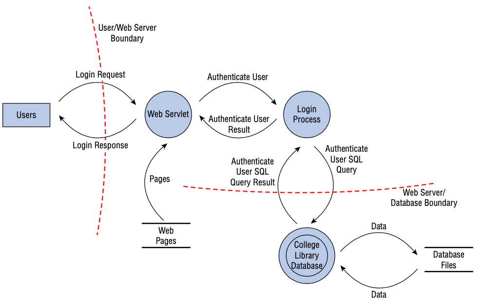
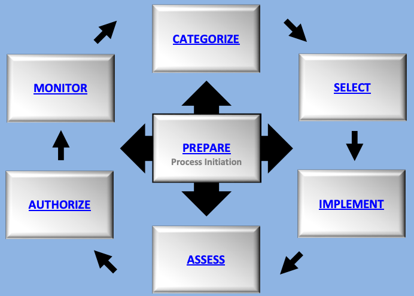

1. TOC
{:toc}

# D1 安全与风险管理

## CIA 

CIA 三性：

- 机密性：和数据泄露有关。

- 完整性：和篡改有关，一般和访问控制/隔离有关。常见的原因可能和用户误操作有关。

- 可用性：和中断有关。

**避免过度安全，安全方案的代价不能高于所保护资产的价值。**过渡保护机密性、完整性会导致可用性受限，过渡保护可用性会使机密性和完整性受限。

CIA 的反面：DAD（Disclosure泄露、Alteration篡改、Destruction损坏） 

### C 机密性保护机制

- 静态数据加密（硬盘加密、数据库加密）
- 传输加密（TLS、SSH、IPSec）
- 访问控制（物理及逻辑的）
- 数据隐藏（防止数据泄露和访问）
- 隔绝：把东西放在不可访问的位置，有严格的访问控制

### I - 完整性保护机制

- 哈希校验（保证数据完整）
- 配置管理（保证系统完整）
- 变更控制（过程完整，比如回归测试）
- 访问管理（防止未经授权的更改）
- 数字签名（代码签名，保证代码完整性和不可否认性）
- 传输 CRC 校验

### A 可用性保护机制

- RAID 冗余磁盘阵列
- 集群
- 负载均衡
- 冗余的数据和电源线路
- 备份
- 磁盘映像
- 灾备站点

### CIA 保护机制

- 纵深防御：分层防御，一个控制的实效不会导致系统或数据暴露
- 抽象：提升效率，相似的元素被放入组、类或角色中，作为集合进行访问控制、限制
- 数据隐藏：防止数据泄露和访问、限制低级别的主体访问高级别的数据、阻止应用直接访问存储硬件、数据隐匿
- 加密：对非预期的接受者隐藏通信的真实含义

## 评估和安全治理原则

安全治理指出于安全需求，**在整个组织中进行管理和治理，而不是仅 IT 部门。**

### 第三方治理

第三方治理：由法律、法规、行业标准、合同义务或许可要求的，由外部执行的监督系统。

**通常是强制性的，涉及审计或监督。**

第三方治理侧重于：验证是否符合声明的安全目标、需求、法规和合同义务。

常见的审计标准有 COBIT（信息和相关技术控制目标）。

### 文件审查

通过文件交换进行第三方的全面审查，文件审查通常发生在现场检查之前，如果文件不合规，则通常现场也不合规。

如果文件不合规则可能吊销 ATO（操作授权，见第三部分）。

## 安全管理计划

目的：安全绩效可测量

安全管理计划要自上而下制定：

- 高层定义阻止安全方针
- 中层讲安全策略完成标准、基线、指南和程序，并监控执行
- 业务经理和安全专家实时配置
- 最终用户遵守组织的安全策略

**类型：**

- 战略计划：大约 5 年的长期计划，愿景计划，计划中包含风险评估
- 战术计划：中期计划（1年），提供更多的细节，包括项目计划、收购计划、招聘计划、预算计划、维护计划、支持计划、系统开发计划等
- 操作计划：短期、高度详细的计划（可实施的文档）。每月或每季度更新

## 组织的角色和职责

在第二部分访问控制中也有数据角色的介绍，可以参照起来看。

### 高级管理者（CXO）

信息安全最终责任人。

### 信息安全专家/安全专业人员

负责落实高级管理者下发的任务。

### 资产所有者

保护信息分类，对资产保护负责，通常是高级管理者。不去执行最终的数据管理，交给托管员执行。

### 托管员

执行最终策略配置的人员。

### 用户

访问数据的人。

### 审计人员

负责检查安全策略是否被正确执行，相关的安全解决方案是否完备。

审计人员在发现问题后会先进行确认，再写入审计报告。

### 安全指导委员会

- 由 CEO、CIO、CFO、部门经理、内审官等组成的委员会
- 每季度召开会议
- 定义组织可接受的风险级别，确定安全目标和战略，制定安全活动优先级，审查风险评估报告，批准安全策略和变更等

### 审计委员会

由董事会指派专人，进行公司内部的审查，审查结果直接汇报董事会。一般 CEO 最适合做审计执行官（职位最高）。

## 安全控制框架

应用最广泛的安全控制框架是 **COBIT**，COBIT 基于六个原则进行企业 IT 治理和管理：

- 为利益相关方**创造价值**
- 采用**整体分析法**
- **动态**地治理系统
- 把治理**从管理中分离**出来
- 根据企业需求**量身定制**
- 采用端到端的治理系统

IT 安全的其他标准和指南：

- ISO 27000 系列，国际标准，企业**信息安全及相关管理实践**标准
  - ISO 27001：信息安全管理体系的标准
  - ISO 27002：信息安全控制措施的更多细节
  - ISO 27004：信息安全绩效
  - ISO 27005：信息安全风险管理
- NIST风险管理框架 RMF：联邦机构的强制要求，包含 6 个阶段：分类、选择、实施、评估、授权和监控

### Due Care

应尽关心：在正确的时间采取正确的**行动**。应尽关注原则描述了一个人应该在一种情况下用正常人**所期望**的相同级别的关注来**响应**。

**如果一个公司没有做到充分的安全策略、适当的安全意识培训，则没有达到 DC。**

### Due Diligence

应尽审查：职责是什么，应该做什么，制定计划。在日常管理中尽到**责任**。应尽职责原则是应尽关注的一个更具体的组成部分，它描述被指派责任的个人应该以应尽关注的方式准确和及时的完成责任。

在做信息安全时，应该尽可能**收集信息**以进行最佳决策，查看并**了解风险**。

#### 谨慎人规则

谨慎人规则要求**高级管理人员为信息安全事务承担个人责任**，为了确保普通，谨慎的个人在相同情况下会表现出应尽关注。该规则最初适用于财务事项，但联邦量刑指南于1991年将其应用于美国的信息安全事项。

## 安全策略、标准、程序、指南

### 策略

**规范化的最高层级文件被称为安全策略**。

- 方法、规定
- 定义要保护的对象和目标
- 安全框架
- 分配职责、定义角色、明确审计需求、概述实施过程等

#### AUP 可接受的使用策略

属于安全文档的一部分，定义了可接受的绩效级别和期望的行为、行动。不执行 AUP 可能会被警告甚至开除。

### 标准

- **强制性**要求
- **一致性**，比如实施标准，采购标准

### 基线

- 每个系统需要满足的**最低安全级别**
- 一般参考行业标准

### 指南

- 如何实现上面的标准和基线的**建议**，非强制的

### 安全流程（安全程序） SOP

Standard Operating Procedure，**详细的分步实施文档**。

可以是整个系统的部署操作，也可以是单个产品的。

## 威胁建模 - 关注威胁

威胁建模是识别、分类和分析潜在威胁的过程。贯穿系统的整个生命周期。

- 主动式：在产品研发阶段进行威胁建模

- 被动式：在部署后执行
- 主动式和被动式都需要，因为并不是所有的威胁都能在开发阶段识别。

### 1. 识别威胁

关注资产、关注攻击者关注软件。

威胁建模的最终目的：**对危害组织有价值资产的潜在威胁进行优先级排序。**

#### STRIDE 威胁分类

微软开发的。

- 欺骗 Spoofing
- 篡改 Tampering
- 否认 Repudiation
- 信息泄露 Information Disclosure
- 拒绝服务 DoS
- 提权 Elevation of Privilege

#### PASTA 威胁建模

以风险为核心。

#### Trike 威胁识别模型

#### VAST 敏捷开发威胁建模

### 2. 确定潜在的攻击

绘制**数据流图**。确定每个环节涉及的技术，可能受到的攻击类型，比如逻辑、物理、社会工程学攻击等。

### 3. 简化分析

**分解数据流图中的应用和环境。**更好地了解产品逻辑、内部单元、交互等等。

分解过程需要关注 5 个要素：

- 信任边界：信任级别、安全级别**发生变化**的地方
- 数据流路径：两个位置间的流动
- 输入点：接收外部输入的地方
- 特权操作
- 安全声明和 Method （方法）

### 4. 优先级排序和响应

对威胁进行评级和排序，使用 DREAD 评级方案。

DREAD 总分 100 分，包含**发生可能性*潜在损失** 。其中每个值都是 1~10，10 表示最高。

DREAD 关注下列 5 个问题：

- 潜在破坏（损失）
- 受影响用户（损失）
- 复现率（概率）
- 漏洞可利用性（概率）
- 漏洞发现难易度，可发现性（概率）

#### 风险矩阵/风险热图

## 供应链风险管理

SCRM Supply Chain Risk Management

目标：确保所有供应商和环节都是可靠的。

重点：对供应商进行评估、持续监控和管理

SLR 与 SLA：

- SLR：服务级别需求
- SLA：服务等级协议，规定最低的安全要求
- SLR 产生 SLA

## 人员管理

### 1. 岗位描述和职责

- 确定岗位描述清单，比如角色和要执行的任务
- 日常的具体工作内容，访问其他资源的权限

### 2.人员筛选、调查和招聘

- 背景调查：减少风险、减少招聘成本、降低员工流通率
- 资质考核

### 3. 人员录用（onboarding）

- 签署雇佣协议
- 入职培训（认同企业文化可以减少离职率）
- 保密协议签署：保护公司敏感信息，入职时签署，离职重申
- 遵守 AUP（定义公司的安全标准，即哪些活动可接受，哪些不行）
- **为用户创建账号（Provision）**，并分配相应的访问权限

### 4. 员工监督

- 岗位轮换（防串通，防滥用）
- 交叉培训（A/B 角色）
- 员工评估：针对关键角色进行全面评估，针对其他员工抽查

- 审查员工，早期发现可能对安全造成风险的行为
  - 不满的员工
  - 强制休假（强制审查，一般表示有不好的行为发生）

### 5. 离职

- 禁用、删除用户账号
- 撤销证书
- 取消访问代码权限
- 解雇过程需要安全部门和 HR 参与，尊重员工的同时降低风险，离职面谈需要重申之前签署的安全协议

### 第三方人员管理

- 签署 SLA，SLA 需要包含安全改进相关的内容（保密相关仍然需要签署 NDA，SLA 不能满足）
- 使用 VMS 供应商管理系统

### 合规策略

在人员层面，合规=员工是否遵循公司的策略。

合规是一种**行政或管理**形式的安全控制。

### 隐私策略

隐私内容包含：

- 未授权访问个人可识别信息（PII），例如电话号、地址、IP 等
- 未经授权的个人机密信息访问
- 未经同意的监视

要遵照法律要求保护和存储隐私数据：

- HIPAA 健康保险流通与责任法案
- SOX 萨班斯-奥克斯利法案
- **FERPA 家庭教育权利和隐私法案**：学生相关的数据
- GDRP 通用数据保护条例

## 风险管理 - 关注资产

风险管理的目标：**将风险降至可接受的水平。**

绝对安全的环境是不存在的，需要平衡收益/成本，安全性/可用性。

风险来自很多方面，可能是非 IT 的灾难，比如自然灾害等。

风险管理包含两大部分：

- 风险评估/风险分析：基于价值/性质分析每个系统的风险
- 风险响应：使用成本/收益的方式评估风险控制措施

### 风险相关的术语解释

- 资产：可以是业务流程或者使用到的任何事物，可以是有形的也可以是无形的
- 资产估值 AV：资产对应的货币价值，综合重要性、使用情况、成本、支出等元素得出
- 威胁：可能导致资产破坏、变更、泄露等的行为
- 威胁主体：主体利用威胁来危害目标
- 威胁事件：对脆弱性的意外和有意利用
- **威胁向量（Threat Vector）**：攻击者为了伤害目标而使用的路径和手段，比如 Wifi、物理访问、社会工程学等
- 脆弱性：资产中的弱点，使威胁能够造成损害的缺陷、漏洞、疏忽，可以是技术上的，也可以是管理逻辑上的
- 暴露：资产丢失暴露的**可能性**
- 风险：
  - 风险=威胁*脆弱性
  - 风险=损害的可能性*损害的严重程度
- 攻击：威胁主体进行的脆弱性利用**尝试**
- 破坏：成功的攻击

### 1. 风险分析

风险分析的目标是：**确保只部署具有成本效益的措施**。

#### 定性风险分析 - 基于定性的更容易分析

基于**分级**来进行。基于场景，而非计算，依赖经验和判断。

- 场景：针对单个威胁的描述
  - 通常比较概要，限制在一页纸，方便参与的人分配等级
  - 威胁如何产生
  - 对组织带来的影响
  - 可能的防护措施
- Delphi 技术：**匿名**的反馈和响应
  - 对于每个反馈，参与者通过数字消息匿名写下反馈，最后汇总给风险分析小组，重复这个过程直至达成共识

#### 定量风险分析

几个关键词：

- AV 资产价值
- EF 暴露因子：潜在的损失，**EF 仅表示单个风险发生时对整体资产价值造成的损失**（比如硬件故障带来的损失），以百分比计算
- SLE 单一损失期望（Single Loss Expectancy）：SLE = AV * EF
- ARO 年发生率
- ALE 年度损失期望

ALE = ARO * SLE = **ARO * AV * EF** 

#### 定性分析和定量分析的对比

| 特征                 | 定性分析 | 定量分析 |
| -------------------- | -------- | -------- |
| 使用数学计算         | 否       | 是       |
| 使用成本/收益分析    | 可能     | 是       |
| 需要估算             | 是       | 有时     |
| 支持自动化           | 否       | 是       |
| 涉及大量信息         | 否       | 是       |
| 客观的               | 较少     | 较多     |
| 依赖于专家意见       | 是       | 否       |
| 耗费的时间           | 一般     | 多       |
| 提供有用的意义和结果 | 是       | 是       |

### 2. 风险响应

风险响应的形式：

- **风险缓解：最常用**，通过实施防护措施、安全控制来减少脆弱性，阻止威胁。比如加密和防火墙
- 风险转让：购买服务、保险等。**可以转让风险，但无法转移责任**
- 风险威慑：比如实施审计、监控、警告 banner、安保人员等
- 风险规避（risk avoidance）：灾难避免，比如关闭重要系统以降低安全风险
- 风险接受：可以接受安全风险，通常意味着保护成本>资产价值
- 风险拒绝：不接受但是可能发生，不应该有

残余风险处理（除已经防护的，剩下的风险）：

- **定期**进行评估

### 风险控制的成本和效益

几个关键词：

- ACS （ annual cost of the safeguard）年度防护成本
- ALE 年度损失期望
- 实施措施前的 ALE
- 实施措施后的 ALE

防护措施对公司的价值=**实施措施前的 ALE-实施措施后的 ALE-ACS**

### 安全控制分类

按照方式：

- 管理行政类：数据分类、背景调查、工作说明书、审查、监督、培训
- 技术/逻辑类：IPS、防火墙、IAM、加密
- 物理类：门禁、锁、保安、看门狗、围栏、物理环境入侵检测等

按照作用：

- **预防性控制**：部署预防控制以阻止非预期的或未经授权的活动发生，身份认证、门禁、报警系统、岗位轮换、IPS、培训等
- 威慑控制：锁、保安等，可能和预防性的重叠
- **检测控制**：保安、IPS 、审查
- 补偿控制：另一种控制手段的补充或增强，比如主要手段是防止删除，补偿手段是存在备份可恢复
- **纠正**：例如杀毒、阻止入侵行为、备份恢复等，**将环境从非预期的活动中进行恢复**
  - 恢复性控制：纠正的扩展，不像纠正是单一的行为，恢复性可能更复杂，**安全策略被破坏后，恢复控制尝试修复或恢复资源、功能和能力**
- 指令式/指示控制：比如通知、公司标准等，强制或鼓励主体遵守安全策略

### 安全控制评估 SCA

Security Control Assessment

**根据基线**或可靠性期望**对安全机制的正式评估**。可作为渗透测试报告的补充。

目的：**确保安全机制的有效性**。评估组织风险管理过程中的质量和彻底性，生成已部署安全措施的**优缺点报告**。

对应的标准为 **NIST SP 800-53 Rev5**，信息系统和组织的安全和隐私控制。

### 风险管理成熟度模型 RMM

Risk Maturity Model

RMM 5 个级别：

- 初始级 （ad hoc）：混乱的状态
- 预备级（Preliminary）：初步尝试遵守风险管理流程，但是每个部门执行的风险评估不同
- 定义级（Defined）：在整个组织内使用标准的风险框架
- 集成级（Integrated）：风险管理集成到了业务流程中，风险是业务战略决策中的要素
- 优化级（Optimized）：侧重于实现目标，而不是被动响应

### 风险管理框架 RMF 

Risk Management Framework，被 **NIST SP 800-37 Rev2** 定义。

风险框架用于评估、解决和监控风险的指南或方法。

**1+6个循环的**阶段：先进行准备，准备上下文和优先级（优先处理哪些系统）

- 分类：根据对损失影响的分析，对信息及系统进行分类
- 选择：选择合适的控制手段，可以将风险降到可接受水平
- 实施：实施上面描述的控制
- 评估：确保控制实施到位（也就是检查）
- 授权：在确定风险可接受的基础上，授权上线（类似于认可）
- 监控：持续监控系统，保证控制的有效性

## 安全培训 SAET

Security Awareness, Education, and Training Program

### 意识

- 建立对安全认知的**最小化通用标准**或基础
- 教学、视频、海报、媒体等

### 培训

- 培训是指教导员工执行他们的工作任务和遵守安全策略
- **定期**的培训，加强人员安全意识
- 最好是强制的培训

### 教育

- 教育是一项更详细的上作，用户学习的内容**比**他们完成其工作任务实际**需要知道的内容多得多**
- 教育可能是获取资格认证的培训，或者和晋升相关的教育

### 改进

- 培训完成后需要做的
  - 制定改进计划、下一步计划

### 有效性评估

- 考试
- 审查事件日志，了解违规发生率

## 业务连续性计划 BCP

**BCP 和业务中断有关。**关注上层，以业务流程和运营为主。

**DRP 容灾恢复计划 - 和数据恢复有关。**更具细节，描述站点恢复、备份和容错等技术。

BCP 四个阶段：

- 项目范围和计划
- 业务影响分析 BIA
- 连续性计划
- 计划批准和实施

### 1. 项目范围和计划

- **首要职责，组织分析**：了解部门职责
- 选择 BCP 团队：包括业务、法务、IT、安全、公关、财务、高层代表等
- 资源需求：有人员需求和财务需求（购买软硬件）
- 法律和法规要求

### 2. 业务影响分析 BIA

目的：识别关键业务功能及这些功能相关的 IT 资源，分析中断的影响。

支持定量分析和定性分析，**BCP 通常喜欢使用定量分析，从而忽略定性分析，BCP 团队应该对影响 BCP 过程的因素进行定性分析。**

#### 1, 确定优先级

定量分析：

- 确定资产价值 AV
- 确定 MTD 最大容忍中断时间
- RTO 应该始终小于 MTD（MTD = RTO + 业务确认的时间 WRT）

#### 2, 风险识别

识别自然风险和人为风险：

- 暴雨、累计、地震、火山、流行病等
- 恐怖袭击、火灾、互联网终端等

#### 3, 可能性评估

确定每种可能性发生的概率，确定 ARO 年发生率。

#### 4, 影响分析

年损失期望 ALE

ALE = SLE *ARO = AV * EF * ARO 

#### 5, 资源优先级排序

### 3. 连续性计划

- 策略开发：
  - 目标、范围、需求
  - 基本的原则和指导方针
  - 职责
- 预备和处理：
  - 制定具体的流程和机制来减轻风险
  - 人员优先
  - 建筑设施的保护，比如加固，或者备用站点
  - Infra 保护，包括冗余设施，物理性的加固（UPS 及防火等）

### 4. 计划批准和实施

- 计划批准：计划得到上层的认可，展示业务领导对于业务连续性的承诺，在其他人员眼中更具重要性和可信度
- 计划实施：
- 培训和教育：培训的目的是让相关的人熟悉其职责，以及操作步骤

### 5. BCP 文档

- 文档化可以防止执行时偏离
- 文档包含**重要性声明**
- **优先级声明**
- 组织职责声明：重申组织对业务连续性计划的承诺
- 紧急程度和时间限制要求（时间表）
- 风险评估的内容
- 风险接受、风险缓解的内容，比如哪些风险可接受，哪些风险不可接受需要采取缓解措施
- 重要记录：标识
- 应急响应指南
- **定期维护**
- 测试和演练

## 法律法规

### 知识产权 IP - 保护创作者

保护创作者，软件属于知识产权。

作品在创作的那一刻即拥有版权。

仅有源代码属于知识产权，代码使用的逻辑不属于知识产权。

#### 《数字前年版权法》

受保护的类型：

- 文学作品（计算机软件属于此分类）
- 音乐作品
- 戏剧作品
- 哑剧和舞蹈作品
- 绘画、图形、雕刻作品
- 电影和其他音响作品
- 声音录音
- 建筑作品

版权的保护期：

- 单个或多个作者：最后一位作者去世后 70 年内
- 因受雇而创作的作品：作品第一次发表 95 年，或者创建之日起 120 年，**其中较短的一个**

数字化相关：

- 针对 DVD 等违权最高判处 100w 美元和 10 年监禁
- 使用 ISP 线路违权时，ISP 承担责任。但是对于用户的临时性活动不负责（比如临时发送一些东西，不知道目标人）

### 商标

商标不需要注册即拥有版权。

目的：

- 辨识公司及公司的服务和产品
- 避免市场混乱

### 专利 - 保护作品

保护发明者的知识产权。自首次申请发明起，有 20 年有效期，发明者有该发明的独家使用权利。过期后即可允许任何人使用，比如 PGP 使用的 IDEA 算法。

三个重点要求：

- 发明具有新颖性
- 发明具有实用性
- 发明具有创造性

### 商业秘密

对于公司很重要的知识产权，不能外泄。

通常公司自己持有，不做专利保护，严格限制访问，加密存储。

### 隐私法案

个人数据的使用原则：

- 收集个人数据需要征得主体的同意，并告知用途
- 只收集和用途有关的数据
- 只在用途所需期限内使用和保存

#### 第四修正案

保护公民隐私，防止未授权的搜查、窃听。

#### 1974 隐私法案 - 仅适合联邦政府

限制联邦政府机构在没有事先得到当事人书面同意的情况下向其他人或机构透露隐私信息的能力。

#### 电子通信隐私法 ECPA

Electronic Communications Privacy Act

适用于非法窃听、非授权访问电子数据的行为。

针对手机的窃听，处以最多 500 美元和 5 年监禁。

#### 通信执法协助法案 CALEA

Communications Assistance for Law Enforcement Act

修正了 ECPA，允许在法院同意的情况下由执法人员进行窃听。

#### 经济间谍法案

Economic Espionage Act

任何窃取专有信息（Confidential、Property）的行为视为间谍行为。

#### GDPR 通用数据保护条例

GDPR 用于替换之前颁布的 DPD。

GDPR 的一些主要规则：

- 合法、公平、透明：必须对数据处理活动保持公开和诚实的态度
- 目的限制：必须清楚记录和披露使用数据的目的，而且按照披露来使用数据
- 数据最小化：确保处理的数据可以满足既定目的，并且仅限于你使用这些数据
- 准确性
- 存储限制：仅在合法、公开目的所需的时间内保留数据，遵守“遗忘权”，允许人们在不需要时删除这些信息
- 安全性
- 问责性

GDPR 数据保护：

- 去标识：
  - 假名化（Pseudonymization），指在不使用额外信息时不能追溯到个人，过程可逆，比如有对应的 key 时
  - 哈希、加密
- 匿名化（Anonymization）：数据无法再和个人关联，匿名化的数据不再是个人数据
- 及时通知：
  - 如果发生个人数据泄露，72 小时内要通知监管机构
  - 如果造成了高风险，还需要通知数据主体

任何违反 GDPR 的违法行为将导致最高 2000 万欧元或母公司所有营业额 4% 的罚金，二者取金额大者。

**GDPR 对于个人数据的定义：**

是指任何指向一个已识别或可识别的自然人（“数据主体”）的信息。该可识别的自然人能够被直接或间接地识别，尤其是通过参照诸如姓名、身份证号码、定位数据、在线身份识别这类标识，或者是通过参照针对该自然人一个或多个如物理、生理、遗传、心理、经济、文化或社会身份的要素。个人信息实例：

- 姓名
- 地址
- 电子邮箱
- 身份证号
- 地理位置
- IP地址
- cookie ID
- the advertising identifier of your phone 广告ID
- 根据用户画像可以确定某一类人的信息

**标准合同条款（standard contractual clauses），或具有约束力的公司规则（binding corporate rules）现已取代隐私盾（安全港）**。

#### 美国 HIPAA 健康保险流通和责任法案 

指定了一系列如何处理健康信息的规定：

- 在确保私密性的情况下保存病人信息档案 6 年
- 新法规强制要求：**第三方商业伙伴**与**数据所有者（实体）**一样，直接受到 HIPAA 和 HIPAA 执法活动的约束，两个公司需要**签署商业伙伴协议(BAA)的书面合同约束**。

HIPAA 使用和披露的原则：

- 基本原则：限定使用，除非签署了 BAA；个人书面同意授权
- **必要的披露**：
  - 个人（或个人的代表）要求时，专门向他们进行披露
  - 在进行合规调查、审计时
- 经允许的使用和披露：在没有个人授权的情况下，出于下列目的进行使用和披露
  - 对信息主体披露其 PHI
  - 治疗、付款和医疗保险业务
  - 偶然的使用和披露
  - 公共利益或福利活动
  - 为研究、公共卫生或医疗保险业务而进行的有限数据集
- 经信息主体授权的使用和披露：所有上述定义之外的用途，都需要经过个人的书面同意
- 将使用和披露限制在最低限度（数据最小化原则）

#### 健康信息技术促进经济和临床健康法案 HITECH

HITECH 是 HIPAA 的修订，新增了泄露通知，如果发生泄露，则必须讲信息告知受影响的个人，当信息泄露超过 500 人时，必须通知卫生与社会服务部门和媒体。

#### 1999 GLBA 金融现代化法

金融现代化法（GLBA)对金融机构制定了严格的隐私法规，**包括向客户提供隐私书面通知**。

#### 加拿大隐私法 PIPEDA

Personal Information Protection and Electronic Documents Act

PIPEDA 不适合于非营利组织、市政府、学校和医院。

包含下列个人数据：

- 种族、民族、宗教
- 年龄、婚姻情况
- 医疗、教育、工作经历、财务信息
- DNA
- 身份证
- 员工绩效记录

# D2 资产安全

## 资产识别和分类（Classification）

数据始于创建，结束于销毁时，实现**数据生命周期管理的第一步是对信息和资产进行识别和分类**。

### 信息分类的作用

按照数据的价值，内容敏感程度、影响和分发范围进行分类。进而可以针对不同级别的资产进行保护。

### 什么是敏感数据？

敏感数据是指**非公开的数据**，包括机密、私有、受保护的资产。

- **个人身份信息 PII**。NIST SP 800-122 个人身份信息保密指南提供了如何保护 PII  的信息。
- **受保护的健康信息 PHI**（Protected Health Information），HIPAA（健康保险流通与责任法案）是保护 PHI 的一种法律
- **专有数据**：任何可以帮助组织保持竞争优势的数据。可以是源代码、技术设计、内部流程、知识产权、商业机密等

### 数据分类（了解）

一般按照数据丢失后带来的损失来定级。按照级别，级别越高，数据越敏感。

#### 政府分类

- Top secret：绝密，示例：国家安全相关的信息。**泄露会导致特别严重/异常严重的损害**
- secret：秘密，**泄露会导致严重的损害**
- confidential：机密，**泄露会对国家安全导致损害**
- Sensitive but unclassified：SBU，敏感但未分类
- unclassified：未分类

#### 非政府分类

- Confidential/proprietary：机密/专有
- Private：私有，例如，源代码
- Sensitive：敏感，一些创意，邮件等
- Public：公开

### 资产分类

资产分类应该与数据分类相匹配。比如存放敏感数据的计算机应该也贴上计算机的标签。

## 数据状态和安全控制

数据在不同状态的风险是不一样的。

### 静态数据安全

- 硬件介质加密，比如加密 U 盘

- 软件介质加密，比如 PGP 全盘加密

- 文件级别加密，压缩软件自带的加密等
- 严格的访问控制
- **加密是最有效的防丢失方式**

### 动态数据安全（传输中的数据）

- 链路加密：IPSec

- 端对端加密：TLS
- 邮件使用 PGP 或 S/MIME

### 使用中数据的安全

- 安全编码规范：以 owasp 模型为基础与规范进行编码

- 防御控制点：输入验证、错误处理、API 验证、代码评审

- 侧信道攻击：例如利用电信号去抓取数据

### 数据防泄漏 DLP

作用：防止企业敏感数据外泄的一类技术。

两种类型：

- 基于网络的 DLP：基于网络进行扫描，可以放在边缘，**扫描离开（出向）的数据**。如果发现 DLP 可以阻止发送，并向系统管理员发送警报，如电子邮件。基于云的 DLP 也属于该分类
- 基于终端的 DLP：可以控制 U 盘拷贝、打印等行为。

DLP 通常可以支持关键词、内容的查找，也支持压缩文件。但不支持加密的数据。

数据防泄漏系统（数据丢失防御Data Loss Prevention）、水印、隐写术都可以防止数据外泄。

### 存储介质降级

如果一些介质本来存放机密的信息，现在想用来存放非敏感的信息，此时牵扯到清楚介质上残留的数据。

企业通常不使用降级的方式，而是直接销毁。这样更安全。

### 销毁敏感数据的方法总结

- 清理/重写 clearing/overwiting ：删除数据本身，用数据覆写，只进行一次，**也不建议**
- 清洗/清除 purging ：删多次，不管用哪种已知方法都无法恢复原始数据，可以和消磁一起使用。**用于在不太安全的环境中重用介质**
- 净化 Sanitization：删除 metadata
- 消磁 Degaussing：仅对磁介质有效，对于 SSD、光盘无效
- 销毁 Destruction：物理或者化学的方式销毁，最安全，比如 SSD，需要销毁成 2nm 或者更小的尺寸

固态硬盘擦除：一般 SSD 会加密，可以擦除密钥来销毁（Cryptographic Erasure），但是这种也不保险，密钥可能在别处有备份，或者长度不够，容易被破解。

捐赠计算机时，如果**有敏感数据应该销毁，而非清除**。

### 资产保留期

记录保留是在需要时保留和维护信息，不需要时销毁。一些法律法规可能会定义数据保留时长。

不应该保留比规定更长的时间。

解除分类：数据不需要再使用，需要将其归档存放，此时可以解除分类。

## 数据保护方法

第一优先级是**加密**。

### DRM 数字版权管理

- DRM 许可证，包含使用条款和解锁密钥（数据是加密的）
- 在线认证：系统需要联网定期进行认证
- 持续审计：检测滥用行为，比如避免同一数据在多个地方使用
- 自动过期：以订阅方式销售，过期后无法访问

### CASB 云访问安全代理

CASB：**Cloud Access Security Broker**

部署在本地或者云端的软件，控制用户对于云资源的访问。

具备认证、授权和控制，确保只有合规用户才能访问。具备 DLP、活动监控等多种功能。

可以避免 Shadow IT 问题，影子 IT 是指未经 IT 部门批准的不知情的资源访问。

### 假名化 Pseudonymization

也就是 Alias，在系统中不真实记录名称，而是用 ID 代替，可以避免直接检索某人的信息。

使用假名化时，则不需要遵守严格的要求（比如 GDPR）

### 令牌化

常用于信用卡系统。

### 匿名化

如果不需要个人数据，可以使用此方式，删除所有相关的数据。

随机屏蔽是一种匿名化数据的方法：比如一个数据库中随机交换列中的数据，总体的聚合结果可能不变，但是单个值差异很大，很难逆向。

## 数据角色 - 分级控制

目的：

- 对敏感的数据进行严格的访问控制
- 职责分离，问责
- 最小权限

### 数据所有者（信息所有者）

Data Owner，对数据负**有最终责任的人**，如 CEO、总裁、部门主管。（Due Care）

所有者如果未能制定和执行安全策略，保护和维持敏感数据，则可能要对其疏忽负责。

NIST SP 800-18 Rev1 联邦信息系统安全计划开发指南，描述信息所有者的下列责任：

- 建立适当使用和保护信息的规则（行为规则 rules of behavior）
- 向资产所有者提供有关信息的安全要求和控制规则
- 决定谁可以访问数据，需要具备哪些权限和特权
- 识别和评估保存数据系统的安全控制

概括：**责任人、数据分级、授权**

### 资产所有者（系统所有者）- 部门主管

指拥有处理敏感数据的资产或系统权限的人员。**可能和数据所有者是同一个人。**

NIST SP 800-18 规定有以下职责：

- 与信息所有者，系统管理员和最终用户制定安全规划
- **维护系统安全计划**，确保系统按照规定部署和运行
- 确保系统用户、支持人员接受了安全培训
- 在发生重大变化时更新系统安全计划
- 协助识别、实施和评估通用安全控制

概括：**确保安全计划和措施可以落实到位**。

### 业务所有者（任务所有者）- 业务部门

Business/Mission Owners

任何处理数据的系统都可以叫做数据使用者。比如 HR 部门会使用 IT 部门管理的平台。

所有者可能要协助 IT 来进行资产的评估。

### 数据控制者 Data Controllers

数据控制者决定**要处理什么数据，为什么要处理这个数据，以及如何处理它**。

### 数据处理者

最终执行数据处理的人，可能是托管的第三方。

例如：员工为了处理工资单的任务，收集员工工资数据，但是最终的处理外包给第三方。

### 数据托管员/管理员

Data Custodians，数据拥有者委派托管员来执行日常任务。

托管员可能执行：

- 备份
- 完整性检查
- 从备份恢复
- 维护数据审计日志

相关角色：项目经理、数据库管理员、开发、数据采集

Administrator，通常数据管理员=数据托管员

### 用户和主体

用户指通过计算机系统访问数据以完成工作任务的人。

**GDPR 将数据主体视为与数据相关的个人。**比如小 A 的 PII，小 A 就是数据主体。

## 安全基线

安全基线确定保护数据的**最低标准**。

# D3 安全工程

## 密码学

### 密码学目标

- 保密性：加密，对称加密和非对称加密
- 完整性：数字签名（digital signature），使用校验确保加密的数据没有被修改
- 身份认证：如果双方具备同一个密钥，则这时候通过密钥加密同一个数据就可以进行身份验证
- 不可否认：可防止欺骗，**只有公钥和非对称加密才可以实现**

### 密码学一些基础概念

- 密码术：创建和执行密码代码和密码技术

- 密码分析：研究如何打败代码和密码
- 密码学：密码术+密码分析
- 密码系统：密码代码具体的实现，可以是硬件或软件

- 单向函数：从输入变成输出后，无法利用输出恢复成输入的内容。公钥基于单向函数
- nonce（随机数）：通过加入随机数的方式加强加密强度。最常见的 nonce 是 IV（初始向量），当同一文件使用同一密码加密时，IV 可以使得每次的密文都不一样
- **零知识证明**：要向第三方证明一件事，但是不能给第三方提供密码信息，此时可以通过数学运算，如离散对数和图论，来证明自己掌握某项东西
- 分割知识：保证权限分散在多个人手里
  - 密钥托管：密码交给第三方保存，当满足一些条件时，第三方可以用密钥来恢复数据
  - N 之 M 控制：密钥分散在多个人手里，只有 M 个人到齐时才能解密
- 代价函数（Work function）：破解一个密码系统需要付出的努力

### 逻辑运算

- 与：两个值都为 1 时，结果为 1，其余结果为 0
- 或：任意一个值为 1 时，结果为 1，其余结果为 0
- 非：一个值的颠倒值
- 异或：两个值一样时（比如 00 和 11），结果为 0，两个值不一样时，结果为 1

### 密码类型

- 移位密码（transposition cipher）：通过重新排列将明文变为密文
- 替换密码（substitution cipher）：使用某些字母替换另外的字母实现，又称**凯撒密码**
- 单次密本（one-time pad，也叫 vernam 密码）
  - 实施得当时**最安全**
  - 加密密钥等于被加密数据的长度，每个密钥元素只给消息的一个字符编码
  - 加密密钥随机生成
  - 每个单词密本只使用一次
  - 单次密本需要在物理保护下严防泄露
- 运动密钥密码（running key cipher）：前面三种的密钥都是手动定义的，运动的则是参照共有的东西，比如书，随机从某段选取使用
- 块密码：在消息块上执行运算，在同一时间对整个消息执行加密算法。**大多数现代加密算法都使用块密码**
- 流密码：凯撒密码和单次密本都属于此类

### 密码学两种基本运算

- 混淆：明文和密钥之间的关系尽可能复杂，很难通过改动明文来确定对应的密钥
- 扩散：明文和密文的关系尽量复杂，明文改动一位会影响多位密文（比如哈希）

### Kerckhoff 原则

科克霍夫原则：只要密钥不被别人掌握，即使关于密码系统的一切都是公开的，密码系统也应该安全。

## 对称密钥算法

对称加密优点：

- 用户只需记忆一个密钥就可以加解密
- 效率高速度快，可以给海量数据加密

对称加密缺点：

- 密钥交换可能存在安全风险
- **不提供不可否认性**
- 缺乏大规模支持，如果多人交互数据，则密钥数会非常多
- 必须经常更换：如果人员有变化，则密钥也需要进行变化

多人时的密钥，总的密钥数可以用（N*(N-1)）/2 来计算，比如 6 个人，总共需要 15 个密钥。

### 密码运行模式

密码运行模式指密码算法为实现抵御攻击，采用的转换数据的不同方式：

无法保证数据真实性：

- ECB 电子密码本：不安全
- CBC 密码块链接模式：每个数据块的加密都要借助上个加密块的 XOR 运算。**会出现错误传播问题**，如果一个块出现问题，后续的块都无法恢复。
- CFB 密码反馈：CBC 模式的流密码版本
- OFC 输出反馈模式
- CTR 计数器模式

具备加密和数据真实性（完整性）保证：

- **GCM（Galois 计数器模式）**：采用了 CTR 加密模式，并添加了数据真实性控制，可确保接收方收到数据的**完整性**
- CCM（带密码块链接消息验证码的计数器模式）
  - **C**ounter with **C**ipher Block Chaining Message Authentication Code **M**ode
  - 结合了 CTR（用于真实性检查）+CBC-MAC（用于数据验证）
  - 仅有在 128-bit block 长度时使用，需要使用 nonce ，而且每次 nonce 需要变化 

### DES 数据加密标准 - 废弃

- **使用 56 位长的密钥**
- 针对 64 位的块进行加密

### 2DES - 会受到中间相遇攻击

### 3DES - 不能满足现代要求

- 3DES 有很多变体
- DES-EEE3 被 NIST 认为是唯一安全的，理论上有 **168 位有效密钥长度**

### blowfish

- 密钥长度 32~448 位
- 使用不需要许可证，比 DES 安全，速度快

### skipjack

- 80 位密钥

### IDEA 国际数据加密算法 

- 以前有专利限制，现在可以随便使用
- 被 PGP 使用
- 128 位 密钥长度

### RC4 - 不安全

- 被集成在 WEP、WAP 和 SSL 中，使用广泛

### RC5

- 块大小可变，32、64、128
- 密钥长度：0~2040

### RC6 - 不常使用

- 128 位块大小
- 128、192、256 位密钥

### AES 标准 - 目前最安全

AES **Advanced Encryption Standard**，高级加密标准，美国从众多算法中选出 Rijndael 作为 DES 的替代，强制规定美国政府使用此算法加密。

AES**默认 128 bit 的块大小，块大小可变，等于使用密钥的长度。**

有三种密钥长度：

- 128：10 轮加密
- 192：12 轮加密
- 256：14 轮加密

## 对称密钥管理/交换

### 密钥交换

对称密钥机制下的密钥管理非常重要，有下列三种方式：

- 线下分发：技术简单，但物理上不方便，而且存在物理上被偷盗的可能性
- 公钥加密：通过公钥加密密码发给对方
- Diffe-Hellman：前两者不能满足需求时，**DH 可以简单安全地传递密钥**。

### 密钥托管

价值：让密钥属于机构，而非个人，在个人离职后，企业可以正常解密数据。

- 公平密码系统：密钥均分成几份，交给多个第三方托管（至少两个机构）
- 通过 N 之 M 控制防止串通

## 非对称加密算法

优点：

- 添加新用户时只需要生成一个公钥-私钥对，密钥数量少
- 移除系统比较简单，只需要移除相关用户的密钥
- 公钥可以随意公开，私钥保持保密
- 不能从公钥推算出私钥
- 具备不可否认性（数字签名）

### RSA

- 三个创始人名称命名，1977 年创立
- 目前比较流行
- 密钥长度相对比较长，有 1024（等同于 EC2 160bit）、2048（等同于 EC2 210bit）、3072

### ECC

- **效率高**
- 160bit 长度 = RSA 1024
- 210bit 长度= RSA 2048
- 256bit 长度 = RSA 3072

### Diffe-Hellman 密钥交换

- 两个人可以生成一个相互知晓，但是不需要经过网络传递的共享密钥
- DH 常用来给传输层 TLS 协商共享密钥
- ECDHE 是 DH 的表中，使用椭圆曲线问题来执行类似的密钥协商

### 量子计算及 QKD

- 量子计算机还未商用，如果商用，可能对当前的 RSA 和 DH 造成威胁，使得这两个算法不再安全
- 量子密钥分发 QKD，基于量子计算机的密钥分发算法，类似 DH，还未到实用的阶段

## 哈希算法（散列函数）

又称消息摘要（Message digests），由哈希算法生成的内容归档（文件校验）。

多数情况下，消息摘要长度是 128 位或更长。

RSA 定义的哈希函数有 5 个基本要求：

- 输入任意长度
- 输出固定长度
- 计算哈希比较容易
- 单向函数，难以根据输出反推出输入
- 避免碰撞，几乎找不到可以产生一样哈希结果的消息（MD5 存在碰撞问题）

### SHA

- SHA-1 已经终止服务
- NIST 定义的 SHA-2 标准有四个变体：
  - SHA-256，利用 512bit 块大小生成 256 位的消息摘要
  - SHA-224：SHA-256 缩减版，生成 224 位消息摘要
  - SHA-512：利用 1024bit 块大小生成 512 位的消息摘要
  - SHA-384：SHA-512 缩减版，生成 384 位的消息摘要
- SHA-3 尚未商用，速度比 SHA-2 慢，**使用 Keccak 算法**

### MD5

- 使用 512bit 块大小生成 128 位的消息摘要
- 存在碰撞问题

### HAVAL

- MD5 的修订版
- 使用 1024 块，产生 128、160、192、224、256 位哈希

### RIPEMD

RIPE 消息摘要，用于替换 SHA，目前应用在加密货币中。

- 生成 128 位摘要，存在一些结构化缺陷，**被认为不安全**
- RIPEMD-128 ，升级版，也被认为不安全
- RIPEMD-160，最新版，**安全**
- 有两个变种，256 和 320，**安全性等同于 128 和 160**

### 数字签名

- 数字签名可以保证消息的完整性和不可否认性，可以避免信息被篡改
- 数字签名原理：计算数据的哈希，然后**将哈希通过自己的私钥加密**，即形成数字签名（数字签名=加密的哈希）

#### HMAC - 一种中间安全性的签名方法

HMAC：基于哈希的消息身份认证码 hashed message authentication code

- HMAC 通过共享密钥来执行签名，即生成哈希后，通过秘钥保护哈希，对方使用共享密钥解密，再校验收到的数据，查看数据是否完整

- HMAC **可以提供完整性保障，但是不能提供不可否认性**，所以使用上有些局限。他介于**不加密**和**使用公钥加密**之间

#### 数字签名标准

NIST FIPS 186-4（DSS）数字签名标准规定，所有数字签名算法需要使用 SHA-3 哈希函数。

DSS 也规定了可用于支持数字签名的几种加密算法（非对称加密）：

- DSA（Digital Signature Algorithm）
- RSA
- ECDSA：椭圆曲线 DSA

### 各种算法的比较

## PKI - 公钥基础设施

Public Key Infrastructure

### 数字证书

证书用来向通信的双方保证对方的身份，证书实际上等于公钥的签名（即 CA 通过自己的私钥给对方的公钥签名）。

证书中包含的数据（X.509 标准）：

- 序号
- 签名算法标识符
- 签发者名称（例如 Let's Encrypt）
- 有效期
- 主体名称（Subject‘s Name：Common Name、Distinguished Name）
- 主体公钥
- 证书目的
  - Computers/machines
  - Individual users
  - Email addresses
  - Developers

### 证书签发机构 CA

Certificate Authority

一些公认的权威机构。比如：

- Symantec（出售给了 DigiCert）
- IdenTrust
- Amazon Web Services GlobalSign
- GoDaddy
- DigiCert
- Trustwave

#### RA - 注册机构

Registration Authority ，分担 CA 签发数字证书前**验证用户身份**的工作。

#### 证书链

通常根 CA 不会直接去签发证书，而是使用中间 CA 签发。

根 CA 会将自己的私钥**离线保存**，私钥用于签发中间 CA。

### 证书生命周期管理

#### 注册

- 获得证书前，需要先证实自己的身份，这个过程称为注册（enrollment）
- 生成证书申请 CSR（certificate signing request），向 CA 提供公钥
- CA 使用自己的私钥为 Client 的公钥签名，CA 根据自己的身份认证级别签发不同类型的证书：
  - DV 域名验证 Domain Validation
  - EV 扩展验证 Extended Validation

#### 验证

- Client 访问 Server 时验证 Server 的证书，此时会用 CA 的公钥（通常内置在浏览器中）来验证服务器提供的证书的数字签名。
- 验证有效期

**证书固定法（Certificate Pinning）**：让浏览器为一个网站**绑定某个证书**（在有效期内长期绑定）。这样当网站证书发生变化时，用户可以注意到。

#### 注销

反证机关有些时候需要吊销证书：

- 证书失信，比如证书私钥被泄露
- 证书误发，比如 CA 未经过适当的验证签发了证书
- 证书细节更改，比如 CN 发生了变化
- 安全关联变更，比如申请证书的对象已经不存在（比如以前用的某人的邮箱）

##### 证书注销列表 CRL

一个证书注销列表，包含证书的**序列号**、注销的生效日期和时间。需要 Client 定期获取最新的，**可能存在滞后期**。

##### 在线证书状态协议 OCSP

提供**实时的**证书验证渠道。客户端收到证书后，向 OCSP 服务器发送 OCSP 请求，服务器把证书的有效状态告诉 Client。

##### 证书装订（Certificate Stapling）

Web 服务器负责和 OCSP 连接，在给 Client 发送证书时同时将 OSCP 的回应发给客户。Client 无需可 OCSP 连接。

### 证书的格式

- 二进制格式 DER（Distinguished Encoding Rules），通常使用 .der ，.crt 或 .cer 后缀 
- 文本格式 PEM（Privacy  Enhanced Mail），通常使用 .pem 或 .crt 后缀
- Windows 的二进制格式 PFX （Personal Information Exchange），通常使用 .pfx 或 .p12 后缀
- Windows 的 P7B 证书，ASCII 格式，使用 .p7b 后缀

## 加密的应用

### 便携设备硬盘加密

- Windows BitLocker、EFS（Encrypting File System）
- Mac FileVault
- 跨平台 VeraCrypt

#### 可信平台模块 TPM

Trusted Platform Module，计算机上一个专用的芯片，可以保存和管理用于全盘加密的密钥。TPM 只有在验证用户身份后才向操作系统提供密钥访问权。

可以防止有人把硬盘拿到其他设备上访问数据。

- HSM 硬件安全模块属于 TPM 的一种实现。HSM 是一种密码处理器，可用于存储密码、提升加密速度，支持数字签名和身份认证，具备防篡改功能，可以避免物理攻击

### 电子邮件安全

重要邮件需要加密、同时签名。

#### PGP

- 商业版本 Symantec 提供
  - 使用 RSA 进行密钥交换，用 IDEA 进行加解密，用 MD5 生成哈希
- 开源版本 OpenPGP
  - 使用 DH 进行密钥交换，使用 CAST 128bit 进行加解密，使用 SHA-1 生成哈希

#### S/MIME

- **加密电子邮件的标准**
- 使用 RSA 算法，通过 X.509 证书交换密钥
- 支持 AES、3DES 加密算法
- 缺点：主流的 Web 邮件系统不支持此协议，需要浏览器插件

### Web 应用安全

#### Transport Layer Security (TLS)

- TLS 1.2 + 1.3 是目前认为安全的

- TLS 由一系列密码套件组成：

  - RSA、DH 和 ECDH 用于密钥交换
  - RSA、DSA、ECDSA 用于身份验证
  - AES、3DES 用于对称加密
  - SHA 的不同长度用于哈希

密码套件示例：TLS_DH_RSA_WITH_AES_256_CBC_SHA384

- DH 密钥交换
- RSA 身份认证
- AES CBC 执行批量加密
- SHA-384 用于哈希

### 隐写术

iSteg，将消息隐藏在图片或音频中。

### 传输加密

- SSH：使用 DH 进行密钥加密
- IPsec VPN

### 轻量级加密

针对移动设备、或者智能卡等低功耗设备，使用硬件加速完成加解密。

### 同态加密

Homomorphic encryption

有时候为了保密需要加密个人信息，但有时候又需要使用个人信息来进行运算。

此时可以使用**同态加密**加密数据，然后使用加密后的数据进行运算，运算出来的结果解密后和明文计算的结果会一致。

相当于可以直接对加密数据进行计算。

## 密码相关的攻击

- **暴力攻击：口令猜解，使用计算能力强的计算机进行破解**
  - 密钥长度每增加一位，破解难度会增加一倍
  - 一般是连续的密码猜解，比如 aaa,aab,aac 这样的（而字典攻击使用常见的秘密，比如 12345, abcde, 0000 等，密码间无关联性）
- 重放：常用于身份伪造，有多种防御方式：
  - 对临时秘钥进行加密
  - 采用挑战-应答机制
  - 为每个会话添加时间戳和超时时间
- 分析攻击：分析算法本身的漏洞
- 实现攻击：找出密码系统在实现过程中的漏洞，也就是加密软件的漏洞
- 故障注入攻击：使用高压电等破坏设备
- **边信道攻击（旁路攻击）：收集处理器的利用率、功耗、电磁辐射等变化发现与加密相关的信息**
  - 计时攻击：边信道攻击的一种形式，利用加密时间来推算加密相关的信息
- **频率分析**和唯密文攻击（ciphertext-only attack）：攻击者只有加密后的密文，英文中常用的字母是 ETAOIN，使用使用频率来猜测加密方式，比如猜测是移位密码还是换位密码
- 已知明文：知道明文和其加密后的结果，猜测加密方式。对于凯撒密码，这种方式很容易攻破
- 部分明文：知道密文对应的部分明文，使用这个明文分析加密方式
- 部分密文（chosen ciphertext）：知道部分密文解密后的明文，使用这个发现加密密钥
- 中间相遇（Meet in the middle）：攻击两轮加密的密码，例如 2DES
- 中间人攻击：介于 Client 和 Server 之间，截获双方的消息
- 碰撞攻击（生日攻击）

## 安全设计的一些概念

### 主体和客体

- 主体：访问对象
- 客体：被访问对象

### 开放系统与封闭系统

- 封闭系统：只与小范围的其他系统一起工作
- 开放系统：使用标准的协议，可以互通，比如 Linux、Win 可以通过 LAN 互联起来
  - 开放系统的安全性取决于**安全和防御规范**
  - 也需要**深度防御**

### 系统的默认配置并不安全

系统的默认配置是为了**减少安装出现的问题**，并不会考虑安全。

不应该信任系统的默认配置。

### Fail-secure

应用应该具备 Fail-safe 或 Fail-secure，比如 Windows 蓝屏。

在开发层面，可以使用 "try...catch" 替换 "if...then...else"。

在不同语境下，Fail-safe 和 Fail-open 表示的含义不一样：

- Fail-open 失效打开：保护人（而非资产）、保持系统的可用性（比如防火墙全通）
- Fail-safe 失效保障：保护人（而非资产）、保持系统机密性和完整性但是失去可用性
- Fail-closed 失效关闭：保护资产（而非人）、保持系统机密性和完整性但是失去可用性
- Fail-secure 失效安全：保护资产（而非人）、保持系统机密性和完整性但是失去可用性

### 零信任

永不信任，始终验证。使用”假设违规“的原则，即认为任何访问都可能是恶意的，在放行访问之前需要做完整的身份认证和授权。

零信任的实现：

- 内部分段防火墙 ISFW
- 多因子身份认证 MFA
- 身份和管理系统 IAM
- 下一代端点安全

**NIST SP 800-207 零信任架构**

零信任三个原则：

- 不应该区分网络位置
- 所有的访问控制都应该是最小权限并严格限制
- 所有的访问都应当被记录和跟踪

### 通过设计保护隐私 PbD

Privacy by Design，在产品设计早期就把隐私保护机制集成到产品之中，而不是在之后添加。

PbD 七项原则：

- 主动而非被动，预防而非修补
- 以默认方式保护隐私
- 隐私嵌入设计中
- 全功能-正和（Positive-sum=双赢），而非零和（zero-sum=要么这个/要么那个)
- 端到端安全-全生命周期保护
- 可视化和透明性
- 尊重用户隐私

## 可确保 CIA 的技术

### 限定 - 限制可以干的事

confinement

- 限制软件的动作。比如让某些软件只能读取磁盘

- **沙箱**：对软件执行最小特权原则
- 防止数据泄露给未经授权的程序、用户或系统

### 界限 - 限制可访问的范围

bounds

- 比如操作系统可以定义软件只能访问某些内存，进程之间隔离

### 隔离

- 不同进程之间隔离，进程只能影响与之相关的内存和资源

### 访问控制

### 信任与保证 - 可信系统

- 可信系统（Trusted System）：系统设计之初考虑到安全性，有安全控制机制，问题不会在事后出现
- 信任：安全机制、功能的体现
- 保证：系统部署的时候是安全的，也要**保证运行的时候是安全的**。**保证必须持续更新、反复验证**

## 安全模型的基本概念

### TCB 可信计算基

Trusted Computing Base

设计原则：硬件、软件和控制的集合体，协同工作， 构成执行安全策略的可信根基。

#### 安全边界

- 安全边界是一个假象的边界，将 TCB 与系统其余部分分开
- TCP 与其余部分通信时需要使用可信路径（Trusted path，或 Secure channel）
- 可信核（Trusted Shell），使主体在不给 TCB 带来风险的情况下执行命令
- 参考监视器：**reference monitor，TCB 的访问控制模块**，负责在授权访问之前验证对每个资源的访问的部分。
- 用于**执行参考监视器**的组件的集合叫**安全内核**
  - 安全内核协调对资源的所有访问请求

*可信路径和可信信道：可信路径可以防止登录欺骗，可信信道使用加密可以防止中间人攻击*

### 橘皮书 TCSEC

- 由 NSA 发布，有 A B C D 四个等级
- D 最低保护，或者**欠缺保护**
- C 自定式保护，系统可以自己决定某些文件的权限，Linux、Windows 属于 C
  - C1，自主安全保护
  - C2，受控存取保护，**比上面的颗粒度更细**
- B 强制式保护
  - B1，标记安全保护
  - B2，结构化保护
  - B3，安全域级
- A 可验证保护

### Bell-LaPadula 模型（BLP）

美国国防部于 176x 提出的模型。高级别的主体可以访问低级别客体的资源，但是也要遵循**因需而知**。

建立在**基于格子的 MAC**、以及**状态机概念**和**信息流模型**上。

**关注机密性**。

**不上读，不下写**：主体不能读高敏感度的信息，主体不可以把信息写在低敏感度级别的客体。

此状态机有三种基本属性：

- **简单安全属性（不上读）**：主体不可读取更高敏感级别的信息
- **\* 安全属性（不下写）**：主体不可把信息写入低敏感级别的客体
- **自主安全属性：系统通过**一个访问控制矩阵执行自主访问控制

### Biba 模型

在 Bell-LaPadula 模型之后被设计。**关注完整性**。

Biba 建立在**状态机概念上**，**基于信息流**，而且是一个多级模型。

**不下读，不上写**：主体不能读低完整性的客体，主体不能修改高完整性的对象。

示例：**Biba 不允许将未经验证的数据写入经过验证的文档。**

Biba模型的属性：

- **简单完整性属性（不下读）**：主体不能读低完整性的客体
- **\* 完整性属性（不上写）**：主体不能修改高完整性的对象

Biba 在设计上解决了三个完整性问题：

- 防止**未经授权**的主体修改客体
- 防止授权的主体**未授权**的修改操作
- 保护内部和外部客体的一致性

### Clark-Wilson 模型

**关注完整性。**可以实现职责分离，只让主体只访问授权的一部分客体内容。

**API 接口属于这种类型。**

使用三元组（访问控制三元组 Access Control Triplet）来进行控制，**主体必须经过程序才能访问客体，无法直接访问客体**。

- 主体
- 软件
- 客体

Clark-Wilson 的数据项和流程：

- 受约束数据项 CDI（constrained data item）：完整性受保护的任何数据
- 不受约束数据项 UDI（unconstrained data item）：不受完整性保护的数据。**任何输入的未经过验证的数据都属于 UDI。**
- 完整性验证流程 IVP（integrity verification procedure）：扫描数据并验证其完整性的过程
- **转换流程 TP（transformation procedure）：允许修改 CDI 的唯一流程**

### Brew and Nash 中国墙模型

- Chinese Wall 模型应用在存在**利益冲突**的组织中。比如 A 公司同时为 B 和 C 服务，而 B 和 C 是竞争公司。此时 A 只能访问其中一家的数据
- Chinese Wall 模型基于 **信息流模型** ，其安全策略的基础是客户访问的信息不会与目前他们先前支配的信息产生冲突。 
- Chinese Wall 安全模型的两个主要属性： 

- - 用户必须**选择一个**他可以访问的区域 
  - 用户必须**自动拒绝**来自其它与用户所选区域的利益冲突区域的访问

### 访问控制矩阵

由主体（第一列）和客体（第一行）和权限组成的矩阵，表示主体对每种客体的访问权限。

- 图中的每一行都表示**能力表**，标识主体可以对哪些客体做什么操作（权限）
- 图中每一列都是一个 ACL 访问控制列表，可以看有哪些主体能访问该客体，以及有什么权限

### 其他模型

#### 状态机模型

无论什么时候都始终安全的系统。

#### 信息流模型

专注于**控制信息的流动，基于状态机模型**。
  - 可以在不同安全级别之间防止未经授权的访问，比如 MAC 常用这个模型
  - 信息流模型可以通过排除所有非定义的信息流动路径来解决隐蔽信道

#### 无干扰模型

大致基于信息流模型，关注的是较高安全级别的系统对较低安全级别系统的影响。

- 一种防止木马、后门、rootkit 等的保护手段

#### 获取-授予模型

有点类似于操作系统的 DAC。

- 获取：被动继承过来的权限
- 授予：主动给别人权限

获取-授予模型基本上有 4 条规则：

- 获取规则:允许主体获取客体的权限
- 授予规则:允许主体向客体授予权限
- 创建规则:允许主体创建新权限
- 移除规则:允许主体移除自己拥有的权限

## 信息系统安全评估模型（对采购的系统进行认证）

### CC 通用准则

Common Criteria，定义了测试和确认系统安全能力的各种级别。

**对应的国际标准为 ISO/IEC 15408**

通用准则的目标：

- 提升购买者对已购 IT 产品的安全性的信心
- 减少系统重认证
- 提升安全评估的效率和效果
- 保证 IT 产品的评估符合一致的高标准
- 推广评估斌提高已评估 IT 产品的可用性
- 受评估对象（TOE Target of evaluation）的功能（functionality）和可信程度（assurance）

CC 的两个要素：

- PP（Protection Profile 保护轮廓）：**客户期望的 TOE 具备的安全要求**，比如要满足 XX 行业标准等
- ST（Security targets 安全目标）：**厂商声称的 TOE 将具备的安全特性**，除了 ST 外，可能产品还会有其他额外的安全特性

**客户购买的一般是 PP 和 ST 最接近的产品。**

定义了 7 个评估保证级别(EAL)，每一级均需评估相关安全功能类。

- EAL1 功能检测
- EAL2 结构测试
- EAL3 系统性测试和检查
- EAL4 系统性设计、测试、审查
- EAL5 半正式设计、测试
- EAL6 半正式验证、设计、测试
- EAL7 正式验证、设计和测试

CC 的问题：

- 不能保证用户对数据的操作也是安全的
- 不涉及管理问题（管理也属于安全的范畴）
- 不包含现场安全评估，不会涉及人员、与组织相关的特定的元素
- 不涉及电磁辐射等的控制
- 没有对加密算法强度的要求

## 操作授权 ATO

Authorization to Operate，取代以前说的**认可**这个词。

授权官员的关键词：**DAA（被指定的批准机构），AA（批准机构），SCA（安全控制评估员）**

- 操作授权=**正式授权可以把具有安全保证的产品投入使用，执行业务任务并接受已识别风险**

- 操作授权一般 5 年期，出现下列情况后需要重新申请：
  - 期限到期
  - 系统发生严重的安全事件
  - 系统发生重大安全变化
- 发生事故后的四种授权决定：
  - 操作授权：风险可控
  - 通用控制授权：继承下来的权限，父已经是 AOT
  - 使用授权：第三方 IT 系统认为自己风险可控，领导接受风险
  - 拒绝授权：风险不可接受

### 认证与认可（以前的说法）

在后面第八章 SDLC 中也会涉及：

- 认证：评定安全机制正常运作，确保满足安全需求以及安全合规性

- 认可：管理层接受认证过程中的调查结果，接受风险，系统可以上线

## 计算机系统中的安全保护

### CPU 保护

保护环：

- 把操作系统中的代码放在如箭靶一样的环中，离中心（0 环）越近，则该代码的优先级越高
- 现代 CPU 有 0~3 四个环
- 0 环：运行 Kernel
- 1 环：除 Kernel 之外的其他操作系统部分
- 2 环：I/O 驱动、协议等存在的地方
- 3 环：其他应用使用的。
- **0~2 工作在内核模式（或特权模式），3 工作在用户模式（User mode）**

进程状态：

- 就绪 Ready：程序准备好，但是 **CPU 不可用**
- 运行 Running：正在运行
- 等待 Wait：进程因为 I/O 等待而**阻塞**
- 停止 Stopped：运行结束

CPU 执行类型：

- 多任务处理（multitasking）：由操作系统调度，在单个 CPU 上同时运行多个程序/进程（在任意给定时间把控多个任务或进程）
- 多核：多核心可以独立或协同工作
- 多重处理（multiprocessing）：多个处理器的系统同时工作，和并行计算有关系
- 多程序（multiprogramming）：类似于多任务处理，由操作系统进行协调，假性地在单个处理器上同时执行两个任务，以提高操作效率。实际上给定时间内程序是一个个执行的，有点类似于见缝插针
- 多线程：在一个进程内执行多个并发任务，相比多进程的多任务处理，性能更好

### 主存储/主内存

类型：

- SRAM：用作 CPU 高速缓存，比如 L1，L2，速度快但是成本高
- DRAM：电容存储器。常说的内存，速度相对慢但成本低，需要定期刷新 RAM 中的内容

内存寻址

- 寄存器寻址：寄存器是集成在 CPU 中的小内存地址，CPU 直接通过寄存器地址读取寄存器中的数据
- 立即寻址：不是内存的寻址方案，而是一种关联数据的方式
- 直接寻址：CPU 访问一个实际的地址，**这个地址必须和执行的指令在同一个内存页面**
- 间接寻址：提供给 CPU 的地址不包含要访问的数据，而**存的是另一个内存地址**，CPU 先获取实际内存地址，再获取数据
- 基地+偏移量寻址（Base+Offset addressing）：使用保存在 CPU 的某个寄存器或指针中的数值，以此作为开始计算的基础地址，然后加上偏移量，计算出内存位置，再获取数据

2017 年针对 CPU 的 Spectre 和 Meltdown 漏洞：

- Meltdown：可以读取系统内核**内存**中的隐私数据
- Spectre：可以读取其他程序的**内存**数据

### 虚拟内存

用于扩展真实内存的可寻址空间。

Linux 的 swap 和 Windows 的 pagefile 均属于虚拟内存。

### 辅助存储设备/二级内存

HDD、SSD、CDROM 等。

需要关心的安全问题：

- 擦除后的数据残留。需要通过净化或者销毁的方式来清除数据
- 丢失问题。全盘加密，前面提到的 TPM 就可以安全加密磁盘

### 发射安全

电信号存在辐射，而这些可以被截获。

解法：

- TEMPEST 是一系列标准，旨在屏蔽建筑物或设备，保护它们不被监听和被动放射收集企图侵扰
- 法拉第笼：在建筑外层包上金属壳，可以吸收电磁信号。法拉第笼允许某些信号放行，比如允许对讲机，但禁止 Wifi
- 白噪声：通过广播假消息来掩盖和隐藏真实信号
- 控制区（control zone），同时使用白噪音和法拉第笼，对特定区域形成保护

### 固件

Firmware，或微码，一般指存在 ROM 中的软件。

存在 Phlashing 或者 Flashing 攻击，即攻击者覆写附件，嵌入恶意代码。

UEFI 的 secure boot ：**启动时检查驱动程序和操作系统是否存在被批准的数字签名**，可防御底层 rootkit 和后门程序。（TrickBot/TrickBoot 就是一种攻击 BIOS/UEFI 的恶意软件）

## 客户端的代码执行

### 历史遗留的技术

- applet：Server 发给 Client 去执行的一些代码，可以释放 Server 资源
- ActiveX：IE 浏览器使用的技术
- Flash

### JavaScript 相关

安全防范措施：

- 更新浏览器到最新
- 执行 JavaScript 的子集，如 ADSafe，SecureECMAScript （服务器端去执行）
- 执行内容安全策略（content security policy）
- 一些浏览器插件  NoScript （Firefox） 、UBlock Origin（Chrome）

## 服务器端的系统

### 并行计算

并行数据系统（Parallel data system）或并行计算（Parallel computing）：同时执行大量计算的计算系统。系统能力超出基本多处理的范畴。

把大型任务划分成较小的元素，每个子元素由不同的处理子系统并行计算。

并行处理，多处理的几个分支：

- SMP（Symmetric multiprocessing）：对称多处理器，比如单台服务器的多个 CPU，共享系统、数据总线和内存资源
- AMP（Asymmetric multiprocessing）：非对称多处理器，每个处理器有自己的操作系统，单独工作，此时可以单独针对每个处理器设置规则，让其只执行某些任务（类似于 K8s 的 label selector）
- MPP（Massive parallel processing）：大规模并行处理，很多 AMP 系统被连接在一起，可能包含数百到上千个处理器

### 网格计算

一种并行分布式处理形式，大量的松散节点，**成员可以随意进入和离开网络**。

缺点：

- 安全性没有保障，每个节点可能查看运行的数据
- 稳定性一般，节点可能不会返回数据，可能需要重复计算
- 可能欺骗网格中的成员

解法：

- 通信加密、强认证、软件检测

### P2P 对等网络

VoIP 或者 BitTorrent 等网络

## 工控系统

工业控制系统 Industrial control system ICS，控制工业流程和机器的计算机管理设备。

包含：

- DCS：分布式控制系统，侧重于流程，状态驱动，适合于有限规模的操作
- PLC：可编程逻辑控制器
- SCADA：检测控制和数据采集，侧重于数据采集，事件驱动，适合于管理地址位置广阔的环境

工控系统的要求

- 高可用，不能随便停机
- 不接受高延迟和抖动
- 响应时间紧迫
- 关系到人身安全

NIST 800-82 工业控制系统安全指南

## 分布式系统 DCE

distributed system，distributed computing environment (DCE)

例如区块链系统，分布式系统一般由冗余性设计。DCE 本身会使用很多其他技术，例如面向服务架构（SOA），虚拟化、SDN、微服务、无服务等。

DCE 通常包含接口定义语言（IDL Interface Definition Language），用于定义客户端与服务器进程之间的接口。

### 数据主权

信息一旦被存储，就要受存储设备所在国家/地区的法律约束。

## 高性能计算 HPC

以极高的速度执行复杂的计算平台，MPP 超算是 HPC 的一种例子。

有三个核心组件都需要以高性能形式提供：

- 计算
- 存储
- 网络

HPC 通常使用 **RTOS 实时操作系统**，这类系统功能很精简，不太会有安全功能，因此需要使用隔离、通信监控等措施，**RTOS 通常运行在 ROM 中**。

## 物联网

安全问题：

- 访问控制（可以通过隔离网络避免）
- 加密（可以通过隔离网络避免）
- **设备补丁和固件管理（最难解决也风险最大）**

解决办法：

- 将物联网设备放在独立的网络中（三个哑路由器  three dumb routers 体系）
- 给系统打补丁
- 限制物理和逻辑访问
- 监控活动
- 通过防火墙过滤

### 边缘计算/雾计算

属于物联网的一个例子。

- 边缘计算：让计算靠近数据。

- 雾计算：在工业物联网中使用，讲传感器、物联网设备、边缘计算设备收集到的数据发到一个中心节点处理，所有这些在一个局域网中。

## 嵌入式设备和静态系统的问题

静态系统：无状态环境或非持久性环境，例如 VDI、无盘系统、本地虚拟机

缺点：

- 大部分设备只关注成本和减少无关的功能，安全功能缺失
- 低功耗，不能使用高端加密
- 缺少密钥管理，有些密钥是硬编码
- 很难打补丁升级
- 没有身份认证

防护手段：

- 深度防御
  - 网络分段
  - 防火墙
  - 划分不同安全等级，低等级不能访问高安全等级
  - 人工执行访问控制、变更管理

## 微服务

属于 SOA 面向服务架构的衍生品，专注于 web 服务。微服务之间通过受限的 API 通信。

## 基础架构即代码 IaC

以前硬件的管理是手动的、直接的，使用 IaC 后可以和软件管理一样，变成自动的、批量、有标准的。

IaC 使用机器可读的定义文件和规则来对硬件实施管理，IaC 包含硬件、虚拟化、存储、SDN 等所有基础架构组件。

IaC 会用到 Puppet 等硬件管理软件。

### 不可变的基础设计

不可变架构，指服务器一旦部署就不可变更。比如运行 K8s 的虚拟机部署后，如果需要变更，则需要部署新的虚拟机，然后替换掉原来的。

优点：

- 可靠
- 一致
- 可预测

## 虚拟化

虚拟化的管理程序一般叫做**管理程序（Hypervisior）、虚拟机监视器/管理器（VM monitor/manager VMM）**。

运行 VMM 的操作系统叫**主机操作系统**，运行的 VM 叫**客户操作系统、虚拟化系统。**

有两种类型的虚拟化：

- I 型：服务器虚拟化的主要类型（VMware ESXi）
- II 型：桌面版虚拟化的主要类型（VMware Workstation）

### 虚拟化安全

- 虚拟化本身不管 OS 的安全，因此 OS 安全需要同样关注
- 要保证主机本身的安全和稳定性
- 做好备份
- 虚拟化系统需要做好安全测试
- 防止虚拟机逃逸
  - 把高敏感度的系统和数据保存在单独的物理服务器（分区保存）
  - 打补丁
  - 监控攻击、漏洞发布

## 无服务 FaaS

FaaS，在需要的时候执行代码，不执行的时候没有任何开销。而 PaaS 一旦部署，就会有相应的支撑环境在运行，即使代码未运行也会消耗资源。

## 移动设备安全特性

### 设备全加密 - 第一优先级

Full device encryption，设备屏幕锁定后，设备不允许物理数据端口传输数据。

### 远程擦除

设备丢失后进行远程擦除，有时候可以不通过网络触发。这不能保证数据不丢失，因为有可能设备 SIM 卡、无线模块被移除，导致无法给设备发送指令，同时删除完后可以用数据恢复软件恢复。最好的办法是加密。

### 远程锁定 lockout

多次密码尝试后锁定，可以防止暴力破解密码

### 通信保护

使用 VoIP 时，进行语音加密，可以防止窃听。

### 存储分段/存储分隔

Storage segmentation。将企业的数据、系统的数据、用户的数据、应用程序分开存放。

同时要**减少在个人设备上存储 PII 等敏感信息**。

手机上如何隔离企业和个人数据：

- 多用户隔离
- 内核级隔离
- 应用级隔离

### MDM 移动设备管理

在公司或个人手机上安装 MDM 软件，提升设备安全线、提供监控和管理移动设备。

UEM （Unified Endpoint management）统一终端管理包含更广的管理范围，包含移动设备、PC、IOT、可穿戴设备、工控系统等。

### 应用程序控制

管理设备可使用的 App，通常由 MDM 来执行，有一个应用白名单，默认拒绝名单外的其他 App 安装。

白名单机制比黑名单安全，也能更好保护设备收到未知威胁。

### 设备身份认证

通常使用口令进行认证、指纹或面纹，一种基础的防护手段。

### 屏幕锁 screen lock

大部分屏幕锁=手势图案解锁，可以换成密码或者指纹等。

### 定位服务

例如 GPS、蓝牙定位、Wifi 定位、移动网络定位等。

地理标记可能被恶意使用，用于追踪个人的活动轨迹。

#### 地理围栏（电子围栏）

指定一个特定的地理区域，移动设备进入该区域后自动执行某些功能，比如禁用摄像头或 Wifi。

### 内容管理 MCM

Mobile Content Management，控制设备对公司资源的访问。内容过滤包括：根据 IP、域名、协议、关键词对访问进行阻止。

### 可移动设备

手机可能支持 microSD 卡、OTG 外接硬盘等，企业需要决定是否通过 MDM 来禁用这些功能。

#### 旁加载

利用网络或者 U 盘把程序拷贝到设备中，应该禁用此功能。

### 禁用无用的功能

### 设备解锁/越狱

越狱 jailbreaking，或 rooting，应该被拒绝，因为这会使得设备更容易被攻击。

但是运营商解锁通常只是让设备支持多个运营商，可以视为安全。

### 设备更新

有些时候设备更新会影响 MDM，需要关注。

### 口令管理

一些设备会用软件实现口令库，口令库会有一个主访问密码。主口令会通过 PBKDF2 或者 bcrypt 转换成加密密钥存储。

## 企业移动设备管理方式

- BYOD：个人设备，可以连接到公司网络，处理公司数据，可能会将个人信息暴露给公司，同时设备本身安全性无法保证。**不安全**
- COPE 公司拥有，个人使用：同上，不安全
- CYOD 自选设备：同上，不安全
- **COMS** 公司拥有移动设备战略（Corporate owned mobile strategy）：**仅公用的设备，最佳选项**

### 一些移动设备管理相关问题

- 数据所有权
- 设备所有权
- 更新补丁
- 是否部署安全软件
- 取证
- 隐私：最好的办法是把企业和个人数据分开
- 设备退役
- 企业内基础架构支撑：比如网络性能、隔离、入侵检测等
- **可接受的使用策略 AUP**：**Acceptable Use Policy**，移动设备部署需要参照公司的 AUP
- 摄像头、录音等：根据企业需求使用 MDM 进行禁用
- WIfi Direct：仅在设备支持 WPA2 WPA3 时使用，否则不安全
- **网络热点/共享：企业应该禁止用户使用**

## 基本的保护机制

### 进程隔离

为每个进程的指令提供独立的内存空间。

- 可防止未经授权的数据访问
- 可保护进程的完整性

一些系统在进程隔离基础上会实现虚拟机，可以为用户和进程提供一个完全隔离的处理环境。例如容器。

### 硬件隔离

使用与有明确分级的环境，比如敏感信息和非敏感信息分开存放，可以减少安全的复杂性。

## 基本的架构缺陷和安全问题

### 隐蔽通道

covert channel，指在非主流的路劲上传递消息的一种方式。**一般不用于通信，目的是绕过系统的访问控制**。

反义词是公开通道 overt channel，公开通道通常会被监视、安全受信。

隐蔽通道有两种类型：

- 计时信道 covert timing channel：
  - 改变风扇转速，快为 1，慢为 0
  - 让灯以某频率闪烁，亮为 1，不亮为 0 
- 存储信道：
  - 将数据写入未被分配的存储区域
  - 把数据写入 HDD 或 SSD 的一个坏块中
  - 把数据写入集群末尾未使用的空间

防护机制：对进程和用户的活动进行审计，分析日志文件。

### 增量攻击

- 数据欺骗（datadiddling）：每次对数据进行很微小、随机或增量的修改，而不是明显破坏整个文件。
  - 加密可以防止此攻击
  - 同时哈希校验可以检查出此攻击
  - 主要由内部人员执行

- 萨拉米香肠攻击（salami attack）：系统定期、常规的从余额中扣除不起眼的金额。
  - 通过职责分离，代码控制可以消除此类攻击

## 物理安全

**首要任务是保护人的生命和安全。要确保设施满足法律法规。**

### 安全设施计划 Security facility plan

通过风险评估和关键路径制定计划。

关键路径分析（critical path analysis）：找出任务关键型应用、流程、运营需要的支撑元素。

### 站点选择

选址优先级：

- 第一安全
  - 治安良好
  - 避免灾难（存在极端天气）
- 其次成本、配置规模

### CPTED 通过环境设计预防犯罪

有目的地对物理环境的设计进行管理、操控和编排，以便减少人们的犯罪活动。

比如：

- 花盆高度不高于 2.5 英尺，防止藏人
- **将数据中心放在建筑的中心位置**
- 安装摄像头，起到威慑作用
- 保持入口畅通和可见性
- 减少入口数量

CPTED 有三种策略：

- 自然环境**访问控制**
- 自然环境**监视**
  - 增加罪犯被观察到的机会
- 自然环境领域**加固**

### 设施安全控制

#### 管理类物理控制

- 设施建造
- 站点管理
- 建筑设计
- 人员控制
- 安全意识培训
- 应急响应

#### 技术类物理控制

- 门禁
- 入侵检测
- 警报
- CCTV
- HVAC（Utilities and Heating, Ventilation, and Air Conditioning）：供暖/冷通风系统
- 电力供应
- 消防

#### 物理类物理控制（现场类）

- 围栏
- 照明
- 门锁
- 出入控制通道（mantrap）
- 看门狗
- 保安

#### 物理类控制的顺序

- 威慑 Deter：监控、门禁
- 拒绝：上锁
- 检测：运动传感器
- 延迟 Delay：入侵成功后，要延迟入侵者闯入，以便人员有足够时间响应
- 判定/评估 Determine：判定事件的原因，根据评估决定需要采取什么措施
- 决定/响应：执行最后的措施，比如灭火

### 设备故障

- MTTF（mean time to failure）：平均故障时间
- MTTR（mean time to repair）：平均修复时间
- MTBF（mean time between failure）：平均故障间隔时间，第一次与后续故障之间的间隔时间

### 数据中心

#### 胸卡

可以表明身份。

#### 智能卡

智能卡可以进行身份标识。但是智能卡需要搭配其他方式，比如输入 PIN。

智能卡相关的短语：

- 处理器 IC 卡
- 集成电路 IC 身份令牌
- ISO 7816 接口的 IC 卡

#### 磁条卡

带可读磁条的 ID 卡，类似于信用卡、借记卡或 ATM 卡。可以存储少量的数据，相比智能卡不安全，容易被复制。

#### 物理入侵检测（盗贼警报）

探测非法活动并警告保安。

- 干式**接触开关**电路，检测门窗是否被打开
- 动作探测器
  - 基于图像的数字动作探测器
  - **被动红外/热量动作探测**
  - **波动动作探测：发送低频超声波或者高频微波信号，监视发射信号中的变化和扰动**
  - **电容动作探测（临近检测）：检查电场或磁场变化**
  - 光电动作探测：可见光的变化，用于没有光线的房间中
  - 被动音频探测器：监听是否有异响
- 入侵警报：
  - 阻止警报：关门，提升入侵难度
  - 驱除警告：拉响警报、打开照明灯
  - 通知警告：入侵者无察觉，但系统会记录并通知安保
- 通过二次检测减少误报：使用**多种**检测方式，比如在动作检测器的时候+摄像头记录，让人辅助确定是否有入侵

#### 电力

电力供应并不是持续和稳定的，可能存在诸多问题：

- 故障：瞬时断电
- 停电
- 电压瞬时降低（sag）
- 长时间电压降低（brownout）
- 电压瞬时升高（spike）
- 涌浪（surge）：长时间高电压
- 合闸电流（inrush）
- 接地：电路中接地导线将电流导入大地

UPS 可以提供数分钟或小时的电力，在使用 UPS 时应该关闭非关键系统。

UPS 两种类型：

- 双变换（double conversion）：交流->电池->交流
- 在线交互（line interactive）：具备涌浪保护器、电池充电/逆变器、电压调节器等。电池平时离线，市电故障后提供服务，**可能存在瞬时中断，影响敏感设备**

最高级别的电力保护是**发电机**，适合于长时间断电。

#### 温度、湿度、静电 HVAC

防止计算机的房间**温度应该在 59~89.6 ℉（15~32℃）。湿度保持在 20~80%**

**常见的 HVAC 空调是正压送风系统。**

#### 火灾

火灾三要素：

- 燃料
- 热量
- 氧气

火灾的四个阶段：

- 空气电离，没有烟雾
- 有烟雾，可以看见烟雾从着火点冒出
- 火灾阶段，肉眼可以看见火灾
- 炙热阶段，温度急速升高，火场中聚集了大量热量，任何可燃物都可能燃烧

火灾及灭火器分类：

| 火灾类别 | 类型                       | 灭火剂                       |
| -------- | -------------------------- | ---------------------------- |
| A        | 普通可燃物，如木材         | 水、碳酸钠（干粉或化学药水） |
| B        | 液体可燃物，如油           | 二氧化碳、哈龙、碳酸钠       |
| C        | 电气火灾，如电子设备引起的 | 二氧化碳、哈龙               |
| D        | 可燃金属导致的             | 干粉                         |

#### 火灾检测手段

- 热激发：检测温度上升。存在**误报问题**
- 火焰激发：检测对火焰的红外热能，**快速可靠，但昂贵**
- 光探测（烟雾探测）：烟雾对于光的阻碍
- 离子化型：**最快速**，使用盖革计数器检测粒子的通过速率

#### 喷水消防系统

- 湿管（wet pipe system）：又称闭式系统（closed head system），水管中一直会有水，存在冻裂的可能
- 干管（dry pipe system）：管道中充满惰性气体，可防止冻裂，但有一定延迟
- **预响应系统（preaction system 最适合人机共存的环境）**：检测到烟雾、热量时清空气体；温度达到一定程度时，喷嘴上的触发器打开，才开始洒水
- 密集洒水系统（deluge system）：使用更粗的管道，可以输送更大的水量。**不适合存放电子仪器与计算机的环境**

#### 气体消防系统

气体不适合于有人的环境。使用高压气体清空环境中的氧气实现灭火，适合于电子设备。

常见类型：

- 二氧化碳：**对人有危害，浓度高于 7.5% 会导致窒息**
- 哈龙 Halon：**已被禁止使用，对环境不友好**
- FM-200（七氟丙烷），哈龙替代品

### 物理边界安全

#### 围栏、门、旋转门、访问控制门厅

围栏：

- 3~4 英尺可以阻止无意的穿越者

- 6~7 英尺难以攀爬，但不能避免翻入
- 8 英尺以上的围栏，外加带刺的铁丝网可以阻止翻入

PIDAS 系统：

- 边界入侵检测和评估系统，通常出现在军事地点和监狱周围
- 8~20 英尺的主围栏，带电或者有触摸检测
- 外围有 4~6 英尺的围栏

门：

- 门是围栏中的可控出入口

- 要和围栏有一样的安全等级，要做好防损害措施
- **数量尽可能少**
- 需要配合保安、摄像头或者看门狗

旋转门：

- 通常是单向门
- 可以使用锁定机制，要求单个人进去前提供密码或凭证
- 可以用于人流控制

**访问控制门厅（捕人陷阱，双重门）**：

- 配置警卫的内、外双层门
- 人员进入后，对目标进行身份识别和认证
  - 如果识别成功则打开内门允许人员进入
  - 如果识别失败，则锁住人，等到警卫到来
- **防尾随，防逼近**

#### 警卫

费用高、可靠性和保护强度低，需要配合其他措施一起使用。

人员需要有背景调查。

### 设施内部安全

- 钥匙
- 电子访问控制锁，输入密码时或者刷卡时打开

# D4 通信与网络安全

## 网络基本概念

### OSI 参考模型

- 应用层：HTTP、FTP、POP3、SMTP、IMAP
- 表示层：关心数据的格式和语法、处理数据压缩和加密，执行**格式转换、编码转换**，比如 ASCII、JPEG、MPEG 等
- 会话层：负责应用之间的连接，RPC、NFS、SQL 等。关键词**Socket、会话**
- 传输层：TCP、UDP、SSL、**TLS**。关键词**TCP 分段、UDP 数据报**
- 网络层：主要负责 IP 转发。IP、ICMP、IGMP、**IPSec**、OSPF、RIP。关键词**数据包**
- 数据链路层：执行 MAC 寻址，ARP/RARP、PPP、SDLC、帧中继。关键词**帧**。（PPTP、L2TP应该也工作在此层）
- 物理层：RJ45。关键词**bit**

### TCP/IP 模型

- 应用层：关注 Session
- 传输层：关注 TCP Connection
- 互联网层：关注 IP
- 链路层：关注 MAC

### IPv4 与 IPv6

- IPv4 长度 32 位，IPv6 长度 128 位
- IPv6 内置 IPsec 安全
- IPv6 内置 QoS

IPv4 私有地址段（可被企业用来承载内网的段）：

- 10.0.0.0 ~ 10.255.255.255

- 172.16.0.0 ~ 172.31.255.255

- 192.168.0.0 ~ 192.168.255.255

### 常见协议、端口

- SSH TCP 22
- Telnet TCP 23

- FTP TCP 20/21

- **SNMP UDP 161**

- TFTP UDP 69

- **POP3 TCP 110**

- **IMAP TCP 143**，比 POP3 安全

- SMTP TCP 25

- DNS UDP/TCP 53

### 哪些设备工作在哪层？

- Hub：物理层

- 交换机：二层数据链路层

- 路由器：三层网络层
- 防火墙：3~7 层
- WAF：七层应用层，但是可以进行网络层的访问控制
- Gateway：七层应用层，用于执行协议和格式翻译（如 API 网关）

### 多层协议

多层封装的协议，例如 TCP/IP、DNP3。

优点：

- 可在更高层使用各种协议
- 可以加密某层
- 灵活、弹性

缺点：

- 允许隐秘通道
- 可以绕过检测机制
- 逻辑上基于边界的网络安全可能实效

DNP3 工控协议：用于电力、水利等系统，用于数据采集和系统控制，常见于 SCADA 设备。

### 融合协议

- MPLS：基于标签转发的二层协议，性能好、有封装（安全）
- iSCSI：在以太网上传输存储 SCSI 协议，运行在三层
- FCoE：以太网上运行光纤通道协议，工作在三层网络层。最早可达 128G 速率

## 网络访问控制 NAC

提供接入认证和授权功能，可以防止未授权设备进入网络。NAC 属于一种**预防**手段。常见的 NAC 有基于 802.1x 的准入系统。

NAC 有接入前控制和接入后控制两种类型：

- 接入前控制：仅有当系统满足安全需求时，才允许接入
- 接入后控制：先接入，有基本的网络连接，如果要访问内网则进行认证。比如访客网络可能使用这种方式。

## 物理层相关

### 异步和同步

- 异步：启动和停止使用分隔符来管理。最常用
- 同步：基于独立时钟或时间戳保证同步，可以支持非常高的传输速率

### 基带与宽带

- 基带：数字信号方式传输，一次传一个信号。基带相比宽带更安全

- 宽带：模拟信号传输，可同时传输多个信号

### STP 与 UTP

- shielded twisted-pair 屏蔽双绞线：外层有箔片用于防电磁干扰
- unshielded twisted-pair 非屏蔽双绞线

双绞线速率：

- Cat 3：10m
- Cat 4：16M，用于令牌网
- Cat 5：100M
- Cat 5e：1000M
- Cat 6：1000m
- Cat6a：10G 

铜缆与光缆

- 铜线：传输距离短，长距离时需要使用中继续放大信号
- 光缆：**抗干扰性强，安全性高**，传输距离远（单模 1 万米，**多模最大 400m**）

### 冲突避免 - LAN 介质访问技术

LAN Media Access 介质访问技术可以用于冲突避免。

#### CSMA

无线 802.11 使用 CSMA/CA，LAN 使用 CSMA/CD。

- CSMA/CA：载波侦听多路访问，仅支持**冲突避免**。代价较高，**每次 CSMA 发现有冲突后停止发送数据**，然后再次进行检测
- CSMA/CD：冲突检测和避免

#### 令牌环 FDDI - 效果最优

Fiber Distributed Data Interface (FDDI)

在一个环形网络中，只有拥有令牌的设备才可以发送报文，这样可以避免冲突。

#### 轮询

在一个 LAN 中一个系统为主，其他为从，主系统轮询查找每个二级系统是否需要传递数据，如果某系统需要传输，则授予传输权限，传输完毕后主再轮询下一个设备。

## 防火墙

部署在网络**区域之间**，可以是不同网段，或者不同安全级别的网络区域。

防火墙通常是**默认拒绝或隐式拒绝**。防火墙**无法防御用户故意的数据泄露**。

类型：

- 静态包过滤防火墙：工作在 3~4 层，是一种无状态防火墙，每个数据包都是单独评估的。不关心 TCP 会话。
- 应用级防火墙（代理防火墙、网关防火墙）：工作在 7 层，可以查看内容，性能一般
- 电路级防火墙（电路代理）：在 5 层工作，SOCKS 是其常见实现方式
- 状态检查防火墙：工作在 3~4 层，也称动态包过滤防火墙
- 下一代防火墙：又称多功能设备（MFD），集成了应用程序过滤、TLS 卸载、深度包检测 DPI、IDS、Web 内容过滤等功能

## 无线网络

- AC（或 WLC）：无线控制器
- AP（或 WAP）：无线接入点

两种 Wifi 部署模式：

- Ad hoc 模式：两台设备直接互联，使用**不安全的 WEP**。建议使用升级版本 Wifi Direct 替代，支持 WPA2 和 WPA3
- Infrastructure 模式：
  - 独立：单独一个 WIFI，没有连接到其他网络
  - 有线扩展模式：将 AP 接入有线网络中
  - 企业扩展模式：部署多个 AP 组成一个较大的网络，每个 AP 使用同样的 ESSID（扩展服务集标识符）
  - 桥接模式：用 AP 来桥接两个隔离的有线网络

两种 SSID：

- BSSID：基站的 MAC 地址，用于区分设备
- ESSID：用户看到的用于连接的 SSID

无线网络速率：

|          | Wi-Fi 代号 | 速率      | 频率            |
| -------- | ---------- | --------- | --------------- |
| 802.11   |            | 2Mbps     | 2.4G            |
| 892.11a  | Wifi 2     | 54 Mbps   | 5G              |
| 892.11b  | Wifi 1     | 11 Mbps   | 2.4G            |
| 892.11g  | Wifi 3     | 54 Mbps   | 2.4G            |
| 892.11n  | Wifi 4     | 200+ Mbps | 2.4G+5G         |
| 892.11ac | Wifi 5     | 1 Gbps    | 5G              |
| 892.11ax | Wifi 6/6E  | 9.5 Gbps  | 1–5 GHz/1–6 GHz |

#### 无线网络认证

- OSA（Open System Authentication）：不进行认证
- WEP：使用 RC4 进行认证和加密，使用静态密钥。很容易被破解
- WPA2（WIFI Protected Access 2）：**使用 AES-CCMP 替代 RC4**，**支持 PSK 和 802.1x 两种认证方式**
  - PSK：使用预定义的共享密钥进行身份认证（家庭 Wifi 常用这种）
  - 802.1x/EAP：集成 Radius 或者 Tacacs+ 进行身份认证（企业 Wifi 常用这种）

IEEE 802.1x 规定使用 EAP 来支持 LAN 连接的认证，802.1x 又称作“基于端口额度网络访问控制”。802.1x 同时支持物理接口的准入（NAC）以及无线的准入。EAP 是个框架，允许新的身份认证技术和已有的无线对接，所以实际上 802.1x 也可以使用下列协议：

- LEAP：思科私有，用于替换 WPA TKIP 方案，已弃用
- PEAP：通过 TLS 封装 EAP，**更为安全**，支持交叉验证。目前企业无线用这方方式最多

#### WPS - Wifi Protected Setup

一键连接 Wifi，简化 Wifi 配置。**WPS 可能面临暴力破解，应该禁用**。

#### 无线天线类型

- **定向天线**：八木天线、卡特纳天线、平板天线和抛物线天线
- 全向天线：**一般为直线**，极天线、基础天线、橡胶鸭天线

### 无线网络攻击

- 战争驾驶（War walking/driving）：某些人搜寻 Wifi 网络的攻击，然后进行攻击，针对 WPA2 比较常见的攻击是密钥重装攻击（KRACK）
- 恶意接入点（非授权接入的 AP）：
  - 通过物理连接在网络中添加 AP，可能是员工为了方便的私人行为，这些 AP 可能安全性不足
  - 复制已有 Wifi 的 SSID 和 MAC 地址，用户可能无意接入此 Wifi（《硅谷》中用的是这种方式）
- 邪恶双胞胎（Evil twin）：创建虚假的 AP，此 AP 克隆真实 AP 的身份。设备可能会自动连接上这个假的 AP
- 阻塞：使用信号干扰
- 初始化向量滥用：针对 WEP 初始向量过短的问题进行攻击，常见工具是 aircrack-ng
- **重放**：重传捕获的信号，期望能和 AP 建立会话，**获得权限**

WIDS 可以用于防范流氓 AP、解除关联、重放攻击。

## 其他无线网络

### 通用无线网络概念

无线电波的工作频率在 3Hz 到 300GHz 之间。

有四种频谱技术：

- 扩频（Spread Spectrum）：通信在多个频率上发生，**并行通信**
- FHSS 调频扩频（Frequency Hopping Spread Spectrum）：在一个频率范围内使用并行传输，一次只使用一个频率
- DSSS 直接序列扩频
- OFDM 正交频分复用：使用数字多载波调制技术，可以使用更小的频率集提供更大的数据吞吐

### 蓝牙

IEEE 802.15，使用 2.4G，速率较低，距离 10m 左右。

**蓝牙弱认证（使用 PIN），不加密，因此不安全**。

#### 蓝牙攻击

- 嗅探攻击（Bluesniffing）：捕获数据包
- 蓝牙攻击（Bluesmacking）：针对蓝牙设备的 DOS 攻击，传输垃圾流量或者干扰信号
- 蓝牙劫持（Bluejacking）：向用户直接发送垃圾消息
- 蓝牙侵吞（Bluesnarfing）：通过蓝牙对数据进行未授权的访问
- 蓝牙窃听（Bluebugging）：允许攻击者通过蓝牙连接远程控制设备的硬件和软件

### RFID

RFID又称无线射频识别，通过无线电讯号识别并读写特定目标数据，不需要机械接触或者特定复杂环境就可完成识别与读写数据。如今，大家所讲的RFID技术应用其实就是RFID标签，它已经存在于我们生活中的方方面面。

类型：

- 无源 RFID：例如公交卡等，工作频率低（低频125KHZ、高频13.56MHZ、超高频433MHZ和 915MHZ），传输距离短
- 有源 RFID：物联网等场景使用，**距离远**

场景：

- **资产库存的跟踪**
- 门禁、考勤系统
- 图书管理系统
- 车辆调度系统

#### 潜在问题

- 物理获取读写器，这样便可以获得 RFID 芯片里的消息
- 被认为**侵犯隐私**，因为 RFID 内有 UUID，这个 UUID 可以被任何读写器读取

### NFC

近场通信（Near-field Communication）：	在非常接近的设备间传输无线信号，是一种 RFID 的衍生品。常见于手机等智能设备。13.56 MHz 工作，通信距离 10cm 内。

NFC 可以像无源 RFID 一样工作，也支持与 PKI 集成。

WPA2 也会用到 NFC 来方便建立 Wifi 连接。

#### NFC 攻击

- 路径攻击
- 窃听
- 数据操作
- 重放

## 蜂窝网络

2G、3G、4G、5G 等。蜂窝网络的无线部分是加密的，但是**数据传输到电线后是明文的**。

5G 可达 10G 的速率，但是传输距离短。

## DNS 及其安全

### DNS 中毒（欺骗攻击）

目标：给 Client 返回不正确的 IP 地址，使得 Client 访问恶意网站。

方式：

- 部署流氓服务器，优先于正常的 DNS 服务器响应客户端的请求
- DNS 污染（缓存中毒），感染 DNS 缓存服务器，使得下游服务器给客户端返回错误的 IP
- DNS 域欺骗（DNS Pharming）：修改 hosts
- 攻击 DHCP 服务器，给用户 PC 发放不正确的 DNS 配置

### 防范机制

- 限制 DNS 区域传送，阻止外部 DNS 到内部 DNS 的 TCP/UDP 53
- 限制外部 DNS 服务，仅使用企业内部 DNS
- 部署 N-IDS 来加强 DNS 异常流量的识别
-  使用 DNSSEC，加强 DNS 的身份验证，使用**数字签名**来保证完整性

### 域名劫持/域名抢注

- 在某域名过期后注册该域名

- 注册和公司域名近似的域名，在用户大意输错 URL 后引流到恶意网站（比如bing.cn）
- 使用同形词，比如在某些语言中 a 和 a 类似，用这个来注册域名

### 利用 DNS 的 DoS 攻击

如果多个 DNS 域名指向同一个 IP，可能造成多个用户同时访问某个 IP，造成该 IP 相关的服务异常。

## 内容分发网络

分散在互联网中的多个节点，可以提供同样的服务。比如视频平台会采用 CDN 来加快本地视频访问。

具有**低延迟、高性能和高可用**等特点。

常见的方案有：Cloudflare、AWS Cloudfront、Akamai、CacheFly、BitTorrent P2P CDN

## 安全通信

### 安全通信协议

- IPSec：主要用于 VPN
  - 使用公钥加密系统来提供加密、访问控制、不可否问性（签名）、消息验证
  - 隧道模式（Tunnel Mode）：加密完整报文，更安全
  - 传输模式（Transport Mode）：只加密数据，不加密源和目标的 IP 头，相比隧道模式安全性差
- SSH：常用语远程连接 Linux 主机
- S-RPC：跨服务调用时进行认证
- SSL/TLS：目前使用的是 TLS，SSL 已经废弃。工作在四层传输层

- Kerberos：下个章节会详细讲

### PPP 点到点协议及身份认证

- 同时支持同步传输和异步传输
- 有很好的扩展性，比如可以在以太网上承载 PPPoE
- 提供了认证协议：PAP、CHAP、EAP 等

#### PAP

使用明文传输用户和密码，**不安全**。两次握手

#### CHAP

挑战-应答身份协议，使用三次握手，传递哈希值来进行验证，可以避免**重放攻击**。

Challenge =服务器发出的随机数，另一端使用此随机数+密码进行哈希，发送响应。

**CHAP 使用 MD5，当前已经被视为不安全**，微软的 MS-CHAPv2 使用增强的算法，比 CHAP 更为安全。

#### EAP

可扩展身份认证协议。一种认证框架，而不是简单的一个协议。

各种 EAP 方案：

- EAP-MD5：基于 MD5 哈希进行弱身份验证，**已被弃用**
- PEAP：通过 TLS 封装 EAP，**更为安全**，支持交叉验证
- EAP-TLS：一个开放的 IETF 标准，用于保护身份认证流量。当 Client 和 Server 均配置数字证书时，可以双向认证，安全性比较高
- EAP-TTLS（EAP Tunneled TLS）：是 EAP-TLS 的扩展，在身份认证之前在端点之间**建立隧道**，确保用户名不是明文传输
- EAP-SIM：通过 GSM 网络认证移动设备的一种方式
- LEAP：Cisco 私有方案，用于替换 WPA TKIP 无线认证方案
- EAP-FAST：Cisco 私有，用于取代 LEAP，目前已被 WPA2 取代
- EAP-POTP（EAP Protected One-Time Password）：支持在多因素认证中使用 OTP 令牌，用于单向和交叉身份认证

### 远程访问安全

远程访问价值：常用的一种运维方式，也是保证在灾难中快速恢复的重要手段

常见远程访问技术：

- 特定服务：将指定服务暴露在互联网，例如邮件系统
- 远程控制：例如 RDP
- 远程节点操作：Remote client 与企业内网建立连接，例如 VPN、拨号网络
- 抓屏/录屏（Screen Scarping）：
  - 虚拟桌面等服务
  - 一种录屏技术，可以通过人机界面进行交互。一般通过 **Web** 进行前端交互，此工具很像一个浏览过滤器，可以从 Google 等地方检索并过滤信息，将有用的信息发送给用户

远程访问安全：

- 访问控制：只有经过身份认证的用户才能访问资源
- 传输加密：所有信息都应该加密，包括认证环节和数据传输环节
- 限制远程访问的数量
- 重要系统避免远程管理，比如数据库

### 语音及安全

#### PBX 安全

专用交换机（Private Branch Exchange），部署在企业内部的电话交换系统，可以使得内部电话共享少数的 PSTN 线路。

存在的攻击：

- 飞客攻击：绕过电话系统的认证，免费拨打长途等（乔布斯曾经干的事）。改变电话服务用哪个，窃取服务，造成服务中断
- 钓鱼攻击：加强意识培训

#### VoIP

将语音数据封装在 IP 包中传输。

存在的安全风险：

- 伪造 VoIP 显示的电话号，**进行钓鱼欺骗攻击（vishing），语音垃圾邮件攻击（SPIT）**
- 呼叫管理系统遭受 DoS 攻击
- 呼叫管理系统和 VoIP 电话遭受主机操作系统层面的攻击
- 通过伪造呼叫管理器或终端连接协商消息，执行中间人攻击
- 如果 PC 和 VoIP 部署在同一台交换机，会发生 **VLAN 跳跃**（一种二层攻击，可以实现跨 VLAN 访问数据）
- VoIP 流量未被加密，流量被窃听

解法：

- **SRTP**：加密、身份认证。SRTP 是 RTP 的加密改良，用在很多 VoIP 中。SRTP 可以防止 DOS、中间人攻击等。RTP 和 SRTP 在 SIP 协议建立连接之后接管。
- 将语音流量和数据流量分开
- 防止物理访问

### 视频会议

缺点：

- 缺少认证，不能保证在会议中的人是本人
- 缺少审计，不能避免用户拍照或者截屏等

### 即时通信

缺点：

- 缺少管理功能
- 缺少企业级认证功能，例如双因子认证
- 存在被窃听的可能
- 存在社会学攻击的可能
- 可能用来传播病毒（和邮件类似）

**企业自建内部 IM 服务器相对比较安全**。

### 电子邮件安全

关于 SMTP：

- SMTP 是一种邮件中继系统，其作用是将邮件从发送者传递给接收者
- 如果要部署一台 SMTP服务器，必须为传入、传出的邮件请求配置正确的强身份认证机制
- 如果 SMTP 邮件服务器在接收并转发邮件前**不对发送者进行验证**，就很容易将 SMTP 邮件服务器变成一台“**开放中继**" (也被称为“开放中继代理”或“中继代理”)，**开放中继是垃圾邮件发送者的主要目标**，垃圾邮件发送者可通过尾随 (piggybacking)技术发送海量的邮件

邮件安全：

- 客户端使用 IMAP 协议比 POP3 安全
- 关闭 SMTP 转发功能
- 服务器数据备份
- 开启黑名单功能
- 通过 **S/MIME** 保证邮件的身份认证（X.509）和加密（PKCS）
- 通过 PGP（Pretty Good Privacy）保证安全：PGP 是一套加密软件产品
- **DKIM（DomainKeys Identified Mail）**：验证域名标识，确定来自组织的邮件是正确的
- SPF（Sender Policy Framework）：用于防止**垃圾邮件和欺骗攻击**。SPF 可以检查发送者是否有 SMTP 域名所属者的授权，可以防止欺骗发生
- DMARC：基于 DNS 的电子邮件身份认证系统
- STARTTLS：建立 SMTP 初始连接后，尝试通过 TLS 协商加密通道，**如果对端不支持，则明文传输**
- 隐式 SMTPS：如果对端支持 TLS，则协商成功，如果不支持，则无法连接。使用 TCP 465 端口
- **使用防病毒软件来扫描附件**

SaaS 邮件系统：

- 高可用、分布式、易于访问、标准化配置
- 可能存在误报问题，阻止正常的访问，速度限制

垃圾邮件：

- 防止邮件欺骗：数字签名
- 防止垃圾邮件：**贝叶斯过滤**

### 传真安全

传真比较容易受攻击：可以**被拦截且容易被窃听**

安全措施：

- 传真机加密
- 链路加密
- 活动日志和异常告警
- **关闭自动打印**功能
- **通过电子邮件接收传真**

### VPN

#### IPsec VPN

- 传输模式（Transport Mode）：只加密数据，不加密源和目标的 IP 头，相比隧道模式安全性差
- 隧道模式（Tunnel Mode）：**加密完整报文，更安全**

传输模式示意图：

隧道模式示意图：

#### Always-on VPN

始终在线 VPN，在某些条件下自动连接 VPN。比如用户通过外部 Wifi 连接网络。这种方式并不安全，因为外部 Wifi 可能被窃听。

#### 隧道分割

- 隧道分割：仅有访问内网的请求经过 VPN 发送到企业，通常这种模式下 VPN 被认为是受信的（然而并非），所以在网络层面不太会配置安全过滤，这就可能导致恶意代码传递、入侵等发生（想象这种模式下是直接把内网通过 VPN 暴露到了互联网）

- 全隧道：所有请求都经过 VPN 发送到企业，**可以被企业的设备进行完整的流量过滤，更安全**

#### PPTP VPN

PPTP 运行在数据链路层，使用 TCP 1723。PPTP 使用 GRE 隧道。**PPTP 初始隧道协商过程不加密**，存在用户名、哈希密码被窃听的可能。

支持下列认证协议：

- PAP
- EAP
- CHAP
- MS-CHAP2

#### L2TP VPN

RFC 2661，运行在数据链路层，**支持任何三层网络层协议**。使用 UDP 1701。L2TP 结合了 Cisco 的 L2F 协议和微软的 PPTP 协议。底层也是有 GRE 隧道的。

L2TP 默认只会加密控制信息（使用共享密钥），用户数据不执行加密，不过可以**通过 IPsec 的 ESP 进行加密**。

L2TP 支持 PPP 的多种认证方式，比如 802.1x

### IPSec 协议

IPsec 不是单个协议，而是一组协议，包括 AH、ESP、HMAC、IPComp 和 IKE：

- AH：身份**认证**头，提供完整性和**不可否认性**。主要提供身份认证功能，实现会话访问控制，避免重放攻击
- ESP：Encapsulating Security Payload，保护载荷内容，提供**加密**和有限的身份认证功能，防止重放攻击。通常使用 AES 算法。
- HMAC：Hash-based Message Authentication Code，使用哈希校验进行**完整性**检查
- IPComp：压缩工具，在 ESP 加密前进行数据**压缩**
- IKE：互联网密钥交换，IPSec 使用 IKE 来安全的进行**密钥交换**

### NAT 地址转换

优点：

- 解决公有 IPv4 地址不足的问题
- 隐藏内网网络真实 IP 地址

缺点：

- 影响 IPSec VPN 工作，此时有个解决方案叫 NAT-T
- 中间人攻击（假设执行 NAT 的设备被监听）

## 安全控制特性

- 透明性：对于用户来说安全设备不可见。比如透明模式工作的防火墙。这方方式更安全，因为对于用户来说更难绕过。

- 传输日志：通信审计技术，记录源、目标 IP、时间、识别码、传输状态、报文数量、消息大小等信息。可用于**故障定位、非法通信追踪**等。

# D5 访问控制

## 为什么要访问控制

- 防止未授权用户对资源的使用
- 防止授权用户对资源的滥用（非法使用）

访问控制的对象：

- 主体：访问对象
- 客体：被访问对象

**什么是资产？**

包含有形的或者无形的东西，有形的比如物理设备，无形的如信息

- 信息：保存在任意位置的信息，比如硬盘中、数据库中
- 系统：一个或多个 IT 系统，比如文件服务器、数据库服务器等
- 设备：任何计算机系统、外部设备等
- 设施：物理场所中的硬件设施
- 应用程序：提供数据访问的服务

## 对资产进行访问控制的大类

### 管理控制/行政控制

- 管理策略
- 管理措施/步骤
- 人员控制
- 安全意识培训
- 监管机构

### 物理控制

- 网络分段
- 门禁、围栏、旋转门
- 区域隔离
- 布线

### 技术控制/逻辑控制

- 身份认证、授权
- 网络准入控制
- 审计

## 身份标识及身份认证

### 1. 标识身份

宣称用户的身份，具有唯一性，可追溯。任何访问控制的第一步都是标识。

身份注册：

- 初始招聘时，通过身份证、驾驶证、护照、出生证明等确定新员工身份
- 入职第一时间为新员工创建账户，可能牵扯到指纹等的录入

### 2.认证 Authentication

核实用户的身份。有三种身份识别方式：

#### 你知道什么？

可以记住的东西：

- 密码：静态密码
- **密码短语 Passphrase**：更容易记住的，根据对个人有意义的短语改编的，比如 !H@ve@C@T
- 认知密码：出生地点、母校、等私人的信息

一般 PCI DSS 建议 90 天更改一次密码，NIST 建议只在密码泄露后更改（也就是认为定期改密码没用）

#### 你有什么？

- 钥匙
- 智能卡：
  - **智能卡一般不能做身份认证**
  - 一般需要输入 PIN 来完成认证
- 口令牌 Token：可以很好**避免重放攻击**
  - 同步口令：每 60s 更新一次，需要时间同步。有硬件设备和软件两种
  - 异步口令：按照逻辑计算，比如每次使用累加计数器。有些一步口令会要求用户输入完用户名和密码后通过**挑战-回应**的方式完成 PIN 生成。
- 短信验证码：被认为**不安全**，建议使用口令牌。

##### 通过 Authenticator App 实现 OTP

OTP：One Time Password

Google Authenticator 等手机 App，可以很容易实现双因子认证，提供 6 位数字 PIN 码。

- HOTP：基于哈希的消息身份认证码（HMAC），类似于**异步动态口令**
- TOTP：基于时间的一次性口令，使用时间戳，如 30s，类似于**同步动态口令**

#### 你是什么？

- 指纹：通常不变，但可以**被仿造**
  - 基于螺纹、脊和分叉来识别（特征点）
  - 时间快
- 面部识别：被认为不安全，精准度低，速度快，失误率，拒认率较高
- 虹膜：眼睛肿位于瞳孔周围的彩色部分
  - **最为准确**
  - 可从远处识别，最大 6~12 米外的地方
- 视网膜：识别视网膜后面的血管，但存在泄露隐私的问题
- 掌纹：利用红外来扫描静脉图案
- 行为特征：
  - 签名分析：签名的速度、方式等
  - 击键动作

##### 生物识别的错误率(准确率)评级

FRR（False Rejection Rate）：**错误拒绝率，也被称为 I 类错误**

FAR（False Acceptance Rate）：**错误接受率，也被称为 II 类错误**

CER（crossover error rate）：FRR 和 FAR 的交叉，交叉错误率。CER 是生物识别的标准评估值，**CER 越低表示识别更准确**。

如果生物识的 FAR 比较高，**最节省成本的方式是添加第二个认证方式**。

##### 生物特征注册过程

- 收集
- 转换，转换成参考模板（Reference Template，又称参考配置文件）存储下来
- 对比

生物特征的删除挑战性比较大。

生物识别的问题（前两项为用户接受生物识别的关键）：

- **注册时间**大于 2 分钟被视为不可接受
- **吞吐率**（扫描主体并通过认证的时间），通常需要在 6s 内，否则难以接受
- 随着时间变化，可能需要定期重新注册

#### 多因素认证

采取三种身份识别中的两种或三种类型。比如密码+指纹。

### 3.身份授权

作用：确定主体对客体可执行的操作。

原则：

- 知其所需
- 最小特权原则

### 4.审计/可问责

审计的主要作用是可追溯性，保证用户可以对自己的行为负责。可问责的前提是要**识别和认证**用户。

审计的内容：

- 时间：时间同步很重要
- 身份主体
- 任务
- 发生了什么

审计最重要的是完整性，需要统一讲日志保存在日志服务器中。

## 身份管理

### 两种身份管理体系

集中式：

- 存在单点的问题，如果失效影响范围大
- 存在隐私问题，如果被攻击，影响范围大
- 可以灵活的扩展来支持更多用户，例如 Windows AD

分布式：

- 可靠性高（注意，不是冗余性高）
- 贴近资源进行访问控制
- 管理开销高，需要同步机制
- 可以减少聚合攻击

*特权蠕变（特权蔓延）：随着工作变化，以前的特权没有被清除，**会出现权限过多的问题***

### SSO 单点登录

目的：

- 实现集中的身份管理
- 一次登录，多次访问资源
- 防止用户因密码管理复杂而将密码记录下来

缺点：如果凭证丢失，则可能访问很多资源

#### 常见的 SSO 机制

- LDAP/集中访问控制：例如企业中的 Windows Active Directory Domain Service（AD DS），是一种基于 LDAP 的 SSO 方式。
  - 多个根域之间可以建立互信（域森林），允许一个域中的用户访问另一个域中的资源。互信可以是单向，也可以是双向
  - 快捷信任：域树或者部分树之间的传递信任，可以缩短信任路径
  - 每个域也可以独立工作，之间建立**外部信任**，属于非信任传递
  - 和 Kerberos 之类的对接，**领域信任**，Windows AD 去信任 Kerberos
- LDAP+PKI：PKI 可以借助 LDAP 来方便 Client 查询 CA 信息
- Kerberos：本地实现 SSO 的一种方式
- 联合身份管理+SSO：将一个系统中的用户身份与多个身份系统**关联**起来。
- 脚本访问：登陆脚本自动传输登录凭据，建立通信链接。这种时候每个客体并没有集中的身份认证，只是脚本实现了类似 SSO 的效果。（类似于堡垒机登录每台 Linux）

### LADP 与 LADPS

*除了 LADPS 外，还有 SASL（ Simple Authentication and Security Layer，RFC 2222）可以实现 LDAP 安全*

| **LDAP**                                      | **LDAPS**                            |
| --------------------------------------------- | ------------------------------------ |
| LDAP 使用 TCP                                 | LDAPS 使用 TLS/SSL                   |
| LDAP 使用 389 端口                            | LDAPS 使用 646 端口                  |
| LDAP 默认不会加密客户端到服务器的消息         | LDAPS 使用 TLS 加密所有信息          |

### 联合身份标识与 SSO

联合身份：将一个系统中的用户身份与多个身份系统**关联**起来。

联合身份认证的类型：

- 和云的联合：通常使用第三方服务来共享联合身份。用户使用企业内的 ID 登陆，企业内的 ID 会与联合身份关联起来，之后用户就可以访问第三方的 SaaS 服务
- 本地联合：两家公司合并，希望实现 SSO，于是创建本地联合身份管理系统
- 混合联合：两家公司合并，同时一家公司已经和云服务做了云的联合，可以构建一个混合的联合
- 准时制（JIT Just-in-Time）：公司和第三方签署保险协议，第三方需要为每个用户创建账号，手动创建管理复杂，所以设置 JIT，员工第一次访问福利平台时，第三方系统自动创建用户账号。一般 JIT 使用 SMAL

### 凭证管理系统

可解决的问题：

- 密码管理
- 多因素认证
- 日志记录，审核
- 密码轮换

W3C 于 2019 年发布了凭证管理系统的 API 规范。很多浏览器已经实现这一系统：

- 用户登录后询问是否保存
- 允许登陆时选择账户，自动填充
- 允许后续自动登陆

#### IDaaS 身份即服务

一种由第三方托管的身份和访问管理系统。例如微软的 Office365，或者 Google 的一个账号访问很多平台资源。

#### 本地凭证管理 App

本地用于保存密码的程序，比如免费的 KeePass，通过主口令解锁，解锁后复制口令到登陆平台。

### 在互联网上实现 SSO

**以下方式也可以实现联合身份认证。**

#### SAML - 互联网上最流行的 SSO 标准

安全断言标记语言，基于 XML 标准，用于在不同域间交换身份**认证**和**授权**信息（AA）。提供支持浏览器访问的 SSO 功能。

SAML 组件：

- 委托人或用户代理：最终用户，比如用户 A
- 服务提供商 SP：启用了 SSO 功能的网站，用户 A 访问 a.com，此时 a.com 为 SP
- IDP：Identity Provider，持有用户身份认证及授权信息的地方。如果此组件出问题则所有用户会受到影响

用户 A 访问 a.com，a.com 要求用户输入凭证，然后将其发给 IDP 进行认证。IDP 可能返回下面几种消息：

- **认证**声明：表示用户已经通过认证，表示 User Agent 登录的时长是多少

- **授权**声明：表明用户是否有权访问所请求的服务。如果无权访问会说明原因
- **属性**声明：关于 User Agent 的任何信息

#### 基于 XML 的其他语言

- SPML：服务提供标记语言，用于 Provisioning 开通
- XACML：描述访问控制（Extensible Access Control Markup Language），
- SOAP：简单对象访问协议，用于任何 XML 消息的传递，本身不是标记语言

#### OAuth

一个开放的标准，Oauth 2.0 是 RFC 6749 中描述的框架，由 IETF 维护。

OAuth 是一个**授权框架**，不是身份认证协议。**使用访问令牌**。

示例：Client 安装 Acme App，此 App 可以和 Twitter 交互并发送消息，点击 App 上的推特按钮后，会打开推特的认证页面，用户完成认证，然后推特通过 API 给 App 返回一个令牌，后续 App 使用令牌往推特发送消息。

第三方联动 **QQ、微信**等应该都使用此标准（此时第三方网站需要调用 QQ 等接口来发送数据，比如同步发朋友圈等）。

#### OpenID

一个开放标准，由 OpenID 基金会维护，提供去中心化的身份认证，允许用户使用一组凭证登录多个不相关的网站，凭证由第三方的 OpenID 托管式提供。使用 RestfulAPI

如果用户访问支持 OpenID 的网站，系统会提示用户输入 OpenID 作为 URI（这种方式并不安全），然后将其重定向到 OpenID 提供商进行认证，认证完成后再返回原来的页面。

#### OpenID Connect（OIDC）

使用 OAuth 2.0 授权框架，同时支持**认证**和**授权**，由 OpenID 基金会维护。

建立在 OpenID 基础上，使用 JavaScript 的 JSON Web令牌（JWT），OIDC 使用 Web 服务来检索 JWT。

Google 的第三方联动使用 OIDC（此时 Google 为认证源，允许其他网站通过 Google 身份来进行访问），使用过程和基于 OAuth 的无太大差别。

**OIDC 使用 OpenID 技术进行身份认证，使用 OAuth 2.0 进行授权。**

### Kerberos - 在内部实现 SSO

Kerberos 为用户提供单点登录解决方案，并为登录凭据提供保护。**认证过程中用户密码不会被在网络中传输**。

基于对称加密技术，Kerberos5 使用 AES 加密算法。

Windows 使用 Kerberos 进行身份验证。

Kerberos 相关的元素：

- 密钥分发中心 KDC（Key Distribution Center，等同于 Kerberos Authentication Server）：提供身份认证的服务器。所有的 Client 和 Server 都需要和 KDC 注册，KDC 维护全网的密钥
  - 身份认证服务 AS（Authentication Service）：执行初始的用户认证，为用户发放 TGT
  - 票据授予服务 TGS（Ticket Granting Service）：接收 TGT，为用户发放 Service Ticket
  - 数据库：存储用户的用户名、密码等信息

- 票据授予票据 TGT（Ticket-Granting Ticket）：如果用户认证通过，则会收到 TGT，TGT 会用于请求 Service Ticket。TGT 是经过加密的，包含对称秘钥、到期时间和用户 IP 地址
- 票证 Ticket（又称 Service Ticket）：主体用于访问资源的票据，如果用户认证通过并有权限访问资源，则 Kerberos 会为主体颁发 Ticket

Kerberos 工作流程（直接看 Wikipedia，不要看书浪费时间）：

- Client 输入用户名+密码，进行初始登录请求，请求中**只会将用户名**发送给 AS
- AS 验证用户名，然后生成 TGT（Client ID+Client IP+时间戳+Session Key C-TGS） + Session Key C-TGS（用于后续加密传输用），使用**用户密码的哈希**对 Session Key C-TGS进行加密，**使用 TGS 的密钥对 TGT 进行加密**，最后一并发给 Client
- Client 收到 TGT+ Session Key C-TGS，使用自己输入的密码解密 Session Key C-TGS， Client 无法解密 TGT（这样就保证了 TGT 很难被伪造）
- Client 再请求访问某服务器的资源，将 （TGT+Service ID） +（通过 Session Key C-TGS 加密的包含 Client+时间戳的报文）发送给 TGS，TGS 认证通过后（通过访问矩阵查看用户权限），为用户发放 Service Ticket+另一个 Session key C-S
- 用户通过 Session key C-S 加密将 Service Ticket 发给最终要访问的服务器
- 服务器访问 KDC，进行 Service Ticket 的验证
- Client 正常访问服务器资源

#### Kerberos 缺陷利用

Kerberos 潜在风险：

- 用户密码会临时存在于 Client 中
- Session key 会驻留在 Client 中

- 超哈希攻击（overpass the hash）：Windows 系统会自动创建 NTLM 哈希（含用户名+密码哈希，刚好是 Kerberos 需要的两个元素）并将其保存在内存中，攻击者可以伪造用户来申请 TGT，再通过 TGT 来申请访问资源。(NTLM hash = Windows 系统中用户密钥的加密格式)
- 票证传递（Pass the key）：通过 lsass.exe 进程来获取 tickets，利用 tickets 模拟用户访问资源
- 白银票据（Silver Ticket）：使用 Windows 服务账号的 NTLM hash 来获取 TGS Ticket，TGS Ticket 允许攻击者获得服务账号的权限
- 黄金票据（Golden Ticket）：如果攻击者恰好获得了 Kerberos Service Account 的权限，便可以在 AD 域内创建任意的 ticket，获得任意权限。Kerberos Service Account 的 hash 不会变，所以只需要获得一次，即会有很大影响。
  - 攻击者一般会先获得域控的权限，然后运行 Mimikatz 来提取哈希
- 暴力破解：在 Linux 上运行 Python 脚本 kerbrute.py ，Windows 运行 Rubeus ，猜测用户名和口令
- ASREPRoast：在禁用 Kerberos 预认证的环境中，获取 TGT 然后离线猜解用户密码
- Kerberoasting：收集加密的 TGS Ticket

## AAA

### RADIUS

- UDP 协议(1812、1813 计费)，默认**仅加密 Client 和 Radius 服务器之间传送的密码**。

- **支持 TLS 全加密，使用 TCP 2083 端口。** RFC 6614 定义，一般写作 RADIUS/TLS 或 RadSec

- 使用 C/S 架构，常用于网络设备等接入

### TACACS+

TCP 协议，端口号 TCP 49，支持动态密码，**加密所有客户端和服务器的流量**。

### Diameter

- 一个基础协议，能够扩展多种服务，例如 VoIP

- Diameter 协议被 IETF 的 AAA 工作组作为下一代的 AAA 协议标准。Diameter（为直径，意为着 **Diameter 协议是 RADIUS 协议的升级版本**）协议包括基本协议，NAS（网络接入服务）协议，EAP（可扩展鉴别）协议，MIP（移动IP）协议，CMS（密码消息语法）协议等。

## 针对智能卡的攻击

### 旁路攻击

软件攻击：在智能卡中提取用户信息

故障生成（Fault generation）：通过环境变动引起错误，比如温度波动、改变输入电压

电磁分析：查看发射频率

差分功率分析：用于推断使用公钥算法（如RSA）加密的片片上私钥

### 直接攻击

微区探查（Microprobing）：物理拆卸智能卡，使用超声波去掉外围的保护材料，探针直接连接到电路中获取 ROM 里的数据

## 针对用户凭据的攻击

- 字典攻击：通过预定义数据库中的密码来猜解密码
- 暴力攻击：尝试所有可能的字母、数字和符号组合来尝试找到用户密码。可能会先试用字典，再构造密码来破解
- 喷射攻击：一般一段时间内密码输入多次错误后会被锁定，喷射攻击是每次只尝试一个秘密，但是会尝试登录多个系统，这样轮询下来每登录一个系统都不会被锁定。喷射攻击目的是**绕过账户锁定策略**
- 凭证填充攻击：如果一个网站的密码被泄露，攻击者利用此网站的信息去尝试登录其他网站
- 生日攻击：目的是寻找碰撞，把每年每天的日期都进行哈希，做成表来进行猜解
- 彩虹表：由被哈希后的密码表，用来破解获取到的密码哈希的明文（哈希的密码没办法直接破解，利用彩虹表可以反向搜寻明文密码）
- Mimikatz：一个 Windows 下的渗透工具，可用于提取 NTLM 的密码哈希、提取 Kerberos Ticket、从内存中获取口令/口令哈希
- 哈希传递攻击：通常的工作流是用户输入密码，Client 将密码哈希后发给服务器。哈希传递攻击则是直接获取哈希后的密码，然后绕过 Client 将其发给 Server，实现伪造用户的请求。通常会用到上面的 Mimikatz 工具来获取密码哈希

## 访问控制

### 权限-权利-特权

- 权限（Permission，**可能翻译为许可**）：授予对客体的访问权限，并明确允许对客体执行的操作（例如：读、写、执行）
- 权利（Right，**可能翻译为权限**）：指对某个客体采取行动的能力（例如：用户有权修改系统时间、有权进行备份）
- 特权（Privilege）：权限和权利的组合

### 授权机制

- 隐式拒绝：未允许的都拒绝
- 访问控制矩阵：包含主体、客体和访问权限的表格，主体访问客体时，系统检查访问控制矩阵，确定主体有哪些适当的权限。
  - 访问控制矩阵包含 ACL（列），ACL 指针对每个客体，其授权主体和权限是什么
  - 访问控制矩阵也包含能力表（行），可以看每个主体有哪些权限
- 能力表：另一种确定主体所分配权限的方式，**能力表主要关心主体（用户、角色）**，比如会计组会有一个明确的可访问资源的列表，以及针对这些客体为会计角色授予的具体权限。**ACL 主要关注客体。**

### DAC 自主访问控制（Discretionary Access Control）

**资源所有者**可以配置访问控制，比如 Windows 系统的管理员可以决定有哪些 Guest User。

缺点：管理复杂，不安全，**清除授权会比较麻烦。**

- DAC 基于 ACL 来进行访问控制，因此有访问控制阵列
- 为用户或者用户组授予到客体的权限

### 非自主访问控制（Nondiscretionary Access Control）

非自主访问控制通常是**集中式的控制，管理简单**，但不灵活

#### MAC 强制访问控制（Mandatory Access Control）

依赖于**分类标签（Classification）**来进行，管理员为客体分配分类标签，只允许高于此标签级别的主体访问（主体的权限叫**许可级别 Clearance**）。比如文件为秘密级别，只允许具备秘密及以上权限的人访问（但是也可以设置为不让高级别的人访问，详见后面的使用环境）。

一个客体可以有多个标签，比如机密+HR，只允许具备 HR 和机密的用户才能访问某资源。

**MAC 使用隐式拒绝**，只有标签完全匹配才允许访问。

**只有管理员可以更改客体的级别**，客体的 owner 无法更改。

MAC 使用**基于格子**（lattice-based model）的模型，例如下图中只有具备 Confidential 权限的用户才能访问 Lentil：

通常被军方/政府来使用。

常见的标签有（军方）：

- 绝密（Top Secret）
- 秘密（Secret）
- 机密（Confidential）

私营企业：

- 机密（Confidential，或专有 Proprietary）
- 私有（Private）
- 敏感（Sensitive）
- 公开（Public）

MAC 可以可以用于下列三种环境：

- 分层环境：按照低、中、高来进行分层，高级别可以访问更低级别的数据，类似于 Zone Based Firewall，内网可以访问外网
- 分区环境：多个安全域之间无关联性，如果需要访问其他安全域，则需要明确的许可（Clearance）
- 混合环境：结合了分层以及分区的概念。每个分层内有很多子分层，相互之间隔离，如果需要访问则需要明确的许可

#### RBAC 基于角色的访问控制

根据主体的角色来分配访问客体的权限。一般和 AD 的组织架构可以关联起来。

RBAC 可以加强最小特权原则的实施。

如果用户的职位发生变化，通过 RBAC 只需要更改用户所属的组即可，不需要像 DAC 一样手动撤销之前的访问控制配置。

**RBAC 和 DAC 区别：**

- DAC 的资源所有者可以决定谁能来访问，RBAC 不行
- **RBAC 不能直接给用户授予权限**，而是将用户添加到指定组来授予权限，DAC 则是直接授予权限

#### RuBAC 基于规则的访问控制

常见于防火墙，使用一组规则来决定允许/拒绝的操作，是适用于所有主体的**全局规则**。

#### ABAC 基于属性的访问控制

RuBAC 的增强。属性可以是用户、网络、设备、**时间、位置**的任何特征。

常用于 SDN、SD-WAN、MDM 等环境，访问控制可以不再依靠 IP、端口等进行。

#### Risk-based 基于风险的访问控制

一种比较新的访问控制，通过下列几个元素来确定风险：

- 环境：用户使用公司 MDM 管理的设备
- 情景：访问钓鱼网站
- 安全策略：发现风险较高，阻止此访问

可以和其他管控手段协同工作，比如：

- 强制要求双因子认证，否则不让访问网络资源
- 强制要求安装最新补丁，否则不让访问网络资源

# D6 安全评估和测试

安全评估用于定期验证企业中是否具有足够的安全控制措施，以及这些措施是否能够正常运行并保证信息资产。

安全评估：识别、管理和降低风险

## 安全评估的三个部分

- 安全测试：验证某项安全控制措施是否正常运行
- 安全评估：对系统、应用和环境的安全性进行审查。通常需要使用安全测试工具，自动发现漏洞、风险等。安全评估的成果是生成评估报告并提交管理层
- 安全审计：必须由**独立的审核员**进行，目的是**向第三方证明**当前控制措施是有效的。

## 审计

### 审计三个分类

- 内部审计：审计人直接向总裁、CEO 或其他类似高层汇报，也可能直接向董事会汇报
- 外部审计：由外部审计公司执行，审核员与公司无利益冲突，公信力高。（四大审计公司：安永、德勤、普华永道、毕马威）
- 第三方审计：由一个组织代替另一个组织的名义进行审计，比如监管机构对公司的审计

### 审计原因

法律法规要求：

- 例如联邦机构每年对组织进行一次自我审查和第三方审查

业务驱动：

- 为了减少开支、快速上线一些服务，进行服务外包，需要对外部组织进行审查

### 第三方审计 - SOC 组织控制审计

**目的：如果一个组织给多个客户提供服务，而每个客户可能都要求该组织进行审计，那么这时候就需要一个标准来减少审计次数，而且结果大家公认。比如微软全球都有业务，因此可以使用某标准来进行审计让全球都认可。**

SOC （Service Organization Controls）

常见的执行标准：

- SSAE 18 （Statement on Standards for Attestation Engagement document 18），美国注册会计师协会发布
- ISAE 3402：国际标准，可以在美国之外使用

*AICPA（American Institute of Certified Public Accountants）：美国注册会计师协会*

**SSAE 18 和 ISAE 统称为 SOC 审计。**

SOC 有三种形式的声明：

- SOC 1 声明：使用 SSAE 18 执行标准，评估可能**影响财务报告准确性**的控制措施
- SOC 2 声明：**关注非财务相关的信息，**评估可能影响 **CIA 三性及隐私**的措施，结果通常保密，根据 NDA 对外共享
- SOC 3 声明：**关注非财务相关的信息，**评估可能影响 **CIA 三性及隐私**的措施，通常**对外公开**，因为公开的缘故，提供的信息可能会受限

SOC 两种类型：

- SOC I 类：由管理层指定审查范围，仅涵盖**指定时间点**。可视为**纸面上的审查**，报告管理层相关的措施是否合理，**不会去现场真实去进行审查**
- SOC II 类：传统的审查，审查更长的时间段，至少 6 个月，**会到现场验证控制功能是否正常**

SOC 1 类型 2 审核是根据国际标准保证参与号 3402 (ISAE 3402) 进行。

SOC 1 根据 SSAE-16/SSAE-18 编写，SAS-70 已被 SOC 1/SSAE-16/SSAE-18 取代。

### 审计标准

COBIT： Control Objectives for Information and Related Technologies 信息和相关技术控制目标。由 ISACA 维护。

ISO 27001 ：描述建立信息安全管理系统的标准办法

ISO 27002：介绍信息安全控制措施的更多细节

## 漏洞评估 SCAP

原因：不恰当的编程可能存在安全漏洞

- CVE（Common Vulnerabilities and Exposures）：漏洞描述（命名系统）
- CVSS（Common Vulnerability Scoring System）：漏洞严重性的标准化评分，0~10 分，7 以上为严重
- CCE（Common Configuration Enumeration）：系统配置问题的描述（命名系统）
- CPE（Common Platform Enumeration）：提供一种操作系统、应用程序及设备的命名系统
- XCCDF（Extensible Configuration Checklist Description Format）：提供一种描述安全检查表 checklist 的语言
- OVAL（Open Vulnerability and Assessment Language）：描述安全测试步骤

### 漏洞扫描方式

- 网络发现扫描：nmap 等工具
  - TCP SYN 扫描（半开扫描），如果收到 ACK 则表示端口开放
  - TCP Connect 扫描 全连接扫描。适用于某些时候软件无法构建 SYN 包，需要借助 OS 产生完整 TCP 会话
  - TCP ACK 扫描：发送 ACK，表明其属于某个开放连接。这种方式可用于检查是否存在防火墙，防火墙的规则及工作原理
  - UDP 扫描：检查存活的 UDP 服务
  - Xmas 扫描：设置 FIN、PSH 及 URG 标志位，
- 网络漏洞扫描：发现已知漏洞，nessus 扫描，MBSA（Microsoft baseline security analyzer）、OpenVAS（开源）
  - 默认未经过身份认证：模拟攻击者
  - 经过身份认证（只读权限）：全面评估系统中的漏洞，同时减少漏报和误报
- Web 应用程序漏洞扫描：专门检测 Web 应用中的漏洞，**Nikto 扫描**、nessus 扫描、Burp Suite、Wapiti（开源）
- 数据库漏洞扫描：检测数据库安全漏洞，开源数据库漏洞扫描 sqlmap

nmap 扫描的几种状态：

- open：端口开放
- closed：端口关闭
- filtered：被防火墙过滤，nmap 无法判断开放开始关闭

PCI DSS 规定组织要每年进行一次 Web 漏洞扫描。

## 渗透测试

相比漏洞扫描，会多一个漏洞利用（攻击尝试）

渗透测试的几个阶段：

- 规划阶段：确定测试范围，确定测试是**经过授权的**（一般要签署**测试范围的授权书**）
- 信息收集和发现：结合人工和自动化工具收集环境信息，比如发现开放的端口等，发现漏洞
- 攻击：利用收集到的漏洞尝试破坏系统。攻击完成后会返回到 Discovery 重新发现
- 报告：总结漏洞测试结果，提供改进意见

常用工具：Metasploit，对目标系统实施自动化的漏洞利用，使用脚本语言来实现常见攻击的自动化任务。Metasploit 提供可扩展框架，支持人员添加自定义漏洞来进行测试。

### 渗透测试可能带来的问题

- 出现拒绝服务
- 程序崩溃
- 数据损坏

### 渗透测试类型

- 白盒渗透测试(White-Box Penetration Test)：也称为**晶盒测试**，向攻击者提供目标系统的**详细信息**。可以绕过攻击前的很多防护手段，加快测试时间，**提升发现漏洞的可能性，最大程度保证测试有效性**

- 灰盒渗透测试(Gray-Box Penetration Test)：**部分知识测试**，平衡白盒测试和黑盒测试的优缺点

- 黑盒渗透测试(Black-Box Penetration Test)：攻击之前**不会向测试人员透露任何信息**。这种测试模拟外部攻击者，在攻击之前试图获取有关业务和技术环境的信息

- 入侵模拟攻击（BAS，Breach and Attack Simulations）：**自动化来进行渗透测试，可以减少人工**，BAS 会尝试生成各种威胁，比如将可疑文件放在文件服务器上、扫描漏洞、发送异常网络报文等。

  

### 渗透测试标准

- NIST 800-115
- OSSTMM

## 代码审查和测试

代码审查：也称同行评审，让其他开发者查看代码是否存在缺陷。

### 范根检查法

最正式的代码审查称为范根检查法（Fagan Inspection），遵循严格的审查和测试过程，有 6 个步骤：

- 规划
- 总览
- 准备
- 审查
- 返工
- 追踪

### 静态测试 SAST

不运行软件的情况下，通过分析软件源代码和编译后的应用程序来评估软件的安全性。通常使用自动化检测工具，可以发现缓存溢出等问题。

### 动态测试 DAST

Dynamic Application Security Testing 动态应用安全测试。

使用黑盒的方式，在软件运行环境下检测软件的安全性。动态检查常用来进行 Web 应用的安全性测试。可以发现 XSS 跨站脚本攻击、SQL 注入等问题。

**动态测试**可以使用模拟事务的方式来测试系统的**性能**。

DAST 一般**依靠专家创建测试软件**，通用性较弱，DAST 更关注请求和响应。

### 模糊测试（Fuzz test）

一种特殊的动态测试技术，向软件输入多种不同类型的输入来测试其边界，以发现之前未检测到的缺陷。**适合逻辑简单的检测，比如输入无效输入、产生随机字符等**。

模糊测试人员监测软件的性能，**观察软件是否崩溃、是否出现缓冲区溢出**或其他不可取和或不可预知的结果。

分两大类：

- **突变**（Mutation，或 Dubm）模糊测试：基于软件正常工作的输入值，对其进行修改（例如追加），然后来进行测试
- **预生成**（智能）模糊测试：设计数据模型，基于对软件都用数据类型的理解创建新的模糊输入

模拟测试工具：

- zuuf：可用于突变模糊测试

### 接口测试

- API 接口：应用编程接口，一般以 Web 服务的形式对外发布。通常使用 **API 密钥**来限制其他用户和程序的 API 调用。

- UI 接口：用户接口，**包含 CLI 和 GUI**

- **物理接口**：机械装置、逻辑控制器或者其他物理设备的一些程序

### 误用案例测试 misuse case testing

一些系统可能会有错误使用/滥用的可能，比如取款时输入比余额大，或者尝试输入字符串来访问其他用户。

此时可以通过误用案例，或滥用测试来发现系统是否存在这些漏洞。

### 网站监测

- 被动监测（Passive monitoring） ：捕获**真实**发送到网站的流量。**URM 真实用户监控**是被动监测的一种变体，监测工具可以重组单个用户的活动，追踪其与网站的交互
- 主动监测（**合成检测** synthetic monitoring，或综合监测）：向网站发送伪造的事务活动，从而评估网站的性能

### 回归测试

确保系统变更后会重新测试，保证其功能性和安全性和之前一致，输出和之前一致。

### 代码测试覆盖能力

测试覆盖率=已测试的用例数量/全部用例的数量。

在解读测试结果时，需要理解生成输入值的内容。

常见的 5 个标准：

- 分支覆盖率：在所有 if else 条件下，是否每个 if 都执行了
- 条件覆盖：在所有注入集合下，**是否测试了每个逻辑**
- 函数覆盖：是否调用了每个函数进行测试
- 循环覆盖：是否执行了每个循环
- 语句覆盖：是否覆盖了所有的代码

### 功能测试/用例测试/系统测试

（属于代码开发 SDLC 的过程）测试产品功能是否能够正常工作。

## 软件安全及风险管理的 KPI & KRI

KPI：关键绩效指标，组织在给定时间内**执行一个任务的效率。**

KRI：关键风险指标，执行给定动作时所固有的风险，比如进行**风险预测**。

包含的内容（应该大部分都是 KPI）：

- 遗留漏洞的数量
- 修复的漏洞耗时
- 漏洞、缺陷复现率
- 重复审计的结果

- 被盗用账户的数量
- 在代码移植到生产环境前的扫描过程中检测到的软件缺陷数量
- 尝试访问已知恶意站点的用户

# D7 安全运营

## 一些安全运营的概念

- 知所必需：基于工作或业务需求被授予最小知悉范围和访问权限

- 最小特权：要求用户没有不必要的特权来执行工作
- 职责分离：将一个关键任务分成不同的部分由不同的人来执行，可以减少有意或无意的破坏。电影院售票员和检票员分开就是一种职责分离。合谋会破坏职责分离，岗位轮换可以解决此问题
- 双人控制：确保担任不具有足够的权限来破坏系统，针对**敏感**的数据
- 岗位轮换：减少个人之间共谋活动的风险，起到威慑和检测作用。一般至少一周，保证有足够的时间让另一个人接管
- 强制休假：突然性的休假，使得别怀疑员工没有时间来遮掩欺诈痕迹

## 几个常见角色说明

- 系统管理员

某些系统的最高权限管理员

- 操作员

进行主机的日常操作，比系统管理员的权限低。存在逃避安全策略的问题，需要对其操作日志进行审计。

- 安全管理员

定义安全设置，协同管理员进行配置。

维护安全设备和软件、执行安全评估、账号管理、设置用户初始口令、敏感标签分配、系统安全配置、检查审计日志。

- IT helpdesk

提供**一线支持**，在必要时重置密码，进行系统监控

- 普通用户

需要访问 IT 资源的人

## 特权账户的管理

系统内置的 root 账户需要：

- 修改默认密码
- 使用长复杂密码
- 禁止远程登录（或者使用加密传输、双因子认证）
- 日志记录 root 的登录行为

服务账户：

- 密码复杂，定期修改

管理员账户：

- 分配给指定的人来维护系统
- 所有活动需要被审计

## 云托管服务

- IaaS：用户管理 OS 及以上的东西，比如打 OS 补丁等
- PaaS：用户管理程序及数据，如客户自己开发代码，托管运行在第三方平台
- SaaS：全托管，如邮件系统

### 云部署模型

4 种云部署模型：

- 公有云模型：是指可供任何用户租用的资产，资产由外部云服务提供商(CSP)托管。服务水平协议可以有效地确保 CSP 以组织可接受的服务水平提供云服务。 
- 私有云部署：模型适用于**单个组织的云资产**。组织可以使用自有资源创建和托管私有云。组织负责所有维护工作。但是，组织也可从第三方租用资源以供组织使用。维护要求通常根据服务模型(SaaS、 PaaS 或 IaaS)进行拆分。
- 社区云部署模型：为两个或多个有**共同关切的组织**(例如有类似的任务、安全要求、策略或合规性考虑的组织)提供云资产。云资产可以由一个或多个组织拥有和管理。维护责任根据资产托管方和服务模型进行分配。
- 混合云模型：是指两个或多个云的组合，混合云**提供数据和程序迁移**的能力

## SLA

SLA 是一个描述客户从 IT 部门获得服务水平的说明文档，展示服务如何被计量，出现问题后补救措施以及要付出的赔偿。

SLA 是 IT 承诺给业务部门或者其他客户的。

包含三个关键部分：

- 服务元素：具体服务、可用性状态、时间窗、各方职责、费用等
- 管理元素：测量标准好方法、争议过程如何解决
- SLA更新：在需求和服务能力变化时进行更新

SLA 的检测指标（即如何验证 SLA 满足）：

- 服务可用性
- 不良率
- 技术质量
- 安全

## 人员安全是第一优先级

- 胁迫系统：如果保安无法阻止入侵行为，可以按下一键胁迫系统
- 出差时：
  - 尽量不携带机密信息，如果必须携带，需要强加密
  - 始终保持设备的实际控制，不让他人有机会接触
  - 尽量携带临时设备，而非常用的设备，避免被监听
  - 不使用免费 WIFI，尽量使用自己的热点
  - 通过 VPN 访问企业内的资源
- 要有应急管理机制，比如大楼遭遇火灾时如何应急
- 进行安全意识培训

## 资产清单

资产清单可方便安全人员快速找到和漏洞相关的硬件或软件，及时修补漏洞。可以通过扫描发现网络中存在的未授权设备。

资产清单需要定期维护，确保没有非授权的变更。

硬件清单：设备的品牌、型号、MAC、序列号、OS、IP 等，基本是 MDM 能看到的所有东西

软件清单：软件名称、供应商、许可证、到期时间、已安装软件的人。软件需要有良好的许可控制，避免盗版软件的使用，要监控 License 的使用情况

资产保护流程：

- 风险评估和识别
- 选择合适的控制措施（设计）
- 使用合适的控制措施（实施）
- 管理配置
- 评估操作

## 变更管理流程

变更管理流程确保员工**执行安全影响分析**。人员在生产环境中实施变更之前，专家会评估变更，从而识别所有的安全影响。变更管理控制以**控制、记录、跟踪和审计所有系统变更**。这涵盖对系统任何方面的变更，包括硬件和软件配置。组织需要在所有系统的生命周期中实施变更管理流程。

- 请求变更
- 影响评估（审核）
- 批准/不批准
- 测试
- 安排并实施变更
- 记录变更

## 补丁管理

目的：保护环境中的 OS 和应用免受漏洞影响。

补丁管理的步骤：

- 评估补丁：管理员查看最新补丁，决定是否要升级（检查自己是否会受补丁中的漏洞影响）
- 测试补丁：在隔离的环境下进行补丁测试
- 审批补丁：管理层批准进行补丁升级
- 部署补丁：有计划的进行补丁安装，一般可能在非工作时间进行安装，部署前通常要备份系统
- 验证补丁是否完成部署：验证补丁被正确安装，且系统运行正常

逆向工程补丁：某些厂商会定期发布补丁，在发布补丁后，黑客通过对补丁的逆向分析来确定如何利用漏洞（有些漏洞如何被利用并不会公开），如果刚好有些 OS 还未打上最新的补丁，则可能会被攻击。

集中补丁管理：

- 补丁管理的最佳实践
- 使用虚拟化技术可以更好地验证补丁
- 防火墙、IPS 等可以减轻软件漏洞的影响

## 漏洞管理系统

**定期扫描**、**评估漏洞**，并采取措施减少漏洞相关的风险。

漏洞类型：

- 系统缺陷：软件设计上存在漏洞
- 配置错误
- 策略缺失：未安全安全规范进行测量实施

## 安全事件管理

事件（incident）：可被观察、验证和记录的消极事件，事件可能对公司造成负面影响。事件处理和响应是安全部门的首要职责。

安全事件管理目的：快速的恢复系统

三个部分：人、技术和流程

流程：

- 检测：事件的检测、识别、分类（**分析影响**）
- 响应：调查事件，进行数据取证，CIRT（**计算机响应团队**），CSIRT（计算机安全事件响应团队）
- 抑制：**遏制事件发展**，降低事件的影响。此阶段可能不会立即中断攻击者的访问，进而监控攻击者的行动目标和攻击范围
- 报告：在组织内通报时间并将情况上报给相关部门和个人
- 修复：**恢复**系统使其到**正常状态**，可能是重启、或者重建系统（从备份恢复）
  - 最安全的方式是重建系统，这样可以避免存在未被发现的恶意代码，而且可以确保访问策略、账户、补丁都在基线内
- 补救：查明事件发生的原因，采取措施防止事件再次发生（**根本原因分析**），比如打补丁
- 总结教训：集结所有事件相关人员，收集有意义的数据并分析事件检测及响应过程中**可改善**的地方，编写报告给管理层，让管理层决策要采取哪些建议

一个安全事件的案例：

- 管理员收到事件报告：事件发生，**进行检测**，确认是否有安全事故发生
- 确认网络中存在加密软件传播：**启动应急响应流程**
- 紧急断网，避免病毒扩散：**抑制事件扩大**
- 已经有部分数据丢失，上报高层：**报告**
- 从备份恢复受影响的系统及数据：**修复**
- 发现病毒传播是因为 xx 漏洞，给相应的系统打上安全补丁：**补救**
- 回顾整个攻击过程，发现在漏洞管理环节存在不及时的问题，决定未来提升补丁升级间隔：**总结教训**

事件响应相关的人：

- 法律部门（内外部的法律顾问都可以）
- 人力资源
- 高管
- 物理安全
- 内部审计
- 安全部门以及 IT  部门
- 业务部门、系统管理员和任何能够辅助进行事件的调查和恢复的人员

## 攻击及防护

### 一些攻击类型

- 僵尸网络：botnet，使用 command & control 来控制多个主机，可能会在感染主机上部署恶意软件，搜索敏感信息文件、口令等，也可能通过 botnet 攻击外部系统。最好的防护方式是纵深防御。
- DOS：拒绝服务攻击，导致对方服务不可用，可以是资源消耗类（比如带宽或者内存），也可以是使得程序崩溃
- SYN 泛洪：属于一种 DOS，消耗主机 TCP 最大会话数
- smurf 攻击：属于 DOS 攻击，利用 ICMP 进行泛洪攻击，伪造受害者发送 ICMP 广播，使得其他计算机向受害者大量发送报文
- Ping flood：DDoS 类型的 ping
- 死亡之 ping：ping 超大数据包，造成缓存溢出或者程序崩溃
- teardrop 泪滴：把数据包打碎，使得目标系统难以进行网络包的重组，进而出现系统崩溃
- Fraggle 攻击：属于 DOS 攻击，利用 UDP 7 和 19 端口，伪造受害者 IP 广播 UDP 报文，使得其他计算机向受害者大量发送报文
- land 攻击：攻击者利用受害者 IP 伪造报文，发送 SYN 包（IP 源和目标均为受害者），也属于一种 DOS 攻击
- 零日攻击：利用发现的未知漏洞进行攻击，经典的有永恒之蓝
- 中间人攻击 MITM：欺骗源和目标，认为源和目标在直接通信，但是实际上报文经过中间人传递
- 欺骗攻击：通常意味着中断，源和目标被切断

### IDS 及 IPS

IDS/IPS 几种工作原理：

- 基于特征
- 基于行为（behavior-based detection）：也叫**统计入侵检测、异常检测或启发式检测**
  - 基于活动来进行检测，比如异常流量（突发大流量）、异常协议（Linux 出现 3389 的端口访问 ）等。

- 基于规则：基于专家系统的 if-then 规则

IPS 相比 IDS 除了检测能力，还具备防护能力，一般 IPS 串联在网络中，IDS 则可以并联在网络中（通过流量镜像的方式）。

通常 IDPS 都无法查看加密流量。

#### HIDS 及 NIDS

HIDS：部署在最终受保护的终端上，会使用终端的资源，对于攻击者可见，有可能在被发现后禁用。

NIDS：部署在网络中，对于攻击者来说不可见。

### 出口监测 - DLP

对出向流量的监测可以发现未经授权的向外传输，或者数据外泄。

数据防泄漏系统（数据丢失防御Data Loss Prevention）、水印、隐写术都可以防止数据外泄。

DLP 基于网络。

### 其他防护措施

- 蜜罐/蜜罐网络（Enticement）：作为诱饵服务器收集攻击者的信息，比如服务器中保存一些**假敏感信息**
  - 另一个词**陷阱（entrapment）是非法的，不能作为证据**

- 暗网络：选择一个环境中未使用的网络（比如环境中用 10.x.x.x 的地址，192.168.16.x 未使用），监控和此网络相关的活动，通常可以发现一些扫描行为
- 伪缺陷（Pseudo Flaws）/圈套（Trap）：故意在系统中遗留的**假漏洞**，用于引诱攻击者
- 填充单元：一个模拟环境，使用假数据来引诱攻击者
- 沙盒：让软件在隔离环境中运行，检测其行为，可用于检测 0 day 攻击。沙盒是个最小特权原则的实现
- 下水道路由：针对 DDOS，将流量牵引到某个点再做分析

## 日志记录和监测

日志记录和监测可以帮助企业防止事件发生，并在事件发生时做出有效的响应。

常见日志类别：

- 安全日志：如用户的访问、修改和删除文件
- 系统日志：系统启动、关闭、服务配置变化等日志
- 应用日志：有关应用的详细日志，比如用户对数据库的访问
- 防火墙日志：流量相关的信息和拦截/放行记录
- 代理日志：用户访问互联网时的日志
- 变更日志：变更请求、批准和实际变更的日志

日志监测的目的：

- 审计追踪：追踪事件的过程，可用于证明罪责
- 问责：确保主体对自己的行为和活动负责
- 监测和调查：使得调查人员在事件发生很久后重建事件
- 问题识别：日志也会记录宕机时间、操作系统漏洞和软件错误，可用于方便识别问题

监控技术：

- SIEM 安全信息和事件管理：一种中央的饮用来自动监测网络上的系统，提供几种的日志记录功能，通常需要在远程系统上安装代理，SIEM 一般具备关联和聚合功能
- syslog：一种标准的日志协议，常被 Linux 用来收集日志，UDP/TCP 514 端口
- 抽样（samping），数据抽取（data extraction）：从庞大数据体中提取特定元素以构建有意义的数据。属于统计抽样，相比非统计抽样在数学上更具说服力，更可靠
- 剪切级别（Clipping Level）、门限：非统计抽样，只选择超过剪切级外的数据，比如记录 30 min 内登录次数超过 5 次失败的事件
- 在调查安全事件时，Netflow 日志特别有用，可以提供系统连接和传输量的记录

关于 Windows 日志：

- Windows 原生不支持 Syslog 协议，需要通过第三方客户端实现
- Windows 可以使用组策略来强制执行日志标准配置
- **Windows 正常重启日志属于信息级别，ID 1074**

## 自动事件响应 SOAR

安全编排、自动化和响应（Security Orchestration， Automation and response）。

SOAR 基于剧本来完成，剧本=管理员定义的用于验证和响应事件的书面指南。

比如在发现 SYN 攻击后，自动调整服务器的 ACK 等待时间（也就是加快半开连接的释放），在攻击停止后讲响应的参数改回去。

现代化的自动事件响应包含：安全编排、自动化和响应、人工智能 AI、威胁情报收集技术等。

### 威胁情报

威胁情报：收集有关潜在威胁的数据，包括从各种来源获取威胁信息

威胁馈送（feed）：订阅潜在威胁的信息流，此 feed 可能包含：可疑域，已知恶意软件哈希，互联网站点，恶意 IP等

威胁搜寻：在网络中主动查找网络威胁的过程，可能基于 feed 的数据来主动搜寻

## 灾难避免

### 什么是灾难

停止、阻止或中断企业执行工作的任何时间都视为灾难。

灾难的分类：

- 自然灾难：地震、洪水、暴雨、火灾、流行病
- 人为灾难：恐怖主义、火灾、爆炸、电力中断、网络或公共设施故障、硬件故障、罢工、偷窃

### 提升系统的高可用和容错能力

- 容错 (fault tolerance)是指系统虽然发生故障，但**仍能继续运行的能力**。**为了实现容错，需要添加冗余组件**，例如给廉价磁盘冗余阵列 (RAID)添加硬盘，或给故障转移集群配置添加服务器。容错是安全设计的基本要素，也被认为是避免单点故障和执行冗余的部分措施
- 高可用性是指使用冗余技术组件使系统能**在经历短暂中断后快速从故障中恢复**。高可用性通常通过使用负载均衡和容灾切换服务器来实现

#### 冗余和容错

设备可用性：冗余的设备

电源可用性：UPS、柴油发电机等

存储可用性：各种存储的冗余性，RAID 等

RAID 级别：

- RAID 0：无冗余，条带化存储所有数据到多个磁盘
- RAID 1：镜像将所有磁盘写入复制到另一个磁盘
- RAID 3：有单独一个盘进行校验
- RAID 5：奇偶校验放在多个盘
- RAID 10：先做 RAID1 镜像，多个镜像组再做条带 RAID0，至少 4 个盘

#### 备份和恢复系统

完整备份：每次都完整备份

差异备份：初次完整备份，后续和原始完整备份进行比对进行备份

增量备份：初次完整备份，后续只对和上一次的差异进行备份。相比差异备份备份速度快，但恢复时间长

#### 磁带备份轮换

磁带备份的轮换方式：

- 祖父-父亲-儿子（grandfather-father-son GFS）
- 汉诺塔策略（Tower of Hanoi strategy）
- 六带轮换策略（Six Cartridge Weekly Backup）

#### 数据库备份方式

- 电子链接/电子保险库/电子跳跃 （Electronic Vaulting）：通过**批量传输**的方式将数据库备份到远程站点，批量传输，非实时。恢复时间会比较长。通常**以天**为单位复制。
- 远程日志：相比电子链接可以更频繁的传输，也是非实时，恢复时间短，通常以**小时**为单位复制。
- 远程镜像：使用远程镜像技术，**实时**复制数据到备份站点

#### 可信恢复

可信恢复：确保故障后和之前的状态一样，同样安全。

有四种可信恢复类型：

- 手动恢复
- 自动恢复，例如 RAID
- 无不当损失的恢复：类似于自动恢复，对于某些系统故障系统能自动恢复
- 功能恢复：自动恢复某些功能，否则回退到变更前的故障防护状态

#### QoS

服务质量 QoS 能够保证在一定负载下的网络性能。比如通常需要针对视频会议进行 QoS 控制，保证质量。

相关的指标如下：

- 带宽
- 延迟
- 抖动 Jitter：不同数据包之间的延迟变化
- 数据包丢失：一些数据包从源到目标传递中的丢失率
- 干扰：电磁干扰、故障等可能损坏数据包的内容

### 灾难恢复策略制定

业务连续性计划（BCP）及灾难恢复计划（DRP）的对比：

- BCP 保证业务连续性，在失效后执行 DRP
- DRP 是 BCP 的补充，DRP 表示在中断发生后尽快阻止中断并促进服务恢复

### 业务单元优先级确定

执行业务影响分析（BIA），输出业务清单和恢复目标。

关键词：

- 平均恢复时间 MTTR：Mean time to repair

- 最大允许中断时间 MTD：Maximum tolerable downtime

- 恢复时间目标 RTO：Recovery time objective

- 恢复点目标 RPO： Recovery point objective

### 备用站点类别

- 双活站点（镜像站点）：数据几乎实时同步，可自动进行故障切换，数分钟内即可恢复。
- 冷站点：站点没有 IT 基础设施，可能只是个仓库，没有网络连接，有基本的电力和环境支持系统。周级的恢复周期。
- 热站点：备用设备在工作，有完备的服务器、网络、制冷等，主站的数据会定期或持续复制到热站点，保证热站点的数据是最新的，数小时恢复
- 温站点：存在设备，并准备好运行的应用程序，但是一般不包含客户数据，在灾难发生后需要把数据运送到温站点，才能恢复系统，数天恢复
- 移动站点：移动的具备完整 IT 设施的集装箱站点。

### 灾备测试和维护

BCP/DRP 应该至少每年运行一次，灾备测试时不要影响业务的运行。

- **通读测试（read-through test）、检查清单测试（Checklist test）**：向灾难恢复团队发放灾难恢复计划书，要求他们进行审查。这样不但可以让关键人员熟悉他们的职责，也可以更新计划中过时的信息。
- 结构化演练（Structured walk through）：又称桌面演练（Table-top exercise），所有灾难恢复团队人员到齐，主持人描述**某个特定的**灾难发生，恢复团队人员按照恢复手册给出相应的响应方法
- 模拟测试（Simulation Test）：和上面的类似，但是真实按照 BCP 进行业务恢复测试，可能会中断非重要的业务
- 并行测试（Parallel Test）：验证备份站点的运行结果和主站点是否一致
- 全面测试（完全中断测试）：真实切换到备用站点运行，风险最高

其他测试方法：**功能性测试**，测试如果人员使用 BCP 中的步骤，关键系统能否正常恢复并运行

## 调查

调查类型：

- 行政调查（业务调查）：**属于内部调查**，它检查业务问题或违反组织政策的行为
- 刑事调查：由执法者进行，是针对违法行为进行的调查，多数犯罪案件必须满足**超越合理怀疑的证据标准**
- 民事调查：通常不涉及执法，但涉及让内部员工和外部顾问代表法律团队工作
- 监管调查：**政府机构**在他们认为个人或企业已违反行政法规时会执行监管调查

## 证据

可采纳的证据：

- 与事实相关（相关性）
- 对于本案来说必要（重要性）
- 有作证能力，合法取得（胜证能力）

证据的 4 个类别：

- 实物证据（Object evidence，或真实证据 Real Evidence）：客观证据，例如 DNA、硬盘、带有指纹的键盘等

- 书面证据：计算机日志（以及相关证明人，比如系统管理员）

  - **最佳证据规则（best evidence rule）：提供的证据需要时原始文档，除非特例**
  - **口头证据规则（parol evidence rule）：以书面签署的协议优先**

- 言辞证据：证词，可以是法庭上口头说的，也可以是书面记录的

  - **传闻证据规则（Hearsay Rule）**：在作证时要**避免传闻行为**，即不能用旁听的事实来作证

  - 传闻规则的**例外**：如果系统日志等是在正常业务活动中记录的，且保存这些记录是企业常规的做法，则可以作为证据

- 演示证据：用来支持言辞的证据，比如解释数据包内容或者 DDoS  的图表。演示证据有助于陪审员理解案情

计算机证据国际组织 (IOCE)概述了指导数字证据技术人员进行介质分析、网络分析和软件分析以获取证据的 6 条原则：

- 处理数字证据时，必须应用所有通用的司法和程序原则。 
- 收集数字证据时，所采取的行动**不应改变证据**
  - 介质分析：当从存储设备收集信息时，分析人员决**不能从实时系统访问硬盘**。相反，应**先关闭电源**(收集其他证据后)，卸下存储设备，然后使用**写阻止器**将存储设备连接到专用的取证工作站，降低设备**被意外篡改的可能性**。将设备连接到实时工作站后，分析员应立即**计算设备内容的加密哈希值**，然后使用取证 工具创建设备的映像文件。然后，分析员应计算该映像的加密哈希值，以确保其与原始介质内容相同。
  - 内存分析：创建内存转储文件，计算哈希，然后再进行分析
- 某人有必要使用原始数字证据时，应当接受有针对性的培训。 
- 与收集、访问、存储或转移数字证据有关的所有活动都应当被完整记录和保留，并且可供审查。 
- 在数字证据被某人掌握之后，他应当对与数字证据有关的所有活动负责。 
- 所有负责收集、访问、存储或转移数字证据的机构都有责任遵守上述原则。

### 电子取证

电子取证参考模型（EDRM）Electronic Discovery Reference Model：

- 信息治理：确保信息系统针对将来的取证妥善管理信息（也就是日志等要妥善存放）
- 识别：发生诉讼时，确定可提供取证要求的信息
- **保存：确保潜在的取证信息不会被篡改或删除**
- 收集：将相关信息集中收集起来
- **处理**：对收集到的信息进行“**粗剪**”，减少需要详细检查的信息
- **审核/检查**：检查剩余的信息，确认哪些信息是相关的，**移除受律师-客户保护的信息**
- 分析：对剩余信息的内容进行更深入的检查
- 产生：用标准格式生成需要与他人共享的信息，提交给律师
- 呈现：向证人、法院和其他方展示信息

## 计算机犯罪的 6 个类别

- 军事和情报攻击：从执法机关/军事机构获取秘密和受限信息

- 商业攻击：非法危害企业运营信息和系统的保密性、完整性和可用性

- 财务攻击：非法获取**钱财**和**服务**

- 恐怖攻击：制造恐怖气氛，主要针对电厂、电信系统等

- 恶意攻击：心怀不满的员工是最常见的恶意攻击，可能造成信息丢失、企业名誉受损等

- 兴奋攻击：脚本小子，刷成就感。最常见的是攻击网站改网页

- 黑客行动主义攻击：Anonymous 等组织，目的不定，可以是政治相关的不满，也可以是实事的不满等

## 道德规范

**管理个人行为的规则统称为道德规范。**

### RFC 1087 互联网道德规范

以下行为视为不道德和不可接受

- 试图未经授权访问互联网资源
- 破坏互联网
- 消耗资源（DOS）
- 破坏计算机系统的完整性
- 侵犯用户隐私

### ISC2 道德规范

- 保护社会、公共利益和基础设施，赢得必要的公众信心与信任 Protect society, the common good, necessary public trust and confidence, and the infrastructure
- 行为得体、诚实、公正、负责、守法  Act honorably, honestly, justly, responsibly, and legally
- 勤奋尽职、专业胜任 Provide diligent and competent service to principals
- 推动行业发展、维护职业声誉 Advance and protect the profession

# D8 软件开发安全

## 软件开发

### 编译型语言

代码需要经过编译器转换成二进制可执行文件。一般软件交付给用户后，用户不能直接查看二进制中的指令，但是可以通过反编译/反汇编来将二进制转换成源代码。

**模糊处理技术**可以增加反编译难度。

C、C++、Java、Fortran 等。

### 解释型语言

源代码中包含用高级语言编写的指令。需要在目标使用命令解释器才能运行。

Python、R、JavaScript 、VBScript 等。

### 面向对象的编程

C++、Java、.Net 等均支持面向对象的编程（OOP object-oriented programming ）。

对象编程的术语解释：

- 消息 Message：给一个对象的输入（发送的消息）
- 方法 Method：一个对象收到消息后如何进行相应（一些内部的代码）
- 行为 Behavior：一个对象的输出，也就是对象对输入进行 Method 处理后的结果
- 类 Class：一系列的 Method 组成的合集
- 对象：对象是类的一个实例，对象=属性+方法
- 继承 Inheritance：某个父类的方法被另一个子类继承时
- 委派 Delegation：某个对象将请求转发给另一个对象。如果某个对象没有处理消息的 method，则需要委派
- 多态性 Polymorphism：对象的特征，当外部条件变化时，多态性允许对象以不同的行为响应相同的消息
- 内聚：Cohesion：相同类中不同方法的目的之间的关联性，当所有方法的目的相似时，则**高内聚，这表示软件设计优良**
- 耦合 Coupling：对象之间的交互级别，低耦合意味着交互少，**低耦合的软件更好**。

软件体系中的内聚和耦合：

- 内聚：反应一个模块内执行多少不同类型的任务，即一个模块包含的功能

- 耦合：一个模块执行时需要与其他模块进行多少交互

高内聚、低耦合的应用模块更利于维护和重用

### 应用开发时需要考虑到的安全

- 输入验证
- 身份验证和会话管理
- 内置 **fail-safe、fail-secure、fail-open** 机制
  - 常见的 fail-safe 为 Windows 蓝屏
  - fail-open 是**低成本**的快速**恢复系统连续性**的方式

## 应用开发控制

### SDLC 系统开发生命周期

1. 项目启动（概念定义）：了解软件的用途和大致的设计，**尽早的进行安全风险分析**
2. 需求分析：确定具体的功能需求，**确定安全需求**（输出功能需求文档，未来的开发以及验收需要参照此文档）
3. 系统设计（功能规范的制定）：定义系统如何设计，比如软件的输入、行为及输出，加入安全的设计（分析潜在的风险和威胁，考虑代码层面去避免这些风险）
4. 设计审查：和甲方确定系统设计是否符合预期，此阶段安全人员也应当参与
5. 软件开发：代码开发，测试，验证
   1. 单元测试、集成测试（软件模块是否可协同工作）、**系统测试**（功能性测试）、**回归测试**（确保系统变更后会重新测试，保证其功能性和安全性和之前一致，输出和之前一致）、性能测试、静态测试（使用自动化工具扫描代码中潜在的问题，比如缓冲区溢出）、**动态测试**（使用安全工具在代码运行时进行检测，发现 XSS 跨站脚本攻击、SQL 注入等问题）**模糊测试**（发送随机的数据验证软件稳健性）、脆弱性测试（通过自动化工具检测常见的漏洞）、接口测试（确保模块按照规范开发，模块间可协同工作）
   2. 验证产品是否满足功能需求文档
   3. 确认项目的目标达成
   4. 认证（certfication）：进行外部安全审查，确保满足安全需求以及安全合规性
   5. **认可**（accreditation）：权威机构声明软件满足安全的需求，**管理层认可**，如果软件存在可接受的风险，管理层也认可接受
6. 上线运行及维护：部署到生产环境中，正确配置安全环境，持续进行安全监控和审计。如果系统发生重大变更，则需要重新进行安全风险评估（第三方评估、甲方认可）
7. 处置：如果系统下线，正确销毁数据（物理破坏、覆写、消磁）

### 项目管理工具 - 甘特图

显示项目进度，进度中有很多条形任务和关联关系。行一般表示任务，列一般表示时间安排。

### PERT 计划评审技术

计划评审技术 Program Evaluation Review Technique

展示不同项目任务间的依赖关系，分析每个模块的大小和需要的人力。进而更好调度开发。	

## 开发模型

### 瀑布模型

如瀑布一样，每个阶段（参见上个章节）逐渐往下执行。瀑布模型下允许出现问题后回到上一个步骤修正，但是如果在末期发现问题，很难回退到开始的阶段进行修正。

### 螺旋模型

如螺旋一样，每个新系统原型的开发都是一个完整的开发流程，然后依次螺旋线进行一个个系统的周而复始开发。

此模型可以在需求发生变化时改进系统，也就是说，将需求变化视为新的需求，再走一次螺旋线。

### 敏捷模型

敏捷宣言：

- 个体与交互 > 过程和工具
- 可正常工作的软件 > 全面的文档
- 客户合作 > 合同谈判
- 响应变更 > 遵循规则

敏捷开发和互联网的小步快跑类似，可以尽早交付对客户有价值的软件，而不被僵化的开发模式束缚。

## 软件能力成熟度模型 SW-CMM Capacity Maturity Model

### CMM

1. 初始级（Initial/Ad hoc）：无组织的方式工作，几乎没有定义软件开发过程。零
2. 可重复级（Repeatable）：有基本的生命周期管理，可以有组织的复用代码。即，重复利用已有资源
3. 定义级（Defined）：开发人员按照一系列正式的、文档化的软件开发过程进行操作。即，参照标准定义的文档
4. 管理级（Managed）：使用定量的方法来了解开发过程。即，有项目管理，定量的管理开发过程，保证软件质量
5. 优化级（Optimizing）：有持续改进的过程。即，能够预防缺陷，存在变更管理

### CMMI

CMM 当前基本被 CMMI 取代，I 表示 integrated，相比 CMM，CMMI 关注于各个过程的集成。

CMMI 五个级别：

1. 初始级（Initial/Ad hoc）
2. 可重复级（Repeatable）
3. 定义级（Defined）
4. 定量管理（Quantitatively Managed）
5. 优化级（Optimizing）

### SAMM 软件保证成熟度模型

SAMM 由 OWASP 维护的开源项目，更关注安全，在 5 个阶段中都会加入安全：

1. 治理（Governance）：目标指定、策略和合规考量，也就是项目启动的调研阶段
2. 设计：威胁评估、安全需求分析、安全架构设计
3. 实施：开发和开发完成后部署中的安全，安全地开发、安全地部署、漏洞管理
4. 验证：安全测试
5. 运营：安全事件检测和响应、环境加固、补丁升级、数据保护

### IDEAL

软件工程协会（SEI）制定的 IDEAL 模型：

1. 启动 Initiating：**概述**业务原因，准备好基础设施
2. 诊断 Diagnosing：分析组织当前的状态，给出一般性的**变更意见**
3. 建立 Establishing：采用上个阶段的建议，制定实现这些变更的**行动计划**
4. 行动 Acting：开始**执行**，制定解决方案、测试、改进和实施
5. 学习 Learning：**分析**最终的结果，确定是否已实现期望的目标

## 软件变更管理

3 个基本组件，全部和**控制**有关系：

- **请求控制**：**发起变更的申请**，管理者进行成本效益分析，决策要不要进行变更
- **变更控制**（Change Control）：**解决开发时碰到的一些问题，并制定新的手段来解决这些问题**。包括：遵守质量控制约束、开发用于更新或变更部署的工具、修改代码并进行文档记录、最小化减少代码变动对安全的影响等
- **发布控制**：通过发布控制进行**软件发布**，包括代码审核、**验收测试**、对系统进行已批准的变更等

## 软件配置管理（SCM）

SCM 用于控制整个组织中**使用的软件版本**，并正式跟踪和控制**软件配置**的更改。

全部和配置有关系，简单来说，记录配置、控制配置的变化、记录配置变化过程、定期验证配置未被修改：

- 配置标识：记录所有软件的配置，知道原始配置

- **配置控制**：确保对软件版本的更改是按照变更控制和配置管理策略进行的。确保配置和软件是兼容的。可以避免部分组件的变化导致软件整体无法使用

- 配置状态统计：跟踪所有发生的授权的变更，比如操作录屏

- 配置审计：定期的配置审计，确保生产环境与最早的统计一致，没有发生未授权的变更

## DevOps

Devops 涉及的三波人：

- 软件开发：Software Development
- 质量保证（测试）：Quality Assurance
- IT 运营（IT 运维）：Operations

## 服务水平协议 SLA

确保服务商的服务保持一定水平的方法，通常涉及下列问题：

- 系统正常运行时间（总运行的百分比，比如 99.99%）
- 最大连续停机时间（以秒、分钟为单位）
- 高峰负载
- 平均负载
- 责任诊断
- 容灾切换时间
- 财务和其他补偿措施（比如停机时间过长，减免一部分费用）

## 第三方采购的软件

企业购买的商业产品叫：COTS - Commercial off-the-shelf  商业现货。

SaaS 产品：服务完全由第三方提供，用户通过 Web 直接使用。

## DBMS 数据库管理系统

数据库最关心**完整性**，其次是可用性、保密性

元数据：描述数据的数据：目标定义、转换规则

特点：

- 数据一致性：保证每个数据完整性
- 数据共享：有并发控制，多个用户同一时刻访问数据库
- 数据恢复：通过检查点保证系统在崩溃后可以恢复数据
- 安全控制：限制用户访问

数据库语言：

- 数据定义（DDL）：CREATE、DROP、ALTER
- 数据操作（DML）：SELECT、INSERT、UPDATE、DELETE
- 数据控制（DCL）：GRANT、REVOKE
- 事务控制语句（TCL）：COMMIT、ROLLBACK

## 数据库模型

### 层次数据库

逻辑树结构，包含很多分支，每个分支有许多leaf和数据字段。

需要明确的访问路径，不适合经常更改、适用于经常性查询。

LDAP、注册表均属于此类型。

### 关系型数据库

由行和列组成的二维表，行与列行成一对一的映射关系。行的数量称为**基数 cardinality**，列称为**度 degree**（横行竖列）。

关系型数据库的主要构件是**表**。

键是表中字段的子集，可用于唯一标识记录。当需要交叉引用信息时，可用于连接多张表。比如有销售名单和客户名单两个表，每个销售有自己的 ID（这个就相当于该表的主键），然后在客户名单的表中附加上销售 ID 的字段（为销售分配客户），这样就可以把两张表关联起来。

- 候选键：可用于唯一标识表中记录的属性子集，比如销售 ID 或者邮箱，一个表可以有多个候选键

- 主键：每个表只能有一个主键，比如销售表中销售 ID 是主键，客户表中客户 ID 是主键。主键是人为定位的
- 备用键：主键之外的候选键
- 外键：用于关联两个表的主键（也就是在源表的位置叫做主键，调用的位置叫外键）

### 关系型数据库的完整性

- 实体完整性：每个记录可以由主键来唯一确定
- 语义完整性：符合结构化规则或者数据库的语义规则存放数据，比如 ID 仅能包含数据，不能包含字母特殊符号等
- 引用完整性：如果一条记录的主键被删除，使用该主键的其他表应该删除对应的项目（删除外键）

### 数据库编程接口

- ODBC：开发数据库互联
- JDBC：Java 数据库互联
- OLEDB：对象连接和嵌入式数据库
- ADO：ActiveX 数据对象

### NoSQL

常见的有键值数据库，通过简单的 key-value 形式记录数据，形式简单高效，可存储大量数据

## 数据库安全

### 数据库事务的 ACID 原则

- 原子性 Atomicity：所有修改要么全部提交，要么失败回滚

- 一致性：保证不同数据库中数据的一致性、数据完整性

- 隔离性：交易之间互不影响，比如同时操作一个数据时，只能执行一个事务，另一个需要终结
- 持久性：一旦提交就要保存下来，可通过事务日志（备份）来确保持久性

一个原子性的示例：

- 如果账户 1001 不存在，则第一条不会被执行（忽略），第二条会被执行，整个过程会通过
- 如果两个 Update 间出现错误，则整个 Transaction（事务）回滚

### 完整性相关

回滚：事务失败时回滚，取消更改，恢复到上一状态

提交：执行用户的更改

检查点：按需回退到某个为止

使用锁机制保证多用户的并发操作

### 并发控制

并发性/逻辑控制始终预防性安全措施，可以确保数据在数据库中的信息总是正确的，或者至少保证完整性和可用性。

- **丢失更新**：当两个不同的进程更新信息时，如果彼此不知道对方的活动，会出现丢失更新
  - A 事务**优先级**低，去更新数据，而同时 B 事务优先级高，同时也去更新数据，此时出现丢失更新
  
- **脏读取**：当进程从**没有成功提交**的事务中读取信息时，会出现脏读取
  - A 事务去读某个信息，但是读到的是另一个事务写入的（而该事物还没有提交），此时出现脏读取
  
- **不正确的摘要**：当一个事务使用聚合函数汇总数据库中的数据时，如果此时另一个事务正在对数据库进行修改，这时会产生**不正确的摘要**。

### 污染

多级数据库使用 MAC 强制访问控制，不同安全级别会有不同的安全标签。

当将较高分类级别和较低安全级别的数据混合时，即出现**污染**。

### 数据聚合

为了方便从多个表中获取有用信息，通常会使用**聚合函数**。

聚合攻击：一些数据分散存放时不敏感，但是放在一起会变得重要。聚合的关键词是**获取大量数据**。

解决数据聚合的方法：

- 控制聚合函数的访问
- 使用 View 视图方式禁止用户直接访问数据

*视图是一个或多个表中导出的虚拟表，可以视为原始数据的抽象表现，用户访问时只可以访问视图，而不能直接访问后端原始的数据，因此比较安全）。视图也可以简化常见操作，比如讲一个复杂的聚合函数设置成视图后，未来的查询可以变为 SELECT`*` FROM view*

### 推理

和数据聚合类似，只是加入人的推理能力，一般推理使用**现有的数据**得出。

- 数据库分割：将数据库分成不同的部分
- 噪声和扰动：在数据库中插入伪信息
- 视图：限制权限的一种方式
- 多实例 Polyinstantiation：同一个主键对应多行数据，但是这些数据有安全级别的区分，不同的人看到的结果不一样（可以理解为一种数据混淆的方式），这种方式可以避免因为看不到而推理出机密信息（比如某艘船在雷达显示，但是系统里查不到）
- 数据库分区：把不同安全级别的数据分解存放

### 聚合和推理对比

聚合只是通过低敏感度的数据**组合**出高敏感度的真相。而推理是从部分已知的事实**演绎**出完整的真相。

## 专家系统

包含知识库和推理引擎两个部分。

采用 if-then 的工作逻辑。

专家系统的优势是可以理性的针对状况做出决策。比如银行的信用系统可能就使用专家系统来做贷款决策。或者基于专家系统来分析 IDS 产生的海量日志。

## 恶意程序

### 病毒传播技术

- MBR，在启动介质加载时加载病毒到内存中
- 文件感染：感染可执行文件，在操作系统执行这些文件时生效
- 宏病毒：一些宏脚本语言
- 服务注入病毒：将自己注入 explorer.exe 等基础服务中

### 病毒技术

- 复合病毒：MBR + 文件感染等
- 隐性病毒：修改操作系统，欺骗防病毒软件，隐藏自身的存在
- 多态病毒：每次感染时都修改自己，避免被基于特征的防病毒软件检测
- 加密病毒：使用加密方式防止被检测

### 一些常见恶意软件

- 蠕虫：可以不借助宿主进行**自我复制**，可通过邮件附件、web 等方式传播
- 僵尸网络程序：可能对组织/用户无实质性伤害，当做跳板攻击其他目标
- 木马：**伪装**成另一个程序的程序
- 逻辑炸弹：特定事件发生时，逻辑炸弹被执行
- rootkit：提权工具
- 零日攻击：利用未被别人发现的漏洞，可以使用纵深防御的办法，比如反病毒软件、配置管理、应用程序控制、内容过滤等防护

### 防护手段

- 特征检测：基于 signature 的防病毒
- 行为检测：沙盒分析、静态代码分析
- 行为阻止

EDR：终端检测和响应：超越传统的防病毒软件和 HIDS，支持下列功能：

- 自动分析内存、文件系统、网络活动是否有恶意活动
- 自动隔离可能的恶意活动
- 与威胁情报源集成，了解其他地方的行为
- 与其他事件响应结合，自动化响应

一些 EDR 解决方案使用**设备上的分析引擎**，而其他解决方案则**将事件报告回中央分析服务器或云解决方案**。 EDR 的目标是检测更高级的滥用行为，而这些行为可能是传统防病毒程序或 HIDS 难以检测到的。同时， EDR 应优化事件响应的响应时间，清除误报，实施高级威胁拦截，抵御同时发生的多个威胁，并通过各种威胁向量进行保护。

MDR：Managed DR，托管型的 NDR，可以简化安装、配置和监控。

## 应用程序攻击

### 缓存溢出

进行良好的输入验证。

### 竞争条件/竞态条件

Race Conditions

多进程环境下，执行程序前未消除环境的脆弱性分析，导致攻击者读取或写入意外数据，或者执行未经过授权的命令。

解决方法：

- 良好的编程实践，开发培训
- 自动化静态源代码扫描
- 应用程序安全测试

进程在被度量前未受攻击，而在度量后遭到破坏，静态度量就会给出错误的结果。简单来说，在两个程序执行的**间隔**更改一些东西，使得后面的程序获得了错误的结果。比如 A 设置 XX=1，中途 C 设置 XX=2，B 在读取 XX 时获取的是不正确的结果。

### 后门/维护陷阱

方便开发后期调试的入口。针对此问题需要做好代码审查，**在投产前删除相关后门**

## Web 安全

- XSS 跨站脚本攻击（Cross-site Scripting）：用户点击授信网站，但是授信网站上存在恶意脚本，这些恶意脚本会在客户端一并被执行。常见的攻击手段：挂马、流量劫持、获取页面数据、获取用户 cookie 等
  - 反射型：用户访问包含 XSS 脚本的 URL，正常的服务器会在响应请求的同事，把 XSS 代码一并发给客户端去执行
  - 存储型：恶意代码放在数据库中，用户访问网页时正常的网站会直接返回恶意脚本
  - 防御手段：做好输入验证（在服务器端做输入验证。不能仅简单的通过过滤 script 字段来试图过滤脚本）

- CSRF 跨站请求伪造攻击（Cross-site Request Forgery）：用户侧存在一些 cookie，Web 网站 A 利用这些 Cookie 来认证用户（可以理解为临时凭证）。用户同时在访问另一个恶意网站 B（攻击者），网站 B 生成一些恶意代码给用户，让用户访问网站 A 然后执行某些任务，站点 A 并不能分辨出请求来自于用户还是攻击者。常见攻击手段：获取用户名数据、更改用户账户信息等
  - 在请求中放入无法伪造的信息，比如随机 token，在服务器端进行 token 校验，如果请求中不存在 token 或者 token 校验失败，则拒绝请求
- 会话劫持：**监听**用户的会话，获取 Cookie，然后利用 cookie 发送请求给网站。
- SQL 注入攻击防护
  - 加强输入验证
  - 使用存储过程：不允许 Client 直接执行 SQL 代码，而是让 Client 提供查询参数，由服务器将参数套入查询模板中执行
  - 参数化查询：把用户输入当成变量参数，加入 SQL 语句中查询

## 安全编码

- 注释：可能被用于分析代码工作逻辑，因此需要保密存储。对于 Web 应用，应该在上线时删除注释

- 避免硬编码密钥

## 其他威胁

- Salami：每次都实施很小型的犯罪，希望加起来不会引起注意。比如某银行职员每次少量转账到自己账户
- 数据欺骗：内部人员在**数据输入**时做了手脚
- 域名抢注：注册和某公司类似的域名
- 垃圾邮件：
  - 防止邮件欺骗：数字签名
  - 防止垃圾邮件：**贝叶斯过滤**
