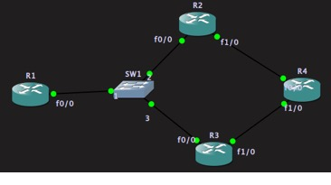
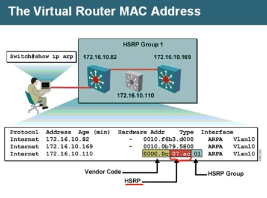
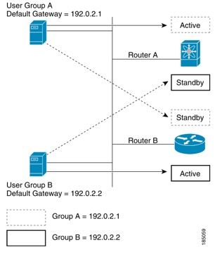

# 网关高可用


## Proxy ARP + ICMP 重定向的冗余



 

 

 

 

 

 

 

 

 

拓扑如图，R1 模仿成PC，不指定默认网关

R2-R3-R4 运行路由协议，R2和R3上宣告内网（192.168.1.0）

配置：

```shell
R1：
conf t
int f0/0
ip add 192.168.1.1 255.255.255.0
no sh
no ip routing

R2:
conf t
int f0/0
ip add 192.168.1.2 255.255.255.0
no sh
int f1/0
ip add 24.1.1.2 255.255.255.0
no sh
router rip
ver 2
net 192.168.1.0
net 24.1.1.0

R3：
conf t
int f0/0
ip add 192.168.1.3 255.255.255.0
no sh
int f1/0
ip add 34.1.1.3 255.255.255.0
no sh
router rip
ver 2
net 34.1.1.0
net 192.168.1.0

R4:
conf t
int f0/0
ip add 24.1.1.4 255.255.255.0
no sh
int f1/0
ip add 34.1.1.4 255.255.255.0
no sh
int l0
ip add 4.4.4.4 255.255.255.0
no sh
router rip
ver 2
net 24.1.1.0
net 34.1.1.0
net 4.4.4.0

```


默认情况下，PC会发送ARP请求，Ethernet层地址全F，广播，R2/R3会发送Proxy arp，PC接收后收到的arp报文  （arp报文src-ip：192.168.1.1 src-mac:自己 dst-mac:000000），假设R2或R3的f0/0 口断掉，PC还会按照原来收到的ARP继续发送数据，直至arp表项失效（默认四小时），如果将PC端ARP timeout时间改小即可增加收敛速度。

```
PC：  int f0/0
arp timeout 10
```

如果R2/R3的f1/0 口失效，路由协议会检测出链路问题，R4回到PC的路由不会受影响（只是收敛速度因路由协议不同而不同）

因为运行了路由协议，R2/R3 也能检测到和R4的直连出问题，而会选择将下一跳改为R3/R2 。 假设R2的f1/0 down，则R2收到PC的ARP请求，会向其发送ICMP 重定向报文(ICMP Redirect)， 指向R3。

如果某台路由器真的发现自己不应该为用户转发数据,而希望让用户选择其它路由器来转发数据,那么它就会通过向数据源发送 ICMP 重定向(ICMP Redirect)来告诉对方,让对方不要再将数据包发向自己,而应该发到其它路由器。

```
PC上 show ip route
Host               Gateway           Last Use    Total Uses        Interface
4.4.4.4            192.168.1.3         0:00            61            FastEthernet0/0
```


`clear ip redirect` 清空此 icmp redirect cache 表

**整体收敛速度受路由协议的影响**

 

## HSRP

first-hop redundancy protocol (FHRP)

HSRP(Hot Standby Redundancy Protocol )



 

HSRP 会让多个路由器虚拟成一个路由器，使用一个虚拟MAC （0000.0C07.AC xy ，xy为16进制组号）和一个共享IP。

HSRP 组中的路由器可以是任意支持HSRP的接口，如SVI口。

组中 active router负责转发数据，最高优先级的Standby在active挂掉或满足某些条件后接管。

For n routers running HSRP, there are n +1 IP and MAC addresses assigned.

HSRP 使用UDP hello包检测链路状态，选举Active，standby路由

在接口上启用HSRP后，ICMP redirect报文被自动打开

HSRP v1使用224.0.0.2 （代表所有路由器）作为目标ip地址，UDP 1985

active 使用接口IP和 虚拟mac 发hello

standby 使用接口IP 和接口mac发hello

每个配置HSRP的接口必须有IP，IPv4 虚拟IP必须和真实IP在同一网段

| Feature                           | Default         | 限制                      |
| --------------------------------- | --------------- | ------------------------- |
| hsrp  version                     | 1               |                           |
| hsrp  groups                      | not  configured |                           |
| standby  group number             | 0               | 255                       |
| standby  priority                 | 100             |                           |
| standby  delay                    | 0  (no delay)   |                           |
| standby  hello time               | 3s              | 250ms-999ms  和 1-254s  × |
| standby  holdtime                 | 10s             | 750ms-3000ms  和3-255s  × |
| Standby  track interface priority | 10              |                           |
| preempt                           | 关              |                           |

### 版本1和2 对比

| v1                                 | v2                                 |
| ---------------------------------- | ---------------------------------- |
| 224.0.0.2                          | 224.0.0.102                        |
| 组号 0-255                         | 组号0 - 4095                       |
| 0000.0C07.AC00  to 0000.0C07.ACFF. | 0000.0C9F.F000 - 0000.0C9F.FFFF    |
|                                    | 支持MD5 认证（只针对某些高端交换） |

帧格式不同，v1收到v2的包会丢弃

相同接口不能同时配置v1和v2；； 相同路由器的不同接口可以分别运行v1和v2

如果v2使用的组号大于255，则不能将v2变成v1

### 报文

• Hello—The hello message conveys（传输） the HSRP priority and state information of the router to other HSRP routers.

• Coup—When a standby router wants to assume the function of the active router, it sends a coup message.

• Resign—A router that is the active router sends this message when it is about to shut down or when a router that has a higher priority sends a hello or coup message

### MHSRP 负载均衡

Multiple HSRP，允许两个及以上组进行负载分担




``` shell
Switch# configure terminal
Switch(config)# interface gigabitethernet0/1
Switch(config-if)# no switchport
Switch(config-if)# ip address 192.0.2.253 255.255.255.0
Switch(config-if)# standby 1 ip  192.0.2.1
Switch(config-if)# standby 1 priority 110
Switch(config-if)# standby 1 preempt
Switch(config-if)# standby 2 ip  192.0.2.2
Switch(config-if)# standby 2 preempt
Switch(config-if)# end

Router B Configuration
Switch# configure terminal
Switch(config)# interface gigabitethernet0/1
Switch(config-if)# no switchport
Switch(config-if)# ip address 192.0.2.254 255.255.255.0
Switch(config-if)# standby 1 ip  192.0.2.1
Switch(config-if)# standby 1 preempt
Switch(config-if)# standby 2 ip  192.0.2.2
Switch(config-if)# standby 2 priority 110
Switch(config-if)# standby 2 preempt
Switch(config-if)# end
```

### 命令总结

| standby  version {1\|2}                                      | 设置版本                                                     |
| ------------------------------------------------------------ | ------------------------------------------------------------ |
| **standby** [group-number] **ip** [ip-address [secondary]]     ***standby ip** 是最精简写法，表示ip从别的学习，只有一个组，且为默认的0 | group默认为0，如果只有一个组，可以不设置组号  至少得有一台路由器设置虚拟ip，可以通过别的路由器学习  secondary指定此路由器是第二个热备路由  不配置优先级情况下，真实IP大的为Active |
| **standby** [group-number] **priority**  *priority-num*      | 设置优先级                                                   |
| **standby** [group-number] **preempt**[delay [minimum seconds]  [reloadseconds] [sync seconds]] | 后面的都是可选项                                             |
| **standby** [group-number] **track**  *type number* [interface-priority] |                                                              |
| **standby** [group-number] **authentication** {*string \| Md5 \| text }* | 认证                                                         |
| **standby** [group-number] **timers** *hellotime*  *holdtime* | 更改时间                                                     |
| show  standby                                                |                                                              |


### Tracking

```
track object-id interface interface-type number {ip routing | line-protocol} 或
track object-id ip route ip-prefix/length reachability
# 例：track 1 interface e0/0 line-protocol
```

## VRRP

Virtual Router Redundancy Protocol

Master----------- active

Backup---------- standby

vrrp可以使用接口IP作为虚拟IP，此时此路由器成为Master（被称作IP所属者），优先级为255，其余所有为backup。

选举完成后只有master才能发hello，1s间隔

 

• Proxy ARP—The client uses Address Resolution Protocol (ARP) to get the destination it wants to reach, and a router will respond to the ARP request with its **own MAC address.**

• Routing protocol—The client listens to dynamic routing protocol updates (for example, from Routing Information Protocol [RIP]) and forms its own routing table.

• ICMP Router Discovery Protocol (IRDP) client—The client runs an Internet Control Message Protocol (ICMP) router discovery client.

 

The benefits of VRRP are as follows:

• Redundance—Enables you to configure multiple routers as the default gateway router, which reduces the possibility of a single point of failure in a network.

master失效后，backup先对比优先级，然后对比ip 地址，大的为master

• Load Sharing—Allows traffic to and from LAN clients to be shared by multiple routers. The traffic load is shared more equitably among available routers.

等同于HSRP 的MHSRP，两个组交叉备份，进行负载均衡

• Multiple VRRP groups—Supports up to 255 VRRP groups on a router physical interface if the platform supports multiple MAC addresses. Multiple VRRP groups enable you to implement redundancy and load sharing in your LAN topology.

• Multiple IP Addresses—Allows you to manage multiple IP addresses, including secondary IP addresses. If you have multiple subnets configured on an Ethernet interface, you can configure VRRP on each subnet.

• Preemption—Enables you to preempt a backup router that has taken over for a failing master with a higher priority backup router that has become available. 默认开启抢占

• Advertisement Protocol—Uses a dedicated Internet Assigned Numbers Authority (IANA) standard multicast address (224.0.0.18) for VRRP advertisements. This addressing scheme minimizes the number of routers that must service the multicasts and allows test equipment to accurately identify VRRP packets on a segment. IANA has assigned the IP protocol number 112 to VRRP.

• VRRP Tracking—Ensures that the best VRRP router is the master for the group by altering VRRP priorities based on interface states.

## GLBP

GLBP 利用优先级选出 Active virtual gateway(AVG)，如果优先级相同对比IP。 然后选出一个Standby router，剩下的全是Listen状态

AVG 给 GLBP 组中的成员分配虚拟mac。每个组成员是其使用的虚拟mac的active virtual forwarder (AVF) 。

AVG响应客户端的ARP请求，轮循的给客户端分配虚拟mac。

组播地址 224.0.0.102, UDP 协议,端口号 3222。

GLBP 最多有四个虚拟mac，（按照配置先后顺序分配）

### GLBP Virtual MAC Address Assignment

根据负载均衡方式（三种），AVG给组成员发放虚拟mac。

一般AVG一定是第一个虚拟MAC的AVF，其他所有组成员都是此MAC的副VF。

每个路由器都会有一个虚拟mac（最多四个），被分配到虚拟mac的路由器是这个mac的主VF，然后其他所有组成员能通过hello学习到这个虚拟mac，这些其他成员是此mac的副VF，处于监听状态（做VF冗余用）

### GLBP Virtual Gateway Redundancy

GLBP有虚拟网关冗余机制，每个组中路由器有三种状态：Active，standby，Listen。

利用优先级和IP大小（比大）选出一个Active，一个Standby，其余为Listen。

Active失效后standby接管，并从Listen中选出一个Standby

### GLBP Virtual Forwarder Redundancy

如果AVF失效，会有个副VF（secondary Virtual Forwarder） 接管它的mac，这个副VF此时回应两个虚拟MAC

基于下面两个计时器，GLBP会移除旧的mac：

• Redirect timer—定义AVG继续给客户分配旧MAC（失效mac）的间隔，当此计时器出发，AVG停止给客户的ARP请求回复此mac，（此mac将不可用，即使已经有副VF接管了这个mac，还是会停止分发此mac）Specifies the interval during which the AVG continues to redirect hosts to the old virtual MAC address. When the redirect time expires, the AVG stops using the old virtual MAC address in ARP replies, although the secondary virtual forwarder continues to forward packets that were sent to the old virtual MAC address.

• Secondary hold timer—定义多久后虚拟mac不可用，触发时，GLBP会从所有网关中移除此虚拟mac地址。然后此虚拟mac可以被重新用来分配

Specifies the interval during which the virtual MAC address is valid. When the secondary hold time expires, GLBP removes the virtual MAC address from all gateways in the GLBP group and load balances the traffic over the remaining AVFs. The expired virtual MAC address becomes eligible for reassignment by the AVG.

### GLBP Load Balancing and Tracking

有下面三种负载均衡方式：

•  Round-robin—循环，默认的方式，循环给ARP请求回复不同的mac。

• Weighted—权重，AVG使用权重决定哪个AVF上应该承担更多流量。权重越大，分担的流量越多

• Host dependent—GLBP 利用客户的mac地址决定应该给其分配那个虚拟mac，可以保证一台主机每次（arp请求）得到的虚拟mac相同

glbp 1 load-balancing ？ 修改


