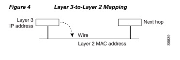

# CEF 介绍

# 1. 名词解释对照

 **process-switching** ：通常所说的软交换，使用中央处理器（CPU）进行包的转换，转换速度最慢，但是最基础，其他交换方式不可用时会使用此方式。

**process-level**：进程级别；软交换工作在此模式，所有交换工作和其他需要CPU处理的等同排队处理

**interrupt-levle**：中断级别；有数据包需要转发时会触发一个中断（RX-中断），这时CPU优先处理这个事件，此中断完成后RX中断才结束（因为各RX中断优先级一样，所以RX中断不能被另一个RX中断中断，即只有当前RX中断结束后才会处理其他的中断）；另，如果**中断级别交换失败**，则数据包发往进接口的输入队列，等待CPU进行软交换，此时RX中断结束。

快速交换工作在此模式，也使用CPU转发数据，但是会有专用的快速交换表项，所以查找速度更快，

**RP**：Route Processor，一个处理器模块，包含CPU，系统软件，大部分内存部件，也被成为Supervisory Processor （管理处理器）

**SP**：7000系列处理器模块，是所有CxBus 活动的管理员。有时被称作 cisco bus controller 思科总线控制器。

**RSP**：route switch processor ，使用路由缓存（route caching）转发包。7500 上的处理器模块，将RP和SP的功能做了整合

**VIP**：Versatile Interface Processor 集成在接口上的专用处理器，基于RISC（精简指令集计算机） 的接口处理器，从RSP接收并缓存路由信息。

VIP使用路由缓存（route cache）进行转发决策，可以减轻RSP的负担，增加吞吐量。此类型的交换称为**分布式交换**（Distributed Switching）

7000和7500系列路由器使用的接口卡。

**line-card**：线卡？ A general term for an interface processor that can be used in various Cisco products. For example, a Versatile Interface Processor (VIP) is a line card for the Cisco 7500 series router.

**IPC**：Inter Process Communication 中间进程通信

**LIB**：Label information base，标签交换路由器（LSR）使用的数据库，存储从其他LSR学到的标签。

**CEF**：通常指Central CEF ，中心化CEF，使用RP 快速转发（express）数据；；另一种CEF是DCEF，使用VIP转发数据。  

**dCEF**：distributed CEF，分布式CEF，使用VIP等线卡转发数据，每个VIP有相同的FIB和邻居表。VIP在端口间转发数据。会减少交换过程中RSP的使用

**RIB:** Routing information base ，即路由表

 

 

# 2. Cisco IOS Switching Paths overview

## 1. 基础路由器平台架构和处理过程（Architecture & Processes）

 

**快速交换**默认会在所有支持快速交换的接口上**开启**。

如果你想关闭快速交换，使用软交换（process-switching path），你就必须知道各种交换方式是如何影响路由器的，据此做出决定。

当你要TS 流量问题或需要对包进行特殊处理的时候知道这些会很有用。

下图为Cisco 7500系列路由器的处理器架构。可以看到有三种处理器

 

 

## 2，路由和交换处理过程

路由/交换 包含两个过程：

1，通过routing 进行路由决策

2，通过switching 将包转到下一跳

 

**Routing Processes**

第一个包需要查找路由表转发，决定出接口，之后生成Route Cache，相同目的的包都会通过route cache 中的路由信息进行转发。（一次查找多次转发）

  

**Switching Processes**

交换阶段路由器决定到目的地址的下一跳。

交换将流量从入接口移动到出接口。交换做了优化（根据流量源/目标做决策），延迟很低。因为不涉及查找所以节省资源。

目标地址存储在ARP表里，如果没有则会丢包或使用ARP解析地址。

 

三层IP地址信息 映射到 2层MAC地址。

 

## 3，基础交换途径（Switching Paths=switching algorithms）

基本对照：

| process switching | 默认开启  所有机器都支持  通过查路由表转发数据               |
| ----------------- | ------------------------------------------------------------ |
| fast switching    | 默认在支持的接口上开启  通过查route-cache  路由缓存转发数据，查找更快  需要process  switching产生缓存  使用2进制式route-cache |
| optimum switching | 使用256路多维（256−way multidimensional tree） route-cache，查找更快  和fast  switching 一样需要process swtiching产生cache |
| cef               | 也使用256，但是这个256表和邻居表（存出接口和MAC信息）分隔存在 |

 

### 一，软交换（Process Switching）

在进行第一个包的交换过程时，包先被复制到系统缓冲里，路由器在路由表中查找三层网络地址，初始化 快速交换缓存（fast-switch cache）。

此帧重写后被发送到出接口，那个地址的随后所有包使用相同的交换路径。路由处理器（route processor）计算CRC校验。

交换进程作为一个进程的子进程，如路由协议的。通常不会中断转发数据

 

### 二，Interrupted Context Switching

中断型交换是数据包到来后开启中断，优先处理包的交换，所以即使CPU繁忙（scheduler busy）也能快速转发包。

依赖于中断内容交换的类型：

-  Fast Switching

- Optimum Switching

- Cisco Express Forwarding

 

#### 1，快速交换

**当包快速交换后，第一个包被复制到包内存（packet memory**），目的网络或主机在快速交换缓存(fast-switching cache)中查找。接下来所有相同地址的包会使用相同的交换路径。

接口处理器（interface processor）计算CRC。

使用 2 进制的表。

#### 2，Optimum Switching

使用256 条线路的表 ，如下图，只有四级，所以只需查找四次就能确定。

和快速交换使用同样的表确定方式（即唯一不同就是表结构）。

#### 3，Cisco Express Forwarding Switching

启用CEF 模式后，FIB 和邻居表建立到（ reside on ）Route processor（RP）。

RP执行express 交换。

当CEF switching 不可用时可以使用CEF mode。

CEF使用256树，但是实际**出接口信息**以及**MAC** **信息单独存放在邻居表**。

256树指向这个表。

邻居表得以单独构建；不需要转发数据就能建立表。

 

因为这种指针的方式，**CEF能实现负载均衡，将指针指向负载均衡表（loadshare table**）。有两种方式：

基于destination 的，将源+目标地址进行hash，相同hash的指到相同路径转发。

基于包，每个包采用不同的路径。

每个负载均衡表（loadshare table）有16个条目（上图四个等价路径，每四个条目对应一个等价路径）。

如果路由表中所有流量分担计数（trafficshare counter）都为1， 则每个可能的下一跳都收到相同的负载均衡条目号。 ？？？？？（可能是说如果整个路由表没有负载均衡，则每个路径收到的负载均衡条目号都会一样）。

如果可用路径少于16，则多个条目对应一条路径，可能一条路径对应的比另一条多。（IOS12.0 之后会按需减少条目，让条目数和路径树成比例，假设有3条路径，则负载均衡条目为15，可保证三条路径对应的负载均衡条目都是5个）。

 

## 一些会影响性能的特性

1，拥塞发生时排队

- FIFO queueing—Packets are forwarded in the same order in which they arrive at the interface.

- Priority queueing (PQ)—Packets are forwarded based on an assigned priority. You can create priority lists and groups to define rules for assigning packets to priority queues.

- Custom queueing (CQ)—You can control a percentage of interface bandwidth for specified traffic by creating protocol queue lists and custom queue lists.

- Weighted fair queueing (WFQ)—WFQ provides automatic traffic priority management. Low-bandwidth sessions have priority over high-bandwidth sessions. High-bandwidth sessions are assigned weights. WFQ is the default for interfaces slower than 2.048 Mbps.

2，RED

基于ToS或precedence 划分流量等级。

3，压缩选项

4，使用ACL过滤

5，加密

6，计数，用于计费

  

# 3. CEF

`show ip cef`

可以查看是否开启CEF

 

## 优点

性能改善：和快速交换的路由缓存（Route caching）比，依赖于CPU更少。可让CPU更多地处理三层QoS，加密等任务。

可扩展性：启用dCEF后支持分布式交换

弹性：FIB表包含路由表中所有路由信息（相比快速交换的route-cache），在大型动态网络中，由于路由变动快速交换缓存经常会失效，而CEF则可以依据FIB的路由条目转发数据。 不需要再维护路由缓存

 

## 两个部件

FIB：类似于路由表。路由器使用此查询表决定基于目的地的交换。当网络变动时FIB会更新，包含当时所有路由信息。

FIB包含ip路由表前缀，以特殊方式保存方便转发。当路由表变动时，变动会被映射到FIB

 

邻居表单独建立，可以在没有任何包处理时建立（快速转发需要先转发才能建缓存条目）

可以手工配置，会使用动态协议，像ARP，BGP或OSPF建立邻居表（这些需要维护邻居关系）。只要发现邻居就会建立。

邻居条目建立后会生成对应的链路层头部，存在邻居表，将来用来封装包。

 

## NSF 不间断转发

使用epoch 分辨不同的转发信息表（在同一数据结构中），在路由表更新时，会有两个信息表，构建新FIB的时候依照旧的继续转发数据

epoch 0-255 间。

起始epoch 为0。每有一个新表时加1。

255之后是0

如果旧表中的条目还在使用，则不能开始新的epoch 

## CEF 有两种模式

**Central CEF**

FIB和邻居表通过RP建立，并由RP完成转发。

**Distributed CEF**

交换进程发生在VIP （以及其他支持交换的接口卡）上。

启用DCEF 后，线卡（line card），如VIP，GSR 会复制一份FIB和邻居表。

会减少交换操作中 RSP 的使用。

DCEF 使用IPC 机制保持RP与线卡间 FIB和邻居表的同步。

 

## 启用CEF后会同时启动下列服务

1，基于地址的负载均衡，和通用负载均担算法（universal algorithm，允许所有路由器使用不同的负载均衡方式，默认）

2，Distributed tunnel switching

 

3，Multipoint GRE tunnels

支持使用CEF 转发从/到 MGRE 的ip数据包。

当应用程序提供了前缀和tunnel 目标地址后，可以用cef直接将包发到tunnel 目标。

 

# 4. MDS - - Multicast distributed switching

组播的分布式交换

**优点：**普通组播数据使用RP转发，会造成RP 负载高，影响其他路由更新/计算的处理。

使用 RP 转发组播流量，组播传输效率受到RP性能的影响。

 

MDS 使用MFIB表，是路由表的子集

每个线卡会有一份MFIB 副本，和RP上的MFIB保持同步。

MDS可以和CEF或dfs （distributed fast switching）同时运行

 

**开启方法：**

1，全局开启

`ip multicast-routing distributed`

2，接口下开启

`ip route-cache distributed `（只在RSP平台需要配置）

3，接口下开启

`ip mroute-cache distributed`

 

 

 

 

 

1，维护 line card 上的MDS

`clear ip mds forwarding`

清MFIB表

2， 维护RP的MDS

`clear ip mroute *`

`clear ip pim interface count`

!清除线卡计数

 

# 命令

`show ip cef`

查看是否启用cef

 

`show ip Interface xxx brief`

查看接口是否启用cef。接口必须启用才能看到

 `show ip cef`

查看FIB条目

`show ip cef vrf name` 

`show Ip cef prefix /detail`

显示某前缀的信息

 

`show adjacency detail| summary`

**detail** **能看到接口对应的二层头的内容，将来直接用于封装**

 

`execute-on slot *slot-num* show ip cef `

查看第一个插槽VIP的cef

`show IP cef epoch`

查看cef 数据库的时代

 

`clear ip cef epoch full`

full | vrf xx | all-vrfs

| fast-switching                | 接口下：   ip route-cache              |
| ----------------------------- | -------------------------------------- |
| same-interface  switching     | 接口下： ip route-cache same-interface |
| Distrubuted  switching        | 接口下： ip route-cache distributed    |
| optimum  switching (高端机型) | 接口下： ip route-cache optimun        |
| NetFlow  switching            | 接口下： ip route-cache floe           |
| CEF                           | ip  cef                                |
| dCEF                          | ip  cef distributed                    |

 
