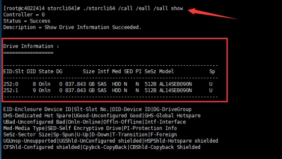

# VLAN 及二层接口模式
## 目录
{: .no_toc .text-delta }

1. TOC
{:toc}

## 1.VLAN 虚拟局域网

### 1.简介

- VLAN 即是不受网络地域限制的广播域

- 每个 VLAN 单独占用一个子网

- VLAN 之间通信需要使用路由或三层交换机

- 每个 VLAN 中需要运行 STP 防止环路

### 2.VLAN ID

VLAN ID 共有12bit，4096个，0和4095保留，可用的为4094个：

- 1-1001 –- normal VLAN普通VLAN

-  VLAN 1 –- manager VLAN管理VLAN  可以用来变更管理VLAN

- 1002-1005 为过时技术保留的(人为不可改)  **在交换机中默认存在**

- 1006-4094 extend VLAN扩展VLAN  扩展VLAN使用前提---->**vtp mode transparent**

### 3.创建、修改及查看

VLAN可以基于什么划分？

- **(1)port**

- (2)mac

- (3)ip address

- (4)protocol


VLAN 类型：

- static VLAN 

- dynamic VLAN    
  - mac 0a1c.aabb.cc33  VLAN 10  服务器记录MAC与VLAN的映射

 

创建VLAN的方式：

(1)老IOS

```
VLAN database
VLAN 10 name cisco  --->此时创建，并没有即时生效
exit
```

 (2) 新的方式

```
VLAN 10      --->立即创建VLAN
 name cisco  
```

其他常用命令:

```
SW#show VLAN brief  -->查看VLAN数据库的简要信息

SW#show VLAN  -->查看VLAN数据库

注：VLAN的信息保存在flash:中的VLAN.dat文件中

flash:config.text -->交换机中的配置文件

flash:VLAN.dat -->交换机中的VLAN信息文件

SW#erase startup-config  -->清除交换机中的配置文件

SW#delete flash:VLAN.dat -->删除交换机中的VLAN信息文件
```


## 2.交换机端口模式

### 1.access

```
SW(config-if)#switchport mode access  -->将接口置位接入模式
SW(config-if)#switchport access VLAN 10 -->将接口划入VLAN 10中
```

### 2.dynamic

**即运行DTP进行协商，协商的是：使用ISLtrunk，还是dot1q Trunk，还是Access接口。**

#### 1.尝试（主动）协商

```
switchport mode dynamic desirable
! Attempts to negotiate a trunk with the far end
```

#### 2. 自动（被动）协商

```
switchport mode dynamic auto
! Forms a trunk only if requested by the far end
```

### 3.Trunk

Trunk用于承载多VLAN，交换机与交换机、路由器之间都用Trunk模式。

#### 1.Trunk 的封装模式

 既然承载多VLAN，就得区分包是哪个VLAN的，需要给**数据包打标**，共两种**标记协议：ISL和802.1Q**



##### 1.ISL

封装 -->在原始数据帧基础之上，加入ISL包头，ISL尾部校验，

isl包头-->26Byte , isl尾部校验-->4Byte :30Byte ISL尾部校验是校验

ISL头部  -->ASIC

##### 2.802.1Q （dot1q）

打标 -->将原始数据帧拆分，**插入****tag**（标记），

tag-->**4Byte**-->VLAN ID ,尾部fcs校验需重新校验

802.1Q  native VLAN(本帧VLAN)-->优化技术，使native VLAN的数据不打标记 只能唯一  默认是VLAN 1，可手工更改

```
switchport trunk native VLAN 10
```

##### 3.negotiate 协商

可以设成negotiate，让DTP协商用哪个，默认会用ISL

手动设置模式为on，会发送协商帧，所以对方使用auto，desireble都能建立Trunk

#### 2.Trunk 设置

##### 手动设为Trunk（on）

```
SW(config)#interface fastethernet0/1
SW(config-if)#switchport trunk encapsulation dot1q/isl -->指定trunk链路标记的协议
SW(config-if)#switchport mode trunk -->将f0/1模式设置为trunk
SW(config-if)#exit
```

##### 非协商模式（nonegotiate）

手动设为Trunk，但不发协商帧（nonegotiate）

将端口设为Trunk（中继）模式但禁止端口发出DTP信息。

```
switchport mode trunk
switchport nonegotiate
```

##### off

屏蔽掉端口，即同时屏蔽掉了中继

#### 3.设置Trunk上允许的VLAN

默认情况下trunk上允许的VLAN数，1-4094  设置trunk链路上允许通行的VLAN：

```
switchport trunk allow VLAN 10                                
```

不允许通行的VLAN：

```
swichport trunk allow VLAN remove 10
```

