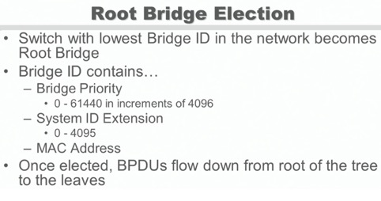
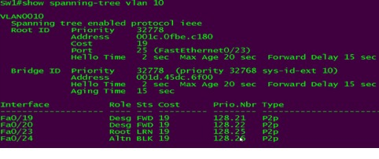
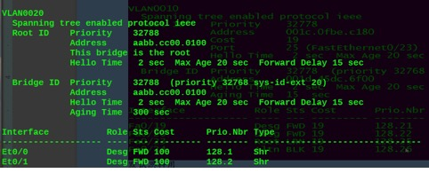
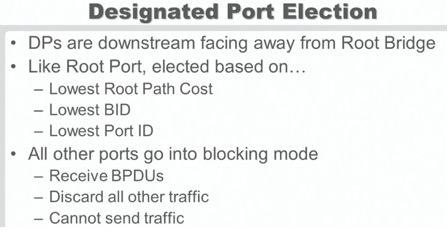

# STP
{: .no_toc }

## 目录
{: .no_toc .text-delta }

1. TOC
{:toc}

## 1.简介

防止交换网络环路（冗余备份会造成环路，物理环路）

BPDU Bridge Protocol Data Unit

Bridge ID 用来标示BPDU

## 种类：

- 802.1D（CST common spanning tree），所有VLAN使用同一个stp计算，所以稍微变动（root-bridge/root-port replacement）所有vlan都会受影响

- cisco's PVST/PVST+

- 802.1w RSTP

- 802.1s MST

 

## 2.两种交换机角色

根交换机和非根交换机

- 根交换机负责

- 根交换机是通过选举出来的，原则是桥ID小的为根



## 3.桥ID

BID是一个8字节的字段，由6字节的MAC地址和2字节（16位）的桥的优先级组成 。

Bridge ID =Bridge priority+mac ，Bridge priority 0-65536间。

 

### 1.Bridge Priority

默认交换机Bridge Priority-32768，

**使用宏命令：**

```
spanning tree vlan 1 root primary 降低Bridge Priority 两个等级（4096×2）

spanning tree vlan 1 root secondary 降低一个等级（-4096）
```


( 如果系统中所有SW优先级相同才会这样，如果有比此交换机低的，默认root primary会降为使其成为root的最小值。root se降低一个等级

如果SW1的桥ID（mac）本来就小，SW2优先级手动设低，如果SW1 root primary，则SW1的优先级会和SW2的一样  )

 

**手动调整：**

```
spanning-tree vlan 1 prority 0
```

 

设置时，Priority 是4096的倍数，原因：

- 4位Priority + 12位Extend SystemID（扩展系统ID，12位，等于Vlan ID，最大4095）

- Priority只有4位，全0时0，0001时为4096，始终为4096的倍数

- 最大61440（65535-4095）

 

**扩展系统ID：**

！！思科自己定义的扩展系统ID。如果交换机mac地址<=1024则只要开启PVST，会自动启用extend system ID。高端交换机不会默认开启，建议园区网手动开启：

```
spanning-tree extend system-id 
```

### 2.mac

MAC是**交换机的 mac** ，不是接口的mac

```
show interface | in mac & show mac-address-table
```

 



默认思科用PVST+ ，兼容ieee，Bridge ID 为：**优先级+vlan ID+MAC**

```
Root ID  Priority  4116
​       Address   aabb.cc00.0100
​       Cost    100
​       Port    1 (Ethernet0/0)
​       Hello Time  2 sec Max Age 20 sec Forward Delay 15 sec
```

这些是描述根桥的信息。



 4.三种端口模式

- root：非根到达根交换机**最近**的端口，存在于非根交换机上，转发状态

- designed：每个网络段只有一个指定端口，根交换机上所有端口都是指定端口，转发状态

- Nondesigned：非root和designed端口都为Nondesigned，端口为阻塞状态

## 5. 端口过渡状态

| 状态             |                                                              | 用户数据传送 |
| ---------------- | ------------------------------------------------------------ | ------------ |
| Disable （关闭） | 端口未激活，不会参与STP活动                                  | 不传送       |
| Broken（断离）   | 802.1Q骨干在一端错误配置或默认的本帧VLAN在两端不匹配，STP根防护生效 | 不传送       |
| Listening        | 端口正在发送和接收BPDU                                       | 不传送       |
| Learning         | 构造无环的桥接表                                             | 不传送       |
| Forwarding       | 发送和接受用户数据                                           | 传送         |
| Blocking         | 不允许用户数据从此口发                                       | 不传送       |

**侦听Listening**

当一个交换机被初始化或端口在最大时间计数器（**Max Age**）的时间范围内（20s）收不到BPDU数据包情况下，STP将端口**过渡到侦听状态**，此时没有用户数据在这条链路上发送，端口在此状态保持15s，被称为**转发延迟计时器**

**学习Learning**

保持在指定或根端口状态的段口会等待15S（**Foward delay**转发延迟时间），进入学习状态。学习状态是桥要等待15S，在此15S内要构造桥表，目的是确保桥的拓扑稳定。

**阻塞Blocking**

阻塞状态下，桥不发送**配置BPDU**，但侦听BPDU，一个阻塞的端口不会转发用户数据

 

当交换机启动后，都认为自己是根交换机，然后从所有接口向网络中发送 BPDU，称为 configuration BPDU，所以 configuration BPDU 是根交换机发出的。当交换机收到更优 Bridge-ID 的 configuration BPDU，会将它从自己所有接口转发出去，并保存在接口，如果收到差的 configuration BPDU，则全部丢掉，所以在交换网络中，只有根交换机的 BPDU 在转发，其它普通交换机的 BPDU 不会出现在网络中。

根交换机的 BPDU 会在每个 hello 时间往网络中发送一次，**hello** **时间默认为 2 秒钟**，也就是交换机的 BPDU 会在每 2 秒钟往网络中发送一次，如果普通交换机**在****max-age 时间内没有到根交换机的 BPDU，则认为根交换机已经失效，**便开始重新选举 BPDU，默认 max-age 时间为 20 秒，即 10 倍 hello 时间。

除了 hello 时间和 max-age 时间外，还有一个 forward delay 时间，默认为 15 秒，接口在经过 Listening 和 Learning 状态时，都会分别停留一个 forward delay 时间，也就是说接口从 Listening 状态到 Learning 状态，最后变成转发状态，需要经过两个forward delay 时间共计 30 秒。

## 5.5 STP 定时器

STP 有三个基本定时器，用于管理和调节BPDU：hello，转发延时，最大失效定时器

Hello timer:默认2s，根桥发送BPDU的间隔时间

转发延迟计时器Forward Delay Timer：默认15s，交换机建立转发表的等待时间。监听和学习状态都会持续这么长时间

最大失效计时器Max Age Timer： BPDU被刷新之前的存储时间。如果接口收到新BPDU之前该计时器溢出，端口转入监听。标明有连接故障，默认20s。

hello的发送可避免最大是小计时器溢出，如果有溢出端口转入监听，从连接错误恢复需要50s，20+监听状态持续15s + 学习状态持续15s

 

## 6. 802.1D工作原理

### 1.选一个根桥

最低BID的为根，根所有端口为**指定端口**并置为**转发状态**

**spanning-tree vlan 1 prority 0 更改优先级**

### 2.对每一个非根交换机选出一个根端口

根端口确定按照下面的规则选出：

a. 最低的桥ID

b. 到达根桥的**最低路径**，即到跟桥所有路径的总**Cost**

c. 最低的上游BID

d. 最低上游Port ID （Port ID=Port Priority +端口号，Priority默认128，取值0-255）

e. 最低本地Port ID

 

链路带宽对应的Cost：

- 10m 100

- 100m 19

- 1000m 4

- 10G 2

 改端口优先级：

```
spanning-tree port priority 0
```

### 3.在每个网段上选举一个指定端口（designated）

对于每个网段 ，STP会选举出1个背离根桥的端口，称为**指定端口**。 指定端口被置为STP的转发状态 。

所有剩余端口为非指定端口，为阻塞状态



## 7.802.1D 普通生成树的拓扑变动

1.三种BPDU

- TCN BPDU （新类型BPDU），拓扑变动通告BPDU

- TC BPDU （配置BPDU），拓扑变动BPDU

- TCA BPDU （配置BPDU）， 拓扑变动确认BPDU

2.变动方式

当sw1发现某接口down之后，发送TCN给上游sw2，上游sw2 发送TCA给sw1，并将TCN继续转发直到root，root发送TC BPDU给所有桥，并迅速进入15s采用 forward delay，加快mac老化

802.1D 一般只有根才能发配置BPDU，但是开启时，所有路由都会发

 

## 8.802.1w RSTP

1.端口角色：根端口，指定端口，替代端口，备份端口，阻塞端口

- 替代端口：替代根端口

- 备份端口：备份指定端口

 

2.端口过渡状态：

- discarding (将blocking and listening合并)

- learning

- forwarding

3.设置

```
int f1/0/1
spanning-tree portfast
```

或全局下:

```
spanning-tree portfast default
! 对所有access 口（一般接主机，edge口）生效
```


Trouble shooting ： **trunk 间不能设置 portfast**

 

## 9. 802.1s MST

1.简介

多生成树，只有有相同树结构的vlan才能划分到一个**实例**中

 MSTP 最多支持 65 个 STP实例，

 

MSTP region，三个参数确定一个区域:

- 1)name

- 2)revision

- 3)instance

 配置：

```
spanning-tree mode mst
spanning-tree mst configuration
 name xxx
 revision 1
 instance 1 vlan 1-100
 instance 2 vlan 101-1000
 
! 默认情况下所有vlan属于实例0

spanning-tree mst instance_num root primary|secondary 

Switch#show spanning-tree mst configuration

spanning-tree mst max-age xxx
```


 
