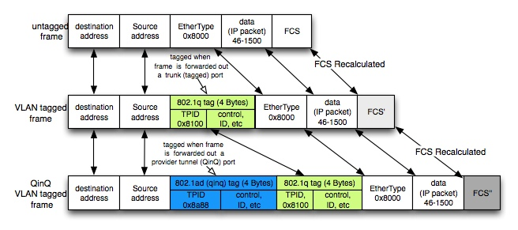

# QinQ
{: .no_toc }

## 目录
{: .no_toc .text-delta }

1. TOC
{:toc}

QinQ技术（也称Stacked VLAN 或Double VLAN）。标准出自IEEE 802.1ad，可实现将用户私网VLAN Tag封装在公网VLAN Tag中，使报文带着两层VLAN Tag穿越运营商的骨干网络（公网）。

QinQ是对802.1Q的扩展，其核心思想是将用户私网VLAN tag封装到公网VLAN tag中，报文带着两层tag穿越服务商的骨干网络，从而为用户提供一种较为简单的二层VPN隧道。其特点是基于802.1Q协议中的Trunk端口概念，要求隧道上的设备都必须支持802.1Q协议，不需要信令的支持，仅仅通过静态配置即可实现，特别适用于小型的，以三层交换机为骨干的企业网或小规模城域网。QinQ的报文格式如下：



配置：

sw1（公司总部） -- **sw2**（ISP） –vlan100-sw3（ISP）-- sw4 (公司分部)

```
sw1：
int f1/0/19
switchport encapsulation dot1q
switchport mode trunk
switchport nonegotiate

sw2:
int f1/0/19 (与本地相接）
switchport encapsulation dot1q ?
switchport mode dotq1-tunnel
switchport trunk access vlan 100
l2protocol-tunnel cdp
int f1/0/20 (与ISP另端连)
switchport encapsulation dot1q
switchport mode trunk
switchport nonegotiate

```


 
