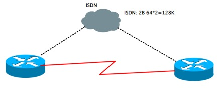
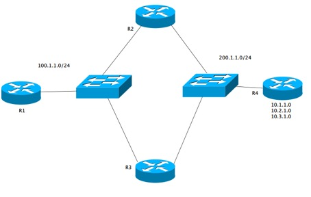

# 静态路由
{: .no_toc }

## 目录
{: .no_toc .text-delta }

1. TOC
{:toc}

## 配置

`ip route dst-ip netmask {address | interface} [distance] [permanent]`

- distance 用于调整选路，浮动路由

- permanent 用于按需电路，因为只有 IP 地址对应的接口活跃时静态路由才会生效，按需电路只有一定条件才会建立。 

- `clear ip route *`会清除所有路由静态路由条目，包括 permanent

配置原则，如果是连接交换机的MA环境，建议下一跳使用IP 地址，如果为点到点网络，使用接口作为下一跳。

 

## 浮动路由，冗余备份



R1到R2默认走串行线路，AD为1，可以设置ISDN的AD为2，进行冗余备份。

或，如果R1和R2之间运行路由协议，可将静态路由的AD改大（>120）。

 

**ARP**

当向网络中发送广播请求目标的二层链路地址时,如果收到的路由器有去往目标网络的路由,那么路由器将会使用自己接口的二层链路地址来回复数据源,声称自己的二层链路地址就是目标的二层链路地址,这就是路由器的**代理** **ARP** 功能。默认路由器会开启代理ARP。

开启代理ARP的路由器给PC/Router 回的包是ARP reply。

## 递归路由及冗余



R1：

```shell
ip route 10.0.0.0 255.0.0.0 200.1.1.4
```

去往目的网络的下一跳不可直达，此时 R1 会发送 ARP 请求，寻找 200.1.1.4 的 mac地址，R2 收到后发送 ARP 回应。

( arp reply接收的原则是：对于 PC，无条件接收；对于 Router，如果目的网段不可达，则丢弃。此时如果只需让**下一跳可达，则可接收此 ARP**。 )

```shell
ip route 200.1.1.4 255.255.255.255 100.1.1.2
！！此条目不会影响路由路径（即从哪收到的ARP回应，还会走哪条路径，而不会因为此路由条目而走R2，有可能走R3）
！！也不影响ARP请求，到达目的网络10.1.1.0 的 ARP请求的地址还是200.1.1.4
```


R4上需要指定去往R1的路由：

```shell
ip route 100.1.1.0 255.255.255.0 200.1.1.2
ip route 100.1.1.0 255.255.255.0 200.1.1.3
```


可见影响递归路由的选路只有ARP，ARP超时时间默认 4 小时，所以要实现冗余只需更改ARP请求间隔，假设R2 down，只需让 R1 和 R4 重新发 ARP 请求即可：

```
int f0/0
arp timeout 10
```


### 递归路由的非对称负载均衡

数据路径：R1-R3-R4-R2-R1

方法：关闭R2左面的ARP 代理，关闭R3右面的ARP代理。

```shell
int f0/0   
no ip proxy-arp
```


