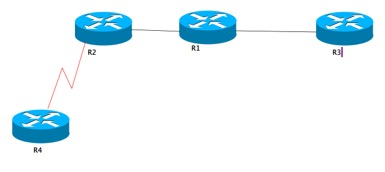

# RIP 路由协议
{: .no_toc }

## 目录
{: .no_toc .text-delta }

1. TOC
{:toc}

## 简介

RIP 是一个内部网关路由协议(Interior Gateway Protocol,即 IGP),只能在单个 AS 内传递路由信息。

RIP DV(Distance Vector距离矢量)--而距离矢量路由协议的根本特征就是自己的路由表是完全从其它路由器学来的,并且将收到的路由条目一丝不变地放进自己的路由表,以供数据转发。正因为如此,对于路由是否正确,对于目标是否可达,RIP全然不知。

Rip 最大跳数15跳，如果到目标为16跳则认为不可达

Rip管理距离为**120** ，比IS-IS 大5,比OSPF 大10

RIP 使用 UDP 协议,端口号 **520** 将路由条目从开启了 RIP 进程的接口上发出

ver1 使用广播地址 255.255.255.255 发出,而 ver 2 使用组播地址 **224.0.0.9** 发出。周期性更新=30s，可以开启触发更新(基于接口)

V2 可以以广播发送更新：**ip rip v2-broadcast**

V1 会将收到的路由自动汇总为主类路由，发出的路由信息中只有网络号没有掩码信息，且不可关闭

V2 默认自动汇总，可以手动关闭汇总

 

无论v1还是v2,都可以在接口上关闭发送路由功能，此功能称为：Passive-interface

都可以通过offset-list 来增加路由的Metric

水平分割：默认FR主接口关闭的，FR子接口，多点子接口，HDLC的串口，以太网接口开启的

 

 

RIP 可以使用接口上的s**econdary IP** **作为更新的源地址**

当接收路由的接口配有 Secondary 地址时,则采用 Secondary地址的掩码长度赋予接收路由,

例如收到的路由为 10.1.2.0,而接口主 IP 地址为

10.1.1.2/24,Secondary IP 地址为

10.1.1.3/25,那么将设定

10.1.2.0 的掩码长度为 **25**位,所以 RIP 采用 **Secondary IP** **的掩码长度优先。**

 

Prefix-list，用于改metric，在router rip 中设置，**offset-list 0 in/out <1-16>**

distribute-list 过滤 **distribute-list 1 in/out f0/0**

## RIPv2 认证

```shell
R1(f0/0)-----------------------(f0/0)R2
R1(config)#key chain ccie                 //定义钥匙链
R1(config-keychain)#key 1                 //定义钥匙ID
R1(config-keychain-key)#key-string cisco         //定义钥匙(密码)
R1(config-keychain-key)#end
R1#configure terminal
```

```shell
R1(config)#interface fastethernet0/0
R1(config-if)#ip rip authentication mode text/md5       //开启**明文****/****密文**认证
R1(config-if)#ip rip authentication key-chain ccie    //定义明文认证密钥
```


## RIPv2 的汇总

默认情况下，RIP是开启自动汇总 ---> **主类网边界进行自动汇总**   

自动汇总会汇总**自己产生的**，也会汇总**经过**的明细路由

----192.168.1.0---Router(主类网边界)---172.16.1.0----

只有当汇总的所有接口down掉 此汇总路由才会消失。

| ip-address  | cost | 结果                                                         |
| ----------- | ---- | ------------------------------------------------------------ |
| 172.16.8.1  | 2    | 汇总：   172.16.8.0 255.255.252.0  Cost ： 2  (手动汇总后cost取最小的) |
| 172.16.9.1  | 3    |                                                              |
| 172.16.10.1 | 4    |                                                              |
| 172.16.11.1 | 6    |                                                              |

 

人为定义，关闭自动汇总，手工进行汇总。如果自动和手动一起使用，则**自动优先**

！Rip可以用手工汇总，但是汇总长度不能短与主类网的掩码长度，例如，C类手动汇总掩码长度不能短于24位，A类不能短于8位

10.1.1.0/24

10.1.2.0/24

10.1.3.0/24

 

10.1.0.0/22 --超网

 

RIPv2汇总基于接口(路由传递的出接口)：

```shell
interface fastethernet0/0
ip summary-address rip 10.1.0.0 255.255.252.0
```



R2 到 R3 的f0/0 为1跳，到R3的环回口为2跳，每经过一台设备跳数加1

假设R2关闭自动汇总，R1开启自动汇总，R1会对R2的明细路由进行汇总后给邻居（R2和R3）发送，R3可以接收汇总，R2不接受（水平分割）

 

## 被动接口和单播更新

被动接口：仅仅接口RIP的更新，不发送RIP的更新  -->只收不发

单播更新：使用单播给指定邻居更新


RIP被动接口和单播更新基本配置：

```shell
R1(config)#router rip
R1(config-router)#version 2
R1(config-router)#no auto-summary
R1(config-router)#passive-interface f0/0     //将f0/0设置为被动接口
 

R1(config-router)#passive-interface default   //将所有接口设置为被动接口
R1(config-router)#no passive-interface f0/1   //指定将f0/1不设置为被动接口
R1(config-router)#neighbor 12.1.1.2       //针对12.1.1.2这个邻居，开启单播更新
```


## 偏移列表(offset-list)，改metric

使用offset-list进行修改路由传递时的metric值(hop)，可以配合access-list使用，进行指定的路由条目修改。    用于调整Rip选路（增加低带宽线路的cost）

注意：offset-list只能累加，不能减少。

```shell
R1(config)#router rip
R1(config-router)#version 2
R1(config-router)#no auto-summary
R1(config-router)#offset-list 0 in/out <0-16> f0/0   
# 注：0 acl 表示匹配所有网段 out，不修改本地的Cost，传递给邻居时更改。

R1(config)#access-list 1 permit 192.168.1.0 0.0.0.0或0.0.0.255
R1(config-router)#offset-list 1 in/out <0-16> f0/0   //针对192.168.1.0这条路由条目修改metric
```


## 分发列表(distribute-list)，过滤

对路由条目实施过滤控制，配合access-list使用。

```shell
R1(config)#access-list 1 permit 192.168.1.0 0.0.0.0
R1(config)#access-list 1 permit 192.168.2.0 0.0.0.0
R1(config-router)#distribute-list 1 in/out f0/0    //仅仅允许192.168.1.0/192.168.2.0的路由条目传递
```

## 重发布

任何协议重发布RIP，都必须遵循RIP的度量方式  --->跳数(hop)

 ```shell
 R1(config)#router rip
 R1(config-router)#redistribute ospf 110 metric <0-16>   -->一般取值为1
 R1(config-router)#redistribute connected {metric}可选
 R1(config-router)#redistribute static {metirc}可选
 ```

重发布时配合route-map进行路由条目的过滤和参数修改

## 默认路由下放

- 本地写一条默认路由 ip route 0.0.0.0 0.0.0.0 f0/0 , 进到RIP进程： redistribute static

- 本地写一条默认路由 ip route 0.0.0.0 0.0.0.0 f0/0 ，进到RIP进程：net 0.0.0.0

- 在边缘路由上，ip default-network 24.0.0.0 所有路由器通用，24.0.0.0 是边缘路由器与公网相连的网段主网络号（对于v1和v2 都适用）

- router rip --  default-information originate

！！ 如果不生效（3和4），no router rip 重做即可。ISP和出口路由之间不需要运行rip，ISP需要回来的路由。

## 触发更新

只可以用于串口，且两端都得设置。。 基于接口开启

```shell
ip rip triggered
```

用途：用于按需电路，节省开支（会关闭周期性的发送更新）

## 更新源地址检测

当RIP收到更新报文后，会检测源地址是否和接收接口地址在同一网段，只有相同才接收。

收到报文和Secondary地址在同一网段也会接收。

当接口上配置 Secondary 地址并发布到 RIP 进程后,所有路由信息从该接口发出去时,会**同时使用主** **IP** **地址与** **Secondary** **地址**分别发送一次。**Secondary** **地址的网段不会被** **RIP** **更新出去**

 ```shell
 output delay <8-50> ms
 ```

高性能的路由器上布置，让低端设备有时间处理报文
