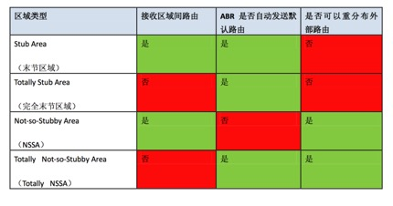

# OSPF
{: .no_toc }

## 目录
{: .no_toc .text-delta }

1. TOC
{:toc}

## OSPF 概述

Open shortest path first

- 采用ip协议号 89，|eth|ip|ospf|data|fcs|

- 基于IP所以不可靠

1)显式确认 --->通过LSAck

2)隐式确认 --->通过序列号  seq 0x80000001 - 0x7fffffff）


- 工作在单个AS，是IGP协议

- 可在任意比特位汇总，没有像RIP手动汇总的限制

- 采用增量更新路由表，即更新变化的部分

- AD 110， 小于 IS-IS 的 115，rip 的120，

- OSPF使用组播更新(224.0.0.5/224.0.0.6)，周期性伴随触发(周期时间=30min)，采用部分更新。
  - 224.0.0.5 是 DR/BDR 发的目标地址，所有路由都接收 

- 只支持等价负载均衡  

- Router-id 在网络中必须是唯一的

- OSPF 路由器发出的链路状态通告都会标上自己的 RID，不同路由器产生的链路状态不会相同

  

## Router-ID

★1 .手工指定 Router-ID。

★2 .路由器上活动 Loopback 接口中 IP 地址最大的，也就是数字最大的，如 C 类地址优先于 B 类地址

一个非活动的接口的 IP 地址是不能被选为 Router-ID 的。

★3 .如果没有活动的 Loopback 接口，则选择活动物理接口 IP 地址最大的。

Router-ID 只在 OSPF 启动时计算，或者重置 OSPF 进程后计算。

 

## Cost

Ospf cost 等于 100M/带宽。

1000m 和 100m 的 metric 都是1

`auto-cost reference-bandwidth 1000 Mbit `  可修改默认参考带宽  

到达目标网络的 metric 等于沿途所有接口 cost 之和。

只是加出接口的，同EIGRP一样，路由流向的入接口 -->数据的出接口  -->累加。

会自动计算接口的 cost，可以手动指定，手动指定优先于自动算的。

到达目标网络相同 cost 值的，可以进行负载均衡，最多6条链路同时执行负载均衡。

 

## LSA

链路状态(LSA)就是 OSPF 接口上的描述信息，例如接口上的 IP 地址、子网掩码、网络类型、Cost 值等等，OSPF 路由器之间交换的并不是路由表，而是链路状态(LSA) ，OSPF 通过获得网络中所有的链路状态信息，从而计算出到达每个目标精确的网络路径。

OSPF 路由器会将自己所有的链路状态毫不保留地全部发给邻居，邻居将收到的链路状态全部放入链路状态数据库(Link-State Database)，邻居再发给自己的所有邻居，并且在传递过程种，绝对不会有任何更改。这样的最终过程，网络中所有的 OSPF 路由器都拥有网络中所有的链路状态，并且所有路由器能描绘出相同的网络拓朴。

 

## OSPF 区域

为了减少网络拓扑变动带来的影响（每次变动所有路由器运行一次SPF算法），以及减少路由表，划分区域，采用hut-spoke接口，即核心与分支的结构。

区域命名可以是数字，也可以是 IP 地址。

普通区域之间只能通过 Area0 来交互信息。

OSPF 区域是基于接口划分的，一台路由器可属一个区域，也可属多个区域。

 

如果一台路由器属于一个区域，那么此路由器称为Internal router，IR

如果一台路由器属于多个区域，那么它是ABR，Autonomous boundary Router。ABR 可以将一个区域的 LSA 汇总后转发至另一个区域

如果一台 OSPF 路由器将外部路由协议重分布进 OSPF，那么这台路由器称为 Autonomous System Boundary Router (ASBR)  

 

如果是同区域的路由，叫做 Intra-Area Route，在路由表中使用 O 来表示;

如果是不同区域的路由，叫做 Inter-Area Route 或 Summary Route，在路由表中使用 O IA 来表示;

如果并非 OSPF 的路由，或者是不同 OSPF 进程的路由，只是被重分布到 OSPF 的，叫做 External Route，在路由表中使用 O E2 或 OE 1 来表示。

当存在多种路由可以到达同一目的地时，OSPF 将根据先后顺序来选择要使用的路由，所有路由的先后顺序为:

Intra-Area — Inter-Area — External E1 — External E2

即 O — O IA — O E1— O E2。

 

★一台路由器可以运行多个 OSPF 进程，不同进程的 OSPF，可视为没有任何关系，如需要获得相互的路由信息，需要重分布。  

★每个 OSPF  进程可以有多个区域 ， 而路由器的链路状态数据库是分进程和分区域存放的。  

 

## 邻居

OSPF 只有邻居之间才会交换 LSA，路由器会将链路状态数据库中所有的内容毫不保留地发给所有邻居，要想在 OSPF 路由器之间交换 LSA，必须先形成 OSPF 邻居，OSPF 邻居靠发送 Hello 包来建立和维护，Hello 包会在启动了 OSPF 的接口上周期性发送在不同的网络  中，发送 Hello 包的间隔也会不同，当超过 4 倍的 Hello 时间，也就是 Dead 时间过后还没有收到邻居的 Hello 包，邻居关系将被断开。

 

两台 OSPF 路由器必须满足 5 个条件，才能形成 OSPF 邻居，5 个必备条件如下:

  **1.Area-id(区域号码)**  

即路由器之间必须配置在相同的 OSPF 区域，否则无法形成邻居。

  **2.Hello and Dead Interval(Hello 时间与 Dead 时间)**  

即路由器之间的 Hello 时间和 Dead 时间必须一致，否则无法形成邻居。

  **3.Authentication(认证)**  

路由器之间必须配置相同的认证密码，如果密码不同，则无法形成邻居。

  **4.Stub Area Flag(末节标签)**  

路由器之间的末节标签必须一致，即处在相同的末节区域nssa stub内，否则无法形成邻居。

  **5. MTU**  

 

★OSPF 只能使用接口的 Primary 地址建立邻居，不能使用 Secondary 建立邻居。

★路由器双方接口要么都为手工配置地址(Numbered)，要么都为借用地址(Unnumbered)否则无法建立邻居。

PPP 网络中可以使用不在同一子网的IP地址

## OSPF邻居关系和邻接关系

邻居关系：指的是双方交互了hello包

邻接关系：指的是双方交互了hello和LSA

形成邻接关系一定会形成邻居关系，形成邻居关系不一定形成邻接关系。

 

## DR/BDR

为了减少网络中lsa的泛洪  --->出现在MA网络环境中(ethernet)

DR 与 BDR 并没有任何本质与功能的区别(BDR只是个备份)，只有在**多路访问的网络环境**，才需要 DR 和 BDR。

DR 与 BDR 的选举是在一个  二层网段  内选举的，即在多个路由器互连的接口范围内，与 OSPF 区域没有任何关系，  一个区域可能有多个多路访问网段，那么就会存在多个 DR 和 BDR，但一个多路访问网段，只能有一个 DR 和 BDR。

 

选举 DR 和 BDR 的规则为 :  

  ★ 比较接口优先级  

选举优先级最高的成为 DR，优先级数字越大，表示优先级越高，被选为 DR 的几率就越大，次优先级的为 BDR，优先级范围是 0-255，默认为 1，优先级为 0 表示没有资格选举 DR 和 BDR。

  ★Route-Id 大小  

如果在优先级都相同的情况下，Route-Id 最大的成为 DR，其次是 BDR，数字越大，被选为 DR 的几率就越大。

因为所有路由器都能  与 DR 和 BDR 互换 LSA，  所以所有路由器都与 DR 和 BDR 是邻接(Adjacency)关系，而 Drother 与 Drother 之间无法互换 LSA，所以   Drother 与 Drother 之间只是邻居关系 ， 状态会卡在 two-way 状态 。

 

在一个多路访问网络中，选举 DR 和 BDR 是有时间限制的，该时间为 Wait 时间，默认为 4 倍的 Hello 时间，即与 Dead 时间相同，如果 OSPF 路由器在超过 Wait 时间后也没有其它路由器与自己竞争 DR 与 BDR 的选举，那么就选自己为 DR；当一个多路访问网络中选举出 DR 与 BDR 之后，在 DR 与 BDR 没有失效的情况下，不会进行重新选举，也就是在选举出 DR 与 BDR 之后，即使有更高优先级的路由器加入网络，也不会影响 DR 与 BDR 的角色，在越出选举时间(Wait 时间)后，只有 DR 与 BDR失效后，才会重新选举。

## OSPF 数据包交换过程

1)Hello   --->发现、建立、维护邻居关系，交换LSA的前提

2)DBD --->描述链路状态数据库的简要信息，LSA的目录信息

3)LSR --->链路状态请求。向OSPF邻居请求特定LSA的详细信息

4)LSU --->更新LSA  一个LSU可以承载一个LSA，也可以承载多个LSA

5)LSAck   --->对LSU中的LSA进行确认。

LSDB

 

路由器从启动 OSPF 进程，到根据链路状态数据库计算出路由表，同样需要经历

一系列的启动过程，总共有 8 种可能的启动过程，但并不是一定会经历这 8 个过程，

具体过程如下:

Down → Attempt -->Init-->Two-way-->Exstart-->Exchange-->Loading-->Full

- Down  ，刚开启ospf进程，未收到任何数据包，可以向外发送hello，以试图发现邻居
- Attempt  ，在FR等非广播网络中，组播不能传递，需要单播给邻居发送hello包，以此试图和指定邻居建立ospf邻居关系，此状态下，ospf称Atltempt
- init   ，ospf路由器的一方收到另一方的hello，单双方未交换hello，即对方hello中未将自己列为邻居
- Two-way ，双方交换了hello，建立了邻居关系，如果之后不需要交换LSA，则一直停留在此状态
- Exstart  ，因为在 OSPF 邻居之间交换完整的 LSA 之前，会先发送 Database DescriptionPackets (DBD)，Link-state Request (LSR)等数据包，邻居之间是谁先发，谁后发，需要确定顺序，在 Exstart状态，就是确定邻居之间的主从关系（RID大的是主，这里与优先级无关，所以DR可能是从）。在任何网络下OSPF交换LSA前都得确定主从关系
- Exchange  ，交换DBD，收到后路由和自己的DBD进行比较，再确定需要哪些LSA的完整信息，再发送LSR给邻居
- Loading  ，邻居收到LSR，向对方回复LSU
- Full ，  等到 OSPF 都收到了邻居回复的所有 Link-state update(LSU)，那么此时的数据库状态就变成了收敛状态，此状态就是 Full 状态，但此时只是数据库已经同步，但路由表却还在计算当中

  

## OSPF的网络类型

1)Broadcast广播

2)NBMA非广播多路访问

3)point-to-point点到点

4)point-to-multipoint点到多点

5)point-to-multipoint non-broacast点到多点非广播

6)loopback环回

7)virtual-link虚链路

 

  1)Broadcast  :hello interval=10s ， dead interval=40s ， 需要选举DR/BDR ，能自动建立邻接 ，默认存在环境：ethernet

  2)NBMA  :hello interval=30s ， dead interval=120s ， 需要选举DR/BDR ，不能自动建立邻接(需要手工指neighbor -->使用单播建立邻接关系，对方指过来即可) ， 默认存在环境：frame-relay ， x.25 ， ATM

  3)point-to-point  :hello interval=10s ， dead interval=40s ， 不需要选举DR/BDR ，能自动建立邻接 ， 默认存在环境：serial串行线

  4)point-to-multipoint  :hello interval=30s ， dead interval=120s ， 不需要选举DR/BDR ， 能自动建立邻接

  5)point-to-multipoint non-broadcast:  hello interval=30s ， dead interval=120s ， 不需要选举DR/BDR ，不能自动建立邻接(需要手工指neighbor -->使用单播建立邻接关系)

  6)loopback:  设备环回接口的默认类型 --->stub host --->/32  --->ip ospf network point-to-point -->/24

  7)virtual-link  :virtual-link的接口的网络类型

 

各个网络类型配合时需要注意：

1)hello and dead interval  -->可以手工更改

2)是否选举DR/BDR

  优先级， Hello ， dead ，网络类型全部在接口下配置  

```shell
DR/BDR --->interface fastethernet0/0
   ip ospf priority <0-255>
hello and dead interval --->interface fastethernet0/0
 ip ospf hello-interval xx
 ip ospf dead-interval xx
network_type  --->interface fastethernet0/0
   ip ospf network {broadcast|non-broadcast|point-to-point|point-to-multipoint}
```

## OSPF LSAs

OSPF -->链路状态型路由协议 -->链路状态通告(LSAs)

OSPF LSAs种类  -->11种

R&S -->1、2、3、4、5、7

1类LSA 00:19:D2:B2:3C:91-->描述直连信息  -->区域内  每台路由器  都会产生一个1类LSA  -->传递范围：区域内部，无法穿越ABR

2类LSA -->描述MA环境中连接所有路由器的信息，及子网掩码  -->  DR 产生 -->传递范围：区域内部，00:19:D2:B2:3C:91无法穿越ABR

3类LSA -->描述区域内网络号和子网掩码  -->  ABR  产生  -->传递范围：整个OSPF自治系统

4类LSA -->描述ASBR的位置(ASBR router-id)的所在  -->ASBR区域内  ABR  产生  -->整个自治系统

5类LSA -->描述OSPF自治系统外部网络号和子网掩码  -->  ASBR  产生  -->整个自治系统

7类LSA -->在NSSA区域中描述自治系统外部的网络号和子网掩码  -->ASBR产生 -->本NSSA区域  注：在ABR做7转5

用描述路由条目的LSA：1、3、5、7

1类LSA产生的路由 -->O

3类LSA产生的路由 -->O IA

5类LSA产生的路由 -->O E2/1

7类LSA产生的路由 -->0 N2/1

O E1/2(0 N1/2) -->type 2:外部路由条目在内部传递时，不累加cost值(默认seed cost=20)   

  type 1:外部路由条目在内部传递时，累加cost值

路由优先的顺序：O>O IA>O E1>O E2>O N1>O N2

  如何确定一条唯一的 LSA ：  

1)Type

2)Link ID

3)ADVRouter

 

OSPF现在接受最大的LSA数量：max-lsa

 

## OSPF优化技术(特殊区域)



  1)Stub  ：过滤掉4、5类lsa，会自动产生3类默认lsa(O IA 0.0.0.0 0.0.0.0)；不可以存在ASBR

  2)Totally Stub(no summary)  ：过滤掉3、4、5类lsa，会自动产生3类默认lsa(O IA 0.0.0.0 0.0.0.0);不可以存在ASBR(4)

  3)NSSA  ：过滤掉5类lsa，不会自动产生默认lsa(可以手工下放默认lsa（7类）)，产生7类lsa（代替5类）；可以存在ASBR(4)，可以存在7类LSA

  4)Totally NSSA  ：过滤掉5类lsa，会自动产生3类默认lsa(O IA 0.0.0.0 0.0.0.0);，产生7类lsa;可以存在ASBR

 特殊区域不能够在area 0和virtual-link中部署

area 2 nssa default-information-originate

## 认证

null、text、md5

部署方式：**链路之间、区域内**

配置区别是：

- 链路间是在接口下启用： ip os authentication  

- 区域是在 router 下， area 0 authentication （明） /area 0 authentication message-digest ( 密文 )  

密码设置都在接口下： 

```shell
ip os authentication-key xxx  
ip os authentication message-digest-key 1 md5 xxx  
R1(F0/0)-----------------------------(F0/0)R2
```


### 链路之间

```shell
R1(config)#interface fastethernet0/0
R1(config-if)#ip ospf authentication   //开启OSPF协议明文认证
R1(config-if)#ip ospf authentication-key cisco  //定义OSPF协议明文认证密钥
R1(config-if)#ip ospf authentication message-digest  //  开启  OSPF  协议密文认证 
R1(config-if)#ip ospf message-digest-key 1 md5 cisco  //  定义  OSPF  协议密文认证的  ID  和密钥 

R2(config)#interface fastethernet0/0
R2(config-if)#ip ospf authentication   //开启OSPF协议明文认证
R2(config-if)#ip ospf authentication-key cisco  //定义OSPF协议明文认证密钥
R2(config-if)#ip ospf authentication message-digest  //  开启  OSPF  协议密文认证 
R2(config-if)#ip ospf message-digest-key 1 md5 cisco  //  定义  OSPF  协议密文认证的  ID  和密钥 
```

 

### 区域内

```shell
R1(config)#interface fastethernet0/0
R1(config-if)#ip ospf authentication-key cisco   //定义明文认证的密钥
R1(config-if)#exit
R1(config)#router ospf 110
R1(config-router)#area 0 authentication   //针对区域0开启明文认证
R1(config-if)#ip ospf message-digest-key 1 md5 cisco  //定义密文认证ID和密钥
R1(config-router)#area 0 authentication message-digest //针对区域0开启密文认证

注：如果区域0开启了认证，虚链路也必须跟着开启相应的认证

 R2-------Virtual-link-------R3

R2(config)#router ospf 110
R2(config-router)#area 1 virtual-link 10.1.1.3 authentication authentication-key cisco
R2(config-router)#area 1 virtual-link 10.1.1.3 authentication message-digest message-digest-key 1 md5 cisco

R3(config)#router ospf 110
R3(config-router)#area 1 virtual-link 10.1.1.2 authentication authentication-key cisco
R3(config-router)#area 1 virtual-link 10.1.1.2 authentication message-digest message-digest-key 1 md5 cisco 
```

## OSPF的汇总，都在进程内

1)区域间汇总

2)区域外汇总

注：没有区域内汇总，因为区域内LSDB完全同步

  1) 区域间汇总  

192.168.1.0/24

192.168.2.0/24

192.168.3.0/24

  ----Area1----R1----Area 0----R2----Area 2----

汇总的位置  ABR  上：

```shell
R1(config)#router ospf 110
R1(config-router)#area 1 range 192.168.0.0 255.255.252.0 {advertise|not-advertise|cost}
```

  2) 区域外汇总  

汇总的位置  ASBR  上：

```shell
ASBR(config)#router ospf 110
ASBR(config-router)#summary-address 192.168.0.0 255.255.252.0 {not-advertise|tag}
```

## 注入默认路由

在ospf进程内下方默认路由，使用 `default-information originate`即可。

`default-information originate`命令后面可以加可选的` always `参数，如果不使用该参数，路由器上  必须存在一条默认路由  ，否则该命令不产生任何效果。如果使用该参数，无论路由器上是否存在默认路由，路由器都会向 OSPF 区域内注入一条默认路由。

默认注入类型是 O E2 ，可以通过`default-information originate always metric-type 1` 将 O E2 改成 O E1。

如果一个区域是 NSSA，需要使用 `area 1 nssa default-information-originate`   注入默认路由，后面再加 `metric-type 1` 更改类型。

## OSPF Virtual Link

`area   transit-area-id   virtual-link   RID  `

将骨干扩展到非骨干上，对骨干虚拟的扩展和拉伸就是 OSPF 虚链路(Virtual Link)

与骨干区域相邻的常规区域被扩展后，该区域被称为 Transit Area，理论 上 Transit Area 不应该为末节区域，Transit 区域，是区域中两个或多个ABR通过Virtual-link连接的区域。

在进行 OSPF 虚链路扩展时，是将 Transit Area 中与骨干区域直连的 ABR 和连接另一个常规区域的 ABR 相连，连接这两个 ABR 时，使用双方的 Router-ID 来连接。

可以用virtual将骨干与非骨干连，也可以将分割骨干连接起来：

- OSPF 虚链路必须是在两个拥有共同区域的 ABR 之间建立的 ， 其中必须至少有一个 ABR 是连接骨干的。  

- OSPF 虚链路被认为是骨干区域的一个接口 ， 一条链路 ， 也需要建立 OSPF 邻居 ， 但在邻居建立之后 ， 链路上是没有 Hello 包传递的。  

 
