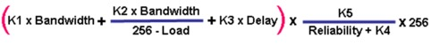
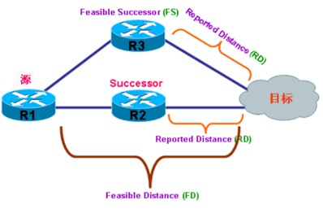

# EIGRP
{: .no_toc }

## 目录
{: .no_toc .text-delta }

1. TOC
{:toc}

## 概述

EIGRP 是思科私有协议，只能运行在思科的设备上。

EIGRP 能够支持的协议有 IP、AppleTalk 和 IPX。

EIGRP 的流量使用 IP 协议号 88。（ospf 89）

EIGRP 采用 Diffused Update Algorithm (DUAL)算法来计算到目标网络的最短路径，

EIGRP 还是一个距离矢量路由协议。因为 EIGRP 是距离矢量路由协议，所以 EIGRP 同样会受水平分割(Split Horizon)的影响。

EIGRP 使用了 Autonomous System(AS)的概念，即使是这样，EIGRP 也算不上外部网关路由协议(Exterior Gateway Protocol 即 EGP)，因为不同 AS 之间，EIGRP无法传递路由信息，所以 EIGRP 依然是个内部网关路由协议(Interior Gateway Protocol，即 IGP) 。AS 是基于接口定义的，一台 EIGRP 路由器可以属于多个 AS。

扩展到了最大支持 255 跳，但默认情况下最大跳数为 100 跳。  

EIGRP 支持 Classless Interdomain Routing (CIDR)和 Variable-Length Subnet Masks(VLSMs)，但默认也会自动汇总，该功能可以手工关闭

 

EIGRP 支持认证，并且只支持 MD5 认证 支持通过 Offset list 来增加路由的 metric，只可以增加，不可以减少。

EIGRP 也支持 Passive-Interface(被动接口)，但 EIGRP 的被动接口与 RIP 不同，RIP 的被动接口不向外发路由，但可以接收路由，而 EIGRP 的被动接口不接收也不发送路由。

EIGRP 并不会周期性更新路由表，而采用增量更新，即只在路由有变化时，才会发送更新，并且只发送有变化的路由信息;有时 EIGRP 并不知道邻居的路径是否还依然有效，并且路由没有超时。   

  



公式中的带宽为 1000 0000 除以链路中的最小带宽，带宽单位为 Kbit，延迟为链路中的延迟之和除以 10，延迟单位为 ms(毫秒)。

## EIGRP 邻居

EIGRP 使用了邻居的概念，EIGRP 的路由表并不会像 RIP 那样通过组播或广播向网络中发送，EIGRP 只向邻居发送路由表，并且是使用单播向邻居发送路由表，如果要在 EIGRP 之间交换路由表，必须成为邻居，不同 AS 不能成为邻居，EIGRP 只在直连网络中发现和建立邻居。

 

EIGRP 路由器之间的邻居关系通过 Hello 包来发现和维护，EIGRP 会将自己全部的路由表发给所有邻居;路由器上启动 EIGRP 之后，就会使用组播地址 224.0.0.10 在相应接口上发送 Hello 包， EIGRP 会使用一张单独的表来记录哪些路由器是自己的邻居，称为邻居表，只要收到 Hello 包，便将对方列为自己的邻居，并且写入邻居表，EIGRP 会将邻居的地址写在 Hello 包中，由此可见，EIGRP 路由器双方可能一方认为另外一方是自己的邻居，而另外一方却不认为对方是邻居，例如自己收到了另一方的 Hello 包，认为对方是邻居，而对方没有收到或过滤了自己的 Hello 包，所以如果 EIGRP 要形成双向邻居，只有在双方都发现对方的 Hello 包中列出自己的地址才行，但思科却没有这样设计。

在 EIGRP 断开或进程关闭时，会发送 Goodbye Message 结束邻居关系。

EIGRP 会定期向网络中发送 Hello 包，发送的间隔会因为链路带宽的不同而不同，间隔时间分为 5 秒和 60 秒:   

- Hello 间隔 60 秒
  - 所有带宽低于或等于 1544 Kbit/s 的，如 T1，Frame Relay multipoint 接口，ATM multipoint 接口，ISDN BRI 接口等等。

- Hello 间隔 5 秒
  - 所有带宽大于 1544 Kbit/s 的，如以太网接口，Frame Relay point-to-point 子接口，ATM point-to-point 子接口，ISDN PRI 接口。

如果超过一定的时间没有收到邻居的 Hello 包，便认为邻居无效，称为 EIGRP Hold-time，默认为 Hello 间隔的 3 倍（ospf dead 4 倍），也就是分别为 15 秒和 180 秒，Hello 间隔时间和 Hold-time 都可以手工调整，但是如果调整了 Hello 间隔时间，Hold-time 并不会自动调整到相应的 3 倍，而是保持不变。

 

★Hello 间隔和 Hold-time 可以手工在接口上配置，如果发现不正常，请检查接口上是否手工配置了时间参数。

★EIGRP 双方 Hello 间隔和 Hold-time 不一致也可以建立邻居关系，接口上的Secondary 地址不能建邻居，所有 EIGRP 的数据包源地址总是接口的 Primary 地址。

★在 Frame-Relay 环境下，需要在命令 frame-relay map 带 broadcast 关键字。

 

EIGRP 双方必须满足以下三个条件，才能建立邻居:

★1.双方在相同 AS

★2.双方 Hello 包正常，即双方接口 Primary 地址在同网段。

★3.双方计算 Metric 值方法相同，即双方 K1 K2 K3 K4 K5 值相同。

## EIGRP 数据包

1，hello

2，update

3.查询querry 路由丢失，网络出问题，路由条目进入active状态，进行查询（给所有邻居发查询），进入SIA状态（active状态） ，计时3分钟，必须回复replay，若未回复则断掉neibor 为了防止query无限制发下去。

4.应答reply

5.ack

 

5 种数据包中，Update、Query、Reply 在对方收到后，都需要回复确认，这些数据包是可靠的，回复是发送 Ack;而 Hello 和 Ack，是不需要回复的，因此被认为不可靠。

  

## EIGRP 拓朴

Reported Distance 是表示邻居到达目的地的 Metric 值是多少。所以自己到目的地的真正Metric 应该是自己到邻居这段距离的 Metric 加上 RD，但是拓朴数据库中可能存在多条去往目的地的路径，而被放入路由表的最优的那条被称为 Feasible distance(FD)。

R1 到达目的地的 FD，R1 将 R2 的路径放入路由表中，这时，R2 也称为 Successor;默认情况下，拓朴数据库中有多条路径可到目的地时，被放入路由表的那条就是 FD，FD 就一定会被放入路由表。

 

而留在拓朴数据库中的备用路由称为 Feasible Successor (FS)



Feasibility Condition (FC)

拓朴数据库中的 FS 最多可以有 6 条(其中已经包含FD)，不是所有邻居路径都可以存到拓扑数据库中作备份，必须满足：

 **Feasibility Condition (FC)**，就是邻居通告的 RD 必须小于 FD， 这个邻居的路径才能存在于拓朴数据库。

当最优路由丢失后，拓朴数据库中又没有备用路由，在这种情况下，EIGRP 会向所有邻居发送 Query，试图查询邻居是否有到目的地的路由信息，并且发送 Query 后，该路由被标记为 Active route ，该状态称为 Stuck In Active (SIA)。

向邻居发送的 Query 是必须回复 Ack 确认的，当邻居收到 Query 之后，就会查询自己的路由表，如果有，就向邻居回复 Reply，如果最终邻居的路由表和拓朴表中都没有相应路由条目，就会再向自己的所有邻居发出 Query，如果发送 Query 的路由器在 3 分钟内没有收到邻居的回复，就会清除与该邻居的 EIGRP 会话。

造成 EIGRP 路由器无法回复邻居 Query 的原因有很多，如：CPU繁忙，内存错误，数据包丢失，或者是单向链路故障等等。

  

## EIGRP协议的汇总

```shell
R1(config)#interface fastethernet0/0
R1(config-if)#ip summary-address eigrp 90 192.168.0.0 255.255.252.0
```

 

## EIGRP协议的认证

注意：EIGRP协议仅仅支持MD5认证

```shell
R1(config)#key chain ccie
R1(config-keychain)#key 1
R1(config-keychain-key)#key-string cisco
R1(config-keychain-key)#end
R1(config)#interface fastethernet0/0
R1(config-if)#ip authentication mode eigrp 90 md5       //开启eigrp认证
R1(config-if)#ip authentication key-chain eigrp 90 ccie    //定义eigrp认证密钥 

SIA卡在Acitve状态 -->3min  -->eigrp stub
R1(config)#router eigrp 90
R1(config-router)#eigrp stub   //定义此设备为EIGRP协议的末节设备
```

```shell
router eigrp 90
 no auto-summary
 network 12.1.1.0 0.0.0.255
 network 12.1.1.0 255.255.255.0
 network 12.1.1.0 -->12.0.0.0/8
```

