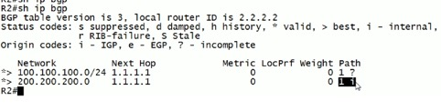
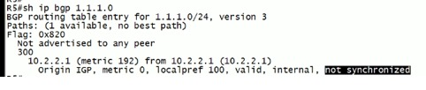
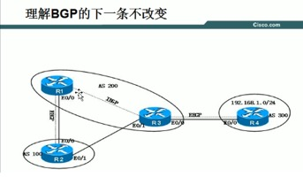
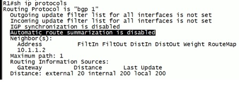
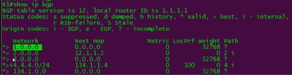
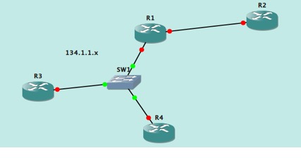

# BGP
{: .no_toc }

## 目录
{: .no_toc .text-delta }

1. TOC
{:toc}

## 概述 

- 优点：支持条目数多（ospf 1万，isis 2万），稳定，选路可修改的参数多（一般igp只有metric和AD）。增量更新（只将更新的条目传给peer）

- 基于TCP（端口179），所以是可靠更新

- EBGP ad 20， IBGP 200

 

- ebgp 要求必须直连，open包中跳数只有1（此值可以被修改）

```shell
nei 1.1.1.1 ebgp-multihop 2
nei 1.1.1.1 eb 2
如果中间有一个三层交换，则改为3
```

- ibgp 的open包中跳数有255，因此可以跨路由器建邻居



*i 表示通过 network 宣告学习到的。*

 

`clear ip bgp * soft out`

不清除bgp tcp会话，重发更新。


ibgp 内部防环（水平分割） ：

`show ip bgp`中打 i 的不会发给 ibgp 邻居，解决办法，全互联 or router-reflect

 

从IBGP 学到的EBGP 路由，其下一跳仍然是EBGP的。

 

同步原则，学习的 BGP 路由也要存在于 igp 路由表中。

同步：指的是从BGP协议学到的路由也必须从IGP协议学到 -->如果违反：路由不优化

路由条目不优：此路由不会被放进路由表中，也不会传递给下一邻居

## 手动聚合

1，

```
ip route 192.168.0.0 255.255.0.0 null 0
```

之后本地会有此路由条目，在bgp中可用network 宣告

2，   使用 agg，如果BGP路由中有该聚合内的明细路由，则在BGP中生成聚合，然后把所有的发给邻居。因此需要启用 summary-only，之后在本地的bgp 表中，能看到明细路由前面有S，表示被抑制。

聚合的问题：可能将聚合路由发给不需要的路由

假如一端是本AS，另一端是ISP，则将聚合路由发给ISP不好。加入AS-set只发给本AS之后AS Path 会从 ? 变成 num i  

 

## 抑制列表

```shell
supress-map -- 需要调用route-map
192.168.8.0/23
192.168.9.0/23   ！抑制
192.168.10.0/23
192.168.11.0/23
ip Prefix-list 10 permit 192.168.8.0/23 ge 24 le 24
route-map SUP permit 10
match ip add prefix 10
exit

!不需要加空条目，否则会抑制所有条目
router bgp xx
aggregate-address 192.168.8.0 255.255.255.0 supress-map SUP
```

 

## 默认路由下放

```shell
router bgp 111
nei 1.1.1.1 default-information originate
ip route 0.0.0.0 0.0.0.0 null 0
router bgp
redistribute static
ip route 0.0.0.0 0.0.0.0 null 0
net 0.0.0.0 
```

 

## BGP表中导致路由不优的原因：

1.下一跳不可达

2.同步未关闭



`show ip bgp 1.1.1.0 `，如果未关闭同步，则显示未同步，而路由不优

如果将 bgp 重发布ospf，这样 ibgp 邻居都能通过 IGP 学到路由，也通过 IBGP 学到了，也显示最优路由，但是还是不加表，因为ospf管理距离比 ibgp 学到的 200 小。



 

 

 

 

 

 

全网运行ospf，全互联。

R4 将自己的环回口宣告到bgp。 R3 上设置next-hop-self

之后R1 能学到192.168.1.0/24，下一跳是4.4.4.4

根据IGP路由表，4.4.4.4 的下一跳是10.1.1.2

R2 通过R1 也学到了，下一条是R1，1.1.1.1（因为通过EBGP peer R1学到的）

解决办法，R1上设置 next-hop-unchanged

```
router bgp 200
nei 2.2.2.2 next-hop-unchanged
```


## BGP 自动汇总

BGP 自动汇总默认未被开启

 

汇总原则：

1， igp： 172.16.0.0/16 xxx

C 172.16.1.1/24

C 172.16.2.1/24

那么router bgp 200 -- network 172.16.0.0 不会宣告，因为路由表中没有完全匹配的路由条目，如果开启了bgp auto-summary ，那么还会寻找igp中的明细路由，如果有则汇总后宣告。

2， 通过rip宣告了。 然后将rip重发布进bgp，这样bgp中会有明细的条目（show ip bgp）开启了自动汇总，还会汇总后宣告（按照主类）

 



当 Path 为问号，表示不确定时，意味着条目是重发布进来的，且重发布的下一跳是0.0.0.0

 

 

## VPNv4

RD -- route DIstinguisher

在MPLS VPN 中，私网路由的前缀形式是  XX:XX :192.168.1.1

直接在路由前缀（192.168.1.1）中标示路由的VPN信息（XX:XX）

格式：

16位自制系统号ASN：32位用户定义数: 100:1

IP地址：16位用户自定义数

•	通常建议每个VPN用相同的实例，理论上，只有保证本地相同IP地址的两个VPN实例RD不同即可。这两个VPN实例一定不能互访

•	RD 的作用是路由撤销。按照BGP原理，在撤销路由时不会携带路由属性值，也就是不能携带RT属性。PE在撤销时不知道要撤销哪个

VPN的路由

（个人理解，RT是让对方判断哪些该接收到哪些vrf表中，但是在vrf中，还得需要RD判断路由来源，从对方收到的会携带RD信息）

•	在IPv4 地址前加上RD后，就成了VPNv4 地址镞，原来标准地址族为IPv4

•	VPNv4 主要用于PE路由器间传递VPN路由

•	VPNv4 地址只存在于MP-BGP的路由信息和PE设备的私网路由表中。即只出现在路由的发布学习中

  

## 关于下一跳



 

R1 和 R3 建立 peer， R3 和R4 peer，R4 去往R1 的下一跳会直接成为R1 的接口

原因：

R3 发现收到**R1**报文的**源地址**和要发给**R4**更新包的**目标地址**处于同一网段。因此更新包的下一跳直接改成R1的接口地址，而不是自己的地址。

 

只有两种情况下一跳是0.0.0.0：**宣告的是本地直连，宣告的是静态路由条目**

 

卡在Idle ： 没有去往邻居的路由条目；**检查IGP**

卡在active：

1， 收到邻居发来的open报文，但是回包时，没有去往对方更新源的路由

2，邻居地址配错

3，单向 neighbor， 对方收到open后会直接丢弃。

4，AS number 号错误了

 
