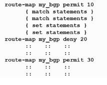

# 重发布路由
{: .no_toc }

## 目录
{: .no_toc .text-delta }

1. TOC
{:toc}

## 重发布


将Rip重发布进OSPF，将ospf重发布进eigrp。

结果：R4会有到R3的路由，R2没有到R3的路由

原因：R1上将RIP重发布进OSPF，R4可以收到R3的LSA，本地会有个OE 1的到R3的路由。但是LSA不会传给R1（水平分割），R1 不会有到R3的OSPF路由，因此将OSPF重发布到eigrp时不包含R3的信息，R2只能收到R4的路由。

 未重发布前R1：


R2：


## Distribute List 分发列表

控制层面，控制路由，过滤

DV 协议：可在出/入方向调用

OSPF，不能在出方向调用，入方向调用只影响本地路由的接收，不影响区域内别的路由. 

`show ip protocols`

可以看到路由协议应用的过滤规则

 

实验要求：R2不能收到R4的环回口路由

要求最优过滤：正常R1会将OSPF转成EIGRP路由条目，再通过Distribute list过滤。

优化：让R1收到OSPF后不转换先过滤

```shell
distribute-list 10 out ospf 110
！在本路由器行，将ospf 110的路由重发布进本路由协议之前，使用过滤
```


 

## Prefix list 前缀列表

perfix list和ACL的区别是，Prefix可以抓前缀和掩码，acl只能抓前缀（192.168.1.0），序列号默认为 5

```shell
ip Prefix-list 10 permit 0.0.0.0/0 le 32
ip prefix-list 10 seq 10 permit 2.2.2.0/25 ge 27
# 掩码长度>=27位，前25位必须是2.2.2.0，25-任意26为。。
ip Prefix-list 10 seq 40 permit 2.2.2.0/25 ge 27 le 30
```


例子：

1，抓主A类地址

```shell
ip prefix-list 20 permit 0.0.0.0/1 ge 8 le 8
access-list 10 permit 0.0.0.0 127.0.0.0
```


2，抓A类和其子网路由，其子网最大27位

```shell
ip prefix-list 10 permit 0.0.0.0/1 ge 8 le 27
```

3，主C类路由

```shell
ip prefix-list 30 permit 192.0.0.0/3 ge 24 le 24
```


## Route-map

功能：

1，用于路由重分发的过滤，利用 acl/prefix

2，PBR，策略路由

3，BGP策略部署

每个 Route-map 都可包含 Match 和 Set，类似于如果，然后在路由重发布时，Permit 放行路由条目，Deny 丢弃。



Permit 中，只有每个 match 语句为真才执行 set

 

例1：

```shell
match ip add 10
match ip add 20
access-list 10 permit 2.2.2.0
access-list 20 permit 3.3.3.0
```

**此时不能抓到任何路由条目**

 ```shell
 match ip add 10
 match route-type external type 2
 access-list 10 permit 2.2.2.0
 access-list 20 permit 3.3.3.0
 ```

route-map 有一个空 Entry，序列号永远最高，没有 match（match anything） set nothing

控制层面Route-map 可以使用扩展ACL

```shell
access-list 100 permit ip host 1.1.1.0 host 255.255.255.0
access-list 100 permit ip 1.1.1.0 0.0.0.0 255.255.255.0 0.0.0.0
```

源部分抓前缀，目的部分抓掩码。

 

## 双点双向重分发


 

在R1和R4上双向重分发

如果将Rip换成EIGRP不会出现环路

- R1上，将EIGRP重发布进ospf，R4可以收到去往R2的OE2路由，但是因为R4也运行了eigrp，其管理距离小，所以不会将ospf路由加表。

- R1上，将ospf重发布进eigrp，R4能收到去往R3的eigrp外部路由，因为eigrp外部管理距离170比ospf110大，所以不会影响原来的路由

 

Rip & ospf 双向重发布

！先顺时针方向配

1，R1上将Rip重发布进ospf，R4会将原来去往R2的R路由替换成ospf（次优路径）。

解决办法：改大R4收到的R1重发布路由（LSA始发者R1）的AD

```shell
R1:router ospf 110
redistribute rip subnets

R4： router ospf 110
distance 121 1.1.1.1 0.0.0.0 10
distance 路由始发者，acl过滤
access-list 10 permit 1.1.1.0
access-list 10 permit 12.1.1.0
access-list 10 permit 2.2.2.0
```


2，R4上将ospf重发布进Rip

```shell
router rip
redistribute os 110 metric 3
```

不会对R1的路由表影响

 

3，逆时针，R4上将Rip重发布进ospf

 会影响R1的路由，在R1上将Rip的AD改小。

```shell
router rip
distance 109 12.1.1.2 0.0.0.0 10
access-list 10 permit 2.2.2.0
access-list 10 permit 24.1.1.0
```


4，R1 上 ospf 重发布进 Rip 无影响

 

此时 R2 和 R3 到达对方都会负载均衡，R2 到 34 网段，4 的环回口也会负载均衡。通过路由传递更改 Metric。

解决办法：R1上抓出去往34网段和4网段的路由，在重发布进 Rip 时将 seed metric 改大于3

```shell
R1：
ip prefix-list 10 permit 4.4.4.0/24
ip prefix-list 10 permit 34.1.1.0/24
route-map O2R permit 10
match ip add pre 10
set metric 4
route-map O2R permit 20
exit
!放过其他 
```

R2去往13网段也会负载均衡

```shell
R4：
access-list 20 permit 13.1.1.0
router rip
offset-list 20 out 1 f0/0
!R4 f0/0口传出的RIP路由metric 加1，等于4
```


**同理：**

R3上更改AD和Metric 控制选路

```shell
R3：
conf t
access-list 10 permit 1.1.1.0
access-list 10 permit 12.1.1.0
router os 110
distance 109 1.1.1.1 0.0.0.0 10
```

在R4上，使用route-map，将24.1.1.0 的Metric-type 改为OE1 （优于OE2）

```shell
access-list 30 permit 24.1.1.0
route-map O2R permit 10
match ip add 30
set metric-type type-1
exit
route-map O2R permit 20
exit
router os 110
redistribute rip subnets route-map O2R
```

