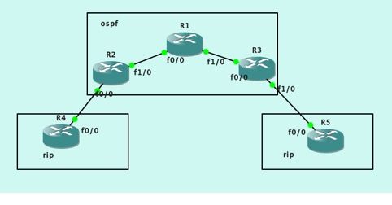
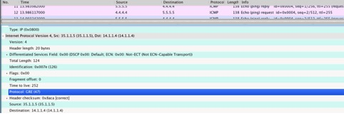

# IP Tunnel
{: .no_toc }

## 目录
{: .no_toc .text-delta }

1. TOC
{:toc}

##  IPv4 Tunnel 实验




说明：

Tunnel 用于传输数据，在此处，R4和R5间在公网上建立Tunnel，之后在局域网内宣告Tunnel口的地址，即可实现私网信息通过Tunnel传输。

 

设置：

R4 的出口，R5的出口地址与公网完全互通。R4 , R5其他接口（如环回）用rip宣告，不能与公网互通。

```shell
R4： 
int f0/0
ip add 24.1.1.4 255.255.255.0
no sh

int l0
ip add 4.4.4.4 255.255.255.0

 

int tunnel 0
ip add 192.168.1.4 255.255.255.0
no sh
tunnel source int f0/0
tunnel destination 35.1.1.5

//source 和 destination 必须能直接相通

router rip
net 4.4.4.4
net 192.168.1.0 
```


**只有宣告tunnel**才能保证路由学习成功

抓包，分析Tunnel的协议号：



启用ACL 过滤掉Tunnel，使通信中断

 ```shell
 ip access-list ex mine
 deny 47 any any
 permit ip any any
 
 int f0/0
 access-group mine in/out
 ```

## IPv6 Tunnel

### IPv6 to IPv4

需要指定 tunnel 源，不需指目标，不能运行路由协议，需要手动指路由

``` shell
int tunnel 0
tunnel source f0/0
tunnel mode ipv6ip 6to4
ipv add 2002:101:101::1/64
ipv route 2002::/16 tunnel 0
ipv route ::/0 2002:404:404::4
```


### IPv6 over IPv4

需要设置 tunne 源和目标，需要设置 IPv6 地址，可以使用路由协议

```shell
int tunnel 0
tunnel mode ipv6ip
tunnel source l0
tunnel destination 4.4.4.4
ipv add 2002:101:101::1/64
ipv os 110 area 0
```


