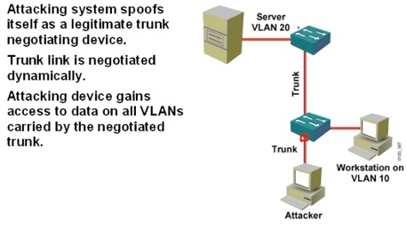

# 二层安全
{: .no_toc }

## 目录
{: .no_toc .text-delta }

1. TOC
{:toc}

## 1. MAC Layer 攻击--port-security

### CAM表溢出攻击 （mac flood-未知单播泛洪攻击）

Unknow Unicast Flooding 定义：对于不知道目的的单播包(目标mac没有和任何接口对应的mac相关联)，SW会向所有端口泛洪。

攻击原理：攻击者伪造数据包，改源MAC地址，每次交换机都会记住此源地址和端口对应关系，造成溢出，之前存储的**正确的CAM**对应关系会丢失。

新发的包会**成为未知单播包**，会泛洪，通过抓包能抓到。


未知单播攻击的常见方式:

1. 有人恶意大量发送未知单播帧，交换机会向所有端口泛洪，造成网络拥塞；
2. 假设交换机接了N个主机，一台主机B连接断开，A有到B的arp缓存，所以还会照样给B发送数据，但是交换机已经失去了B的记录，此时此帧会成为未知单播帧，可以在配置了 Port-security 的端口上设置阻止单播帧。

在接口下启用 `switchport block unicast`

！只会阻止进来的数据


### MAC欺骗攻击（Spoofing MAC Address ）

MAC 欺骗攻击，伪造MAC，让交换机把数据发过来。

解决办法：port-security


启用 port-security：

```
config-if)#switchport port-security maximum 2

1,所有接口默认都是关闭port security
2,默认每个接口最大mac是1个
3,默认violation 是shutdown
```

 

两种violation触发条件：

- 一个接口的mac地址数超过maximum

- 如果一个 vlan中两个接口mac相同，也会violation

（如果两端口A，B设定了sticky，一台设备在A上使用过，则A记录下 mac-port 对应关系，一直保存，如果设备接到B端口会发生violation）

 

violation 三种动作

- shutdown

- restrict（限制，约束） 丢掉违规数据包，并告警发送SNMP trap（新设备无法接入）

- protect 丢包不警告，不发送SNMP trap （新设备无法接入）

 

protect—Drops packets with unknown source addresses until you remove a sufficient number of secure MAC addresses to drop below the maximum value.

restrict—Drops packets with unknown source addresses until you remove a sufficient number of secure MAC addresses to drop below the maximum value and causes the SecurityViolation counter to increment.

shutdown—Puts the interface into the error-disabled state immediately and sends an SNMP trap notification.

  

三种地址学习：

1,自动获取

2,手动指定：`switch port-security mac-address 1.1.1`，最好先关闭端口再添加。

3,Sticky：`switch port-security mac-address sticky`，自动学习 mac 并保存

 

路由器改mac地址：

```
(config-if)#mac-address 1.1.1
```


恢复接口:

1.先关闭port-security ，再关闭接口，再启用接口

2.自动恢复

```
Switch(config)# errdisable recovery cause psecure-violation 
Switch(config)# errdisable recovery intervel 10
```

查看端口状态：

```
SW#**show port-security interface f1/0/3**                        
Port Security       : Disabled                        
Port Status        : Secure-down                      
Violation Mode       : Shutdown                        
Aging Time         : 0 mins                        
Aging Type         : Absolute                        
SecureStatic Address Aging : Disabled                        
Maximum MAC Addresses   : 1                           
Total MAC Addresses    : 0                           
Configured MAC Addresses  : 0                           
Sticky MAC Addresses    : 0                           
Last Source Address:Vlan  : 0000.0000.0000:0                    
Security Violation Count  : 0
```

### 基于MAC的流量过滤

对 vlan 1 中某 MAC 发的包进行丢弃。3550 以上交换机支持：

```
mac address-table static 0001/7b80.7b11 vlan 1 drop
```


## 2. Vlan 安全

 

### 1. Vlan hopping攻击

**类型：**

1. 攻击者和SW间建立Trunk，可以获得所有Trunk中的信息；



2. PC发送双层802.1Q 双层报头帧，外层所属vlan帧，内侧攻击目标Vlan

 

 


解决办法：因为主机和SW之间默认是动态协商（DTP），所以将端口设为access即可解决Vlan Hopping攻击

### 2. PVLANs


Private VLAN分两种大类型:主Vlan和次Vlan，次Vlan又分两种。

 

- Primary VLAN：一个隔离vlan有且仅有一个Primary vlan，Private vlan中的所有接口都属于Primary vlan

- Secondary VLAN：

  - Isolated VLan：一个Private vlan只有一个隔离VLAN，其数据只能通向混杂端口

  - Community Vlan：一个Private Vlan中可以有多个Community vlan，一个community vlan最多只能有8个 user network interfaces (UNIs) and enhanced network interfaces (ENIs)

 

两个Secondary VLAN之间不能互访。

Primary Vlan和Secondary VLAN之间能互访。

Community Vlan(社团 vlan) 之内的 PC 可以相互访问 Isolated VLAN(隔离VLAN)内部PC间不能互访。

 

**端口角色**：

- 混杂端口：属于primary vlan，可以和任何端口通信

- 隔离端口：属于Isolated vlan,数据发向混杂和Trunk

- Community：属于community vlan

```
默认只有混杂端口才能管理交换机（连同Primary vlan的SVI口）
int vlan 20
private-vlan mapping 501,502
ip routing
secondary vlan也能访问SVI
```

**配置**（需要3560以上三层交换机才支持）：


1，将VTP模式设为Transparent

2， 

```
switch（config）#vlan 20
switch（config-vlan）#private-vlan primary

！将vlan 20设为主vlan
switch（config-vlan）#vlan 501
switch（config-vlan）#private-vlan isolated

！将vlan 501 设为隔离vlan
switch（config-vlan）#vlan 502
switch（config-vlan）#private-vlan communicty

！将vlan 502设为团体vlan

switch（config-vlan）#vlan 20
switch（config-vlan）#private-vlan association 501,502

！将连个secondary vlan 501 和 502 关联到主vlan 20下
```


3，划分端口

```
switch(config)#int f1/1
switch(config-if)#switchport mode private-vlan promiscuous
switch(config-if)#switchp private-vlan **mapping 20 501-502**
！Trunk 口，设为混杂端口，关联vlan 20， 501和502

switch(config)#int range f1/2 - 4
switch(config-if)#switch mode private-vlan host
switch(config-if)#swit private-vlan **host-associate 20 501**
!将2-4口关联到隔离vlan 501 上，主vlan 为20

switch(config)#int range f1/5 - 8
switch(config-if)#switch mode private-vlan host
switch(config-if)#swit private-vlan **host-associate 20 502**
!将5-8口关联到社团vlan 502 上，主vlan 为20
 
IOU2-SW# show vlan private-vlan
Primary Secondary Type       Ports
------- --------- ----------------- ------------------------------------------
20   501    community  Et0/1, Et0/2
20   502    isolated  Et0/1, Et0/3

IOU2-SW# show int e0/1 switchport
Name: Et0/1
Switchport: Enabled
Administrative Mode: private-vlan promiscuous
Operational Mode: private-vlan promiscuous
Administrative Trunking Encapsulation: negotiate
Operational Trunking Encapsulation: native
Negotiation of Trunking: Off
Access Mode VLAN: 1 (default)
Trunking Native Mode VLAN: 1 (default)
Administrative Native VLAN tagging: enabled
Voice VLAN: none
Administrative private-vlan host-association: none
Administrative private-vlan mapping: 20 (VLAN0020) 501 (VLAN0501) 502 (VLAN0502)
Administrative private-vlan trunk native VLAN: none
Administrative private-vlan trunk Native VLAN tagging: enabled
Administrative private-vlan trunk encapsulation: dot1q
Administrative private-vlan trunk normal VLANs: none
Administrative private-vlan trunk associations: none
Administrative private-vlan trunk mappings: none
Operational private-vlan: none
Trunking VLANs Enabled: ALL
Pruning VLANs Enabled: 2-1001
Capture Mode Disabled
Capture VLANs Allowed: ALL
Appliance trust: none
```

### 3. Protected port 端口保护

两个protected端口之间不能相互通信，保护和非保护之间能相互通信

```
switch(config)#int f1/0/1
switch(config-if)#switchport protected
```


## 3. spoofing 欺骗攻击

### 1. DHCP spoofing

攻击者伪造成dhcp服务器，向client发放地址，但是此时不能保证别人一定从自己的DHCP获取到地址

**因此：**发送大量dhcp请求将DHCP服务器地址获取完，然后自己启用DHCP服务，别人获取的地址就是**一定是自己发的**

解决方案：dhcp snooping

``` 
ip dhcp snooping
!全局启用DHCP Snooping
ip dhcp snooping vlan 11-200
!对11-200启用DHCP snooping 功能
//启用之后，所有涉及接口都是dhcp client

int f0/0
ip dhcp snooping limit rate 100
！对DHCP 请求包速率限制每秒100个，如果超过shutdown

ip dhcp snooping trust
!定义本接口为信任DHCP服务器（上行接口，连交换机）所连接的接口

DHCP-R（config）# ip dhcp relay information trust-all
! DHCP 路由器上设置

show ip dhcp binding
IOU2-SW#**show ip dhcp snooping binding**
MacAddress     IpAddress    Lease(sec) Type      VLAN Interface
------------------ --------------- ---------- ------------- ---- --------------------
CC:03:15:16:00:00  192.168.1.2   86325    dhcp-snooping  1   Ethernet0/3
CC:02:15:06:00:00  192.168.1.3   86323    dhcp-snooping  1   Ethernet0/2


int f0/1/0
ip vertify source port-security
!开启ip source guard，需要开启dhcp snooping，开启后此端口会生成一条ACL，默认允许DHCP通过，主机能获得地址，交换机也会将IP信息做记录，之后除此IP的所有流量都会丢弃。
```

可以看出, IP Source Guard 和 DHCP snooping 的配合使用,可以防止一个主机使用其它主机的 IP 地址来攻击网络,因为只有 DHCP 获得的地址能够被交换机转发,其它接口即使配置了相同 IP,都会被 IP Source Guard 拒绝放行。

### 2. ARP欺骗攻击

周期性发送免费ARP（gratuitous）包，让所有PC的IP都对应成自己的MAC

 

免费ARP，无故ARP，检测 IP 地址冲突。更新自己的 IP，源是自己的 IP 和 mac：

```
R3(config-if)#
*Mar  1 00:11:03.851: DHCPD: IP address change on interface Ethernet0/0
*Mar  1 00:11:03.867: IP ARP: sent req src 192.168.1.3 cc03.1516.0000,
                 dst 192.168.1.1 cc01.14eb.0000 Ethernet0/0
*Mar  1 00:11:03.871: IP ARP: sent rep src 192.168.1.3 cc03.1516.0000,
                 dst 192.168.1.3 ffff.ffff.ffff Ethernet0/0
*Mar  1 00:11:03.899: IP ARP: rcvd rep src 192.168.1.3 cc02.1506.0000, dst 192.168.1.3 Ethernet0/0
*Mar  1 00:11:03.899: %IP-4-DUPADDR: Duplicate address 192.168.1.3 on Ethernet0/0, sourced by cc02.1506.0000
```


**检测到地址冲突后：**

```
*Mar  1 00:12:23.467: IP ARP: Gratuitous ARP throttled.
*Mar  1 00:12:23.467: IP ARP: 192.168.1.3 added to arp_defense_Q
*Mar  1 00:12:23.559: IP ARP: 192.168.1.3 removed from arp_defense_Q
*Mar  1 00:12:23.559: IP ARP: sent rep src 192.168.1.3 cc03.1516.0000,
                 dst 192.168.1.3 cc03.1516.0000 Ethernet0/0
*Mar  1 00:12:23.575: IP ARP: rcvd rep src 192.168.1.3 cc02.1506.0000, dst 192.168.1.3 Ethernet0/0

```


**1.** **手动绑定ARP**

```
Router(config)# arp 10.1.1.1 aaaa.aaaa.aaaa arpa
PC: arp -s 10.1.1.2 xx-xx-xx-xx-xx-xx
```


**2. DHCP 环境下动态arp inspection**

前提是有DHCP映射，所以需要开启ip dhcp snooping

配置：


在valn2 中检查arp包，检查arp映射是不是对。如果查到伪装的就**丢弃**

**默认**接口会有**ip arp inspection limit rate 15** 的设置，如果此接口arp**包数过多**则会关闭接口

**ip arp inspection limit rate xx** **修改此端口每秒允许的包数**

**上行接口**（和交换机相连的）启用trust，否则从那里来的正常ARP也会过滤掉（因为没有dhcp映射）:

```
int g0/0
ip arp inspection trust
```


**3.** 静态设置ARP-IP映射，再开启arp inspection

配置：

```
sw(config）# arp access-list bl
sw(config-arp-nacl)# permit ip host sender-ip  mac host sender-mac [log]
sw(config-arp-nacl)# exit
(config)# ip arp inspection filter arp-acl-name vlan 2 [static]
int f1/0/1
no ip arp inspection trust
! swA与swB相连的接口设为unstrust
！dhcp 方式不会获取到别的交换机的mac-ip映射，但手工指定则每这个限制，所以可以设为untrust
```

arp inspect Rate-Limit：默认所有端口都为 untrust 状态，rate-limit 为 **15
**如果改为ip arp inspect trust ，则没有rate-limit限制， 如果此时(trust)再手动加一条ip arp inspect limit rate 10，则会限制成10 使用no ip arp inspection limit 恢复默认rate-limit限制

```
Switch(config)# errdisable detect	
! Enables per-VLAN error-disable detection.
cause arp-inspection [action shutdown vlan]
! By default this command is enabled, and when a violation occurs the interface is shutdown.
Switch(config-if)# [no] ip arp inspection limit { rate pps [ burst interval second] | none}
! rate none == no limit burst interval [1 - 15]
Switch(config)# errdisable recovery cause arp-inspection    
! 启用arp-errdis后恢复
Switch(config)# errdisable recovery interval interval
! 设置恢复时间，默认recovery关闭，recovery间隔300s
```

可以采用errdisable recovery自动恢复接口，或者shutdown ，no shutdown手 动恢复接口。

```
Mar 1 00:40:13.696: %SW_DAI-4-DHCP_SNOOPING_DENY: 2 Invalid ARPs (Res) on Fa1/0/1, vlan 1.([e0cb.4e1a.5db5/192.168.2.1/ffff.f)
*Mar 1 00:40:14.249: %SW_DAI-4-PACKET_BURST_RATE_EXCEEDED: 32 packets received in 15 seconds on Fa1/0/1.
*Mar 1 00:40:14.249: %PM-4-ERR_DISABLE: arp-inspection error detected on Fa1/0/1, putting Fa1/0/1 in err-disable state
*Mar 1 00:40:14.702: %SW_DAI-4-DHCP_SNOOPING_DENY: 1 Invalid ARPs (Res) on Fa1/0/1, vlan 1.([e0cb.4
Switch#e1a.5db5/192.168.2.1/ffff.ffff.ffff/192.168.2.254/00:40:13 UTC Mon Mar 1 1993])
*Mar 1 00:40:15.256: %LINEPROTO-5-UPDOWN: Line protocol on Interface FastEthernet1/0/1,
changed state to down
```


查看命令:

```
show mac address-table dynamic 
! 查看和交换机相连的设备mac (需要先ping)
Switch#show ip arp inspection interface 
!查看各接口 trust 状态和包限制数

Switch#show ip arp inspection interface
！查看各接口trust状态和包限制数
 Interface        Trust State     Rate (pps)    Burst Interval
 ---------------  -----------     ----------    --------------
 Fa1/0/1          Untrusted               15                 1
 Fa1/0/2          Trusted               None               N/A
 Fa1/0/3          Untrusted                4                 1
 Fa1/0/4          Untrusted               15                 1

Switch#show ip arp inspection statistics
！查看arp包统计信息
 Vlan      Forwarded        Dropped     DHCP Drops      ACL Drops
 ----      ---------        -------     ----------      ---------
    1            145            229             75            154

 Vlan   DHCP Permits    ACL Permits  Probe Permits   Source MAC Failures
 ----   ------------    -----------  -------------   -------------------
    1              0            145              0                     0

 Vlan   Dest MAC Failures   IP Validation Failures   Invalid Protocol Data
 ----   -----------------   ----------------------   ---------------------
    1                   0                        0                       0
    
！如果发正常的ARP包（mac-ip对应正确），ACL不会进行过滤
！但是因为默认接口会有arp包数限制，每秒超过默认15个会error-disable

Switch#show ip arp inspection vlan 1
Source Mac Validation      : Disabled
Destination Mac Validation : Disabled
IP Address Validation      : Disabled

 Vlan     Configuration    Operation   ACL Match          Static ACL
 ----     -------------    ---------   ---------          ----------
    1     Enabled          Active      bl                 No

 Vlan     ACL Logging      DHCP Logging      Probe Logging
 ----     -----------      ------------      -------------
    1     Deny             Deny              Off    

show interface vlan 1
查看 vlan 的mac
```

## 4. 设备发现攻击

1. 利用协议分析器检查CDP包，获取设备详细信息

 可获取IOS version，vtp domain-name

\#show cdp neibor detail

sw(config)#no cdp run

sw(config-if)#no cdp enable

!全局/接口关闭


## 5.port-security

```
switchport port-security
switchport port-security maximum 1
! 该端口只允许一个mac接入

switchport port-security violation [ protect /shutdown/restrict ]
! *protect 原接入设备不受影响,新设备无法接入*
! *restrict 新计算机可以接入,但警告*
```

 ```
switchport port-security mac-address [ 0019.5535.b828/sticky ]
//手工指定或动态学习
show mac-address-table

R1(config)#int g0/0
R1(config-if)#mac-address12.12.12
//改mac地址
 ```


接口因为错误而被关闭后。非法设备移除后，在 f0/1 接口下，执行`shutdown`和`no shutdown`命令可以重新打开该接口。

## 6.traffic Storm-Control (traffic suppression)

**基于接口的广播/组播/单播 流量限制**

```
interface fastethernet0/1
 strom-control broadcast/multicast/unicast level 0-100/bps(bit per second)/pps(packets per second)
 strom-control broadcast level 50

! 2k 为限制速率。50为百分比
! bps byte per second
! pps packets per second
```

 

默认行为：过滤

使用 trap 表示发送 SNMP trap 消息

```
config-if)#strom-control action shutdown/trap
```

