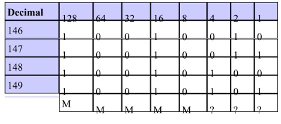
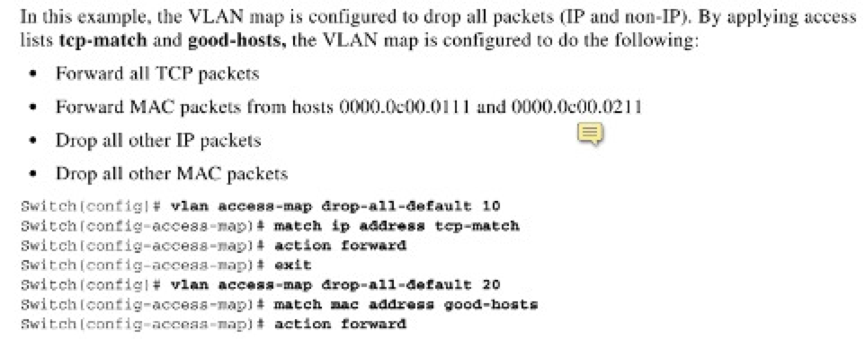

# 二层安全
{: .no_toc }

## 目录
{: .no_toc .text-delta }

1. TOC
{:toc}

# IP ACL

## ACL分类

1，标准ACL ：针对源IP或目标IP做出动作  

2，扩展ACL：针对源IP和目标IP ，或端口号及上层服务     （某源到某目标的）

3，命名式ACL：将普通ACL的数字用名字代替

   \- 也包含：标准和扩展

 

标准ACL： 1-99 （1300-1999  扩展号 IOS 12.0.1后可用 ）            

扩展ACL： 100-199  和扩展比功能多 （2000-2699 IOS 12.0.1后）          

命名ACL： ip access-list standard xxxx

​    ip access-list extended xxxx

 

 

举例：

access-list 1 permit 192.168.1 0.0.0.255 匹配这个网段所有的。

 

access-list 1 permit 192.168.1.0 匹配了网络号

 

access-list 1 permit 192.168.1.1 0.0.0.0 2.2.2.2 0.0.0.0 eq 23 eq为端口号，可改为telnet

等同于： access-list 1 permit host 192.168.1.1 host 2.2.2.2 eq 23

 

*interface Ethernet0/1*

*ip address 172.16.1.2 255.255.255.0*

*ip access−group 101 in*

*access−list 101 deny icmp any 10.1.1.0 0.0.0.255 echo*

*access−list 101 permit ip any 10.1.1.0 0.0.0.255*

*！禁止外部**ping*

## ACL 汇总

192.168.146.0/24

192.168.147.0/24

192.168.148.0/24

192.168.149.0/24



此时第三部分（third octet）的前5位相同，但是不能汇总成 192.168.144.0/21

因为此地址涵盖了192.168.144.0 - 192.168.151.0

必须汇总成两个地址：192.168.146.0/23   192.168.148.0/23

## 基于时间的ACL

`time-range   namexx`
`periodic` 每周的哪几天 hh:mm to hh:mm
或定义绝对时间：`absolute start-time-date  end-time-date`

最后在 ACL 调用
`ip access−list name|number <extended_definition> time−range name_of_time−range`

## 动态ACL（Dynamic ACL --lock and key）

开始所有通过路由器的流量都被禁止，直到用户通过Telnet 登陆到设备并认证后才允许指定流量通行；Telnet连接会向ACL添加一个动态条目，设有超时时间。
Lock and key configuration starts with the application of an extended ACL to block traffic through the router.   Users that want to traverse the router are blocked by the extended ACL until they Telnet to the router and are authenticated. The Telnet connection then drops and a single−entry dynamic ACL is added to the extended ACL that exists. This permits traffic for a particular time period; idle and absolute timeouts are possible.

```shell
username user-name password passwd
username user-name autocommand access-enable access−enable host timeout 10
!定义单个用户 autocommand

line vty 0 4
login local

autocommand access-enable host timeout 10
!如果将此条目直接放到vty下，对所有用户生效，则不能实现远程管理

interface Ethernet0/0
ip address 10.1.1.1 255.255.255.0
ip access−group 101 in

access−list 101 permit tcp any host 10.1.1.1 eq telnet
!−−− 15 (minutes) is the absolute timeout.
access−list 101 dynamic testlist timeout 15 permit ip 10.1.1.0 0.0.0.255 172.16.1.0 0.0.0.255
```


## 自反ACL -- Reflexive ACL

```
ip reflexive−list timeout 120
！默认300s

interface Ethernet0/1
ip address 172.16.1.2 255.255.255.0
ip access−group inboundfilters in
ip access−group outboundfilters out

ip access−list extended inboundfilters
permit icmp 172.16.1.0 0.0.0.255 10.1.1.0 0.0.0.255
evaluate tcptraffic
!Adds an entry that “points” to the reflexive access list. Adds an entry for each reflexive access list name previously defined. 添加一个指向自反ACL的ACL条目
！除icmp外，只有标记为tcptraffice的流量才能进来

ip access−list extended outboundfilters
permit icmp 10.1.1.0 0.0.0.255 172.16.1.0 0.0.0.255
permit tcp 10.1.1.0 0.0.0.255 172.16.1.0 0.0.0.255 reflect tcptraffic
！将tcp流量标记为tcptraffic
```

上例适用于连接外网的接口，如果此接口为内网接口，交换in/out 即可

## debug 过滤

```shell
1.  
access−list 101 permit ip any host 10.2.6.6
access−list 101 permit ip host 10.2.6.6 any

2. 
必须关掉fast-switching，否则只能看到第一个包
config interface
no ip route−cache

3. 
terminal monitor开启debug输出显示

4.  
debug  ip packet 101 或 debug ip packet 101 detail
```

##   ACL 评论/注解 commented ip ACL Entries

可用于标准和 扩展ACL。

 ```shell
 interface Ethernet0/0
 ip address 10.1.1.1 255.255.255.0
 ip access−group 101 in
 access−list 101 **remark permit_telnet**
 access−list 101 permit tcp host 10.1.1.2 host 172.16.1.1 eq telnet
 ```


## 基于上下文的AC-- context-based Access Control

简称：CBAC

CBAC 检查和管理TCP和UDP的会话状态信息，此信息用来创建临时缺口，CBAC 要实现的功能，就是 Reflexive ACL 所要实现的功能，但是由于 Reflexive ACL 有许多不足之处，所以需要 CBAC 来更好的支持。

 

Reflexive ACL 不支持中途变换端口的协议，如 FTP，这在 CBAC 中，是可以支的，Reflexive ACL对于什么样的数据包需要允许返回，是需要写 ACL 来精确匹配的，并且只能写一条，而 CBAC 可以直接写数据的协议名称，不用写 ACL 去匹配，CBAC 所写的协议，就是OSI 第 7 层应用层的协议，所以很方便用户匹配数据，并且可以写多个协议。

 

在使用 CBAC 时，就需要先写好一个 ACL，应用在外网进内网的接口上，用以拒绝某些数据的进入，当这些数据从内网发起外网时， CBAC就在进入的接口上临时创建缺口，让其返回。这个用在拒绝外网进入内网的 ACL，必须是扩展 ACL。以路由器自身为源或目的的数据，不被 CBAC所记录。

CBAC 同样有超时，由自己定义，并且可以打开审记功能，产生的日志就可以被记录。

语法：

```shell
ip inspect name inspection−name protocol [timeoutseconds]
This is an example of the use of CBAC in order to inspect outbound traffic. Extended ACL 111 normally block the return traffic other than(除了) ICMP without CBAC opening holes for the return traffic.
ip inspect name myfw ftp timeout 3600
ip inspect name myfw http timeout 3600
ip inspect name myfw tcp timeout 3600
ip inspect name myfw udp timeout 3600
ip inspect name myfw tftp timeout 3600

interface Ethernet0/1
ip address 172.16.1.2 255.255.255.0
ip access−group 111 in
ip inspect myfw out

access−list 111 deny icmp any 10.1.1.0 0.0.0.255 echo
access−list 111 permit icmp any 10.1.1.0 0.0.0.255

# 查看 CBAC 的会话记录
r1#sh ip inspect sessions
Established Sessions
Session 835AC510 (10.1.1.2:63276)=>(14.1.1.4:23) tcp SIS_OPEN
```


## 加速ACL -- Turbo ACL

```shell
适用于7200/7500以上平台，IOS 12.1.5 T，可增加ACL条目处理速度，提高路由性能。

首先定义一些ACL条目（标准/扩展 都行）
access−list 101 permit tcp host 10.1.1.2 host 172.16.1.1 eq telnet
access−list 101 permit tcp host 10.1.1.2 host 172.16.1.1 eq ftp
access−list 101 permit udp host 10.1.1.2 host 172.16.1.1 eq syslog
access−list 101 permit udp host 10.1.1.2 host 172.16.1.1 eq tftp
access−list 101 permit udp host 10.1.1.2 host 172.16.1.1 eq ntp

!−−− Tells the router to compile. 告诉路由器编译ACL条目
access−list compiled

Interface Ethernet0/1
ip address 172.16.1.2 255.255.255.0
ip access−group 101 in

show access−list compiled
!查看命令
```

# IPv6 ACL

基础配置

```shell
ipv6 access-list access-list-name
permit protocol any any
deny protocol any any
```

RACL -- 接口下应用：

```shell
int f0/0
ipv6 traffic-filter access-list-name {in | out}
```


## PACL

二层接口下使用的ACL，基于二层和四层参数过滤三层包

* RACL -- 应用在SVI 或三层口下过滤三层流量
* VACL -- 在vlan上设置，过滤vlan上通过的二层以及三层流量。

限制：

- ipv6 PACL 不支持出方向
- ipv6 PACL 支持time-based ACL
- ipv6 PACL 支持二层etherchannel，但不支持其组成接口支持trunk，但是access-group mode 必须是prefer port

举例：

```shell
Router# enable
Router# configure terminal
Router(config)# ipv6 access-list list1
Router(config-ipv6-ACL)# permit tcp 1000::1/64 any
Router(config-ipv6-ACL)# end
```


下列步骤应用：

```shell
enable
configure terminal
interface type number
switchport         
switchport mode {access | trunk}
    switchport access vlan vlan-id 		[or]
    switchport trunk allowed vlan vlan-list
access-group mode {prefer {port | vlan} | merge}
ipv6 traffic-filter access-list-name in
end
```

PACL和 router ACL/ VACL 交互：

- 可以在接口下配置 access-group mode {prefer { port | vlan } | merge }

- 如果prefer port则只生效 PACL 。无论配置了RACL还是VACL
- 如果prefer vlan，则只有RACL/VACL 或两个一起生效
- 如果merge，则三者同时生效，当然只能是进方向三者才同时存在
- 应用优先级是： PACL  VACL  RACL

# Switch ACL

交换机支持三种基础 ACL：IP ACL，IPv6 ACL 和**MAC ACL**

## MAC Access-list

MAC ACL 就是基于mac 的ACL。可以匹配源/目mac 以及协议类型，mac ACL 只有命名式扩展ACL。

```
config)# mac access-list extended ACL-name
config-ext-mACL)#permit host 0100.1.1 any [ethertype]
```

或

```
permit 0100.1.1 0.0.0 any
```


源MAC加反掩码。0表示绝对匹配，如果全0就表示host，mac地址每段可以省略前面的0。

```
IOU1-SW#show access-lists
Extended MAC access list fine
    permit host 0111.0001.0001 host 0111.1111.1111
```


同IP ACL一样，有隐式ACL deny any any ，所以在有些情况下得加上：

```shell
permit any any
```


## 基于三种基础ACL的features

### 1. router ACLs

应用于三层口，控制vlan间的流量。

### 2. PACL -- Port ACLs -- 端口ACL --二层口的ACL

PACL 用于2层口，如果硬件资源不够，则不能应用PACL output，会警告。对于input  PACLs会转而使用cpu 交换，如果一个2层端口出方向应用了PACL，则此端口所属vlan不能应用vACL/ router ACL，进方向无限制。

2层口 可用下列四种ACL：

- 标准ip access-list ：	匹配源地址
- 扩展ip access-list：	匹配源和目标地址
- IPv6 ：			匹配源，目标，，以及可选的协议类型
- mac extended ：			匹配源，目标mac，以及可选的协议类型


如果port ACL 应用于trunk，则对所有vlan生效，可以在一个端口上同时应用ipv4 ACL，v6 ACL，mac ACL 来过滤ip流和非ip流量。

配置步骤：

1，创建以上任何ACL

2，接口下调用：

```shell
ip access-group xx in|out
ipv6 traffic-filter xx in|out
mac address-group xx in|out
```

PACL和 router ACL/ VACL 交互：

可以在接口下配置 access-group mode {prefer { port | vlan } | merge }

如果prefer port则只生效 PACL 。无论配置了RACL还是VACL

如果prefer vlan，则只有RACL/VACL 或两个一起生效

如果merge，则三者同时生效

！！当然只能是进方向三者才同时存在

！！应用优先级是： PACL  VACL  RACL

查看配置：

```shell
show ip int xx 			查看IP access-lists
show mac access-group inter xx 	查看mac access group
show access-group mode int xx	查看access group mode
```

### 3. VACL -- vlan maps -- VLAN内流量控制

- vlan maps 用于控制vlan内的流量。是控制过滤vlan中流量的唯一方法
- vlan maps 不分方向
- vlan map 不过滤ip arp 流量

- vlan map可以同时过滤IP 和mac
- 如果设置了匹配某一类型的包（ip/mac），且在vlan map中调用。则所有此类型没有匹配的全部会丢弃。而另一类型的包会转发（没有做任何匹配）


例如：

```
ip access-list extended tcp-traffic
permit tcp any any
ip access-list extended icmp-traffic
permit icmp any any

vlan access-map test 10
action drop
match ip add tcp-traffic
vlan access-map test 20
action froward
match ip add icmp-traffic
```

此Vlan map 生效后，所有除ICMP 的流量都会drop，所有mac 流量都会通过。

又如下图：



同时定义了匹配ip和mac，所以任何没匹配到的都会丢弃。

基于IP的:

```shell
Config#access-list 1 permit 192.168.1.1 0.0.0.0

Config#vlan access-map wolf 10
Config-access-map#match ip address 1
Config-access-map#action drop
！可以不设置，默认是转发
Config#vlan access-map wolf 20
Config-access-map#action forword
```


默认是转发的，`show run` 可以看到有 `action forword`

调用: `vlan filter wolf vlan-list 100` 全局模式下调用,要指明用在哪个 VLAN 中,也可对所有 ALL

基于mac地址的(MAC地址列表):

1、先写MAC地址列表

```shell
	mac access-list extended ccnp
	permit host 00e0.1e3d.d18c any
```

2、再写access-map

```shell
vlan access-map wolf 10
	action drop
	match mac address ccnp
	vlan access-map wolf 20
	action forward
```

3、调用:

```shell
R1(config)#vlan filter wolf 1 vlan-list 10
# Access-map的名字  	      vlan号
R1(config)#vlan filter wolf vlan-list all
# 对所有VLAN过滤
```


